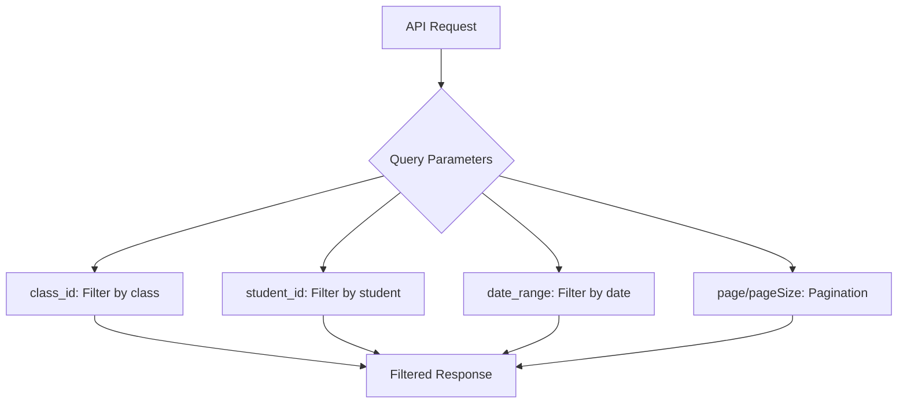
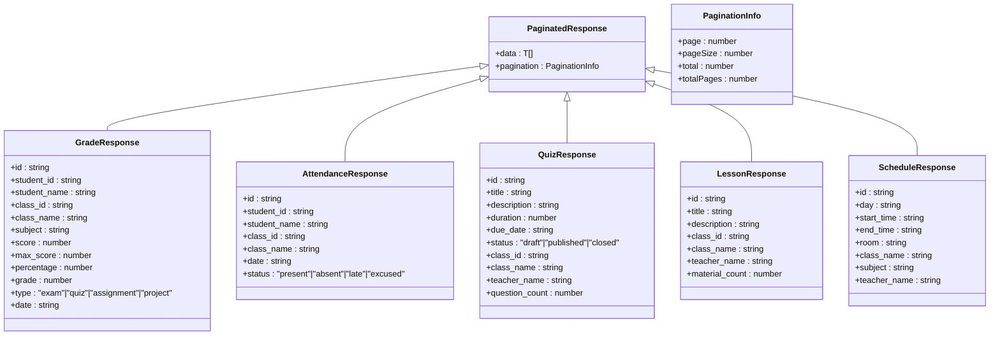
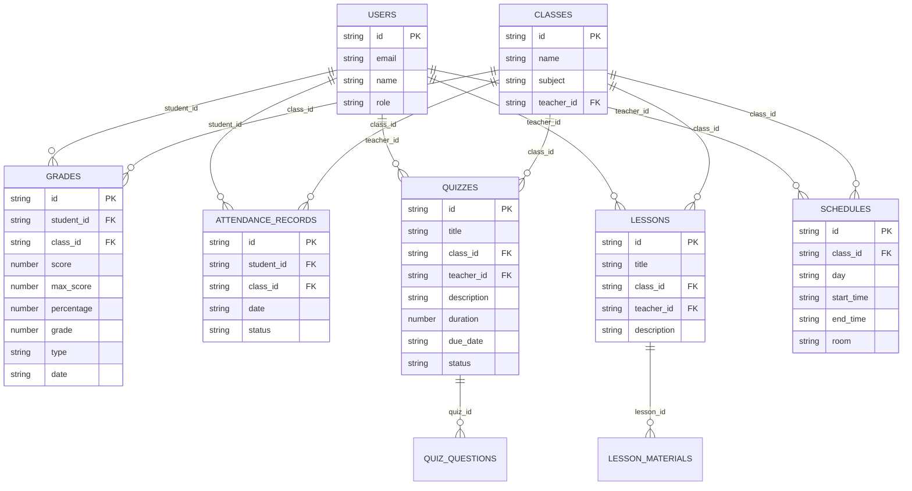
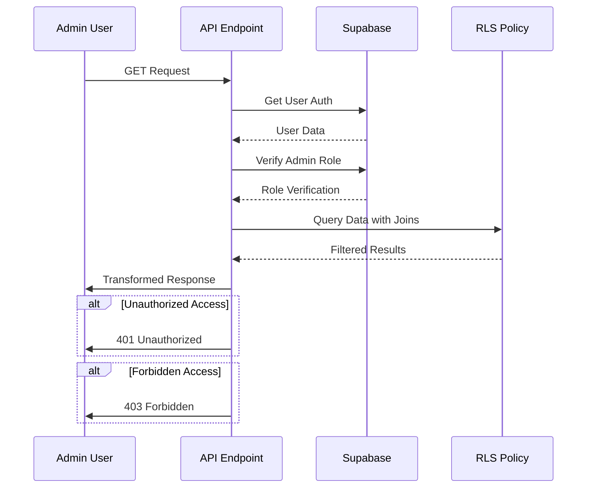
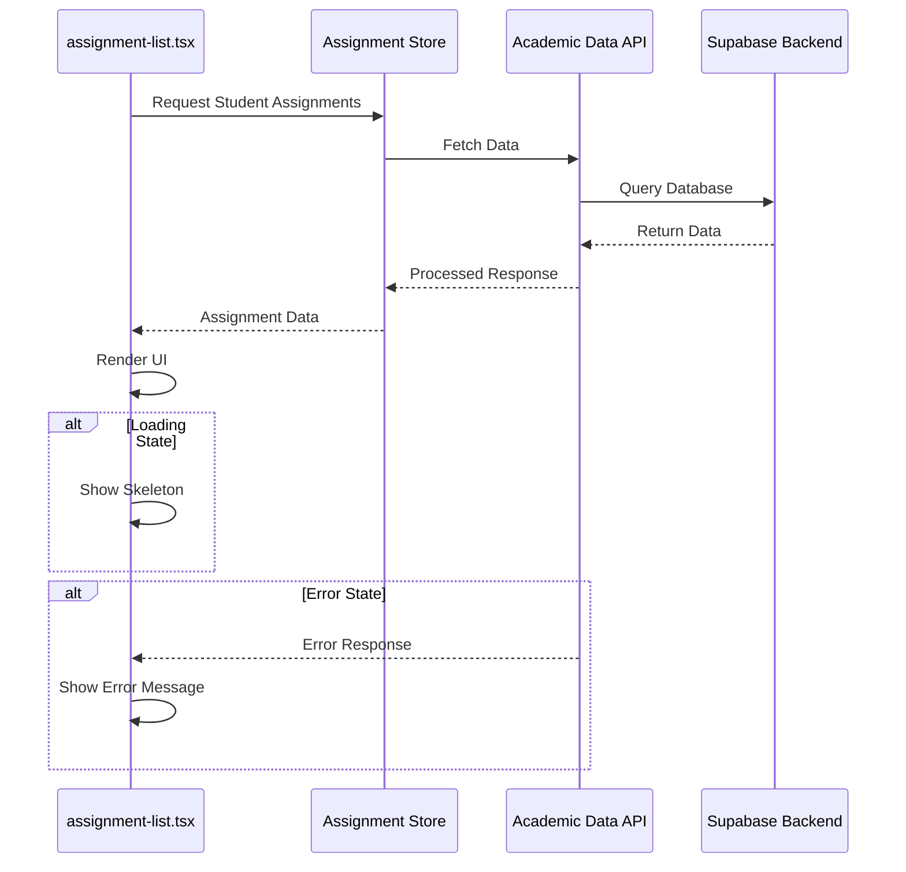
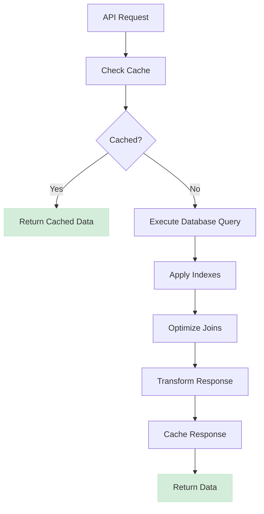
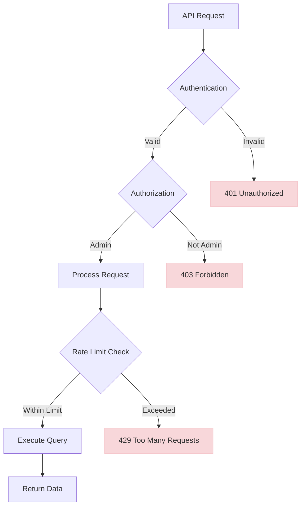

# Academic Data API

<cite>
**Referenced Files in This Document**   
- [grades/route.ts](file://app/api/admin/grades/route.ts)
- [quizzes/route.ts](file://app/api/admin/quizzes/route.ts)
- [schedule/route.ts](file://app/api/admin/schedule/route.ts)
- [lessons/route.ts](file://app/api/admin/lessons/route.ts)
- [attendance/route.ts](file://app/api/admin/attendance/route.ts)
- [types.ts](file://lib/supabase/types.ts)
- [performance_indexes.sql](file://supabase/migrations/20260108_performance_indexes.sql)
- [cache.ts](file://lib/cache.ts)
- [rate-limit.ts](file://lib/rate-limit.ts)
- [assignment-list.tsx](file://components/assignment-list.tsx)
- [calendar-view.tsx](file://components/calendar-view.tsx)
- [queries-optimized.ts](file://lib/supabase/queries-optimized.ts)
</cite>

## Table of Contents
1. [Introduction](#introduction)
2. [API Endpoints](#api-endpoints)
3. [Query Parameters](#query-parameters)
4. [Response Format](#response-format)
5. [Data Aggregation and Joins](#data-aggregation-and-joins)
6. [RLS Policies and Security](#rls-policies-and-security)
7. [Frontend Integration](#frontend-integration)
8. [Performance Optimizations](#performance-optimizations)
9. [Error Handling](#error-handling)
10. [Security Measures](#security-measures)

## Introduction
The Academic Data API provides administrators with secure access to academic records including grades, quizzes, schedules, lessons, and attendance. These endpoints are designed to aggregate data from multiple related tables while enforcing strict Row Level Security (RLS) policies to ensure data isolation. The API supports filtering through query parameters and returns paginated responses for efficient data retrieval. This documentation details the implementation, integration, and security aspects of these endpoints.

## API Endpoints

The Academic Data API exposes the following GET endpoints for admin access:

- **GET /api/admin/grades**: Retrieves academic grades with student and class information
- **GET /api/admin/quizzes**: Retrieves quiz data including associated classes and teachers
- **GET /api/admin/schedule**: Retrieves class schedules with teacher assignments
- **GET /api/admin/lessons**: Retrieves lesson plans with associated materials
- **GET /api/admin/attendance**: Retrieves attendance records with student details

All endpoints require admin authentication and follow a consistent response pattern with error handling and data transformation.

**Section sources**
- [grades/route.ts](file://app/api/admin/grades/route.ts#L4-L57)
- [quizzes/route.ts](file://app/api/admin/quizzes/route.ts#L4-L39)
- [schedule/route.ts](file://app/api/admin/schedule/route.ts#L4-L40)
- [lessons/route.ts](file://app/api/admin/lessons/route.ts#L4-L39)
- [attendance/route.ts](file://app/api/admin/attendance/route.ts#L4-L49)

## Query Parameters

The Academic Data API supports various query parameters for filtering and data retrieval. While the current implementation focuses on retrieving all records with proper joins, the architecture supports filtering by:

- **Class ID**: Filter academic data by specific class
- **Date range**: Filter records within a specific date range
- **Student ID**: Filter data for a specific student
- **Pagination**: Control data volume with page and pageSize parameters

These parameters can be extended to support more granular filtering based on administrative needs.

**Diagram sources**
- [queries-optimized.ts](file://lib/supabase/queries-optimized.ts#L9-L22)
- [grades/route.ts](file://app/api/admin/grades/route.ts#L24-L35)

## Response Format

The API returns paginated responses with a consistent structure across all endpoints. The response format is defined by types in lib/supabase/types.ts and follows a Data Transfer Object (DTO) pattern to ensure security and consistency.

**Diagram sources**
- [types.ts](file://lib/supabase/types.ts#L135-L155)
- [queries-optimized.ts](file://lib/supabase/queries-optimized.ts#L14-L22)

**Section sources**
- [types.ts](file://lib/supabase/types.ts#L135-L155)
- [grades/route.ts](file://app/api/admin/grades/route.ts#L37-L50)
- [attendance/route.ts](file://app/api/admin/attendance/route.ts#L35-L43)

## Data Aggregation and Joins

The Academic Data API endpoints aggregate data from multiple tables using Supabase's relational queries. Each endpoint performs joins to combine data from related tables, providing comprehensive information in a single response.

**Diagram sources**
- [grades/route.ts](file://app/api/admin/grades/route.ts#L27-L31)
- [quizzes/route.ts](file://app/api/admin/quizzes/route.ts#L25-L30)
- [schedule/route.ts](file://app/api/admin/schedule/route.ts#L25-L31)
- [lessons/route.ts](file://app/api/admin/lessons/route.ts#L25-L30)
- [attendance/route.ts](file://app/api/admin/attendance/route.ts#L25-L29)

## RLS Policies and Security

The Academic Data API enforces strict Row Level Security (RLS) policies to ensure data isolation and prevent unauthorized access. All endpoints verify the admin role before processing requests, and the underlying database implements RLS at the table level.

The RLS policies are implemented in the database migrations and ensure that:
- Only authenticated users can access data
- Admins have full access to academic records
- Data is properly isolated by user roles
- Sensitive information is protected

**Diagram sources**
- [grades/route.ts](file://app/api/admin/grades/route.ts#L13-L22)
- [security_hardening.sql](file://supabase/migrations/20250228_security_hardening.sql#L25-L32)
- [tighten_rls_policies.sql](file://supabase/migrations/20260107115657_tighten_rls_policies.sql#L1-L116)

**Section sources**
- [grades/route.ts](file://app/api/admin/grades/route.ts#L13-L22)
- [security_hardening.sql](file://supabase/migrations/20250228_security_hardening.sql#L25-L32)
- [secure_rls.sql](file://supabase/migrations/20240101000000_secure_rls.sql#L40-L43)

## Frontend Integration

The Academic Data API integrates with frontend components to provide a seamless user experience. Key components include assignment-list.tsx and calendar-view.tsx, which consume the API data and handle loading states and error conditions.

The integration includes:
- Loading states with skeleton screens
- Error handling with user-friendly messages
- Data caching to reduce API calls
- Type safety through TypeScript interfaces

**Diagram sources**
- [assignment-list.tsx](file://components/assignment-list.tsx#L46-L48)
- [calendar-view.tsx](file://components/calendar-view.tsx#L66-L86)

**Section sources**
- [assignment-list.tsx](file://components/assignment-list.tsx#L1-L271)
- [calendar-view.tsx](file://components/calendar-view.tsx#L1-L497)

## Performance Optimizations

The Academic Data API implements several performance optimizations to ensure fast response times and efficient database queries. These include database indexing, query optimization, and response caching.

Key performance optimizations include:

- **Database Indexing**: Strategic indexes on frequently queried columns
- **Query Optimization**: Efficient joins and proper query structure
- **Response Caching**: In-memory and server-side caching
- **Pagination**: Limiting data volume in responses

The database indexes are defined in supabase/migrations/20260108_performance_indexes.sql and target key columns for academic data queries.

**Diagram sources**
- [performance_indexes.sql](file://supabase/migrations/20260108_performance_indexes.sql#L1-L104)
- [cache.ts](file://lib/cache.ts#L6-L39)

**Section sources**
- [performance_indexes.sql](file://supabase/migrations/20260108_performance_indexes.sql#L1-L104)
- [cache.ts](file://lib/cache.ts#L6-L39)
- [queries-optimized.ts](file://lib/supabase/queries-optimized.ts#L204-L227)

## Error Handling

The Academic Data API implements comprehensive error handling to provide meaningful feedback for various error conditions. Errors are handled at multiple levels including authentication, authorization, database queries, and response processing.

Common error responses include:
- **401 Unauthorized**: When the user is not authenticated
- **403 Forbidden**: When the user lacks admin privileges
- **500 Internal Server Error**: For unexpected server errors
- **400 Bad Request**: For invalid query parameters

The error handling follows a consistent pattern across all endpoints, with proper logging and user-friendly error messages.

**Section sources**
- [grades/route.ts](file://app/api/admin/grades/route.ts#L53-L56)
- [quizzes/route.ts](file://app/api/admin/quizzes/route.ts#L36-L38)
- [schedule/route.ts](file://app/api/admin/schedule/route.ts#L37-L39)

## Security Measures

The Academic Data API implements multiple security measures to protect sensitive academic data and prevent abuse. These include role-based access control, rate limiting, and secure data handling practices.

Security measures include:
- **Role Verification**: All endpoints verify admin role
- **Rate Limiting**: Protection against bulk data export abuse
- **DTO Pattern**: Secure data transformation
- **RLS Policies**: Database-level data isolation

The rate limiting is implemented using the service role key to bypass RLS for the rate limiting table, ensuring reliable enforcement.

**Diagram sources**
- [rate-limit.ts](file://lib/rate-limit.ts#L25-L56)
- [grades/route.ts](file://app/api/admin/grades/route.ts#L13-L22)

**Section sources**
- [rate-limit.ts](file://lib/rate-limit.ts#L1-L56)
- [grades/route.ts](file://app/api/admin/grades/route.ts#L13-L22)
- [security_hardening.sql](file://supabase/migrations/20250228_security_hardening.sql#L1-L32)