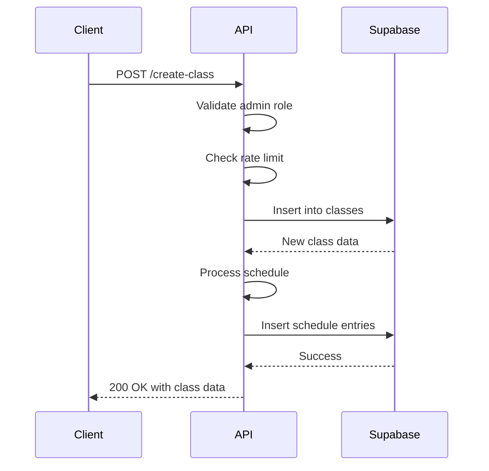
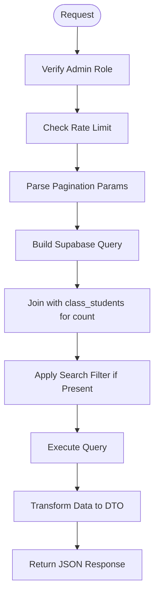
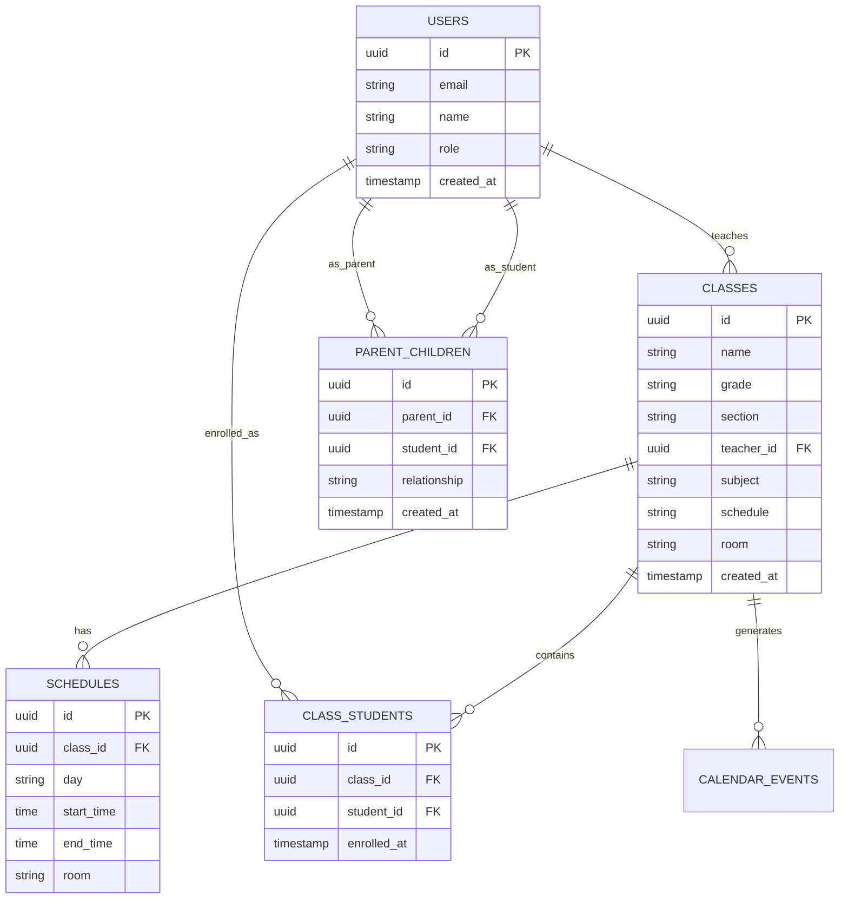

# Class & Enrollment API

<cite>
**Referenced Files in This Document**   
- [create-class/route.ts](file://app/api/admin/create-class/route.ts)
- [classes/route.ts](file://app/api/admin/classes/route.ts)
- [classes/[id]/route.ts](file://app/api/admin/classes/[id]/route.ts)
- [enroll-student/route.ts](file://app/api/admin/enroll-student/route.ts)
- [unenroll-student/route.ts](file://app/api/admin/unenroll-student/route.ts)
- [link-parent-child/route.ts](file://app/api/admin/link-parent-child/route.ts)
- [unlink-parent-child/route.ts](file://app/api/admin/unlink-parent-child/route.ts)
- [types.ts](file://lib/supabase/types.ts)
- [20251219043440_create_classes_table.sql](file://supabase/migrations/20251219043440_create_classes_table.sql)
- [20251219043556_create_schedule_table.sql](file://supabase/migrations/20251219043556_create_schedule_table.sql)
- [20260105082250_create_parent_tables.sql](file://supabase/migrations/20260105082250_create_parent_tables.sql)
</cite>

## Table of Contents
1. [Introduction](#introduction)
2. [Class Management Endpoints](#class-management-endpoints)
   - [Create Class (POST /create-class)](#create-class-post-create-class)
   - [List Classes (GET /classes)](#list-classes-get-classes)
   - [Update Class (PUT /classes/[id])](#update-class-put-classesid)
   - [Delete Class (DELETE /classes/[id])](#delete-class-delete-classesid)
3. [Enrollment Management Endpoints](#enrollment-management-endpoints)
   - [Enroll Student (POST /enroll-student)](#enroll-student-post-enroll-student)
   - [Unenroll Student (POST /unenroll-student)](#unenroll-student-post-unenroll-student)
4. [Parent-Child Relationship Endpoints](#parent-child-relationship-endpoints)
   - [Link Parent-Child (POST /link-parent-child)](#link-parent-child-post-link-parent-child)
   - [Unlink Parent-Child (POST /unlink-parent-child)](#unlink-parent-child-post-unlink-parent-child)
5. [Database Schema and Constraints](#database-schema-and-constraints)
6. [Real-Time Updates and Subscriptions](#real-time-updates-and-subscriptions)
7. [Error Handling and Validation](#error-handling-and-validation)
8. [Audit Logging and Data Integrity](#audit-logging-and-data-integrity)
9. [Performance Considerations](#performance-considerations)
10. [Integration with Frontend Components](#integration-with-frontend-components)

## Introduction
This document provides comprehensive technical documentation for the Class and Enrollment API endpoints in the School Management System. The API enables administrators to manage classes, student enrollments, and parent-child relationships with robust validation, security, and real-time capabilities. All endpoints require admin authentication and implement rate limiting to prevent abuse. The system leverages Supabase for database operations, authentication, and real-time subscriptions.

**Section sources**
- [create-class/route.ts](file://app/api/admin/create-class/route.ts#L1-L113)
- [types.ts](file://lib/supabase/types.ts#L1-L253)

## Class Management Endpoints

### Create Class (POST /create-class)
Creates a new class with schedule and teacher assignment.

**HTTP Method**: POST  
**URL**: `/api/admin/create-class`  
**Authentication**: Admin role required  
**Rate Limit**: 10 requests per minute

**Request Schema**:
```json
{
  "name": "string",
  "grade": "string",
  "section": "string",
  "subject": "string",
  "teacher_id": "string (optional)",
  "room": "string (optional)",
  "scheduleDays": "MWF|TTh|Daily|MF|MW|WF (optional)",
  "scheduleTime": "HH:MM AM/PM (optional)"
}
```

**Response Schema**:
```json
{
  "success": true,
  "class": {
    "id": "string",
    "name": "string",
    "grade": "string",
    "section": "string",
    "subject": "string",
    "teacher_id": "string|null",
    "room": "string|null",
    "schedule": "string|null",
    "created_at": "string"
  }
}
```

**Validation Logic**:
- Name and subject are required fields
- Schedule is validated using predefined day codes and 12-hour time format
- Teacher ID must reference an existing user
- Class name uniqueness is enforced at the database level

**Transaction Flow**:
1. Validate admin role and rate limits
2. Create class record in `classes` table
3. Generate schedule entries in `schedules` table based on input
4. Roll back class creation if schedule insertion fails



**Diagram sources**
- [create-class/route.ts](file://app/api/admin/create-class/route.ts#L28-L113)

**Section sources**
- [create-class/route.ts](file://app/api/admin/create-class/route.ts#L28-L113)
- [types.ts](file://lib/supabase/types.ts#L114-L124)

### List Classes (GET /classes)
Retrieves paginated list of all classes with enrollment statistics.

**HTTP Method**: GET  
**URL**: `/api/admin/classes?page=1&pageSize=50&search=term`  
**Authentication**: Admin role required  
**Rate Limit**: 30 requests per minute

**Query Parameters**:
- `page`: Page number (default: 1)
- `pageSize`: Number of items per page (default: 50)
- `search`: Text search on class name or subject

**Response Schema**:
```json
{
  "classes": [
    {
      "id": "string",
      "name": "string",
      "grade": "string",
      "section": "string",
      "subject": "string",
      "room": "string|null",
      "schedule": "string|null",
      "teacher_id": "string|null",
      "teacher_name": "string|null",
      "student_count": "number"
    }
  ],
  "pagination": {
    "page": "number",
    "pageSize": "number",
    "total": "number",
    "totalPages": "number"
  }
}
```

**Performance Features**:
- Uses database aggregation to count enrollments in a single query
- Implements pagination to prevent large data loads
- Applies search filtering with case-insensitive matching
- Transforms data using DTO pattern for security



**Diagram sources**
- [classes/route.ts](file://app/api/admin/classes/route.ts#L7-L89)

**Section sources**
- [classes/route.ts](file://app/api/admin/classes/route.ts#L7-L89)
- [types.ts](file://lib/supabase/types.ts#L114-L124)

### Update Class (PUT /classes/[id])
Updates existing class information.

**HTTP Method**: PUT  
**URL**: `/api/admin/classes/[id]`  
**Authentication**: Admin role required

**Request Schema**:
```json
{
  "name": "string (optional)",
  "grade": "string (optional)",
  "section": "string (optional)",
  "subject": "string (optional)",
  "teacher_id": "string (optional)",
  "room": "string (optional)",
  "schedule": "string (optional)"
}
```

**Response Schema**:
```json
{
  "success": true
}
```

**Update Logic**:
- Partial updates allowed (only provided fields are updated)
- Teacher ID can be set to null
- No validation of schedule format (stored as text)
- Generic error messages for security

**Section sources**
- [classes/[id]/route.ts](file://app/api/admin/classes/[id]/route.ts#L4-L54)
- [types.ts](file://lib/supabase/types.ts#L114-L124)

### Delete Class (DELETE /classes/[id])
Deletes a class and all related records.

**HTTP Method**: DELETE  
**URL**: `/api/admin/classes/[id]`  
**Authentication**: Admin role required

**Deletion Cascade**:
1. Delete all schedule entries for the class
2. Remove all student enrollments for the class
3. Delete the class record

**Foreign Key Constraints**:
- `schedules.class_id` has ON DELETE CASCADE
- `class_students.class_id` has ON DELETE CASCADE

**Section sources**
- [classes/[id]/route.ts](file://app/api/admin/classes/[id]/route.ts#L56-L99)
- [20251219043440_create_classes_table.sql](file://supabase/migrations/20251219043440_create_classes_table.sql#L1-L23)

## Enrollment Management Endpoints

### Enroll Student (POST /enroll-student)
Enrolls a student in a class.

**HTTP Method**: POST  
**URL**: `/api/admin/enroll-student`  
**Authentication**: Admin role required

**Request Schema**:
```json
{
  "studentId": "string",
  "classId": "string"
}
```

**Response Schema**:
```json
{
  "success": true
}
```

**Validation and Constraints**:
- Student ID and class ID are required
- Database enforces unique constraint on (class_id, student_id) pair
- Foreign key constraints ensure valid references to classes and users tables
- Duplicate enrollment attempts return 400 error

**Section sources**
- [enroll-student/route.ts](file://app/api/admin/enroll-student/route.ts#L4-L43)
- [20251219043440_create_classes_table.sql](file://supabase/migrations/20251219043440_create_classes_table.sql#L13-L19)

### Unenroll Student (POST /unenroll-student)
Removes a student from a class.

**HTTP Method**: POST  
**URL**: `/api/admin/unenroll-student`  
**Authentication**: Admin role required

**Request Schema**:
```json
{
  "enrollmentId": "string"
}
```

**Response Schema**:
```json
{
  "success": true
}
```

**Unenrollment Logic**:
- Uses the unique enrollment record ID rather than student/class combination
- Direct deletion from `class_students` table
- No cascade effects (only removes enrollment)

**Section sources**
- [unenroll-student/route.ts](file://app/api/admin/unenroll-student/route.ts#L4-L39)
- [20251219043440_create_classes_table.sql](file://supabase/migrations/20251219043440_create_classes_table.sql#L13-L19)

## Parent-Child Relationship Endpoints

### Link Parent-Child (POST /link-parent-child)
Establishes a relationship between a parent and student.

**HTTP Method**: POST  
**URL**: `/api/admin/link-parent-child`  
**Authentication**: Admin role required

**Request Schema**:
```json
{
  "parentId": "string",
  "studentId": "string",
  "relationship": "mother|father|guardian|other (optional)"
}
```

**Response Schema**:
```json
{
  "success": true
}
```

**Validation Rules**:
- Parent ID and student ID are required
- Relationship defaults to "guardian" if not specified
- Unique constraint prevents duplicate parent-student relationships
- Database checks enforce valid user references

**Error Handling**:
- Returns 400 for missing IDs
- Returns 400 with specific message for duplicate relationships (PostgreSQL error code 23505)

**Section sources**
- [link-parent-child/route.ts](file://app/api/admin/link-parent-child/route.ts#L4-L61)
- [20260105082250_create_parent_tables.sql](file://supabase/migrations/20260105082250_create_parent_tables.sql#L6-L13)

### Unlink Parent-Child (POST /unlink-parent-child)
Removes a parent-child relationship.

**HTTP Method**: POST  
**URL**: `/api/admin/unlink-parent-child`  
**Authentication**: Admin role required

**Request Schema**:
```json
{
  "parentId": "string",
  "studentId": "string"
}
```

**Response Schema**:
```json
{
  "success": true
}
```

**Deletion Logic**:
- Matches both parent_id and student_id to find the relationship
- Removes the record from `parent_children` table
- No cascade deletion of user accounts

**Section sources**
- [unlink-parent-child/route.ts](file://app/api/admin/unlink-parent-child/route.ts#L4-L51)
- [20260105082250_create_parent_tables.sql](file://supabase/migrations/20260105082250_create_parent_tables.sql#L6-L13)

## Database Schema and Constraints
The class and enrollment system uses multiple interconnected tables with strict referential integrity.



**Diagram sources**
- [20251219043440_create_classes_table.sql](file://supabase/migrations/20251219043440_create_classes_table.sql#L1-L23)
- [20251219043556_create_schedule_table.sql](file://supabase/migrations/20251219043556_create_schedule_table.sql#L1-L11)
- [20260105082250_create_parent_tables.sql](file://supabase/migrations/20260105082250_create_parent_tables.sql#L6-L13)

**Section sources**
- [20251219043440_create_classes_table.sql](file://supabase/migrations/20251219043440_create_classes_table.sql#L1-L23)
- [20251219043556_create_schedule_table.sql](file://supabase/migrations/20251219043556_create_schedule_table.sql#L1-L11)
- [20260105082250_create_parent_tables.sql](file://supabase/migrations/20260105082250_create_parent_tables.sql#L6-L13)

## Real-Time Updates and Subscriptions
The system supports real-time updates through Supabase's realtime capabilities.

**Subscription Setup**:
- All relevant tables have RLS (Row Level Security) enabled
- The frontend can subscribe to changes on:
  - `classes` table for class creation/updates
  - `class_students` table for enrollment changes
  - `parent_children` table for relationship updates
  - `schedules` table for schedule modifications

**Real-Time Events**:
- `INSERT`: New record created
- `UPDATE`: Existing record modified
- `DELETE`: Record removed

**Frontend Integration**:
```typescript
// Example subscription in data-table.tsx
const channel = supabase
  .channel('class-changes')
  .on('postgres_changes', {
    event: '*',
    schema: 'public',
    table: 'classes'
  }, (payload) => {
    // Update UI with new class data
    refreshDataTable();
  })
  .subscribe();
```

**Section sources**
- [types.ts](file://lib/supabase/types.ts#L114-L124)
- [20251219043440_create_classes_table.sql](file://supabase/migrations/20251219043440_create_classes_table.sql#L21-L23)

## Error Handling and Validation
The API implements comprehensive error handling for data integrity and user experience.

**Common Error Cases**:
- **400 Bad Request**: Missing required fields, invalid data format
- **401 Unauthorized**: No authentication or invalid session
- **403 Forbidden**: User lacks admin role
- **409 Conflict**: Duplicate enrollment or relationship
- **429 Too Many Requests**: Rate limit exceeded
- **500 Internal Server Error**: Unexpected server error

**Specific Validation Rules**:
- Class creation requires name and subject
- Schedule validation uses predefined day codes (MWF, TTh, etc.)
- Enrollment prevents duplicate class-student combinations
- Parent-child relationships enforce unique parent-student pairs
- All admin endpoints verify user role before processing

**Section sources**
- [create-class/route.ts](file://app/api/admin/create-class/route.ts#L59-L61)
- [enroll-student/route.ts](file://app/api/admin/enroll-student/route.ts#L26-L28)
- [link-parent-child/route.ts](file://app/api/admin/link-parent-child/route.ts#L26-L31)
- [types.ts](file://lib/supabase/types.ts#L2-L253)

## Audit Logging and Data Integrity
All class and enrollment operations are subject to audit logging and data integrity controls.

**Audit Trail**:
- Every API call is logged with user ID, IP address, and action
- The `audit_logs` table captures all changes to class and enrollment data
- Logs include payload information for forensic analysis

**Data Integrity Measures**:
- Foreign key constraints ensure referential integrity
- Unique constraints prevent duplicate enrollments and relationships
- Cascading deletes maintain consistency when classes are removed
- Row Level Security (RLS) policies control data access
- DTO pattern prevents over-exposure of sensitive data

**Section sources**
- [types.ts](file://lib/supabase/types.ts#L245-L252)
- [20251219043440_create_classes_table.sql](file://supabase/migrations/20251219043440_create_classes_table.sql#L21-L23)

## Performance Considerations
The API includes several performance optimizations for scalability.

**Optimization Strategies**:
- **Pagination**: Class listing supports pagination to handle large datasets
- **Aggregation**: Student counts are retrieved via database aggregation, not separate queries
- **Indexing**: Database indexes on foreign keys and frequently queried fields
- **Caching**: Class rosters can be cached using the `cache.ts` utility
- **Bulk Operations**: The `data-table.tsx` component supports bulk enrollment changes
- **Rate Limiting**: Prevents abuse and ensures fair resource usage

**Large-Scale Enrollment Updates**:
- For bulk operations, use the frontend's data-table component
- Process changes in batches to avoid timeouts
- Implement optimistic UI updates with error rollback
- Monitor database performance during large enrollment periods

**Section sources**
- [classes/route.ts](file://app/api/admin/classes/route.ts#L34-L42)
- [lib/cache.ts](file://lib/cache.ts)
- [components/data-table.tsx](file://components/data-table.tsx)

## Integration with Frontend Components
The API endpoints are designed to work seamlessly with frontend components.

**Key Integrations**:
- **data-table.tsx**: Provides bulk operations interface for class management
- **admin/classes/page.tsx**: Uses the classes API to display and manage classes
- **audit-logs/page.tsx**: Tracks all enrollment and class changes
- **students/[id]/page.tsx**: Shows enrollment status and allows modifications

**Component Flow**:
1. Admin navigates to classes management page
2. Data-table loads classes via GET /classes with pagination
3. User performs bulk enrollment changes
4. Changes are sent via POST /enroll-student in batch
5. Real-time subscriptions update the UI immediately
6. All changes are logged in audit logs

**Section sources**
- [components/data-table.tsx](file://components/data-table.tsx)
- [app/admin/classes/page.tsx](file://app/admin/classes/page.tsx)
- [app/admin/audit-logs/page.tsx](file://app/admin/audit-logs/page.tsx)