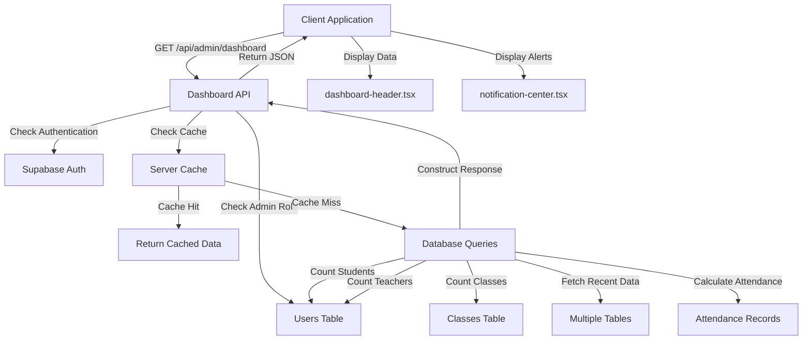
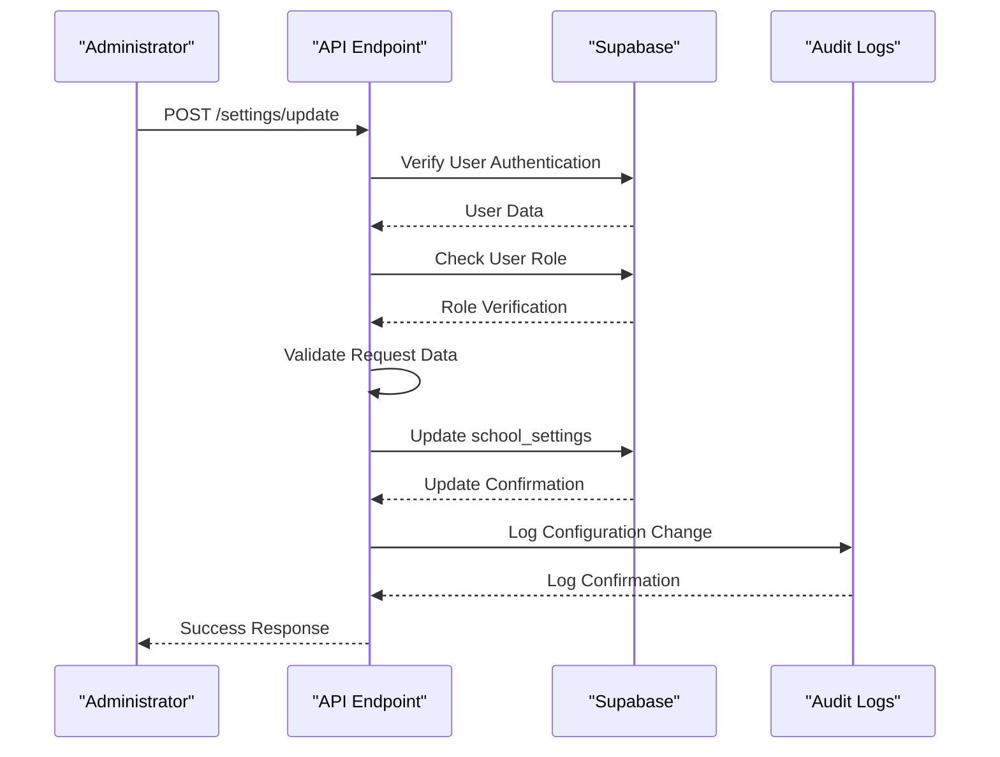

# System Operations API

<cite>
**Referenced Files in This Document**   
- [settings/update/route.ts](file://app/api/admin/settings/update/route.ts)
- [dashboard/route.ts](file://app/api/admin/dashboard/route.ts)
- [link-account/route.ts](file://app/api/admin/link-account/route.ts)
- [types.ts](file://lib/supabase/types.ts)
- [dashboard-header.tsx](file://components/dashboard-header.tsx)
- [notification-center.tsx](file://components/notification-center.tsx)
- [create_school_settings_table.sql](file://supabase/migrations/20251219043619_create_school_settings_table.sql)
- [audit-logs.ts](file://lib/supabase/audit-logs.ts)
- [rate-limit.ts](file://lib/rate-limit.ts)
- [security.ts](file://lib/security.ts)
- [session-security.ts](file://lib/session-security.ts)
</cite>

## Table of Contents
1. [Introduction](#introduction)
2. [Settings Update Endpoint](#settings-update-endpoint)
3. [Dashboard Analytics Endpoint](#dashboard-analytics-endpoint)
4. [Account Linking Endpoint](#account-linking-endpoint)
5. [Security and Audit Logging](#security-and-audit-logging)
6. [Rate Limiting Implementation](#rate-limiting-implementation)
7. [Troubleshooting Guide](#troubleshooting-guide)
8. [Conclusion](#conclusion)

## Introduction
The System Operations API provides administrators with essential tools for managing school-wide configurations, monitoring system health, and linking user accounts. This document details three critical endpoints: settings update, dashboard analytics, and account linking. Each endpoint is secured with role-based access control, comprehensive validation, and audit logging to ensure system integrity and security. The API leverages Supabase for database operations and implements robust security measures including rate limiting, session validation, and IP address hashing.

## Settings Update Endpoint

The settings update endpoint (`POST /api/admin/settings/update`) allows administrators to modify school-wide configurations that affect various system behaviors including attendance tracking and grading policies.

### Request Structure
The endpoint accepts a JSON payload with the following structure:
- **name**: School name (string, 1-100 characters)
- **latitude**: Geographic latitude (-90 to 90)
- **longitude**: Geographic longitude (-180 to 180)
- **radiusMeters**: Attendance check-in radius (10-5000 meters)

### Validation Rules
The request is validated using Zod schema validation with the following constraints:
- Name must be between 1 and 100 characters
- Latitude must be within valid geographic bounds (-90 to 90)
- Longitude must be within valid geographic bounds (-180 to 180)
- Radius must be between 10 and 5000 meters to ensure reasonable attendance tracking

### Response Payload
The endpoint returns a JSON response with the following possible formats:
- Success: `{ "success": true }` with HTTP 200 status
- Validation error: `{ "error": "Invalid settings: [detailed message]" }` with HTTP 400 status
- Authentication error: `{ "error": "Unauthorized" }` with HTTP 401 status
- Authorization error: `{ "error": "Forbidden" }` with HTTP 403 status
- Server error: `{ "error": "[error message]" }` with HTTP 500 status

### Settings Propagation and Persistence
When settings are updated, they are persisted securely in the `school_settings` database table using an upsert operation with a fixed ID of "1". This ensures there is only one system-wide configuration record. The update operation automatically sets the `updated_at` timestamp to the current time.

The settings propagate across the system as follows:
- **Attendance policies**: The `radius_meters` value determines the geofencing radius for QR check-in attendance, affecting all attendance tracking system-wide
- **Geolocation**: Latitude and longitude coordinates are used for distance calculations in attendance verification and may be used in mapping features
- **School identification**: The school name appears in system-wide communications, reports, and UI elements

The database schema enforces data integrity with appropriate constraints and uses Row Level Security (RLS) to restrict access to authorized personnel only.

**Section sources**
- [settings/update/route.ts](file://app/api/admin/settings/update/route.ts)
- [create_school_settings_table.sql](file://supabase/migrations/20251219043619_create_school_settings_table.sql)
- [types.ts](file://lib/supabase/types.ts#L236-L243)

## Dashboard Analytics Endpoint

The dashboard analytics endpoint (`GET /api/admin/dashboard`) provides administrators with a comprehensive overview of system metrics and recent activities.

### Data Aggregation
The endpoint aggregates key metrics from multiple data sources:
- **User counts**: Total students, teachers, and classes
- **Attendance rate**: Percentage of present attendance records across all students
- **Recent activities**: Latest student enrollments, attendance records, and top grades
- **Class information**: Current classes with student counts

### Response Structure
The response payload includes the following fields:
- **totalStudents**: Count of all student users
- **totalTeachers**: Count of all teacher users
- **totalClasses**: Count of all classes
- **attendanceRate**: Percentage of attendance marked as "present"
- **recentStudents**: Array of recently enrolled students with their grade and section
- **recentAttendance**: Array of recent attendance records with student names and status
- **topGrades**: Array of highest-scoring grade records with student names and subjects
- **classes**: Array of classes with teacher assignments and student counts

### Caching Strategy
The dashboard implements a 30-second server-side cache using the `serverCache` utility to improve performance and reduce database load. The cache key is based on the requesting user's ID, ensuring personalized caching while maintaining security.

### Integration with UI Components
The dashboard data is consumed by two key UI components:

**Dashboard Header**: The `dashboard-header.tsx` component displays the main navigation and user interface elements. It accepts props for title, subtitle, and user information, and renders the notification center for the specified user.

**Notification Center**: The `notification-center.tsx` component provides a popover interface for viewing and managing notifications. It displays unread counts, allows marking notifications as read, and supports different notification types with appropriate icons and colors.

**Diagram sources **
- [dashboard/route.ts](file://app/api/admin/dashboard/route.ts)
- [dashboard-header.tsx](file://components/dashboard-header.tsx)
- [notification-center.tsx](file://components/notification-center.tsx)

**Section sources**
- [dashboard/route.ts](file://app/api/admin/dashboard/route.ts)
- [dashboard-header.tsx](file://components/dashboard-header.tsx)
- [notification-center.tsx](file://components/notification-center.tsx)

## Account Linking Endpoint

The account linking endpoint (`POST /api/admin/link-account`) enables administrators to connect user accounts with their respective profiles, either as students or teachers.

### Request Structure
The endpoint accepts a JSON payload with the following parameters:
- **targetUserId**: The ID of the user account to link (required)
- **profileData**: Profile information specific to the user role (required)
- **role**: The role of the user ("student" or "teacher") (required)

For student accounts, profile data includes comprehensive information such as:
- Personal details (first_name, middle_name, last_name, name_extension)
- Contact information and address components
- Parent/guardian details
- Academic information (grade, section, enrollment status)
- Health and special needs information

For teacher accounts, profile data includes:
- Subject specialization
- Department affiliation
- Join date

### Processing Logic
The endpoint processes the request in two main steps:

1. **User Record Update**: Updates the base user record with name and contact information. For students, the full name is constructed from the component parts, while for teachers, the provided name is used directly.

2. **Profile Record Update**: Performs an upsert operation on the appropriate profile table:
   - Student profiles are updated in the `student_profiles` table
   - Teacher profiles are updated in the `teacher_profiles` table

The endpoint handles address construction for students by combining street, barangay, city, and province components into a single address field.

### Response Payload
The endpoint returns a JSON response with the following possible formats:
- Success: `{ "success": true }` with HTTP 200 status
- Missing parameters: `{ "error": "Missing parameters" }` with HTTP 400 status
- Authentication error: `{ "error": "Unauthorized" }` with HTTP 401 status
- Authorization error: `{ "error": "Forbidden" }` with HTTP 403 status
- Server error: `{ "error": "[error message]" }` with HTTP 500 status

**Section sources**
- [link-account/route.ts](file://app/api/admin/link-account/route.ts)
- [types.ts](file://lib/supabase/types.ts#L38-L113)

## Security and Audit Logging

The System Operations API implements comprehensive security measures to protect sensitive administrative functions.

### Authentication and Authorization
All endpoints require authentication via Supabase Auth. The system verifies the user's identity and role before processing any request. Only users with the "admin" role are permitted to access these endpoints, as verified by querying the `users` table for the requesting user's role.

### Audit Logging
All configuration changes are automatically logged in the audit system. The `audit-logs.ts` utility provides functions for:
- Recording configuration changes with user ID, action type, and IP address
- Querying audit logs with filters for user, action, date range, and IP address
- Generating audit log statistics for monitoring system activity
- Detecting suspicious activity patterns such as multiple failed attempts

The audit logs are stored in the `auth.audit_log_entries` table and are accessible through the `audit_logs_with_users` view, which joins log entries with user information for easier querying.

**Diagram sources **
- [settings/update/route.ts](file://app/api/admin/settings/update/route.ts)
- [audit-logs.ts](file://lib/supabase/audit-logs.ts)

**Section sources**
- [settings/update/route.ts](file://app/api/admin/settings/update/route.ts)
- [audit-logs.ts](file://lib/supabase/audit-logs.ts)

## Rate Limiting Implementation

The system implements rate limiting to protect against abuse of sensitive administrative operations.

### Rate Limiting Architecture
The rate limiting system consists of:
- A `rate_limits` database table that tracks request counts and timestamps
- A `check_rate_limit` PostgreSQL function that performs atomic rate limit checks
- A `rate-limit.ts` utility that provides a TypeScript interface to the rate limiting system

The `rate_limits` table stores:
- **key**: Unique identifier for the rate limit (typically "identifier:endpoint")
- **count**: Current request count within the window
- **last_request**: Timestamp of the last request in milliseconds

### Rate Limit Function
The `check_rate_limit` function is implemented as a SECURITY DEFINER function in PostgreSQL, allowing it to bypass Row Level Security policies. The function:
- Uses atomic INSERT ... ON CONFLICT to ensure the rate limit record exists
- Locks the row with FOR UPDATE to prevent race conditions
- Checks if the current request falls within the allowed window and count
- Resets the counter if the window has expired
- Increments the counter for valid requests

The function is called via Supabase's RPC mechanism from the `checkRateLimit` utility function, which handles errors according to a fail-open policy by default, except for security-critical endpoints.

### Security Hardening
The rate limiting implementation includes several security hardening measures:
- The function's search_path is explicitly set to empty string to prevent search path injection attacks
- The service role key is used for database access, ensuring system-level access regardless of RLS policies
- IP addresses are hashed before storage to protect user privacy while still enabling abuse detection

**Section sources**
- [rate-limit.ts](file://lib/rate-limit.ts)
- [20260101070343_rate_limit_rpc.sql](file://supabase/migrations/20260101070343_rate_limit_rpc.sql)
- [20260107115626_fix_function_search_path_v2.sql](file://supabase/migrations/20260107115626_fix_function_search_path_v2.sql)

## Troubleshooting Guide

This section provides guidance for common issues encountered with the System Operations API.

### Failed Settings Updates
**Symptoms**: Receiving 400 Bad Request responses with validation error messages.

**Causes and Solutions**:
- **Invalid latitude/longitude**: Ensure coordinates are within valid ranges (-90 to 90 for latitude, -180 to 180 for longitude)
- **Radius too small or large**: Verify the radius is between 10 and 5000 meters
- **School name too long**: Ensure the name is 100 characters or less
- **Missing authentication**: Confirm the request includes valid authentication credentials
- **Insufficient permissions**: Verify the user has the "admin" role

### Stale Dashboard Data
**Symptoms**: Dashboard displays outdated information despite recent changes.

**Causes and Solutions**:
- **Caching**: The dashboard data is cached for 30 seconds. Wait for the cache to expire or refresh the page
- **Database replication lag**: In distributed database systems, there might be a brief delay in data propagation
- **Network issues**: Check the browser's developer tools for failed API requests

### Account Linking Failures
**Symptoms**: Receiving 400 Bad Request responses with "Missing parameters" error.

**Causes and Solutions**:
- **Missing required fields**: Ensure the request includes targetUserId, profileData, and role
- **Invalid user ID**: Verify the targetUserId exists in the system
- **Incomplete profile data**: For students, ensure all required profile fields are provided
- **Role mismatch**: Confirm the role is either "student" or "teacher"

### Authentication and Authorization Issues
**Symptoms**: Receiving 401 Unauthorized or 403 Forbidden responses.

**Causes and Solutions**:
- **Expired session**: Log out and log back in to refresh the authentication token
- **Incorrect role**: Verify the user has the "admin" role in the users table
- **Origin mismatch**: Ensure the request originates from the authorized domain
- **Rate limiting**: Wait for the rate limit window to expire if too many requests have been made

### Performance Considerations
If the dashboard loads slowly:
- The initial request may be slow due to cache population
- Subsequent requests within 30 seconds should be fast due to caching
- Monitor database performance if slow loading persists

**Section sources**
- [settings/update/route.ts](file://app/api/admin/settings/update/route.ts)
- [dashboard/route.ts](file://app/api/admin/dashboard/route.ts)
- [link-account/route.ts](file://app/api/admin/link-account/route.ts)
- [security.ts](file://lib/security.ts)
- [session-security.ts](file://lib/session-security.ts)

## Conclusion
The System Operations API provides administrators with powerful tools for managing school-wide configurations, monitoring system health, and linking user accounts. The API is designed with security, reliability, and usability in mind, implementing comprehensive validation, role-based access control, audit logging, and rate limiting. The settings update endpoint allows for centralized configuration management that propagates across the system, affecting attendance policies and other school-wide behaviors. The dashboard analytics endpoint provides real-time insights into system metrics with efficient caching to ensure responsive performance. The account linking endpoint enables administrators to properly configure user accounts with their respective profiles. Together, these endpoints form a robust foundation for system administration in the school management system.