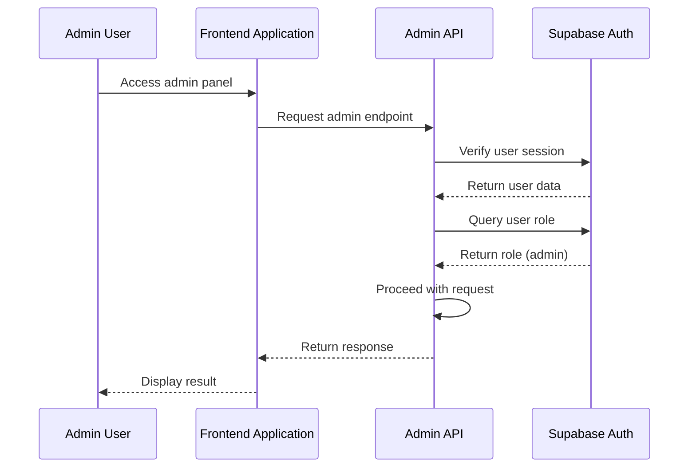
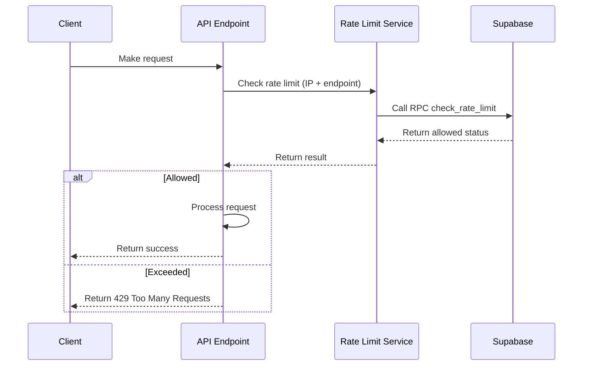

# User Management API

<cite>
**Referenced Files in This Document**   
- [create-user/route.ts](file://app/api/admin/create-user/route.ts)
- [get-users/route.ts](file://app/api/admin/get-users/route.ts)
- [toggle-user-status/route.ts](file://app/api/admin/toggle-user-status/route.ts)
- [students/route.ts](file://app/api/admin/students/route.ts)
- [teachers/route.ts](file://app/api/admin/teachers/route.ts)
- [parents/route.ts](file://app/api/admin/parents/route.ts)
- [types.ts](file://lib/supabase/types.ts)
- [admin-session-guard.tsx](file://components/admin-session-guard.tsx)
- [rate-limit.ts](file://lib/rate-limit.ts)
- [audit-monitor.ts](file://lib/audit-monitor.ts)
- [student-form.tsx](file://components/student-form.tsx)
</cite>

## Table of Contents
1. [Introduction](#introduction)
2. [Authentication and Authorization](#authentication-and-authorization)
3. [Rate Limiting](#rate-limiting)
4. [Audit Logging](#audit-logging)
5. [Core Endpoints](#core-endpoints)
   - [POST /api/admin/create-user](#post-apimadmincreate-user)
   - [GET /api/admin/get-users](#get-apimadminget-users)
   - [POST /api/admin/toggle-user-status](#post-apimadmintoggle-user-status)
6. [Related Endpoints](#related-endpoints)
   - [GET /api/admin/students](#get-apimadminstudents)
   - [GET /api/admin/teachers](#get-apimadminteachers)
   - [GET /api/admin/parents](#get-apimadminparents)
7. [Data Models](#data-models)
8. [Security Considerations](#security-considerations)
9. [Usage Examples](#usage-examples)
10. [Error Handling](#error-handling)

## Introduction
This document provides comprehensive API documentation for the Admin User Management system in the School Management System. The API enables administrators to create, retrieve, and manage user accounts for students, teachers, and parents. The system enforces strict security measures including role-based access control, rate limiting, and audit logging to protect sensitive user data and prevent abuse.

The user management system is built on Supabase for authentication and data storage, with Row Level Security (RLS) policies enforcing data access controls at the database level. All admin operations require authenticated admin users and include multiple layers of security validation.

**Section sources**
- [create-user/route.ts](file://app/api/admin/create-user/route.ts)
- [get-users/route.ts](file://app/api/admin/get-users/route.ts)
- [toggle-user-status/route.ts](file://app/api/admin/toggle-user-status/route.ts)

## Authentication and Authorization
The Admin User Management API requires authenticated admin users for all operations. Authentication is enforced through the `admin-session-guard.tsx` component and server-side role verification.

Admin users must be authenticated via Supabase Auth, and their role is verified by querying the `users` table to confirm they have the "admin" role. This server-side role verification prevents privilege escalation attacks by ensuring that only users with the admin role can access these endpoints.

The `admin-session-guard.tsx` component implements session timeout functionality with a 30-minute inactivity timeout and an 8-hour absolute timeout, providing an additional layer of security for admin sessions.



**Diagram sources**
- [admin-session-guard.tsx](file://components/admin-session-guard.tsx)
- [create-user/route.ts](file://app/api/admin/create-user/route.ts)
- [get-users/route.ts](file://app/api/admin/get-users/route.ts)

**Section sources**
- [admin-session-guard.tsx](file://components/admin-session-guard.tsx)
- [create-user/route.ts](file://app/api/admin/create-user/route.ts)
- [get-users/route.ts](file://app/api/admin/get-users/route.ts)

## Rate Limiting
The API implements rate limiting to prevent abuse and brute force attacks. The rate limiting system is implemented in `lib/rate-limit.ts` and uses Supabase's RPC (Remote Procedure Call) functionality to ensure atomic operations and prevent race conditions.

Rate limits are applied per IP address and endpoint, with configurable limits and time windows. The system uses the Service Role Key to bypass RLS policies, ensuring reliable rate limiting even during high load or database contention.



**Diagram sources**
- [rate-limit.ts](file://lib/rate-limit.ts)
- [create-user/route.ts](file://app/api/admin/create-user/route.ts)

**Section sources**
- [rate-limit.ts](file://lib/rate-limit.ts)
- [create-user/route.ts](file://app/api/admin/create-user/route.ts)

## Audit Logging
All admin user management operations are logged for security and compliance purposes. The audit logging system is implemented in `lib/audit-monitor.ts` and integrates with the Supabase notifications system to alert administrators of suspicious activities.

Critical actions such as user creation, status changes, and deletions are recorded in the audit logs with the user ID, action type, IP address, and timestamp. The system can detect suspicious patterns and send security alerts to admin users.

**Section sources**
- [audit-monitor.ts](file://lib/audit-monitor.ts)

## Core Endpoints

### POST /api/admin/create-user
Creates a new user account for a student, teacher, or parent. This endpoint requires admin authentication and implements comprehensive validation and security measures.

**Authentication**: Admin only (verified server-side)  
**Rate Limit**: 10 requests per 10 minutes per IP  
**CSRF Protection**: Origin validation required  

#### Request Body Schema
The request body schema varies by user role:

**Common Fields**:
- `email` (string): User's email address (required)
- `name` (string): Full name of the user (required)
- `role` (string): User role ("student", "teacher", or "parent") (required)
- `password` (string): User password (optional, auto-generated if not provided)

**Student-Specific Fields**:
- `lrn` (string): Learner Reference Number (required for students)

**Teacher-Specific Fields**:
- `subject` (string): Subject taught by the teacher
- `department` (string): Department affiliation

**Parent-Specific Fields**:
- `phone` (string): Contact phone number
- `address` (string): Physical address

#### Response Structure
```json
{
  "success": true,
  "user": {
    "id": "string",
    "email": "string",
    "name": "string",
    "role": "string",
    "created_at": "string"
  },
  "password": "string" // Only returned if auto-generated
}
```

When no password is provided, the system generates a 12-character password with uppercase, lowercase, numbers, and special characters, which is returned in the response for admin use.

**Section sources**
- [create-user/route.ts](file://app/api/admin/create-user/route.ts)

### GET /api/admin/get-users
Retrieves a paginated list of all users in the system. This endpoint supports filtering and pagination for efficient data retrieval.

**Authentication**: Admin only  
**Rate Limit**: 30 requests per minute per IP  
**Query Parameters**:
- `page` (integer): Page number (default: 1)
- `limit` (integer): Number of users per page (default: 50, max: 100)

#### Response Structure
```json
{
  "users": [
    {
      "id": "string",
      "email": "string",
      "name": "string",
      "role": "string",
      "created_at": "string",
      "is_active": "boolean"
    }
  ],
  "total": "integer",
  "page": "integer",
  "limit": "integer"
}
```

The response includes user metadata but excludes sensitive information like passwords. The `is_active` field indicates whether the user account is currently active.

**Section sources**
- [get-users/route.ts](file://app/api/admin/get-users/route.ts)

### POST /api/admin/toggle-user-status
Toggles the active status of a user account. This endpoint allows administrators to disable or re-enable user accounts.

**Authentication**: Admin only  
**Rate Limit**: 20 requests per minute per IP  

#### Request Body Schema
```json
{
  "userId": "string", // UUID of the user
  "status": "boolean" // true to activate, false to deactivate
}
```

**Validation Rules**:
- The admin cannot disable their own account
- Input is validated using Zod schema for type safety
- User ID must be a valid UUID

#### Response Structure
```json
{
  "success": true
}
```

When a user's status is toggled to inactive, their system access is immediately revoked. They cannot log in or access any application features until their status is restored.

**Section sources**
- [toggle-user-status/route.ts](file://app/api/admin/toggle-user-status/route.ts)

## Related Endpoints

### GET /api/admin/students
Retrieves a paginated list of all student users with their profile information.

**Authentication**: Admin only  
**Rate Limit**: 30 requests per minute per IP  
**Query Parameters**:
- `page` (string): Page number
- `pageSize` (string): Number of students per page (1-100)
- `search` (string): Search term for name or email

#### Response Structure
```json
{
  "students": [
    {
      "id": "string",
      "name": "string",
      "email": "string",
      "student_profiles": {
        "grade": "string",
        "section": "string",
        "lrn": "string"
      }
    }
  ],
  "pagination": {
    "page": "integer",
    "pageSize": "integer",
    "total": "integer",
    "totalPages": "integer",
    "hasMore": "boolean"
  }
}
```

**Section sources**
- [students/route.ts](file://app/api/admin/students/route.ts)

### GET /api/admin/teachers
Retrieves a list of all teacher users with their profile information.

**Authentication**: Admin only  
**Rate Limit**: 30 requests per minute per IP  

#### Response Structure
```json
{
  "teachers": [
    {
      "id": "string",
      "name": "string",
      "email": "string",
      "avatar": "string",
      "phone": "string",
      "address": "string",
      "subject": "string",
      "department": "string",
      "join_date": "string"
    }
  ]
}
```

**Section sources**
- [teachers/route.ts](file://app/api/admin/teachers/route.ts)

### GET /api/admin/parents
Retrieves a list of all parent users with their associated children.

**Authentication**: Admin only  

#### Response Structure
```json
{
  "parents": [
    {
      "id": "string",
      "name": "string",
      "email": "string",
      "children": [
        {
          "id": "string",
          "name": "string",
          "relationship": "string"
        }
      ]
    }
  ]
}
```

**Section sources**
- [parents/route.ts](file://app/api/admin/parents/route.ts)

## Data Models
The user management system uses several data models defined in `lib/supabase/types.ts`:

**UserRole**: "admin" | "teacher" | "student" | "parent"  
**DbUser**: Base user entity with common fields  
**DbStudentProfile**: Student-specific profile data including LRN, grade, and section  
**DbTeacherProfile**: Teacher-specific profile data including subject and department  

The database schema enforces referential integrity with foreign key relationships between the users table and role-specific profile tables. Row Level Security policies restrict data access based on user roles.

```mermaid
erDiagram
USER {
string id PK
string email UK
string name
string role
boolean is_active
timestamp created_at
timestamp updated_at
}
STUDENT_PROFILE {
string id PK FK
string lrn UK
string grade
string section
date enrollment_date
}
TEACHER_PROFILE {
string id PK FK
string subject
string department
date join_date
}
PARENT_CHILD {
string id PK
string parent_id FK
string student_id FK
string relationship
}
USER ||--o| STUDENT_PROFILE : "has"
USER ||--o| TEACHER_PROFILE : "has"
USER ||--o{ PARENT_CHILD : "parent of"
USER }o--|| PARENT_CHILD : "child of"
```

**Diagram sources**
- [types.ts](file://lib/supabase/types.ts)
- [20251219043432_create_users_table.sql](file://supabase/migrations/20251219043432_create_users_table.sql)

**Section sources**
- [types.ts](file://lib/supabase/types.ts)

## Security Considerations
The Admin User Management API implements multiple security layers:

1. **Authentication**: Admin-only access enforced server-side
2. **Authorization**: Role verification prevents privilege escalation
3. **Input Validation**: Zod schemas validate all incoming data
4. **Rate Limiting**: Prevents brute force and scraping attacks
5. **CSRF Protection**: Origin validation for state-changing operations
6. **PII Protection**: Sensitive data is masked or excluded from responses
7. **Audit Logging**: All critical operations are logged for compliance

The system uses a DTO (Data Transfer Object) pattern to sanitize input and control the data exposed in responses. Passwords are never exposed in responses except when auto-generated for new users.

User status toggling immediately affects system access - inactive users cannot authenticate or access application features. This provides a quick way to disable compromised or inappropriate accounts.

**Section sources**
- [create-user/route.ts](file://app/api/admin/create-user/route.ts)
- [toggle-user-status/route.ts](file://app/api/admin/toggle-user-status/route.ts)
- [security.ts](file://lib/security.ts)

## Usage Examples
The student management functionality is integrated with the `student-form.tsx` component, which provides a comprehensive interface for creating and editing student records.

When creating a new student, the admin fills out the student form with personal, academic, and contact information. Submitting the form triggers the `create-user` API endpoint with the appropriate payload, including the student's LRN and grade level.

For user management, admins can use the user listing interface to search, filter, and paginate through users. The `get-users` endpoint provides the data for this interface, while the `toggle-user-status` endpoint enables quick deactivation of accounts when needed.

**Section sources**
- [student-form.tsx](file://components/student-form.tsx)
- [create-user/route.ts](file://app/api/admin/create-user/route.ts)

## Error Handling
The API returns standardized error responses for various failure scenarios:

- **400 Bad Request**: Validation failures or invalid parameters
- **401 Unauthorized**: Missing or invalid authentication
- **403 Forbidden**: Insufficient permissions (non-admin user)
- **429 Too Many Requests**: Rate limit exceeded
- **500 Internal Server Error**: Unexpected server errors

Error messages are designed to be user-friendly while avoiding disclosure of sensitive system information. Detailed error logs are recorded server-side for debugging purposes.

The `lib/api-errors.ts` module provides a centralized error handling system that ensures consistent error responses across all API endpoints.

**Section sources**
- [api-errors.ts](file://lib/api-errors.ts)
- [create-user/route.ts](file://app/api/admin/create-user/route.ts)