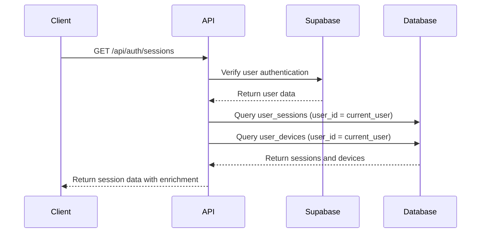
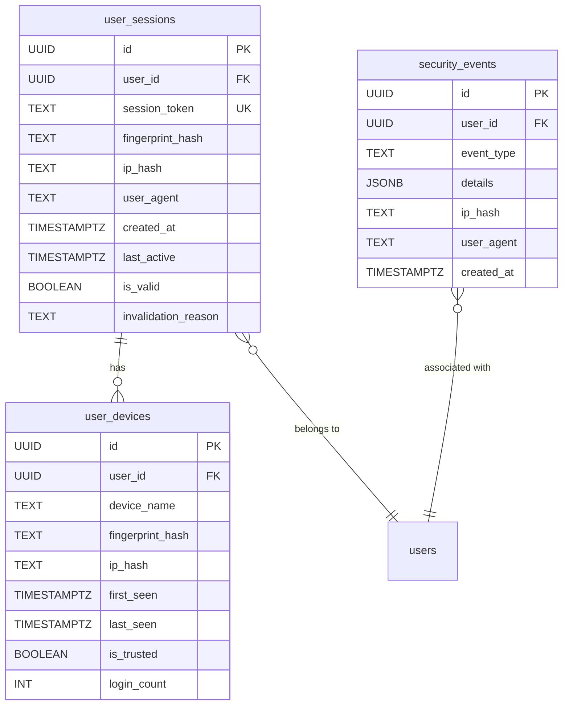

# Active Sessions Management

<cite>
**Referenced Files in This Document**   
- [route.ts](file://app/api/auth/sessions/route.ts)
- [active-sessions.tsx](file://components/active-sessions.tsx)
- [session-security.ts](file://lib/session-security.ts)
- [fingerprint.ts](file://lib/fingerprint.ts)
- [20260111_session_security.sql](file://supabase/migrations/20260111_session_security.sql)
</cite>

## Table of Contents
1. [Introduction](#introduction)
2. [GET /api/auth/sessions Endpoint](#get-apisessions-endpoint)
3. [DELETE /api/auth/sessions Endpoint](#delete-apisessions-endpoint)
4. [Security Model and Access Control](#security-model-and-access-control)
5. [ActiveSessions Component](#activesessions-component)
6. [Database Schema and Queries](#database-schema-and-queries)
7. [Use Cases](#use-cases)
8. [Conclusion](#conclusion)

## Introduction
The Active Sessions Management system provides users with visibility and control over their active login sessions across devices. This documentation details the API endpoints, security mechanisms, and user interface components that enable session monitoring and management within the school management system. The system includes robust security features such as device fingerprinting, session binding, and comprehensive audit logging to protect against session hijacking and unauthorized access.

## GET /api/auth/sessions Endpoint

The GET /api/auth/sessions endpoint retrieves a user's active sessions and associated device information. This endpoint provides comprehensive session data that enables users to monitor their account activity across multiple devices.

### Response Structure
The endpoint returns a JSON response containing the following properties:

- **sessions**: Array of active session objects with details including user agent, creation timestamp, last activity timestamp, and IP address hash
- **devices**: Array of known devices with device name, first/last seen timestamps, login count, and trust status
- **sessionCount**: Total number of active sessions
- **deviceCount**: Total number of registered devices

Each session object includes the device fingerprint hash, IP address hash, user agent string, and timestamps for creation and last activity. The system enriches session data with device intelligence by parsing the user agent to determine the browser and operating system combination.

### Device Intelligence Layer
The system implements a device intelligence layer that enhances session data with meaningful device information. When a user logs in, the system:

1. Collects browser fingerprint data including user agent, language, timezone, screen resolution, and platform
2. Generates a cryptographic hash of the fingerprint data for privacy-preserving identification
3. Parses the user agent string to create a human-readable device name (e.g., "Chrome on Windows")
4. Tracks device history including first/last seen timestamps and login frequency

This intelligence layer allows users to easily identify their devices in the session management interface without exposing sensitive fingerprint data.

**Section sources**
- [route.ts](file://app/api/auth/sessions/route.ts#L6-L41)
- [session-security.ts](file://lib/session-security.ts#L303-L317)
- [session-security.ts](file://lib/session-security.ts#L322-L335)

## DELETE /api/auth/sessions Endpoint

The DELETE /api/auth/sessions endpoint allows users to terminate active sessions for security purposes. This endpoint supports two primary use cases: logging out from all devices and terminating specific sessions.

### Termination Capabilities
When invoked, the endpoint performs the following actions:

1. Validates the user's authentication status
2. Calls the `invalidateAllUserSessions` function to terminate all active sessions
3. Signs out the current session via Supabase authentication
4. Clears the session binding cookie
5. Returns a success response with the count of invalidated sessions

The endpoint is designed to provide immediate security remediation when a user suspects their account has been compromised or when they want to ensure no active sessions remain on other devices.

### Security Event Logging
Each logout operation is recorded in the security_events table with the following details:
- Event type: "logout_all_devices"
- User ID
- Timestamp
- IP address hash
- User agent string

This audit trail enables administrators to monitor account security events and investigate potential security incidents.

**Section sources**
- [route.ts](file://app/api/auth/sessions/route.ts#L43-L71)
- [session-security.ts](file://lib/session-security.ts#L253-L272)

## Security Model and Access Control

The session management system implements a robust security model that enforces strict access controls and protects against common web vulnerabilities.

### Authentication and Authorization
The system follows a zero-trust security model where every request is validated:

1. **Authentication**: Each request is authenticated using Supabase's built-in authentication system
2. **Authorization**: Users can only access their own session data through Row Level Security (RLS) policies
3. **Session Validation**: Active sessions are validated against device fingerprints to prevent hijacking

The RLS policies in the database ensure that users can only view and manage their own sessions and devices, preventing unauthorized access to other users' session information.

### Session Security Mechanisms
The system implements multiple layers of session security:

- **Device Fingerprinting**: Sessions are bound to device fingerprints to detect and prevent hijacking attempts
- **IP Address Hashing**: IP addresses are hashed for privacy while still allowing abuse detection
- **Session Binding**: A session binding token is stored in cookies and validated on each request
- **Automatic Invalidation**: Previous sessions are automatically invalidated when a user logs in from a new device

When a fingerprint mismatch is detected, the system automatically invalidates the suspicious session and logs a security event for investigation.

**Diagram sources**
- [route.ts](file://app/api/auth/sessions/route.ts#L6-L41)
- [session-security.ts](file://lib/session-security.ts#L303-L335)

**Section sources**
- [route.ts](file://app/api/auth/sessions/route.ts#L6-L41)
- [session-security.ts](file://lib/session-security.ts#L149-L227)
- [20260111_session_security.sql](file://supabase/migrations/20260111_session_security.sql#L59-L75)

## ActiveSessions Component

The ActiveSessions component provides a user interface for viewing and managing active sessions. This React component consumes the session management API and presents the data in an intuitive format.

### Component Features
The component includes the following key features:

- **Session List**: Displays all active sessions with device icons, browser/OS information, and last activity timestamps
- **Device Intelligence**: Shows known devices with login frequency and trust status
- **Current Session Identification**: Marks the current session for easy identification
- **Bulk Logout**: Provides a "Logout All Devices" button for security remediation
- **Loading States**: Displays appropriate loading indicators during API requests

The component uses client-side logic to parse user agent strings and determine appropriate device icons (mobile vs. desktop). It also handles API errors gracefully with appropriate user feedback.

### User Experience Design
The component is designed with security and usability in mind:

- Clear visual distinction between different device types
- Relative time formatting for last activity (e.g., "2 hours ago")
- Confirmation-free bulk logout for immediate security action
- Responsive design that works across device sizes
- Accessibility features including proper labeling and keyboard navigation

**Section sources**
- [active-sessions.tsx](file://components/active-sessions.tsx#L1-L194)
- [fingerprint.ts](file://lib/fingerprint.ts#L22-L33)

## Database Schema and Queries

The session management system relies on a well-designed database schema with optimized queries for performance and security.

### Database Tables
The system uses three primary tables:

- **user_sessions**: Tracks active user sessions with fingerprint binding
- **user_devices**: Maintains a registry of trusted devices per user
- **security_events**: Logs security-related events for audit and investigation

The user_sessions table includes indexes on user_id and session_token for fast lookups, while the user_devices table has a composite index on user_id and fingerprint_hash to optimize device recognition.

### Key Database Queries
The system executes the following critical queries:

- **Session Retrieval**: SELECT from user_sessions with filters for user_id and is_valid
- **Device Retrieval**: SELECT from user_devices with ordering by last_seen
- **Session Invalidation**: UPDATE user_sessions to set is_valid = false
- **Security Event Logging**: INSERT into security_events with event details

The invalidate_user_sessions PostgreSQL function provides an atomic operation for terminating all sessions for a user, ensuring data consistency and optimal performance.

**Diagram sources**
- [20260111_session_security.sql](file://supabase/migrations/20260111_session_security.sql#L5-L35)
- [20260111_session_security.sql](file://supabase/migrations/20260111_session_security.sql#L19-L30)

**Section sources**
- [20260111_session_security.sql](file://supabase/migrations/20260111_session_security.sql#L5-L106)
- [session-security.ts](file://lib/session-security.ts#L303-L335)

## Use Cases

The Active Sessions Management system addresses several important security and usability scenarios.

### Identifying Suspicious Activity
Users can monitor their account for signs of unauthorized access by:

- Reviewing the list of active sessions for unfamiliar devices
- Checking the geographic distribution of IP addresses
- Monitoring login frequency and patterns
- Investigating devices with low login counts

When suspicious activity is detected, users can immediately terminate all sessions to secure their account.

### Securing Accounts After Device Loss
In the event of a lost or stolen device, users can:

- Immediately log out from all devices to prevent unauthorized access
- Review recent session activity to determine if the device was accessed
- Monitor for new device registrations after the logout
- Revoke access without changing their password

This capability provides a rapid response mechanism that doesn't disrupt other users or require administrative intervention.

### Managing Multiple Devices
Regular users benefit from the ability to:

- View all devices where they are currently logged in
- Identify which session corresponds to their current device
- Understand their login patterns across different browsers and operating systems
- Maintain awareness of their digital footprint

Administrators can leverage the same system to monitor their own accounts while following security best practices for privileged access.

## Conclusion
The Active Sessions Management system provides a comprehensive solution for monitoring and controlling user sessions within the school management platform. By combining a well-designed API, intuitive user interface, and robust security mechanisms, the system empowers users to maintain control over their account security. The integration of device fingerprinting, session binding, and comprehensive audit logging creates multiple layers of protection against session hijacking and unauthorized access. This documentation provides the necessary information for developers, administrators, and security professionals to understand and effectively utilize the session management capabilities.