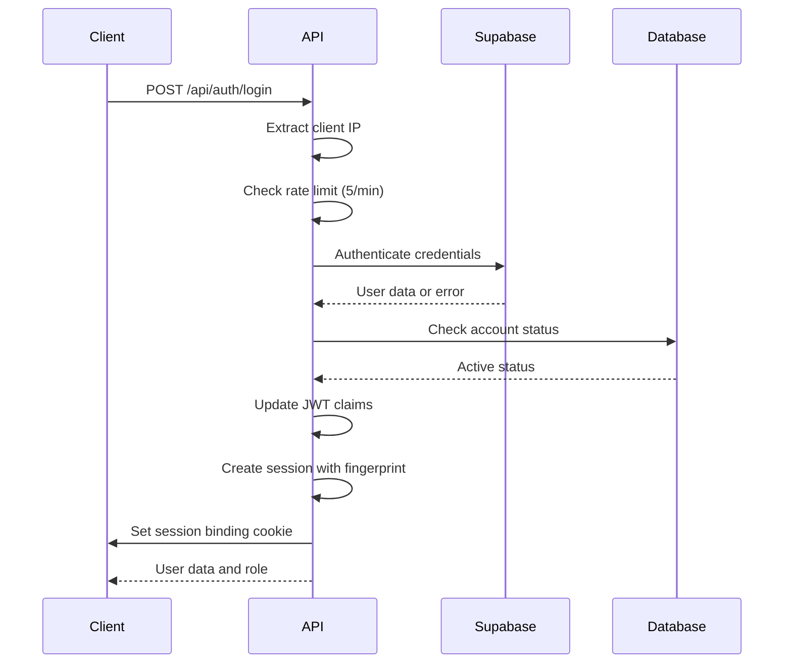
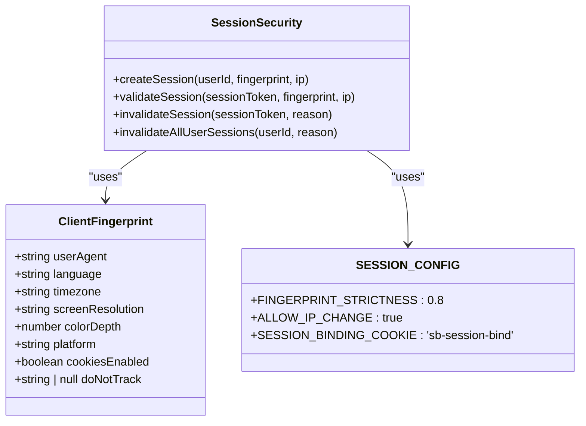
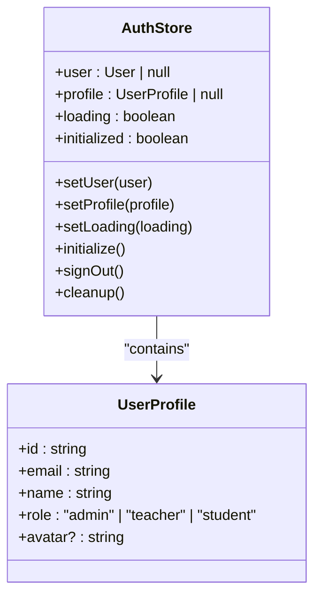
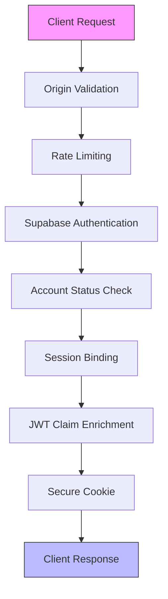
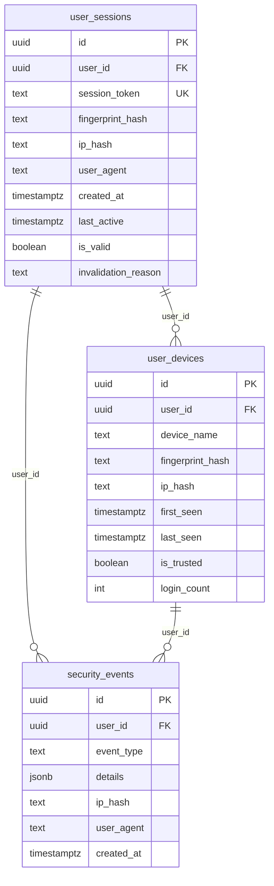
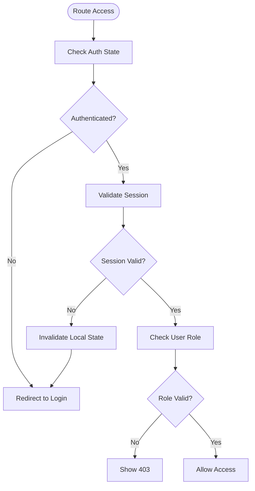

# Authentication API

<cite>
**Referenced Files in This Document**   
- [login/route.ts](file://app/api/auth/login/route.ts)
- [logout/route.ts](file://app/api/auth/logout/route.ts)
- [me/route.ts](file://app/api/auth/me/route.ts)
- [sessions/route.ts](file://app/api/auth/sessions/route.ts)
- [check-auth/route.ts](file://app/api/check-auth/route.ts)
- [auth-store.ts](file://lib/auth-store.ts)
- [session-timeout-modal.tsx](file://components/session-timeout-modal.tsx)
- [session-security.ts](file://lib/session-security.ts)
- [rate-limit.ts](file://lib/rate-limit.ts)
- [security.ts](file://lib/security.ts)
- [fingerprint.ts](file://lib/fingerprint.ts)
- [secure-fetch.ts](file://lib/secure-fetch.ts)
- [20260111_session_security.sql](file://supabase/migrations/20260111_session_security.sql)
</cite>

## Table of Contents
1. [Introduction](#introduction)
2. [Authentication Endpoints](#authentication-endpoints)
3. [Login Flow and Security](#login-flow-and-security)
4. [Session Management](#session-management)
5. [Client-Side Authentication](#client-side-authentication)
6. [Security Implementation](#security-implementation)
7. [Error Handling](#error-handling)
8. [Integration Guidance](#integration-guidance)

## Introduction
The Authentication API provides secure user authentication and session management for the School Management System. It implements a comprehensive security model including rate limiting, session binding, and multi-layered protection against common attacks. The system uses Supabase for core authentication while extending its capabilities with custom security features.

The API supports standard authentication operations including login, logout, session validation, and active session management. Security features include IP-based rate limiting, client fingerprinting for session binding, server-side absolute timeout enforcement, and protection against user enumeration attacks.

**Section sources**
- [login/route.ts](file://app/api/auth/login/route.ts#L1-L117)
- [logout/route.ts](file://app/api/auth/logout/route.ts#L1-L36)

## Authentication Endpoints

### Login Endpoint
The login endpoint authenticates users and establishes secure sessions.

**HTTP Method**: POST  
**URL**: `/api/auth/login`  
**Security**: Rate limited, CSRF protected

**Request Schema**:
```json
{
  "email": "string",
  "password": "string",
  "fingerprint": {
    "userAgent": "string",
    "language": "string",
    "timezone": "string",
    "screenResolution": "string",
    "colorDepth": "number",
    "platform": "string",
    "cookiesEnabled": "boolean",
    "doNotTrack": "string | null"
  }
}
```

**Response Schema (Success)**:
```json
{
  "user": "object",
  "role": "string",
  "isNewDevice": "boolean"
}
```

**Response Schema (Error)**:
```json
{
  "error": "string"
}
```

**Status Codes**:
- 200: Successful authentication
- 401: Invalid credentials or disabled account
- 429: Rate limit exceeded
- 500: Internal server error

**Section sources**
- [login/route.ts](file://app/api/auth/login/route.ts#L7-L117)

### Logout Endpoint
The logout endpoint terminates the current user session.

**HTTP Method**: POST  
**URL**: `/api/auth/logout`  
**Security**: Requires valid session

**Request Schema**: None

**Response Schema**:
```json
{
  "success": "boolean"
}
```

**Status Codes**:
- 200: Successful logout
- 500: Logout error (client should still clear local state)

**Section sources**
- [logout/route.ts](file://app/api/auth/logout/route.ts#L6-L36)

### Session Validation Endpoint
The me endpoint validates the current session and returns user information.

**HTTP Method**: GET  
**URL**: `/api/auth/me`  
**Security**: Requires valid session

**Request Schema**: None

**Response Schema (Success)**:
```json
{
  "user": {
    "id": "string",
    "name": "string",
    "email": "string",
    "avatar": "string",
    "role": "string"
  }
}
```

**Response Schema (Error)**:
```json
{
  "error": "string"
}
```

**Status Codes**:
- 200: Valid session
- 401: Unauthorized (no valid session)
- 500: Internal server error

**Section sources**
- [me/route.ts](file://app/api/auth/me/route.ts#L4-L28)

### Active Session Management Endpoint
The sessions endpoint allows users to view and manage their active sessions.

**HTTP Method**: GET  
**URL**: `/api/auth/sessions`  
**Security**: Requires valid session

**GET Response Schema**:
```json
{
  "sessions": [
    {
      "id": "string",
      "user_agent": "string",
      "created_at": "string",
      "last_active": "string",
      "ip_hash": "string"
    }
  ],
  "devices": [
    {
      "id": "string",
      "device_name": "string",
      "first_seen": "string",
      "last_seen": "string",
      "login_count": "number"
    }
  ],
  "sessionCount": "number",
  "deviceCount": "number"
}
```

**HTTP Method**: DELETE  
**URL**: `/api/auth/sessions`  
**Security**: Requires valid session

**DELETE Response Schema**:
```json
{
  "success": "boolean",
  "invalidatedSessions": "number"
}
```

**Status Codes**:
- 200: Successful operation
- 401: Unauthorized
- 500: Internal server error

**Section sources**
- [sessions/route.ts](file://app/api/auth/sessions/route.ts#L7-L72)

### Check Auth Endpoint
The check-auth endpoint verifies if a user has an active authentication session.

**HTTP Method**: POST  
**URL**: `/api/check-auth`  
**Security**: Admin only

**Request Schema**:
```json
{
  "userId": "string"
}
```

**Response Schema**:
```json
{
  "hasAuth": "boolean"
}
```

**Status Codes**:
- 200: Successful check
- 401: Unauthorized
- 403: Forbidden (not admin)
- 500: Internal server error

**Section sources**
- [check-auth/route.ts](file://app/api/check-auth/route.ts#L19-L64)

## Login Flow and Security

### Login Process
The login process follows a secure flow designed to prevent common attacks:

1. **Rate Limit Check**: Verify the client's IP has not exceeded the allowed attempts
2. **Credential Validation**: Authenticate with Supabase using provided credentials
3. **Account Status Check**: Verify the user account is active
4. **Session Creation**: Create a server-side session with fingerprint binding
5. **JWT Enrichment**: Update JWT claims with role and session_start metadata
6. **Response Generation**: Return user data with session binding cookie



**Diagram sources**
- [login/route.ts](file://app/api/auth/login/route.ts#L7-L117)
- [session-security.ts](file://lib/session-security.ts#L68-L147)

### Rate Limiting
The system implements rate limiting to prevent brute force attacks:

- **Limit**: 5 login attempts per minute per IP address
- **Mechanism**: Server-side tracking using Supabase RPC
- **Behavior**: Returns 429 status after exceeding limit
- **Security**: Fail-closed approach during database outages

The rate limiting is implemented using a Supabase RPC function that atomically checks and updates attempt counts, preventing race conditions.

**Section sources**
- [login/route.ts](file://app/api/auth/login/route.ts#L12-L21)
- [rate-limit.ts](file://lib/rate-limit.ts#L25-L56)

## Session Management

### Session Binding
The system implements session binding using client fingerprinting to prevent session hijacking:

- **Fingerprint Data**: Collects non-PII browser characteristics
- **Hashing**: SHA-256 hashing with salt for privacy
- **Cookie**: HttpOnly, Secure, SameSite=strict session binding cookie
- **Validation**: Server-side validation on each request



**Diagram sources**
- [session-security.ts](file://lib/session-security.ts#L31-L248)
- [fingerprint.ts](file://lib/fingerprint.ts#L8-L33)

### Session Invalidation
Sessions are invalidated in multiple scenarios:

- **Logout**: Immediate invalidation of current session
- **New Login**: All previous sessions invalidated (single session enforcement)
- **Fingerprint Mismatch**: Automatic invalidation on detected hijacking
- **IP Change**: Invalidation if IP changes and ALLOW_IP_CHANGE is false
- **Server-Side Timeout**: Absolute timeout enforcement based on session_start

The system uses a database table (`user_sessions`) to track active sessions and their validity status, allowing for centralized management and cleanup.

**Section sources**
- [logout/route.ts](file://app/api/auth/logout/route.ts#L16-L18)
- [session-security.ts](file://lib/session-security.ts#L233-L247)

### Server-Side Timeout
The system enforces server-side absolute session timeout:

- **Timeout Duration**: 8 hours from session_start
- **Implementation**: JWT claim enrichment with session_start timestamp
- **Client-Side Enforcement**: useSessionTimeout hook checks server-side metadata
- **Inactivity Timeout**: Additional 15-minute inactivity timeout with warning

The session_start timestamp is stored in the JWT claims during login and validated on the client side to ensure sessions cannot be extended beyond the absolute timeout.

**Section sources**
- [login/route.ts](file://app/api/auth/login/route.ts#L71-L73)
- [use-session-timeout.ts](file://lib/hooks/use-session-timeout.ts#L117-L145)

## Client-Side Authentication

### Authentication Store
The auth-store.ts implementation provides a centralized state management system for authentication:

- **Zustand Store**: Reactive state management
- **Session Cleanup**: Proper cleanup of auth subscriptions
- **Fingerprint Interceptor**: Automatic inclusion of fingerprint headers
- **Logout Flow**: Coordinated client and server logout



**Diagram sources**
- [auth-store.ts](file://lib/auth-store.ts#L7-L110)

### Session Timeout Modal
The session-timeout-modal.tsx component provides user interface for session expiration:

- **Warning Display**: Shows countdown before session expiration
- **Extend Option**: Allows users to extend their session
- **Logout Option**: Provides clean logout functionality
- **Responsive Design**: Mobile-friendly interface

The modal is triggered by the useSessionTimeout hook when the inactivity warning threshold is reached, giving users the option to continue their session or log out.

**Section sources**
- [session-timeout-modal.tsx](file://components/session-timeout-modal.tsx#L1-L74)
- [use-session-timeout.ts](file://lib/hooks/use-session-timeout.ts#L34-L198)

## Security Implementation

### Security Architecture
The authentication system implements multiple layers of security:



**Diagram sources**
- [login/route.ts](file://app/api/auth/login/route.ts#L7-L117)
- [security.ts](file://lib/security.ts#L20-L67)

### Security Features
The system implements the following security features:

- **Generic Error Messages**: Prevents user enumeration attacks
- **IP Hashing**: Protects user privacy while allowing abuse detection
- **Fingerprint Binding**: Prevents session hijacking
- **HttpOnly Cookies**: Protects against XSS attacks
- **Secure Cookies**: Ensures transmission over HTTPS
- **SameSite Strict**: Prevents CSRF attacks
- **Service Role Key**: Isolated access for administrative operations

The system uses a defense-in-depth approach, with multiple security controls at different layers to provide comprehensive protection.

**Section sources**
- [login/route.ts](file://app/api/auth/login/route.ts#L36-L40)
- [security.ts](file://lib/security.ts#L11-L13)
- [session-security.ts](file://lib/session-security.ts#L25-L26)

### Database Schema
The session security system uses the following database tables:



**Diagram sources**
- [20260111_session_security.sql](file://supabase/migrations/20260111_session_security.sql#L5-L34)

## Error Handling

### Error Responses
The authentication system returns standardized error responses:

| Error Type | Status Code | Response Body | Security Rationale |
|------------|-------------|---------------|-------------------|
| Invalid Credentials | 401 | `{ "error": "Invalid login credentials" }` | Prevents user enumeration |
| Disabled Account | 401 | `{ "error": "Invalid login credentials" }` | Prevents user enumeration |
| Rate Limit Exceeded | 429 | `{ "error": "Too many login attempts. Please try again later." }` | Throttles brute force attacks |
| Unauthorized | 401 | `{ "error": "Unauthorized" }` | Generic unauthorized access |
| Forbidden | 403 | `{ "error": "Forbidden" }` | Insufficient privileges |
| Internal Error | 500 | `{ "error": "Internal server error" }` | Hides implementation details |

The system uses generic error messages for authentication failures to prevent attackers from determining whether a username exists in the system.

**Section sources**
- [login/route.ts](file://app/api/auth/login/route.ts#L17-L20)
- [login/route.ts](file://app/api/auth/login/route.ts#L40-L41)

### Brute Force Protection
The system implements multiple layers of brute force protection:

- **Rate Limiting**: 5 attempts per minute per IP address
- **Generic Errors**: Same response for invalid credentials and non-existent users
- **Fail-Closed**: Rate limiting fails closed during database outages
- **Account Lockout**: Not implemented (uses rate limiting instead)
- **Monitoring**: Security events logged for suspicious activity

The rate limiting is implemented at the API gateway level using a Supabase RPC function that provides atomic operations to prevent race conditions.

**Section sources**
- [login/route.ts](file://app/api/auth/login/route.ts#L12-L21)
- [rate-limit.ts](file://lib/rate-limit.ts#L25-L56)

## Integration Guidance

### Frontend Authentication Guards
Implement authentication guards using the following pattern:



**Diagram sources**
- [auth-store.ts](file://lib/auth-store.ts#L41-L83)

### Security Rationale
The authentication system follows security best practices:

- **Generic Error Messages**: Prevents user enumeration by returning the same error for invalid credentials and non-existent users
- **Session Binding**: Prevents session hijacking by binding sessions to client fingerprints
- **HttpOnly Cookies**: Protects against XSS attacks by preventing JavaScript access to session tokens
- **Secure Cookies**: Ensures cookies are only transmitted over HTTPS connections
- **SameSite Strict**: Prevents CSRF attacks by restricting cookie sending to same-site requests
- **Rate Limiting**: Prevents brute force attacks by limiting login attempts
- **IP Hashing**: Protects user privacy while allowing abuse detection through hashed IP addresses

These measures provide a balanced approach to security, usability, and privacy.

**Section sources**
- [login/route.ts](file://app/api/auth/login/route.ts#L39-L40)
- [login/route.ts](file://app/api/auth/login/route.ts#L100-L107)
- [security.ts](file://lib/security.ts#L11-L13)

### Implementation Notes
When integrating with the authentication system:

1. **Always use secure-fetch**: This automatically includes the fingerprint header
2. **Handle 401 responses gracefully**: Redirect to login page
3. **Listen for auth state changes**: Use the auth store for reactive updates
4. **Implement session timeout handling**: Use the session timeout modal
5. **Never store credentials**: Use the authentication system for all user verification
6. **Respect rate limits**: Implement appropriate user feedback for rate limit errors

The system is designed to be secure by default, with security features implemented at the framework level to minimize the risk of insecure implementations.

**Section sources**
- [secure-fetch.ts](file://lib/secure-fetch.ts#L9-L22)
- [auth-store.ts](file://lib/auth-store.ts#L50-L52)
- [session-timeout-modal.tsx](file://components/session-timeout-modal.tsx#L15-L27)