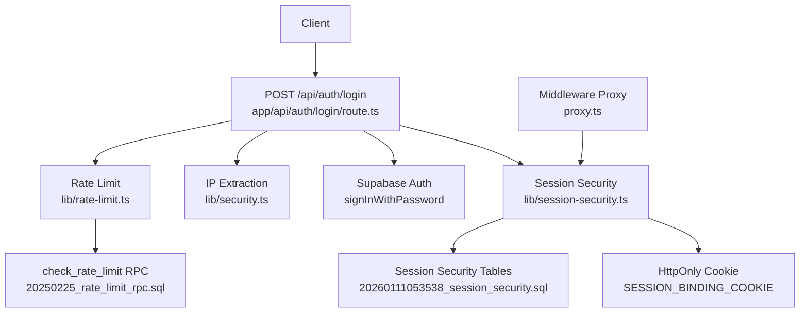
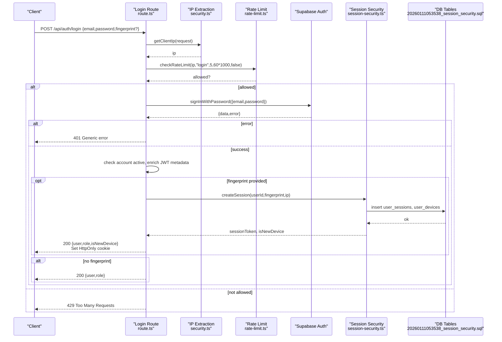
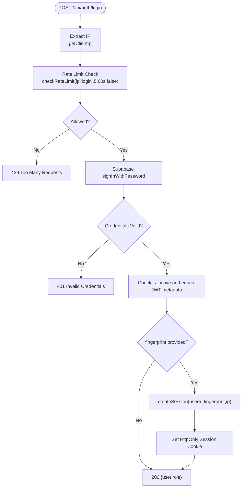
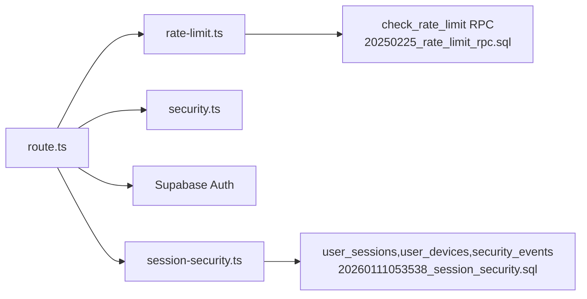

# Login Endpoint

<cite>
**Referenced Files in This Document**
- [route.ts](file://app/api/auth/login/route.ts)
- [rate-limit.ts](file://lib/rate-limit.ts)
- [security.ts](file://lib/security.ts)
- [session-security.ts](file://lib/session-security.ts)
- [fingerprint.ts](file://lib/fingerprint.ts)
- [secure-fetch.ts](file://lib/secure-fetch.ts)
- [proxy.ts](file://proxy.ts)
- [20250225_rate_limit_rpc.sql](file://supabase/migrations/20250225_rate_limit_rpc.sql)
- [20260111053538_session_security.sql](file://supabase/migrations/20260111053538_session_security.sql)
</cite>

## Table of Contents
1. [Introduction](#introduction)
2. [Project Structure](#project-structure)
3. [Core Components](#core-components)
4. [Architecture Overview](#architecture-overview)
5. [Detailed Component Analysis](#detailed-component-analysis)
6. [Dependency Analysis](#dependency-analysis)
7. [Performance Considerations](#performance-considerations)
8. [Troubleshooting Guide](#troubleshooting-guide)
9. [Conclusion](#conclusion)

## Introduction
This document provides comprehensive API documentation for the POST /api/auth/login endpoint. It covers the request schema, authentication flow, rate limiting, credential validation via Supabase Auth, session token generation with cryptographic binding to client fingerprint, and secure cookie issuance. It also documents response formats for success and failure, error cases, and security considerations such as constant-time comparison, IP-based rate limiting, and protection against credential stuffing. Finally, it references client-side integration using secure-fetch.ts and session binding implementation in session-security.ts.

## Project Structure
The login endpoint is implemented as a Next.js route handler under app/api/auth/login/route.ts. Supporting modules include rate limiting, IP extraction, session security, fingerprint generation, and client-side secure fetch utilities. Database-level rate limiting and session security tables are defined in Supabase migrations.

**Diagram sources**
- [route.ts](file://app/api/auth/login/route.ts#L1-L117)
- [rate-limit.ts](file://lib/rate-limit.ts#L1-L56)
- [security.ts](file://lib/security.ts#L69-L96)
- [session-security.ts](file://lib/session-security.ts#L1-L373)
- [20250225_rate_limit_rpc.sql](file://supabase/migrations/20250225_rate_limit_rpc.sql#L1-L46)
- [20260111053538_session_security.sql](file://supabase/migrations/20260111053538_session_security.sql#L1-L41)

**Section sources**
- [route.ts](file://app/api/auth/login/route.ts#L1-L117)
- [rate-limit.ts](file://lib/rate-limit.ts#L1-L56)
- [security.ts](file://lib/security.ts#L69-L96)
- [session-security.ts](file://lib/session-security.ts#L1-L373)
- [20250225_rate_limit_rpc.sql](file://supabase/migrations/20250225_rate_limit_rpc.sql#L1-L46)
- [20260111053538_session_security.sql](file://supabase/migrations/20260111053538_session_security.sql#L1-L41)

## Core Components
- Request Body Schema
  - email: string (required)
  - password: string (required)
  - fingerprint: object (optional)
    - userAgent: string
    - language: string
    - timezone: string
    - screenResolution: string
    - colorDepth: number
    - platform: string
    - cookiesEnabled: boolean
    - doNotTrack: string|null
- Authentication Flow
  - IP extraction using getClientIp
  - Rate limiting enforced via checkRateLimit with fail-closed behavior for login
  - Supabase auth credential validation via signInWithPassword
  - Account status check (active) and metadata enrichment in JWT
  - Optional session binding via createSession when fingerprint is provided
  - Secure HttpOnly cookie issuance for session binding
- Response Formats
  - Success (200 OK): JSON payload containing user, role, and isNewDevice
  - Failure (401 Unauthorized): Generic error message to prevent user enumeration
  - Failure (429 Too Many Requests): Rate limit exceeded
  - Failure (500 Internal Server Error): Unexpected server error

**Section sources**
- [route.ts](file://app/api/auth/login/route.ts#L23-L27)
- [route.ts](file://app/api/auth/login/route.ts#L12-L21)
- [route.ts](file://app/api/auth/login/route.ts#L31-L34)
- [route.ts](file://app/api/auth/login/route.ts#L43-L59)
- [route.ts](file://app/api/auth/login/route.ts#L61-L78)
- [route.ts](file://app/api/auth/login/route.ts#L80-L111)
- [security.ts](file://lib/security.ts#L69-L96)
- [rate-limit.ts](file://lib/rate-limit.ts#L25-L50)

## Architecture Overview
The login flow integrates client-side fingerprinting, server-side rate limiting, Supabase Auth, and session binding with cryptographic guarantees.

**Diagram sources**
- [route.ts](file://app/api/auth/login/route.ts#L1-L117)
- [security.ts](file://lib/security.ts#L69-L96)
- [rate-limit.ts](file://lib/rate-limit.ts#L25-L50)
- [session-security.ts](file://lib/session-security.ts#L68-L147)
- [20260111053538_session_security.sql](file://supabase/migrations/20260111053538_session_security.sql#L1-L41)

## Detailed Component Analysis

### Request Body Schema
- email: string (required)
- password: string (required)
- fingerprint: object (optional)
  - userAgent: string
  - language: string
  - timezone: string
  - screenResolution: string
  - colorDepth: number
  - platform: string
  - cookiesEnabled: boolean
  - doNotTrack: string|null

Client-side fingerprint generation is handled by lib/fingerprint.ts and injected into requests via lib/secure-fetch.ts.

**Section sources**
- [route.ts](file://app/api/auth/login/route.ts#L23-L27)
- [fingerprint.ts](file://lib/fingerprint.ts#L8-L33)
- [secure-fetch.ts](file://lib/secure-fetch.ts#L1-L22)

### Authentication Flow
- IP Extraction
  - getClientIp prioritizes platform-provided IP and falls back to safe defaults to prevent spoofing.
- Rate Limiting
  - checkRateLimit uses an atomic RPC to enforce 5 attempts per minute per IP. For login, fail-closed behavior prevents brute force during DB outages.
- Credential Validation
  - Supabase auth signInWithPassword validates credentials.
- Account Status and Metadata
  - The endpoint checks is_active and enriches JWT user_metadata with role, must_change_password, is_active, and session_start.
- Session Binding
  - If fingerprint is provided, createSession generates a session token, invalidates previous sessions, records device and IP hashes, and persists session data.
- Secure Cookie Issuance
  - An HttpOnly, Secure, SameSite=strict session binding cookie is set with a max age aligned to session timeout.

**Diagram sources**
- [route.ts](file://app/api/auth/login/route.ts#L1-L117)
- [security.ts](file://lib/security.ts#L69-L96)
- [rate-limit.ts](file://lib/rate-limit.ts#L25-L50)
- [session-security.ts](file://lib/session-security.ts#L68-L147)

**Section sources**
- [route.ts](file://app/api/auth/login/route.ts#L9-L21)
- [route.ts](file://app/api/auth/login/route.ts#L31-L41)
- [route.ts](file://app/api/auth/login/route.ts#L43-L59)
- [route.ts](file://app/api/auth/login/route.ts#L61-L78)
- [route.ts](file://app/api/auth/login/route.ts#L80-L111)
- [security.ts](file://lib/security.ts#L69-L96)
- [rate-limit.ts](file://lib/rate-limit.ts#L25-L50)
- [session-security.ts](file://lib/session-security.ts#L68-L147)

### Response Format
- Success (200 OK)
  - Body: { user, role, isNewDevice }
  - Cookie: HttpOnly, Secure, SameSite=strict session binding cookie
- Failure (401 Unauthorized)
  - Body: { error: "Invalid login credentials" }
- Failure (429 Too Many Requests)
  - Body: { error: "Too many login attempts. Please try again later." }
- Failure (500 Internal Server Error)
  - Body: { error: "Internal server error" }

**Section sources**
- [route.ts](file://app/api/auth/login/route.ts#L16-L21)
- [route.ts](file://app/api/auth/login/route.ts#L38-L41)
- [route.ts](file://app/api/auth/login/route.ts#L114-L117)
- [route.ts](file://app/api/auth/login/route.ts#L92-L111)

### Error Cases
- Invalid Credentials
  - Supabase error triggers a generic 401 response to prevent user enumeration.
- Rate Limit Exceeded
  - 429 response when attempts exceed 5 per minute per IP.
- Disabled Accounts
  - Sign out immediately and return generic 401 for disabled accounts.
- MFA Requirement
  - MFA enforcement occurs in middleware for admin routes after login. Users with verified MFA factors but not at AAL2 are redirected to verify; otherwise enrollment is required.

**Section sources**
- [route.ts](file://app/api/auth/login/route.ts#L38-L41)
- [route.ts](file://app/api/auth/login/route.ts#L51-L59)
- [rate-limit.ts](file://lib/rate-limit.ts#L25-L50)
- [proxy.ts](file://proxy.ts#L229-L249)

### Security Considerations
- Constant-Time Comparison
  - Supabase Auth performs constant-time password comparison server-side; the login route returns a generic error regardless of cause.
- IP-Based Rate Limiting
  - Atomic RPC ensures race-free counters; fail-closed behavior for login protects against brute force during DB outages.
- Protection Against Credential Stuffing
  - Generic error messages, rate limiting, and secure IP extraction mitigate enumeration and stuffing attacks.
- Session Binding Anti-Hijacking
  - Session tokens are bound to hashed fingerprint and IP. Middleware validates session binding on subsequent requests and invalidates sessions on mismatches.

**Section sources**
- [route.ts](file://app/api/auth/login/route.ts#L36-L41)
- [rate-limit.ts](file://lib/rate-limit.ts#L25-L50)
- [security.ts](file://lib/security.ts#L69-L96)
- [session-security.ts](file://lib/session-security.ts#L150-L228)
- [proxy.ts](file://proxy.ts#L111-L140)

## Dependency Analysis
The login route depends on rate limiting, IP extraction, Supabase Auth, and session security. Database-level rate limiting and session security tables are defined in migrations.

**Diagram sources**
- [route.ts](file://app/api/auth/login/route.ts#L1-L117)
- [rate-limit.ts](file://lib/rate-limit.ts#L1-L56)
- [security.ts](file://lib/security.ts#L69-L96)
- [session-security.ts](file://lib/session-security.ts#L1-L373)
- [20250225_rate_limit_rpc.sql](file://supabase/migrations/20250225_rate_limit_rpc.sql#L1-L46)
- [20260111053538_session_security.sql](file://supabase/migrations/20260111053538_session_security.sql#L1-L41)

**Section sources**
- [route.ts](file://app/api/auth/login/route.ts#L1-L117)
- [rate-limit.ts](file://lib/rate-limit.ts#L1-L56)
- [security.ts](file://lib/security.ts#L69-L96)
- [session-security.ts](file://lib/session-security.ts#L1-L373)
- [20250225_rate_limit_rpc.sql](file://supabase/migrations/20250225_rate_limit_rpc.sql#L1-L46)
- [20260111053538_session_security.sql](file://supabase/migrations/20260111053538_session_security.sql#L1-L41)

## Performance Considerations
- JWT Metadata Enrichment
  - User metadata is stored in JWT claims to reduce middleware database queries by approximately 95%.
- Single Session Enforcement
  - Previous sessions are invalidated on new login, reducing session management overhead and improving security.
- Fingerprint Hashing
  - Device fingerprint is hashed with a salt to enable privacy-preserving comparisons while maintaining anti-hijacking effectiveness.

**Section sources**
- [route.ts](file://app/api/auth/login/route.ts#L61-L78)
- [session-security.ts](file://lib/session-security.ts#L88-L109)
- [session-security.ts](file://lib/session-security.ts#L42-L56)

## Troubleshooting Guide
- 429 Too Many Requests
  - Cause: Rate limit exceeded (5 attempts per minute per IP).
  - Resolution: Wait for the window to reset or reduce login attempts.
- 401 Invalid Credentials
  - Cause: Incorrect email/password or disabled account.
  - Resolution: Verify credentials; ensure account is active.
- 500 Internal Server Error
  - Cause: Unexpected server error during login processing.
  - Resolution: Check server logs and retry; verify Supabase connectivity.
- Session Binding Issues
  - Symptom: Immediate logout after login with generic error.
  - Cause: Fingerprint/IP mismatch or session invalidation.
  - Resolution: Ensure consistent client environment; review security events.

**Section sources**
- [route.ts](file://app/api/auth/login/route.ts#L16-L21)
- [route.ts](file://app/api/auth/login/route.ts#L38-L41)
- [route.ts](file://app/api/auth/login/route.ts#L114-L117)
- [session-security.ts](file://lib/session-security.ts#L150-L228)
- [proxy.ts](file://proxy.ts#L111-L140)

## Conclusion
The POST /api/auth/login endpoint enforces robust security through IP-based rate limiting, generic error messaging, Supabase Auth credential validation, and cryptographic session binding with fingerprint and IP hashing. On success, it returns a 200 OK with a secure HttpOnly session cookie and user metadata. The implementation leverages Supabase migrations for rate limiting and session security, and integrates with client-side secure-fetch.ts and session-security.ts for comprehensive protection against credential stuffing and session hijacking.