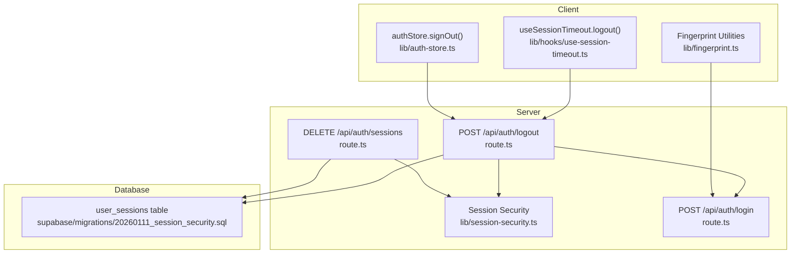
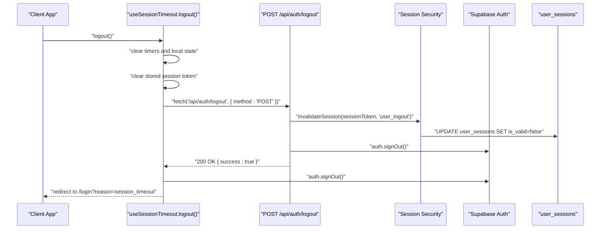
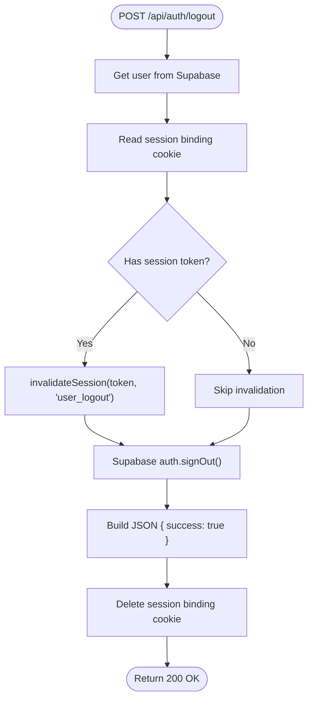
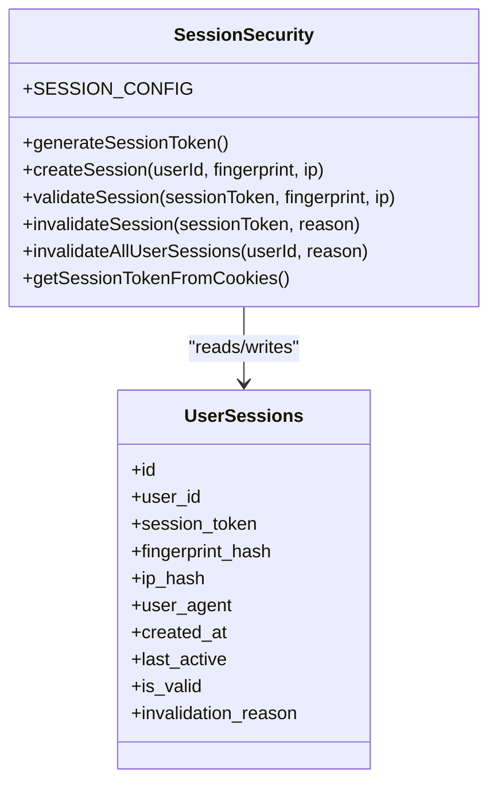
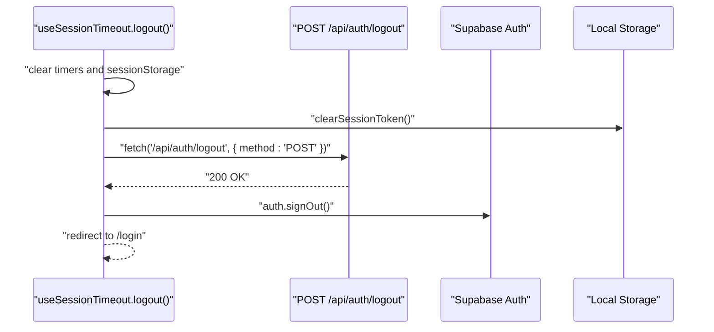
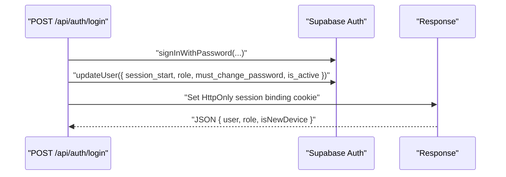
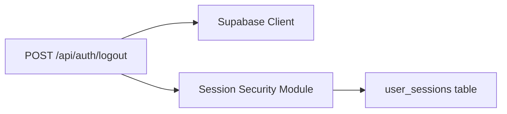

# Logout Endpoint

<cite>
**Referenced Files in This Document**
- [app/api/auth/logout/route.ts](file://app/api/auth/logout/route.ts)
- [lib/session-security.ts](file://lib/session-security.ts)
- [lib/fingerprint.ts](file://lib/fingerprint.ts)
- [lib/hooks/use-session-timeout.ts](file://lib/hooks/use-session-timeout.ts)
- [lib/auth-store.ts](file://lib/auth-store.ts)
- [app/api/auth/sessions/route.ts](file://app/api/auth/sessions/route.ts)
- [app/api/auth/login/route.ts](file://app/api/auth/login/route.ts)
- [supabase/migrations/20260111_session_security.sql](file://supabase/migrations/20260111_session_security.sql)
</cite>

## Table of Contents
1. [Introduction](#introduction)
2. [Project Structure](#project-structure)
3. [Core Components](#core-components)
4. [Architecture Overview](#architecture-overview)
5. [Detailed Component Analysis](#detailed-component-analysis)
6. [Dependency Analysis](#dependency-analysis)
7. [Performance Considerations](#performance-considerations)
8. [Troubleshooting Guide](#troubleshooting-guide)
9. [Conclusion](#conclusion)
10. [Appendices](#appendices)

## Introduction
This document provides comprehensive documentation for the POST /api/auth/logout endpoint. It explains how the endpoint performs server-side session invalidation by deleting the session record in the database and removing the corresponding session token cookie. It also details the integration with Supabase auth sign-out and the importance of calling this endpoint before client-side sign-out to prevent orphaned sessions. The request format (no body required, authenticated session cookie) and response (200 OK on success) are documented. Client-side implementation patterns using fetch in the useSessionTimeout hook’s logout function are described, including error resilience (continuing logout even if API fails). Security implications such as preventing session fixation and session hijacking are addressed, along with usage examples from session timeout handling and manual logout flows.

## Project Structure
The logout endpoint is implemented as a Next.js route handler under the API surface. It integrates with Supabase for authentication and uses a dedicated session security module to manage session records and cookies. Client-side logout flows are implemented in React hooks and stores.

**Diagram sources**
- [app/api/auth/logout/route.ts](file://app/api/auth/logout/route.ts#L1-L35)
- [lib/session-security.ts](file://lib/session-security.ts#L1-L373)
- [lib/fingerprint.ts](file://lib/fingerprint.ts#L1-L68)
- [lib/hooks/use-session-timeout.ts](file://lib/hooks/use-session-timeout.ts#L1-L198)
- [lib/auth-store.ts](file://lib/auth-store.ts#L85-L109)
- [app/api/auth/sessions/route.ts](file://app/api/auth/sessions/route.ts#L43-L71)
- [app/api/auth/login/route.ts](file://app/api/auth/login/route.ts#L1-L117)
- [supabase/migrations/20260111_session_security.sql](file://supabase/migrations/20260111_session_security.sql#L1-L115)

**Section sources**
- [app/api/auth/logout/route.ts](file://app/api/auth/logout/route.ts#L1-L35)
- [lib/session-security.ts](file://lib/session-security.ts#L1-L373)
- [lib/fingerprint.ts](file://lib/fingerprint.ts#L1-L68)
- [lib/hooks/use-session-timeout.ts](file://lib/hooks/use-session-timeout.ts#L1-L198)
- [lib/auth-store.ts](file://lib/auth-store.ts#L85-L109)
- [app/api/auth/sessions/route.ts](file://app/api/auth/sessions/route.ts#L43-L71)
- [app/api/auth/login/route.ts](file://app/api/auth/login/route.ts#L1-L117)
- [supabase/migrations/20260111_session_security.sql](file://supabase/migrations/20260111_session_security.sql#L1-L115)

## Core Components
- POST /api/auth/logout: Server-side endpoint that invalidates the current session in the database, signs out from Supabase, and clears the session binding cookie.
- Session Security Module: Provides session creation, validation, invalidation, and cookie configuration constants.
- Client Hooks and Stores: Implement logout flows with error resilience and integrate with Supabase auth.

Key responsibilities:
- Server-side session invalidation via database updates.
- Supabase auth sign-out to revoke the Supabase session.
- Cookie management to remove the session binding cookie.
- Client-side error resilience to ensure logout proceeds even if the API call fails.

**Section sources**
- [app/api/auth/logout/route.ts](file://app/api/auth/logout/route.ts#L1-L35)
- [lib/session-security.ts](file://lib/session-security.ts#L17-L37)
- [lib/session-security.ts](file://lib/session-security.ts#L230-L248)
- [lib/session-security.ts](file://lib/session-security.ts#L362-L372)
- [lib/hooks/use-session-timeout.ts](file://lib/hooks/use-session-timeout.ts#L44-L70)
- [lib/auth-store.ts](file://lib/auth-store.ts#L85-L109)

## Architecture Overview
The logout flow combines server-side session invalidation with Supabase auth sign-out and cookie clearing. The client initiates logout via a fetch call to the server endpoint, which performs the invalidation and clears the session binding cookie. The client then performs its own Supabase sign-out and redirects appropriately.

**Diagram sources**
- [lib/hooks/use-session-timeout.ts](file://lib/hooks/use-session-timeout.ts#L44-L70)
- [app/api/auth/logout/route.ts](file://app/api/auth/logout/route.ts#L1-L35)
- [lib/session-security.ts](file://lib/session-security.ts#L230-L248)
- [supabase/migrations/20260111_session_security.sql](file://supabase/migrations/20260111_session_security.sql#L1-L115)

## Detailed Component Analysis

### Server-Side Logout Endpoint (POST /api/auth/logout)
Responsibilities:
- Authenticate the request using Supabase getUser.
- Extract the session binding token from the session cookie.
- Invalidate the session in the database using invalidateSession.
- Sign out from Supabase auth.
- Return a JSON response with success and clear the session binding cookie.

Behavior details:
- Request format: No request body required; relies on authenticated session cookie.
- Response: 200 OK with { success: true }.
- Error handling: Even on exceptions, the endpoint returns success and clears the session binding cookie to ensure client-side cleanup.

**Diagram sources**
- [app/api/auth/logout/route.ts](file://app/api/auth/logout/route.ts#L1-L35)
- [lib/session-security.ts](file://lib/session-security.ts#L230-L248)
- [lib/session-security.ts](file://lib/session-security.ts#L17-L26)

**Section sources**
- [app/api/auth/logout/route.ts](file://app/api/auth/logout/route.ts#L1-L35)
- [lib/session-security.ts](file://lib/session-security.ts#L17-L37)
- [lib/session-security.ts](file://lib/session-security.ts#L230-L248)

### Session Security Module
Key roles:
- SESSION_CONFIG: Defines the session binding cookie name and security parameters.
- invalidateSession: Updates the user_sessions table to mark a session as invalid.
- getSessionTokenFromCookies: Reads the session binding cookie value server-side.

Database integration:
- user_sessions table tracks session_token, fingerprint_hash, ip_hash, validity, and invalidation_reason.
- The invalidate function sets is_valid to false and records the reason.

**Diagram sources**
- [lib/session-security.ts](file://lib/session-security.ts#L17-L37)
- [lib/session-security.ts](file://lib/session-security.ts#L230-L248)
- [lib/session-security.ts](file://lib/session-security.ts#L362-L372)
- [supabase/migrations/20260111_session_security.sql](file://supabase/migrations/20260111_session_security.sql#L1-L115)

**Section sources**
- [lib/session-security.ts](file://lib/session-security.ts#L17-L37)
- [lib/session-security.ts](file://lib/session-security.ts#L230-L248)
- [lib/session-security.ts](file://lib/session-security.ts#L362-L372)
- [supabase/migrations/20260111_session_security.sql](file://supabase/migrations/20260111_session_security.sql#L1-L115)

### Client-Side Logout Implementation Patterns
Patterns:
- useSessionTimeout.logout(): Clears timers, local state, removes stored session token, calls the server logout endpoint with fetch, then signs out from Supabase and redirects.
- authStore.signOut(): Similar pattern for manual logout, with error resilience to continue client-side logout even if the API call fails.

Error resilience:
- Both patterns wrap the fetch call in try/catch and continue with client-side sign-out regardless of API outcome.

**Diagram sources**
- [lib/hooks/use-session-timeout.ts](file://lib/hooks/use-session-timeout.ts#L44-L70)
- [lib/auth-store.ts](file://lib/auth-store.ts#L85-L109)
- [lib/fingerprint.ts](file://lib/fingerprint.ts#L58-L67)

**Section sources**
- [lib/hooks/use-session-timeout.ts](file://lib/hooks/use-session-timeout.ts#L44-L70)
- [lib/auth-store.ts](file://lib/auth-store.ts#L85-L109)
- [lib/fingerprint.ts](file://lib/fingerprint.ts#L58-L67)

### Supabase Auth Integration
- The server endpoint calls supabase.auth.signOut() to revoke the Supabase session.
- The client-side flows also call supabase.auth.signOut() after the server logout to ensure the client-side session is cleared.
- The login endpoint sets the session binding cookie with secure attributes and stores the session token for server-side validation.

**Diagram sources**
- [app/api/auth/login/route.ts](file://app/api/auth/login/route.ts#L1-L117)
- [app/api/auth/logout/route.ts](file://app/api/auth/logout/route.ts#L1-L35)

**Section sources**
- [app/api/auth/login/route.ts](file://app/api/auth/login/route.ts#L1-L117)
- [app/api/auth/logout/route.ts](file://app/api/auth/logout/route.ts#L1-L35)

### Logout From All Devices (Context)
While not the focus of this endpoint, the DELETE /api/auth/sessions route demonstrates a related pattern for invalidating all sessions for a user and signing out the current session. This complements the single-device logout by providing a broader logout mechanism.

**Section sources**
- [app/api/auth/sessions/route.ts](file://app/api/auth/sessions/route.ts#L43-L71)
- [lib/session-security.ts](file://lib/session-security.ts#L250-L273)

## Dependency Analysis
The logout endpoint depends on:
- Supabase client for authentication and sign-out.
- Session security module for session invalidation and cookie configuration.
- Database schema for user_sessions table.

**Diagram sources**
- [app/api/auth/logout/route.ts](file://app/api/auth/logout/route.ts#L1-L35)
- [lib/session-security.ts](file://lib/session-security.ts#L1-L373)
- [supabase/migrations/20260111_session_security.sql](file://supabase/migrations/20260111_session_security.sql#L1-L115)

**Section sources**
- [app/api/auth/logout/route.ts](file://app/api/auth/logout/route.ts#L1-L35)
- [lib/session-security.ts](file://lib/session-security.ts#L1-L373)
- [supabase/migrations/20260111_session_security.sql](file://supabase/migrations/20260111_session_security.sql#L1-L115)

## Performance Considerations
- The logout endpoint performs minimal work: reading the cookie, invalidating the session, and signing out. This keeps latency low.
- Using a service role client for session operations avoids RLS overhead and ensures reliable updates.
- The session binding cookie is HttpOnly and secure, reducing XSS risks and enabling efficient cookie-based session binding.

[No sources needed since this section provides general guidance]

## Troubleshooting Guide
Common issues and resolutions:
- API call failure: The client logout flows are designed to continue even if the API call fails. Verify that Supabase sign-out is still executed and local state is cleared.
- Missing session token: If the session binding cookie is absent, the server skips invalidation but still signs out from Supabase and clears the cookie.
- Redirect behavior: After logout, the client should redirect to the login page. Confirm that the redirect URL includes a reason query parameter for user feedback.

**Section sources**
- [lib/hooks/use-session-timeout.ts](file://lib/hooks/use-session-timeout.ts#L44-L70)
- [lib/auth-store.ts](file://lib/auth-store.ts#L85-L109)
- [app/api/auth/logout/route.ts](file://app/api/auth/logout/route.ts#L1-L35)

## Conclusion
The POST /api/auth/logout endpoint provides robust server-side session invalidation by updating the database and clearing the session binding cookie, followed by Supabase auth sign-out. Client-side flows demonstrate error-resilient logout patterns that ensure consistent termination of sessions. Proper ordering—calling the server endpoint before client-side sign-out—prevents orphaned sessions and mitigates session fixation risks. The implementation leverages a secure session binding cookie and database-backed session records to strengthen protection against session hijacking.

[No sources needed since this section summarizes without analyzing specific files]

## Appendices

### Request and Response Specifications
- Method: POST
- Path: /api/auth/logout
- Request body: Not required
- Authentication: Requires an authenticated session cookie
- Response: 200 OK with JSON { success: true }
- Cookies: Session binding cookie is cleared

**Section sources**
- [app/api/auth/logout/route.ts](file://app/api/auth/logout/route.ts#L1-L35)
- [lib/session-security.ts](file://lib/session-security.ts#L17-L37)

### Security Implications and Best Practices
- Session invalidation: Ensures the session token is marked invalid in the database, preventing reuse.
- Supabase sign-out: Revokes the Supabase session to prevent continued access.
- Cookie hygiene: HttpOnly and secure attributes protect the session binding cookie.
- Error resilience: Client logout continues even if the server endpoint fails, minimizing session leakage.
- Session fixation prevention: The endpoint invalidates the current session token and clears the cookie, preventing reuse of stale tokens.

**Section sources**
- [lib/session-security.ts](file://lib/session-security.ts#L230-L248)
- [app/api/auth/logout/route.ts](file://app/api/auth/logout/route.ts#L1-L35)
- [lib/hooks/use-session-timeout.ts](file://lib/hooks/use-session-timeout.ts#L44-L70)
- [lib/auth-store.ts](file://lib/auth-store.ts#L85-L109)

### Usage Examples
- Session timeout handling: The useSessionTimeout hook’s logout function orchestrates server logout, client logout, and redirection upon inactivity or absolute timeout.
- Manual logout: The authStore.signOut function provides a manual logout flow with the same error-resilient pattern.

**Section sources**
- [lib/hooks/use-session-timeout.ts](file://lib/hooks/use-session-timeout.ts#L44-L70)
- [lib/auth-store.ts](file://lib/auth-store.ts#L85-L109)