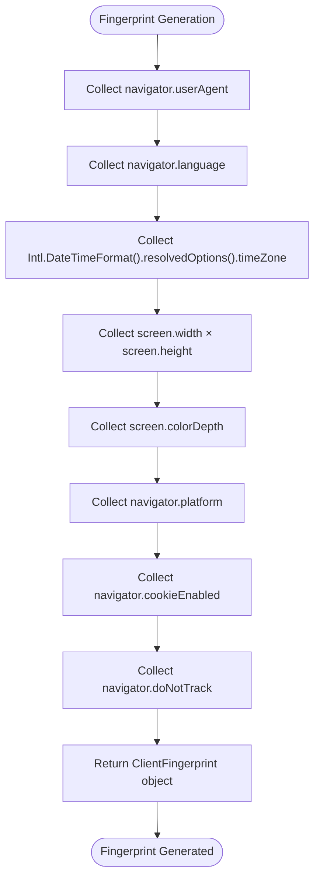
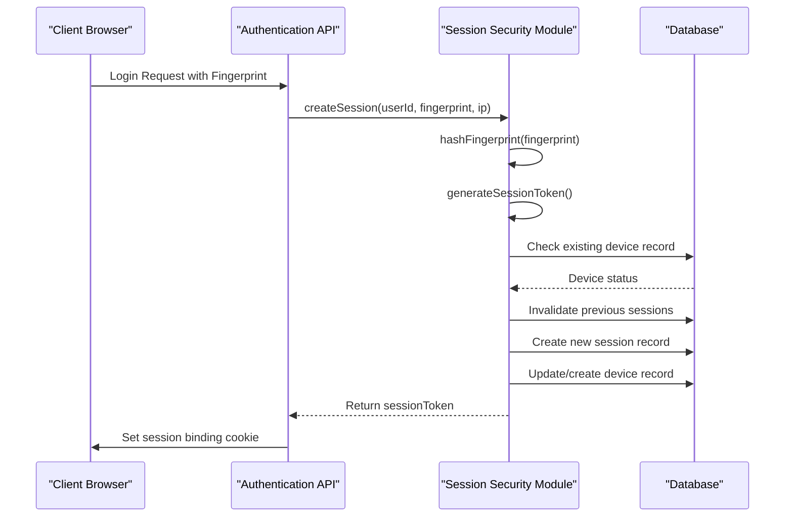
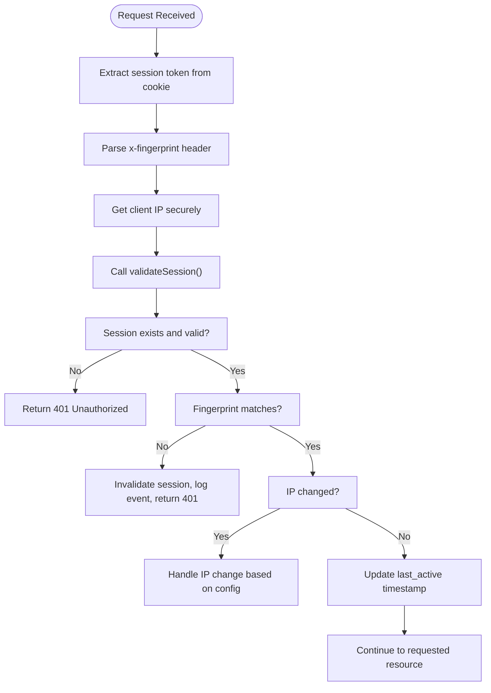
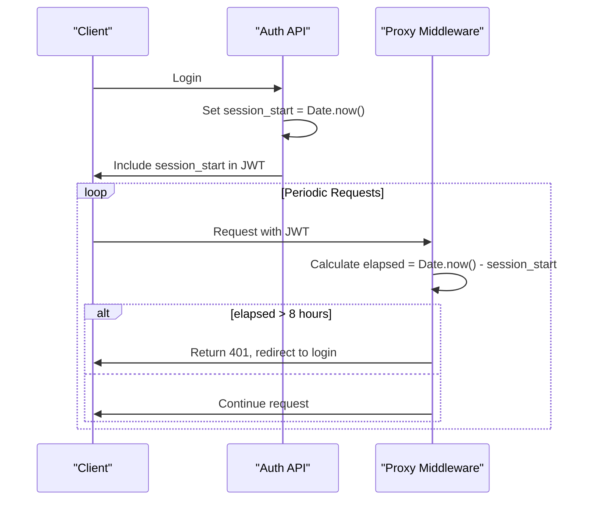
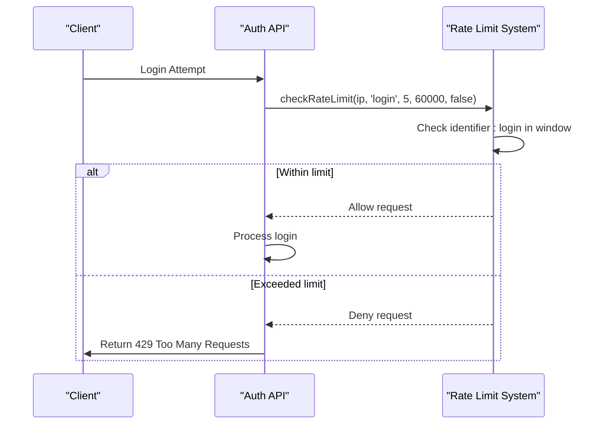

# Session Security Mechanisms

<cite>
**Referenced Files in This Document**   
- [session-security.ts](file://lib/session-security.ts)
- [fingerprint.ts](file://lib/fingerprint.ts)
- [middleware.ts](file://lib/supabase/middleware.ts)
- [rate-limit.ts](file://lib/rate-limit.ts)
- [security.ts](file://lib/security.ts)
- [use-session-timeout.ts](file://lib/hooks/use-session-timeout.ts)
- [login/route.ts](file://app/api/auth/login/route.ts)
- [logout/route.ts](file://app/api/auth/logout/route.ts)
- [proxy.ts](file://proxy.ts)
- [20260111053538_session_security.sql](file://supabase/migrations/20260111053538_session_security.sql)
</cite>

## Table of Contents
1. [Introduction](#introduction)
2. [Fingerprint Generation Algorithm](#fingerprint-generation-algorithm)
3. [Cryptographic Session Binding](#cryptographic-session-binding)
4. [Server-Side Session Validation Pipeline](#server-side-session-validation-pipeline)
5. [Absolute Session Timeout Enforcement](#absolute-session-timeout-enforcement)
6. [Cookie Security Attributes](#cookie-security-attributes)
7. [Rate Limiting Integration](#rate-limiting-integration)
8. [Database Schema and Security Events](#database-schema-and-security-events)
9. [Performance Considerations](#performance-considerations)
10. [Integration Points](#integration-points)

## Introduction
This document details the comprehensive session security mechanisms implemented in the School Management System. The architecture combines cryptographic session binding, device fingerprinting, server-side validation, and multiple security layers to protect against session hijacking, brute force attacks, and other common web vulnerabilities. The system enforces an absolute 8-hour session timeout regardless of user activity, implements HttpOnly, Secure, and SameSite=Lax cookie attributes, and integrates rate limiting at the authentication layer. The security model is designed to balance robust protection with usability, providing administrators with detailed security event logging while maintaining a seamless user experience.

**Section sources**
- [session-security.ts](file://lib/session-security.ts#L1-L373)
- [fingerprint.ts](file://lib/fingerprint.ts#L1-L68)
- [proxy.ts](file://proxy.ts#L1-L304)

## Fingerprint Generation Algorithm
The client-side fingerprint generation algorithm collects non-PII browser characteristics to create a unique device identifier. This approach provides strong device recognition while respecting user privacy. The algorithm gathers the following parameters from the browser environment:

- **User Agent**: Browser and operating system identification
- **Language**: Preferred language setting
- **Timezone**: System timezone information
- **Screen Resolution**: Display dimensions (width × height)
- **Color Depth**: Display color depth in bits
- **Platform**: Operating system platform
- **Cookies Enabled**: Whether cookies are enabled in the browser
- **Do Not Track**: User's tracking preference

The `generateFingerprint()` function in `fingerprint.ts` collects these parameters using standard browser APIs. The implementation is designed to be resistant to spoofing by using native browser properties that are difficult to manipulate programmatically. The algorithm does not collect any personally identifiable information (PII) and focuses on stable device characteristics that remain consistent across browsing sessions.

**Diagram sources**
- [fingerprint.ts](file://lib/fingerprint.ts#L22-L33)

**Section sources**
- [fingerprint.ts](file://lib/fingerprint.ts#L1-L68)
- [session-security.ts](file://lib/session-security.ts#L45-L56)

## Cryptographic Session Binding
The system implements cryptographic session binding using HMAC-SHA256 to bind sessions to client fingerprints, preventing session hijacking attacks. When a user logs in, the system creates a cryptographic binding between the session token and the client's fingerprint data.

The `hashFingerprint()` function in `session-security.ts` generates a SHA-256 hash of the fingerprint data combined with a server-side salt. The salt is obtained from environment variables (FINGERPRINT_SALT or QR_SECRET), with a default fallback value. The function normalizes the fingerprint data by extracting key properties and stringifying them in a consistent format before hashing.

**Diagram sources**
- [session-security.ts](file://lib/session-security.ts#L68-L143)
- [login/route.ts](file://app/api/auth/login/route.ts#L80-L90)

**Section sources**
- [session-security.ts](file://lib/session-security.ts#L45-L56)
- [session-security.ts](file://lib/session-security.ts#L68-L143)

## Server-Side Session Validation Pipeline
The server-side session validation pipeline executes in middleware to verify token integrity, expiration, and fingerprint match on every authenticated request. The validation process occurs in the `proxy.ts` file, which acts as a global middleware for all protected routes.

The validation pipeline follows these steps:
1. Extract the session token from the HTTP-only cookie
2. Parse the client fingerprint from the x-fingerprint header
3. Retrieve the client IP address using secure extraction methods
4. Validate the session against stored fingerprint and IP hash
5. Update the session's last active timestamp
6. Reject the request if validation fails

The `validateSession()` function performs cryptographic verification by comparing the stored fingerprint hash with the hash of the current client fingerprint. If a mismatch is detected, the system immediately invalidates the session and logs a security event. The validation is performed using the Supabase service role key to bypass RLS policies and ensure reliable access to session data.

**Diagram sources**
- [proxy.ts](file://proxy.ts#L111-L146)
- [session-security.ts](file://lib/session-security.ts#L154-L227)

**Section sources**
- [proxy.ts](file://proxy.ts#L111-L146)
- [session-security.ts](file://lib/session-security.ts#L154-L227)

## Absolute Session Timeout Enforcement
The system enforces an absolute session timeout of 8 hours regardless of user activity, providing a critical security boundary that cannot be extended by user interaction. This server-side enforcement complements the client-side inactivity timeout and ensures that sessions cannot persist indefinitely.

The timeout mechanism works as follows:
1. Upon successful login, the server records the session start time in the user's JWT metadata using `supabase.auth.updateUser()`
2. On each request, the middleware checks the elapsed time since the session start
3. If the elapsed time exceeds 8 hours, the session is terminated regardless of recent activity
4. The client-side `use-session-timeout.ts` hook also monitors the absolute timeout using the server-provided start time

This dual-layer approach ensures that even if a client-side timeout is bypassed, the server will still terminate the session after 8 hours. The implementation prevents session fixation attacks and limits the window of opportunity for attackers who might obtain a valid session token.

**Diagram sources**
- [login/route.ts](file://app/api/auth/login/route.ts#L71-L73)
- [proxy.ts](file://proxy.ts#L193-L211)
- [use-session-timeout.ts](file://lib/hooks/use-session-timeout.ts#L117-L145)

**Section sources**
- [login/route.ts](file://app/api/auth/login/route.ts#L71-L73)
- [proxy.ts](file://proxy.ts#L193-L211)
- [use-session-timeout.ts](file://lib/hooks/use-session-timeout.ts#L117-L145)

## Cookie Security Attributes
The session binding cookie implements multiple security attributes to protect against cross-site scripting (XSS) and cross-site request forgery (CSRF) attacks. The cookie is configured with the following attributes:

- **HttpOnly**: Prevents client-side JavaScript from accessing the cookie, mitigating XSS attacks
- **Secure**: Ensures the cookie is only transmitted over HTTPS connections
- **SameSite=Lax**: Prevents CSRF attacks by restricting cookie sending in cross-site requests
- **Path=/**: Applies the cookie to all paths in the domain
- **Max-Age**: Set to 28,800 seconds (8 hours) to match the server-side session timeout

These attributes work together to create multiple layers of protection. The HttpOnly flag prevents session theft via XSS vulnerabilities, while the Secure flag ensures the cookie is never sent over unencrypted connections. The SameSite=Lax attribute blocks the cookie from being sent in cross-site POST requests, preventing CSRF attacks while still allowing it for top-level navigations.

The cookie is set in the login route using the Next.js response cookie API, ensuring proper configuration across all environments. During logout, the cookie is explicitly deleted to ensure complete session termination.

**Section sources**
- [login/route.ts](file://app/api/auth/login/route.ts#L101-L107)
- [logout/route.ts](file://app/api/auth/logout/route.ts#L25)

## Rate Limiting Integration
The authentication layer integrates rate limiting to prevent brute force attacks on user accounts. The rate limiting system is implemented in `rate-limit.ts` and uses Supabase's database functions to ensure atomic operations and prevent race conditions.

Key features of the rate limiting implementation:
- **Identifier-based**: Limits can be applied to IP addresses or user IDs
- **Configurable windows**: Flexible time windows and request limits
- **Fail-safe behavior**: Configurable fail-open or fail-closed behavior
- **Atomic operations**: Uses Supabase RPC calls to prevent race conditions

For the login endpoint, the system implements a strict rate limit of 5 attempts per minute with fail-closed behavior. This means that if the rate limiting database is unavailable, login attempts are denied by default, preventing attackers from exploiting system outages to conduct brute force attacks.

The rate limiting check occurs early in the authentication process, before any password verification, to minimize server load and prevent timing attacks. The implementation uses the client's IP address as the identifier, with secure IP extraction that prioritizes platform-provided IP addresses to prevent spoofing.

**Diagram sources**
- [rate-limit.ts](file://lib/rate-limit.ts#L25-L56)
- [login/route.ts](file://app/api/auth/login/route.ts#L14-L21)

**Section sources**
- [rate-limit.ts](file://lib/rate-limit.ts#L25-L56)
- [login/route.ts](file://app/api/auth/login/route.ts#L14-L21)
- [security.ts](file://lib/security.ts#L73-L95)

## Database Schema and Security Events
The session security system uses a dedicated database schema to track sessions, devices, and security events. The schema is defined in the migration file `20260111053538_session_security.sql` and includes three main tables:

**user_sessions**: Tracks active user sessions with cryptographic binding to device fingerprints
- Stores session tokens, fingerprint hashes, and IP hashes
- Maintains timestamps for creation and last activity
- Includes validity flag and invalidation reason
- Enforced with RLS policies and proper indexing

**user_devices**: Maintains a record of trusted devices for each user
- Tracks device names, fingerprint hashes, and IP hashes
- Records first and last seen timestamps
- Supports login count tracking for anomaly detection
- Includes trusted status for security workflows

**security_events**: Logs security-related events for auditing and monitoring
- Records event types such as new devices and hijack attempts
- Stores details in JSONB format for flexible querying
- Includes IP and user agent information (hashed for privacy)
- Provides comprehensive audit trail for security investigations

The schema includes proper indexes for performance and implements Row Level Security (RLS) to ensure users can only access their own session and device data. Additionally, the system includes database functions for atomic operations like invalidating all sessions for a user, which is critical for security operations.

**Section sources**
- [20260111053538_session_security.sql](file://supabase/migrations/20260111053538_session_security.sql#L1-L106)
- [session-security.ts](file://lib/session-security.ts#L78-L85)
- [session-security.ts](file://lib/session-security.ts#L134-L139)

## Performance Considerations
The session security implementation balances security requirements with performance optimization. Several strategies are employed to minimize the performance impact of cryptographic operations and database lookups:

**Cryptographic Operations**: The system uses SHA-256 hashing for fingerprint generation, which provides strong security with reasonable performance. The hashing occurs only during login and session validation, not on every request. The implementation avoids computationally expensive operations like bcrypt for this use case, as the security model relies on the combination of multiple factors rather than password-strength hashing.

**Database Lookups**: The system optimizes database access through several mechanisms:
- Strategic indexing on frequently queried columns
- Use of Supabase service role key to bypass RLS for performance-critical operations
- Caching of user metadata in JWT claims to reduce database queries by 95%
- Atomic RPC calls for rate limiting to prevent race conditions without locking

**Client-Server Coordination**: The implementation minimizes round trips by:
- Combining session creation with login in a single transaction
- Using middleware for centralized validation
- Storing session binding token in localStorage for client-side validation

**Resource Management**: The system includes cleanup mechanisms to prevent database bloat:
- Automatic cleanup of old sessions (30-day retention)
- Removal of invalid sessions after 7 days
- Proper index maintenance for query performance

These performance considerations ensure that the security mechanisms do not create significant latency or scalability issues, even under heavy load.

**Section sources**
- [session-security.ts](file://lib/session-security.ts#L78-L85)
- [login/route.ts](file://app/api/auth/login/route.ts#L62-L77)
- [20260111053538_session_security.sql](file://supabase/migrations/20260111053538_session_security.sql#L44-L51)
- [20260111053538_session_security.sql](file://supabase/migrations/20260111053538_session_security.sql#L89-L105)

## Integration Points
The session security system integrates with various components throughout the application:

**Authentication Flow**: The security mechanisms are tightly integrated with the login and logout processes. During login, the system creates a new session record, invalidates previous sessions, and sets the secure session cookie. During logout, it invalidates the session in the database and clears the client-side cookie.

**API Routes**: All API routes are protected by the session validation middleware in `proxy.ts`. The middleware automatically validates sessions for protected routes and enforces role-based access control.

**User Interface**: The client-side components use the session security hooks to provide user feedback. The `AdminSessionGuard` component wraps protected routes and displays timeout warnings, while the `session-timeout-modal` provides a user-friendly interface for session extension.

**Security Monitoring**: The system logs security events to the `security_events` table, which can be accessed through the audit logs interface. Administrators can view new device logins, session hijack attempts, and other security-relevant events.

**Device Management**: Users can view and manage their active sessions and trusted devices through the profile interface. The system provides APIs to list sessions and devices, supporting security best practices like reviewing active sessions and removing unrecognized devices.

These integration points ensure that the session security mechanisms are consistently applied across the entire application, providing comprehensive protection without compromising usability.

**Section sources**
- [login/route.ts](file://app/api/auth/login/route.ts)
- [logout/route.ts](file://app/api/auth/logout/route.ts)
- [proxy.ts](file://proxy.ts)
- [admin-session-guard.tsx](file://components/admin-session-guard.tsx)
- [session-timeout-modal.tsx](file://components/session-timeout-modal.tsx)
- [session-security.ts](file://lib/session-security.ts)