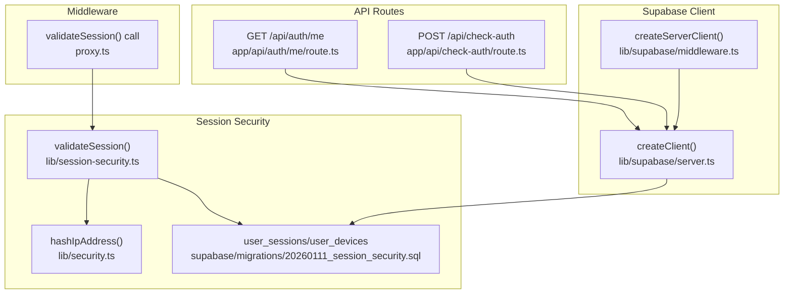
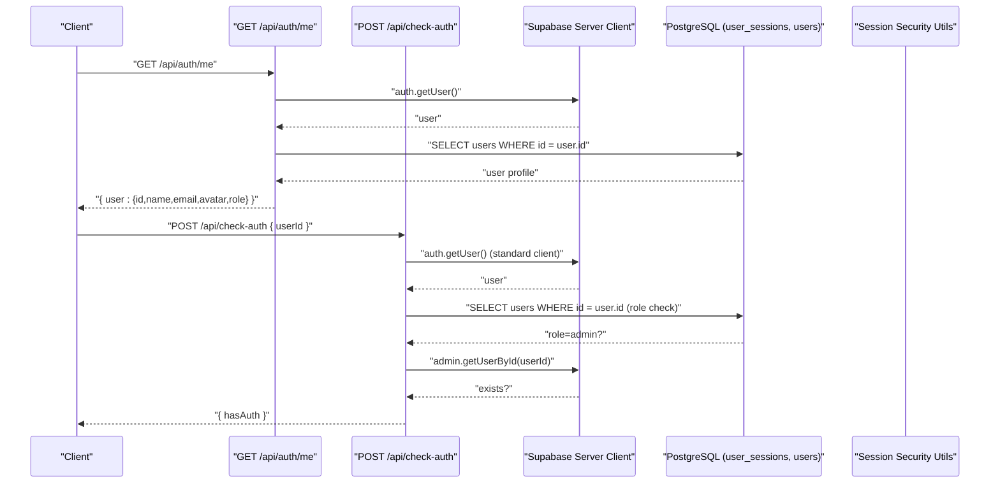
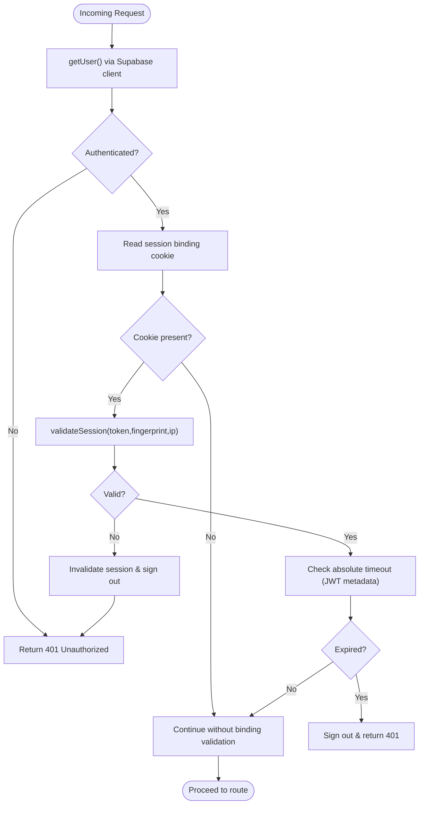
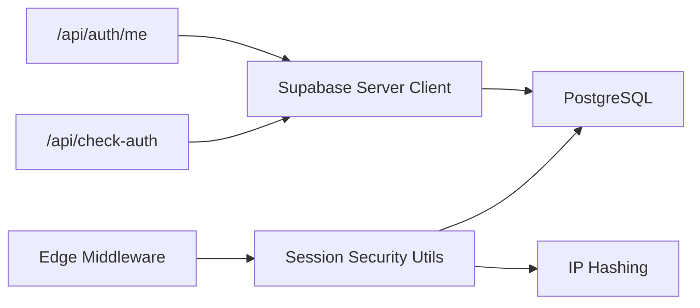

# Session Validation Endpoints

<cite>
**Referenced Files in This Document**
- [app/api/auth/me/route.ts](file://app/api/auth/me/route.ts)
- [app/api/check-auth/route.ts](file://app/api/check-auth/route.ts)
- [lib/supabase/server.ts](file://lib/supabase/server.ts)
- [lib/supabase/middleware.ts](file://lib/supabase/middleware.ts)
- [lib/session-security.ts](file://lib/session-security.ts)
- [proxy.ts](file://proxy.ts)
- [supabase/migrations/20260111_session_security.sql](file://supabase/migrations/20260111_session_security.sql)
- [lib/security.ts](file://lib/security.ts)
- [lib/hooks/use-session-timeout.ts](file://lib/hooks/use-session-timeout.ts)
</cite>

## Table of Contents
1. [Introduction](#introduction)
2. [Project Structure](#project-structure)
3. [Core Components](#core-components)
4. [Architecture Overview](#architecture-overview)
5. [Detailed Component Analysis](#detailed-component-analysis)
6. [Dependency Analysis](#dependency-analysis)
7. [Performance Considerations](#performance-considerations)
8. [Troubleshooting Guide](#troubleshooting-guide)
9. [Conclusion](#conclusion)

## Introduction
This document explains the session validation endpoints GET /api/auth/me and GET /api/check-auth, focusing on their response schemas, security behavior, and integration with the shared Supabase server client and session security checks. It also documents the shared authentication middleware that verifies session cookies, validates session tokens against the database, enforces absolute timeout, and applies IP consistency for high-risk roles.

## Project Structure
The session validation endpoints are implemented as Next.js API routes under app/api. They integrate with:
- Supabase server client for authenticated user retrieval and database access
- Shared session security utilities for fingerprint/IP hashing and session validation
- Edge middleware that enforces session binding, absolute timeout, and role-based access

**Diagram sources**
- [app/api/auth/me/route.ts](file://app/api/auth/me/route.ts#L1-L28)
- [app/api/check-auth/route.ts](file://app/api/check-auth/route.ts#L1-L64)
- [lib/supabase/server.ts](file://lib/supabase/server.ts#L1-L51)
- [lib/supabase/middleware.ts](file://lib/supabase/middleware.ts#L1-L38)
- [lib/session-security.ts](file://lib/session-security.ts#L1-L373)
- [lib/security.ts](file://lib/security.ts#L1-L136)
- [proxy.ts](file://proxy.ts#L110-L211)
- [supabase/migrations/20260111_session_security.sql](file://supabase/migrations/20260111_session_security.sql#L1-L115)

**Section sources**
- [app/api/auth/me/route.ts](file://app/api/auth/me/route.ts#L1-L28)
- [app/api/check-auth/route.ts](file://app/api/check-auth/route.ts#L1-L64)
- [lib/supabase/server.ts](file://lib/supabase/server.ts#L1-L51)
- [lib/supabase/middleware.ts](file://lib/supabase/middleware.ts#L1-L38)
- [lib/session-security.ts](file://lib/session-security.ts#L1-L373)
- [lib/security.ts](file://lib/security.ts#L1-L136)
- [proxy.ts](file://proxy.ts#L110-L211)
- [supabase/migrations/20260111_session_security.sql](file://supabase/migrations/20260111_session_security.sql#L1-L115)

## Core Components
- GET /api/auth/me
  - Purpose: Return the authenticated user’s profile data for dashboard initialization.
  - Response schema: { user: { id, name, email, avatar, role } }.
  - Security: Uses server-side Supabase client to fetch user data after verifying the session cookie; prevents exposing public SELECT on users table by fetching only the authenticated user’s row.

- GET /api/check-auth
  - Purpose: Lightweight health check that validates session cookie authenticity without returning user data.
  - Response schema: { hasAuth: boolean }.
  - Security: Requires admin role; uses service role client to confirm user existence and session validity.

- Shared Authentication Middleware
  - Session binding: Validates session cookie against stored fingerprint/IP and invalidates hijacked sessions.
  - Absolute timeout: Enforces server-side session lifetime using JWT metadata set during login.
  - Role-based enforcement: Applies stricter checks for admin routes.

**Section sources**
- [app/api/auth/me/route.ts](file://app/api/auth/me/route.ts#L1-L28)
- [app/api/check-auth/route.ts](file://app/api/check-auth/route.ts#L1-L64)
- [lib/session-security.ts](file://lib/session-security.ts#L150-L228)
- [proxy.ts](file://proxy.ts#L110-L211)

## Architecture Overview
The session validation endpoints integrate with Supabase and the edge middleware to enforce robust session security.

**Diagram sources**
- [app/api/auth/me/route.ts](file://app/api/auth/me/route.ts#L1-L28)
- [app/api/check-auth/route.ts](file://app/api/check-auth/route.ts#L1-L64)
- [lib/supabase/server.ts](file://lib/supabase/server.ts#L1-L51)
- [lib/session-security.ts](file://lib/session-security.ts#L1-L373)

## Detailed Component Analysis

### GET /api/auth/me
- Endpoint: app/api/auth/me/route.ts
- Behavior:
  - Creates a server-side Supabase client using the standard server client factory.
  - Retrieves the authenticated user via auth.getUser().
  - Fetches the user’s profile from the users table using a server-side query scoped to the authenticated user’s id.
  - Returns a JSON payload containing the user object with id, name, email, avatar, and role.
- Error handling:
  - Returns 401 Unauthorized if no user is authenticated.
  - Returns 500 Internal Server Error on unexpected errors.

Response schema:
- Success: { user: { id, name, email, avatar, role } }
- Errors: { error: string } with status 401 or 500

Use cases:
- Dashboard initialization: The frontend calls this endpoint to populate the UI with the authenticated user’s profile data.

**Section sources**
- [app/api/auth/me/route.ts](file://app/api/auth/me/route.ts#L1-L28)

### GET /api/check-auth
- Endpoint: app/api/check-auth/route.ts
- Behavior:
  - Creates a server-side Supabase client configured for read-only access to cookies.
  - Verifies the caller’s session via auth.getUser().
  - Confirms the caller has admin role by querying the users table.
  - Accepts a JSON body with a userId field and validates whether the user exists using the service role client.
  - Returns { hasAuth: true } if the user exists; otherwise { hasAuth: false }.
- Error handling:
  - Returns 401 Unauthorized if the caller is not authenticated.
  - Returns 403 Forbidden if the caller lacks admin role.
  - Returns { hasAuth: false } on exceptions or missing userId.

Response schema:
- Success: { hasAuth: boolean }
- Errors: { error: string } with status 401 or 403

Use cases:
- Route guards: Used by admin-only UI components to gate access to sensitive routes by verifying a target user’s session without exposing user data.

**Section sources**
- [app/api/check-auth/route.ts](file://app/api/check-auth/route.ts#L1-L64)

### Shared Authentication Middleware and Session Security
- Session binding:
  - The edge middleware reads the session binding cookie and validates it against stored fingerprint and IP.
  - If validation fails, the session is invalidated and the user is signed out.
- Absolute timeout:
  - The middleware enforces a server-side absolute session timeout using JWT metadata set during login.
  - On expiry, the user is signed out and receives a 401 response.
- IP consistency:
  - The session security utilities hash the IP address and compare it against stored values.
  - If IP changes are disallowed and mismatched, the session is invalidated.
- Database tables:
  - user_sessions stores session tokens bound to fingerprint/IP hashes.
  - user_devices tracks trusted devices per user.
  - security_events logs security events like hijack attempts and IP changes.

**Diagram sources**
- [proxy.ts](file://proxy.ts#L110-L211)
- [lib/session-security.ts](file://lib/session-security.ts#L150-L228)
- [lib/security.ts](file://lib/security.ts#L1-L136)

**Section sources**
- [proxy.ts](file://proxy.ts#L110-L211)
- [lib/session-security.ts](file://lib/session-security.ts#L1-L373)
- [lib/security.ts](file://lib/security.ts#L1-L136)
- [supabase/migrations/20260111_session_security.sql](file://supabase/migrations/20260111_session_security.sql#L1-L115)

### Supabase Server Client Integration
- Standard server client:
  - createClient() wraps createServerClient and manages cookie synchronization for SSR.
- Middleware client:
  - updateSession() refreshes user session state and synchronizes cookies across requests.
- Service role client:
  - Used in check-auth to verify user existence without exposing user data.

**Section sources**
- [lib/supabase/server.ts](file://lib/supabase/server.ts#L1-L51)
- [lib/supabase/middleware.ts](file://lib/supabase/middleware.ts#L1-L38)
- [app/api/check-auth/route.ts](file://app/api/check-auth/route.ts#L1-L64)

## Dependency Analysis
- API routes depend on:
  - Supabase server client for authenticated user retrieval and database access.
  - Session security utilities for fingerprint/IP hashing and session validation.
- Edge middleware depends on:
  - Session security utilities to enforce binding and IP consistency.
  - Security helpers for IP hashing and origin validation.

**Diagram sources**
- [app/api/auth/me/route.ts](file://app/api/auth/me/route.ts#L1-L28)
- [app/api/check-auth/route.ts](file://app/api/check-auth/route.ts#L1-L64)
- [lib/supabase/server.ts](file://lib/supabase/server.ts#L1-L51)
- [lib/session-security.ts](file://lib/session-security.ts#L1-L373)
- [lib/security.ts](file://lib/security.ts#L1-L136)
- [proxy.ts](file://proxy.ts#L110-L211)

**Section sources**
- [app/api/auth/me/route.ts](file://app/api/auth/me/route.ts#L1-L28)
- [app/api/check-auth/route.ts](file://app/api/check-auth/route.ts#L1-L64)
- [lib/supabase/server.ts](file://lib/supabase/server.ts#L1-L51)
- [lib/session-security.ts](file://lib/session-security.ts#L1-L373)
- [lib/security.ts](file://lib/security.ts#L1-L136)
- [proxy.ts](file://proxy.ts#L110-L211)

## Performance Considerations
- Reduced database queries: The middleware caches user metadata in JWT claims to minimize repeated database lookups.
- Lightweight admin check: /api/check-auth uses a service role client only when necessary and returns minimal data.
- Edge validation: Session binding and absolute timeout checks occur at the edge to fail fast and reduce backend load.

[No sources needed since this section provides general guidance]

## Troubleshooting Guide
Common issues and resolutions:
- 401 Unauthorized on /api/auth/me
  - Cause: Session cookie missing or invalid.
  - Resolution: Re-authenticate and ensure cookies are accepted by the browser.
- 401 Unauthorized on /api/check-auth
  - Cause: Caller not authenticated.
  - Resolution: Authenticate the caller before invoking the endpoint.
- 403 Forbidden on /api/check-auth
  - Cause: Caller lacks admin role.
  - Resolution: Ensure the caller has admin privileges.
- Session invalid or expired
  - Cause: Session binding mismatch (fingerprint/IP) or absolute timeout exceeded.
  - Resolution: Re-authenticate; verify client fingerprint/IP stability; ensure session_start metadata is present.

**Section sources**
- [app/api/auth/me/route.ts](file://app/api/auth/me/route.ts#L1-L28)
- [app/api/check-auth/route.ts](file://app/api/check-auth/route.ts#L1-L64)
- [proxy.ts](file://proxy.ts#L110-L211)
- [lib/session-security.ts](file://lib/session-security.ts#L150-L228)

## Conclusion
The session validation endpoints provide secure, lightweight mechanisms for retrieving user profile data and validating session authenticity. They integrate with shared Supabase clients and session security utilities to enforce binding, absolute timeouts, and IP consistency. Use /api/auth/me for dashboard initialization and /api/check-auth for admin route guards that require session verification without exposing user data.