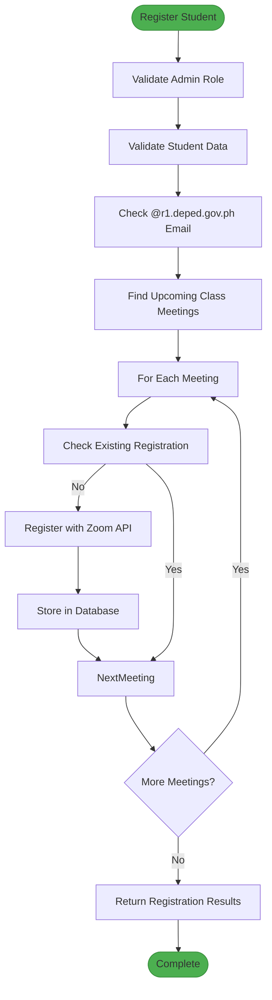
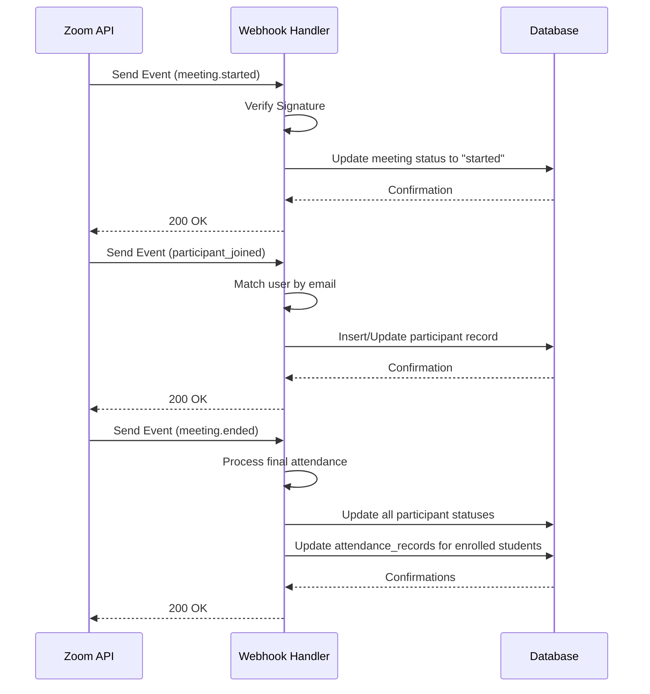
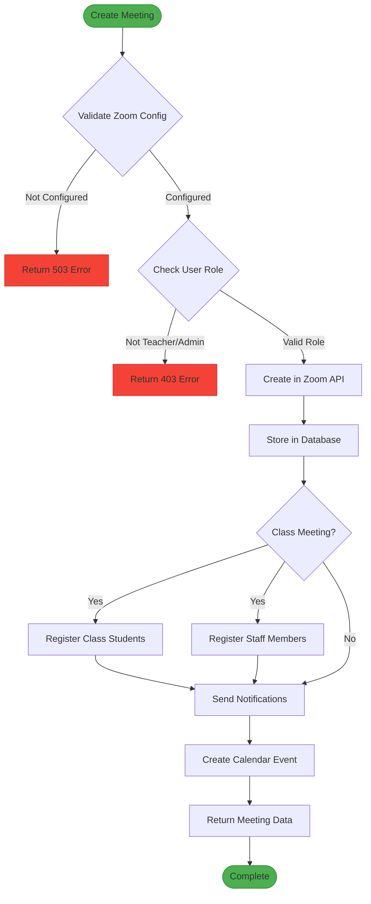

# Integration API

<cite>
**Referenced Files in This Document**   
- [meetings/route.ts](file://app/api/zoom/meetings/route.ts)
- [meetings/[id]/route.ts](file://app/api/zoom/meetings/[id]/route.ts)
- [meetings/register-student/route.ts](file://app/api/zoom/meetings/register-student/route.ts)
- [reports/route.ts](file://app/api/zoom/reports/route.ts)
- [webhook/route.ts](file://app/api/zoom/webhook/route.ts)
- [types.ts](file://lib/zoom/types.ts)
- [client.ts](file://lib/zoom/client.ts)
- [constants.ts](file://lib/zoom/constants.ts)
- [zoom-meeting-room.tsx](file://components/zoom-meeting-room.tsx)
- [zoom-meetings-list.tsx](file://components/zoom-meetings-list.tsx)
- [20260110000001_create_zoom_meetings_table.sql](file://supabase/migrations/20260110000001_create_zoom_meetings_table.sql)
- [20260110000002_create_meeting_registrants_table.sql](file://supabase/migrations/20260110000002_create_meeting_registrants_table.sql)
</cite>

## Table of Contents
1. [Introduction](#introduction)
2. [Meeting Lifecycle Management](#meeting-lifecycle-management)
3. [Participant Registration](#participant-registration)
4. [Attendance Reporting](#attendance-reporting)
5. [Webhook Event Handling](#webhook-event-handling)
6. [Meeting Creation Flow](#meeting-creation-flow)
7. [Security Considerations](#security-considerations)
8. [Error Handling](#error-handling)
9. [Usage Examples](#usage-examples)
10. [Data Models](#data-models)

## Introduction
The Integration API provides comprehensive Zoom meeting management capabilities for the School Management System. This API enables teachers and administrators to create, manage, and track virtual classroom sessions with full integration between Zoom's video conferencing platform and the school's internal systems. The API supports meeting lifecycle operations, participant registration, attendance tracking, and real-time event handling through webhooks. All endpoints require JWT authentication with admin or teacher role privileges, ensuring secure access to meeting management functionality.

## Meeting Lifecycle Management

The meeting lifecycle endpoints provide full CRUD operations for Zoom meetings, enabling creation, retrieval, updating, and deletion of virtual classroom sessions. These endpoints integrate with both the Zoom API and the internal database to maintain synchronization between systems.

### Create Meeting (POST /api/zoom/meetings)
Creates a new Zoom meeting and stores it in the database. The endpoint validates user permissions, creates the meeting in Zoom, and synchronizes data across systems.

**Request**
- **HTTP Method**: POST
- **Authentication**: JWT with admin/teacher role
- **Request Body**: `CreateZoomMeetingRequest` from `lib/zoom/types.ts`
  - `title`: string (required)
  - `description`: string (optional)
  - `startTime`: string (ISO format, required)
  - `duration`: number (minutes, required)
  - `timezone`: string (optional, defaults to UTC)
  - `classId`: string (optional, links to class)
  - `targetAudience`: enum (all, students, teachers, class, personal)
  - `settings`: `ZoomMeetingSettings` (optional)

**Response**
- **Status 201**: Meeting created successfully
- **Status 400**: Validation error (missing required fields)
- **Status 401**: Unauthorized (no authentication)
- **Status 403**: Forbidden (insufficient permissions)
- **Status 500**: Internal server error

**Section sources**
- [meetings/route.ts](file://app/api/zoom/meetings/route.ts#L54-L168)

### List Meetings (GET /api/zoom/meetings)
Retrieves a list of meetings with filtering options for status, class, and time range.

**Query Parameters**
- `status`: Filter by meeting status (scheduled, started, ended)
- `classId`: Filter by associated class
- `upcoming`: Boolean to show only upcoming meetings
- `limit`: Maximum number of results (default: 50)

**Response**
- Returns array of `ZoomMeeting` objects with host and class data
- **Status 200**: Success
- **Status 401**: Unauthorized
- **Status 500**: Database error

**Section sources**
- [meetings/route.ts](file://app/api/zoom/meetings/route.ts#L7-L52)

### Retrieve Meeting (GET /api/zoom/meetings/[id])
Gets detailed information about a specific meeting, including participants.

**Response**
- Returns `ZoomMeeting` object with joined host, class, and participants data
- **Status 200**: Success
- **Status 401**: Unauthorized
- **Status 404**: Meeting not found

**Section sources**
- [meetings/[id]/route.ts](file://app/api/zoom/meetings/[id]/route.ts#L9-L38)

### Update Meeting (PATCH /api/zoom/meetings/[id])
Modifies an existing meeting's properties.

**Permissions**
- Meeting host or admin can update
- Validates against `lib/zoom/types.ts` schema

**Section sources**
- [meetings/[id]/route.ts](file://app/api/zoom/meetings/[id]/route.ts#L40-L124)

### Delete Meeting (DELETE /api/zoom/meetings/[id])
Removes a meeting from both Zoom and the database.

**Permissions**
- Meeting host or admin can delete
- Cascades to related records (participants, registrants)

**Section sources**
- [meetings/[id]/route.ts](file://app/api/zoom/meetings/[id]/route.ts#L127-L186)

## Participant Registration

The participant registration system manages enrollment of students and staff in Zoom meetings, ensuring proper access control and bypassing of waiting rooms for authorized participants.

### Register Student (POST /api/zoom/meetings/register-student)
Registers a student for all upcoming class meetings, validating against enrollment and email domain requirements.

**Request**
- **Body Parameters**:
  - `studentId`: string (required)
  - `classId`: string (required)
- **Validation**:
  - User must be admin
  - Student must have valid @r1.deped.gov.ph email
  - Student must be enrolled in the class

**Process**
1. Validates student's DepEd email domain
2. Finds all upcoming meetings for the class with registration enabled
3. Registers student with Zoom API
4. Stores registration in `meeting_registrants` table

**Response**
- Success: Registration count and meeting IDs
- Error: Domain restriction or validation failure

**Diagram sources**
- [meetings/register-student/route.ts](file://app/api/zoom/meetings/register-student/route.ts#L9-L115)
- [constants.ts](file://lib/zoom/constants.ts#L5-L22)

**Section sources**
- [meetings/register-student/route.ts](file://app/api/zoom/meetings/register-student/route.ts#L9-L115)

## Attendance Reporting

The reporting endpoints provide detailed analytics on meeting attendance and participation, supporting both individual meeting reports and aggregate statistics.

### Meeting Reports (GET /api/zoom/reports)
Generates attendance reports with detailed statistics.

**Query Parameters**
- `meetingId`: Get detailed report for specific meeting
- `startDate`/`endDate`: Filter range for aggregate reports

**Individual Meeting Report**
Returns meeting data with attendance statistics:
- Total invited participants
- Total joined attendees
- Attendance rate percentage
- Average duration (seconds)
- Participant list with status and duration

**Aggregate Report**
Returns statistics across multiple meetings:
- Total meetings
- Completed meetings
- Total participants and attendees
- Average attendance rate
- Total meeting minutes

**Permissions**
- Teacher: Can view their own meetings
- Admin: Can view all meetings

**Section sources**
- [reports/route.ts](file://app/api/zoom/reports/route.ts#L5-L132)

## Webhook Event Handling

The webhook endpoint receives real-time events from Zoom, updating meeting status and attendance records automatically.

### Webhook Endpoint (POST /api/zoom/webhook)
Processes Zoom events to maintain synchronized state between systems.

**Security**
- Verifies webhook signature using `ZOOM_WEBHOOK_SECRET`
- Handles URL validation challenge for Zoom verification
- Validates request signature header

**Supported Events**
- `meeting.started`: Updates meeting status to "started"
- `meeting.ended`: Updates status to "ended" and processes final attendance
- `meeting.participant_joined`: Creates/updates participant record
- `meeting.participant_left`: Updates leave time and duration

**Attendance Processing**
- Tracks join/leave times and calculates duration
- Updates `zoom_participants` table
- Processes final attendance when meeting ends:
  - Marks enrolled students who joined ≥15 minutes as "present"
  - Marks those with shorter duration as "partial"
  - Marks non-attendees as "absent"

**Diagram sources**
- [webhook/route.ts](file://app/api/zoom/webhook/route.ts#L17-L246)

**Section sources**
- [webhook/route.ts](file://app/api/zoom/webhook/route.ts#L17-L246)

## Meeting Creation Flow

The meeting creation process integrates multiple systems to ensure seamless virtual classroom experiences. This flow orchestrates Zoom API calls, database operations, and notification systems.

**Diagram sources**
- [meetings/route.ts](file://app/api/zoom/meetings/route.ts#L54-L168)
- [client.ts](file://lib/zoom/client.ts#L92-L131)

**Section sources**
- [meetings/route.ts](file://app/api/zoom/meetings/route.ts#L54-L168)

## Security Considerations

The API implements multiple security measures to protect meeting data and ensure authorized access.

### Authentication and Authorization
- JWT authentication for all endpoints
- Role-based access control (admin/teacher for creation)
- Row Level Security (RLS) policies in Supabase
- Host-only modification/deletion of meetings

### Data Protection
- IP address hashing in database (migration: 20260110000003_hash_ip_addresses.sql)
- Environment variables for Zoom credentials
- Webhook signature verification
- Email domain restrictions for class meetings (@r1.deped.gov.ph)

### Zoom Integration Security
- Server-to-Server OAuth for API access
- SDK signature generation for embedded meetings
- Waiting room enabled with registered users bypassing
- Registration auto-approval for authorized participants

**Section sources**
- [meetings/route.ts](file://app/api/zoom/meetings/route.ts#L67-L76)
- [webhook/route.ts](file://app/api/zoom/webhook/route.ts#L47-L62)
- [constants.ts](file://lib/zoom/constants.ts#L5-L22)
- [20260110000001_create_zoom_meetings_table.sql](file://supabase/migrations/20260110000001_create_zoom_meetings_table.sql#L52-L92)

## Error Handling

The API implements comprehensive error handling for both client and server-side failures.

### Zoom API Integration Errors
- Connection failures with retry logic
- Rate limiting (10 registrants per batch with delays)
- Token expiration and refresh mechanism
- Network timeout handling

### Validation Errors
- Missing required fields (400 Bad Request)
- Unauthorized access (401 Unauthorized)
- Insufficient permissions (403 Forbidden)
- Resource not found (404 Not Found)
- Domain restrictions for student emails

### Data Consistency
- Database transactions for critical operations
- Upsert operations to prevent duplicates
- Cascade deletes for related records
- Error logging with console.error

**Section sources**
- [client.ts](file://lib/zoom/client.ts#L44-L74)
- [meetings/route.ts](file://app/api/zoom/meetings/route.ts#L162-L167)
- [webhook/route.ts](file://app/api/zoom/webhook/route.ts#L242-L244)

## Usage Examples

### Frontend Integration

#### Zoom Meetings List Component
The `zoom-meetings-list.tsx` component displays meetings with filtering and creation capabilities.

**Features**
- Tabbed interface for upcoming/past meetings
- Role-based creation permissions
- Real-time updates after CRUD operations
- Integration with `ZoomMeetingDialog` for creation/editing

**API Usage**
- GET `/api/zoom/meetings` with filtering parameters
- Handles loading states and error conditions
- Updates local state on successful operations

**Section sources**
- [zoom-meetings-list.tsx](file://components/zoom-meetings-list.tsx#L1-L246)

#### Zoom Meeting Room Component
The `zoom-meeting-room.tsx` component provides embedded meeting experience.

**Workflow**
1. Fetch join information from API
2. Load Zoom SDK scripts
3. Initialize embedded meeting client
4. Handle join/leave events

**API Endpoints**
- GET `/api/zoom/meetings/[id]/join` - Retrieve join information
- POST `/api/zoom/meetings/[id]/join` - Record join/leave events

**Section sources**
- [zoom-meeting-room.tsx](file://components/zoom-meeting-room.tsx#L1-L254)

## Data Models

The Zoom integration uses several database tables to store meeting and attendance data.

### zoom_meetings Table
Stores core meeting information synchronized with Zoom API.

**Columns**
- `id`: UUID (primary key)
- `zoom_meeting_id`: TEXT (Zoom's meeting ID)
- `host_id`: UUID (references users)
- `title`: TEXT (required)
- `description`: TEXT
- `meeting_type`: TEXT (scheduled, instant, recurring)
- `start_time`: TIMESTAMPTZ (required)
- `duration`: INTEGER (minutes)
- `timezone`: TEXT
- `join_url`: TEXT (required)
- `start_url`: TEXT
- `password`: TEXT
- `status`: TEXT (scheduled, started, ended, cancelled)
- `class_id`: UUID (references classes)
- `target_audience`: TEXT (all, students, teachers, class, personal)
- `settings`: JSONB
- `registration_url`: TEXT
- `registration_enabled`: BOOLEAN

**Section sources**
- [20260110000001_create_zoom_meetings_table.sql](file://supabase/migrations/20260110000001_create_zoom_meetings_table.sql#L2-L21)

### zoom_participants Table
Tracks real-time participant attendance in meetings.

**Columns**
- `id`: UUID (primary key)
- `meeting_id`: UUID (references zoom_meetings)
- `user_id`: UUID (references users)
- `zoom_participant_id`: TEXT
- `name`: TEXT
- `email`: TEXT
- `join_time`: TIMESTAMPTZ
- `leave_time`: TIMESTAMPTZ
- `duration`: INTEGER (seconds)
- `status`: TEXT (invited, joined, left)

**Section sources**
- [20260110000001_create_zoom_meetings_table.sql](file://supabase/migrations/20260110000001_create_zoom_meetings_table.sql#L24-L37)

### meeting_registrants Table
Stores registration information for participants who can bypass waiting rooms.

**Columns**
- `id`: UUID (primary key)
- `meeting_id`: UUID (references zoom_meetings)
- `user_id`: UUID (references users)
- `zoom_registrant_id`: TEXT
- `join_url`: TEXT
- `status`: TEXT (pending, approved, denied)
- `registered_at`: TIMESTAMPTZ

**Section sources**
- [20260110000002_create_meeting_registrants_table.sql](file://supabase/migrations/20260110000002_create_meeting_registrants_table.sql#L2-L13)

### Type Definitions
The `lib/zoom/types.ts` file defines TypeScript interfaces for API contracts.

**Key Interfaces**
- `ZoomMeeting`: Response type for meeting endpoints
- `CreateZoomMeetingRequest`: Request body for meeting creation
- `ZoomParticipant`: Participant data structure
- `ZoomMeetingSettings`: Configurable meeting options
- `ZoomWebhookEvent`: Incoming webhook payload structure

**Section sources**
- [types.ts](file://lib/zoom/types.ts#L1-L168)