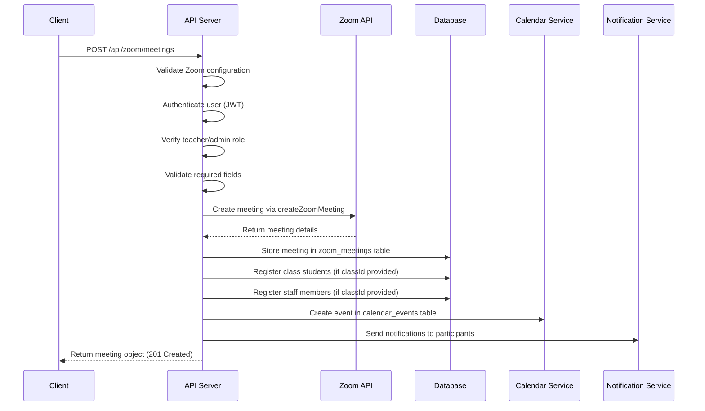
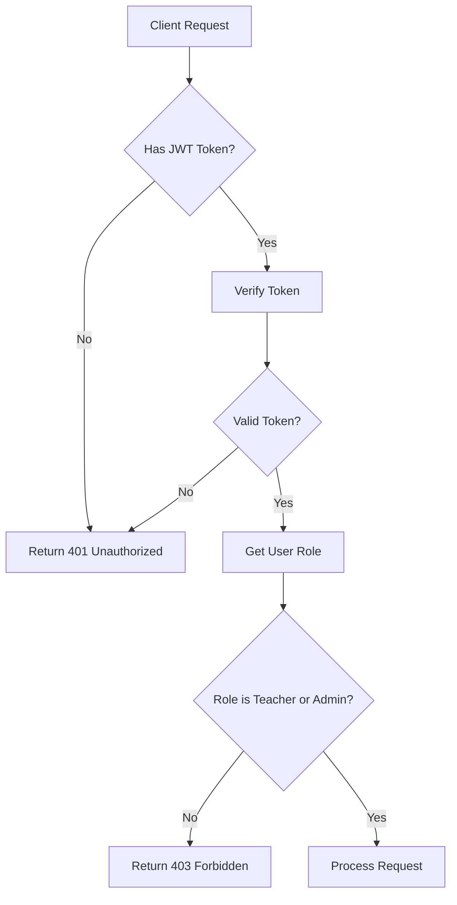
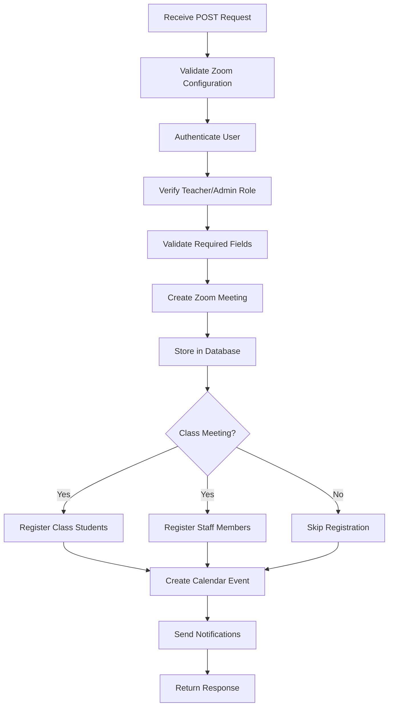
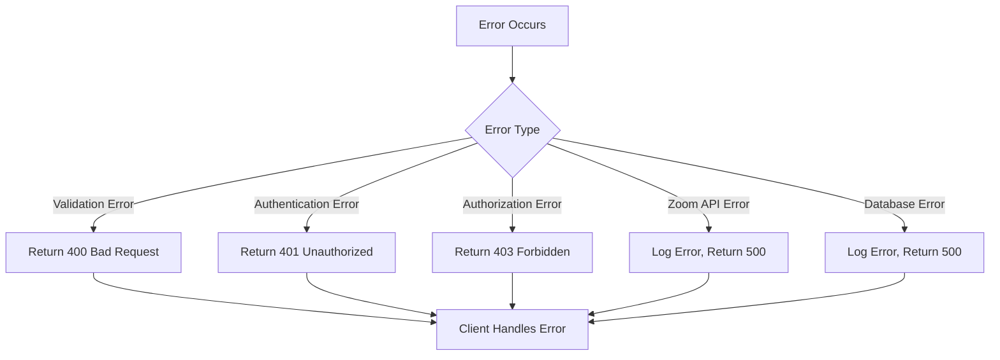
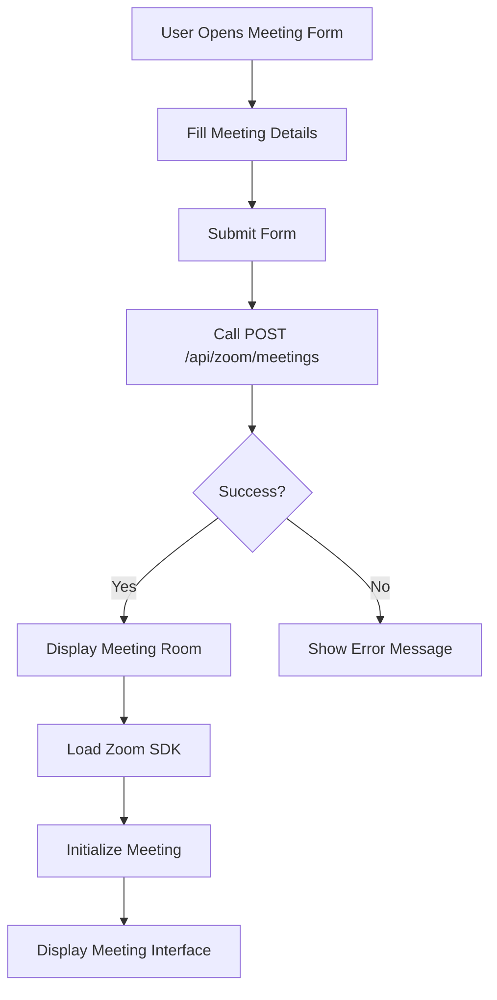
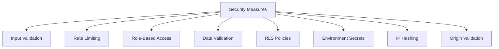
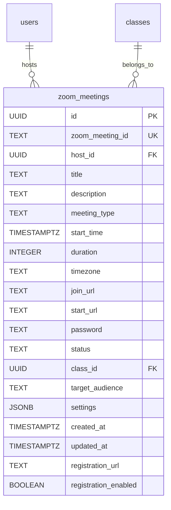

# Meeting Creation

<cite>
**Referenced Files in This Document**   
- [route.ts](file://app/api/zoom/meetings/route.ts)
- [client.ts](file://lib/zoom/client.ts)
- [types.ts](file://lib/zoom/types.ts)
- [constants.ts](file://lib/zoom/constants.ts)
- [zoom-meeting-room.tsx](file://components/zoom-meeting-room.tsx)
- [create_calendar_events_table.sql](file://supabase/migrations/20260105000002_create_calendar_events_table.sql)
- [create_zoom_meetings_table.sql](file://supabase/migrations/20260110023523_create_zoom_meetings_table.sql)
- [create_meeting_registrants_table.sql](file://supabase/migrations/20260110000002_create_meeting_registrants_table.sql)
- [security.ts](file://lib/security.ts)
- [rate-limit.ts](file://lib/rate-limit.ts)
</cite>

## Table of Contents
1. [Introduction](#introduction)
2. [API Endpoint](#api-endpoint)
3. [Request Schema](#request-schema)
4. [Response Format](#response-format)
5. [Authentication and Authorization](#authentication-and-authorization)
6. [Implementation Flow](#implementation-flow)
7. [Error Handling](#error-handling)
8. [Frontend Integration](#frontend-integration)
9. [Security Considerations](#security-considerations)
10. [Database Schema](#database-schema)

## Introduction
This document provides comprehensive documentation for the Zoom meeting creation API endpoint in the School Management System. The API enables teachers and administrators to create scheduled Zoom meetings, with special integration for class-related meetings that automatically register students and staff, create calendar events, and send notifications. The system ensures data consistency between Zoom's platform and the internal database while maintaining security through proper authentication, input validation, and rate limiting.

## API Endpoint
The Zoom meeting creation endpoint is a POST request to `/api/zoom/meetings` that creates a new scheduled meeting in Zoom and stores the meeting details in the internal database. The endpoint handles the complete workflow from validation through Zoom API integration, database persistence, participant registration, calendar event creation, and notification dispatch.



**Diagram sources**
- [route.ts](file://app/api/zoom/meetings/route.ts#L54-L169)
- [client.ts](file://lib/zoom/client.ts#L92-L131)

**Section sources**
- [route.ts](file://app/api/zoom/meetings/route.ts#L54-L169)

## Request Schema
The POST request to create a Zoom meeting requires specific parameters in the request body. The following table details the required and optional fields:

| Field | Type | Required | Description | Default |
|-------|------|----------|-------------|---------|
| title | string | Yes | Meeting title/subject | - |
| description | string | No | Meeting agenda/description | - |
| startTime | string | Yes | ISO 8601 formatted start time (e.g., "2025-03-15T10:00:00Z") | - |
| duration | number | Yes | Meeting duration in minutes | - |
| timezone | string | No | IANA timezone identifier | "UTC" |
| classId | string | No | Associated class ID for class meetings | - |
| targetAudience | string | No | Audience type: "all", "students", "teachers", "class", "personal" | "class" |
| settings | object | No | Zoom meeting settings object | {} |

The request body must be sent as JSON with the appropriate Content-Type header.

**Section sources**
- [types.ts](file://lib/zoom/types.ts#L119-L128)
- [route.ts](file://app/api/zoom/meetings/route.ts#L78-L83)

## Response Format
Upon successful meeting creation, the API returns a 201 Created status with a JSON response containing the complete meeting object. The response includes the meeting details along with joined data for the host and associated class.

```json
{
  "meeting": {
    "id": "uuid",
    "zoom_meeting_id": "string",
    "host_id": "uuid",
    "title": "string",
    "description": "string",
    "meeting_type": "scheduled",
    "start_time": "string (ISO 8601)",
    "duration": "number",
    "timezone": "string",
    "join_url": "string",
    "start_url": "string",
    "password": "string",
    "status": "scheduled",
    "class_id": "uuid",
    "target_audience": "string",
    "settings": "object",
    "created_at": "string (ISO 8601)",
    "updated_at": "string (ISO 8601)",
    "host": {
      "id": "string",
      "name": "string",
      "email": "string",
      "avatar": "string"
    },
    "class": {
      "id": "string",
      "name": "string"
    }
  }
}
```

The response includes all fields from the `zoom_meetings` table with the addition of joined data from the `users` table (for the host) and `classes` table (for the associated class).

**Section sources**
- [route.ts](file://app/api/zoom/meetings/route.ts#L122-L126)
- [types.ts](file://lib/zoom/types.ts#L9-L31)

## Authentication and Authorization
The meeting creation endpoint requires authentication via JWT token and role-based access control. Only users with "teacher" or "admin" roles are permitted to create meetings.



The authentication flow follows these steps:
1. The API checks for the presence of a valid JWT token in the request
2. The user's role is retrieved from the database
3. Access is granted only if the user's role is "teacher" or "admin"
4. Unauthorized requests return appropriate HTTP status codes (401 for unauthenticated, 403 for insufficient privileges)

**Diagram sources**
- [route.ts](file://app/api/zoom/meetings/route.ts#L60-L76)

**Section sources**
- [route.ts](file://app/api/zoom/meetings/route.ts#L60-L76)

## Implementation Flow
The meeting creation process follows a comprehensive workflow that ensures data consistency and provides a seamless experience for users. The implementation flow consists of several key steps executed in sequence.

### Complete Implementation Flow


### Detailed Step-by-Step Process
1. **Validation of Required Fields**: The API first validates that the required fields (title, startTime, duration) are present in the request body. Missing required fields result in a 400 Bad Request response.

2. **Role-Based Access Control**: The system verifies that the authenticated user has either "teacher" or "admin" role. This check prevents students and other unauthorized users from creating meetings.

3. **Zoom API Integration**: The system calls the `createZoomMeeting` function to create a meeting in Zoom with the specified parameters. For class meetings (those with a classId), registration is enabled to allow automatic bypass of the waiting room.

4. **Database Persistence**: The meeting details are stored in the `zoom_meetings` table, including all relevant information such as meeting IDs, URLs, settings, and relationships to the host and class.

5. **Automatic Participant Registration**: For class meetings, the system automatically registers enrolled students (with valid DepEd emails) and all teachers/admins to bypass the waiting room. This is accomplished through the `registerClassStudents` and `registerStaff` functions.

6. **Calendar Event Creation**: A corresponding event is created in the `calendar_events` table with the meeting details, ensuring the meeting appears in the system's calendar view.

7. **Notification Dispatch**: Notifications are sent to all relevant participants based on the target audience, informing them of the newly scheduled meeting.

**Section sources**
- [route.ts](file://app/api/zoom/meetings/route.ts#L85-L161)
- [client.ts](file://lib/zoom/client.ts#L92-L131)

## Error Handling
The API implements comprehensive error handling to manage various failure scenarios gracefully. Errors are categorized and handled appropriately to provide meaningful feedback while maintaining system stability.



The following error scenarios are specifically handled:

- **Zoom Configuration Error**: Returns 503 Service Unavailable if Zoom is not properly configured
- **Authentication Failure**: Returns 401 Unauthorized if no valid JWT token is provided
- **Authorization Failure**: Returns 403 Forbidden if the user lacks teacher/admin privileges
- **Validation Errors**: Returns 400 Bad Request for missing required fields
- **Zoom API Failures**: Catches and logs errors from the Zoom API, returning 500 Internal Server Error
- **Database Errors**: Handles database insertion failures, logging the error and returning 500 Internal Server Error

The error handling is implemented within a try-catch block that captures any exceptions during the meeting creation process, ensuring that the API always returns an appropriate HTTP response.

**Section sources**
- [route.ts](file://app/api/zoom/meetings/route.ts#L162-L168)

## Frontend Integration
The frontend implementation for meeting creation is demonstrated in the `zoom-meeting-room.tsx` component, which shows how the API is consumed in the user interface.



The component demonstrates proper error handling and loading states, providing feedback to users during the meeting creation and joining process. It also shows the fallback mechanism when the Zoom SDK cannot be loaded, allowing users to join via the Zoom app or web client.

**Section sources**
- [zoom-meeting-room.tsx](file://components/zoom-meeting-room.tsx#L1-L254)

## Security Considerations
The meeting creation system implements multiple security measures to protect against common vulnerabilities and ensure data integrity.

### Input Validation
All input is validated both on the client and server side. Required fields are checked, and the system validates that the startTime is in proper ISO 8601 format. The validation occurs in the API route before any processing begins.

### Rate Limiting
The system implements rate limiting to prevent abuse of the meeting creation endpoint. The `checkRateLimit` function in `rate-limit.ts` uses Supabase's RPC functionality to enforce limits based on user identifier and endpoint, preventing brute force attacks and excessive API usage.

### Data Validation
The system validates user roles and permissions before allowing meeting creation. Additionally, for class meetings, it verifies that students have valid DepEd email addresses before registering them, ensuring only authorized participants can bypass the waiting room.

### Security Hardening
The implementation includes several security hardening measures:
- Row Level Security (RLS) policies on database tables restrict access based on user roles and ownership
- Environment variables store sensitive credentials (Zoom API keys, secrets)
- IP address hashing protects user privacy while allowing abuse detection
- Origin validation prevents CSRF attacks on API routes



**Section sources**
- [security.ts](file://lib/security.ts#L1-L136)
- [rate-limit.ts](file://lib/rate-limit.ts#L1-L56)
- [constants.ts](file://lib/zoom/constants.ts#L1-L22)

## Database Schema
The meeting creation functionality relies on several database tables with specific relationships and constraints.

### zoom_meetings Table
The primary table for storing meeting information includes fields for all meeting details and relationships.



### Related Tables
The system also utilizes several related tables to support the full functionality:

- **meeting_registrants**: Tracks Zoom registration information for participants, allowing them to bypass the waiting room
- **calendar_events**: Stores calendar events corresponding to meetings, ensuring they appear in the system's calendar view
- **zoom_participants**: Tracks attendance and participation in meetings

The tables are connected through foreign key relationships and protected by Row Level Security policies that enforce access controls based on user roles and ownership.

**Section sources**
- [create_zoom_meetings_table.sql](file://supabase/migrations/20260110023523_create_zoom_meetings_table.sql#L1-L106)
- [create_meeting_registrants_table.sql](file://supabase/migrations/20260110000002_create_meeting_registrants_table.sql#L1-L53)
- [create_calendar_events_table.sql](file://supabase/migrations/20260105000002_create_calendar_events_table.sql#L1-L57)