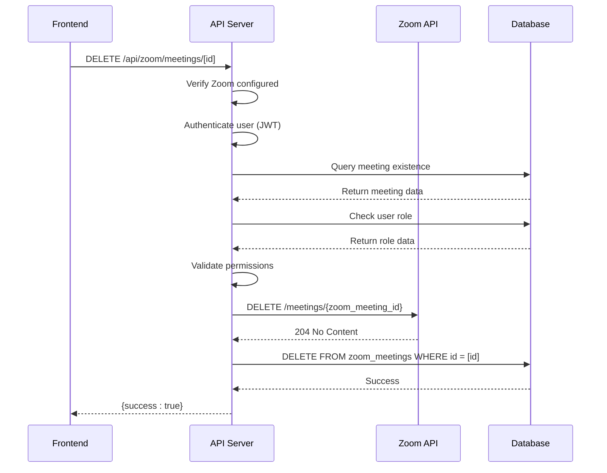

# Meeting Deletion

<cite>
**Referenced Files in This Document**   
- [route.ts](file://app/api/zoom/meetings/[id]/route.ts)
- [zoom-meetings-list.tsx](file://components/zoom-meetings-list.tsx)
- [zoom-meeting-card.tsx](file://components/zoom-meeting-card.tsx)
- [client.ts](file://lib/zoom/client.ts)
- [create_zoom_meetings_table.sql](file://supabase/migrations/20260110000001_create_zoom_meetings_table.sql)
- [create_calendar_events_table.sql](file://supabase/migrations/20260105000002_create_calendar_events_table.sql)
- [notification-store.ts](file://lib/notification-store.ts)
</cite>

## Table of Contents
1. [API Endpoint Overview](#api-endpoint-overview)
2. [Authentication and Authorization](#authentication-and-authorization)
3. [Implementation Flow](#implementation-flow)
4. [Error Handling](#error-handling)
5. [Frontend Integration](#frontend-integration)
6. [Data Integrity and Related Records](#data-integrity-and-related-records)
7. [Usage Examples](#usage-examples)
8. [Sequence Diagram](#sequence-diagram)

## API Endpoint Overview

The DELETE `/api/zoom/meetings/[id]` endpoint handles the deletion of Zoom meetings from both the external Zoom service and the internal database. The endpoint accepts a meeting ID as a path parameter and requires no request body. Upon successful deletion, it returns a JSON response with a success flag.

The endpoint follows REST conventions with proper HTTP status codes for various scenarios:
- 200 OK: Meeting successfully deleted
- 401 Unauthorized: User not authenticated
- 403 Forbidden: User lacks required permissions
- 404 Not Found: Meeting does not exist
- 500 Internal Server Error: Database or Zoom API error
- 503 Service Unavailable: Zoom service not configured

**Section sources**
- [route.ts](file://app/api/zoom/meetings/[id]/route.ts#L128-L186)

## Authentication and Authorization

The endpoint requires JWT-based authentication through Supabase Auth. Users must be logged in to perform deletion operations. The authorization model follows a role-based access control (RBAC) system where only the meeting host or users with admin privileges can delete a meeting.

The authorization check is performed by querying the user's role from the database and comparing it against the meeting's host ID. This ensures that only authorized users can modify meeting data, maintaining data security and integrity.

```typescript
if (existingMeeting.host_id !== user.id && userData?.role !== "admin") {
  return NextResponse.json({ error: "Not authorized to delete this meeting" }, { status: 403 })
}
```

**Section sources**
- [route.ts](file://app/api/zoom/meetings/[id]/route.ts#L153-L162)

## Implementation Flow

The meeting deletion process follows a two-step approach to ensure consistency between the external Zoom service and the internal database:

1. **Verification Phase**: The system first verifies the meeting exists in the database by querying the `zoom_meetings` table using the provided ID.
2. **Permission Check**: The system validates that the authenticated user is either the meeting host or has admin privileges.
3. **External Deletion**: The system calls the Zoom API to delete the meeting from Zoom's servers using the `deleteZoomMeeting` function.
4. **Internal Deletion**: After successful external deletion, the system removes the meeting record from the `zoom_meetings` table.

The deletion from the internal database automatically cascades to related records in the `zoom_participants` and `meeting_registrants` tables due to foreign key constraints with `ON DELETE CASCADE`.

**Section sources**
- [route.ts](file://app/api/zoom/meetings/[id]/route.ts#L164-L177)
- [client.ts](file://lib/zoom/client.ts#L178-L182)

## Error Handling

The endpoint implements comprehensive error handling to manage various failure scenarios:

- **Zoom API Failures**: If the Zoom API call fails, the error is caught and returned with a 500 status code. This could occur due to network issues, authentication problems with Zoom, or rate limiting.
- **Database Errors**: Any database operation failures are captured and returned with appropriate error messages and 500 status codes.
- **Permission Denials**: When users attempt to delete meetings they don't own and aren't admins, a 403 Forbidden response is returned.
- **Missing Meetings**: If the meeting ID doesn't exist in the database, a 404 Not Found response is returned.

The error handling uses try-catch blocks to gracefully handle exceptions and provide meaningful error messages to clients while logging detailed error information for debugging purposes.

**Section sources**
- [route.ts](file://app/api/zoom/meetings/[id]/route.ts#L179-L185)

## Frontend Integration

The frontend components provide a user-friendly interface for meeting deletion, primarily through the `ZoomMeetingCard` component. When a user clicks the delete button, a confirmation dialog is displayed to prevent accidental deletions.

The `zoom-meetings-list.tsx` component manages the state of meetings and updates the UI after successful deletion by filtering out the deleted meeting from the local state. This provides immediate visual feedback without requiring a full page refresh.

```typescript
const handleDelete = (meetingId: string) => {
  setMeetings(meetings.filter(m => m.id !== meetingId))
}
```

The delete operation is triggered by a fetch request to the API endpoint, and appropriate loading states and error notifications are displayed to enhance user experience.

**Section sources**
- [zoom-meetings-list.tsx](file://components/zoom-meetings-list.tsx#L73-L75)
- [zoom-meeting-card.tsx](file://components/zoom-meeting-card.tsx#L98-L113)

## Data Integrity and Related Records

Data integrity is maintained through several mechanisms:

1. **Database Constraints**: The `zoom_meetings` table has foreign key relationships with the `users` and `classes` tables, ensuring referential integrity.
2. **Cascade Deletion**: Related records in `zoom_participants` and `meeting_registrants` tables are automatically removed when a meeting is deleted due to `ON DELETE CASCADE` constraints.
3. **Calendar Event Synchronization**: Although not directly handled in the deletion endpoint, meetings are created with corresponding calendar events, suggesting a need for similar cleanup upon deletion to maintain consistency.

The RLS (Row Level Security) policies in Supabase ensure that users can only delete meetings they have permission to modify, preventing unauthorized access and data corruption.

**Section sources**
- [create_zoom_meetings_table.sql](file://supabase/migrations/20260110000001_create_zoom_meetings_table.sql#L24-L37)
- [create_calendar_events_table.sql](file://supabase/migrations/20260105000002_create_calendar_events_table.sql#L2-19)

## Usage Examples

The primary usage pattern for meeting deletion is implemented in the `ZoomMeetingCard` component, which provides a delete button for authorized users. When clicked, it shows a confirmation dialog with a warning message about the consequences of deletion.

The deletion process is integrated into the meeting management workflow, allowing hosts and administrators to clean up meetings that are no longer needed. This is particularly important for maintaining an organized schedule and reducing clutter in the user interface.

After deletion, the system should ideally clean up related calendar events and notifications to maintain data consistency across the application, though this specific cleanup logic would need to be implemented separately.

**Section sources**
- [zoom-meeting-card.tsx](file://components/zoom-meeting-card.tsx#L254-L270)

## Sequence Diagram



**Diagram sources **
- [route.ts](file://app/api/zoom/meetings/[id]/route.ts#L128-L186)
- [client.ts](file://lib/zoom/client.ts#L178-L182)