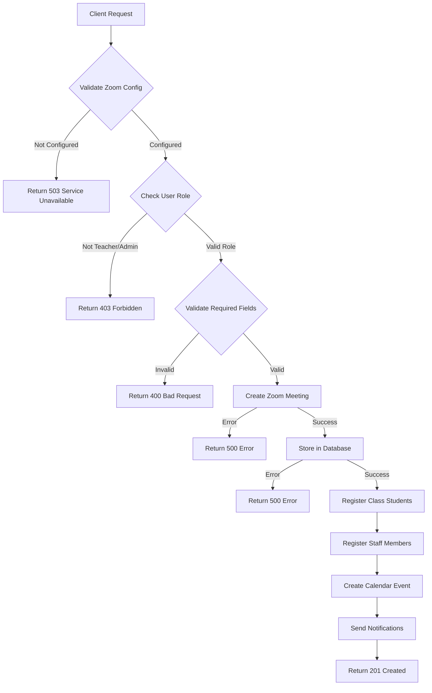
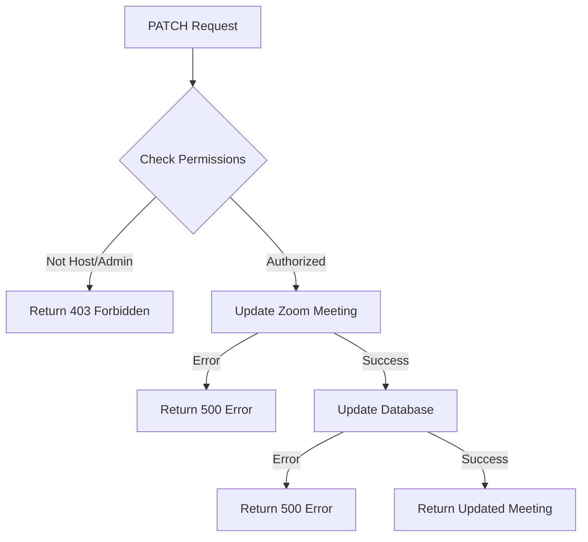
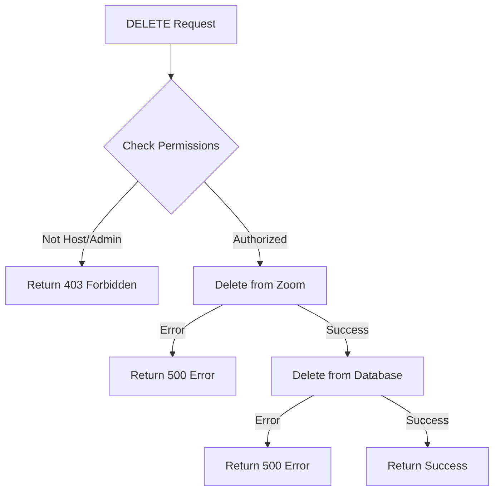
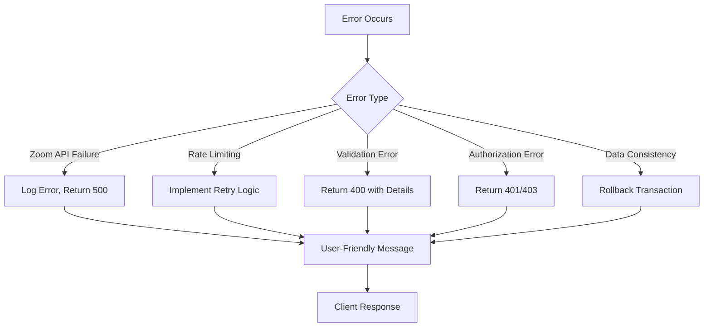
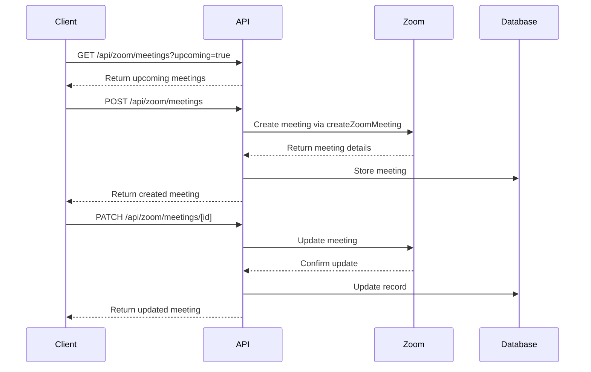
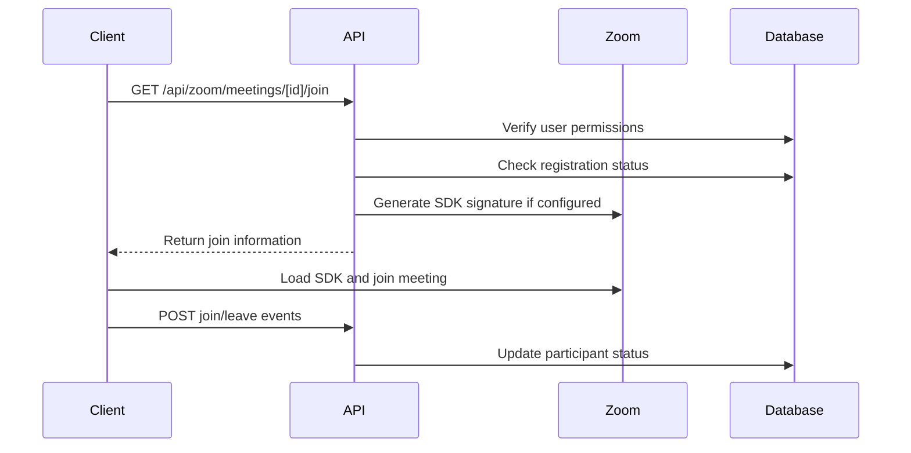
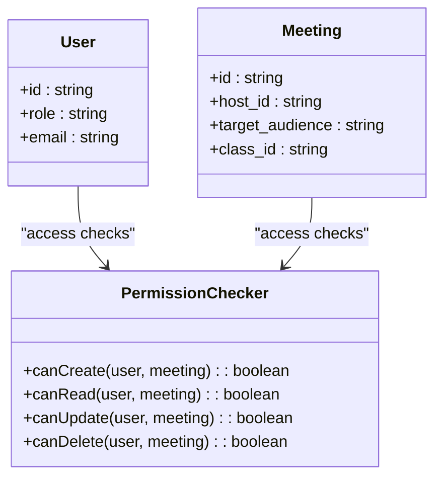
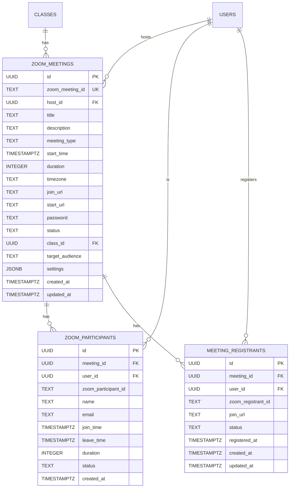

# Meeting Management

<cite>
**Referenced Files in This Document**   
- [route.ts](file://app/api/zoom/meetings/route.ts)
- [route.ts](file://app/api/zoom/meetings/[id]/route.ts)
- [types.ts](file://lib/zoom/types.ts)
- [client.ts](file://lib/zoom/client.ts)
- [constants.ts](file://lib/zoom/constants.ts)
- [zoom-meeting-room.tsx](file://components/zoom-meeting-room.tsx)
- [zoom-meetings-list.tsx](file://components/zoom-meetings-list.tsx)
- [route.ts](file://app/api/zoom/meetings/[id]/join/route.ts)
- [route.ts](file://app/api/zoom/meetings/register-student/route.ts)
- [route.ts](file://app/api/zoom/meetings/[id]/participants/route.ts)
- [20260110000001_create_zoom_meetings_table.sql](file://supabase/migrations/20260110000001_create_zoom_meetings_table.sql)
- [20260110000002_create_meeting_registrants_table.sql](file://supabase/migrations/20260110000002_create_meeting_registrants_table.sql)
</cite>

## Table of Contents
1. [Introduction](#introduction)
2. [API Endpoints](#api-endpoints)
3. [Meeting Creation Flow](#meeting-creation-flow)
4. [Update and Delete Operations](#update-and-delete-operations)
5. [Error Handling](#error-handling)
6. [Usage Examples](#usage-examples)
7. [Security Considerations](#security-considerations)
8. [Data Models](#data-models)

## Introduction
This document provides comprehensive API documentation for Zoom meeting lifecycle operations within the School Management System. It covers the complete CRUD operations for meetings, including creation, retrieval, update, and deletion. The system integrates with Zoom's API to manage virtual meetings while maintaining synchronization with the application's database. The documentation details the request/response schemas, authentication requirements, and the complete flow of meeting operations, including calendar integration and participant management.

## API Endpoints

### POST /api/zoom/meetings - Create Meeting
Creates a new Zoom meeting with the specified parameters.

**HTTP Method**: POST  
**URL Pattern**: `/api/zoom/meetings`  
**Authentication**: JWT with admin or teacher role required  
**Request Schema**: `CreateZoomMeetingRequest` from `lib/zoom/types.ts`

| Field | Type | Required | Description |
|-------|------|----------|-------------|
| title | string | Yes | Meeting title |
| description | string | No | Meeting description |
| startTime | string | Yes | ISO 8601 formatted start time |
| duration | number | Yes | Duration in minutes |
| timezone | string | No | Timezone (defaults to UTC) |
| classId | string | No | Associated class ID |
| targetAudience | enum | No | Audience type: all, students, teachers, class, personal |
| settings | ZoomMeetingSettings | No | Meeting configuration options |

**Response**: 201 Created with meeting object or 4xx/5xx error

**Section sources**
- [route.ts](file://app/api/zoom/meetings/route.ts#L54-L168)

### GET /api/zoom/meetings - List Meetings
Retrieves a list of meetings with optional filtering.

**HTTP Method**: GET  
**URL Pattern**: `/api/zoom/meetings`  
**Authentication**: JWT required  
**Query Parameters**:

| Parameter | Type | Description |
|-----------|------|-------------|
| status | string | Filter by meeting status |
| classId | string | Filter by class ID |
| upcoming | boolean | Only return upcoming meetings |
| limit | number | Maximum number of results |

**Response**: 200 OK with array of meeting objects or 500 error

**Section sources**
- [route.ts](file://app/api/zoom/meetings/route.ts#L7-L52)

### GET /api/zoom/meetings/[id] - Get Meeting
Retrieves a specific meeting by ID.

**HTTP Method**: GET  
**URL Pattern**: `/api/zoom/meetings/[id]`  
**Authentication**: JWT required  
**Response**: 200 OK with meeting object or 404 error if not found

**Section sources**
- [route.ts](file://app/api/zoom/meetings/[id]/route.ts#L9-L38)

### PATCH /api/zoom/meetings/[id] - Update Meeting
Updates an existing meeting.

**HTTP Method**: PATCH  
**URL Pattern**: `/api/zoom/meetings/[id]`  
**Authentication**: JWT with admin role or meeting host  
**Request Body**: Partial `CreateZoomMeetingRequest`  
**Response**: 200 OK with updated meeting object or 403/404/500 errors

**Section sources**
- [route.ts](file://app/api/zoom/meetings/[id]/route.ts#L40-L124)

### DELETE /api/zoom/meetings/[id] - Delete Meeting
Deletes a meeting.

**HTTP Method**: DELETE  
**URL Pattern**: `/api/zoom/meetings/[id]`  
**Authentication**: JWT with admin role or meeting host  
**Response**: 200 OK with success message or 403/404/500 errors

**Section sources**
- [route.ts](file://app/api/zoom/meetings/[id]/route.ts#L127-L186)

## Meeting Creation Flow



**Diagram sources**
- [route.ts](file://app/api/zoom/meetings/route.ts#L54-L168)

**Section sources**
- [route.ts](file://app/api/zoom/meetings/route.ts#L54-L168)
- [client.ts](file://lib/zoom/client.ts#L92-L131)
- [20260110000001_create_zoom_meetings_table.sql](file://supabase/migrations/20260110000001_create_zoom_meetings_table.sql)

The meeting creation flow involves several key steps:
1. **Zoom Configuration Check**: Verifies that Zoom API credentials are properly configured
2. **Role Validation**: Ensures the user is either a teacher or admin
3. **Field Validation**: Confirms required fields (title, startTime, duration) are provided
4. **Zoom API Integration**: Creates the meeting via `createZoomMeeting`
5. **Database Synchronization**: Stores meeting details in the `zoom_meetings` table
6. **Participant Registration**: Automatically registers class students and staff members
7. **Calendar Integration**: Creates a corresponding calendar event
8. **Notification System**: Sends notifications to all participants

For class-linked meetings, registration is automatically enabled, allowing authorized participants to bypass the waiting room.

## Update and Delete Operations

### Update Operation Flow


**Diagram sources**
- [route.ts](file://app/api/zoom/meetings/[id]/route.ts#L40-L124)

### Delete Operation Flow


**Diagram sources**
- [route.ts](file://app/api/zoom/meetings/[id]/route.ts#L127-L186)

**Section sources**
- [route.ts](file://app/api/zoom/meetings/[id]/route.ts#L40-L186)

Update and delete operations require proper authorization. Only the meeting host or an admin can modify or delete a meeting. The system maintains consistency by updating both the Zoom API and the local database. For updates, the system first updates the Zoom meeting and then synchronizes the changes to the database. For deletions, it removes the meeting from Zoom first, followed by database deletion (with cascade handling for related records).

## Error Handling



**Diagram sources**
- [route.ts](file://app/api/zoom/meetings/route.ts#L162-L167)
- [route.ts](file://app/api/zoom/meetings/[id]/route.ts#L119-L123)

**Section sources**
- [route.ts](file://app/api/zoom/meetings/route.ts#L162-L167)
- [route.ts](file://app/api/zoom/meetings/[id]/route.ts#L119-L123)
- [client.ts](file://lib/zoom/client.ts#L71-L74)

The system implements comprehensive error handling for various scenarios:
- **Zoom API Failures**: Network issues, authentication problems, or service outages
- **Rate Limiting**: The `addMeetingRegistrantsBatch` function implements batch processing with delays to respect Zoom's rate limits
- **Data Consistency**: Database transactions ensure that operations are atomic
- **Validation Errors**: Input validation at both client and server levels
- **Authorization Errors**: Proper role-based access control

All errors are logged for debugging purposes while returning appropriate HTTP status codes and user-friendly messages to the client.

## Usage Examples

### zoom-meetings-list.tsx Component
The `ZoomMeetingsList` component demonstrates client-side interaction with the API:



**Diagram sources**
- [zoom-meetings-list.tsx](file://components/zoom-meetings-list.tsx#L43-L62)
- [route.ts](file://app/api/zoom/meetings/route.ts)

### zoom-meeting-room.tsx Component
The `ZoomMeetingRoom` component handles meeting participation:



**Diagram sources**
- [zoom-meeting-room.tsx](file://components/zoom-meeting-room.tsx#L35-L58)
- [route.ts](file://app/api/zoom/meetings/[id]/join/route.ts)

**Section sources**
- [zoom-meetings-list.tsx](file://components/zoom-meetings-list.tsx)
- [zoom-meeting-room.tsx](file://components/zoom-meeting-room.tsx)

## Security Considerations

### Role-Based Access Control


**Diagram sources**
- [route.ts](file://app/api/zoom/meetings/route.ts#L67-L76)
- [route.ts](file://app/api/zoom/meetings/[id]/route.ts#L66-L75)

### Input Validation and Domain Restrictions
The system implements multiple security layers:
- **JWT Authentication**: All endpoints require valid JWT tokens
- **Role Validation**: Only teachers and admins can create meetings
- **Ownership Checks**: Users can only modify meetings they host (unless admin)
- **Email Domain Restrictions**: Class meetings require @r1.deped.gov.ph email addresses
- **Input Validation**: Server-side validation of all request parameters
- **RLS Policies**: Database-level row-level security

The `isAllowedEmail` function enforces domain restrictions, ensuring only authorized users can participate in class meetings. The system also implements proper error handling to avoid information leakage.

**Section sources**
- [constants.ts](file://lib/zoom/constants.ts)
- [route.ts](file://app/api/zoom/meetings/[id]/join/route.ts#L55-L59)
- [20260110000001_create_zoom_meetings_table.sql](file://supabase/migrations/20260110000001_create_zoom_meetings_table.sql#L52-L75)

## Data Models

### Database Schema


**Diagram sources**
- [20260110000001_create_zoom_meetings_table.sql](file://supabase/migrations/20260110000001_create_zoom_meetings_table.sql)
- [20260110000002_create_meeting_registrants_table.sql](file://supabase/migrations/20260110000002_create_meeting_registrants_table.sql)

### Type Definitions
The `ZoomApiMeeting` interface from `lib/zoom/types.ts` defines the structure for Zoom API responses:

```typescript
interface ZoomApiMeeting {
  id: number | string
  uuid: string
  host_id: string
  topic: string
  type: number
  start_time: string
  duration: number
  timezone: string
  created_at: string
  join_url: string
  start_url: string
  password: string
  registration_url?: string
  settings: {
    host_video: boolean
    participant_video: boolean
    join_before_host: boolean
    mute_upon_entry: boolean
    waiting_room: boolean
    auto_recording: string
    approval_type?: number
    registration_type?: number
  }
}
```

The system maintains data consistency by mapping between the Zoom API response format and the application's database schema, ensuring all relevant information is properly stored and accessible.

**Section sources**
- [types.ts](file://lib/zoom/types.ts#L82-L106)
- [20260110000001_create_zoom_meetings_table.sql](file://supabase/migrations/20260110000001_create_zoom_meetings_table.sql)