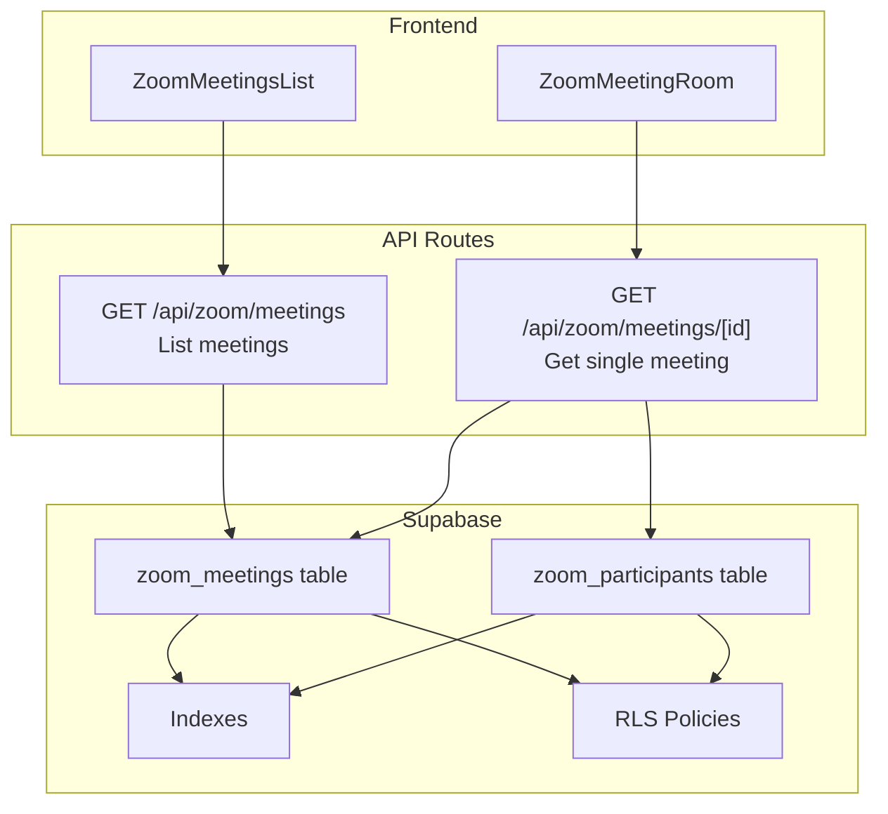
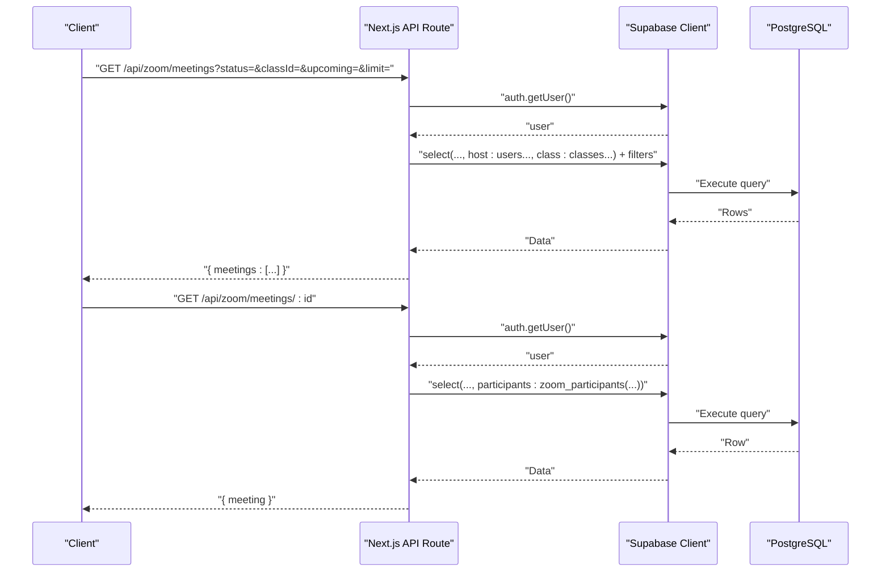
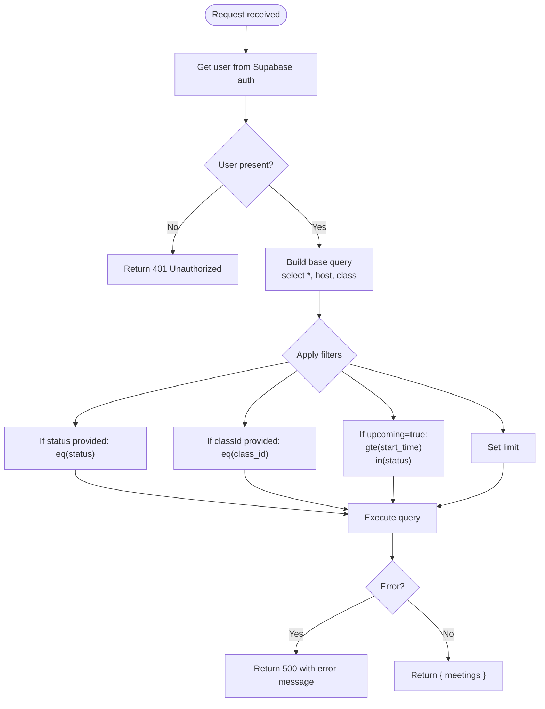
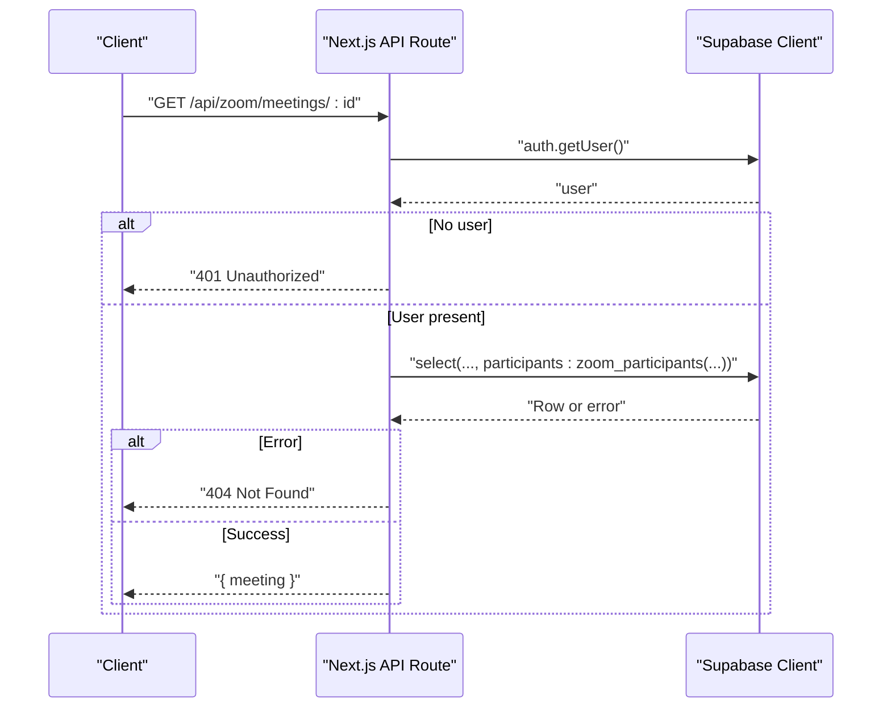
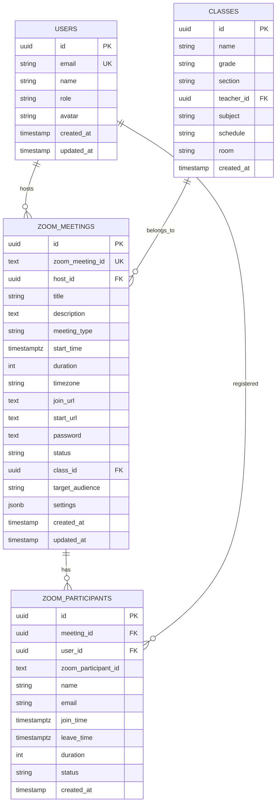
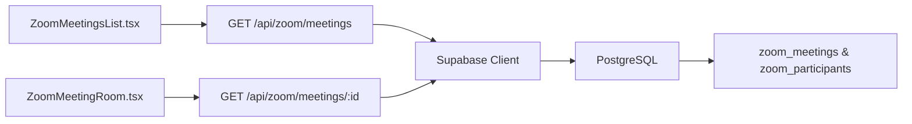

# Meeting Retrieval

<cite>
**Referenced Files in This Document**
- [app/api/zoom/meetings/route.ts](file://app/api/zoom/meetings/route.ts)
- [app/api/zoom/meetings/[id]/route.ts](file://app/api/zoom/meetings/[id]/route.ts)
- [supabase/migrations/20260110000001_create_zoom_meetings_table.sql](file://supabase/migrations/20260110000001_create_zoom_meetings_table.sql)
- [lib/zoom/types.ts](file://lib/zoom/types.ts)
- [lib/zoom/client.ts](file://lib/zoom/client.ts)
- [components/zoom-meetings-list.tsx](file://components/zoom-meetings-list.tsx)
- [components/zoom-meeting-room.tsx](file://components/zoom-meeting-room.tsx)
</cite>

## Table of Contents
1. [Introduction](#introduction)
2. [Project Structure](#project-structure)
3. [Core Components](#core-components)
4. [Architecture Overview](#architecture-overview)
5. [Detailed Component Analysis](#detailed-component-analysis)
6. [Dependency Analysis](#dependency-analysis)
7. [Performance Considerations](#performance-considerations)
8. [Troubleshooting Guide](#troubleshooting-guide)
9. [Conclusion](#conclusion)

## Introduction
This document provides detailed API documentation for Zoom meeting retrieval operations. It covers:
- Listing meetings with query parameters
- Retrieving a single meeting by ID, including participants
- Authentication requirements (JWT via Supabase)
- Implementation details: user authentication checks, Supabase queries with joins, filtering logic, and handling of upcoming vs. past meetings
- Error handling for unauthorized access and non-existent meetings
- Usage examples from frontend components
- Performance considerations and caching strategies

## Project Structure
The meeting retrieval endpoints are implemented as Next.js API routes under the Zoom namespace. The database schema defines the meeting and participant entities with indexes and Row Level Security policies. Frontend components demonstrate typical data-fetching patterns.

**Diagram sources**
- [app/api/zoom/meetings/route.ts](file://app/api/zoom/meetings/route.ts#L1-L52)
- [app/api/zoom/meetings/[id]/route.ts](file://app/api/zoom/meetings/[id]/route.ts#L9-L38)
- [supabase/migrations/20260110000001_create_zoom_meetings_table.sql](file://supabase/migrations/20260110000001_create_zoom_meetings_table.sql#L1-L113)
- [components/zoom-meetings-list.tsx](file://components/zoom-meetings-list.tsx#L43-L62)
- [components/zoom-meeting-room.tsx](file://components/zoom-meeting-room.tsx#L26-L61)

**Section sources**
- [app/api/zoom/meetings/route.ts](file://app/api/zoom/meetings/route.ts#L1-L52)
- [app/api/zoom/meetings/[id]/route.ts](file://app/api/zoom/meetings/[id]/route.ts#L9-L38)
- [supabase/migrations/20260110000001_create_zoom_meetings_table.sql](file://supabase/migrations/20260110000001_create_zoom_meetings_table.sql#L1-L113)
- [components/zoom-meetings-list.tsx](file://components/zoom-meetings-list.tsx#L43-L62)
- [components/zoom-meeting-room.tsx](file://components/zoom-meeting-room.tsx#L26-L61)

## Core Components
- GET /api/zoom/meetings
  - Purpose: List meetings with optional filters and pagination
  - Query parameters: status, classId, upcoming, limit
  - Response: { meetings: ZoomMeeting[] }
- GET /api/zoom/meetings/[id]
  - Purpose: Retrieve a single meeting by ID
  - Response: { meeting: ZoomMeetingWithParticipants }

Authentication:
- Both endpoints require a valid JWT session (via Supabase auth.getUser)
- Unauthorized requests receive a 401 response

**Section sources**
- [app/api/zoom/meetings/route.ts](file://app/api/zoom/meetings/route.ts#L1-L52)
- [app/api/zoom/meetings/[id]/route.ts](file://app/api/zoom/meetings/[id]/route.ts#L9-L38)

## Architecture Overview
The retrieval flow relies on Supabase for authentication and data access. The backend performs:
- User authentication via Supabase
- Supabase queries with joins to include host user and class data
- Filtering based on query parameters
- For single meeting retrieval, participants are included with user data

**Diagram sources**
- [app/api/zoom/meetings/route.ts](file://app/api/zoom/meetings/route.ts#L1-L52)
- [app/api/zoom/meetings/[id]/route.ts](file://app/api/zoom/meetings/[id]/route.ts#L9-L38)

## Detailed Component Analysis

### Endpoint: GET /api/zoom/meetings
- Method: GET
- URL: /api/zoom/meetings
- Query parameters:
  - status: Filter by meeting status (e.g., scheduled, started, ended)
  - classId: Filter by class ID
  - upcoming: Boolean flag ("true") to include only future meetings with status in [scheduled, started]
  - limit: Integer limit for results (default 50)
- Authentication: JWT required (Supabase auth.getUser)
- Response schema:
  - meetings: Array of ZoomMeeting with host and class joined data
- Implementation highlights:
  - Select with joins to include host user and class data
  - Ordering by start_time ascending
  - Conditional filters based on query parameters
  - Upcoming logic: gte(start_time) with status restriction
- Error handling:
  - 401 Unauthorized if no user
  - 500 Internal Server Error on query errors

**Diagram sources**
- [app/api/zoom/meetings/route.ts](file://app/api/zoom/meetings/route.ts#L1-L52)

**Section sources**
- [app/api/zoom/meetings/route.ts](file://app/api/zoom/meetings/route.ts#L1-L52)

### Endpoint: GET /api/zoom/meetings/[id]
- Method: GET
- URL: /api/zoom/meetings/:id
- Authentication: JWT required (Supabase auth.getUser)
- Response schema:
  - meeting: ZoomMeetingWithParticipants including host, class, and participants with user data
- Implementation highlights:
  - Select with joins to include host, class, and participants
  - Participants include nested user data
  - Single-row fetch with .single()
- Error handling:
  - 401 Unauthorized if no user
  - 404 Not Found if meeting does not exist

**Diagram sources**
- [app/api/zoom/meetings/[id]/route.ts](file://app/api/zoom/meetings/[id]/route.ts#L9-L38)

**Section sources**
- [app/api/zoom/meetings/[id]/route.ts](file://app/api/zoom/meetings/[id]/route.ts#L9-L38)

### Data Model and Relationships
The Zoom meeting data model includes meetings and participants with indexes and RLS policies.

**Diagram sources**
- [supabase/migrations/20260110000001_create_zoom_meetings_table.sql](file://supabase/migrations/20260110000001_create_zoom_meetings_table.sql#L1-L113)

**Section sources**
- [supabase/migrations/20260110000001_create_zoom_meetings_table.sql](file://supabase/migrations/20260110000001_create_zoom_meetings_table.sql#L1-L113)
- [lib/zoom/types.ts](file://lib/zoom/types.ts#L9-L47)

### Implementation Details

#### Authentication and Authorization
- Both endpoints call Supabase auth.getUser to validate JWT
- Unauthorized users receive 401
- For single meeting retrieval, the response includes participants with user data, leveraging RLS policies that allow hosts/admins to view participants

**Section sources**
- [app/api/zoom/meetings/route.ts](file://app/api/zoom/meetings/route.ts#L1-L20)
- [app/api/zoom/meetings/[id]/route.ts](file://app/api/zoom/meetings/[id]/route.ts#L9-L38)
- [supabase/migrations/20260110000001_create_zoom_meetings_table.sql](file://supabase/migrations/20260110000001_create_zoom_meetings_table.sql#L94-L113)

#### Supabase Queries and Joins
- Base query selects all meeting fields plus:
  - host: users with id, name, email, avatar
  - class: classes with id, name
- Single meeting query adds:
  - participants: zoom_participants with nested user data
- Ordering: meetings ordered by start_time ascending
- Indexes: dedicated indexes on host_id, class_id, start_time, status, meeting_id, user_id

**Section sources**
- [app/api/zoom/meetings/route.ts](file://app/api/zoom/meetings/route.ts#L21-L30)
- [app/api/zoom/meetings/[id]/route.ts](file://app/api/zoom/meetings/[id]/route.ts#L19-L31)
- [supabase/migrations/20260110000001_create_zoom_meetings_table.sql](file://supabase/migrations/20260110000001_create_zoom_meetings_table.sql#L39-L46)

#### Filtering Logic
- status: equality filter
- classId: equality filter
- upcoming: when true, filters to future meetings (gte start_time) and restricts status to [scheduled, started]
- limit: applies row limit

**Section sources**
- [app/api/zoom/meetings/route.ts](file://app/api/zoom/meetings/route.ts#L15-L20)
- [app/api/zoom/meetings/route.ts](file://app/api/zoom/meetings/route.ts#L31-L42)

#### Handling Upcoming vs. Past Meetings
- Upcoming view uses upcoming=true to include only future meetings with status in [scheduled, started]
- Past view uses status=ended to include ended meetings
- Ordering ensures chronological display

**Section sources**
- [components/zoom-meetings-list.tsx](file://components/zoom-meetings-list.tsx#L43-L62)

#### Participants Relationship
- Single meeting retrieval includes participants with nested user data
- This enables displaying participant details alongside meeting metadata

**Section sources**
- [app/api/zoom/meetings/[id]/route.ts](file://app/api/zoom/meetings/[id]/route.ts#L19-L31)

#### Error Handling
- Unauthorized: 401
- Not found: 404 (single meeting)
- Internal errors: 500 with error message

**Section sources**
- [app/api/zoom/meetings/route.ts](file://app/api/zoom/meetings/route.ts#L11-L13)
- [app/api/zoom/meetings/route.ts](file://app/api/zoom/meetings/route.ts#L46-L49)
- [app/api/zoom/meetings/[id]/route.ts](file://app/api/zoom/meetings/[id]/route.ts#L33-L35)

### Usage Examples

#### Frontend Data Fetching Patterns
- Listing meetings:
  - The component constructs query parameters (classId, upcoming/past, limit) and calls the list endpoint
  - Example path: [components/zoom-meetings-list.tsx](file://components/zoom-meetings-list.tsx#L43-L62)

- Single meeting retrieval:
  - The component fetches meeting details by ID and displays them
  - Example path: [components/zoom-meeting-room.tsx](file://components/zoom-meeting-room.tsx#L26-L61)

These components demonstrate how the frontend interacts with the backend endpoints and how query parameters are used to tailor the results.

**Section sources**
- [components/zoom-meetings-list.tsx](file://components/zoom-meetings-list.tsx#L43-L62)
- [components/zoom-meeting-room.tsx](file://components/zoom-meeting-room.tsx#L26-L61)

## Dependency Analysis
- Backend depends on Supabase for authentication and data access
- Database schema defines tables, indexes, and RLS policies
- Frontend components depend on the API endpoints for data

**Diagram sources**
- [components/zoom-meetings-list.tsx](file://components/zoom-meetings-list.tsx#L43-L62)
- [components/zoom-meeting-room.tsx](file://components/zoom-meeting-room.tsx#L26-L61)
- [app/api/zoom/meetings/route.ts](file://app/api/zoom/meetings/route.ts#L1-L52)
- [app/api/zoom/meetings/[id]/route.ts](file://app/api/zoom/meetings/[id]/route.ts#L9-L38)
- [supabase/migrations/20260110000001_create_zoom_meetings_table.sql](file://supabase/migrations/20260110000001_create_zoom_meetings_table.sql#L1-L113)

**Section sources**
- [components/zoom-meetings-list.tsx](file://components/zoom-meetings-list.tsx#L43-L62)
- [components/zoom-meeting-room.tsx](file://components/zoom-meeting-room.tsx#L26-L61)
- [app/api/zoom/meetings/route.ts](file://app/api/zoom/meetings/route.ts#L1-L52)
- [app/api/zoom/meetings/[id]/route.ts](file://app/api/zoom/meetings/[id]/route.ts#L9-L38)
- [supabase/migrations/20260110000001_create_zoom_meetings_table.sql](file://supabase/migrations/20260110000001_create_zoom_meetings_table.sql#L1-L113)

## Performance Considerations
- Query optimization:
  - Indexes on host_id, class_id, start_time, status, meeting_id, user_id support filtering and joining
  - Ordering by start_time reduces client-side sorting overhead
- Pagination:
  - Use the limit parameter to constrain result sets
- Caching strategies:
  - Frontend: Cache recent lists and single meeting data for short TTLs
  - Backend: Consider caching frequently accessed meeting details if appropriate
- Network efficiency:
  - Use minimal field selection via Supabase select to reduce payload sizes
  - Batch operations (when applicable) to minimize round trips

**Section sources**
- [supabase/migrations/20260110000001_create_zoom_meetings_table.sql](file://supabase/migrations/20260110000001_create_zoom_meetings_table.sql#L39-L46)
- [app/api/zoom/meetings/route.ts](file://app/api/zoom/meetings/route.ts#L15-L20)

## Troubleshooting Guide
- 401 Unauthorized:
  - Ensure the client sends a valid JWT cookie/session
  - Verify Supabase auth.getUser succeeds
- 404 Not Found:
  - Confirm the meeting ID exists and the user has access according to RLS policies
- 500 Internal Server Error:
  - Inspect server logs for Supabase query errors
  - Validate database connectivity and indexes
- Upcoming vs. Past:
  - Use upcoming=true for future meetings and status=ended for past meetings
- Participants not visible:
  - Ensure the user is the host/admin or the meeting audience policy permits access

**Section sources**
- [app/api/zoom/meetings/route.ts](file://app/api/zoom/meetings/route.ts#L11-L13)
- [app/api/zoom/meetings/route.ts](file://app/api/zoom/meetings/route.ts#L46-L49)
- [app/api/zoom/meetings/[id]/route.ts](file://app/api/zoom/meetings/[id]/route.ts#L33-L35)
- [supabase/migrations/20260110000001_create_zoom_meetings_table.sql](file://supabase/migrations/20260110000001_create_zoom_meetings_table.sql#L94-L113)

## Conclusion
The Zoom meeting retrieval endpoints provide robust, authenticated access to meeting data with flexible filtering and participant inclusion. Supabase’s RLS policies ensure appropriate access control, while indexes and ordering optimize query performance. Frontend components demonstrate practical usage patterns for listing and retrieving meetings, enabling efficient user experiences across upcoming and past views.