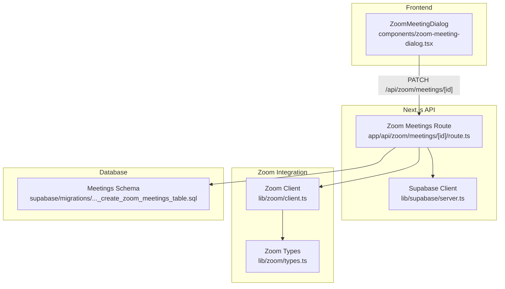
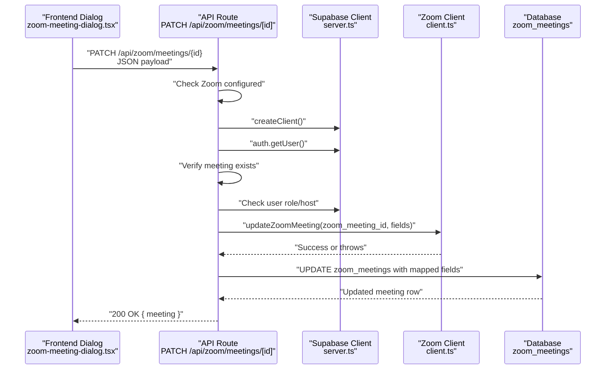
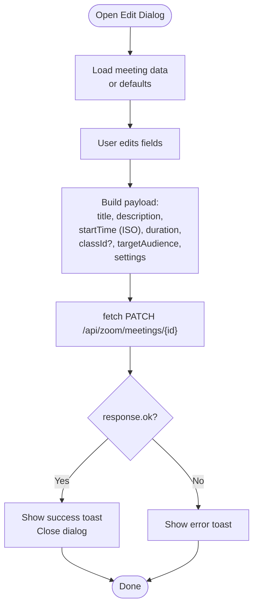
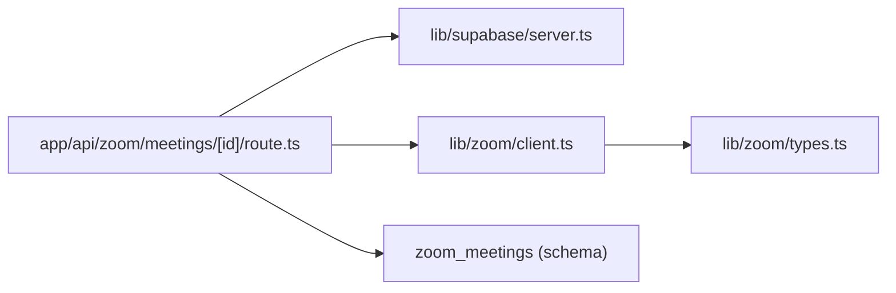

# Meeting Update

<cite>
**Referenced Files in This Document**
- [app/api/zoom/meetings/[id]/route.ts](file://app/api/zoom/meetings/[id]/route.ts)
- [lib/zoom/client.ts](file://lib/zoom/client.ts)
- [lib/zoom/types.ts](file://lib/zoom/types.ts)
- [supabase/migrations/20260110000001_create_zoom_meetings_table.sql](file://supabase/migrations/20260110000001_create_zoom_meetings_table.sql)
- [components/zoom-meeting-dialog.tsx](file://components/zoom-meeting-dialog.tsx)
- [lib/supabase/server.ts](file://lib/supabase/server.ts)
- [proxy.ts](file://proxy.ts)
</cite>

## Table of Contents
1. [Introduction](#introduction)
2. [Project Structure](#project-structure)
3. [Core Components](#core-components)
4. [Architecture Overview](#architecture-overview)
5. [Detailed Component Analysis](#detailed-component-analysis)
6. [Dependency Analysis](#dependency-analysis)
7. [Performance Considerations](#performance-considerations)
8. [Troubleshooting Guide](#troubleshooting-guide)
9. [Conclusion](#conclusion)

## Introduction
This document provides detailed API documentation for updating Zoom meetings via the HTTP PATCH endpoint PATCH /api/zoom/meetings/[id]. It covers the request and response formats, authentication and authorization requirements, implementation flow, error handling, and usage patterns from the frontend dialog component. It also highlights data consistency considerations and the importance of keeping the internal database synchronized with the Zoom API.

## Project Structure
The meeting update functionality spans the Next.js API route, the Zoom client library, Supabase database schema, and the frontend dialog component that constructs and submits the request.

**Diagram sources**
- [app/api/zoom/meetings/[id]/route.ts](file://app/api/zoom/meetings/[id]/route.ts#L40-L125)
- [lib/zoom/client.ts](file://lib/zoom/client.ts#L140-L173)
- [lib/zoom/types.ts](file://lib/zoom/types.ts#L1-L80)
- [supabase/migrations/20260110000001_create_zoom_meetings_table.sql](file://supabase/migrations/20260110000001_create_zoom_meetings_table.sql#L1-L50)
- [components/zoom-meeting-dialog.tsx](file://components/zoom-meeting-dialog.tsx#L107-L147)
- [lib/supabase/server.ts](file://lib/supabase/server.ts#L1-L30)

**Section sources**
- [app/api/zoom/meetings/[id]/route.ts](file://app/api/zoom/meetings/[id]/route.ts#L40-L125)
- [lib/zoom/client.ts](file://lib/zoom/client.ts#L140-L173)
- [lib/zoom/types.ts](file://lib/zoom/types.ts#L1-L80)
- [supabase/migrations/20260110000001_create_zoom_meetings_table.sql](file://supabase/migrations/20260110000001_create_zoom_meetings_table.sql#L1-L50)
- [components/zoom-meeting-dialog.tsx](file://components/zoom-meeting-dialog.tsx#L107-L147)
- [lib/supabase/server.ts](file://lib/supabase/server.ts#L1-L30)

## Core Components
- API Route: Implements PATCH /api/zoom/meetings/[id], performs authentication, verifies meeting existence, checks permissions, updates Zoom via the Zoom client, and updates the internal database record.
- Zoom Client: Provides updateZoomMeeting and other Zoom API helpers, including token management and error handling.
- Database Schema: Defines the zoom_meetings table and RLS policies governing access and updates.
- Frontend Dialog: Builds the request payload and invokes the API endpoint.

**Section sources**
- [app/api/zoom/meetings/[id]/route.ts](file://app/api/zoom/meetings/[id]/route.ts#L40-L125)
- [lib/zoom/client.ts](file://lib/zoom/client.ts#L140-L173)
- [supabase/migrations/20260110000001_create_zoom_meetings_table.sql](file://supabase/migrations/20260110000001_create_zoom_meetings_table.sql#L52-L92)
- [components/zoom-meeting-dialog.tsx](file://components/zoom-meeting-dialog.tsx#L107-L147)

## Architecture Overview
The update flow is a controlled sequence: validate configuration, authenticate, authorize, synchronize with Zoom, then update the database atomically.

**Diagram sources**
- [app/api/zoom/meetings/[id]/route.ts](file://app/api/zoom/meetings/[id]/route.ts#L40-L125)
- [lib/zoom/client.ts](file://lib/zoom/client.ts#L140-L173)
- [lib/supabase/server.ts](file://lib/supabase/server.ts#L1-L30)

## Detailed Component Analysis

### API Endpoint Definition
- Method: PATCH
- Path: /api/zoom/meetings/[id]
- Purpose: Partially update a Zoom meeting’s metadata and settings.

Request Body Fields
- title: string (optional)
- description: string (optional)
- startTime: string (ISO 8601) (optional)
- duration: number (minutes) (optional)
- timezone: string (optional)
- classId: string (optional)
- targetAudience: enum "all" | "students" | "teachers" | "class" | "personal" (optional)
- settings: object (optional)
  - host_video: boolean
  - participant_video: boolean
  - waiting_room: boolean
  - mute_upon_entry: boolean
  - join_before_host: boolean
  - auto_recording: "none" | "local" | "cloud"

Response
- 200 OK: { meeting: ZoomMeeting }
- 401 Unauthorized: Missing or invalid authentication
- 403 Forbidden: Not authorized to update
- 404 Not Found: Meeting not found
- 503 Service Unavailable: Zoom not configured
- 500 Internal Server Error: Unexpected failure

Notes
- Only provided fields are updated (partial update semantics).
- The database update maps incoming fields to zoom_meetings columns.

**Section sources**
- [app/api/zoom/meetings/[id]/route.ts](file://app/api/zoom/meetings/[id]/route.ts#L40-L125)
- [lib/zoom/types.ts](file://lib/zoom/types.ts#L1-L80)
- [supabase/migrations/20260110000001_create_zoom_meetings_table.sql](file://supabase/migrations/20260110000001_create_zoom_meetings_table.sql#L1-L21)

### Authentication and Authorization
- Authentication: The route obtains the current user via Supabase auth and rejects requests without a valid user.
- Authorization:
  - Host-only: The meeting host can update.
  - Admin privilege: Admin users can update any meeting.
- Additional CSRF protection: The global proxy enforces origin checks for API requests (except webhooks).

**Section sources**
- [app/api/zoom/meetings/[id]/route.ts](file://app/api/zoom/meetings/[id]/route.ts#L48-L75)
- [proxy.ts](file://proxy.ts#L40-L65)

### Implementation Flow
1. Verify Zoom configuration availability.
2. Authenticate the caller and fetch user.
3. Load the existing meeting record and confirm existence.
4. Check permissions: host or admin.
5. Call updateZoomMeeting with the provided fields.
6. Build a partial update payload for the database and apply it.
7. Return the updated meeting object.

Field Mapping (database columns)
- title -> title
- description -> description
- startTime -> start_time
- duration -> duration
- timezone -> timezone
- classId -> class_id
- targetAudience -> target_audience
- settings -> settings (JSONB)

**Section sources**
- [app/api/zoom/meetings/[id]/route.ts](file://app/api/zoom/meetings/[id]/route.ts#L40-L125)
- [lib/zoom/client.ts](file://lib/zoom/client.ts#L140-L173)
- [supabase/migrations/20260110000001_create_zoom_meetings_table.sql](file://supabase/migrations/20260110000001_create_zoom_meetings_table.sql#L1-L21)

### Error Handling
- Zoom not configured: 503
- Unauthorized: 401
- Not found: 404
- Permission denied: 403
- Zoom API failures: Thrown and surfaced as 500
- Database errors: Returned as 500 with error message
- Frontend dialog: Displays user-friendly messages and prevents submission on errors

**Section sources**
- [app/api/zoom/meetings/[id]/route.ts](file://app/api/zoom/meetings/[id]/route.ts#L40-L125)
- [components/zoom-meeting-dialog.tsx](file://components/zoom-meeting-dialog.tsx#L133-L147)

### Usage Example (Frontend Edit Form)
The dialog composes a PATCH payload and sends it to the API. It sets the meeting start time from date and time inputs, and conditionally includes classId and settings.

**Diagram sources**
- [components/zoom-meeting-dialog.tsx](file://components/zoom-meeting-dialog.tsx#L107-L147)

**Section sources**
- [components/zoom-meeting-dialog.tsx](file://components/zoom-meeting-dialog.tsx#L107-L147)

## Dependency Analysis
- API Route depends on:
  - Supabase client for authentication and database access
  - Zoom client for external API operations
  - Zoom types for typing and payload construction
- Zoom client depends on:
  - Environment variables for OAuth
  - Zoom API base URL and endpoints
- Database schema defines:
  - Columns and constraints for meeting records
  - RLS policies enabling host/admin updates

**Diagram sources**
- [app/api/zoom/meetings/[id]/route.ts](file://app/api/zoom/meetings/[id]/route.ts#L40-L125)
- [lib/zoom/client.ts](file://lib/zoom/client.ts#L140-L173)
- [lib/zoom/types.ts](file://lib/zoom/types.ts#L1-L80)
- [supabase/migrations/20260110000001_create_zoom_meetings_table.sql](file://supabase/migrations/20260110000001_create_zoom_meetings_table.sql#L52-L92)

**Section sources**
- [app/api/zoom/meetings/[id]/route.ts](file://app/api/zoom/meetings/[id]/route.ts#L40-L125)
- [lib/zoom/client.ts](file://lib/zoom/client.ts#L140-L173)
- [supabase/migrations/20260110000001_create_zoom_meetings_table.sql](file://supabase/migrations/20260110000001_create_zoom_meetings_table.sql#L52-L92)

## Performance Considerations
- Token caching: The Zoom client caches the OAuth access token and refreshes it before expiry, reducing overhead.
- Minimal updates: Only provided fields are included in the database update payload.
- Indexes: The schema includes indexes on frequently queried columns to support efficient lookups.

[No sources needed since this section provides general guidance]

## Troubleshooting Guide
Common issues and resolutions
- 401 Unauthorized: Ensure the user is authenticated and the session is valid.
- 403 Forbidden: Confirm the user is either the meeting host or has admin role.
- 404 Not Found: Verify the meeting ID exists in the database.
- 503 Service Unavailable: Check that Zoom credentials are configured in environment variables.
- 500 Internal Server Error: Inspect server logs for Zoom API errors or database failures.

Operational tips
- Validate Zoom configuration before invoking the endpoint.
- Ensure the frontend dialog builds a valid ISO start time and optional fields.
- Monitor Zoom API responses and handle transient network errors gracefully.

**Section sources**
- [app/api/zoom/meetings/[id]/route.ts](file://app/api/zoom/meetings/[id]/route.ts#L40-L125)
- [lib/zoom/client.ts](file://lib/zoom/client.ts#L1-L86)
- [components/zoom-meeting-dialog.tsx](file://components/zoom-meeting-dialog.tsx#L107-L147)

## Conclusion
PATCH /api/zoom/meetings/[id] enables safe, partial updates of Zoom meetings while maintaining consistency between the internal database and the Zoom API. The implementation enforces authentication and authorization, validates configuration, and applies a clear update flow. The frontend dialog provides a practical example of constructing and submitting the request payload. For robustness, ensure environment variables are configured and monitor both Zoom API and database operations.