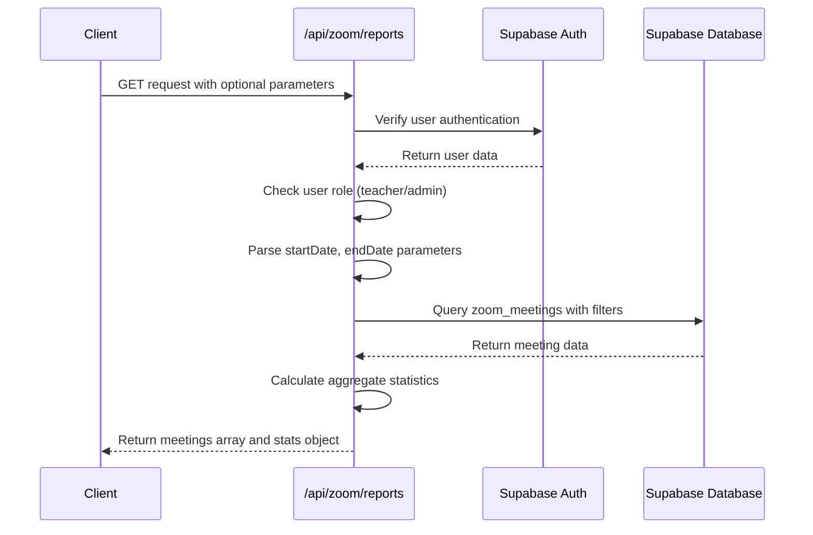
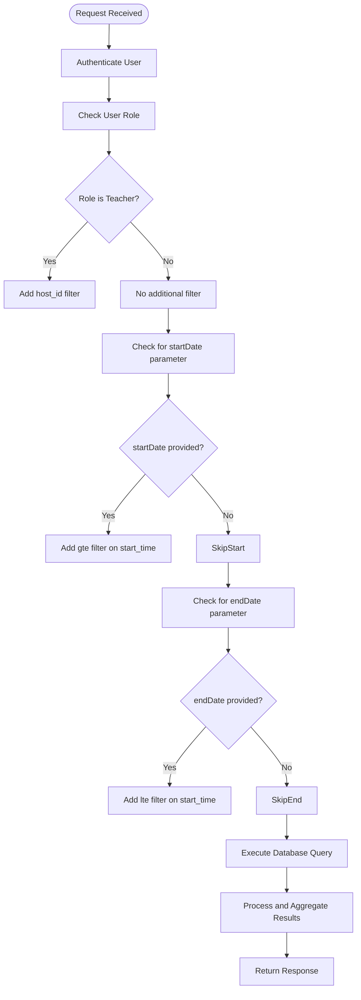
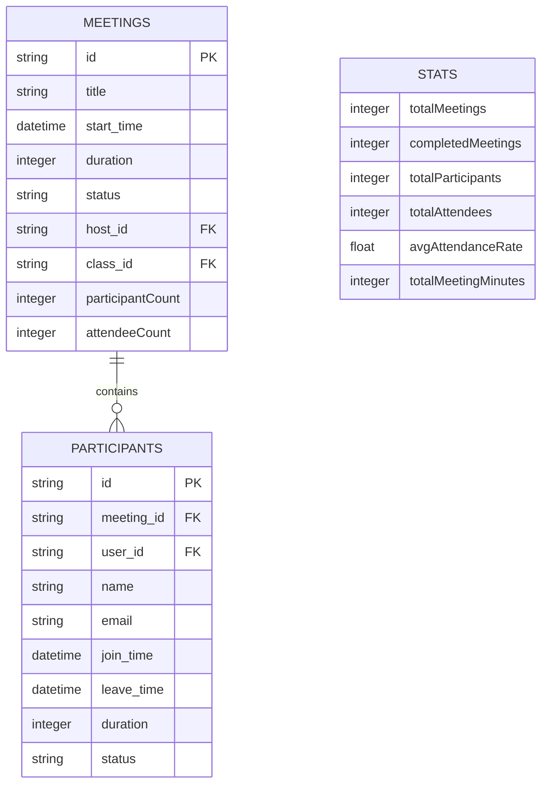
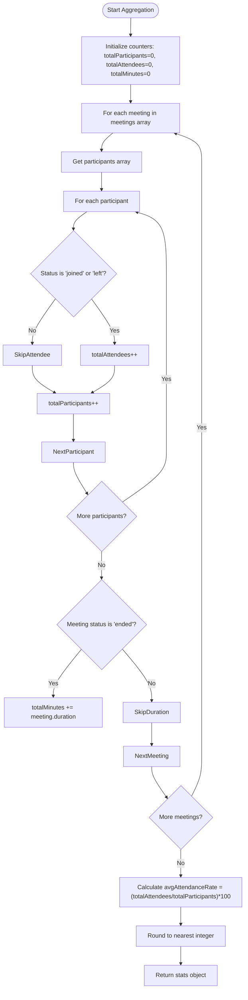
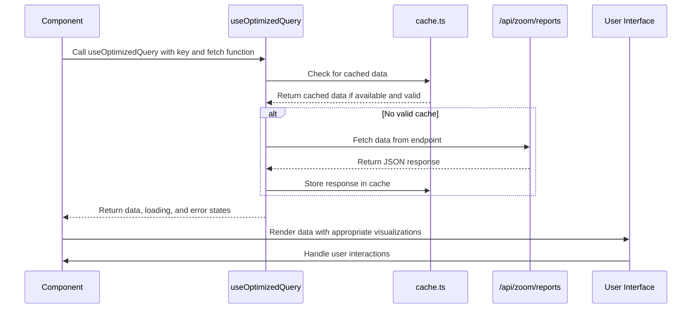
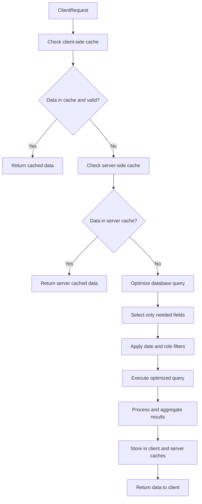
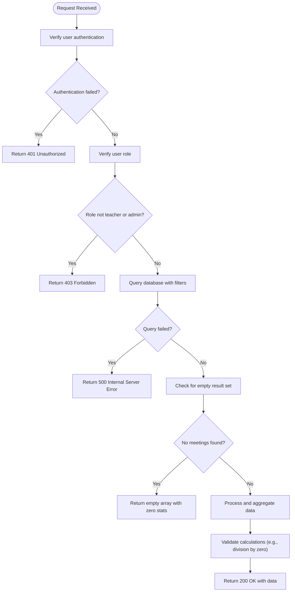

# Aggregate Meeting Analytics

<cite>
**Referenced Files in This Document**   
- [route.ts](file://app/api/zoom/reports/route.ts)
- [audit-log-analytics.tsx](file://components/audit-log-analytics.tsx)
- [progress-analytics.tsx](file://components/progress-analytics.tsx)
- [queries.ts](file://lib/supabase/queries.ts)
- [queries-optimized.ts](file://lib/supabase/queries-optimized.ts)
- [cache.ts](file://lib/cache.ts)
- [use-optimized-query.ts](file://lib/hooks/use-optimized-query.ts)
- [types.ts](file://lib/supabase/types.ts)
- [20260110000001_create_zoom_meetings_table.sql](file://supabase/migrations/20260110000001_create_zoom_meetings_table.sql)
</cite>

## Table of Contents
1. [Introduction](#introduction)
2. [Endpoint Overview](#endpoint-overview)
3. [Query Parameters and Filtering](#query-parameters-and-filtering)
4. [Response Schema](#response-schema)
5. [Data Aggregation Algorithms](#data-aggregation-algorithms)
6. [Usage Examples in Components](#usage-examples-in-components)
7. [Performance Optimization](#performance-optimization)
8. [Error Handling and Edge Cases](#error-handling-and-edge-cases)
9. [Conclusion](#conclusion)

## Introduction

The Aggregate Meeting Analytics functionality provides statistical summaries of Zoom meetings across the school management system. This documentation details the implementation and usage of the GET /api/zoom/reports endpoint, which returns comprehensive analytics for multiple meetings without requiring a specific meetingId parameter. The system is designed to support both teachers and administrators in monitoring meeting participation, attendance rates, and overall engagement across classes.

The analytics system integrates with the Supabase database to retrieve meeting data, applies filtering based on user roles and time ranges, and calculates various statistical metrics. It supports time-based filtering through startDate and endDate parameters, implements role-based access control, and provides detailed response data including individual meeting information and aggregated statistics.

**Section sources**
- [route.ts](file://app/api/zoom/reports/route.ts#L4-L132)

## Endpoint Overview

The GET /api/zoom/reports endpoint serves as the primary interface for retrieving aggregate meeting analytics. This endpoint is accessible only to authenticated users with teacher or admin roles, ensuring data privacy and security. When called without a meetingId parameter, it returns statistical summaries across multiple meetings rather than detailed information about a single meeting.

The endpoint first authenticates the user and verifies their role permissions before proceeding with data retrieval. Teachers are restricted to viewing analytics for meetings they hosted, while administrators have access to all meetings across the system. This role-based filtering ensures that users only access data relevant to their responsibilities.

The response includes two main components: an array of meeting objects containing individual meeting details and a stats object with aggregated metrics. The meeting array includes information such as meeting title, start time, duration, status, host details, associated class, and participant counts. The stats object provides overall metrics including total meetings, completed meetings, participant counts, attendance rates, and total meeting minutes.

**Diagram sources**
- [route.ts](file://app/api/zoom/reports/route.ts#L5-L132)

**Section sources**
- [route.ts](file://app/api/zoom/reports/route.ts#L5-L132)

## Query Parameters and Filtering

The GET /api/zoom/reports endpoint supports several query parameters that enable flexible data filtering and retrieval. The primary filtering parameters are startDate and endDate, which allow users to specify a time range for the analytics data. These parameters filter meetings based on their start_time field in the database, enabling users to analyze meeting patterns during specific periods such as academic quarters, semesters, or custom date ranges.

When startDate is provided, the query filters meetings with start_time greater than or equal to the specified date (gte operation). Similarly, when endDate is provided, the query filters meetings with start_time less than or equal to the specified date (lte operation). These parameters can be used independently or together to define a complete date range. The date format follows ISO 8601 standards (YYYY-MM-DD), ensuring consistent parsing and comparison.

In addition to time-based filtering, the system implements teacher-specific meeting restrictions based on user roles. When a teacher accesses the endpoint, the query automatically filters results to include only meetings where the teacher is the host (host_id matches the user's ID). This restriction is implemented through a conditional query parameter that adds an equality filter for the host_id field when the user's role is "teacher". Administrators are not subject to this restriction and can view analytics for all meetings across the system.

The filtering logic is implemented efficiently using Supabase's query builder, which translates the JavaScript conditions into optimized SQL queries. This approach minimizes data transfer and processing overhead by pushing the filtering operations to the database layer rather than retrieving all data and filtering client-side.

**Diagram sources**
- [route.ts](file://app/api/zoom/reports/route.ts#L24-L90)

**Section sources**
- [route.ts](file://app/api/zoom/reports/route.ts#L24-L90)

## Response Schema

The response from the GET /api/zoom/reports endpoint consists of two main components: a meetings array and a stats object. The meetings array contains detailed information about each meeting that matches the query parameters, while the stats object provides aggregated metrics across all retrieved meetings.

The meetings array includes the following fields for each meeting:
- id: Unique identifier for the meeting
- title: Meeting title or subject
- start_time: ISO 8601 timestamp of meeting start
- duration: Meeting duration in minutes
- status: Current status of the meeting (scheduled, started, ended, cancelled)
- host: Object containing host ID and name
- class: Object containing associated class ID and name
- participantCount: Number of participants invited to the meeting
- attendeeCount: Number of participants who joined the meeting

The stats object contains the following aggregated metrics:
- totalMeetings: Total number of meetings in the result set
- completedMeetings: Number of meetings with status "ended"
- totalParticipants: Total number of participants across all meetings
- totalAttendees: Total number of attendees (participants who joined) across all meetings
- avgAttendanceRate: Average attendance rate as a percentage
- totalMeetingMinutes: Total duration of completed meetings in minutes

The response schema is designed to provide both granular meeting data and high-level statistical insights, enabling clients to display detailed meeting lists while also showing summary analytics. The participantCount and attendeeCount fields are derived from the participants relationship in the database, with attendeeCount calculated as the number of participants with status "joined" or "left".

**Diagram sources**
- [route.ts](file://app/api/zoom/reports/route.ts#L116-L130)
- [20260110000001_create_zoom_meetings_table.sql](file://supabase/migrations/20260110000001_create_zoom_meetings_table.sql#L2-L49)

**Section sources**
- [route.ts](file://app/api/zoom/reports/route.ts#L116-L130)

## Data Aggregation Algorithms

The data aggregation algorithms in the GET /api/zoom/reports endpoint calculate key statistical metrics from the retrieved meeting data. These algorithms process the meetings array to compute aggregate values that provide insights into meeting participation and engagement patterns across the system.

The primary aggregation calculations include:
- Total meetings count: The length of the meetings array
- Completed meetings count: Number of meetings with status "ended"
- Total participants: Sum of all participants across all meetings
- Total attendees: Sum of participants who joined (status "joined" or "left")
- Average attendance rate: Percentage of attendees relative to total participants
- Total meeting minutes: Sum of duration for completed meetings

The algorithm for calculating participant status evaluates each participant's status field to determine attendance. Participants with status "joined" or "left" are counted as attendees, while all participants in the participants array are counted as total participants. This distinction allows for accurate calculation of attendance rates, accounting for invited participants who did not join.

Meeting duration is accumulated by summing the duration field of each meeting, but only for meetings with status "ended". This ensures that incomplete meetings do not contribute to the total meeting minutes metric, providing an accurate representation of actual meeting time. The duration field is stored in minutes in the database, eliminating the need for time unit conversion.

The aggregation process is implemented efficiently using JavaScript's array methods. The totalMeetings count is obtained directly from the array length. The completedMeetings count uses the filter method to count meetings with "ended" status. The participant and attendee counts use forEach iteration with conditional logic to accumulate totals. The average attendance rate is calculated using simple arithmetic division and rounding to the nearest integer.

**Diagram sources**
- [route.ts](file://app/api/zoom/reports/route.ts#L98-L114)

**Section sources**
- [route.ts](file://app/api/zoom/reports/route.ts#L98-L114)

## Usage Examples in Components

The aggregate meeting analytics data is utilized in several components across the application, particularly in analytics dashboards that visualize meeting participation and engagement metrics. Two key components that consume this data are audit-log-analytics.tsx and progress-analytics.tsx, which demonstrate different approaches to presenting meeting analytics.

The audit-log-analytics.tsx component uses a card-based layout to display key metrics in a grid format. It shows statistics such as total logins, failed attempts, success rate, and active users. While primarily focused on authentication logs, this component's design pattern is similar to how meeting analytics could be presented, using icons and clear typography to highlight key numbers. The component receives analytics data as props and renders it in a responsive grid that adapts to different screen sizes.

The progress-analytics.tsx component provides a more comprehensive analytics interface, including line charts, bar charts, and pie charts to visualize student progress over time. This component demonstrates how meeting analytics could be integrated with other educational metrics. It uses the Recharts library to create interactive visualizations, including a line chart for grade trends, a bar chart for performance by subject, and a pie chart for attendance breakdown. The component fetches data from an API endpoint and handles loading states, errors, and empty data conditions.

Both components follow a similar pattern of data fetching and state management. They use React's useState and useEffect hooks to manage component state and side effects. The progress-analytics.tsx component includes additional functionality such as automatic data fetching when the studentId prop changes, loading indicators, and fallback content for when no data is available. These components illustrate best practices for consuming and displaying analytics data in a user-friendly manner.

**Diagram sources**
- [audit-log-analytics.tsx](file://components/audit-log-analytics.tsx#L1-L78)
- [progress-analytics.tsx](file://components/progress-analytics.tsx#L1-L189)
- [use-optimized-query.ts](file://lib/hooks/use-optimized-query.ts#L1-L275)

**Section sources**
- [audit-log-analytics.tsx](file://components/audit-log-analytics.tsx#L1-L78)
- [progress-analytics.tsx](file://components/progress-analytics.tsx#L1-L189)

## Performance Optimization

The aggregate meeting analytics system incorporates several performance optimization strategies to handle large datasets efficiently and provide responsive user experiences. These optimizations include caching mechanisms, query optimization, and pagination considerations.

The system uses a multi-layered caching approach to minimize redundant database queries. The cache.ts module implements both in-memory caching for client-side queries and server-side caching using Next.js's unstable_cache function. Client-side caching stores query results for 30 seconds by default, preventing duplicate API calls when the same data is requested multiple times within a short period. Server-side caching uses Next.js's revalidation tags to automatically invalidate cached data when underlying records are updated.

Query optimization is achieved through several techniques. The endpoint uses Supabase's select method to retrieve only the necessary fields, reducing data transfer overhead. Filtering operations are pushed to the database layer using gte and lte operators for date ranges and eq operators for host filtering, minimizing the amount of data transferred to the application server. The queries-optimized.ts file contains additional optimized query functions that include pagination and exact count retrieval for better performance with large datasets.

For handling large datasets, the system could implement pagination strategies. While the current implementation retrieves all matching meetings in a single request, adding pagination parameters (page, pageSize) would allow for incremental data loading. This approach would improve response times and reduce memory usage, particularly when analyzing analytics over extended time periods with many meetings.

The use-optimized-query.ts hook provides additional performance benefits by implementing automatic deduplication of concurrent requests, retry logic for transient failures, and interval-based refetching for real-time data updates. This hook also includes exponential backoff for retry attempts, preventing overwhelming the server during periods of high load or temporary outages.

**Diagram sources**
- [cache.ts](file://lib/cache.ts#L1-L128)
- [queries-optimized.ts](file://lib/supabase/queries-optimized.ts#L1-L317)
- [use-optimized-query.ts](file://lib/hooks/use-optimized-query.ts#L1-L275)

**Section sources**
- [cache.ts](file://lib/cache.ts#L1-L128)
- [queries-optimized.ts](file://lib/supabase/queries-optimized.ts#L1-L317)
- [use-optimized-query.ts](file://lib/hooks/use-optimized-query.ts#L1-L275)

## Error Handling and Edge Cases

The aggregate meeting analytics system implements comprehensive error handling to ensure reliability and provide meaningful feedback in various scenarios. The error handling covers authentication failures, authorization issues, database query errors, and edge cases such as empty result sets.

Authentication and authorization errors are handled at the beginning of the request processing. If no authenticated user is found, the endpoint returns a 401 Unauthorized status with an appropriate error message. If the authenticated user does not have the required teacher or admin role, the endpoint returns a 403 Forbidden status. These early checks prevent unnecessary database queries when the user lacks the necessary permissions.

Database query errors are caught and handled gracefully, returning a 500 Internal Server Error status with the error message from the database. This approach provides visibility into backend issues while preventing the exposure of sensitive system information. The error handling includes proper try-catch blocks around database operations and appropriate error status codes.

Several edge cases are addressed in the implementation. When no meetings exist within the specified date range, the endpoint returns an empty meetings array and appropriate zero values in the stats object (e.g., totalMeetings: 0). This ensures consistent response structure regardless of whether data is available. The aggregation calculations include null and undefined checks to prevent runtime errors when processing incomplete data.

The system also handles cases where participant data might be missing or incomplete. The code includes nullish coalescing operators (??) and conditional checks to ensure that undefined or null values do not cause calculation errors. For example, when calculating the average attendance rate, the code checks if totalParticipants is greater than zero before performing division to avoid division by zero errors.

**Diagram sources**
- [route.ts](file://app/api/zoom/reports/route.ts#L9-L96)

**Section sources**
- [route.ts](file://app/api/zoom/reports/route.ts#L9-L96)

## Conclusion

The Aggregate Meeting Analytics functionality provides a robust and secure system for retrieving and analyzing Zoom meeting data across the school management platform. The GET /api/zoom/reports endpoint offers comprehensive statistical summaries of multiple meetings, supporting data-driven decision making for teachers and administrators.

Key features of the system include flexible time range filtering through startDate and endDate parameters, role-based access control that restricts teachers to their own meetings, and detailed response data with both individual meeting information and aggregated statistics. The response schema is designed to support various visualization needs, from simple metric displays to complex analytical dashboards.

The data aggregation algorithms efficiently calculate important metrics such as attendance rates and total meeting minutes, using optimized database queries and client-side processing. Performance is enhanced through caching mechanisms, query optimization, and potential pagination strategies for handling large datasets.

The system demonstrates robust error handling and edge case management, ensuring reliability and consistent behavior across different scenarios. Integration with components like audit-log-analytics.tsx and progress-analytics.tsx shows how the analytics data can be effectively visualized and incorporated into user interfaces.

Overall, the aggregate meeting analytics system provides valuable insights into meeting participation and engagement, supporting the educational goals of the school management platform while maintaining performance and security standards.