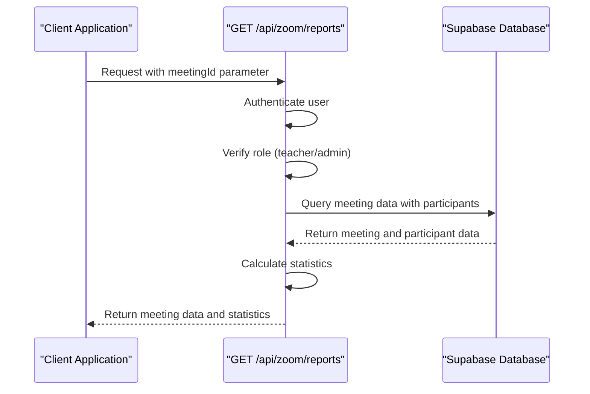
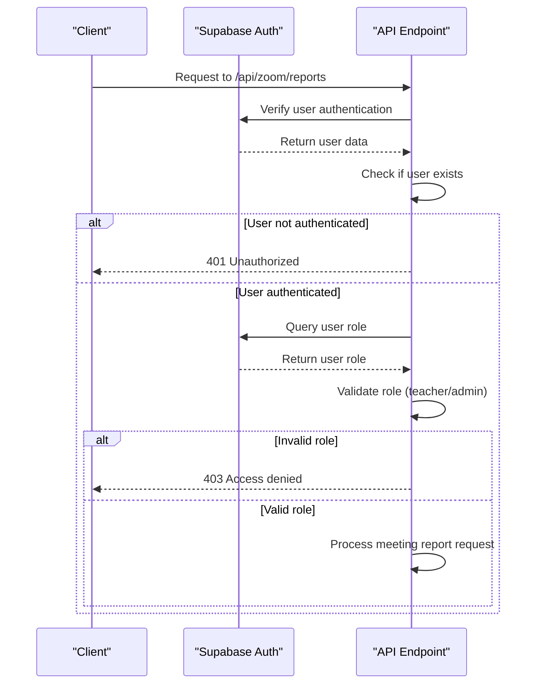
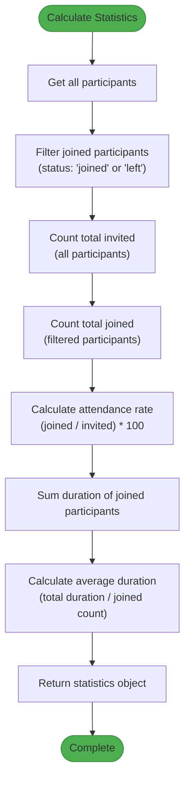
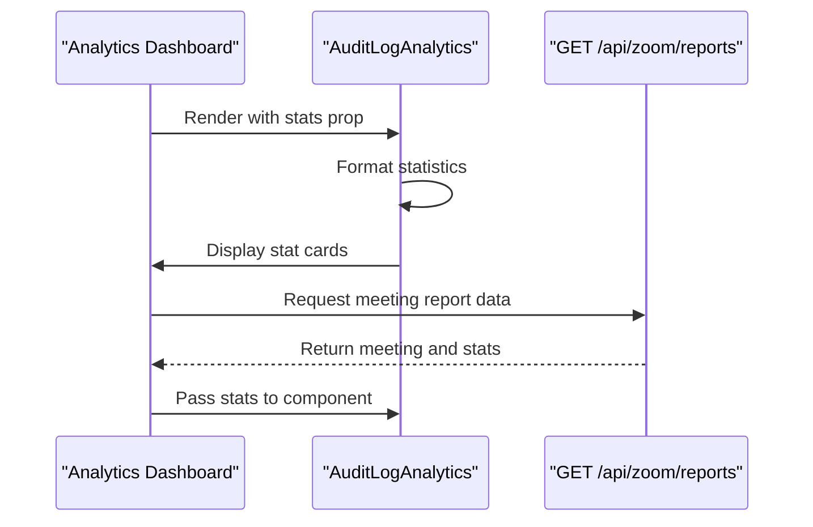
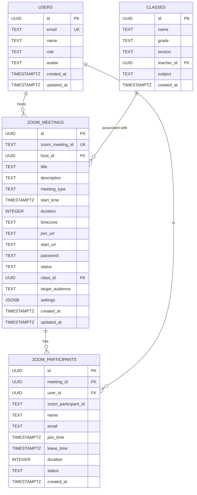
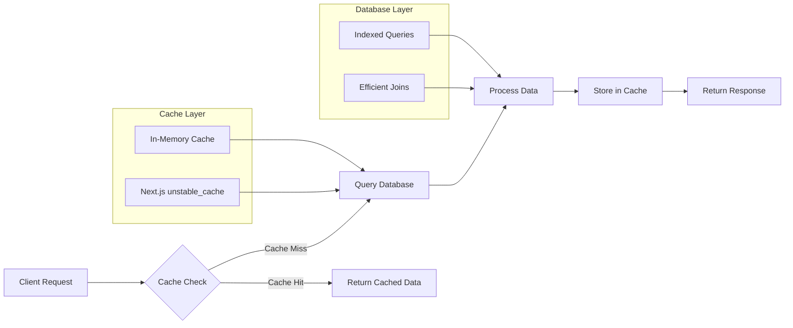
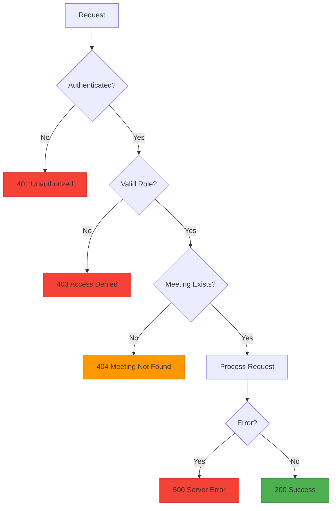

# Detailed Meeting Reporting

<cite>
**Referenced Files in This Document**   
- [route.ts](file://app/api/zoom/reports/route.ts)
- [audit-log-analytics.tsx](file://components/audit-log-analytics.tsx)
- [server.ts](file://lib/supabase/server.ts)
- [middleware.ts](file://lib/supabase/middleware.ts)
- [types.ts](file://lib/supabase/types.ts)
- [zoom/types.ts](file://lib/zoom/types.ts)
- [create_zoom_meetings_table.sql](file://supabase/migrations/20260110023523_create_zoom_meetings_table.sql)
- [cache.ts](file://lib/cache.ts)
- [use-optimized-query.ts](file://lib/hooks/use-optimized-query.ts)
</cite>

## Table of Contents
1. [Introduction](#introduction)
2. [Endpoint Overview](#endpoint-overview)
3. [Authentication and Authorization](#authentication-and-authorization)
4. [Response Structure](#response-structure)
5. [Statistical Calculations](#statistical-calculations)
6. [Frontend Integration](#frontend-integration)
7. [Database Schema](#database-schema)
8. [Performance Considerations](#performance-considerations)
9. [Error Handling](#error-handling)
10. [Conclusion](#conclusion)

## Introduction

The detailed meeting reporting functionality provides comprehensive analytics for Zoom meetings within the school management system. This documentation details the GET /api/zoom/reports endpoint that retrieves detailed information about specific Zoom meetings, including participant data, host information, class details, and calculated statistics. The system is designed to support teachers and administrators in monitoring meeting attendance and engagement, with robust security measures and performance optimizations.

## Endpoint Overview

The GET /api/zoom/reports endpoint serves as the primary interface for retrieving detailed meeting reports and analytics. When called with a meetingId query parameter, it returns comprehensive data for a specific Zoom meeting, including the full meeting object with joined host and class data, participant list with user details, and calculated statistics.



**Diagram sources**
- [route.ts](file://app/api/zoom/reports/route.ts#L5-L132)

**Section sources**
- [route.ts](file://app/api/zoom/reports/route.ts#L5-L132)

## Authentication and Authorization

The system implements a robust authentication and authorization flow using Supabase, ensuring that only authorized users can access meeting reports. The process follows a multi-layered security approach with role-based access control.



The authentication flow begins with verifying the user's authentication status through Supabase's getUser method. If the user is not authenticated, a 401 Unauthorized response is returned. For authenticated users, the system queries the users table to retrieve the user's role. Only users with "teacher" or "admin" roles are granted access to the meeting reports, with unauthorized roles receiving a 403 Access denied response.

**Diagram sources**
- [route.ts](file://app/api/zoom/reports/route.ts#L7-L22)
- [server.ts](file://lib/supabase/server.ts#L5-L30)
- [middleware.ts](file://lib/supabase/middleware.ts#L4-L37)

**Section sources**
- [route.ts](file://app/api/zoom/reports/route.ts#L7-L22)
- [server.ts](file://lib/supabase/server.ts#L5-L30)
- [middleware.ts](file://lib/supabase/middleware.ts#L4-L37)

## Response Structure

The GET /api/zoom/reports endpoint returns a structured response containing comprehensive meeting data and calculated statistics. The response structure is designed to provide all necessary information for analytics dashboards and reporting interfaces.

```mermaid
erDiagram
MEETING_REPORT {
object meeting
object stats
}
MEETING {
string id
string title
string start_time
string duration
string status
object host
object class
array participants
}
USER {
string id
string name
string email
string avatar
string role
}
PARTICIPANT {
string id
string user_id
string name
string email
string join_time
string leave_time
number duration
string status
object user
}
STATISTICS {
number totalInvited
number totalJoined
number attendanceRate
number totalDurationSeconds
number avgDurationSeconds
}
MEETING_REPORT ||--|{ MEETING : "contains"
MEETING ||--|{ PARTICIPANT : "has"
PARTICIPANT }|--|| USER : "references"
MEETING_REPORT ||--|{ STATISTICS : "includes"
MEETING }|--|| USER : "hosted by"
MEETING }|--|| CLASS : "associated with"
```

The response consists of two main objects: meeting and stats. The meeting object contains the complete meeting data with joined host and class information, as well as the list of participants with their user details. The stats object contains calculated metrics including total invited, total joined, attendance rate, total duration in seconds, and average duration in seconds.

**Diagram sources**
- [route.ts](file://app/api/zoom/reports/route.ts#L55-L65)
- [types.ts](file://lib/supabase/types.ts#L1-L253)
- [zoom/types.ts](file://lib/zoom/types.ts#L1-L168)

**Section sources**
- [route.ts](file://app/api/zoom/reports/route.ts#L55-L65)

## Statistical Calculations

The system performs several statistical calculations to provide meaningful insights into meeting participation and engagement. These calculations are performed server-side to ensure consistency and reduce client-side processing.



The statistical calculations follow a specific logic:
1. **Total Invited**: The count of all participants in the meeting, regardless of their attendance status
2. **Total Joined**: The count of participants with status "joined" or "left", indicating they successfully connected to the meeting
3. **Attendance Rate**: The percentage of joined participants relative to total invited, calculated as (totalJoined / totalInvited) * 100
4. **Total Duration**: The sum of duration values for all joined participants, measured in seconds
5. **Average Duration**: The mean duration of joined participants, calculated as totalDuration / totalJoined

The attendance status is determined by the participant's status field in the zoom_participants table, with "joined" and "left" statuses considered as attended. The duration is aggregated from the duration field, which is automatically updated by the Zoom webhook when participants join and leave the meeting.

**Diagram sources**
- [route.ts](file://app/api/zoom/reports/route.ts#L49-L65)

**Section sources**
- [route.ts](file://app/api/zoom/reports/route.ts#L49-L65)

## Frontend Integration

The meeting reporting data is consumed by frontend components to provide analytics dashboards and reporting interfaces. The audit-log-analytics.tsx component demonstrates how this data can be visualized for administrative oversight.



The audit-log-analytics.tsx component receives statistics as props and renders them in a grid of cards, displaying key metrics such as total logins, failed attempts, success rate, and active users. This pattern can be extended to display meeting-specific statistics, providing administrators with a comprehensive view of system usage and engagement.

**Diagram sources**
- [audit-log-analytics.tsx](file://components/audit-log-analytics.tsx#L1-L77)

**Section sources**
- [audit-log-analytics.tsx](file://components/audit-log-analytics.tsx#L1-L77)

## Database Schema

The meeting reporting functionality relies on a well-structured database schema with appropriate relationships and constraints. The schema is designed to efficiently store meeting data, participant information, and related entities.



The schema consists of two primary tables: zoom_meetings and zoom_participants. The zoom_meetings table stores core meeting information including title, start time, duration, and status, with foreign keys to the users table (host) and classes table. The zoom_participants table tracks individual participant attendance with join/leave times and duration, linked to both the meeting and the user. Appropriate indexes are created on key columns to optimize query performance.

**Diagram sources**
- [create_zoom_meetings_table.sql](file://supabase/migrations/20260110023523_create_zoom_meetings_table.sql#L1-L49)

**Section sources**
- [create_zoom_meetings_table.sql](file://supabase/migrations/20260110023523_create_zoom_meetings_table.sql#L1-L49)

## Performance Considerations

The system implements several performance optimizations to handle meetings with large numbers of participants efficiently. These optimizations include caching strategies, query optimization, and efficient data processing.



The system employs a multi-layered caching strategy using both in-memory caching and Next.js's unstable_cache functionality. The in-memory cache has a 30-second TTL and stores frequently accessed data to prevent duplicate API calls. For server-side rendering, the unstable_cache function provides automatic revalidation with configurable TTLs (60 seconds for dashboard data, 120 seconds for student lists, 180 seconds for class lists).

For meetings with large participant counts, the system optimizes database queries by:
- Using indexed columns for faster lookups
- Selecting only necessary fields in queries
- Implementing efficient joins with proper foreign key relationships
- Processing statistical calculations in a single pass through the participant data

The useOptimizedQuery hook provides additional client-side optimizations including request deduplication, retry logic for transient failures, and exponential backoff for network errors.

**Diagram sources**
- [cache.ts](file://lib/cache.ts#L1-L127)
- [use-optimized-query.ts](file://lib/hooks/use-optimized-query.ts#L1-L275)

**Section sources**
- [cache.ts](file://lib/cache.ts#L1-L127)
- [use-optimized-query.ts](file://lib/hooks/use-optimized-query.ts#L1-L275)

## Error Handling

The system implements comprehensive error handling to provide meaningful feedback for various failure scenarios. Error responses are standardized to ensure consistent client-side handling.



The error handling flow includes:
- **401 Unauthorized**: Returned when no valid authentication token is provided
- **403 Access Denied**: Returned when the user lacks the required teacher or admin role
- **404 Meeting Not Found**: Returned when the specified meetingId does not exist
- **500 Server Error**: Returned for unexpected server-side errors

Each error response includes a descriptive error message to aid in debugging and user communication. The system also logs errors server-side for monitoring and troubleshooting purposes.

**Diagram sources**
- [route.ts](file://app/api/zoom/reports/route.ts#L9-L47)

**Section sources**
- [route.ts](file://app/api/zoom/reports/route.ts#L9-L47)

## Conclusion

The detailed meeting reporting functionality provides a comprehensive solution for tracking and analyzing Zoom meeting participation within the school management system. By combining robust authentication and authorization with efficient data retrieval and meaningful statistical calculations, the system enables teachers and administrators to monitor engagement and make data-driven decisions. The implementation follows best practices for security, performance, and maintainability, with clear separation of concerns and well-documented interfaces. Future enhancements could include additional analytics metrics, export functionality, and integration with other reporting tools.