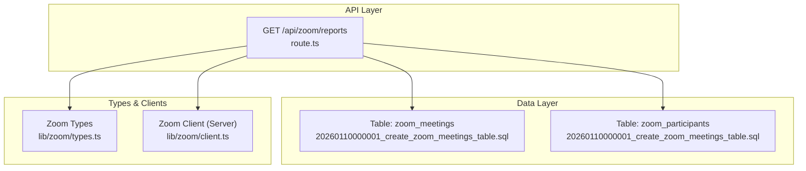
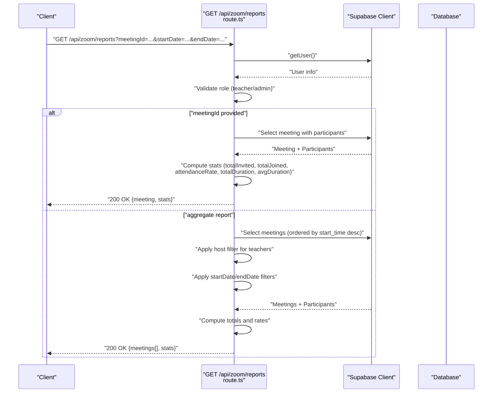
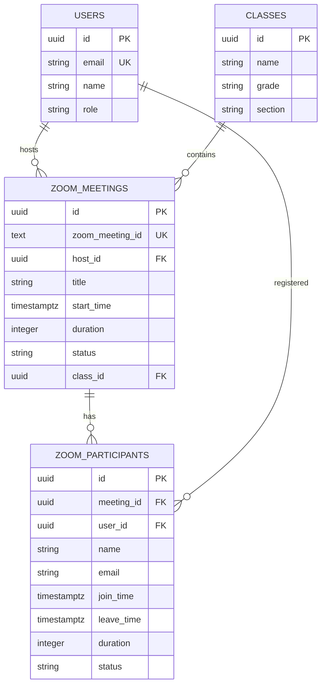
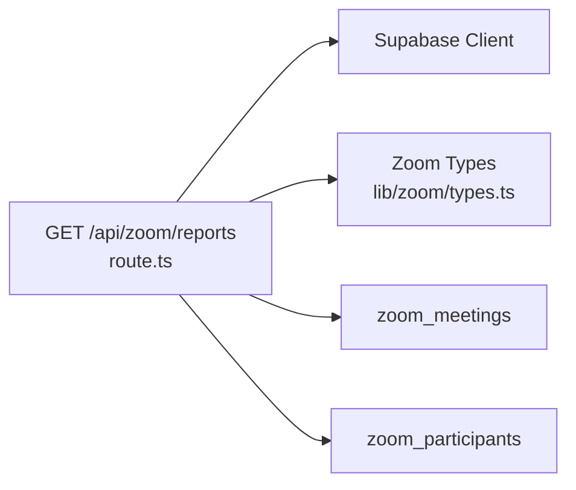

# Meeting Reporting

<cite>
**Referenced Files in This Document**
- [route.ts](file://app/api/zoom/reports/route.ts)
- [types.ts](file://lib/zoom/types.ts)
- [client.ts](file://lib/zoom/client.ts)
- [20260110000001_create_zoom_meetings_table.sql](file://supabase/migrations/20260110000001_create_zoom_meetings_table.sql)
- [20260110023523_create_zoom_meetings_table.sql](file://supabase/migrations/20260110023523_create_zoom_meetings_table.sql)
- [cache.ts](file://lib/cache.ts)
- [api-errors.ts](file://lib/api-errors.ts)
</cite>

## Table of Contents
1. [Introduction](#introduction)
2. [Project Structure](#project-structure)
3. [Core Components](#core-components)
4. [Architecture Overview](#architecture-overview)
5. [Detailed Component Analysis](#detailed-component-analysis)
6. [Dependency Analysis](#dependency-analysis)
7. [Performance Considerations](#performance-considerations)
8. [Troubleshooting Guide](#troubleshooting-guide)
9. [Conclusion](#conclusion)

## Introduction
This document provides detailed API documentation for the meeting reporting and analytics endpoint that serves both detailed reports for specific meetings and aggregate statistics across time ranges. It covers the endpoint specification, authentication requirements, request parameters, response schemas, statistical calculations, error handling, and performance considerations. It also includes usage examples from the frontend components that consume this endpoint.

## Project Structure
The reporting endpoint is implemented as a Next.js route under the Zoom API namespace. Supporting types and database migrations define the data model for meetings and participants. Caching utilities and centralized error handling support performance and reliability.

**Diagram sources**
- [route.ts](file://app/api/zoom/reports/route.ts#L1-L133)
- [20260110000001_create_zoom_meetings_table.sql](file://supabase/migrations/20260110000001_create_zoom_meetings_table.sql#L1-L49)
- [20260110023523_create_zoom_meetings_table.sql](file://supabase/migrations/20260110023523_create_zoom_meetings_table.sql#L1-L49)
- [types.ts](file://lib/zoom/types.ts#L1-L168)
- [client.ts](file://lib/zoom/client.ts#L1-L334)

**Section sources**
- [route.ts](file://app/api/zoom/reports/route.ts#L1-L133)
- [20260110000001_create_zoom_meetings_table.sql](file://supabase/migrations/20260110000001_create_zoom_meetings_table.sql#L1-L49)
- [20260110023523_create_zoom_meetings_table.sql](file://supabase/migrations/20260110023523_create_zoom_meetings_table.sql#L1-L49)
- [types.ts](file://lib/zoom/types.ts#L1-L168)
- [client.ts](file://lib/zoom/client.ts#L1-L334)

## Core Components
- Endpoint: GET /api/zoom/reports
- Authentication: Requires a valid session; user must have role “teacher” or “admin”
- Modes:
  - Detailed report: When meetingId is provided, returns meeting metadata and attendance statistics
  - Aggregate report: Without meetingId, returns filtered meetings and aggregated statistics
- Filters (aggregate mode):
  - startDate: ISO 8601 datetime (inclusive lower bound)
  - endDate: ISO 8601 datetime (inclusive upper bound)
- Additional filtering:
  - Teachers are restricted to meetings they hosted

**Section sources**
- [route.ts](file://app/api/zoom/reports/route.ts#L1-L133)

## Architecture Overview
The endpoint orchestrates Supabase queries to compute both detailed and aggregate analytics. It applies role-based access control and optional date filters. The response includes computed statistics derived from participant records.

**Diagram sources**
- [route.ts](file://app/api/zoom/reports/route.ts#L1-L133)

## Detailed Component Analysis

### Endpoint Definition
- Method: GET
- Path: /api/zoom/reports
- Query Parameters:
  - meetingId (optional): UUID of a specific meeting
  - startDate (optional): ISO 8601 datetime
  - endDate (optional): ISO 8601 datetime

Authentication and Authorization:
- Session required; user must have role “teacher” or “admin”
- Teachers are restricted to meetings they hosted when requesting aggregate data

**Section sources**
- [route.ts](file://app/api/zoom/reports/route.ts#L1-L133)

### Detailed Report Mode (meetingId)
Behavior:
- Fetches a single meeting with associated participants
- Computes:
  - totalInvited: Number of participants registered for the meeting
  - totalJoined: Count of participants with status “joined” or “left”
  - attendanceRate: Percentage of totalInvited who joined/left
  - totalDurationSeconds: Sum of durations for joined/left participants
  - avgDurationSeconds: Rounded average duration for joined/left participants

Response Schema (JSON):
- meeting: Meeting object with host and class joins
- stats:
  - totalInvited: number
  - totalJoined: number
  - attendanceRate: number (percentage)
  - totalDurationSeconds: number
  - avgDurationSeconds: number

Edge Cases Handled:
- If meeting not found: returns 404
- If participants array is missing: treats as empty

**Section sources**
- [route.ts](file://app/api/zoom/reports/route.ts#L29-L67)

### Aggregate Report Mode (no meetingId)
Behavior:
- Retrieves meetings ordered by start_time descending
- Applies:
  - Host filter for teachers (host_id equals current user)
  - startDate and endDate filters on start_time
- Computes:
  - totalMeetings: Total number of meetings
  - completedMeetings: Meetings with status “ended”
  - totalParticipants: Total participant records across meetings
  - totalAttendees: Participants with status “joined” or “left”
  - avgAttendanceRate: Percentage of totalAttendees over totalParticipants
  - totalMeetingMinutes: Sum of duration for ended meetings

Response Schema (JSON):
- meetings[]:
  - id, title, start_time, duration, status
  - host: { id, name }
  - class: { id, name }
  - participantCount: number
  - attendeeCount: number
- stats:
  - totalMeetings: number
  - completedMeetings: number
  - totalParticipants: number
  - totalAttendees: number
  - avgAttendanceRate: number (percentage)
  - totalMeetingMinutes: number

Filtering Notes:
- Host filter applies only for “teacher” role
- Date filters are inclusive

**Section sources**
- [route.ts](file://app/api/zoom/reports/route.ts#L69-L132)

### Data Model and Relationships
The endpoint relies on two tables:
- zoom_meetings: Stores meeting metadata and relationships
- zoom_participants: Tracks participant join/leave events and durations

Indexes and constraints:
- Indexes on host_id, class_id, start_time, status for efficient querying
- Status constraints ensure data integrity

**Diagram sources**
- [20260110000001_create_zoom_meetings_table.sql](file://supabase/migrations/20260110000001_create_zoom_meetings_table.sql#L1-L49)
- [20260110023523_create_zoom_meetings_table.sql](file://supabase/migrations/20260110023523_create_zoom_meetings_table.sql#L1-L49)

**Section sources**
- [20260110000001_create_zoom_meetings_table.sql](file://supabase/migrations/20260110000001_create_zoom_meetings_table.sql#L1-L49)
- [20260110023523_create_zoom_meetings_table.sql](file://supabase/migrations/20260110023523_create_zoom_meetings_table.sql#L1-L49)

### Statistical Calculations
- Detailed report:
  - totalInvited: participants length
  - totalJoined: participants with status “joined” or “left”
  - attendanceRate: round((joined/count)*100); 0 if count is 0
  - totalDurationSeconds: sum of durations for joined/left
  - avgDurationSeconds: round(total/count); 0 if count is 0
- Aggregate report:
  - totalMeetings: meetings length
  - completedMeetings: meetings with status “ended”
  - totalParticipants: sum of participant counts
  - totalAttendees: sum of joined/left counts
  - avgAttendanceRate: round((attendees/total)*100); 0 if total is 0
  - totalMeetingMinutes: sum of duration for ended meetings

Edge Case Handling:
- Zero participants: attendanceRate and avgAttendanceRate return 0
- Missing participants: treated as empty arrays

**Section sources**
- [route.ts](file://app/api/zoom/reports/route.ts#L49-L132)

### Error Handling
- Unauthorized: 401 if no session
- Access Denied: 403 if role is neither “teacher” nor “admin”
- Meeting Not Found: 404 when meetingId is provided but not found
- Database Error: 500 with error message if query fails
- Centralized error utilities exist for other routes; the reporting route returns direct JSON errors

**Section sources**
- [route.ts](file://app/api/zoom/reports/route.ts#L9-L22)
- [route.ts](file://app/api/zoom/reports/route.ts#L45-L47)
- [route.ts](file://app/api/zoom/reports/route.ts#L94-L96)
- [api-errors.ts](file://lib/api-errors.ts#L1-L116)

### Usage Examples
While the reporting endpoint itself is not directly consumed by the provided frontend components, the aggregate report endpoint is conceptually analogous to how analytics are fetched in other parts of the system. The meeting participants page demonstrates fetching analytics for a specific meeting and rendering stats.

- Meeting Participants Page (specific meeting analytics):
  - Fetches participant-level analytics for a given meetingId
  - Renders total participants, joined count, expected count, attendance rate, and durations
  - Example path: app/admin/meetings/[id]/participants/page.tsx

Note: The reporting endpoint documented here is a separate aggregation endpoint. The participants page illustrates how analytics are presented in the UI.

**Section sources**
- [route.ts](file://app/api/zoom/reports/route.ts#L69-L132)
- [app/admin/meetings/[id]/participants/page.tsx](file://app/admin/meetings/[id]/participants/page.tsx#L1-L267)

## Dependency Analysis
The endpoint depends on:
- Supabase client for authentication and database queries
- Zoom types for type safety
- Database tables and indexes for efficient filtering and aggregation

**Diagram sources**
- [route.ts](file://app/api/zoom/reports/route.ts#L1-L133)
- [types.ts](file://lib/zoom/types.ts#L1-L168)

**Section sources**
- [route.ts](file://app/api/zoom/reports/route.ts#L1-L133)
- [types.ts](file://lib/zoom/types.ts#L1-L168)

## Performance Considerations
- Database Indexes:
  - Ensure optimal filtering on host_id, class_id, start_time, and status
  - Participants indexed by meeting_id and user_id
- Pagination and Limits:
  - Consider adding pagination or max result limits to avoid large result sets
- Caching:
  - Use server-side caching for frequently accessed aggregate reports
  - Tag-based revalidation when meeting data changes
- Data Volume:
  - For large datasets, consider pre-aggregating metrics in materialized views or scheduled jobs
- Network Calls:
  - Avoid redundant calls by caching responses on the client
  - Batch requests where feasible

Recommended Caching Strategy:
- Server-side cache with tags for meeting updates
- Client-side cache with short TTL for real-time dashboards

**Section sources**
- [20260110000001_create_zoom_meetings_table.sql](file://supabase/migrations/20260110000001_create_zoom_meetings_table.sql#L39-L46)
- [cache.ts](file://lib/cache.ts#L61-L128)

## Troubleshooting Guide
Common Issues and Resolutions:
- Unauthorized Access:
  - Ensure the user is authenticated and has role “teacher” or “admin”
- Meeting Not Found:
  - Verify meetingId exists and belongs to the current user (for teachers)
- Empty Results:
  - Confirm date filters are correct and overlapping with meeting records
- High Latency:
  - Add pagination or reduce date range
  - Ensure database indexes are present
- Incorrect Attendance Rates:
  - Confirm participant statuses and duration fields are populated

Error Codes:
- 401 Unauthorized
- 403 Access Denied
- 404 Meeting Not Found
- 500 Internal Server Error (database/query failure)

**Section sources**
- [route.ts](file://app/api/zoom/reports/route.ts#L9-L22)
- [route.ts](file://app/api/zoom/reports/route.ts#L45-L47)
- [route.ts](file://app/api/zoom/reports/route.ts#L94-L96)

## Conclusion
The GET /api/zoom/reports endpoint provides robust meeting analytics with both detailed and aggregate modes. It enforces role-based access, applies flexible date filtering, and computes meaningful statistics from participant data. By leveraging database indexes, caching strategies, and pagination, the endpoint can scale to handle larger datasets efficiently while maintaining predictable performance.