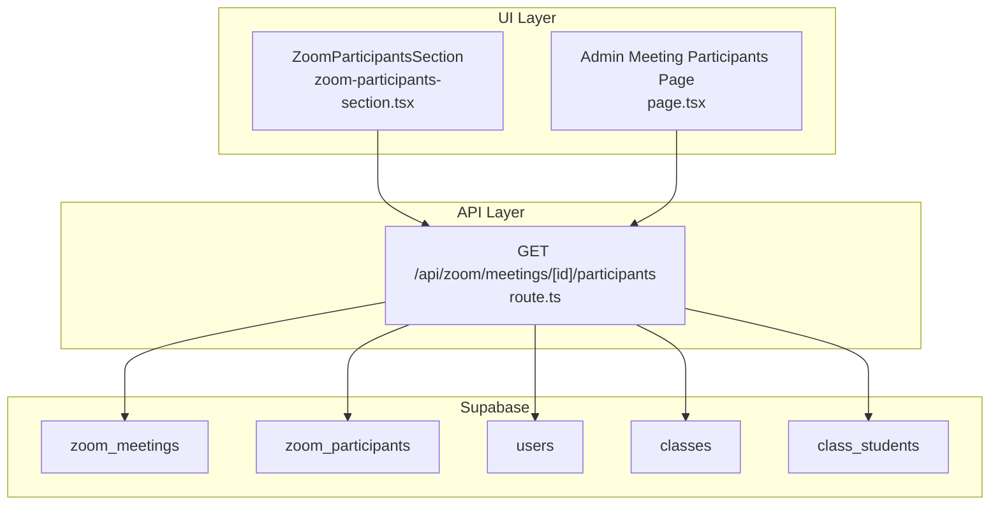
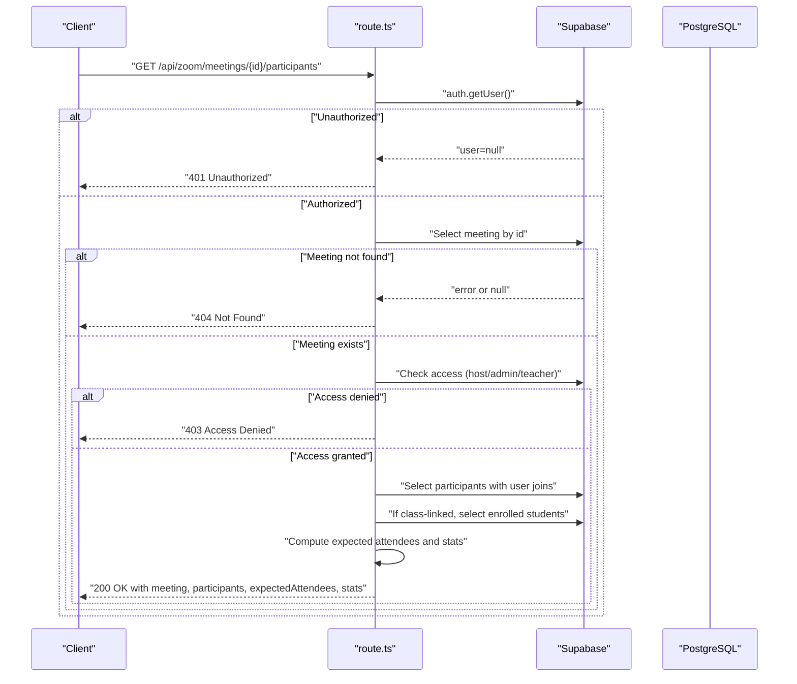
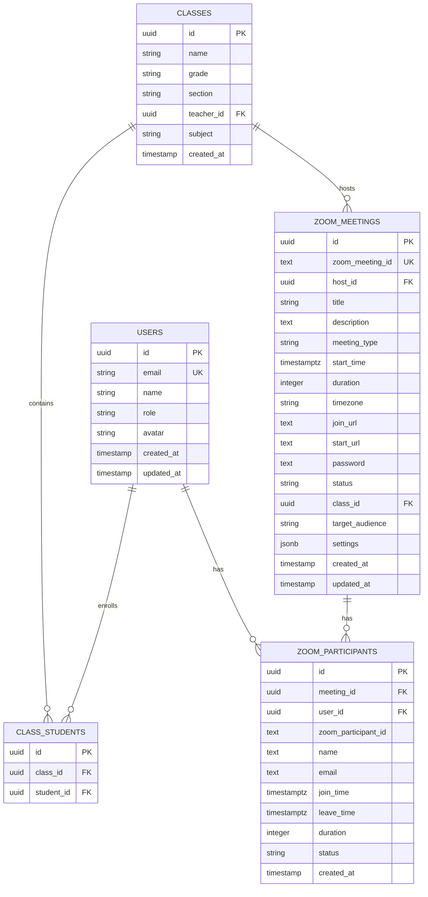
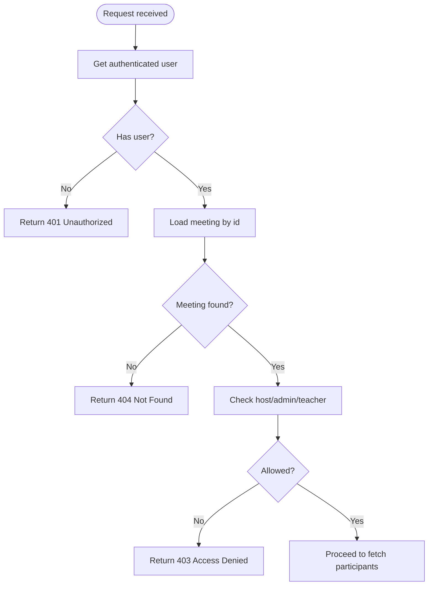
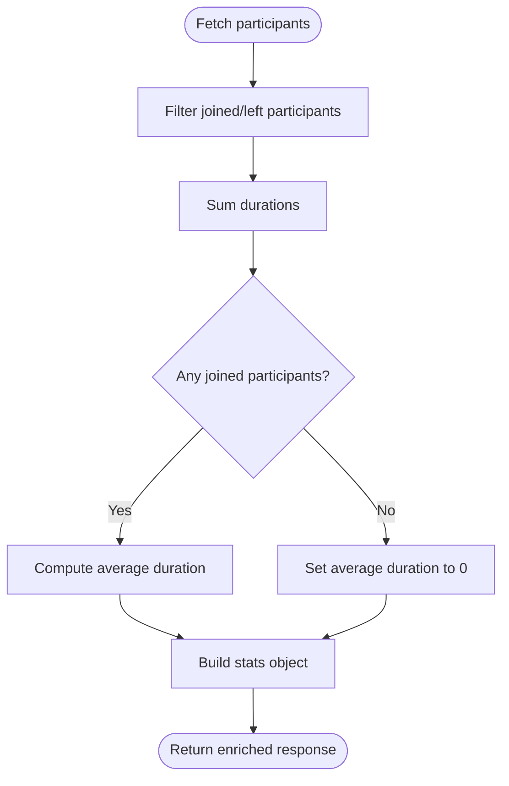
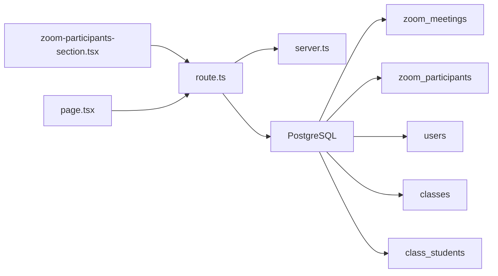

# Meeting Participants

<cite>
**Referenced Files in This Document**
- [route.ts](file://app/api/zoom/meetings/[id]/participants/route.ts)
- [zoom-participants-section.tsx](file://components/zoom-participants-section.tsx)
- [page.tsx](file://app/admin/meetings/[id]/participants/page.tsx)
- [server.ts](file://lib/supabase/server.ts)
- [middleware.ts](file://lib/supabase/middleware.ts)
- [20260110000001_create_zoom_meetings_table.sql](file://supabase/migrations/20260110000001_create_zoom_meetings_table.sql)
- [20260110000002_create_meeting_registrants_table.sql](file://supabase/migrations/20260110000002_create_meeting_registrants_table.sql)
- [20260110000003_hash_ip_addresses.sql](file://supabase/migrations/20260110000003_hash_ip_addresses.sql)
- [20260108_performance_indexes.sql](file://supabase/migrations/20260108_performance_indexes.sql)
- [20260108112143_performance_indexes.sql](file://supabase/migrations/20260108112143_performance_indexes.sql)
</cite>

## Table of Contents
1. [Introduction](#introduction)
2. [Project Structure](#project-structure)
3. [Core Components](#core-components)
4. [Architecture Overview](#architecture-overview)
5. [Detailed Component Analysis](#detailed-component-analysis)
6. [Dependency Analysis](#dependency-analysis)
7. [Performance Considerations](#performance-considerations)
8. [Troubleshooting Guide](#troubleshooting-guide)
9. [Conclusion](#conclusion)

## Introduction
This document describes the meeting participants endpoint that retrieves Zoom meeting participant data enriched with user and class enrollment information. It covers the HTTP GET method, dynamic route parameter [id], authentication and access control, the Supabase query strategy, response structure, and UI integration patterns. It also highlights performance considerations and error handling.

## Project Structure
The endpoint is implemented as a Next.js route handler under the API surface and consumed by React components for UI rendering.

**Diagram sources**
- [route.ts](file://app/api/zoom/meetings/[id]/participants/route.ts#L1-L133)
- [20260110000001_create_zoom_meetings_table.sql](file://supabase/migrations/20260110000001_create_zoom_meetings_table.sql#L1-L113)
- [20260110000002_create_meeting_registrants_table.sql](file://supabase/migrations/20260110000002_create_meeting_registrants_table.sql#L1-L53)
- [zoom-participants-section.tsx](file://components/zoom-participants-section.tsx#L1-L265)
- [page.tsx](file://app/admin/meetings/[id]/participants/page.tsx#L58-L109)

**Section sources**
- [route.ts](file://app/api/zoom/meetings/[id]/participants/route.ts#L1-L133)
- [zoom-participants-section.tsx](file://components/zoom-participants-section.tsx#L1-L265)
- [page.tsx](file://app/admin/meetings/[id]/participants/page.tsx#L58-L109)

## Core Components
- Endpoint handler: Implements GET /api/zoom/meetings/[id]/participants, validates authentication, checks access control, queries meeting and participants, enriches with user data, computes expected attendees and statistics, and returns a structured response.
- UI components: Consume the endpoint to render participant lists, expected attendees, and summary statistics in a collapsible panel.

Key responsibilities:
- Authentication: Ensures a valid user session exists.
- Access control: Allows hosts, admins, and class teachers to view participants.
- Data enrichment: Joins zoom_participants with users and class enrollment data.
- Statistics: Computes counts and averages for reporting.

**Section sources**
- [route.ts](file://app/api/zoom/meetings/[id]/participants/route.ts#L1-L133)
- [zoom-participants-section.tsx](file://components/zoom-participants-section.tsx#L1-L265)

## Architecture Overview
The endpoint orchestrates Supabase queries to assemble a comprehensive participant report. It first verifies the meeting’s existence and access rights, then fetches participants and enriches them with user profiles. If the meeting is class-linked, it correlates enrolled students with actual participants to compute attendance status and statistics.

**Diagram sources**
- [route.ts](file://app/api/zoom/meetings/[id]/participants/route.ts#L1-L133)

## Detailed Component Analysis

### Endpoint: GET /api/zoom/meetings/[id]/participants
- HTTP method: GET
- Path parameter: [id] representing the meeting identifier
- Authentication: Requires a valid user session; returns 401 if missing
- Access control:
  - Host of the meeting
  - Admin users
  - Teacher of the class associated with the meeting (if any)
- Data sources:
  - zoom_meetings: meeting metadata and class linkage
  - zoom_participants: participant records with user joins
  - users: enriched user data for participants
  - class_students: enrolled students for class-linked meetings
- Response structure:
  - meeting: id, title, class (if linked), start_time, status
  - participants: list of participant entries with user profile and timing/duration
  - expectedAttendees: list of enrolled students with attendance flag and optional participant reference
  - stats: totals and computed metrics

Response schema outline:
- meeting: object with id, title, class (optional), start_time, status
- participants: array of participant objects with fields including user profile and timing
- expectedAttendees: array of expected attendee objects with attended flag and optional participant reference
- stats: object with totalParticipants, joinedCount, expectedCount, attendanceRate, totalDurationSeconds, avgDurationSeconds

Attendance calculation logic:
- Expected attendees are derived from class enrollment when the meeting is class-linked.
- Attendance is determined by presence of a participant record with status indicating participation.
- Attendance rate is computed as the count of attended students divided by expectedCount, with fallbacks for edge cases.

Error cases:
- 401 Unauthorized: No authenticated user
- 404 Not Found: Meeting not found
- 403 Access Denied: User lacks permission to view participants
- 500 Internal Server Error: Database query failures

**Section sources**
- [route.ts](file://app/api/zoom/meetings/[id]/participants/route.ts#L1-L133)

### UI Integration: ZoomParticipantsSection
- Fetches data on demand when the collapsible panel opens.
- Displays:
  - Summary stats (joined count, attendance rate, average duration)
  - Expected attendees with attendance indicators
  - Participant list with join time and duration
- Handles loading states and error messages.
- Links to the full participants page for detailed reporting.

Real-world usage:
- Embedded in meeting widgets and dashboards to quickly preview participant engagement and attendance.

**Section sources**
- [zoom-participants-section.tsx](file://components/zoom-participants-section.tsx#L1-L265)
- [page.tsx](file://app/admin/meetings/[id]/participants/page.tsx#L58-L109)

### Database Schema and Relationships
- zoom_meetings: Contains meeting metadata and optional class_id linkage.
- zoom_participants: Tracks participant records with user_id, join/leave timestamps, duration, and status.
- users: Stores user profiles used for participant enrichment.
- classes and class_students: Enforce class membership for access control and expected attendees computation.

**Diagram sources**
- [20260110000001_create_zoom_meetings_table.sql](file://supabase/migrations/20260110000001_create_zoom_meetings_table.sql#L1-L113)
- [20260110000002_create_meeting_registrants_table.sql](file://supabase/migrations/20260110000002_create_meeting_registrants_table.sql#L1-L53)

**Section sources**
- [20260110000001_create_zoom_meetings_table.sql](file://supabase/migrations/20260110000001_create_zoom_meetings_table.sql#L1-L113)
- [20260110000002_create_meeting_registrants_table.sql](file://supabase/migrations/20260110000002_create_meeting_registrants_table.sql#L1-L53)

### Access Control Logic
- Host: The meeting’s host_id equals the authenticated user’s id.
- Admin: The authenticated user’s role is admin.
- Class teacher: The meeting’s class_id is linked to a class whose teacher_id equals the authenticated user’s id.

**Diagram sources**
- [route.ts](file://app/api/zoom/meetings/[id]/participants/route.ts#L1-L133)

**Section sources**
- [route.ts](file://app/api/zoom/meetings/[id]/participants/route.ts#L1-L133)

### Data Enrichment and Statistics
- Participants are fetched with user joins to include profile data.
- For class-linked meetings, expected attendees are derived from class_students and matched against participants to mark attendance.
- Statistics include:
  - totalParticipants
  - joinedCount
  - expectedCount
  - attendanceRate
  - totalDurationSeconds
  - avgDurationSeconds

**Diagram sources**
- [route.ts](file://app/api/zoom/meetings/[id]/participants/route.ts#L106-L131)

**Section sources**
- [route.ts](file://app/api/zoom/meetings/[id]/participants/route.ts#L56-L131)

## Dependency Analysis
- Runtime dependencies:
  - Supabase server client for authenticated database access
  - Next.js runtime for route handlers
  - UI components depend on the endpoint for data
- Database dependencies:
  - zoom_meetings, zoom_participants, users, classes, class_students
  - Indexes and policies support performance and access control

**Diagram sources**
- [route.ts](file://app/api/zoom/meetings/[id]/participants/route.ts#L1-L133)
- [server.ts](file://lib/supabase/server.ts#L1-L51)
- [20260110000001_create_zoom_meetings_table.sql](file://supabase/migrations/20260110000001_create_zoom_meetings_table.sql#L1-L113)

**Section sources**
- [route.ts](file://app/api/zoom/meetings/[id]/participants/route.ts#L1-L133)
- [server.ts](file://lib/supabase/server.ts#L1-L51)
- [middleware.ts](file://lib/supabase/middleware.ts#L1-L38)

## Performance Considerations
- Database indexes:
  - zoom_meetings: host, class, start_time, status
  - zoom_participants: meeting_id, user_id
  - class_students: class_id, student_id
- Query strategy:
  - Single round-trip to fetch meeting metadata
  - Single round-trip to fetch participants with user joins
  - Conditional fetch of enrolled students only when class_id exists
- Caching:
  - Consider short-lived caching for repeated reads of the same meeting’s participants during a session
  - Use server-side caching for frequently accessed meeting data
- Pagination:
  - Participants list is ordered by join_time; consider pagination for very large sessions
- Network:
  - Minimize payload by selecting only required fields
  - Batch UI updates to reduce re-renders

**Section sources**
- [20260110000001_create_zoom_meetings_table.sql](file://supabase/migrations/20260110000001_create_zoom_meetings_table.sql#L39-L46)
- [20260108_performance_indexes.sql](file://supabase/migrations/20260108_performance_indexes.sql#L20-L21)
- [20260108112143_performance_indexes.sql](file://supabase/migrations/20260108112143_performance_indexes.sql#L20-L21)

## Troubleshooting Guide
Common issues and resolutions:
- Unauthorized (401):
  - Ensure the user is authenticated and session is valid.
  - Verify middleware refreshes sessions correctly.
- Meeting not found (404):
  - Confirm the meeting id exists and is accessible to the user.
  - Check RLS policies for visibility.
- Access denied (403):
  - Verify the user is the meeting host, admin, or teacher of the linked class.
- Database errors (500):
  - Inspect query logs and indexes.
  - Validate relationships between zoom_meetings, zoom_participants, and class_students.
- Privacy considerations:
  - IP addresses are hashed in related tables for privacy; ensure compliance with data protection policies.

**Section sources**
- [route.ts](file://app/api/zoom/meetings/[id]/participants/route.ts#L1-L133)
- [20260110000003_hash_ip_addresses.sql](file://supabase/migrations/20260110000003_hash_ip_addresses.sql#L1-L18)

## Conclusion
The meeting participants endpoint provides a robust, secure, and efficient way to retrieve and display participant data for Zoom meetings. It enforces strict access control, enriches data with user and enrollment information, and computes meaningful statistics. The UI components integrate seamlessly with the endpoint to deliver actionable insights into meeting engagement and attendance.