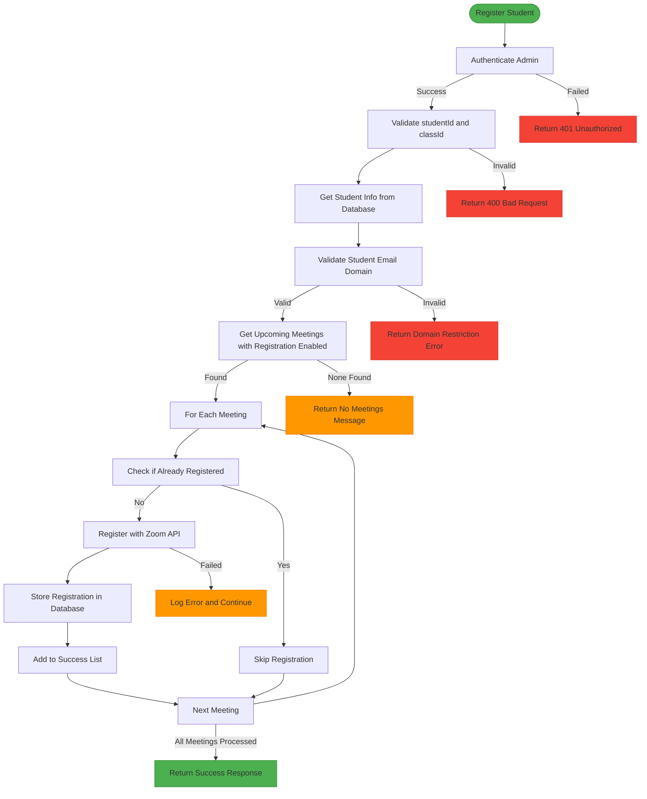
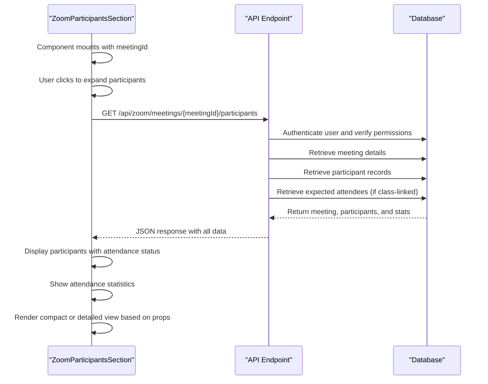
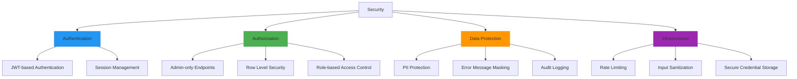

# Participant Registration

<cite>
**Referenced Files in This Document**   
- [register-student/route.ts](file://app/api/zoom/meetings/register-student/route.ts)
- [participants/route.ts](file://app/api/zoom/meetings/[id]/participants/route.ts)
- [zoom-participants-section.tsx](file://components/zoom-participants-section.tsx)
- [client.ts](file://lib/zoom/client.ts)
- [constants.ts](file://lib/zoom/constants.ts)
- [create_zoom_meetings_table.sql](file://supabase/migrations/20260110000001_create_zoom_meetings_table.sql)
- [create_meeting_registrants_table.sql](file://supabase/migrations/20260110000002_create_meeting_registrants_table.sql)
</cite>

## Table of Contents
1. [Introduction](#introduction)
2. [Student Registration Endpoint](#student-registration-endpoint)
3. [Participant Listing Endpoint](#participant-listing-endpoint)
4. [Registration Flow](#registration-flow)
5. [Error Handling](#error-handling)
6. [Usage Examples](#usage-examples)
7. [Security Considerations](#security-considerations)

## Introduction
This document provides comprehensive API documentation for the participant registration functionality in the School Management System. It details the endpoints for registering students for class meetings and retrieving meeting participants, including request/response schemas, authentication requirements, and implementation details.

## Student Registration Endpoint

### Endpoint Details
- **HTTP Method**: POST
- **URL Pattern**: `/api/zoom/meetings/register-student`
- **Authentication**: Required (Admin role only)
- **Purpose**: Registers a student for all upcoming class meetings with registration enabled

### Request Schema
```json
{
  "studentId": "string (UUID)",
  "classId": "string (UUID)"
}
```

### Response Schema
Success Response (200):
```json
{
  "message": "string",
  "registered": "number",
  "meetingIds": "array of UUIDs"
}
```

Error Responses:
- 400: Missing required fields
- 401: Unauthorized (no authentication)
- 403: Forbidden (insufficient permissions or domain restriction)
- 404: Student not found
- 500: Internal server error

### Authentication and Authorization
The endpoint enforces strict access controls:
- Users must be authenticated
- Only users with the "admin" role can access this endpoint
- Role verification is performed by querying the users table in Supabase

**Section sources**
- [register-student/route.ts](file://app/api/zoom/meetings/register-student/route.ts#L1-L116)

## Participant Listing Endpoint

### Endpoint Details
- **HTTP Method**: GET
- **URL Pattern**: `/api/zoom/meetings/[id]/participants`
- **Authentication**: Required
- **Purpose**: Retrieves detailed information about meeting participants, including attendance status and duration

### Request Parameters
- **id**: Meeting ID (path parameter)

### Response Schema
```json
{
  "meeting": {
    "id": "string",
    "title": "string",
    "class": {
      "id": "string",
      "name": "string"
    },
    "start_time": "string (ISO date)",
    "status": "string"
  },
  "participants": "array of participant objects",
  "expectedAttendees": "array of expected attendee objects",
  "stats": {
    "totalParticipants": "number",
    "joinedCount": "number",
    "expectedCount": "number",
    "attendanceRate": "number (percentage)",
    "totalDurationSeconds": "number",
    "avgDurationSeconds": "number"
  }
}
```

### Access Control
Users can access participant data if they meet any of the following criteria:
- They are the meeting host
- They have admin role
- They are the teacher of the class associated with the meeting

**Section sources**
- [participants/route.ts](file://app/api/zoom/meetings/[id]/participants/route.ts#L1-L133)

## Registration Flow

### Complete Registration Process


**Diagram sources**
- [register-student/route.ts](file://app/api/zoom/meetings/register-student/route.ts#L1-L116)
- [client.ts](file://lib/zoom/client.ts#L259-L273)
- [constants.ts](file://lib/zoom/constants.ts#L11-L13)

### Key Functions in Registration Flow

#### Student Email Validation
The system validates that students have email addresses from the approved domain:
- **Allowed Domain**: `r1.deped.gov.ph`
- **Validation Function**: `isAllowedEmail()` in `lib/zoom/constants.ts`
- **Error Message**: "Only @r1.deped.gov.ph email addresses can join class meetings"

#### Upcoming Meetings Retrieval
The system queries for meetings that:
- Belong to the specified class
- Have registration enabled
- Start at or after the current time
- Are in "scheduled" or "started" status

#### Batch Registration
While the current implementation processes registrations sequentially, the Zoom client library provides `addMeetingRegistrantsBatch()` function for future optimization:
- Processes registrants in batches of 10
- Includes rate limiting with 100ms delays between batches
- Continues processing even if individual registrations fail

#### Database Storage
Successful registrations are stored in the `meeting_registrants` table with:
- Meeting ID reference
- User ID reference
- Zoom registrant ID
- Join URL
- Registration status
- Timestamps

**Section sources**
- [register-student/route.ts](file://app/api/zoom/meetings/register-student/route.ts#L1-L116)
- [constants.ts](file://lib/zoom/constants.ts#L5-L20)
- [client.ts](file://lib/zoom/client.ts#L259-L307)

## Error Handling

### Error Types and Responses
The system implements comprehensive error handling for various failure scenarios:

```mermaid
flowchart TD
ErrorTypes --> ValidationError["Validation Errors"]
ErrorTypes --> AuthenticationError["Authentication Errors"]
ErrorTypes --> AuthorizationError["Authorization Errors"]
ErrorTypes --> DataError["Data Access Errors"]
ErrorTypes --> ExternalError["External API Errors"]
ErrorTypes --> SystemError["System Errors"]
ValidationError --> MissingFields["Missing studentId or classId"]
ValidationError --> InvalidEmail["Invalid student email"]
AuthenticationError --> NoAuth["No authentication token"]
AuthenticationError --> ExpiredToken["Expired authentication token"]
AuthorizationError --> NotAdmin["User is not an admin"]
AuthorizationError --> DomainRestricted["Email domain not allowed"]
DataError --> StudentNotFound["Student not found in database"]
DataError --> MeetingNotFound["No upcoming meetings found"]
ExternalError --> ZoomAPIFailure["Zoom API registration failed"]
ExternalError --> NetworkIssue["Network connectivity issues"]
SystemError --> DatabaseError["Database operation failed"]
SystemError --> ServerError["Internal server error"]
MissingFields --> Response400["400 Bad Request"]
InvalidEmail --> Response400
NoAuth --> Response401["401 Unauthorized"]
ExpiredToken --> Response401
NotAdmin --> Response403["403 Forbidden"]
DomainRestricted --> Response403
StudentNotFound --> Response404["404 Not Found"]
MeetingNotFound --> Response200["200 OK with message"]
ZoomAPIFailure --> Response500["500 Internal Server Error"]
NetworkIssue --> Response500
DatabaseError --> Response500
ServerError --> Response500
style Response400 fill:#2196F3,stroke:#1976D2
style Response401 fill:#9C27B0,stroke:#7B1FA2
style Response403 fill:#FF9800,stroke:#F57C00
style Response404 fill:#607D8B,stroke:#455A64
style Response200 fill:#4CAF50,stroke:#388E3C
style Response500 fill:#F44336,stroke:#D32F2F
```



**Diagram sources**
- [register-student/route.ts](file://app/api/zoom/meetings/register-student/route.ts#L1-L116)
- [api-errors.ts](file://lib/api-errors.ts#L1-L116)

### Error Response Structure
All error responses follow a consistent format:
```json
{
  "error": "string description",
  "code": "optional error code"
}
```

Specific error codes include:
- `DOMAIN_RESTRICTED`: For email domain validation failures

The system logs detailed error information server-side while returning generic messages to clients to prevent information disclosure.

**Section sources**
- [register-student/route.ts](file://app/api/zoom/meetings/register-student/route.ts#L1-L116)
- [api-errors.ts](file://lib/api-errors.ts#L1-L116)

## Usage Examples

### Frontend Component Implementation
The `zoom-participants-section.tsx` component demonstrates how to consume the participant listing endpoint:



**Diagram sources**
- [zoom-participants-section.tsx](file://components/zoom-participants-section.tsx#L1-L265)
- [participants/route.ts](file://app/api/zoom/meetings/[id]/participants/route.ts#L1-L133)

### Key Features of the Frontend Implementation
- **Lazy Loading**: Participants are only fetched when the section is expanded
- **Error Handling**: Displays user-friendly error messages for 403 and other failures
- **Compact Mode**: Shows summary information when space is limited
- **Attendance Tracking**: Compares actual participants with expected attendees
- **Duration Formatting**: Converts seconds to human-readable format (e.g., "1h 23m")
- **Full Report Link**: Provides navigation to detailed participant reports

**Section sources**
- [zoom-participants-section.tsx](file://components/zoom-participants-section.tsx#L1-L265)

## Security Considerations

### Email Domain Restrictions
The system enforces strict email domain policies for student participation:
- **Allowed Domain**: `r1.deped.gov.ph`
- **Implementation**: `isAllowedEmail()` function in `lib/zoom/constants.ts`
- **Purpose**: Ensures only verified DepEd students can participate in class meetings
- **Error Handling**: Returns specific error code `DOMAIN_RESTRICTED` with descriptive message

### Access Control
Multi-layered authorization is implemented:
- **Endpoint Level**: Only admins can register students
- **Data Level**: Row Level Security (RLS) policies in Supabase
- **Meeting Level**: Users can only access participants for meetings they host or have permission to view

### Data Protection
- **PII Handling**: Personal information is protected through RLS policies
- **Error Minimization**: Generic error messages prevent information leakage
- **Rate Limiting**: System includes rate limiting to prevent abuse
- **Audit Logging**: All access and modification events are logged

### Database Security
The system implements robust database security:
- **Row Level Security**: Enabled on all relevant tables
- **Fine-grained Policies**: Specific policies for different user roles
- **Indexing**: Optimized indexes for performance and security
- **Referential Integrity**: Foreign key constraints maintain data consistency



**Diagram sources**
- [constants.ts](file://lib/zoom/constants.ts#L5-L20)
- [create_zoom_meetings_table.sql](file://supabase/migrations/20260110000001_create_zoom_meetings_table.sql#L47-L113)
- [create_meeting_registrants_table.sql](file://supabase/migrations/20260110000002_create_meeting_registrants_table.sql#L19-L53)
- [register-student/route.ts](file://app/api/zoom/meetings/register-student/route.ts#L1-L116)

**Section sources**
- [constants.ts](file://lib/zoom/constants.ts#L5-L20)
- [create_zoom_meetings_table.sql](file://supabase/migrations/20260110000001_create_zoom_meetings_table.sql#L47-L113)
- [create_meeting_registrants_table.sql](file://supabase/migrations/20260110000002_create_meeting_registrants_table.sql#L19-L53)
- [register-student/route.ts](file://app/api/zoom/meetings/register-student/route.ts#L1-L116)