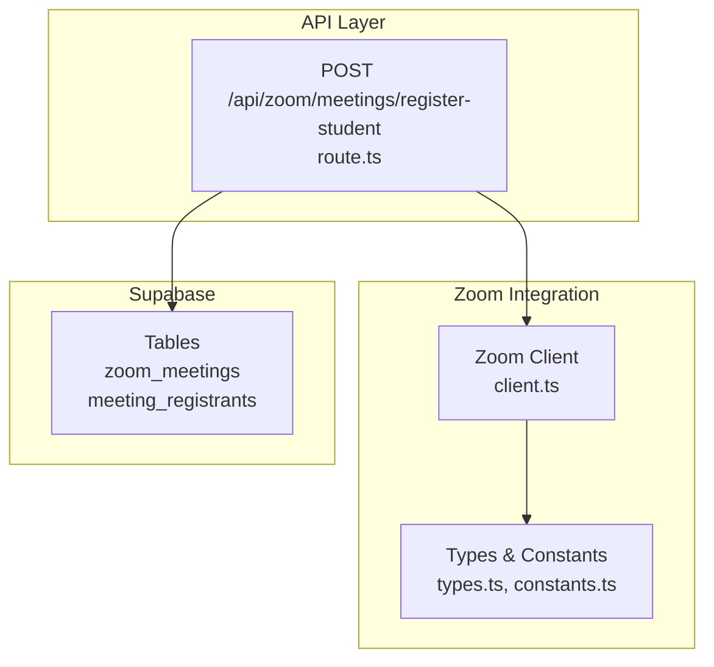
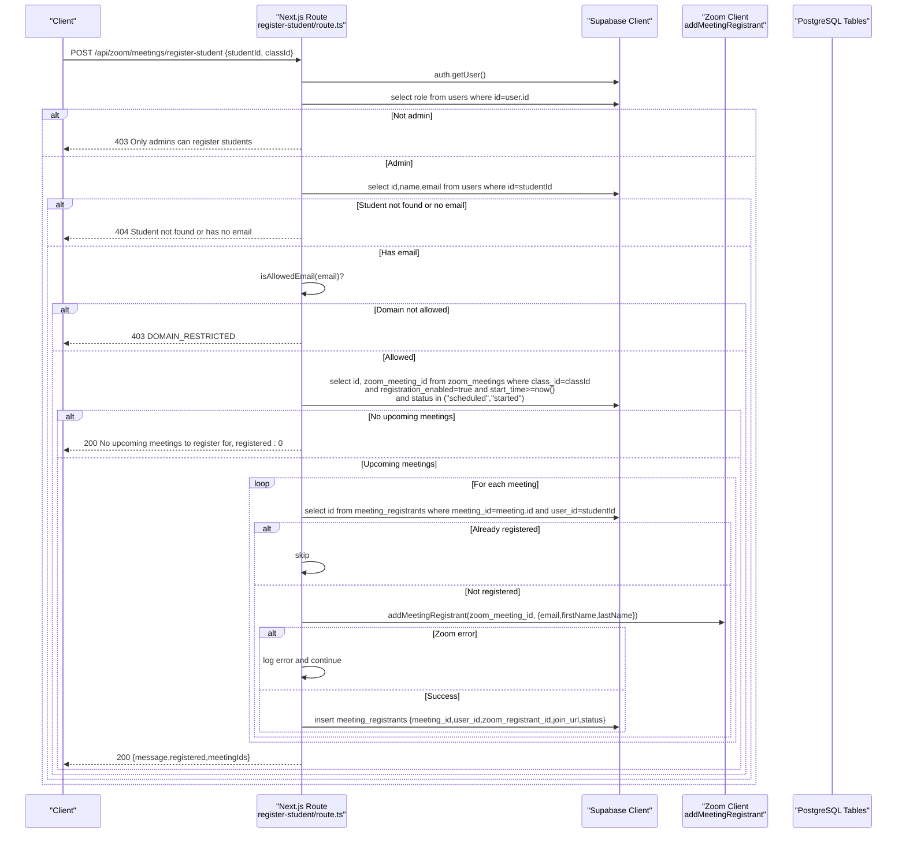
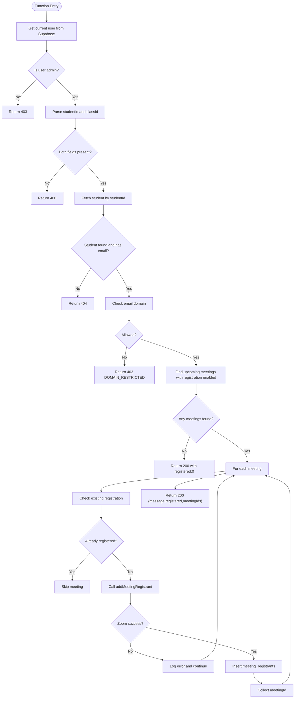
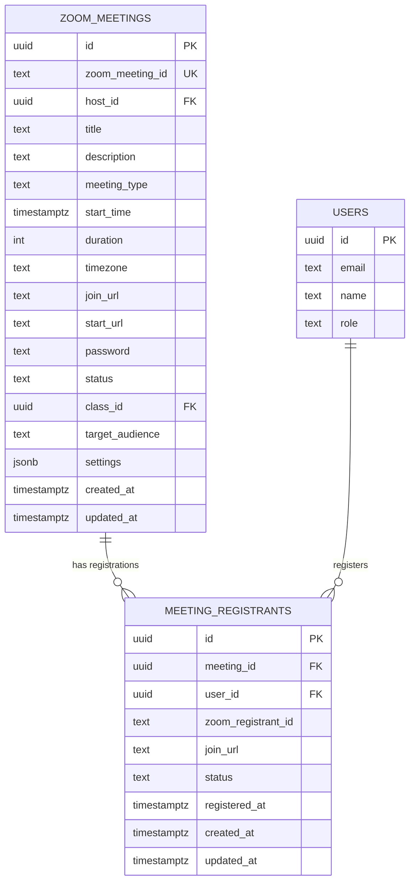
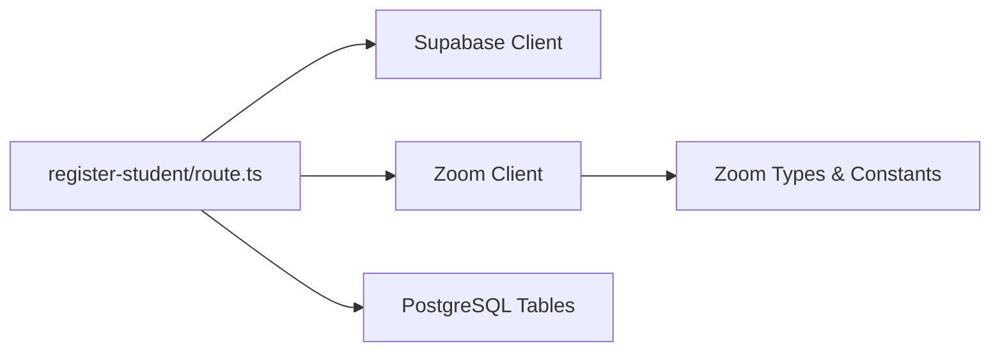

# Student Registration

<cite>
**Referenced Files in This Document**
- [route.ts](file://app/api/zoom/meetings/register-student/route.ts)
- [client.ts](file://lib/zoom/client.ts)
- [constants.ts](file://lib/zoom/constants.ts)
- [index.ts](file://lib/zoom/index.ts)
- [types.ts](file://lib/zoom/types.ts)
- [20260110000002_create_meeting_registrants_table.sql](file://supabase/migrations/20260110000002_create_meeting_registrants_table.sql)
- [20260110000001_create_zoom_meetings_table.sql](file://supabase/migrations/20260110000001_create_zoom_meetings_table.sql)
- [proxy.ts](file://proxy.ts)
- [api-errors.ts](file://lib/api-errors.ts)
</cite>

## Table of Contents
1. [Introduction](#introduction)
2. [Project Structure](#project-structure)
3. [Core Components](#core-components)
4. [Architecture Overview](#architecture-overview)
5. [Detailed Component Analysis](#detailed-component-analysis)
6. [Dependency Analysis](#dependency-analysis)
7. [Performance Considerations](#performance-considerations)
8. [Troubleshooting Guide](#troubleshooting-guide)
9. [Conclusion](#conclusion)
10. [Appendices](#appendices)

## Introduction
This document provides comprehensive API documentation for the student registration endpoint that registers a student for all upcoming class meetings with registration enabled. It covers the HTTP method, URL pattern, request/response schemas, authentication requirements, step-by-step processing flow, database persistence, and security considerations.

## Project Structure
The endpoint is implemented as a Next.js route under the API surface and integrates with Supabase for user and meeting data, and the Zoom client for meeting registration.

**Diagram sources**
- [route.ts](file://app/api/zoom/meetings/register-student/route.ts#L1-L116)
- [client.ts](file://lib/zoom/client.ts#L255-L334)
- [types.ts](file://lib/zoom/types.ts#L1-L168)
- [constants.ts](file://lib/zoom/constants.ts#L1-L21)
- [20260110000001_create_zoom_meetings_table.sql](file://supabase/migrations/20260110000001_create_zoom_meetings_table.sql#L1-L113)
- [20260110000002_create_meeting_registrants_table.sql](file://supabase/migrations/20260110000002_create_meeting_registrants_table.sql#L1-L53)

**Section sources**
- [route.ts](file://app/api/zoom/meetings/register-student/route.ts#L1-L116)
- [client.ts](file://lib/zoom/client.ts#L255-L334)
- [constants.ts](file://lib/zoom/constants.ts#L1-L21)
- [20260110000001_create_zoom_meetings_table.sql](file://supabase/migrations/20260110000001_create_zoom_meetings_table.sql#L1-L113)
- [20260110000002_create_meeting_registrants_table.sql](file://supabase/migrations/20260110000002_create_meeting_registrants_table.sql#L1-L53)

## Core Components
- Endpoint: POST /api/zoom/meetings/register-student
- Purpose: Batch register a student for all upcoming class meetings with registration enabled
- Authentication: Admin role required
- Request Body: JSON with studentId and classId
- Response: Success includes registered count and meeting IDs; error responses cover unauthorized access, invalid input, domain restrictions, and server errors

**Section sources**
- [route.ts](file://app/api/zoom/meetings/register-student/route.ts#L1-L116)

## Architecture Overview
The endpoint validates admin privileges, retrieves student data from Supabase, enforces email domain compliance, identifies upcoming meetings with registration enabled, and registers the student via Zoom’s API. It persists registration records in the meeting_registrants table.

**Diagram sources**
- [route.ts](file://app/api/zoom/meetings/register-student/route.ts#L1-L116)
- [client.ts](file://lib/zoom/client.ts#L255-L334)
- [constants.ts](file://lib/zoom/constants.ts#L1-L21)
- [20260110000002_create_meeting_registrants_table.sql](file://supabase/migrations/20260110000002_create_meeting_registrants_table.sql#L1-L53)
- [20260110000001_create_zoom_meetings_table.sql](file://supabase/migrations/20260110000001_create_zoom_meetings_table.sql#L1-L113)

## Detailed Component Analysis

### Endpoint Definition
- Method: POST
- URL Pattern: /api/zoom/meetings/register-student
- Request Body Schema:
  - studentId: string (UUID)
  - classId: string (UUID)
- Response Schema (Success):
  - message: string
  - registered: number
  - meetingIds: string[]
- Response Schema (Errors):
  - Unauthorized: 401 with error message
  - Forbidden: 403 with error message
  - Bad Request: 400 with error message
  - Not Found: 404 with error message
  - Internal Server Error: 500 with error message

**Section sources**
- [route.ts](file://app/api/zoom/meetings/register-student/route.ts#L1-L116)

### Authentication and Authorization
- Authentication: The route obtains the current user via Supabase auth and requires a logged-in session.
- Authorization: The route fetches the user’s role from the users table and enforces admin-only access. Non-admin users receive a 403 response.

**Section sources**
- [route.ts](file://app/api/zoom/meetings/register-student/route.ts#L10-L26)
- [proxy.ts](file://proxy.ts#L168-L211)

### Email Domain Validation
- The route validates that the student’s email ends with the allowed DepEd domain. If not, it returns a 403 with a domain restriction error code and message.

**Section sources**
- [route.ts](file://app/api/zoom/meetings/register-student/route.ts#L46-L52)
- [constants.ts](file://lib/zoom/constants.ts#L1-L21)

### Meeting Discovery and Registration Logic
- Upcoming Meetings: The route queries zoom_meetings for meetings linked to the given classId, with registration enabled, scheduled or started, and occurring at or after the current time.
- Duplicate Prevention: For each meeting, it checks meeting_registrants to avoid re-registering the same student.
- Zoom Registration: For eligible meetings, it calls addMeetingRegistrant with the student’s email and derived first/last names.
- Database Persistence: On successful Zoom registration, it inserts a record into meeting_registrants with the Zoom registrant ID, join URL, and approved status.

**Diagram sources**
- [route.ts](file://app/api/zoom/meetings/register-student/route.ts#L1-L116)
- [client.ts](file://lib/zoom/client.ts#L255-L334)
- [20260110000002_create_meeting_registrants_table.sql](file://supabase/migrations/20260110000002_create_meeting_registrants_table.sql#L1-L53)

**Section sources**
- [route.ts](file://app/api/zoom/meetings/register-student/route.ts#L28-L107)
- [client.ts](file://lib/zoom/client.ts#L255-L334)

### Database Schema and Persistence
- meeting_registrants table stores registration records with foreign keys to zoom_meetings and users, and includes the Zoom registrant ID and join URL.
- zoom_meetings table includes registration_url and registration_enabled flags used by the endpoint to filter eligible meetings.

**Diagram sources**
- [20260110000002_create_meeting_registrants_table.sql](file://supabase/migrations/20260110000002_create_meeting_registrants_table.sql#L1-L53)
- [20260110000001_create_zoom_meetings_table.sql](file://supabase/migrations/20260110000001_create_zoom_meetings_table.sql#L1-L113)

**Section sources**
- [20260110000002_create_meeting_registrants_table.sql](file://supabase/migrations/20260110000002_create_meeting_registrants_table.sql#L1-L53)
- [20260110000001_create_zoom_meetings_table.sql](file://supabase/migrations/20260110000001_create_zoom_meetings_table.sql#L1-L113)

### Zoom Integration Details
- addMeetingRegistrant: Adds a registrant to a Zoom meeting and returns a registrant ID and join URL.
- Types: ZoomRegistrantResponse defines the shape of the Zoom API response used by the endpoint.

**Section sources**
- [client.ts](file://lib/zoom/client.ts#L255-L334)
- [types.ts](file://lib/zoom/types.ts#L62-L80)

### Security Aspects
- Role-Based Access Control: Admin-only endpoint enforcement via user role check.
- Email Domain Validation: Only emails ending with the allowed DepEd domain are accepted.
- Error Handling Hygiene: The endpoint logs errors internally and returns generic messages to clients; centralized error utilities are available for broader use.
- Session Security: Middleware enforces account status and absolute session timeouts for API routes.

**Section sources**
- [route.ts](file://app/api/zoom/meetings/register-student/route.ts#L10-L26)
- [constants.ts](file://lib/zoom/constants.ts#L1-L21)
- [api-errors.ts](file://lib/api-errors.ts#L1-L92)
- [proxy.ts](file://proxy.ts#L168-L211)

## Dependency Analysis
The endpoint depends on:
- Supabase client for authentication and database queries
- Zoom client for meeting registration
- Zoom constants for domain validation and error messaging

**Diagram sources**
- [route.ts](file://app/api/zoom/meetings/register-student/route.ts#L1-L116)
- [client.ts](file://lib/zoom/client.ts#L255-L334)
- [constants.ts](file://lib/zoom/constants.ts#L1-L21)
- [20260110000002_create_meeting_registrants_table.sql](file://supabase/migrations/20260110000002_create_meeting_registrants_table.sql#L1-L53)

**Section sources**
- [route.ts](file://app/api/zoom/meetings/register-student/route.ts#L1-L116)
- [client.ts](file://lib/zoom/client.ts#L255-L334)
- [constants.ts](file://lib/zoom/constants.ts#L1-L21)

## Performance Considerations
- Batch Registration: The endpoint iterates over upcoming meetings and registers the student individually. While this avoids a Zoom batch endpoint, it can be optimized by parallelizing registrations with controlled concurrency and rate limiting.
- Rate Limiting: The Zoom client includes a batch-style approach with rate limiting; the endpoint should adopt similar strategies to minimize API throttling.
- Indexes: Ensure appropriate indexes exist on zoom_meetings (class_id, start_time, status) and meeting_registrants (meeting_id, user_id) to support efficient queries.

[No sources needed since this section provides general guidance]

## Troubleshooting Guide
Common issues and resolutions:
- Unauthorized Access (401/403): Ensure the caller is authenticated and has the admin role.
- Invalid Input (400): Verify studentId and classId are provided and valid.
- Student Not Found (404): Confirm the student exists and has an email address.
- Domain Restrictions (403): The student’s email must belong to the allowed DepEd domain.
- No Upcoming Meetings (200): There are no meetings with registration enabled for the class.
- Zoom Registration Errors: Inspect logs for failed registrations; the endpoint continues on individual failures to maximize coverage.

**Section sources**
- [route.ts](file://app/api/zoom/meetings/register-student/route.ts#L10-L115)
- [api-errors.ts](file://lib/api-errors.ts#L1-L92)

## Conclusion
The student registration endpoint provides a robust, admin-protected mechanism to register students for upcoming class meetings. It enforces role-based access control, validates email domains, discovers eligible meetings, registers via Zoom, and persists results in the database. The design balances correctness and resilience, with clear error handling and security hygiene.

[No sources needed since this section summarizes without analyzing specific files]

## Appendices

### API Reference

- Endpoint: POST /api/zoom/meetings/register-student
- Request Body:
  - studentId: string (required)
  - classId: string (required)
- Success Response (200):
  - message: string
  - registered: number
  - meetingIds: string[]
- Error Responses:
  - 401 Unauthorized: Not authenticated
  - 403 Forbidden: Only admins can register students or domain restricted
  - 400 Bad Request: Missing studentId or classId
  - 404 Not Found: Student not found or has no email
  - 500 Internal Server Error: Unexpected error during processing

**Section sources**
- [route.ts](file://app/api/zoom/meetings/register-student/route.ts#L1-L116)
- [constants.ts](file://lib/zoom/constants.ts#L1-L21)

### Form Integration Example
While the endpoint itself does not render forms, the frontend component that displays meeting participants demonstrates how API routes are consumed client-side. See the participants section component for patterns of fetching and handling API responses.

**Section sources**
- [zoom-participants-section.tsx](file://components/zoom-participants-section.tsx#L76-L98)