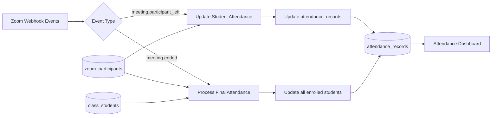
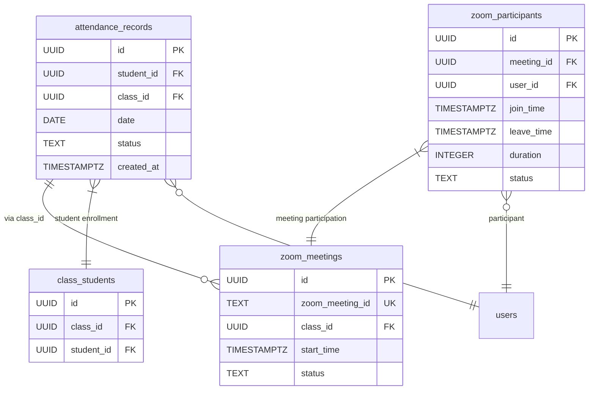
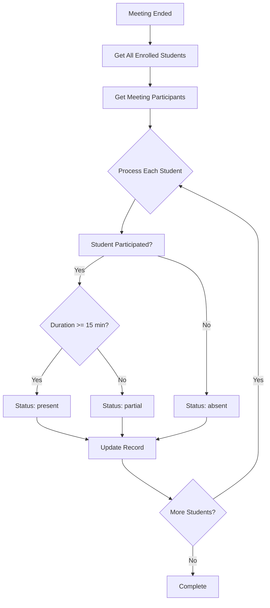
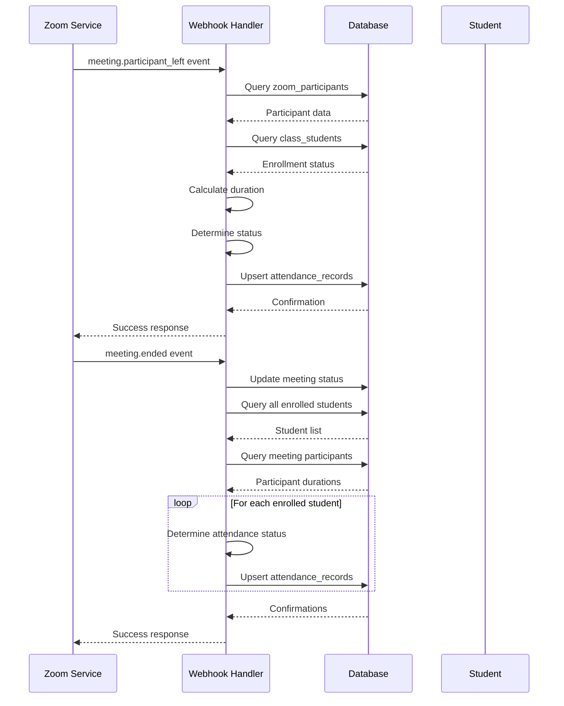

# Attendance Processing Logic

<cite>
**Referenced Files in This Document**   
- [webhook/route.ts](file://app/api/zoom/webhook/route.ts)
- [attendance-utils.ts](file://lib/attendance-utils.ts)
- [create_attendance_tables.sql](file://supabase/migrations/20251219043454_create_attendance_tables.sql)
- [add_attendance_unique_constraint.sql](file://supabase/migrations/20251219121408_add_attendance_unique_constraint.sql)
- [add_partial_attendance_status.sql](file://supabase/migrations/20260110102108_add_partial_attendance_status.sql)
- [create_zoom_meetings_table.sql](file://supabase/migrations/20260110000001_create_zoom_meetings_table.sql)
- [database.types.ts](file://lib/database.types.ts)
- [types.ts](file://lib/types.ts)
</cite>

## Table of Contents
1. [Introduction](#introduction)
2. [Core Components](#core-components)
3. [Data Flow Overview](#data-flow-overview)
4. [Attendance Processing Logic](#attendance-processing-logic)
5. [Database Schema](#database-schema)
6. [Final Attendance Processing](#final-attendance-processing)
7. [Conflict Resolution Strategy](#conflict-resolution-strategy)
8. [Sequence Diagram](#sequence-diagram)

## Introduction
This document details the attendance processing logic in the School Management System that is triggered by Zoom webhook events. The system automatically tracks student participation in virtual classes and updates attendance records based on meeting duration. The logic centers around two key functions: `updateStudentAttendance` for real-time updates when students leave meetings, and `processFinalAttendance` for comprehensive processing when meetings end. The system uses a 15-minute threshold (MIN_ATTENDANCE_DURATION) to determine present status and handles all enrolled students regardless of actual participation.

## Core Components

The attendance processing system consists of several interconnected components that work together to capture Zoom meeting data and convert it into meaningful attendance records. The primary components include the Zoom webhook handler, attendance utility functions, and the underlying database schema that stores both temporary meeting participation data and permanent attendance records.

**Section sources**
- [webhook/route.ts](file://app/api/zoom/webhook/route.ts#L5-L342)
- [attendance-utils.ts](file://lib/attendance-utils.ts#L1-L42)

## Data Flow Overview

The attendance processing system follows a clear data flow from Zoom events to final attendance records:

1. Zoom sends webhook events to the `/api/zoom/webhook` endpoint
2. The webhook handler processes different event types (meeting.started, participant_joined, etc.)
3. Participant data is stored in the zoom_participants table with join/leave times and duration
4. When participants leave meetings, immediate attendance updates are made for students
5. When meetings end, a final processing pass ensures all enrolled students have accurate attendance
6. Attendance records are upserted into the attendance_records table with appropriate status



**Diagram sources**
- [webhook/route.ts](file://app/api/zoom/webhook/route.ts#L17-L247)
- [create_zoom_meetings_table.sql](file://supabase/migrations/20260110000001_create_zoom_meetings_table.sql#L24-L37)

## Attendance Processing Logic

The system implements two complementary approaches to attendance processing: real-time updates when participants leave meetings, and comprehensive final processing when meetings end. This dual approach ensures both timely feedback and complete accuracy.

The `updateStudentAttendance` function is called whenever a student participant leaves a meeting. It checks if the student is enrolled in the associated class and calculates their total participation duration. If the duration meets or exceeds the MIN_ATTENDANCE_DURATION threshold of 15 minutes, the student is marked as "present"; otherwise, they receive a "partial" status indicating they attended but for insufficient time.

```mermaid
flowchart TD
Start([Participant Leaves Meeting]) --> A{Is Student?}
A --> |No| End1([No Action])
A --> |Yes| B[Calculate Total Duration]
B --> C{Duration >= 15 min?}
C --> |Yes| D[Mark as "present"]
C --> |No| E[Mark as "partial"]
D --> F[Update attendance_records]
E --> F
F --> End2([Complete])
```

**Diagram sources**
- [webhook/route.ts](file://app/api/zoom/webhook/route.ts#L254-L283)
- [types.ts](file://lib/types.ts#L7)

**Section sources**
- [webhook/route.ts](file://app/api/zoom/webhook/route.ts#L229-L237)

## Database Schema

The attendance system relies on a well-defined database schema with proper constraints and relationships. The key tables involved are attendance_records, zoom_meetings, zoom_participants, and class_students.

The attendance_records table stores the final attendance status for students, with a composite unique constraint on student_id, class_id, and date to prevent duplicate records. The status field includes values "present", "absent", "late", "excused", and "partial" to capture various attendance scenarios.



**Diagram sources**
- [create_attendance_tables.sql](file://supabase/migrations/20251219043454_create_attendance_tables.sql#L1-L8)
- [add_attendance_unique_constraint.sql](file://supabase/migrations/20251219121408_add_attendance_unique_constraint.sql#L1)
- [create_zoom_meetings_table.sql](file://supabase/migrations/20260110000001_create_zoom_meetings_table.sql#L24-L37)
- [database.types.ts](file://lib/database.types.ts#L214-L255)

## Final Attendance Processing

When a Zoom meeting ends, the system performs a comprehensive final attendance processing pass through the `processFinalAttendance` function. This ensures that all students enrolled in the class receive an accurate attendance record, regardless of whether they joined the meeting.

The process begins by retrieving all students enrolled in the class from the class_students table. It then fetches all participants who joined the meeting from the zoom_participants table, creating a map of student IDs to their participation duration. For each enrolled student, the system determines their attendance status based on their participation:

- Students with 15+ minutes of participation are marked as "present"
- Students who participated for less than 15 minutes are marked as "partial"
- Students who never joined the meeting are marked as "absent"

This comprehensive approach ensures that attendance records are complete and accurate for all enrolled students.



**Diagram sources**
- [webhook/route.ts](file://app/api/zoom/webhook/route.ts#L289-L341)
- [create_attendance_tables.sql](file://supabase/migrations/20251219043454_create_attendance_tables.sql#L1-L8)

**Section sources**
- [webhook/route.ts](file://app/api/zoom/webhook/route.ts#L290-L341)

## Conflict Resolution Strategy

The system uses a robust upsert operation with composite key conflict resolution to ensure data integrity when updating attendance records. The upsert operation targets the attendance_records table with a conflict resolution strategy based on the unique constraint of student_id, class_id, and date.

When an attendance record already exists for a student on a specific date for a class, the upsert operation updates the existing record rather than creating a duplicate. This prevents data duplication and ensures that the most recent attendance information is preserved. The operation is designed to handle both real-time updates from participant leave events and the final processing pass when meetings end.

The conflict resolution is implemented at the database level with a unique index on the combination of student_id, class_id, and date fields. This ensures that even if multiple update operations occur for the same student-class-date combination, only one record will exist in the database.

**Section sources**
- [webhook/route.ts](file://app/api/zoom/webhook/route.ts#L274-L282)
- [add_attendance_unique_constraint.sql](file://supabase/migrations/20251219121408_add_attendance_unique_constraint.sql#L1)

## Sequence Diagram

The following sequence diagram illustrates the complete flow of attendance processing from Zoom webhook events to final attendance records:



**Diagram sources**
- [webhook/route.ts](file://app/api/zoom/webhook/route.ts#L131-L153)
- [webhook/route.ts](file://app/api/zoom/webhook/route.ts#L91-L129)