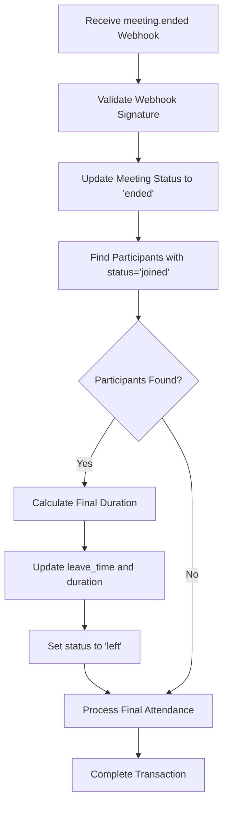
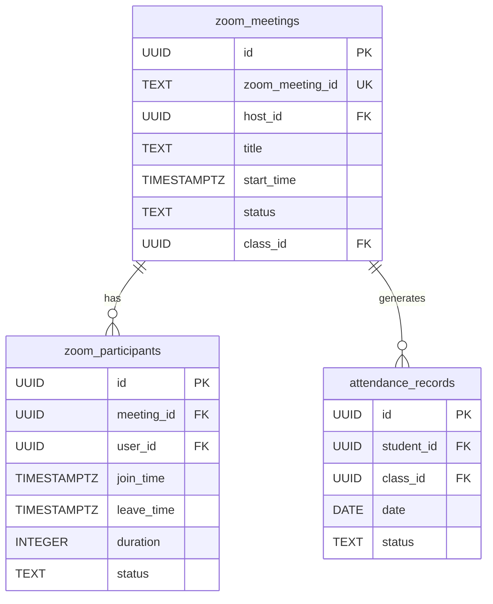
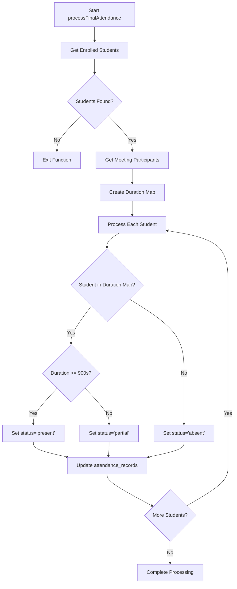
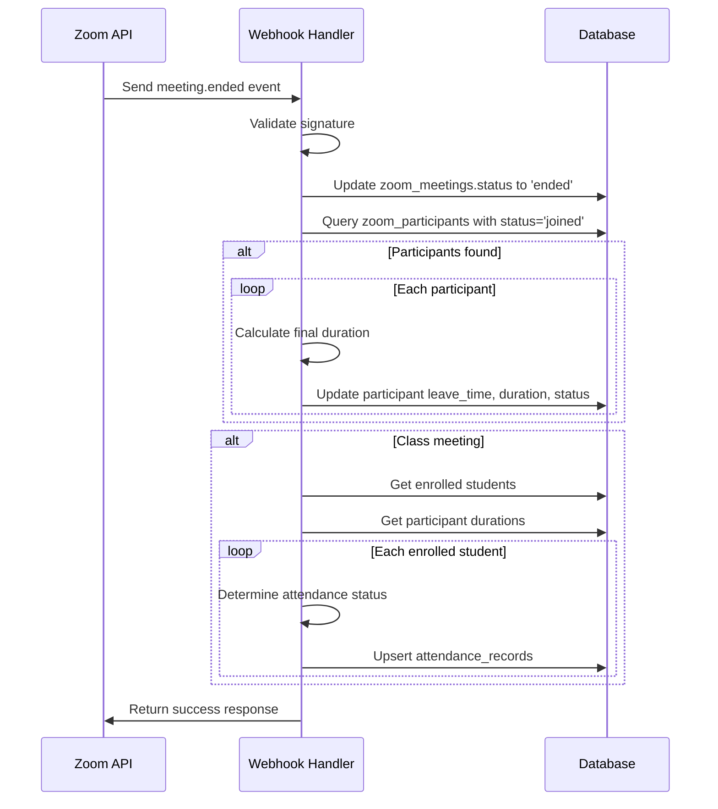

# Meeting Ended Event

<cite>
**Referenced Files in This Document**   
- [webhook/route.ts](file://app/api/zoom/webhook/route.ts)
- [zoom_meetings_table.sql](file://supabase/migrations/20260110000001_create_zoom_meetings_table.sql)
- [create_attendance_tables.sql](file://supabase/migrations/20251219043454_create_attendance_tables.sql)
- [add_partial_attendance_status.sql](file://supabase/migrations/20260110102108_add_partial_attendance_status.sql)
- [participants/route.ts](file://app/api/zoom/meetings/[id]/participants/route.ts)
</cite>

## Table of Contents
1. [Introduction](#introduction)
2. [Meeting Ended Event Processing Flow](#meeting-ended-event-processing-flow)
3. [Database Schema Overview](#database-schema-overview)
4. [Final Attendance Processing Logic](#final-attendance-processing-logic)
5. [Duration Calculation and Thresholds](#duration-calculation-and-thresholds)
6. [Error Handling and Edge Cases](#error-handling-and-edge-cases)
7. [Sequence Diagram](#sequence-diagram)

## Introduction
This document details the processing flow for the `meeting.ended` webhook event in the School Management System. When a Zoom meeting concludes, the system automatically updates attendance records for all enrolled students based on their participation duration. The process involves updating meeting status, calculating participant durations, and determining final attendance status (present, partial, or absent) according to predefined thresholds.

## Meeting Ended Event Processing Flow
When a `meeting.ended` event is received from Zoom, the system executes a transactional workflow to ensure data consistency across meeting status, participant records, and attendance tracking. The process begins with webhook validation and proceeds through several coordinated database operations.

The workflow includes:
- Updating the meeting status to 'ended' in the zoom_meetings table
- Identifying all participants still marked as 'joined'
- Calculating final duration for incomplete sessions
- Updating participant leave_time and status
- Processing final attendance for all enrolled students



**Diagram sources**
- [webhook/route.ts](file://app/api/zoom/webhook/route.ts#L91-L129)

**Section sources**
- [webhook/route.ts](file://app/api/zoom/webhook/route.ts#L91-L129)

## Database Schema Overview
The system utilizes several interconnected tables to track meetings and attendance. The core tables involved in the meeting ended event processing are zoom_meetings, zoom_participants, and attendance_records.

### zoom_meetings Table
Stores metadata about scheduled Zoom meetings with status tracking.

**Key fields:**
- id: UUID primary key
- zoom_meeting_id: External Zoom meeting identifier
- class_id: Foreign key to classes table
- start_time: Scheduled start time (TIMESTAMPTZ)
- status: Current status (scheduled, started, ended, cancelled)

### zoom_participants Table
Tracks individual participant attendance in meetings.

**Key fields:**
- meeting_id: References zoom_meetings.id
- user_id: References users.id
- join_time: Timestamp when participant joined
- leave_time: Timestamp when participant left
- duration: Total time spent in meeting (seconds)
- status: Current status (invited, joined, left)

### attendance_records Table
Stores final attendance status for students by date.

**Key fields:**
- student_id: References users.id
- class_id: References classes.id
- date: Date of attendance (YYYY-MM-DD)
- status: Attendance status (present, absent, partial, etc.)



**Diagram sources**
- [zoom_meetings_table.sql](file://supabase/migrations/20260110000001_create_zoom_meetings_table.sql#L2-L113)
- [create_attendance_tables.sql](file://supabase/migrations/20251219043454_create_attendance_tables.sql#L1-L20)

**Section sources**
- [zoom_meetings_table.sql](file://supabase/migrations/20260110000001_create_zoom_meetings_table.sql#L2-L113)
- [create_attendance_tables.sql](file://supabase/migrations/20251219043454_create_attendance_tables.sql#L1-L20)

## Final Attendance Processing Logic
The `processFinalAttendance` function is called when a meeting ends to determine and record attendance status for all enrolled students. This function implements a comprehensive algorithm that considers both participation duration and enrollment status.

The process follows these steps:
1. Retrieve all students enrolled in the associated class
2. Fetch participation data for the meeting
3. Create a mapping of user IDs to their total duration
4. For each enrolled student, determine attendance status based on duration
5. Update or create attendance records with the determined status

The function handles three distinct attendance statuses:
- **present**: Student participated for 15 minutes or more
- **partial**: Student participated for less than 15 minutes but joined the meeting
- **absent**: Student never joined the meeting



**Diagram sources**
- [webhook/route.ts](file://app/api/zoom/webhook/route.ts#L290-L340)

**Section sources**
- [webhook/route.ts](file://app/api/zoom/webhook/route.ts#L290-L340)

## Duration Calculation and Thresholds
The system calculates participant duration in seconds and applies a minimum threshold to determine attendance status. The key threshold is defined by the `MIN_ATTENDANCE_DURATION` constant, which is set to 900 seconds (15 minutes).

Duration is calculated using the formula:
```
duration = (leave_time - join_time) in seconds
```

For participants who are still marked as 'joined' when the meeting ends, the system calculates their final duration by:
1. Using the current timestamp as the leave_time
2. Converting join_time and leave_time to JavaScript Date objects
3. Calculating the difference in milliseconds
4. Converting milliseconds to seconds by dividing by 1000
5. Adding any previously accumulated duration

The system handles duration accumulation for participants who may have joined and left multiple times during a meeting by storing cumulative duration in the zoom_participants table and adding new session durations to this running total.

**Section sources**
- [webhook/route.ts](file://app/api/zoom/webhook/route.ts#L6-L7)
- [webhook/route.ts](file://app/api/zoom/webhook/route.ts#L109-L111)
- [webhook/route.ts](file://app/api/zoom/webhook/route.ts#L272-L273)

## Error Handling and Edge Cases
The system implements robust error handling to manage various edge cases that may occur during meeting ended event processing.

### Key Edge Cases Handled:
- **Meeting ends with no participants**: The system safely handles meetings that end without any participants by skipping the participant update loop and proceeding to final attendance processing.
- **Incomplete participant data**: When participant records lack join_time data, the system defaults duration to 0 and sets status to 'left' without attempting duration calculation.
- **Non-class meetings**: Meetings not associated with a class_id skip the final attendance processing step entirely.
- **Empty enrollment**: If no students are enrolled in the associated class, the processFinalAttendance function exits early without database operations.

The system uses try-catch blocks around the entire event processing logic to prevent webhook failures from disrupting the overall system. Errors are logged for debugging purposes, but the webhook response returns success to prevent retry loops from Zoom.

The attendance_records table includes a unique constraint on (student_id, class_id, date) to prevent duplicate records, and the upsert operation ensures idempotency in case of webhook retries.

**Section sources**
- [webhook/route.ts](file://app/api/zoom/webhook/route.ts#L242-L246)
- [webhook/route.ts](file://app/api/zoom/webhook/route.ts#L304-L305)
- [webhook/route.ts](file://app/api/zoom/webhook/route.ts#L126-L128)
- [add_partial_attendance_status.sql](file://supabase/migrations/20260110102108_add_partial_attendance_status.sql#L1-L3)
- [create_attendance_tables.sql](file://supabase/migrations/20251219043454_create_attendance_tables.sql#L1-L20)

## Sequence Diagram
The following sequence diagram illustrates the complete flow of the meeting.ended webhook event processing, showing the interaction between external systems and database components.



**Diagram sources**
- [webhook/route.ts](file://app/api/zoom/webhook/route.ts#L91-L129)

**Section sources**
- [webhook/route.ts](file://app/api/zoom/webhook/route.ts#L91-L129)