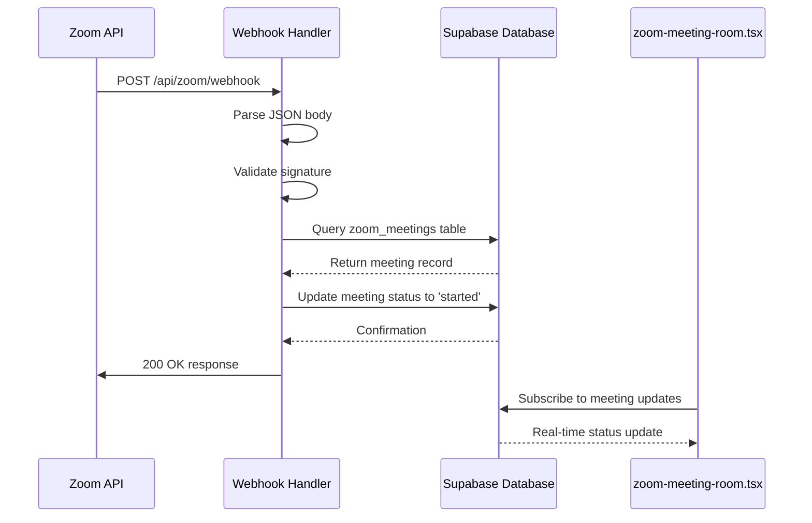
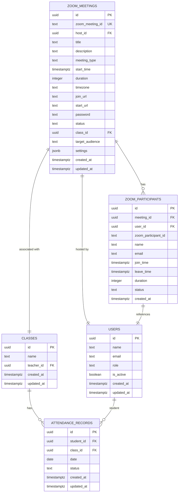
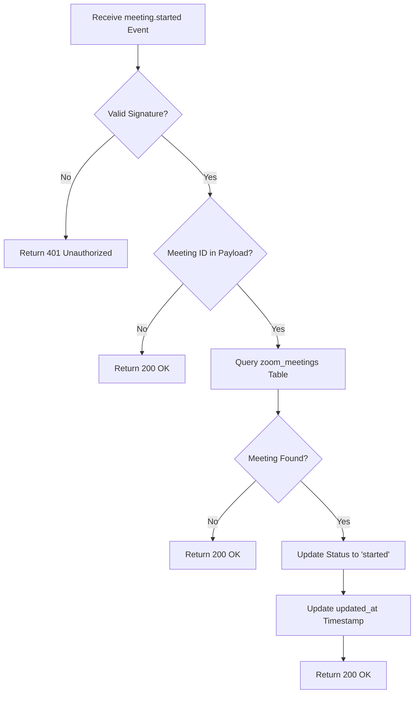

# Meeting Started Event

<cite>
**Referenced Files in This Document**   
- [webhook/route.ts](file://app/api/zoom/webhook/route.ts)
- [zoom-meeting-room.tsx](file://components/zoom-meeting-room.tsx)
- [create_zoom_meetings_table.sql](file://supabase/migrations/20260110000001_create_zoom_meetings_table.sql)
- [server.ts](file://lib/supabase/server.ts)
- [zoom-participants-section.tsx](file://components/zoom-participants-section.tsx)
</cite>

## Table of Contents
1. [Introduction](#introduction)
2. [Event Processing Flow](#event-processing-flow)
3. [Database Schema](#database-schema)
4. [Meeting Status Update](#meeting-status-update)
5. [Real-Time UI Integration](#real-time-ui-integration)
6. [Error Handling and Edge Cases](#error-handling-and-edge-cases)
7. [Zoom Lifecycle and Attendance Tracking](#zoom-lifecycle-and-attendance-tracking)
8. [Security and Authentication](#security-and-authentication)

## Introduction
The `meeting.started` webhook event is a critical component of the school management system's Zoom integration, enabling real-time synchronization between Zoom's meeting lifecycle and the application's attendance tracking system. This documentation details how the system receives, validates, and processes the `meeting.started` event, updates the meeting status in the database, and integrates with the frontend for real-time status updates. The process involves webhook validation, database operations using Supabase, and coordination with the application's attendance tracking system to ensure accurate student participation records.

## Event Processing Flow
The system processes the `meeting.started` webhook event through a well-defined sequence of operations that ensure data integrity and proper synchronization between Zoom and the application's database. The flow begins with receiving the webhook request and ends with updating the meeting status in the database.

**Diagram sources**
- [webhook/route.ts](file://app/api/zoom/webhook/route.ts#L17-L246)
- [zoom-meeting-room.tsx](file://components/zoom-meeting-room.tsx#L1-L254)

**Section sources**
- [webhook/route.ts](file://app/api/zoom/webhook/route.ts#L17-L246)

## Database Schema
The system uses a dedicated database schema to store Zoom meeting data and track participant attendance. The schema is designed to support the integration between Zoom's meeting lifecycle and the application's attendance tracking system.

**Diagram sources**
- [create_zoom_meetings_table.sql](file://supabase/migrations/20260110000001_create_zoom_meetings_table.sql#L2-L113)
- [create_attendance_tables.sql](file://supabase/migrations/20251219043454_create_attendance_tables.sql)

**Section sources**
- [create_zoom_meetings_table.sql](file://supabase/migrations/20260110000001_create_zoom_meetings_table.sql#L2-L113)

## Meeting Status Update
When the `meeting.started` event is received, the system updates the meeting status to 'started' in the database using Supabase. This operation is performed using an admin client that bypasses Row Level Security (RLS) policies, ensuring that the webhook can update the meeting record regardless of user permissions.

The database update operation uses the Supabase admin client to perform an atomic update on the `zoom_meetings` table, setting the `status` field to 'started' and updating the `updated_at` timestamp to the current ISO string. This ensures that the meeting status is synchronized with Zoom's state and that the update time is accurately recorded for auditing purposes.

**Section sources**
- [webhook/route.ts](file://app/api/zoom/webhook/route.ts#L84-L89)
- [server.ts](file://lib/supabase/server.ts#L36-L51)

## Real-Time UI Integration
The `zoom-meeting-room.tsx` component integrates with the meeting status updates to provide real-time feedback to users. The component subscribes to changes in the meeting record, allowing it to reflect the current status of the meeting in the user interface.

When a meeting starts, the component receives the updated status through Supabase's real-time subscriptions, which are enabled for the `zoom_meetings` table. This allows the component to update its state and render the appropriate UI elements, such as showing that the meeting is now active and participants can join.

The integration also includes error handling for cases where the Zoom SDK fails to load, providing a fallback option to open the meeting in the Zoom application directly. This ensures that users can still participate in the meeting even if the embedded SDK encounters issues.

**Section sources**
- [zoom-meeting-room.tsx](file://components/zoom-meeting-room.tsx#L1-L254)
- [webhook/route.ts](file://app/api/zoom/webhook/route.ts#L84-L89)

## Error Handling and Edge Cases
The system implements comprehensive error handling for the `meeting.started` event processing, addressing various edge cases and potential failure scenarios.

When an unknown meeting ID is received, the system returns a 200 OK response without taking any action. This prevents the webhook from being retried unnecessarily while ensuring that valid events are processed correctly. The system also validates the webhook signature before processing the event, rejecting requests with invalid signatures with a 401 Unauthorized response.

In the event of a database update failure, the system logs the error but continues processing. This graceful degradation ensures that a temporary database issue does not prevent the system from handling other webhook events. The error is logged for monitoring and debugging purposes, allowing administrators to investigate and resolve the underlying issue.

The system also handles cases where the meeting record cannot be found in the database, returning a 200 OK response to acknowledge receipt of the event without attempting to update a non-existent record. This prevents errors when Zoom sends events for meetings that were created outside the application or have been deleted.

**Section sources**
- [webhook/route.ts](file://app/api/zoom/webhook/route.ts#L78-L80)
- [webhook/route.ts](file://app/api/zoom/webhook/route.ts#L242-L244)

## Zoom Lifecycle and Attendance Tracking
The `meeting.started` event is part of a broader integration between Zoom's meeting lifecycle and the application's attendance tracking system. When a meeting starts, the system updates the meeting status to 'started', which serves as the starting point for tracking participant attendance.

As participants join the meeting, the system receives `meeting.participant_joined` events and creates or updates records in the `zoom_participants` table. When participants leave, either through `meeting.participant_left` events or when the meeting ends, the system calculates their attendance duration and updates their status accordingly.

When the meeting ends, the system processes final attendance, marking enrolled students who joined for at least 15 minutes as "present", those who joined but didn't stay long enough as "partial", and those who never joined as "absent". This comprehensive approach ensures accurate attendance records that reflect actual participation in the meeting.

The integration also supports real-time attendance tracking, allowing teachers and administrators to monitor who has joined the meeting as it progresses. This information is displayed in the `zoom-participants-section.tsx` component, providing a live view of meeting participation.

**Section sources**
- [webhook/route.ts](file://app/api/zoom/webhook/route.ts#L131-L240)
- [webhook/route.ts](file://app/api/zoom/webhook/route.ts#L285-L340)
- [zoom-participants-section.tsx](file://components/zoom-participants-section.tsx)

## Security and Authentication
The system implements robust security measures to protect the webhook endpoint and ensure that only legitimate events from Zoom are processed. The webhook handler validates the signature of each incoming request using a shared secret, preventing unauthorized access to the endpoint.

The system uses a Supabase admin client with service role privileges to update meeting records, bypassing Row Level Security policies. This is necessary for the webhook to function correctly, as it operates outside the context of a specific user session. The service role key is stored securely in environment variables and is required for the admin client to be created.

Row Level Security policies are enforced on the `zoom_meetings` table, ensuring that only authorized users can view, create, update, or delete meeting records through the application's API. These policies consider the user's role, the meeting host, and the target audience when determining access permissions.

The system also implements rate limiting and other security hardening measures, as indicated by the migration files in the codebase. These measures protect against abuse and ensure the stability and security of the webhook endpoint.

**Section sources**
- [webhook/route.ts](file://app/api/zoom/webhook/route.ts#L47-L62)
- [server.ts](file://lib/supabase/server.ts#L36-L51)
- [create_zoom_meetings_table.sql](file://supabase/migrations/20260110000001_create_zoom_meetings_table.sql#L51-L92)