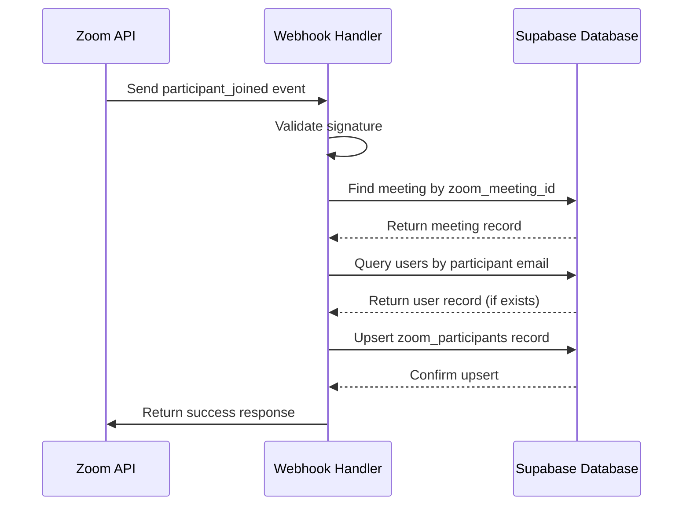
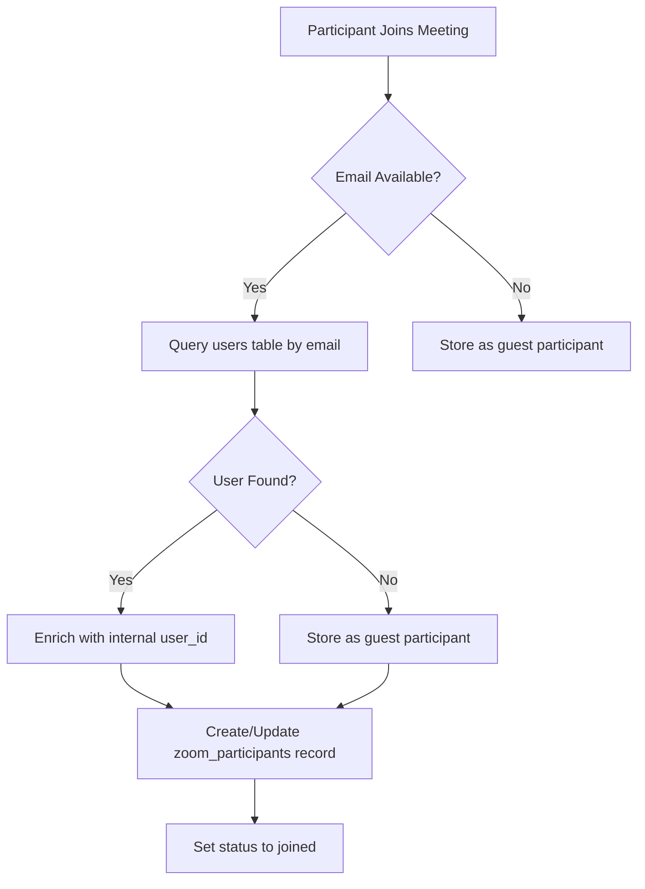
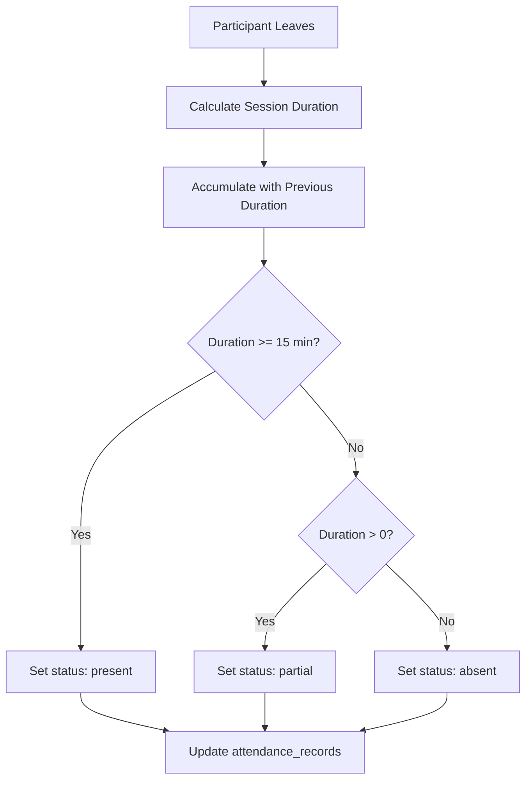
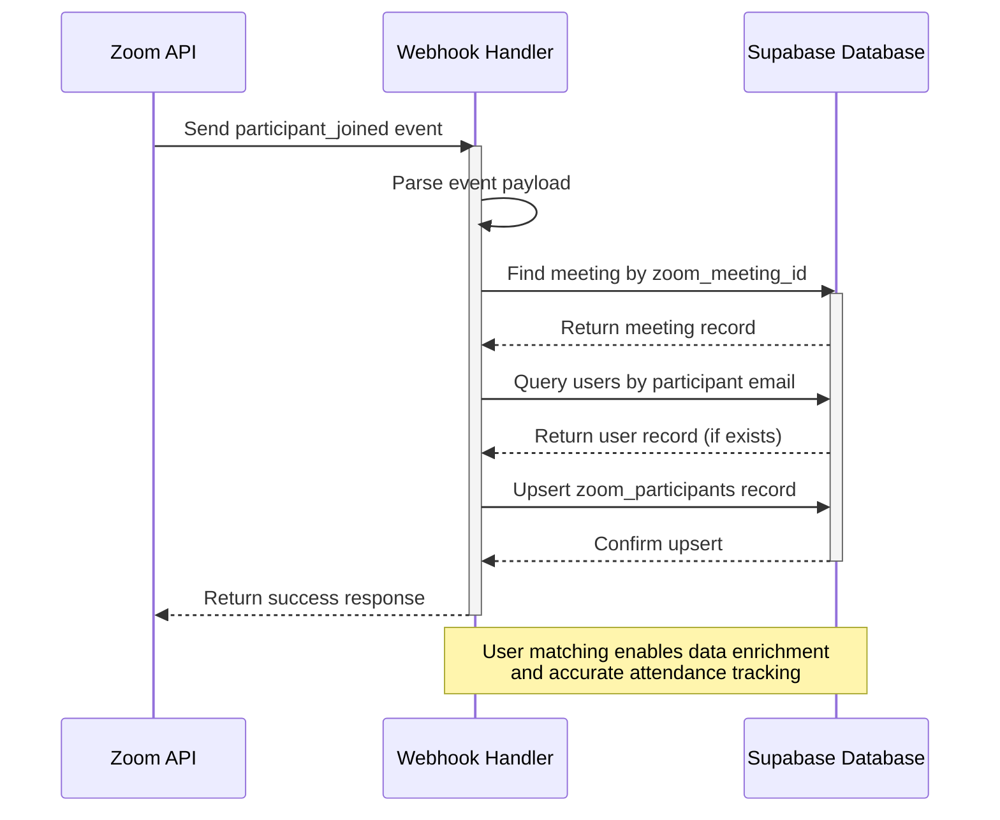

# Participant Joined Event

<cite>
**Referenced Files in This Document**   
- [route.ts](file://app/api/zoom/webhook/route.ts)
- [create_zoom_meetings_table.sql](file://supabase/migrations/20260110023523_create_zoom_meetings_table.sql)
- [create_attendance_tables.sql](file://supabase/migrations/20251219043454_create_attendance_tables.sql)
- [add_partial_attendance_status.sql](file://supabase/migrations/20260110102108_add_partial_attendance_status.sql)
- [participants/route.ts](file://app/api/zoom/meetings/[id]/participants/route.ts)
- [zoom-participants-section.tsx](file://components/zoom-participants-section.tsx)
</cite>

## Table of Contents
1. [Introduction](#introduction)
2. [Event Processing Flow](#event-processing-flow)
3. [Participant Data Capture](#participant-data-capture)
4. [User Matching and Data Enrichment](#user-matching-and-data-enrichment)
5. [Upsert Operation and Conflict Handling](#upsert-operation-and-conflict-handling)
6. [Edge Cases and Special Scenarios](#edge-cases-and-special-scenarios)
7. [Attendance Integration and Duration Calculations](#attendance-integration-and-duration-calculations)
8. [Data Model Overview](#data-model-overview)
9. [Sequence Diagram](#sequence-diagram)

## Introduction
The `meeting.participant_joined` webhook event is a critical component of the school management system's attendance tracking functionality. This document details how the system captures participant data when a user joins a Zoom meeting, matches it with existing users in the database, and updates attendance records accordingly. The process involves capturing participant metadata, matching users by email, enriching data through database lookups, and maintaining accurate attendance records through upsert operations with conflict resolution.

## Event Processing Flow
The system processes the `meeting.participant_joined` event through a webhook handler that validates the request, authenticates the source, and routes the event to the appropriate handler. When a participant joins a meeting, Zoom sends a webhook notification containing participant details including user_id, user_name, email, and join_time. The system processes this event by first verifying the webhook signature, then extracting the meeting context, and finally updating the participant records in the database.



**Diagram sources**
- [route.ts](file://app/api/zoom/webhook/route.ts#L17-L246)

**Section sources**
- [route.ts](file://app/api/zoom/webhook/route.ts#L17-L246)

## Participant Data Capture
When a participant joins a Zoom meeting, the system captures the following data from the webhook payload:
- **user_id**: Unique identifier assigned by Zoom to the participant
- **user_name**: Display name of the participant as shown in Zoom
- **email**: Email address associated with the participant's Zoom account
- **join_time**: Timestamp when the participant joined the meeting in ISO 8601 format

The system extracts this information from the `event.payload.object.participant` object in the webhook request. The join_time is captured directly from Zoom's event data and stored in the database as a TIMESTAMPTZ field, preserving the exact moment the participant joined the meeting.

**Section sources**
- [route.ts](file://app/api/zoom/webhook/route.ts#L132-L148)

## User Matching and Data Enrichment
The system attempts to match incoming participants with existing users in the database by email address. This matching process is critical for data enrichment and accurate attendance tracking:

1. The system queries the `users` table using the participant's email address from the webhook payload
2. If a matching user is found, their internal `user_id` is retrieved and used to enrich the participant record
3. The `user_id` field in the `zoom_participants` table is populated with the internal user identifier
4. If no matching user is found, the `user_id` field remains null, and the participant is tracked as a guest

This process ensures that registered users are properly identified and their attendance is linked to their internal user record, while still allowing tracking of guest participants who may not have accounts in the system.



**Diagram sources**
- [route.ts](file://app/api/zoom/webhook/route.ts#L135-L140)

**Section sources**
- [route.ts](file://app/api/zoom/webhook/route.ts#L134-L140)

## Upsert Operation and Conflict Handling
The system uses an upsert operation to insert or update participant records in the `zoom_participants` table. This approach ensures data consistency and prevents duplicate records:

- **Target Table**: `zoom_participants`
- **Conflict Constraint**: Composite key on `meeting_id` and `user_id`
- **Update Behavior**: When a conflict occurs, existing record is updated with new values
- **Insert Behavior**: When no conflict exists, a new record is created

The upsert operation includes the following fields:
- `meeting_id`: References the specific meeting instance
- `user_id`: Internal user identifier (null for guests)
- `zoom_participant_id`: Zoom's unique identifier for the participant
- `name`: Participant's display name
- `email`: Participant's email address
- `join_time`: Timestamp of when the participant joined
- `status`: Set to "joined" upon entry

This design ensures that if a participant leaves and rejoins the same meeting, their record is updated rather than creating a duplicate entry, maintaining accurate join_time and duration calculations.

**Section sources**
- [route.ts](file://app/api/zoom/webhook/route.ts#L141-L151)
- [create_zoom_meetings_table.sql](file://supabase/migrations/20260110023523_create_zoom_meetings_table.sql#L24-L37)

## Edge Cases and Special Scenarios
The system handles several edge cases related to participant tracking:

### Participants Without Email Addresses
When participants join without providing an email address:
- The `email` field is stored as null
- User matching is not possible
- The participant is treated as a guest
- Attendance records are not created for these participants
- They are still counted in meeting participation statistics

### Multiple Join/Leave Events
The system accumulates duration across multiple join/leave events for the same participant:
- When a participant leaves, their session duration is calculated
- This duration is added to any previous duration in the record
- The total accumulated duration is used for attendance calculations
- This prevents participants from gaming the system by repeatedly joining and leaving

### Guest Participants
Guest participants (those without matching user accounts) are handled as follows:
- They are tracked in the `zoom_participants` table
- Their `user_id` field remains null
- They do not generate attendance records
- They are included in meeting analytics and participation counts

**Section sources**
- [route.ts](file://app/api/zoom/webhook/route.ts#L135-L140)
- [route.ts](file://app/api/zoom/webhook/route.ts#L158-L238)

## Attendance Integration and Duration Calculations
The participant joined event is integrated with the attendance system through duration-based calculations:

- **Minimum Duration Threshold**: 15 minutes (900 seconds) to count as "present"
- **Duration Accumulation**: Time is accumulated across multiple join/leave events
- **Attendance Status**: Determined when meeting ends or participant leaves
- **Status Values**: "present" (≥15 minutes), "partial" (>0 but <15 minutes), "absent" (never joined)

When a participant leaves a meeting or when the meeting ends, the system calculates their total duration in the meeting. This duration is used to determine their attendance status, which is then recorded in the `attendance_records` table. The join_time captured during the participant_joined event is essential for accurate duration calculations.



**Diagram sources**
- [route.ts](file://app/api/zoom/webhook/route.ts#L254-L283)
- [add_partial_attendance_status.sql](file://supabase/migrations/20260110102108_add_partial_attendance_status.sql#L1-L4)

**Section sources**
- [route.ts](file://app/api/zoom/webhook/route.ts#L254-L283)
- [add_partial_attendance_status.sql](file://supabase/migrations/20260110102108_add_partial_attendance_status.sql#L1-L4)

## Data Model Overview
The system uses several related tables to track meeting participants and attendance:

```mermaid
erDiagram
ZOOM_MEETINGS {
UUID id PK
TEXT zoom_meeting_id UK
UUID host_id FK
TEXT title
TIMESTAMPTZ start_time
TEXT status
UUID class_id FK
}
USERS {
UUID id PK
TEXT email UK
TEXT name
TEXT role
}
ZOOM_PARTICIPANTS {
UUID id PK
UUID meeting_id FK
UUID user_id FK
TEXT zoom_participant_id
TEXT name
TEXT email
TIMESTAMPTZ join_time
TIMESTAMPTZ leave_time
INTEGER duration
TEXT status
composite: meeting_id, user_id UK
}
ATTENDANCE_RECORDS {
UUID id PK
UUID student_id FK
UUID class_id FK
DATE date
TEXT status
composite: student_id, class_id, date UK
}
ZOOM_MEETINGS ||--o{ ZOOM_PARTICIPANTS : "contains"
USERS ||--o{ ZOOM_PARTICIPANTS : "has"
ZOOM_MEETINGS }|--|| CLASSES : "scheduled for"
USERS ||--o{ ATTENDANCE_RECORDS : "has"
CLASSES ||--o{ ATTENDANCE_RECORDS : "has"
```

**Diagram sources**
- [create_zoom_meetings_table.sql](file://supabase/migrations/20260110023523_create_zoom_meetings_table.sql#L2-L37)
- [create_attendance_tables.sql](file://supabase/migrations/20251219043454_create_attendance_tables.sql#L1-L8)
- [add_partial_attendance_status.sql](file://supabase/migrations/20260110102108_add_partial_attendance_status.sql#L1-L4)

**Section sources**
- [create_zoom_meetings_table.sql](file://supabase/migrations/20260110023523_create_zoom_meetings_table.sql#L2-L37)
- [create_attendance_tables.sql](file://supabase/migrations/20251219043454_create_attendance_tables.sql#L1-L8)

## Sequence Diagram
The complete sequence of operations when a participant joins a meeting:



**Diagram sources**
- [route.ts](file://app/api/zoom/webhook/route.ts#L131-L153)

**Section sources**
- [route.ts](file://app/api/zoom/webhook/route.ts#L131-L153)