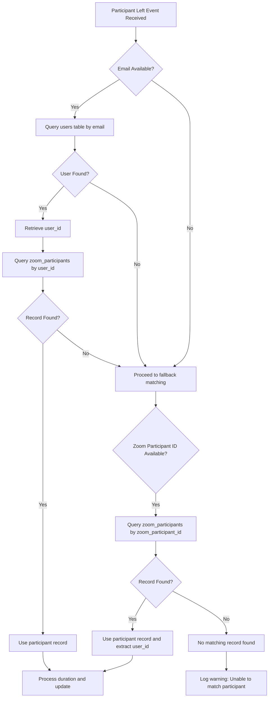
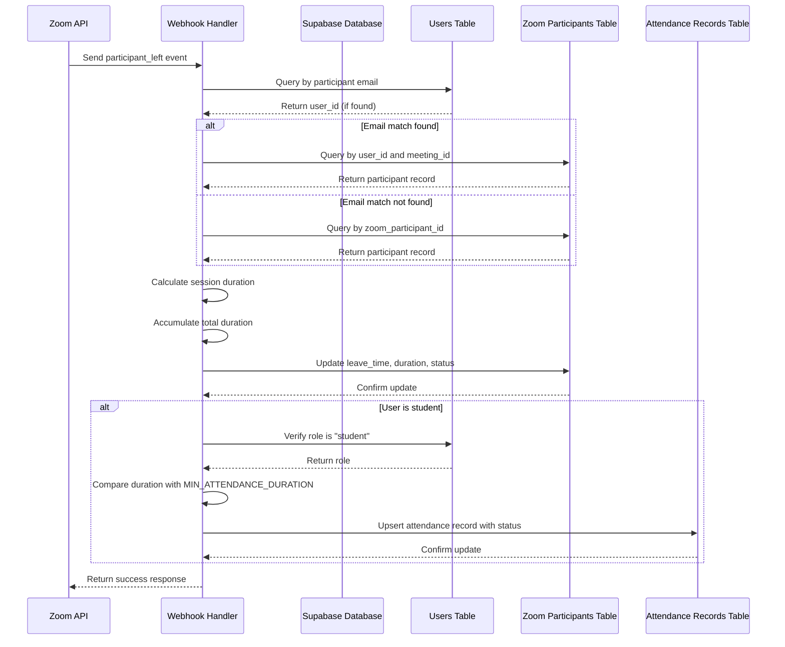

# Participant Left Event

<cite>
**Referenced Files in This Document**   
- [webhook/route.ts](file://app/api/zoom/webhook/route.ts)
- [zoom_meetings_table.sql](file://supabase/migrations/20260110000001_create_zoom_meetings_table.sql)
- [meeting_registrants_table.sql](file://supabase/migrations/20260110000002_create_meeting_registrants_table.sql)
- [add_partial_attendance_status.sql](file://supabase/migrations/20260110102108_add_partial_attendance_status.sql)
- [join/route.ts](file://app/api/zoom/meetings/[id]/join/route.ts)
- [participants/route.ts](file://app/api/zoom/meetings/[id]/participants/route.ts)
</cite>

## Table of Contents
1. [Introduction](#introduction)
2. [Participant Matching Process](#participant-matching-process)
3. [Duration Calculation and Accumulation](#duration-calculation-and-accumulation)
4. [Zoom Participants Table Update](#zoom-participants-table-update)
5. [Student Attendance Status Determination](#student-attendance-status-determination)
6. [Error Handling and Data Consistency](#error-handling-and-data-consistency)
7. [Sequence Diagram](#sequence-diagram)

## Introduction
This document details the processing of the `meeting.participant_left` webhook event in the School Management System. The system integrates with Zoom to track meeting attendance for educational purposes, particularly for class sessions. When a participant leaves a Zoom meeting, the system processes this event to update attendance records, calculate session duration, and determine student attendance status based on their participation time.

The webhook event processing follows a structured approach to ensure accurate tracking of participant engagement, with special consideration for students who may join and leave multiple times during a single session. The system implements a robust participant matching mechanism, duration calculation, and conditional attendance status updates based on predefined thresholds.

**Section sources**
- [webhook/route.ts](file://app/api/zoom/webhook/route.ts#L155-L244)

## Participant Matching Process
The system employs a two-step participant matching process to accurately identify and update the correct participant record when a `meeting.participant_left` event is received. This approach ensures reliable identification even when participant information varies between join and leave events.

### Primary Matching by Email
The first matching attempt uses the participant's email address to find the corresponding user in the system. The process follows these steps:
1. Extract the email from the `leftParticipant` object in the webhook payload
2. Query the `users` table to find a matching user record by email
3. If a user is found, retrieve their `user_id`
4. Use the `user_id` to find the corresponding participant record in the `zoom_participants` table for the current meeting

This email-based matching is the preferred method as it provides the most reliable user identification, linking the Zoom participant directly to the school's user system.

### Fallback Matching by Zoom Participant ID
If email-based matching fails, the system implements a fallback mechanism using the Zoom participant ID:
1. Check if the `user_id` field is present in the `leftParticipant` object
2. Query the `zoom_participants` table using the `zoom_participant_id` field
3. Retrieve the participant record and extract the associated `user_id`

This fallback mechanism handles scenarios where email information might not be available or consistent between join and leave events, ensuring that participant tracking remains robust across various Zoom integration scenarios.



**Diagram sources**
- [webhook/route.ts](file://app/api/zoom/webhook/route.ts#L164-L197)

**Section sources**
- [webhook/route.ts](file://app/api/zoom/webhook/route.ts#L160-L197)

## Duration Calculation and Accumulation
The system calculates and accumulates session duration for participants who may join and leave multiple times during a single meeting session. This approach ensures accurate tracking of total participation time.

### Session Duration Calculation
When a participant leaves, the system calculates the duration of their current session by:
1. Comparing the `leave_time` from the webhook event with the `join_time` stored in the participant record
2. Computing the difference in seconds between these timestamps
3. Using the current timestamp as `leave_time` if it's not provided in the webhook payload

The calculation uses JavaScript's Date object to convert timestamps to milliseconds, then divides by 1000 to obtain seconds:
```
sessionDuration = (leaveTime.getTime() - join_time.getTime()) / 1000
```

### Duration Accumulation
To handle participants who join and leave multiple times, the system accumulates duration across sessions:
1. Retrieve the existing `duration` value from the participant record (defaulting to 0 if null)
2. Add the current session duration to the accumulated duration
3. Store the total as the new `duration` value

This accumulation ensures that students who temporarily disconnect and reconnect are credited for their total participation time rather than just their final continuous session.

**Section sources**
- [webhook/route.ts](file://app/api/zoom/webhook/route.ts#L200-L209)

## Zoom Participants Table Update
When a participant leaves a meeting, the system updates the corresponding record in the `zoom_participants` table with the latest information to maintain accurate attendance tracking.

### Updated Fields
The following fields are updated in the `zoom_participants` table:
- **leave_time**: Set to the timestamp when the participant left (from webhook or current time)
- **duration**: Updated to the accumulated total duration of all sessions
- **status**: Changed from "joined" to "left" to reflect the participant's current state

### Database Schema
The `zoom_participants` table structure supports comprehensive attendance tracking:

| Column | Type | Description |
|-------|------|-------------|
| id | UUID | Primary key |
| meeting_id | UUID | Foreign key to zoom_meetings |
| user_id | UUID | Foreign key to users (nullable) |
| zoom_participant_id | TEXT | Zoom's participant identifier |
| name | TEXT | Participant's name |
| email | TEXT | Participant's email |
| join_time | TIMESTAMPTZ | When participant joined |
| leave_time | TIMESTAMPTZ | When participant left |
| duration | INTEGER | Total duration in seconds |
| status | TEXT | Participant status (invited, joined, left) |

The table includes a unique constraint on `meeting_id` and `user_id` to prevent duplicate records for the same user in a meeting.

**Section sources**
- [zoom_meetings_table.sql](file://supabase/migrations/20260110000001_create_zoom_meetings_table.sql#L24-L37)
- [webhook/route.ts](file://app/api/zoom/webhook/route.ts#L211-L218)

## Student Attendance Status Determination
For students participating in class meetings, the system determines their attendance status based on their total participation duration, using a threshold to differentiate between "present" and "partial" attendance.

### Minimum Attendance Duration
The system defines a minimum threshold for full attendance:
```typescript
const MIN_ATTENDANCE_DURATION = 15 * 60 // 15 minutes in seconds
```

This threshold determines whether a student is marked as "present" or "partial" in the attendance records.

### Conditional Attendance Update
When a student leaves a meeting, the system conditionally updates their attendance status:
1. Verify the participant is a student by checking their role in the `users` table
2. Compare the total accumulated duration against `MIN_ATTENDANCE_DURATION`
3. Set the attendance status accordingly:
   - **present**: If duration ≥ 15 minutes
   - **partial**: If duration > 0 but < 15 minutes

The attendance status is stored in the `attendance_records` table, which was updated to include the "partial" status option through a migration that modified the status check constraint to include 'partial' as a valid value.

**Section sources**
- [webhook/route.ts](file://app/api/zoom/webhook/route.ts#L221-L237)
- [add_partial_attendance_status.sql](file://supabase/migrations/20260110102108_add_partial_attendance_status.sql#L1-L3)

## Error Handling and Data Consistency
The system implements comprehensive error handling and data consistency measures to ensure reliable processing of participant left events.

### Error Handling
The webhook handler wraps the entire event processing in a try-catch block to prevent failures from disrupting the overall system:
```typescript
try {
  // Event processing logic
} catch (error) {
  console.error("Error processing webhook:", error)
}
```

This approach ensures that even if an individual event fails to process, the webhook can still acknowledge receipt and continue processing subsequent events.

### Data Consistency
Several mechanisms ensure data consistency:
1. **Atomic Updates**: Database updates are performed as single operations to prevent partial updates
2. **Fallback Matching**: The two-step participant matching process increases the likelihood of correctly identifying participants
3. **Null Safety**: The system handles potential null values in timestamps and duration fields
4. **Idempotent Design**: The use of upsert operations and unique constraints prevents duplicate records

The system also includes validation checks, such as verifying the webhook signature for security and confirming the meeting exists in the database before processing.

**Section sources**
- [webhook/route.ts](file://app/api/zoom/webhook/route.ts#L242-L244)

## Sequence Diagram
The following sequence diagram illustrates the complete flow of processing a `meeting.participant_left` webhook event:



**Diagram sources**
- [webhook/route.ts](file://app/api/zoom/webhook/route.ts#L155-L244)