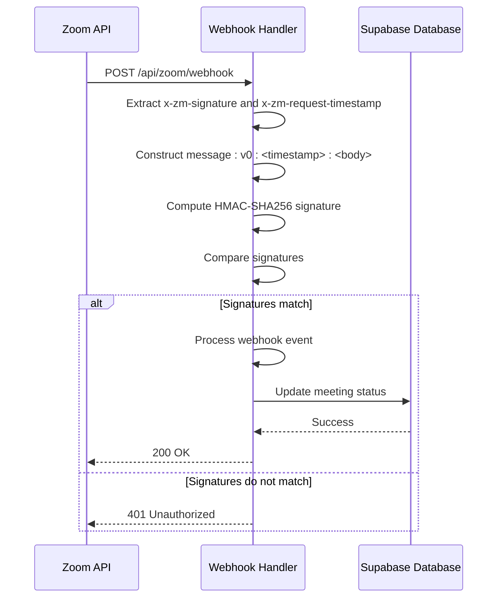
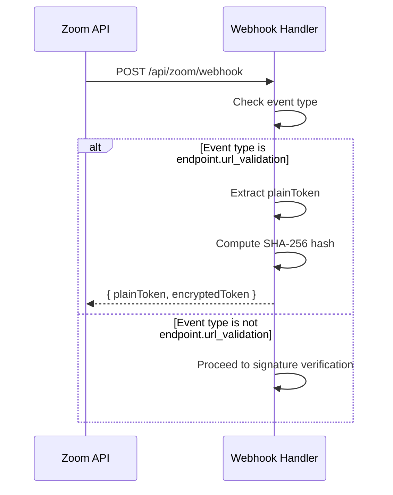
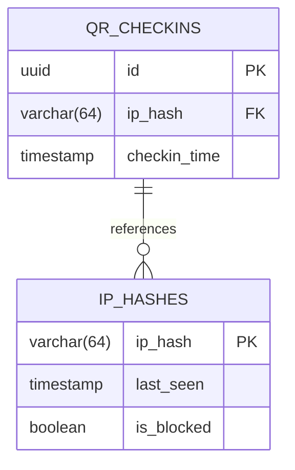
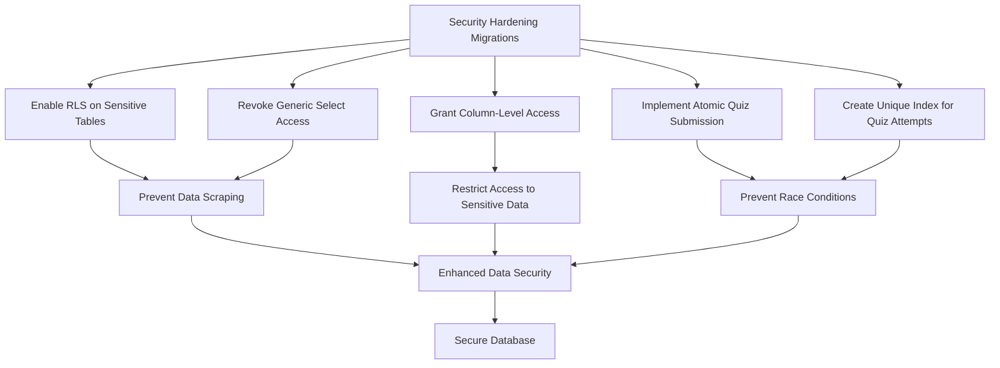

# Security Implementation

<cite>
**Referenced Files in This Document**   
- [app/api/zoom/webhook/route.ts](file://app/api/zoom/webhook/route.ts)
- [lib/security.ts](file://lib/security.ts)
- [supabase/migrations/20260110125232_hash_ip_addresses.sql](file://supabase/migrations/20260110125232_hash_ip_addresses.sql)
- [supabase/migrations/20260101070358_security_hardening.sql](file://supabase/migrations/20260101070358_security_hardening.sql)
- [supabase/migrations/20250228_security_hardening.sql](file://supabase/migrations/20250228_security_hardening.sql)
- [SECURITY.md](file://SECURITY.md)
</cite>

## Table of Contents
1. [Introduction](#introduction)
2. [Zoom Webhook Security Implementation](#zoom-webhook-security-implementation)
3. [HMAC-SHA256 Signature Verification](#hmac-sha256-signature-verification)
4. [URL Validation Challenge Handling](#url-validation-challenge-handling)
5. [Database-Level Security Measures](#database-level-security-measures)
6. [Environment Variable Protection](#environment-variable-protection)
7. [Error Handling and Information Leakage Prevention](#error-handling-and-information-leakage-prevention)
8. [Best Practices for Webhook Endpoint Security](#best-practices-for-webhook-endpoint-security)
9. [Secret Rotation and Access Monitoring](#secret-rotation-and-access-monitoring)
10. [Security Hardening Migrations](#security-hardening-migrations)

## Introduction
This document details the security implementation for the Zoom webhook integration in the School Management System. The system implements a multi-layered security approach to ensure the integrity and authenticity of webhook events from Zoom, protect sensitive data, and prevent unauthorized access. The security measures include HMAC-SHA256 signature verification, proper handling of URL validation challenges, IP address hashing in the database, environment variable protection, and robust error handling to prevent information leakage. This documentation also covers best practices for securing webhook endpoints, rotating secrets, and monitoring unauthorized access attempts.

## Zoom Webhook Security Implementation
The Zoom webhook security implementation is designed to verify the authenticity of incoming webhook events from Zoom and protect the system from unauthorized access and data breaches. The implementation is centered around the webhook handler located in `app/api/zoom/webhook/route.ts`, which processes events from Zoom such as meeting start, end, participant join, and participant leave. The security measures are implemented in a specific order to ensure that the system is protected against various types of attacks, including replay attacks, spoofing, and unauthorized access.

The webhook handler first checks for the URL validation challenge, which is a special event sent by Zoom to validate the webhook endpoint. This challenge must be handled before any signature verification is performed. After the URL validation challenge is handled, the system proceeds to verify the HMAC-SHA256 signature of the webhook event using the `x-zm-signature` and `x-zm-request-timestamp` headers. The signature verification ensures that the event was sent by Zoom and has not been tampered with during transmission.

**Section sources**
- [app/api/zoom/webhook/route.ts](file://app/api/zoom/webhook/route.ts#L1-L342)

## HMAC-SHA256 Signature Verification
The HMAC-SHA256 signature verification is a critical component of the Zoom webhook security implementation. It ensures that the webhook events received by the system are authentic and have not been modified in transit. The verification process uses the `x-zm-signature` and `x-zm-request-timestamp` headers provided by Zoom, along with the `ZOOM_WEBHOOK_SECRET` environment variable, to compute a signature that is compared against the one provided in the request.

The signature verification process follows these steps:
1. Extract the `x-zm-signature` and `x-zm-request-timestamp` headers from the incoming request.
2. Construct a message string in the format `v0:<timestamp>:<body>`, where `<timestamp>` is the value of the `x-zm-request-timestamp` header and `<body>` is the raw request body.
3. Compute the HMAC-SHA256 hash of the message using the `ZOOM_WEBHOOK_SECRET` as the key.
4. Compare the computed signature with the one provided in the `x-zm-signature` header.

If the signatures match, the webhook event is considered authentic and is processed further. If the signatures do not match, the request is rejected with a 401 Unauthorized status code. This process prevents replay attacks and ensures that only legitimate events from Zoom are processed by the system.

**Diagram sources**
- [app/api/zoom/webhook/route.ts](file://app/api/zoom/webhook/route.ts#L47-L62)

**Section sources**
- [app/api/zoom/webhook/route.ts](file://app/api/zoom/webhook/route.ts#L47-L62)

## URL Validation Challenge Handling
The URL validation challenge handling is a crucial step in the Zoom webhook security implementation. Before any signature verification is performed, the system must handle the URL validation challenge, which is a special event sent by Zoom to validate the webhook endpoint. This challenge ensures that the webhook endpoint is active and can receive events from Zoom.

The URL validation challenge is handled as follows:
1. When a webhook event with the event type `endpoint.url_validation` is received, the system extracts the `plainToken` from the event payload.
2. The system computes a SHA-256 hash of the `plainToken` using the `ZOOM_WEBHOOK_SECRET` as the key.
3. The system returns a JSON response containing the `plainToken` and the computed `encryptedToken`.

This process verifies that the webhook endpoint is correctly configured and can receive events from Zoom. It also ensures that the `ZOOM_WEBHOOK_SECRET` is correctly set up and can be used for signature verification. The URL validation challenge must be handled before any signature verification is performed to prevent potential security vulnerabilities.

**Diagram sources**
- [app/api/zoom/webhook/route.ts](file://app/api/zoom/webhook/route.ts#L29-L45)

**Section sources**
- [app/api/zoom/webhook/route.ts](file://app/api/zoom/webhook/route.ts#L29-L45)

## Database-Level Security Measures
The system implements several database-level security measures to protect sensitive data and prevent unauthorized access. One of the key measures is the hashing of IP addresses in the database, which is evident from the migration file `supabase/migrations/20260110125232_hash_ip_addresses.sql`. This migration adds a new `ip_hash` column to the `qr_checkins` table and creates an index for efficient lookups on hashed IPs. The `ip_hash` column stores the SHA-256 hash of the client IP address, which allows for privacy-preserving abuse detection while still enabling the system to identify and block malicious activity.

The use of hashed IP addresses provides several security benefits:
- **Privacy Protection**: Raw IP addresses are not stored in the database, which protects user privacy and complies with data protection regulations.
- **Abuse Detection**: The system can still detect and block abusive behavior by comparing hashed IP addresses, even though the raw IP addresses are not stored.
- **Data Minimization**: The system only stores the minimum amount of data necessary for its operation, which reduces the risk of data breaches.

In addition to IP address hashing, the system also implements Row Level Security (RLS) policies on all database tables to ensure that users can only access data that they are authorized to view. These policies are defined in various migration files, such as `supabase/migrations/20250228_security_hardening.sql`, and are enforced by the database engine.

**Diagram sources**
- [supabase/migrations/20260110125232_hash_ip_addresses.sql](file://supabase/migrations/20260110125232_hash_ip_addresses.sql#L1-L13)

**Section sources**
- [supabase/migrations/20260110125232_hash_ip_addresses.sql](file://supabase/migrations/20260110125232_hash_ip_addresses.sql#L1-L13)
- [lib/security.ts](file://lib/security.ts#L11-L14)

## Environment Variable Protection
The system protects sensitive configuration data by storing it in environment variables, which are not committed to the code repository. The `ZOOM_WEBHOOK_SECRET` is one such environment variable that is used for HMAC-SHA256 signature verification. This secret is never exposed in the code and is only accessible at runtime through the environment.

The use of environment variables for sensitive data provides several security benefits:
- **Secret Isolation**: Sensitive data is isolated from the codebase, which reduces the risk of accidental exposure.
- **Configuration Management**: Environment variables can be easily managed and updated without modifying the code.
- **Access Control**: Access to environment variables can be restricted to authorized personnel, which reduces the risk of unauthorized access.

The system also uses other environment variables for Zoom API credentials, such as `ZOOM_ACCOUNT_ID`, `ZOOM_CLIENT_ID`, and `ZOOM_CLIENT_SECRET`, which are used for server-to-server OAuth authentication. These credentials are also protected by storing them in environment variables and are never exposed in the code.

**Section sources**
- [app/api/zoom/webhook/route.ts](file://app/api/zoom/webhook/route.ts#L19)
- [lib/zoom/client.ts](file://lib/zoom/client.ts#L26-L28)

## Error Handling and Information Leakage Prevention
The system implements robust error handling to prevent information leakage and ensure that sensitive data is not exposed in error messages. When an error occurs, the system logs the error details for debugging purposes but returns a generic error message to the client. This prevents attackers from gaining insights into the system's internal workings and reduces the risk of information leakage.

For example, when an invalid webhook signature is detected, the system logs the details of the signature mismatch but returns a generic "Invalid signature" error message to the client. Similarly, when an invalid JSON payload is received, the system logs the error but returns a generic "Invalid JSON" error message. This approach ensures that the system remains secure even in the event of an error.

The system also uses generic error messages to prevent user enumeration attacks, where an attacker could use error messages to determine the existence of specific users or resources. By returning the same error message for all invalid requests, the system makes it more difficult for attackers to gather information about the system.

**Section sources**
- [app/api/zoom/webhook/route.ts](file://app/api/zoom/webhook/route.ts#L58-L61)
- [SECURITY.md](file://SECURITY.md#L18)

## Best Practices for Webhook Endpoint Security
The system follows several best practices for securing webhook endpoints, including:
- **Signature Verification**: The system verifies the HMAC-SHA256 signature of all incoming webhook events to ensure their authenticity.
- **URL Validation Challenge Handling**: The system handles the URL validation challenge before performing any signature verification to ensure that the webhook endpoint is correctly configured.
- **Environment Variable Protection**: Sensitive data, such as the `ZOOM_WEBHOOK_SECRET`, is stored in environment variables and is never exposed in the code.
- **Error Handling**: The system uses generic error messages to prevent information leakage and ensure that sensitive data is not exposed in error responses.
- **Rate Limiting**: The system implements rate limiting to prevent abuse and ensure that the webhook endpoint is not overwhelmed by excessive requests.
- **IP Address Hashing**: The system hashes IP addresses in the database to protect user privacy while still enabling abuse detection.

These best practices ensure that the webhook endpoint is secure and resilient against various types of attacks, including replay attacks, spoofing, and unauthorized access.

**Section sources**
- [app/api/zoom/webhook/route.ts](file://app/api/zoom/webhook/route.ts)
- [SECURITY.md](file://SECURITY.md)

## Secret Rotation and Access Monitoring
The system supports secret rotation and access monitoring to ensure that sensitive data remains secure over time. The `ZOOM_WEBHOOK_SECRET` can be rotated periodically to reduce the risk of compromise, and the system will continue to function as long as the new secret is updated in the environment variables. This allows for regular secret rotation without disrupting the system's operation.

The system also monitors access to the webhook endpoint and logs all incoming requests for auditing purposes. This enables administrators to detect and respond to unauthorized access attempts and ensures that the system remains secure over time. The logs include information such as the timestamp, IP address, and event type, which can be used to investigate suspicious activity.

In addition to access monitoring, the system also implements rate limiting to prevent abuse and ensure that the webhook endpoint is not overwhelmed by excessive requests. The rate limiting is implemented at the database level using atomic RPC functions, which ensures that the system remains responsive even under heavy load.

**Section sources**
- [SECURITY.md](file://SECURITY.md#L26-L28)
- [supabase/migrations/20260101070358_security_hardening.sql](file://supabase/migrations/20260101070358_security_hardening.sql)

## Security Hardening Migrations
The system includes several security hardening migrations that enhance the security of the database and prevent common vulnerabilities. These migrations are located in the `supabase/migrations/` directory and are applied during the database setup process.

One of the key security hardening migrations is `supabase/migrations/20250228_security_hardening.sql`, which enables Row Level Security (RLS) on sensitive tables such as `users`, `grades`, `quiz_attempts`, and `attendance_records`. This migration also revokes generic select access to prevent data scraping and grants column-level access only to safe fields for authenticated users. This ensures that users can only access data that they are authorized to view and prevents unauthorized access to sensitive information.

Another important migration is `supabase/migrations/20260101070358_security_hardening.sql`, which implements atomic quiz submission to prevent race conditions and ensure data integrity. This migration creates a unique index on the `quiz_attempts` table to prevent duplicate completed attempts and defines an atomic RPC function for quiz submission that locks the row for update to prevent concurrent modifications.

These security hardening migrations ensure that the database is secure and resilient against various types of attacks, including data scraping, unauthorized access, and race conditions.

**Diagram sources**
- [supabase/migrations/20250228_security_hardening.sql](file://supabase/migrations/20250228_security_hardening.sql#L1-L94)
- [supabase/migrations/20260101070358_security_hardening.sql](file://supabase/migrations/20260101070358_security_hardening.sql#L1-L50)

**Section sources**
- [supabase/migrations/20250228_security_hardening.sql](file://supabase/migrations/20250228_security_hardening.sql#L1-L94)
- [supabase/migrations/20260101070358_security_hardening.sql](file://supabase/migrations/20260101070358_security_hardening.sql#L1-L50)