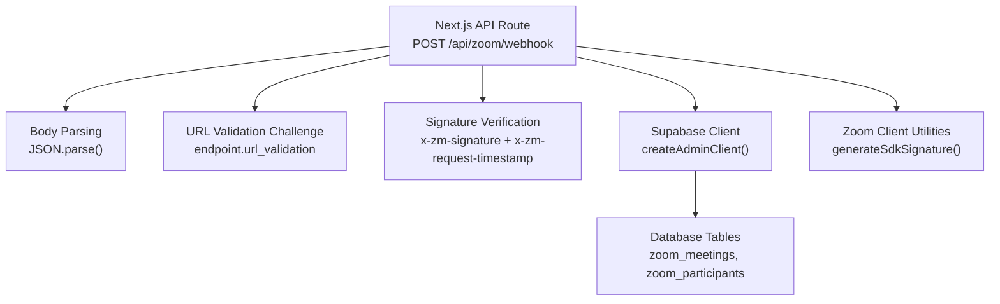
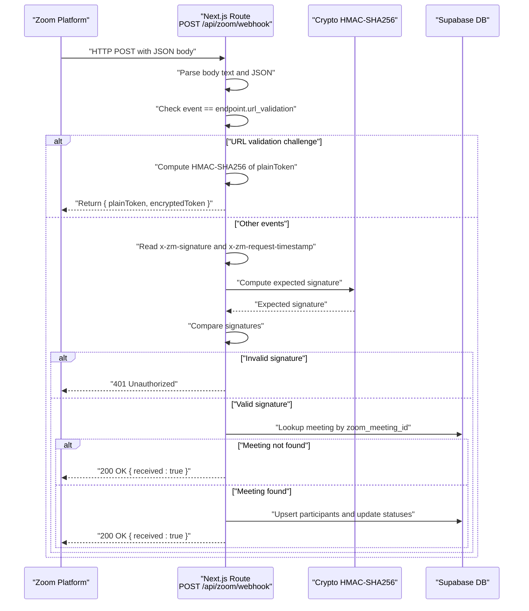
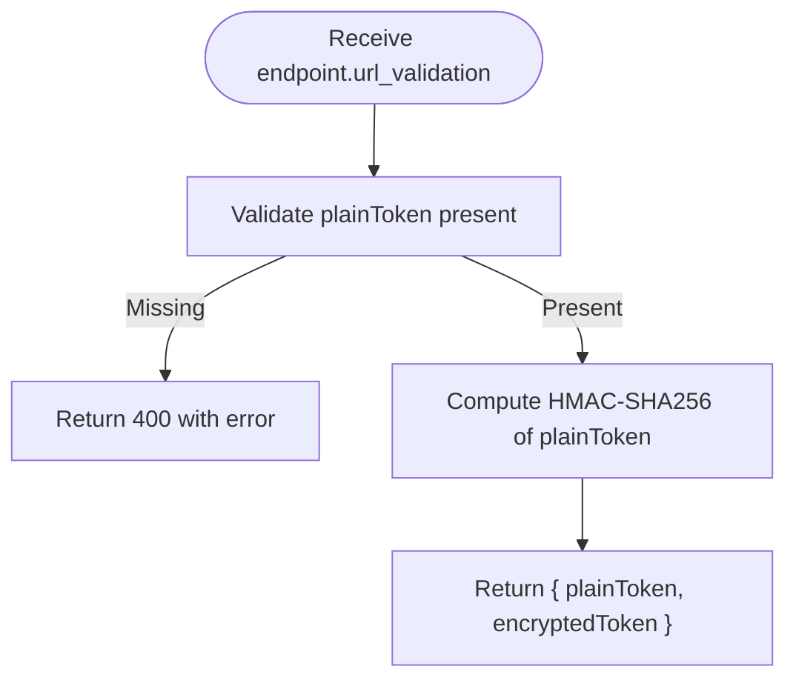
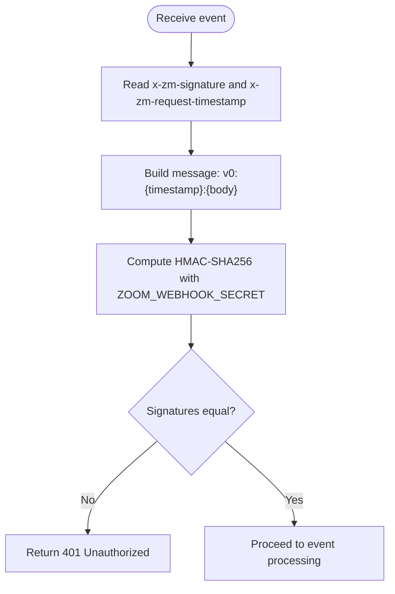
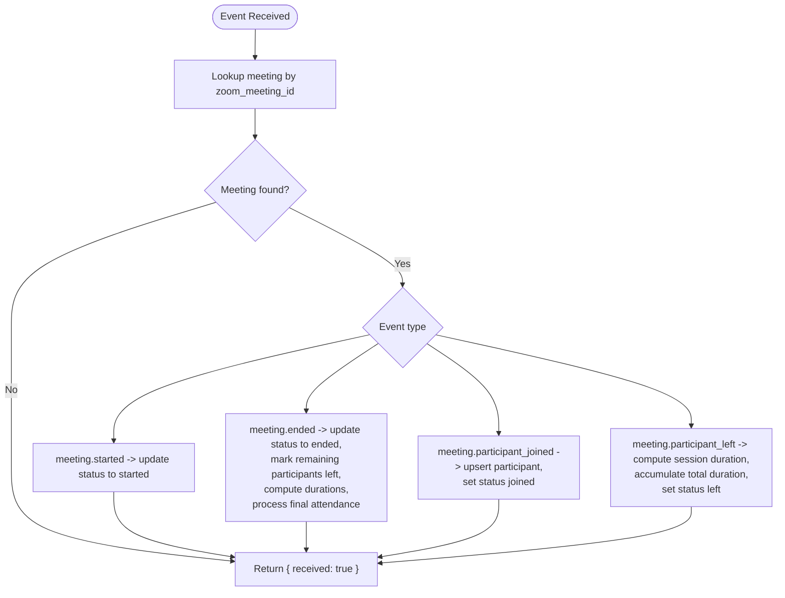
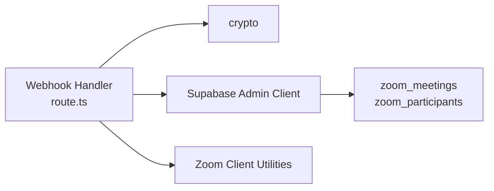

# Webhook Endpoint Configuration

<cite>
**Referenced Files in This Document**
- [route.ts](file://app/api/zoom/webhook/route.ts)
- [.env.example](file://.env.example)
- [20260110000001_create_zoom_meetings_table.sql](file://supabase/migrations/20260110000001_create_zoom_meetings_table.sql)
- [types.ts](file://lib/zoom/types.ts)
- [client.ts](file://lib/zoom/client.ts)
</cite>

## Table of Contents
1. [Introduction](#introduction)
2. [Project Structure](#project-structure)
3. [Core Components](#core-components)
4. [Architecture Overview](#architecture-overview)
5. [Detailed Component Analysis](#detailed-component-analysis)
6. [Dependency Analysis](#dependency-analysis)
7. [Performance Considerations](#performance-considerations)
8. [Troubleshooting Guide](#troubleshooting-guide)
9. [Conclusion](#conclusion)
10. [Appendices](#appendices)

## Introduction
This document explains the Zoom webhook endpoint configuration for the POST /api/zoom/webhook route. It covers request body parsing, initial validation, the URL validation challenge using x-zm-signature and x-zm-request-timestamp headers with HMAC-SHA256 verification against ZOOM_WEBHOOK_SECRET, and the response format for endpoint.url_validation events. It also documents security considerations, environment variable protection, error handling, and provides step-by-step configuration for registering the webhook in the Zoom dashboard.

## Project Structure
The webhook endpoint is implemented as a Next.js route under the API surface. Supporting components include environment variables, database schema for Zoom meeting and participant records, and Zoom client utilities.

**Diagram sources**
- [route.ts](file://app/api/zoom/webhook/route.ts#L1-L247)
- [20260110000001_create_zoom_meetings_table.sql](file://supabase/migrations/20260110000001_create_zoom_meetings_table.sql#L1-L46)
- [client.ts](file://lib/zoom/client.ts#L210-L232)

**Section sources**
- [route.ts](file://app/api/zoom/webhook/route.ts#L1-L247)
- [.env.example](file://.env.example#L42-L44)
- [20260110000001_create_zoom_meetings_table.sql](file://supabase/migrations/20260110000001_create_zoom_meetings_table.sql#L1-L46)

## Core Components
- POST /api/zoom/webhook handler:
  - Parses request body as text and attempts JSON parse.
  - Handles endpoint.url_validation challenge first.
  - Verifies HMAC-SHA256 signature using x-zm-signature and x-zm-request-timestamp.
  - Processes meeting lifecycle events (started, ended, participant_joined, participant_left).
  - Updates database records for meetings and participants.
- Environment variables:
  - ZOOM_WEBHOOK_SECRET is required for signature verification.
- Database schema:
  - zoom_meetings and zoom_participants tables support meeting and attendance tracking.
- Zoom client utilities:
  - generateSdkSignature() demonstrates HMAC-SHA256 usage for client-side signatures.

**Section sources**
- [route.ts](file://app/api/zoom/webhook/route.ts#L1-L247)
- [.env.example](file://.env.example#L42-L44)
- [20260110000001_create_zoom_meetings_table.sql](file://supabase/migrations/20260110000001_create_zoom_meetings_table.sql#L1-L46)
- [client.ts](file://lib/zoom/client.ts#L210-L232)

## Architecture Overview
The webhook endpoint integrates with Zoom’s event delivery and the application’s Supabase-backed data model. The flow below maps the actual code paths.

**Diagram sources**
- [route.ts](file://app/api/zoom/webhook/route.ts#L1-L247)
- [20260110000001_create_zoom_meetings_table.sql](file://supabase/migrations/20260110000001_create_zoom_meetings_table.sql#L1-L46)

## Detailed Component Analysis

### POST /api/zoom/webhook Route Setup
- Body parsing:
  - Reads raw body text and parses JSON. Returns 400 on invalid JSON.
- Initial validation:
  - Checks event field for endpoint.url_validation and validates presence of plainToken.
- Signature verification:
  - Reads x-zm-signature and x-zm-request-timestamp headers.
  - Computes expected signature using HMAC-SHA256 with ZOOM_WEBHOOK_SECRET and message format v0:{timestamp}:{body}.
  - Rejects request with 401 if signatures do not match.
- Event processing:
  - For meeting.started/ended/participant_joined/left, updates meeting status and participant records.
  - Uses Supabase client to query and upsert data.
- Response:
  - Returns { received: true } for successful processing or when meeting not found.

Security highlights:
- URL validation challenge is handled before signature verification to avoid leaking secrets.
- Signature verification uses a standardized message format and constant-time comparison semantics.
- Errors are returned with minimal information to avoid leaking internal details.

**Section sources**
- [route.ts](file://app/api/zoom/webhook/route.ts#L1-L247)

### URL Validation Challenge Mechanism (endpoint.url_validation)
- Trigger:
  - When event equals endpoint.url_validation, the endpoint responds with a JSON object containing plainToken and encryptedToken.
- Signature generation:
  - encryptedToken is computed as HMAC-SHA256 of plainToken using ZOOM_WEBHOOK_SECRET.
- Response format:
  - { plainToken, encryptedToken }.

**Diagram sources**
- [route.ts](file://app/api/zoom/webhook/route.ts#L29-L45)

**Section sources**
- [route.ts](file://app/api/zoom/webhook/route.ts#L29-L45)

### HMAC-SHA256 Signature Verification (x-zm-signature + x-zm-request-timestamp)
- Headers:
  - x-zm-signature: Expected signature prefix v0=...
  - x-zm-request-timestamp: Unix timestamp string.
- Message format:
  - v0:{timestamp}:{body}
- Verification:
  - Compute HMAC-SHA256 with ZOOM_WEBHOOK_SECRET.
  - Compare with x-zm-signature.
  - Reject with 401 if mismatch.

**Diagram sources**
- [route.ts](file://app/api/zoom/webhook/route.ts#L47-L62)

**Section sources**
- [route.ts](file://app/api/zoom/webhook/route.ts#L47-L62)

### Response Format for endpoint.url_validation
- The endpoint returns a JSON object with:
  - plainToken: The original token provided by Zoom.
  - encryptedToken: The HMAC-SHA256 digest of plainToken using ZOOM_WEBHOOK_SECRET.

**Section sources**
- [route.ts](file://app/api/zoom/webhook/route.ts#L36-L45)

### Event Processing and Database Integration
- Meeting lookup:
  - Uses zoom_meeting_id from payload to find meeting in zoom_meetings.
- Event handling:
  - meeting.started: Sets status to started.
  - meeting.ended: Sets status to ended, updates remaining participants to left, computes durations, and triggers final attendance processing.
  - meeting.participant_joined/left: Upserts participant records and updates durations and statuses.
- Attendance logic:
  - Final attendance marks enrolled students present if total duration meets threshold; otherwise partial or absent.
  - Student attendance is updated via upsert on attendance_records.

**Diagram sources**
- [route.ts](file://app/api/zoom/webhook/route.ts#L64-L247)
- [20260110000001_create_zoom_meetings_table.sql](file://supabase/migrations/20260110000001_create_zoom_meetings_table.sql#L1-L46)

**Section sources**
- [route.ts](file://app/api/zoom/webhook/route.ts#L64-L247)
- [20260110000001_create_zoom_meetings_table.sql](file://supabase/migrations/20260110000001_create_zoom_meetings_table.sql#L1-L46)

### Zoom Client HMAC Example (SDK Signature)
While unrelated to webhook verification, the Zoom client demonstrates HMAC-SHA256 usage for generating SDK signatures. This illustrates the cryptographic pattern used elsewhere in the codebase.

**Section sources**
- [client.ts](file://lib/zoom/client.ts#L210-L232)

## Dependency Analysis
- Internal dependencies:
  - crypto module for HMAC-SHA256 computations.
  - Supabase admin client for database operations.
  - Zoom client utilities for SDK signature generation.
- External dependencies:
  - Zoom platform for delivering webhook events and for SDK usage.
- Database dependencies:
  - zoom_meetings and zoom_participants tables define the schema for meeting and participant records.

**Diagram sources**
- [route.ts](file://app/api/zoom/webhook/route.ts#L1-L247)
- [20260110000001_create_zoom_meetings_table.sql](file://supabase/migrations/20260110000001_create_zoom_meetings_table.sql#L1-L46)
- [client.ts](file://lib/zoom/client.ts#L210-L232)

**Section sources**
- [route.ts](file://app/api/zoom/webhook/route.ts#L1-L247)
- [20260110000001_create_zoom_meetings_table.sql](file://supabase/migrations/20260110000001_create_zoom_meetings_table.sql#L1-L46)
- [client.ts](file://lib/zoom/client.ts#L210-L232)

## Performance Considerations
- Signature verification cost:
  - HMAC-SHA256 is fast and suitable for high-volume webhook traffic.
- Database operations:
  - Upserts and updates are performed per event; ensure indexes on zoom_meetings(zoom_meeting_id) and zoom_participants(meeting_id, user_id) remain effective.
- Batch processing:
  - Participant updates are processed per record; consider batching strategies if event volume increases significantly.

[No sources needed since this section provides general guidance]

## Troubleshooting Guide
Common issues and resolutions:
- Invalid JSON body:
  - Symptom: 400 Bad Request with error indicating invalid JSON.
  - Resolution: Ensure the payload is valid JSON.
- Missing plainToken during endpoint.url_validation:
  - Symptom: 400 Bad Request with error indicating missing plainToken.
  - Resolution: Provide plainToken in the payload as required by Zoom.
- Invalid signature:
  - Symptom: 401 Unauthorized.
  - Resolution: Verify ZOOM_WEBHOOK_SECRET matches the one configured in Zoom; confirm headers x-zm-signature and x-zm-request-timestamp are present and correct; ensure message format v0:{timestamp}:{body} is used.
- Meeting not found:
  - Symptom: 200 OK { received: true }.
  - Resolution: Confirm zoom_meeting_id in payload corresponds to an existing meeting in zoom_meetings.
- Error logs:
  - The handler logs errors to the console; inspect logs for detailed context.

**Section sources**
- [route.ts](file://app/api/zoom/webhook/route.ts#L23-L27)
- [route.ts](file://app/api/zoom/webhook/route.ts#L32-L34)
- [route.ts](file://app/api/zoom/webhook/route.ts#L58-L61)
- [route.ts](file://app/api/zoom/webhook/route.ts#L78-L80)
- [route.ts](file://app/api/zoom/webhook/route.ts#L242-L244)

## Conclusion
The Zoom webhook endpoint is designed to securely handle URL validation challenges and verify event authenticity using HMAC-SHA256. It integrates with the application’s database to manage meeting and participant records, and it returns minimal, non-leaking error messages. Proper configuration of ZOOM_WEBHOOK_SECRET and Zoom dashboard webhook settings is essential for reliable operation.

[No sources needed since this section summarizes without analyzing specific files]

## Appendices

### Configuration Steps: Registering the Webhook in Zoom Dashboard
- Obtain ZOOM_WEBHOOK_SECRET:
  - Set ZOOM_WEBHOOK_SECRET in your environment (see Environment Variables section).
- Configure webhook in Zoom:
  - Navigate to the Zoom Marketplace and create a Webhook app.
  - Set the webhook URL to your deployment’s POST /api/zoom/webhook endpoint.
  - Provide the ZOOM_WEBHOOK_SECRET in the Zoom app settings.
  - Subscribe to the desired events (e.g., endpoint.url_validation, meeting.started, meeting.ended, meeting.participant_joined, meeting.participant_left).
- Verify configuration:
  - Zoom will send a URL validation challenge with endpoint.url_validation.
  - Ensure your endpoint responds with { plainToken, encryptedToken }.

**Section sources**
- [.env.example](file://.env.example#L42-L44)
- [route.ts](file://app/api/zoom/webhook/route.ts#L29-L45)

### Environment Variables
- ZOOM_WEBHOOK_SECRET:
  - Required for HMAC-SHA256 signature verification and URL validation challenge.
- Related variables:
  - ZOOM_ACCOUNT_ID, ZOOM_CLIENT_ID, ZOOM_CLIENT_SECRET (for Zoom API operations).
  - ZOOM_SDK_KEY, ZOOM_SDK_SECRET (for SDK signature generation).

**Section sources**
- [.env.example](file://.env.example#L31-L44)
- [client.ts](file://lib/zoom/client.ts#L234-L253)

### Database Schema Notes
- zoom_meetings:
  - Stores meeting metadata and status.
- zoom_participants:
  - Tracks participant join/leave times and durations.
- Indexes:
  - Ensure indexes exist on zoom_meetings(zoom_meeting_id), zoom_participants(meeting_id, user_id) for efficient lookups.

**Section sources**
- [20260110000001_create_zoom_meetings_table.sql](file://supabase/migrations/20260110000001_create_zoom_meetings_table.sql#L1-L46)

### Security Considerations
- Protect ZOOM_WEBHOOK_SECRET:
  - Store in environment variables; never log or expose in client-side code.
- Avoid information leakage:
  - Return minimal error messages; do not reveal internal details.
- Signature verification timing:
  - Use the exact message format v0:{timestamp}:{body}; compare signatures carefully.
- Origin and CSRF protections:
  - While not directly applicable to webhooks, apply origin validation for other state-changing endpoints as needed.

**Section sources**
- [route.ts](file://app/api/zoom/webhook/route.ts#L47-L62)
- [route.ts](file://app/api/zoom/webhook/route.ts#L242-L244)
- [client.ts](file://lib/zoom/client.ts#L210-L232)