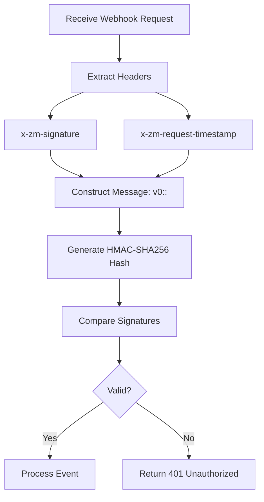
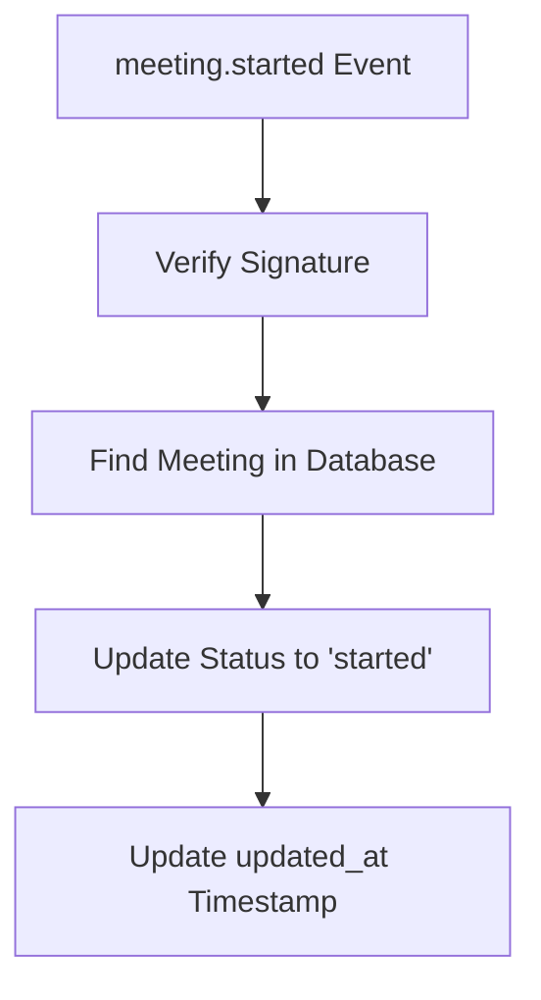
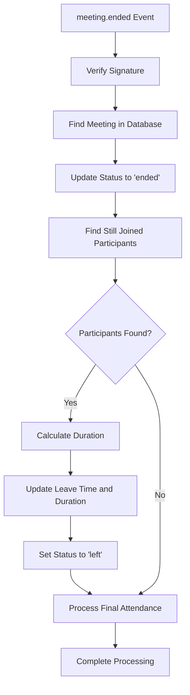
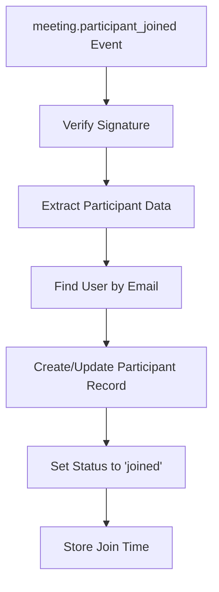
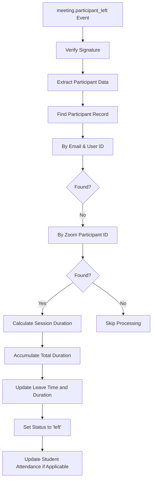
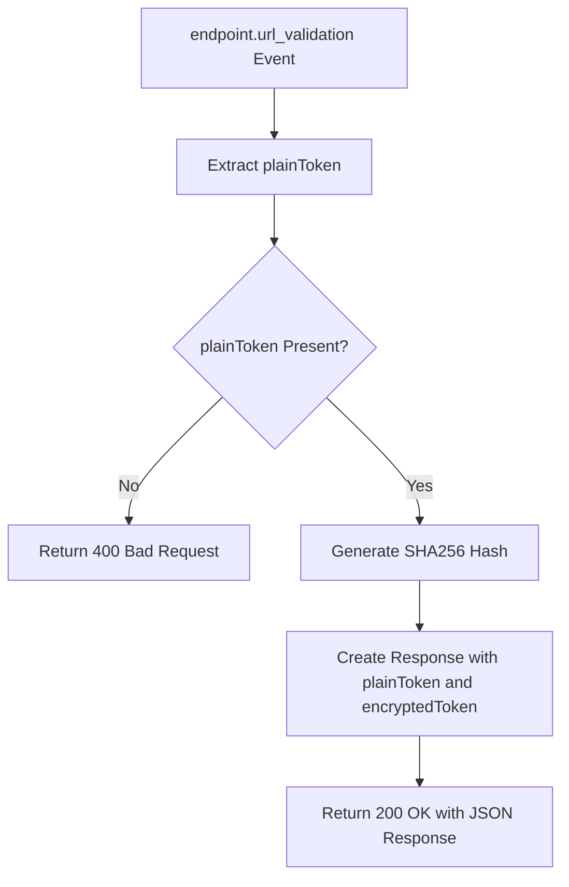
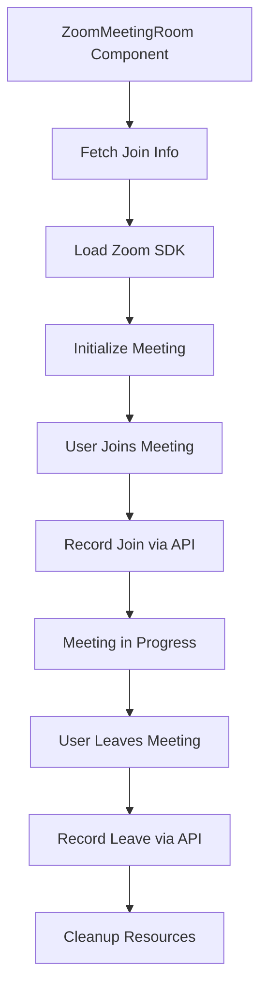
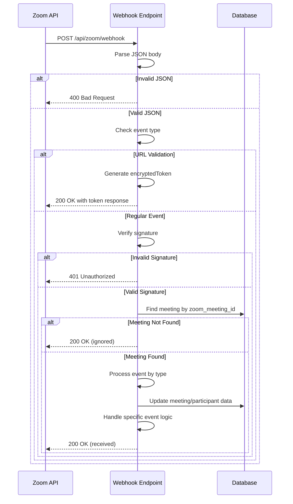

# Webhook Integration

<cite>
**Referenced Files in This Document**   
- [route.ts](file://app/api/zoom/webhook/route.ts)
- [zoom-meeting-room.tsx](file://components/zoom-meeting-room.tsx)
- [client.ts](file://lib/zoom/client.ts)
- [types.ts](file://lib/zoom/types.ts)
- [proxy.ts](file://proxy.ts)
- [20260110000001_create_zoom_meetings_table.sql](file://supabase/migrations/20260110000001_create_zoom_meetings_table.sql)
- [20260110000002_create_meeting_registrants_table.sql](file://supabase/migrations/20260110000002_create_meeting_registrants_table.sql)
</cite>

## Table of Contents
1. [Introduction](#introduction)
2. [Webhook Endpoint](#webhook-endpoint)
3. [Authentication and Security](#authentication-and-security)
4. [Event Processing Flow](#event-processing-flow)
5. [URL Validation Challenge](#url-validation-challenge)
6. [Error Handling](#error-handling)
7. [Usage Examples](#usage-examples)
8. [Security Considerations](#security-considerations)
9. [Database Schema](#database-schema)
10. [Sequence Diagram](#sequence-diagram)

## Introduction
This document provides comprehensive API documentation for the Zoom webhook integration in the School Management System. The integration enables real-time synchronization of Zoom meeting events with the school's attendance and meeting management system. The webhook endpoint receives notifications from Zoom for key meeting events, processes them to update meeting status, track participant attendance, and maintain accurate attendance records for students.

The integration supports four primary event types: meeting.started, meeting.ended, meeting.participant_joined, and meeting.participant_left. Each event triggers specific processing logic to ensure accurate tracking of meeting participation and attendance. The system implements robust security measures including HMAC-SHA256 signature verification, CSRF protection exclusions, and IP address hashing for privacy.

**Section sources**
- [route.ts](file://app/api/zoom/webhook/route.ts#L1-L342)

## Webhook Endpoint
The Zoom webhook endpoint is configured to receive real-time notifications from Zoom's event system. This endpoint serves as the communication bridge between Zoom's meeting platform and the school's management system, enabling automated tracking of meeting activities and participant attendance.

### Endpoint Details
- **URL**: `/api/zoom/webhook`
- **Method**: POST
- **Content-Type**: application/json
- **Authentication**: HMAC-SHA256 signature verification

### Supported Events
The webhook processes the following Zoom event types:

| Event Type | Description | Processing Action |
|------------|-------------|-------------------|
| meeting.started | Triggered when a meeting starts | Updates meeting status to "started" in the database |
| meeting.ended | Triggered when a meeting ends | Updates meeting status to "ended" and processes final attendance |
| meeting.participant_joined | Triggered when a participant joins a meeting | Creates or updates participant record with join time |
| meeting.participant_left | Triggered when a participant leaves a meeting | Updates participant record with leave time and duration |
| endpoint.url_validation | Triggered during webhook setup | Responds with encrypted token for URL verification |

The endpoint first validates the incoming request by parsing the JSON body. If the JSON is invalid, it returns a 400 Bad Request response. For valid requests, it proceeds with event-specific processing based on the event type specified in the payload.

**Section sources**
- [route.ts](file://app/api/zoom/webhook/route.ts#L17-L89)

## Authentication and Security
The webhook implementation employs a multi-layered security approach to ensure the authenticity and integrity of incoming requests from Zoom. This security framework protects against unauthorized access and ensures that only legitimate Zoom events are processed by the system.

### HMAC-SHA256 Signature Verification
The primary authentication mechanism uses HMAC-SHA256 signature verification with the `x-zm-signature` and `x-zm-request-timestamp` headers. The verification process follows Zoom's security protocol:

1. Extract the signature from the `x-zm-signature` header
2. Extract the timestamp from the `x-zm-request-timestamp` header
3. Construct the message string using the format: `v0:<timestamp>:<request_body>`
4. Generate the expected signature using HMAC-SHA256 with the `ZOOM_WEBHOOK_SECRET`
5. Compare the received signature with the expected signature



**Diagram sources**
- [route.ts](file://app/api/zoom/webhook/route.ts#L47-L62)

### Environment Configuration
The authentication process relies on the `ZOOM_WEBHOOK_SECRET` environment variable, which must be configured in the server environment. This secret key is used as the HMAC signing key and should be kept confidential. The system checks for the presence of this secret before attempting signature verification.

### CSRF Protection Exemption
The webhook endpoint is specifically exempted from the application's global CSRF protection mechanism, as documented in the proxy configuration. This exemption is necessary because the webhook receives requests from Zoom's servers, which cannot provide the application's CSRF tokens.

```typescript
// In proxy.ts: Skip CSRF check for webhook endpoints
const isWebhook = request.nextUrl.pathname.startsWith("/api/zoom/webhook")
if (["POST", "PUT", "DELETE", "PATCH"].includes(method) && !isWebhook) {
  if (!validateOrigin(request)) {
    // Return 403 Forbidden
  }
}
```

**Section sources**
- [route.ts](file://app/api/zoom/webhook/route.ts#L47-L62)
- [proxy.ts](file://proxy.ts#L50-L65)

## Event Processing Flow
The webhook processes different Zoom event types through a structured flow that updates the system's state according to the meeting lifecycle. Each event type triggers specific database operations to maintain accurate records of meeting status, participant attendance, and student attendance.

### meeting.started Event
When a meeting starts, the system updates the meeting status in the database to reflect the active state:

1. Receive `meeting.started` event from Zoom
2. Verify webhook signature
3. Find the corresponding meeting in the database using the Zoom meeting ID
4. Update the meeting record with status "started" and current timestamp



**Section sources**
- [route.ts](file://app/api/zoom/webhook/route.ts#L84-L89)

### meeting.ended Event
When a meeting ends, the system performs comprehensive cleanup and attendance processing:

1. Receive `meeting.ended` event from Zoom
2. Verify webhook signature
3. Find the corresponding meeting in the database
4. Update the meeting status to "ended"
5. Process any participants still marked as "joined" by updating their leave time and duration
6. Execute final attendance processing for the associated class

The system identifies participants who were still marked as "joined" but did not send a `meeting.participant_left` event (possibly due to network issues or abrupt disconnections). For these participants, it calculates their duration based on the meeting end time and their join time, then updates their status to "left".



**Section sources**
- [route.ts](file://app/api/zoom/webhook/route.ts#L91-L129)

### meeting.participant_joined Event
When a participant joins a meeting, the system creates or updates their participation record:

1. Receive `meeting.participant_joined` event from Zoom
2. Verify webhook signature
3. Extract participant information (user_id, user_name, email, join_time)
4. Attempt to match the participant with an existing user by email
5. Create or update the participant record in the zoom_participants table

The system uses an upsert operation with a conflict resolution strategy based on the combination of meeting_id and user_id. This ensures that if a participant joins multiple times (e.g., due to network issues), their record is updated rather than creating duplicates.



**Section sources**
- [route.ts](file://app/api/zoom/webhook/route.ts#L131-L153)

### meeting.participant_left Event
When a participant leaves a meeting, the system updates their record with leave time and calculates their attendance duration:

1. Receive `meeting.participant_left` event from Zoom
2. Verify webhook signature
3. Extract participant information
4. Find the corresponding participant record using a two-step matching process:
   - First, try to match by email and user_id
   - If not found, try to match by zoom_participant_id
5. Calculate the session duration based on join_time and leave_time
6. Accumulate the duration (in case of multiple join/leave cycles)
7. Update the participant record with leave_time, total duration, and status "left"
8. For students, update their attendance record based on the total duration

The system implements a sophisticated matching algorithm to handle cases where the participant's email might not be available or where the user_id might not be consistently provided. This ensures accurate tracking even in edge cases.



**Section sources**
- [route.ts](file://app/api/zoom/webhook/route.ts#L155-L240)

## URL Validation Challenge
During the initial webhook setup process, Zoom sends a URL validation challenge to verify that the endpoint is valid and controlled by the intended recipient. The system must respond correctly to this challenge for the webhook to be successfully registered.

### Challenge Response Process
1. Receive `endpoint.url_validation` event from Zoom
2. Extract the `plainToken` from the event payload
3. Generate an HMAC-SHA256 hash of the plainToken using the `ZOOM_WEBHOOK_SECRET`
4. Return a JSON response containing the original plainToken and the encryptedToken (hash)

The response format must be:
```json
{
  "plainToken": "original_token_from_zoom",
  "encryptedToken": "sha256_hash_of_plainToken"
}
```

This validation occurs before signature verification, as the initial setup request does not include the signature headers. The system prioritizes handling this event type first to ensure successful webhook registration.



**Section sources**
- [route.ts](file://app/api/zoom/webhook/route.ts#L30-L45)

## Error Handling
The webhook implementation includes comprehensive error handling to ensure robust operation under various failure scenarios. The system gracefully handles both expected and unexpected errors, providing appropriate responses while maintaining data integrity.

### JSON Parsing Errors
If the incoming request body cannot be parsed as valid JSON, the system returns a 400 Bad Request response with an error message:

```json
{ "error": "Invalid JSON" }
```

This prevents the processing of malformed requests and provides clear feedback to the sender.

### Signature Verification Failures
When the HMAC signature verification fails, the system logs the error with both the received and expected signatures for debugging purposes, then returns a 401 Unauthorized response:

```json
{ "error": "Invalid signature" }
```

This security measure prevents unauthorized access while avoiding the exposure of sensitive information about the verification process.

### Database Update Errors
All database operations are wrapped in a try-catch block to handle potential database errors. If an error occurs during processing, it is logged to the console with the error details, but the system still returns a success response to Zoom:

```typescript
try {
  // Database operations
} catch (error) {
  console.error("Error processing webhook:", error)
}
return NextResponse.json({ received: true })
```

This approach follows the principle of failing gracefully—ensuring that temporary database issues do not cause the entire webhook processing to fail, while still maintaining a record of the error for investigation.

### Missing Data Handling
The system includes validation for critical data points:
- If the meeting ID is not present in the event payload, the request is acknowledged but not processed
- If no matching meeting is found in the database, the request is acknowledged but not processed
- For participant events, if the participant data is incomplete, the system attempts to process with available information

This ensures that the system can handle edge cases and incomplete data without failing entirely.

**Section sources**
- [route.ts](file://app/api/zoom/webhook/route.ts#L23-L27)
- [route.ts](file://app/api/zoom/webhook/route.ts#L58-L61)
- [route.ts](file://app/api/zoom/webhook/route.ts#L242-L245)

## Usage Examples
The Zoom webhook integration is used in conjunction with the frontend components to provide a seamless meeting experience for users. The `zoom-meeting-room.tsx` component demonstrates how the system interacts with the webhook and other API endpoints to manage meeting participation.

### Meeting Room Component
The `ZoomMeetingRoom` component manages the user interface for joining and participating in Zoom meetings. It interacts with the webhook system through the following workflow:

1. On component mount, fetch join information from `/api/zoom/meetings/${meetingId}/join`
2. When the user joins the meeting, send a POST request to the same endpoint with action "join"
3. When the user leaves the meeting, send a POST request with action "leave"
4. These join/leave actions are recorded and may trigger additional processing

The component also handles the loading of the Zoom SDK and initialization of the meeting interface, providing both embedded meeting capabilities and fallback options to open the meeting in the Zoom application.



**Section sources**
- [zoom-meeting-room.tsx](file://components/zoom-meeting-room.tsx#L26-L254)

## Security Considerations
The webhook implementation incorporates multiple security measures to protect the system from unauthorized access, data breaches, and abuse.

### IP Address Hashing
The system implements IP address hashing for privacy protection, as evidenced by the database migration:

```sql
ALTER TABLE qr_checkins ADD COLUMN IF NOT EXISTS ip_hash VARCHAR(64);
COMMENT ON COLUMN qr_checkins.ip_hash IS 'SHA-256 hash of client IP address (first 32 chars) for privacy-preserving abuse detection';
```

This approach allows the system to detect potential abuse patterns through hash comparison while protecting user privacy by not storing raw IP addresses.

### Signature Verification
The HMAC-SHA256 signature verification ensures that only legitimate requests from Zoom are processed. The system uses the `ZOOM_WEBHOOK_SECRET` to validate the `x-zm-signature` header, preventing spoofed requests from unauthorized sources.

### Error Handling Without Information Disclosure
The error responses are designed to provide minimal information to potential attackers:
- Invalid JSON returns a generic "Invalid JSON" message
- Invalid signature returns a generic "Invalid signature" message
- No detailed error information is exposed in the responses

This follows security best practices by avoiding the disclosure of implementation details that could be exploited.

### CSRF Protection Integration
The webhook endpoint is specifically excluded from the application's CSRF protection, as it receives requests from external sources (Zoom's servers) that cannot provide CSRF tokens. This exclusion is implemented in the proxy layer with a clear condition:

```typescript
const isWebhook = request.nextUrl.pathname.startsWith("/api/zoom/webhook")
if (["POST", "PUT", "DELETE", "PATCH"].includes(method) && !isWebhook) {
  // Apply CSRF protection
}
```

**Section sources**
- [20260110000003_hash_ip_addresses.sql](file://supabase/migrations/20260110000003_hash_ip_addresses.sql#L1-L18)
- [proxy.ts](file://proxy.ts#L50-L65)

## Database Schema
The webhook integration relies on a well-defined database schema to store meeting and participant information. The schema is designed to support efficient querying and maintain data integrity through appropriate constraints and indexes.

### zoom_meetings Table
The `zoom_meetings` table stores information about Zoom meetings scheduled through the system:

```sql
CREATE TABLE zoom_meetings (
  id UUID PRIMARY KEY DEFAULT gen_random_uuid(),
  zoom_meeting_id TEXT UNIQUE NOT NULL,
  host_id UUID REFERENCES users(id) ON DELETE SET NULL,
  title TEXT NOT NULL,
  description TEXT,
  meeting_type TEXT DEFAULT 'scheduled' CHECK (meeting_type IN ('instant', 'scheduled', 'recurring')),
  start_time TIMESTAMPTZ NOT NULL,
  duration INTEGER NOT NULL DEFAULT 60,
  timezone TEXT DEFAULT 'UTC',
  join_url TEXT NOT NULL,
  start_url TEXT,
  password TEXT,
  status TEXT DEFAULT 'scheduled' CHECK (status IN ('scheduled', 'started', 'ended', 'cancelled')),
  class_id UUID REFERENCES classes(id) ON DELETE SET NULL,
  target_audience TEXT DEFAULT 'class' CHECK (target_audience IN ('all', 'students', 'teachers', 'class', 'personal')),
  settings JSONB DEFAULT '{}',
  created_at TIMESTAMPTZ DEFAULT NOW(),
  updated_at TIMESTAMPTZ DEFAULT NOW()
);
```

### zoom_participants Table
The `zoom_participants` table tracks individual participation in meetings:

```sql
CREATE TABLE zoom_participants (
  id UUID PRIMARY KEY DEFAULT gen_random_uuid(),
  meeting_id UUID REFERENCES zoom_meetings(id) ON DELETE CASCADE,
  user_id UUID REFERENCES users(id) ON DELETE SET NULL,
  zoom_participant_id TEXT,
  name TEXT,
  email TEXT,
  join_time TIMESTAMPTZ,
  leave_time TIMESTAMPTZ,
  duration INTEGER,
  status TEXT DEFAULT 'invited' CHECK (status IN ('invited', 'joined', 'left')),
  created_at TIMESTAMPTZ DEFAULT NOW(),
  UNIQUE(meeting_id, user_id)
);
```

### meeting_registrants Table
The `meeting_registrants` table stores registration information for meetings that require registration:

```sql
CREATE TABLE meeting_registrants (
  id UUID PRIMARY KEY DEFAULT gen_random_uuid(),
  meeting_id UUID NOT NULL REFERENCES zoom_meetings(id) ON DELETE CASCADE,
  user_id UUID NOT NULL REFERENCES users(id) ON DELETE CASCADE,
  zoom_registrant_id TEXT,
  join_url TEXT,
  status TEXT DEFAULT 'pending' CHECK (status IN ('pending', 'approved', 'denied')),
  registered_at TIMESTAMPTZ DEFAULT NOW(),
  created_at TIMESTAMPTZ DEFAULT NOW(),
  updated_at TIMESTAMPTZ DEFAULT NOW(),
  UNIQUE(meeting_id, user_id)
);
```

The schema includes appropriate indexes for performance optimization and Row Level Security (RLS) policies to enforce data access controls.

**Section sources**
- [20260110000001_create_zoom_meetings_table.sql](file://supabase/migrations/20260110000001_create_zoom_meetings_table.sql#L1-L113)
- [20260110000002_create_meeting_registrants_table.sql](file://supabase/migrations/20260110000002_create_meeting_registrants_table.sql#L1-L53)

## Sequence Diagram
The following sequence diagram illustrates the complete flow of a Zoom webhook event from receipt to processing:



**Diagram sources**
- [route.ts](file://app/api/zoom/webhook/route.ts#L17-L247)