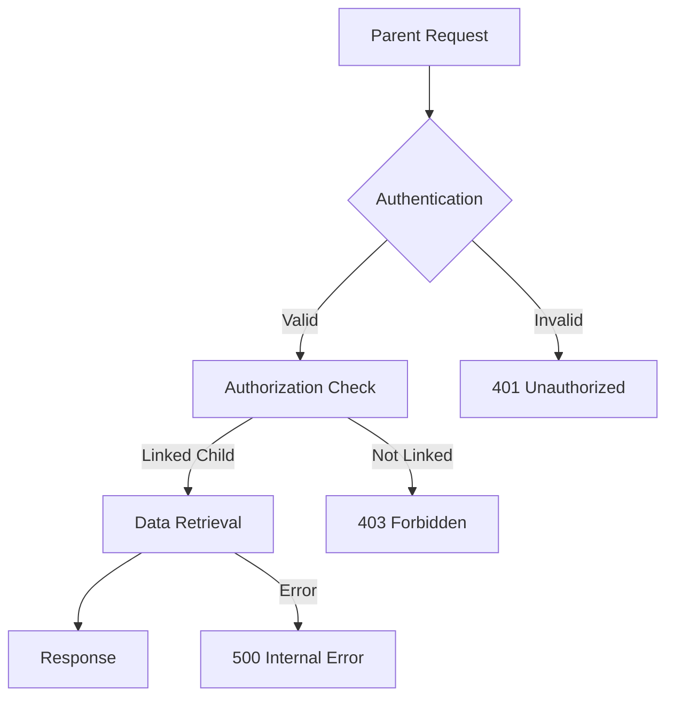
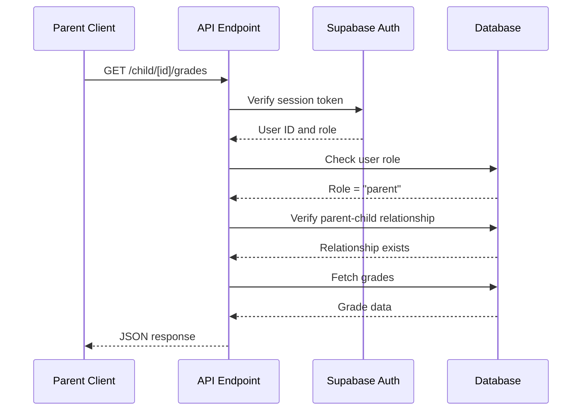
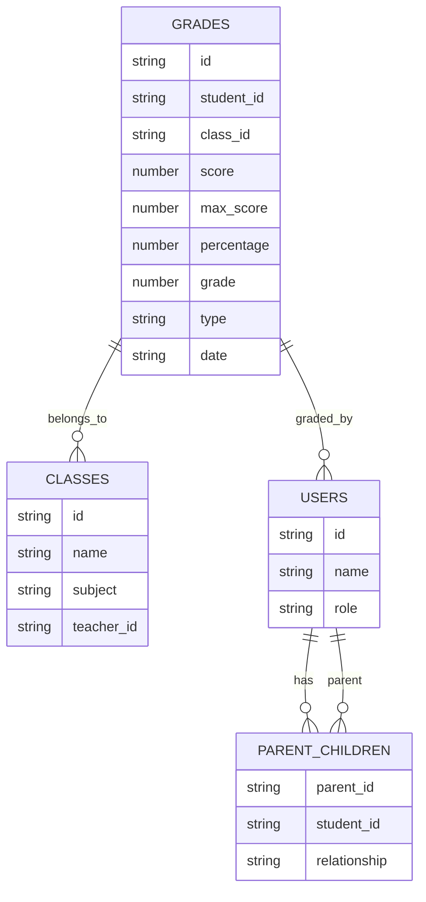
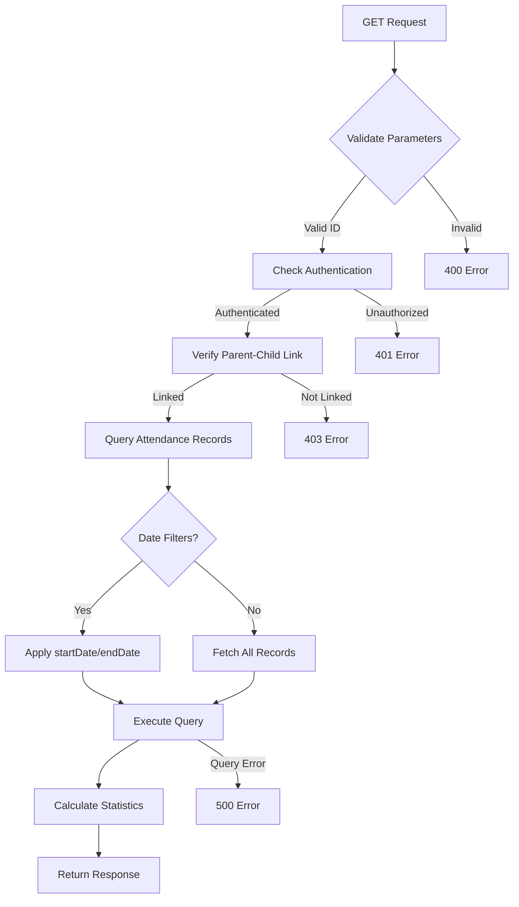
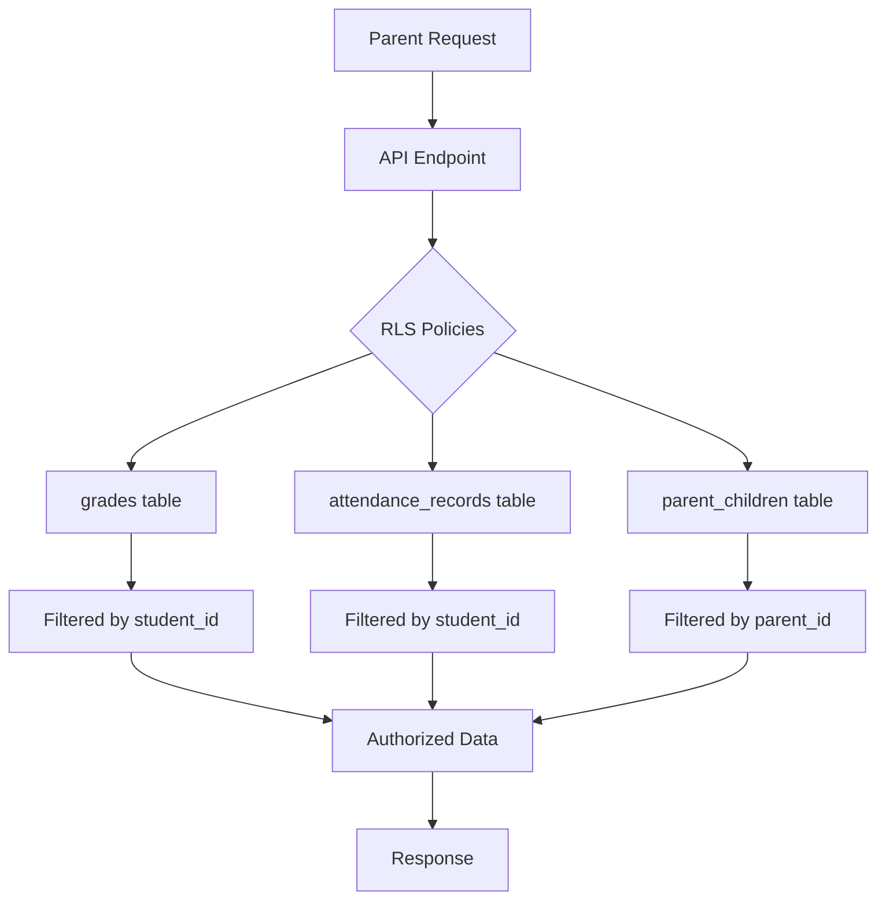
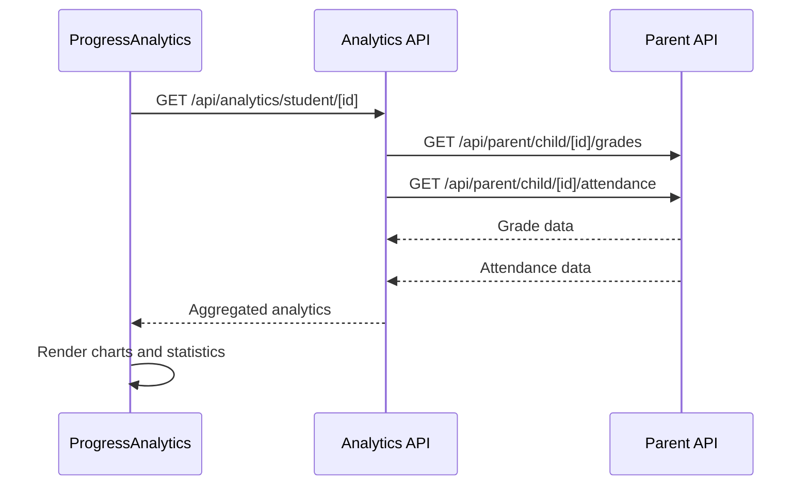
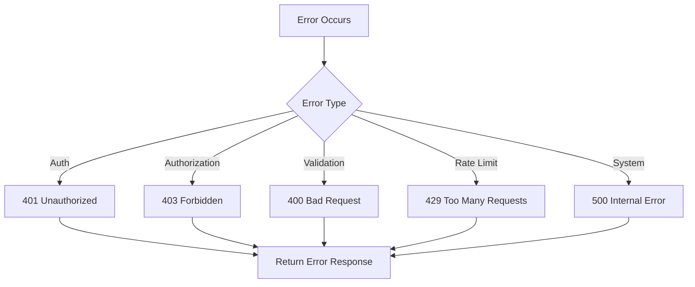
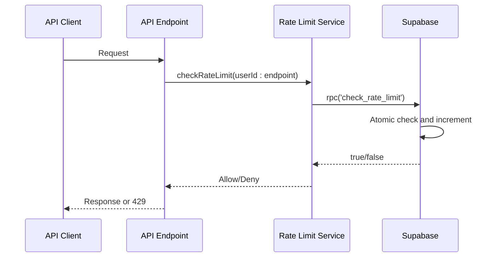
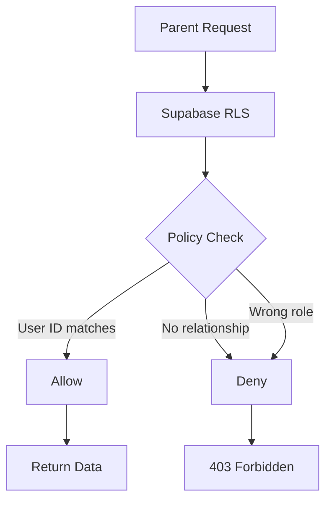

# Academic Monitoring API

<cite>
**Referenced Files in This Document**   
- [grades/route.ts](file://app/api/parent/child/[id]/grades/route.ts)
- [attendance/route.ts](file://app/api/parent/child/[id]/attendance/route.ts)
- [types.ts](file://lib/supabase/types.ts)
- [progress-analytics.tsx](file://components/progress-analytics.tsx)
- [attendance-utils.ts](file://lib/attendance-utils.ts)
- [server.ts](file://lib/supabase/server.ts)
- [api-errors.ts](file://lib/api-errors.ts)
- [rate-limit.ts](file://lib/rate-limit.ts)
- [validation-schemas.ts](file://lib/validation-schemas.ts)
- [20251219044036_add_rls_policies.sql](file://supabase/migrations/20251219044036_add_rls_policies.sql)
</cite>

## Table of Contents
1. [Introduction](#introduction)
2. [Endpoint Overview](#endpoint-overview)
3. [Authentication and Authorization](#authentication-and-authorization)
4. [Route Parameter Validation](#route-parameter-validation)
5. [Grades Endpoint Details](#grades-endpoint-details)
6. [Attendance Endpoint Details](#attendance-endpoint-details)
7. [Response Structure](#response-structure)
8. [Data Aggregation and Security](#data-aggregation-and-security)
9. [Usage Examples](#usage-examples)
10. [Error Handling](#error-handling)
11. [Rate Limiting](#rate-limiting)
12. [RLS Policy Enforcement](#rls-policy-enforcement)

## Introduction
The Academic Monitoring API provides parents with secure access to their children's academic performance and attendance records. This document details the implementation of two key endpoints: `child/[id]/grades` and `child/[id]/attendance`, which allow parents to monitor their children's educational progress. The API enforces strict authentication, authorization, and data privacy controls to ensure that parents can only access information for children they are explicitly linked to.

**Section sources**
- [grades/route.ts](file://app/api/parent/child/[id]/grades/route.ts)
- [attendance/route.ts](file://app/api/parent/child/[id]/attendance/route.ts)

## Endpoint Overview
The Parent API exposes two academic monitoring endpoints under the `child/[id]` route:

- **GET `/api/parent/child/[id]/grades`**: Retrieves a child's grade history with subject breakdown
- **GET `/api/parent/child/[id]/attendance`**: Retrieves a child's attendance records with status summaries

Both endpoints use a dynamic route parameter `[id]` to specify the target student and require authentication to ensure data privacy.



**Diagram sources**
- [grades/route.ts](file://app/api/parent/child/[id]/grades/route.ts#L5-L61)
- [attendance/route.ts](file://app/api/parent/child/[id]/attendance/route.ts#L6-L79)

**Section sources**
- [grades/route.ts](file://app/api/parent/child/[id]/grades/route.ts)
- [attendance/route.ts](file://app/api/parent/child/[id]/attendance/route.ts)

## Authentication and Authorization
The API implements a multi-layered security model to protect student data:

1. **Authentication**: All requests must include a valid session token. The API verifies the user's authentication status using Supabase Auth.
2. **Role Verification**: The requesting user must have the "parent" role.
3. **Relationship Validation**: The parent must be explicitly linked to the target child in the `parent_children` table.



**Diagram sources**
- [grades/route.ts](file://app/api/parent/child/[id]/grades/route.ts#L11-L37)
- [attendance/route.ts](file://app/api/parent/child/[id]/attendance/route.ts#L12-L38)

**Section sources**
- [grades/route.ts](file://app/api/parent/child/[id]/grades/route.ts)
- [attendance/route.ts](file://app/api/parent/child/[id]/attendance/route.ts)
- [server.ts](file://lib/supabase/server.ts)

## Route Parameter Validation
The dynamic route parameter `[id]` undergoes strict validation to prevent unauthorized access:

1. **UUID Format**: The parameter must be a valid UUID format.
2. **Existence Check**: The student ID must exist in the users table.
3. **Relationship Verification**: The parent must have an active relationship with the student in the `parent_children` table.

The validation occurs in both endpoints through identical authorization logic that queries the `parent_children` table to confirm the relationship.

**Section sources**
- [grades/route.ts](file://app/api/parent/child/[id]/grades/route.ts#L28-L37)
- [attendance/route.ts](file://app/api/parent/child/[id]/attendance/route.ts#L29-L38)

## Grades Endpoint Details
The `child/[id]/grades` endpoint retrieves a student's complete grade history with detailed subject information.

### Request
- **Method**: GET
- **Path**: `/api/parent/child/[id]/grades`
- **Authentication**: Required (parent role)
- **Parameters**: 
  - `[id]`: Student UUID (path parameter)

### Response
Returns a JSON object containing an array of grade records with embedded class and teacher information.



**Diagram sources**
- [grades/route.ts](file://app/api/parent/child/[id]/grades/route.ts#L41-L55)
- [types.ts](file://lib/supabase/types.ts#L135-L146)

**Section sources**
- [grades/route.ts](file://app/api/parent/child/[id]/grades/route.ts)
- [types.ts](file://lib/supabase/types.ts)

## Attendance Endpoint Details
The `child/[id]/attendance` endpoint retrieves a student's attendance records with statistical summaries.

### Request
- **Method**: GET
- **Path**: `/api/parent/child/[id]/attendance`
- **Authentication**: Required (parent role)
- **Parameters**:
  - `[id]`: Student UUID (path parameter)
  - `startDate`: Optional filter (query parameter)
  - `endDate`: Optional filter (query parameter)

### Response
Returns a JSON object containing attendance records and calculated statistics including attendance rate.



**Diagram sources**
- [attendance/route.ts](file://app/api/parent/child/[id]/attendance/route.ts#L40-L73)
- [attendance-utils.ts](file://lib/attendance-utils.ts#L17-L41)

**Section sources**
- [attendance/route.ts](file://app/api/parent/child/[id]/attendance/route.ts)
- [attendance-utils.ts](file://lib/attendance-utils.ts)

## Response Structure
Both endpoints return structured JSON responses with consistent error handling patterns.

### Grades Response
```json
{
  "grades": [
    {
      "id": "uuid",
      "student_id": "uuid",
      "class_id": "uuid",
      "score": 85,
      "max_score": 100,
      "percentage": 85,
      "grade": 85,
      "type": "exam",
      "date": "2025-01-15",
      "class": {
        "id": "uuid",
        "name": "Math 101",
        "subject": "Mathematics"
      },
      "teacher": {
        "id": "uuid",
        "name": "John Doe"
      }
    }
  ]
}
```

### Attendance Response
```json
{
  "attendance": [
    {
      "id": "uuid",
      "student_id": "uuid",
      "class_id": "uuid",
      "date": "2025-01-15",
      "status": "present",
      "class": {
        "id": "uuid",
        "name": "Science 101",
        "subject": "Science"
      }
    }
  ],
  "stats": {
    "present": 18,
    "absent": 2,
    "late": 3,
    "excused": 1,
    "total": 24,
    "rate": 87.5
  }
}
```

**Section sources**
- [grades/route.ts](file://app/api/parent/child/[id]/grades/route.ts#L55)
- [attendance/route.ts](file://app/api/parent/child/[id]/attendance/route.ts#L70-L73)

## Data Aggregation and Security
The API securely aggregates data from multiple tables using Supabase's relational queries and RLS policies.

### Data Sources
- **Grades**: Aggregated from `grades`, `classes`, and `users` tables
- **Attendance**: Aggregated from `attendance_records` and `classes` tables
- **Relationships**: Verified through `parent_children` table

### Security Measures
- **Row Level Security (RLS)**: Enabled on all tables
- **Service Role Access**: Admin client used for system operations
- **Parameterized Queries**: Prevent SQL injection
- **Type Validation**: UUID format enforcement



**Diagram sources**
- [grades/route.ts](file://app/api/parent/child/[id]/grades/route.ts)
- [attendance/route.ts](file://app/api/parent/child/[id]/attendance/route.ts)
- [20251219044036_add_rls_policies.sql](file://supabase/migrations/20251219044036_add_rls_policies.sql)

**Section sources**
- [grades/route.ts](file://app/api/parent/child/[id]/grades/route.ts)
- [attendance/route.ts](file://app/api/parent/child/[id]/attendance/route.ts)
- [types.ts](file://lib/supabase/types.ts)

## Usage Examples
The academic monitoring data is consumed by frontend components for visualization.

### Progress Analytics Component
The `progress-analytics.tsx` component uses the academic data to create visual dashboards:



### Data Flow
1. Parent views child's progress dashboard
2. `ProgressAnalytics` component fetches data from analytics endpoint
3. Analytics service calls Parent API endpoints
4. Data is processed and visualized in charts

**Section sources**
- [progress-analytics.tsx](file://components/progress-analytics.tsx)
- [attendance-utils.ts](file://lib/attendance-utils.ts)

## Error Handling
The API implements comprehensive error handling for various failure scenarios.

### Error Types
- **401 Unauthorized**: Missing or invalid authentication
- **403 Forbidden**: User lacks required role or parent-child relationship
- **404 Not Found**: Invalid student ID
- **429 Too Many Requests**: Rate limit exceeded
- **500 Internal Server Error**: Database or system error

### Error Response Structure
```json
{
  "error": "Descriptive error message"
}
```

The API uses the `api-errors.ts` utility to standardize error responses and prevent information disclosure.



**Diagram sources**
- [api-errors.ts](file://lib/api-errors.ts#L59-L69)
- [grades/route.ts](file://app/api/parent/child/[id]/grades/route.ts#L13-L15)
- [attendance/route.ts](file://app/api/parent/child/[id]/attendance/route.ts#L14-L16)

**Section sources**
- [api-errors.ts](file://lib/api-errors.ts)
- [grades/route.ts](file://app/api/parent/child/[id]/grades/route.ts)
- [attendance/route.ts](file://app/api/parent/child/[id]/attendance/route.ts)

## Rate Limiting
The API implements rate limiting to prevent abuse and ensure system stability.

### Configuration
- **Limit**: 100 requests per hour per user
- **Identifier**: User ID + endpoint combination
- **Window**: 3600000 milliseconds (1 hour)
- **Fail Mode**: Fail-open for availability, fail-closed for security-critical endpoints

### Implementation
Uses Supabase's `check_rate_limit` RPC function with atomic operations to prevent race conditions.



**Diagram sources**
- [rate-limit.ts](file://lib/rate-limit.ts#L25-L55)
- [20260101070343_rate_limit_rpc.sql](file://supabase/migrations/20260101070343_rate_limit_rpc.sql)

**Section sources**
- [rate-limit.ts](file://lib/rate-limit.ts)
- [api-errors.ts](file://lib/api-errors.ts#L64)

## RLS Policy Enforcement
Row Level Security (RLS) policies provide an additional layer of data protection.

### Key Policies
- **Users Table**: Users can only read their own data
- **Parent-Children Table**: Relationships can only be accessed by involved parties
- **Grades Table**: Access controlled through parent-child relationships
- **Attendance Table**: Access controlled through parent-child relationships

### Policy Example
```sql
-- Users can read own data
CREATE POLICY "Users can read own data" ON users FOR SELECT USING (auth.uid() = id);

-- Users can read own student profile
CREATE POLICY "Users can read own student profile" ON student_profiles FOR SELECT USING (auth.uid() = id);
```

The RLS policies ensure that even if a parent knows another student's ID, they cannot access that student's data without an explicit relationship in the `parent_children` table.



**Diagram sources**
- [20251219044036_add_rls_policies.sql](file://supabase/migrations/20251219044036_add_rls_policies.sql)
- [grades/route.ts](file://app/api/parent/child/[id]/grades/route.ts#L28-L37)

**Section sources**
- [20251219044036_add_rls_policies.sql](file://supabase/migrations/20251219044036_add_rls_policies.sql)
- [grades/route.ts](file://app/api/parent/child/[id]/grades/route.ts)
- [attendance/route.ts](file://app/api/parent/child/[id]/attendance/route.ts)