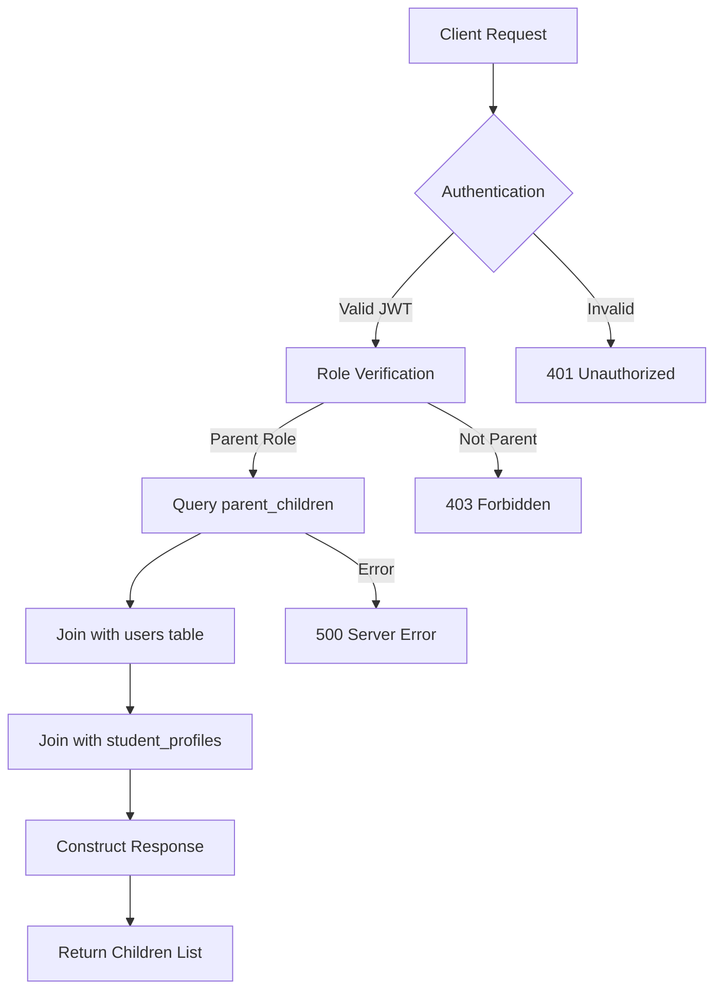
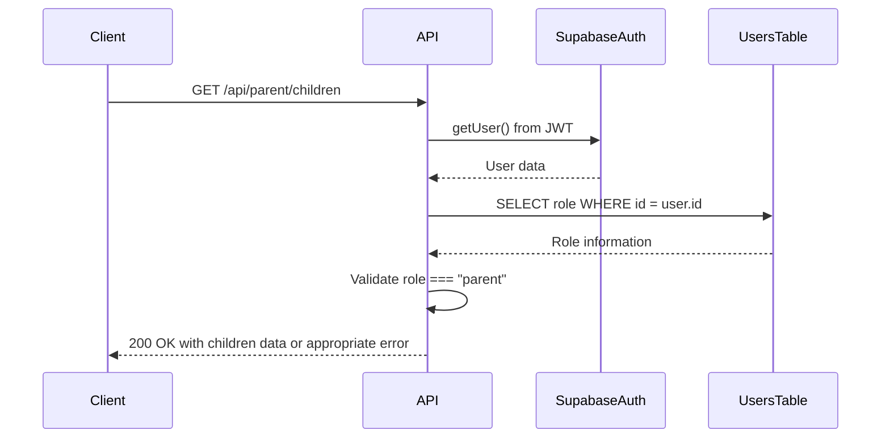
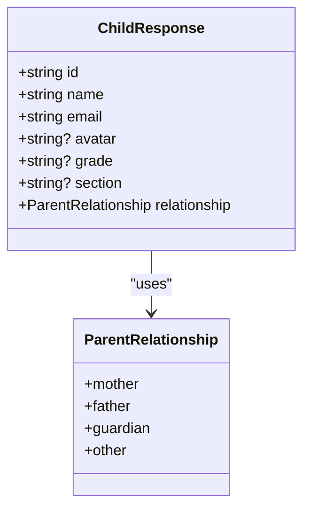
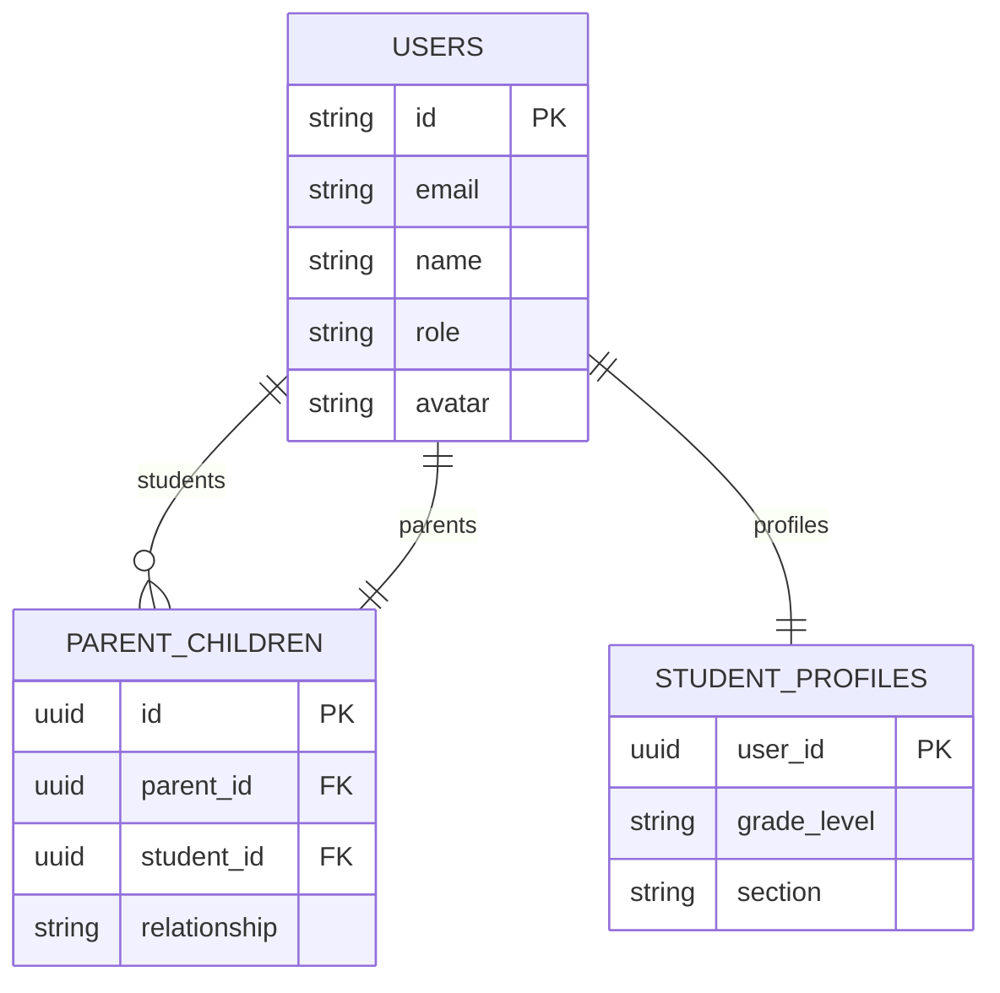
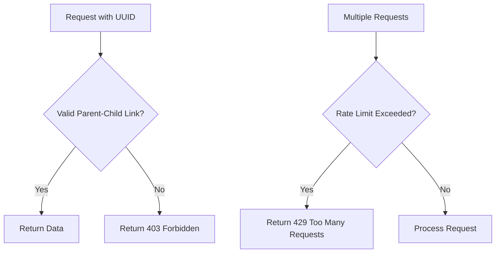
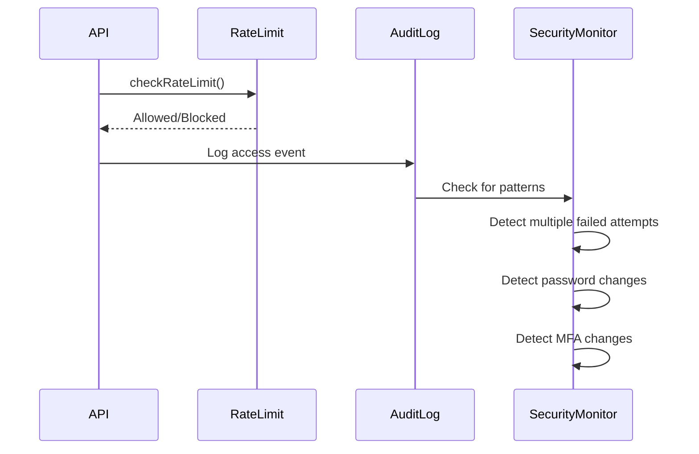

# Child Relationship Management API

<cite>
**Referenced Files in This Document**   
- [route.ts](file://app/api/parent/children/route.ts)
- [types.ts](file://lib/supabase/types.ts)
- [parent-store.ts](file://lib/parent-store.ts)
- [create_parent_tables.sql](file://supabase/migrations/20260105082250_create_parent_tables.sql)
- [rate-limit.ts](file://lib/rate-limit.ts)
- [audit-logs.ts](file://lib/supabase/audit-logs.ts)
- [security.ts](file://lib/security.ts)
- [layout.tsx](file://app/parent/layout.tsx)
- [page.tsx](file://app/parent/page.tsx)
</cite>

## Table of Contents
1. [Introduction](#introduction)
2. [Endpoint Overview](#endpoint-overview)
3. [Authentication and Authorization](#authentication-and-authorization)
4. [Response Payload Schema](#response-payload-schema)
5. [Data Isolation and Security](#data-isolation-and-security)
6. [Error Responses](#error-responses)
7. [Frontend Integration](#frontend-integration)
8. [Security Considerations](#security-considerations)
9. [Audit Logging](#audit-logging)

## Introduction
The Child Relationship Management API provides secure access to a parent's linked children within the school management system. This documentation details the GET endpoint that retrieves a list of children associated with the authenticated parent, including implementation details, security measures, and integration patterns. The API enforces strict data isolation through Supabase's Row Level Security (RLS) policies and implements comprehensive security measures including rate limiting and audit logging.

## Endpoint Overview
The children endpoint provides a secure way for authenticated parents to retrieve information about their linked children. The endpoint follows RESTful conventions and returns structured data suitable for dashboard displays and educational tracking.

**URL Structure**
- **Method**: GET
- **Path**: `/api/parent/children`
- **Authentication**: Required (Supabase JWT)
- **Response Format**: JSON

The endpoint retrieves child information by joining the parent_children relationship table with user and student profile data, ensuring parents can only access information about their own children.



**Diagram sources**
- [route.ts](file://app/api/parent/children/route.ts#L5-L73)

**Section sources**
- [route.ts](file://app/api/parent/children/route.ts#L5-L73)

## Authentication and Authorization
The API implements a multi-layered authentication and authorization process to ensure only legitimate parents can access their children's information.

**Authentication Flow**
1. The endpoint first verifies the presence of a valid Supabase JWT in the request
2. It retrieves the authenticated user's information from Supabase Auth
3. It validates that the user exists and has an active session
4. It queries the users table to verify the user's role is "parent"
5. Only users with the parent role are granted access to their children's data



**Diagram sources**
- [route.ts](file://app/api/parent/children/route.ts#L7-L21)

**Section sources**
- [route.ts](file://app/api/parent/children/route.ts#L7-L21)
- [types.ts](file://lib/types.ts#L5)

## Response Payload Schema
The API returns a structured JSON response containing comprehensive information about the parent's linked children. The response schema is defined in the Supabase types system and includes both user information and academic details.

**Response Structure**
```json
{
  "children": [
    {
      "id": "string",
      "name": "string",
      "email": "string",
      "avatar": "string | null",
      "grade": "string | null",
      "section": "string | null",
      "relationship": "mother | father | guardian | other"
    }
  ]
}
```

The response includes:
- **id**: The UUID of the child's user account
- **name**: Full name of the child
- **email**: Child's email address
- **avatar**: URL to the child's avatar image (if available)
- **grade**: Academic grade level of the child
- **section**: Class section of the child
- **relationship**: Nature of the parent-child relationship



**Diagram sources**
- [types.ts](file://lib/supabase/types.ts#L1-L253)
- [types.ts](file://lib/types.ts#L17)

**Section sources**
- [types.ts](file://lib/supabase/types.ts#L1-L253)
- [route.ts](file://app/api/parent/children/route.ts#L58-L65)

## Data Isolation and Security
The API implements robust data isolation mechanisms to prevent unauthorized access to student information. Through a combination of database design and Supabase RLS policies, the system ensures parents can only access information about their own children.

**Data Flow and JOINs**
The endpoint uses a two-step query process:
1. First, it queries the `parent_children` table to find all children linked to the authenticated parent
2. Then, it retrieves additional profile information from the `student_profiles` table for each child

This approach prevents enumeration of unlinked students and ensures data isolation at the database level.



**Diagram sources**
- [create_parent_tables.sql](file://supabase/migrations/20260105082250_create_parent_tables.sql#L6-L13)
- [route.ts](file://app/api/parent/children/route.ts#L26-L38)

**Section sources**
- [create_parent_tables.sql](file://supabase/migrations/20260105082250_create_parent_tables.sql#L6-L13)
- [route.ts](file://app/api/parent/children/route.ts#L26-L38)

## Error Responses
The API provides clear and informative error responses for various failure scenarios, helping clients handle errors appropriately.

**Error Types**
- **401 Unauthorized**: Returned when no valid authentication token is provided or the session is invalid
- **403 Forbidden**: Returned when the authenticated user exists but does not have the parent role
- **500 Internal Server Error**: Returned when an unexpected error occurs during processing
- **Empty Array Response**: When a parent has no linked children, the API returns `{ children: [] }` rather than an error

The error handling is implemented with appropriate HTTP status codes and descriptive error messages, while avoiding disclosure of sensitive system information.

**Section sources**
- [route.ts](file://app/api/parent/children/route.ts#L9-L11)
- [route.ts](file://app/api/parent/children/route.ts#L19-L21)
- [route.ts](file://app/api/parent/children/route.ts#L69-L72)

## Frontend Integration
The parent-store state management system provides a clean interface for frontend components to consume the children data and build responsive dashboard views.

**Integration Pattern**
The `useParentStore` hook manages parent and child relationship data, providing utility functions for:
- Retrieving a parent's children IDs
- Checking if a parent can view a specific student
- Getting parents associated with a student

```mermaid
flowchart TD
A[Parent Dashboard] --> B{useParentStore}
B --> C[getChildrenIds]
C --> D[Fetch Children Data]
D --> E[Display Child Selector]
E --> F[Load Child-Specific Data]
F --> G[Update Dashboard]
H[API Call] --> I[/api/parent/children]
I --> J[Supabase Query]
J --> K[Return Children]
K --> H
H --> B
```

**Diagram sources**
- [parent-store.ts](file://lib/parent-store.ts#L24-L65)
- [page.tsx](file://app/parent/page.tsx#L18-L38)

**Section sources**
- [parent-store.ts](file://lib/parent-store.ts#L24-L65)
- [page.tsx](file://app/parent/page.tsx#L18-L38)
- [layout.tsx](file://app/parent/layout.tsx#L11-L25)

## Security Considerations
The API implements multiple security layers to protect against common threats and ensure data privacy.

**Rate Limiting**
The system uses a rate limiting mechanism to prevent abuse:
- Implemented via the `rate_limits` table in Supabase
- Uses atomic RPC calls to prevent race conditions
- Allows configuration of limits and time windows
- Fail-open by default for availability, but can be configured to fail-closed for security-critical endpoints

**Protection Against UUID Probing**
The combination of RLS policies and the query structure prevents UUID probing attacks:
- The `parent_children` table policy restricts SELECT operations to rows where `parent_id = auth.uid()`
- This prevents enumeration of valid student UUIDs
- Even with a valid UUID, access is denied without the proper parent-child relationship



**Diagram sources**
- [rate-limit.ts](file://lib/rate-limit.ts#L25-L56)
- [create_parent_tables.sql](file://supabase/migrations/20260105082250_create_parent_tables.sql#L19-L20)

**Section sources**
- [rate-limit.ts](file://lib/rate-limit.ts#L25-L56)
- [create_parent_tables.sql](file://supabase/migrations/20260105082250_create_parent_tables.sql#L19-L20)

## Audit Logging
The system maintains comprehensive audit logs of all access events to support security monitoring and compliance requirements.

**Logging Implementation**
- All API access is logged in the `audit_logs` table
- Logs include user ID, action type, timestamp, and IP address (hashed for privacy)
- The system can detect and alert on suspicious activity patterns
- IP addresses are hashed using SHA-256 with a salt to protect user privacy while allowing abuse detection

**Security Event Detection**
The audit system can identify:
- Multiple failed login attempts within a short timeframe
- Password changes
- MFA configuration changes
- Suspicious access patterns that may indicate account compromise



**Diagram sources**
- [audit-logs.ts](file://lib/supabase/audit-logs.ts#L147-L226)
- [security.ts](file://lib/security.ts#L11-L14)

**Section sources**
- [audit-logs.ts](file://lib/supabase/audit-logs.ts#L147-L226)
- [security.ts](file://lib/security.ts#L11-L14)