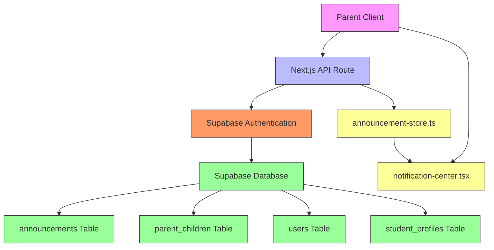
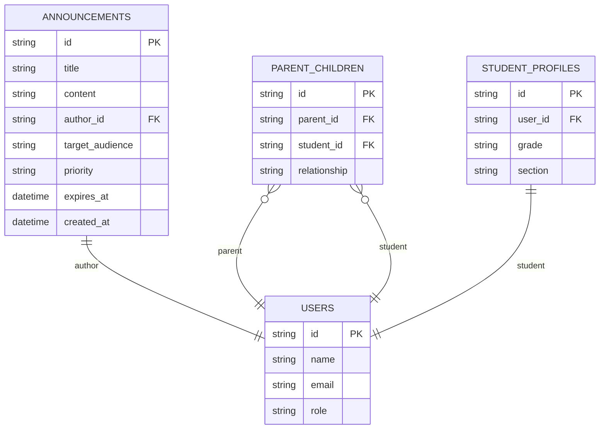
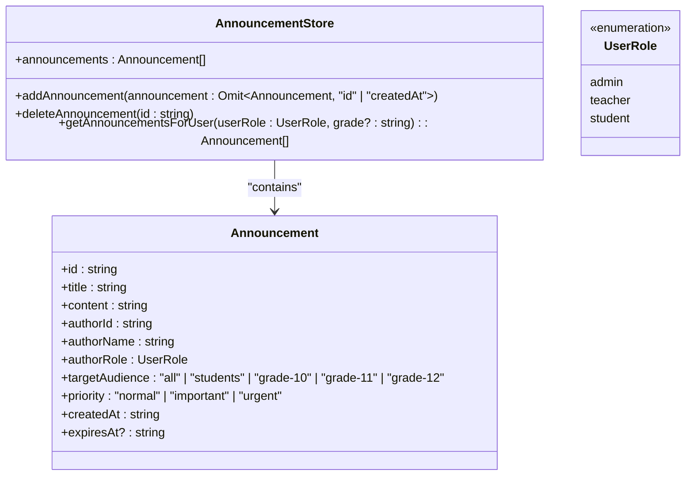
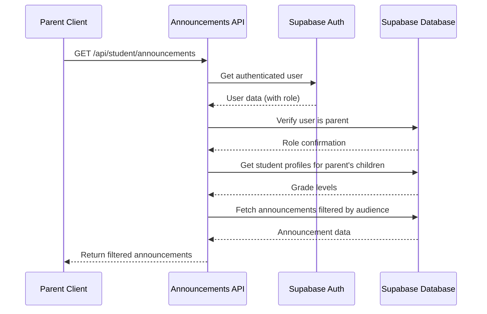
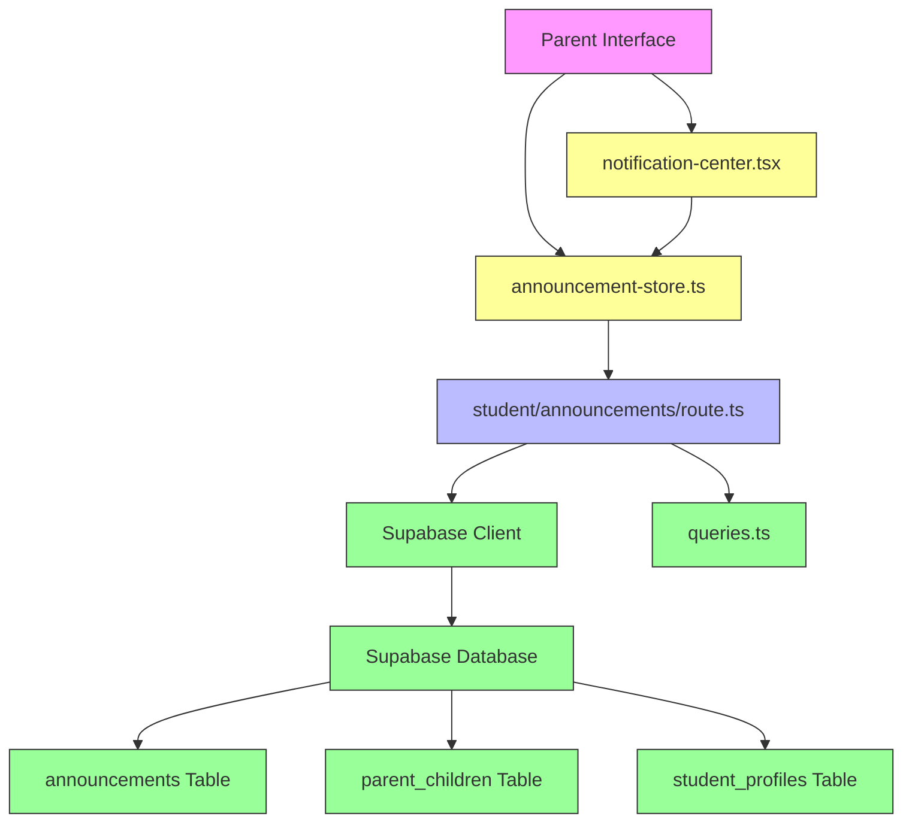

# Communication API

<cite>
**Referenced Files in This Document**   
- [announcement-store.ts](file://lib/announcement-store.ts)
- [notification-center.tsx](file://components/notification-center.tsx)
- [queries.ts](file://lib/supabase/queries.ts)
- [types.ts](file://lib/supabase/types.ts)
- [create_communication_tables.sql](file://supabase/migrations/20251219043609_create_communication_tables.sql)
- [create_parent_tables.sql](file://supabase/migrations/20260105000003_create_parent_tables.sql)
- [parent/announcements/page.tsx](file://app/parent/announcements/page.tsx)
- [student/announcements/route.ts](file://app/api/student/announcements/route.ts)
</cite>

## Table of Contents
1. [Introduction](#introduction)
2. [Project Structure](#project-structure)
3. [Core Components](#core-components)
4. [Architecture Overview](#architecture-overview)
5. [Detailed Component Analysis](#detailed-component-analysis)
6. [Dependency Analysis](#dependency-analysis)
7. [Performance Considerations](#performance-considerations)
8. [Troubleshooting Guide](#troubleshooting-guide)
9. [Conclusion](#conclusion)

## Introduction
This document provides comprehensive API documentation for the Parent API's communication endpoint, specifically focusing on the announcements system. The documentation covers the GET method used to fetch announcements relevant to a parent's linked children, including filtering logic based on class, grade level, or school-wide distribution. It details the authentication flow that validates the parent role and ensures announcements are scoped to their children's academic context. The response schema includes announcement title, content, timestamp, sender role, and associated metadata. The document also references integration with announcement-store.ts for client-side state management and notification-center.tsx for UI rendering.

## Project Structure
The project structure reveals a Next.js application with a clear separation of concerns between API routes, components, and utility libraries. The announcements functionality is distributed across several key directories: API routes in `/app/api`, UI components in `/components`, and business logic in `/lib`. The parent-specific announcements are handled through the parent role implementation and relationship mapping between parents and students.

```mermaid
graph TB
subgraph "API Routes"
A[/app/api]
A1[student/announcements/route.ts]
A2[announcements/create/route.ts]
A3[admin/link-parent-child/route.ts]
end
subgraph "Components"
B[components]
B1[notification-center.tsx]
end
subgraph "Libraries"
C[lib]
C1[announcement-store.ts]
C2[supabase/queries.ts]
C3[supabase/types.ts]
end
subgraph "Database"
D[supabase/migrations]
D1[create_communication_tables.sql]
D2[create_parent_tables.sql]
end
A --> C2
B --> C1
C1 --> A1
D1 --> A1
D2 --> A1
```

**Diagram sources**
- [student/announcements/route.ts](file://app/api/student/announcements/route.ts)
- [announcement-store.ts](file://lib/announcement-store.ts)
- [create_communication_tables.sql](file://supabase/migrations/20251219043609_create_communication_tables.sql)
- [create_parent_tables.sql](file://supabase/migrations/20260105000003_create_parent_tables.sql)

**Section sources**
- [app/api](file://app/api)
- [components](file://components)
- [lib](file://lib)
- [supabase/migrations](file://supabase/migrations)

## Core Components
The core components of the communication API include the announcement data model, the parent-child relationship system, and the client-side state management. The announcement system is built on Supabase with proper Row Level Security (RLS) policies to ensure data privacy. The parent role has been added to the users table with specific policies that allow parents to access their children's data through the parent_children junction table. Client-side state is managed using Zustand stores, specifically the announcement-store.ts which handles the reactive state for announcements.

**Section sources**
- [announcement-store.ts](file://lib/announcement-store.ts)
- [types.ts](file://lib/supabase/types.ts)
- [create_communication_tables.sql](file://supabase/migrations/20251219043609_create_communication_tables.sql)

## Architecture Overview
The communication API follows a layered architecture with clear separation between the frontend, API layer, and database. The system leverages Supabase for both database storage and authentication, with Next.js API routes serving as the middleware layer. The architecture ensures that parents can only access announcements relevant to their linked children through a combination of server-side filtering and database-level security policies.



**Diagram sources**
- [student/announcements/route.ts](file://app/api/student/announcements/route.ts)
- [announcement-store.ts](file://lib/announcement-store.ts)
- [notification-center.tsx](file://components/notification-center.tsx)
- [create_communication_tables.sql](file://supabase/migrations/20251219043609_create_communication_tables.sql)
- [create_parent_tables.sql](file://supabase/migrations/20260105000003_create_parent_tables.sql)

## Detailed Component Analysis

### Announcement Data Model
The announcement system is built around a well-defined data model that supports targeted communication across different audience segments. The model includes fields for content, metadata, and targeting information.



**Diagram sources**
- [create_communication_tables.sql](file://supabase/migrations/20251219043609_create_communication_tables.sql)
- [create_parent_tables.sql](file://supabase/migrations/20260105000003_create_parent_tables.sql)
- [types.ts](file://lib/supabase/types.ts)

### Client-Side State Management
The client-side state management for announcements is implemented using Zustand, providing a lightweight and efficient solution for managing reactive state across the application.



**Diagram sources**
- [announcement-store.ts](file://lib/announcement-store.ts)

### API Endpoint Flow
The API endpoint for fetching announcements follows a secure authentication and authorization flow, ensuring that parents only receive announcements relevant to their linked children.



**Diagram sources**
- [student/announcements/route.ts](file://app/api/student/announcements/route.ts)
- [queries.ts](file://lib/supabase/queries.ts)

## Dependency Analysis
The communication API has well-defined dependencies between components, with clear separation of concerns. The system relies on Supabase for database operations and authentication, Next.js for server-side rendering and API routes, and various UI component libraries for the frontend interface.



**Diagram sources**
- [announcement-store.ts](file://lib/announcement-store.ts)
- [student/announcements/route.ts](file://app/api/student/announcements/route.ts)
- [queries.ts](file://lib/supabase/queries.ts)
- [create_communication_tables.sql](file://supabase/migrations/20251219043609_create_communication_tables.sql)
- [create_parent_tables.sql](file://supabase/migrations/20260105000003_create_parent_tables.sql)

## Performance Considerations
The system incorporates several performance optimizations to ensure efficient delivery of announcements to parents. These include proper database indexing, client-side caching through Zustand stores, and optimized database queries that minimize data transfer.

### Database Indexing
The database schema includes strategic indexes to optimize query performance for common access patterns:

- Index on `parent_children.parent_id` for efficient retrieval of a parent's children
- Index on `parent_children.student_id` for efficient lookup of students' parents
- Composite index on `announcements.created_at` and `target_audience` for fast filtering and sorting

### Caching Strategy
The client-side implementation uses Zustand for state management, which provides built-in caching capabilities. When a parent accesses the announcements page, the data is cached in the browser, reducing the need for repeated API calls during the same session.

### Query Optimization
The backend queries are optimized to fetch only the necessary data:

- Select statements specify only required fields rather than using SELECT *
- JOIN operations are limited to essential relationships
- Filtering is performed at the database level to minimize data transfer

**Section sources**
- [queries.ts](file://lib/supabase/queries.ts)
- [create_parent_tables.sql](file://supabase/migrations/20260105000003_create_parent_tables.sql)
- [create_communication_tables.sql](file://supabase/migrations/20251219043609_create_communication_tables.sql)

## Troubleshooting Guide
This section addresses common issues that may arise when using the Parent API's communication endpoint and provides guidance for resolution.

### Authentication Issues
If a parent cannot access announcements, verify the following:
- The user account has the "parent" role assigned
- The parent-child relationship is properly established in the parent_children table
- The authentication token is valid and not expired

### Empty Results
When no announcements are returned, check:
- The parent has children linked in the system
- The children have valid grade levels in their student profiles
- There are announcements in the database that match the target audience criteria

### Permission Denials
For permission-related errors:
- Verify the RLS policies are correctly configured in Supabase
- Ensure the parent_children table has the correct entries linking the parent to their children
- Check that the user's role is properly set in the users table

**Section sources**
- [student/announcements/route.ts](file://app/api/student/announcements/route.ts)
- [create_parent_tables.sql](file://supabase/migrations/20260105000003_create_parent_tables.sql)
- [create_communication_tables.sql](file://supabase/migrations/20251219043609_create_communication_tables.sql)

## Conclusion
The Parent API's communication endpoint provides a robust and secure system for delivering announcements to parents based on their children's academic context. The implementation leverages Supabase's RLS policies to ensure data privacy while providing flexible targeting options through the target_audience field. The client-side state management with Zustand ensures efficient rendering and caching, while the database schema is optimized for performance with proper indexing and query patterns. The system successfully addresses the requirements for role-based access control, audience targeting, and secure data delivery.