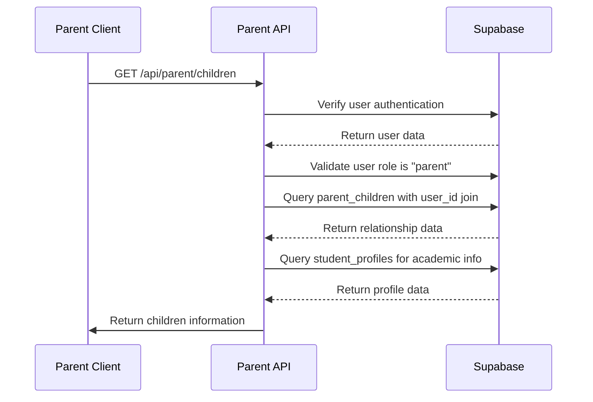
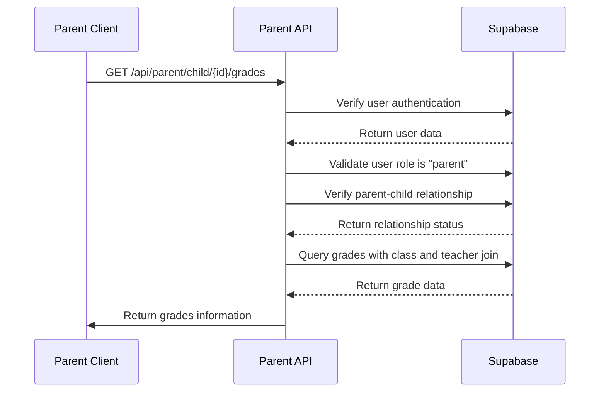
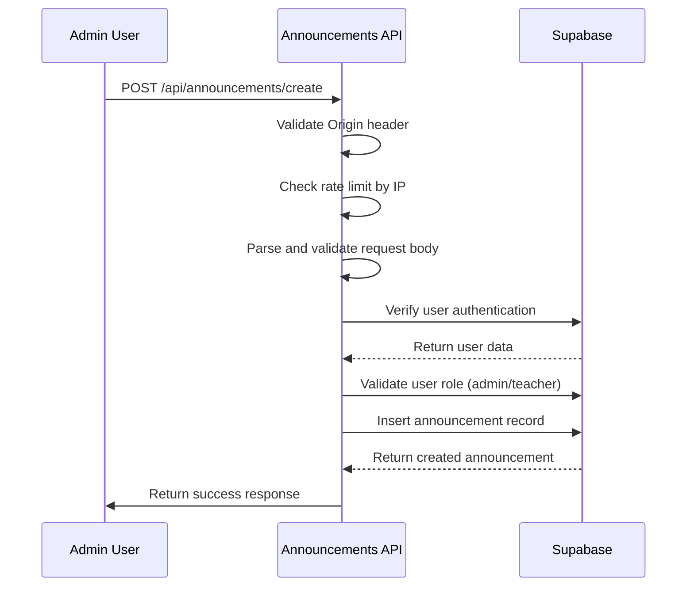
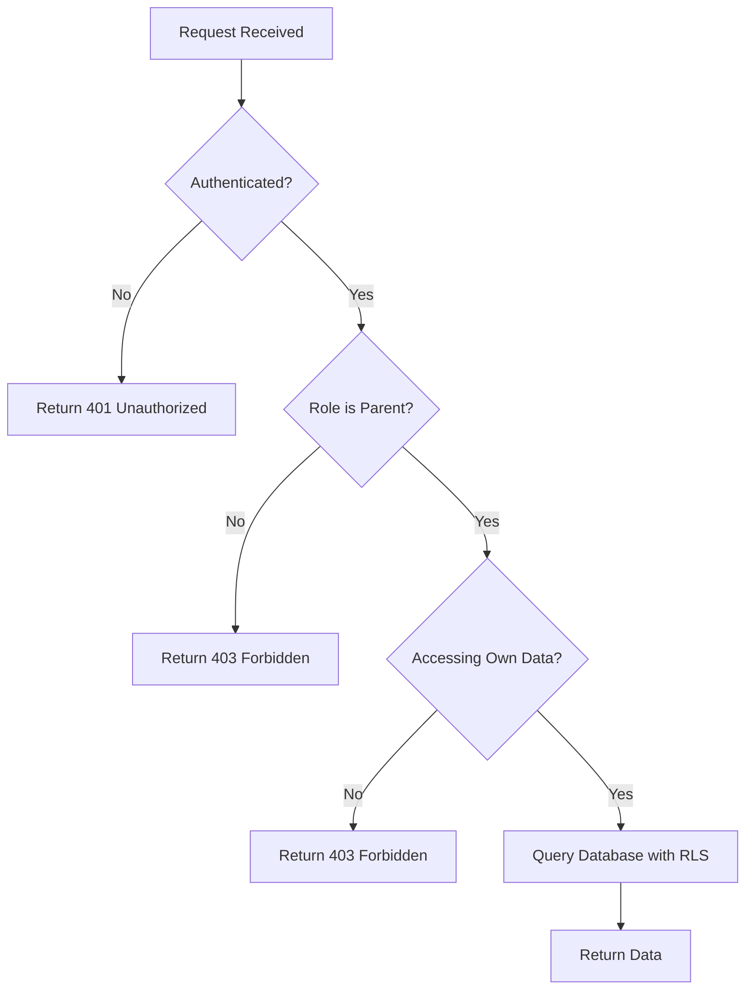
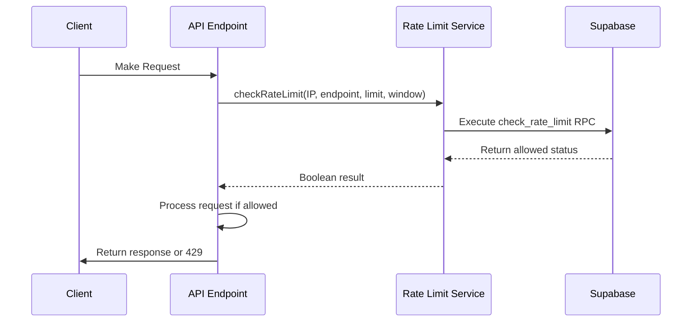
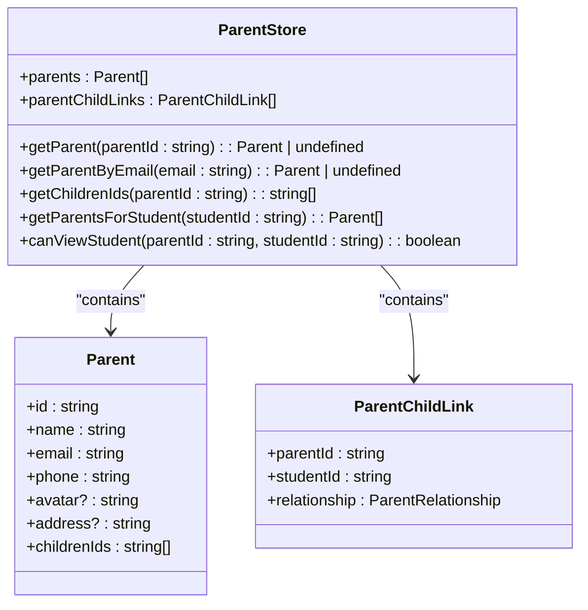

# Parent API

<cite>
**Referenced Files in This Document**   
- [children/route.ts](file://app/api/parent/children/route.ts)
- [child/[id]/grades/route.ts](file://app/api/parent/child/[id]/grades/route.ts)
- [child/[id]/attendance/route.ts](file://app/api/parent/child/[id]/attendance/route.ts)
- [types.ts](file://lib/supabase/types.ts)
- [parent-store.ts](file://lib/parent-store.ts)
- [progress-analytics.tsx](file://components/progress-analytics.tsx)
- [announcements/create/route.ts](file://app/api/announcements/create/route.ts)
- [announcements/delete/route.ts](file://app/api/announcements/delete/route.ts)
- [announcement-store.ts](file://lib/announcement-store.ts)
- [rate-limit.ts](file://lib/rate-limit.ts)
- [security.ts](file://lib/security.ts)
</cite>

## Table of Contents
1. [Introduction](#introduction)
2. [Child Relationship Management](#child-relationship-management)
3. [Academic Monitoring](#academic-monitoring)
4. [Communication and Announcements](#communication-and-announcements)
5. [Data Access Control Mechanism](#data-access-control-mechanism)
6. [Response Structure for Academic Data](#response-structure-for-academic-data)
7. [Error Handling and Rate Limiting](#error-handling-and-rate-limiting)
8. [Integration Examples](#integration-examples)
9. [Security Model](#security-model)

## Introduction
The Parent API provides secure access for parents to monitor their children's academic progress, attendance records, and school communications. This documentation details the endpoints, authentication requirements, data structures, and security mechanisms that ensure parents can only access information related to their linked children through proper authorization and relationship verification.

**Section sources**
- [children/route.ts](file://app/api/parent/children/route.ts#L1-L74)
- [types.ts](file://lib/supabase/types.ts#L1-L253)

## Child Relationship Management
The child relationship management endpoint allows parents to retrieve information about their linked children. This includes basic student information, grade level, section, and relationship type.

### Endpoint Details
- **HTTP Method**: GET
- **URL Structure**: `/api/parent/children`
- **Authentication**: Required (parent role validation)
- **Response Format**: JSON with children array containing id, name, email, avatar, grade, section, and relationship

The endpoint first verifies the user's authentication status and confirms their role is "parent". It then queries the `parent_children` table to find all relationships where the authenticated user is the parent, joining with the users table to get student details and with student_profiles to get academic information.



**Diagram sources**
- [children/route.ts](file://app/api/parent/children/route.ts#L1-L74)

**Section sources**
- [children/route.ts](file://app/api/parent/children/route.ts#L1-L74)
- [types.ts](file://lib/supabase/types.ts#L38-L105)

## Academic Monitoring
The academic monitoring endpoints provide access to a child's grades and attendance records. These endpoints require both role validation and explicit relationship verification to ensure data privacy.

### Grades Endpoint
- **HTTP Method**: GET
- **URL Structure**: `/api/parent/child/[id]/grades`
- **Authentication**: Required (parent role validation)
- **Authorization**: Parent-child relationship verification
- **Response Format**: JSON with grades array containing score, max_score, percentage, grade, type, date, and class information

### Attendance Endpoint
- **HTTP Method**: GET
- **URL Structure**: `/api/parent/child/[id]/attendance`
- **Authentication**: Required (parent role validation)
- **Authorization**: Parent-child relationship verification
- **Query Parameters**: startDate, endDate (optional date filtering)
- **Response Format**: JSON with attendance array and calculated statistics



**Diagram sources**
- [child/[id]/grades/route.ts](file://app/api/parent/child/[id]/grades/route.ts#L1-L61)
- [child/[id]/attendance/route.ts](file://app/api/parent/child/[id]/attendance/route.ts#L1-L79)

**Section sources**
- [child/[id]/grades/route.ts](file://app/api/parent/child/[id]/grades/route.ts#L1-L61)
- [child/[id]/attendance/route.ts](file://app/api/parent/child/[id]/attendance/route.ts#L1-L79)
- [types.ts](file://lib/supabase/types.ts#L135-L146)

## Communication and Announcements
The announcement system allows school administrators and teachers to communicate with parents and students. Parents can view announcements relevant to their children through the frontend components.

### Announcement Creation
- **HTTP Method**: POST
- **URL Structure**: `/api/announcements/create`
- **Authentication**: Required (admin or teacher role)
- **Security Features**: CSRF protection, rate limiting, input validation
- **Rate Limit**: 5 requests per minute per IP
- **Validation**: Zod schema validation for input data

### Announcement Deletion
- **HTTP Method**: POST
- **URL Structure**: `/api/announcements/delete`
- **Authentication**: Required (admin role only)
- **Security Features**: CSRF protection, role-based access control



**Diagram sources**
- [announcements/create/route.ts](file://app/api/announcements/create/route.ts#L1-L81)
- [announcements/delete/route.ts](file://app/api/announcements/delete/route.ts#L1-L54)

**Section sources**
- [announcements/create/route.ts](file://app/api/announcements/create/route.ts#L1-L81)
- [announcements/delete/route.ts](file://app/api/announcements/delete/route.ts#L1-L54)
- [announcement-store.ts](file://lib/announcement-store.ts#L1-L60)

## Data Access Control Mechanism
The Parent API implements a robust data access control mechanism that ensures parents can only view information about their linked children through multiple layers of security.

### Authentication and Role Validation
All endpoints first verify the user's authentication status by checking the Supabase auth session. They then validate that the user has the "parent" role by querying the users table. This prevents unauthorized access from students, teachers, or unauthenticated users.

### Relationship Verification
Before returning any child-specific data, the API verifies the parent-child relationship by querying the `parent_children` table. This JOIN query ensures that parents cannot access information about students they are not linked to, preventing enumeration of unlinked students.

### RLS Policies
The system leverages Row Level Security (RLS) policies in Supabase to enforce data access rules at the database level. These policies ensure that even if an endpoint were compromised, direct database queries would still be restricted by the user's role and relationships.



**Diagram sources**
- [children/route.ts](file://app/api/parent/children/route.ts#L1-L74)
- [child/[id]/grades/route.ts](file://app/api/parent/child/[id]/grades/route.ts#L1-L61)
- [child/[id]/attendance/route.ts](file://app/api/parent/child/[id]/attendance/route.ts#L1-L79)

**Section sources**
- [children/route.ts](file://app/api/parent/children/route.ts#L1-L74)
- [child/[id]/grades/route.ts](file://app/api/parent/child/[id]/grades/route.ts#L1-L61)
- [child/[id]/attendance/route.ts](file://app/api/parent/child/[id]/attendance/route.ts#L1-L79)
- [security.ts](file://lib/security.ts#L1-L136)

## Response Structure for Academic Data
The academic data endpoints return structured responses that include both raw records and calculated metrics for easy consumption by frontend components.

### Grades Response Structure
```json
{
  "grades": [
    {
      "id": "string",
      "student_id": "string",
      "class_id": "string",
      "score": "number",
      "max_score": "number",
      "percentage": "number",
      "grade": "number",
      "type": "exam|quiz|assignment|project",
      "date": "string",
      "class": {
        "id": "string",
        "name": "string",
        "subject": "string"
      },
      "teacher": {
        "id": "string",
        "name": "string"
      }
    }
  ]
}
```

### Attendance Response Structure
```json
{
  "attendance": [
    {
      "id": "string",
      "student_id": "string",
      "class_id": "string",
      "date": "string",
      "status": "present|absent|late|excused",
      "class": {
        "id": "string",
        "name": "string",
        "subject": "string"
      }
    }
  ],
  "stats": {
    "total": "number",
    "present": "number",
    "absent": "number",
    "late": "number",
    "excused": "number",
    "attendanceRate": "number"
  }
}
```

The attendance statistics are calculated using the `calculateAttendanceStats` utility function, which processes the raw attendance records to provide meaningful metrics for parents.

**Section sources**
- [child/[id]/grades/route.ts](file://app/api/parent/child/[id]/grades/route.ts#L1-L61)
- [child/[id]/attendance/route.ts](file://app/api/parent/child/[id]/attendance/route.ts#L1-L79)
- [types.ts](file://lib/supabase/types.ts#L126-L133)
- [attendance-utils.ts](file://lib/attendance-utils.ts)

## Error Handling and Rate Limiting
The Parent API implements comprehensive error handling and rate limiting to ensure system stability and security.

### Error Handling
The API returns appropriate HTTP status codes for different error conditions:
- 401 Unauthorized: Authentication required
- 403 Forbidden: Insufficient permissions or unauthorized access
- 400 Bad Request: Invalid input parameters
- 429 Too Many Requests: Rate limit exceeded
- 500 Internal Server Error: Unexpected server errors

Error responses include descriptive messages that help clients understand the issue without revealing sensitive system information.

### Rate Limiting Configuration
The system implements rate limiting using Supabase's RPC functions and a service role key for reliable access:

- **Announcement Creation**: 5 requests per minute per IP address
- **Implementation**: Uses `check_rate_limit` RPC with identifier, endpoint, limit, and window parameters
- **Fail-Open Policy**: Returns true on database errors to maintain availability while logging issues



**Diagram sources**
- [rate-limit.ts](file://lib/rate-limit.ts#L1-L56)
- [announcements/create/route.ts](file://app/api/announcements/create/route.ts#L1-L81)

**Section sources**
- [rate-limit.ts](file://lib/rate-limit.ts#L1-L56)
- [security.ts](file://lib/security.ts#L1-L136)
- [announcements/create/route.ts](file://app/api/announcements/create/route.ts#L1-L81)

## Integration Examples
The Parent API is integrated with various frontend components to provide a seamless user experience for parents.

### Parent Store Integration
The `useParentStore` Zustand store manages parent-related state and provides utility functions for client-side operations:

- `getChildrenIds`: Retrieves the IDs of children linked to a parent
- `canViewStudent`: Checks if a parent can view a specific student's data
- `getParentByEmail`: Finds a parent by email address



**Diagram sources**
- [parent-store.ts](file://lib/parent-store.ts#L1-L65)

### Progress Analytics Integration
The `ProgressAnalytics` component integrates with the Parent API to display comprehensive academic performance data:

- Fetches grade trends, attendance records, and subject performance
- Calculates overall averages and improvement rates
- Visualizes data using Recharts components
- Handles loading states and empty data conditions

The component fetches data from the `/api/analytics/student/{id}` endpoint, which aggregates information from multiple sources to provide a holistic view of student progress.

**Section sources**
- [parent-store.ts](file://lib/parent-store.ts#L1-L65)
- [progress-analytics.tsx](file://components/progress-analytics.tsx#L1-L189)

## Security Model
The Parent API implements a multi-layered security model to protect sensitive student information and prevent unauthorized access.

### Authentication and Authorization
- JWT-based authentication through Supabase Auth
- Role-based access control (RBAC) with parent role validation
- Per-request role verification to prevent privilege escalation

### Data Access Security
- Explicit parent-child relationship verification for all child data access
- JOIN queries with relationship tables to ensure data isolation
- Prevention of student enumeration by returning 403 for unlinked students rather than 404

### Anti-Enumeration Protections
The system prevents attackers from enumerating student accounts by:
- Returning consistent error messages for unauthorized access attempts
- Not distinguishing between non-existent students and unlinked students
- Implementing rate limiting to prevent brute force attacks

### Input Validation and Sanitization
- Zod schema validation for all input data
- CSRF protection through origin validation
- Secure handling of user-provided content to prevent XSS attacks

The security model ensures that parents can only access their children's information while maintaining the privacy of all other students in the system.

**Section sources**
- [security.ts](file://lib/security.ts#L1-L136)
- [rate-limit.ts](file://lib/rate-limit.ts#L1-L56)
- [children/route.ts](file://app/api/parent/children/route.ts#L1-L74)
- [child/[id]/grades/route.ts](file://app/api/parent/child/[id]/grades/route.ts#L1-L61)
- [child/[id]/attendance/route.ts](file://app/api/parent/child/[id]/attendance/route.ts#L1-L79)