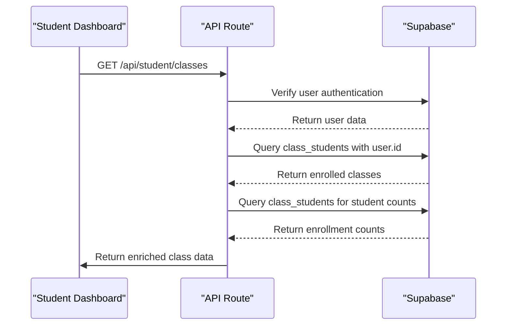
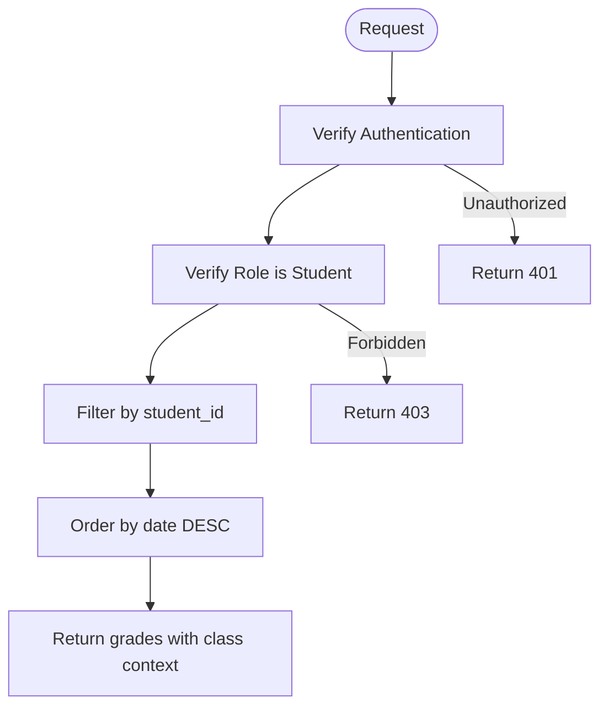
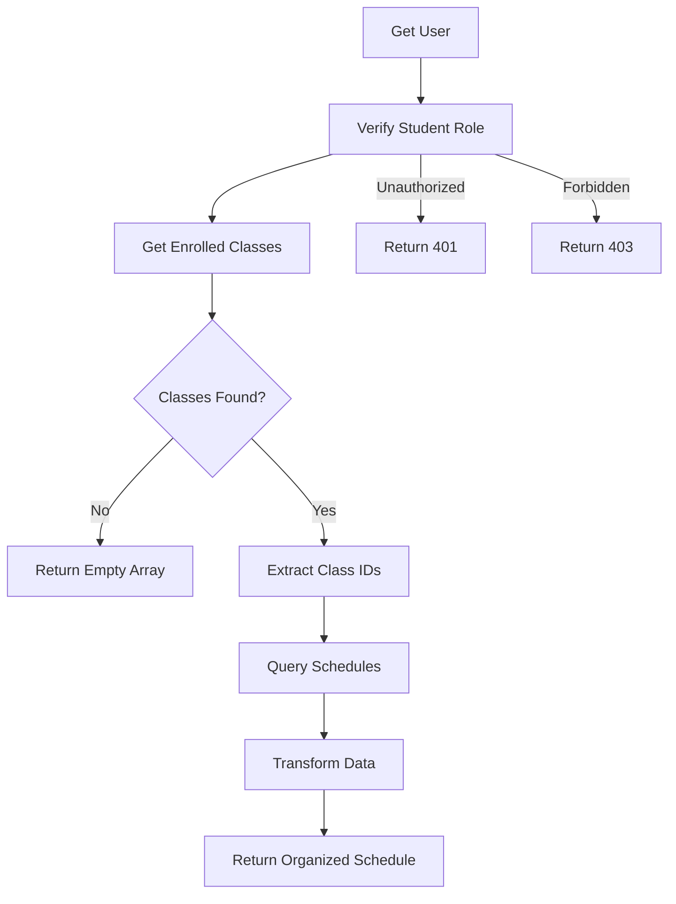
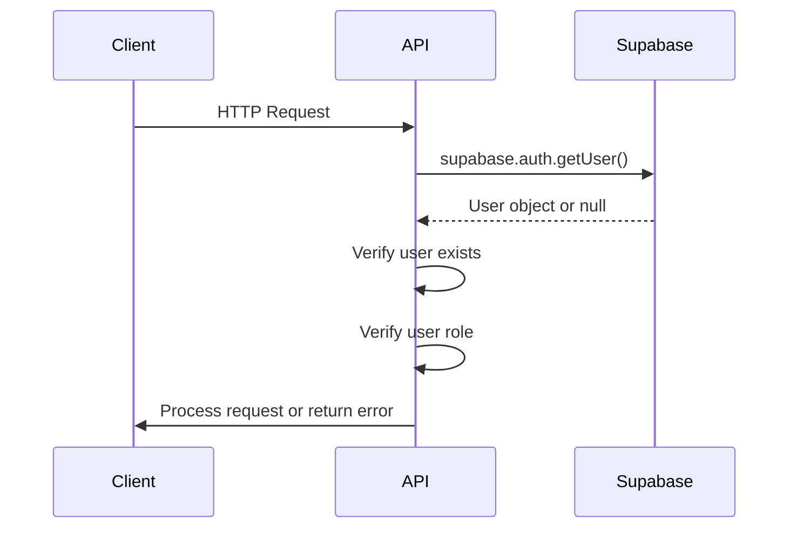
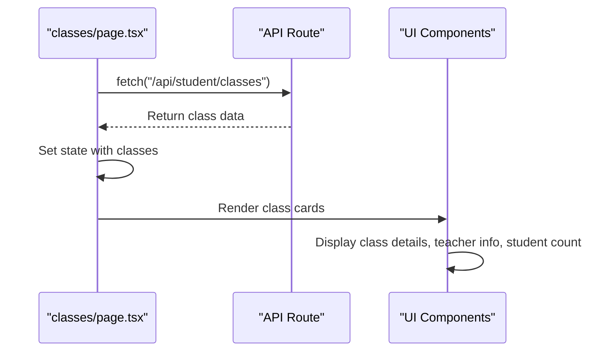
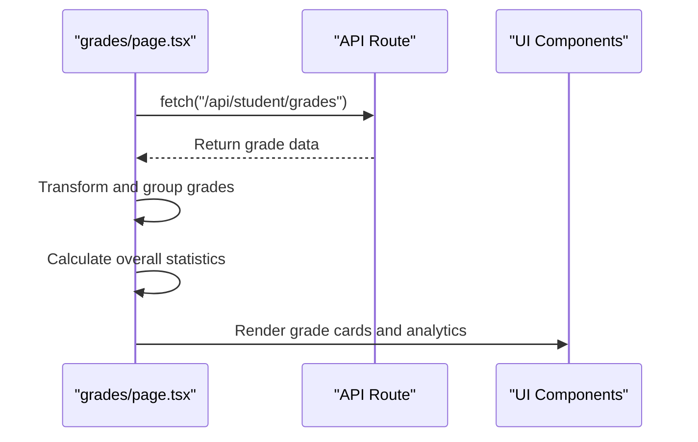

# Academics API

<cite>
**Referenced Files in This Document**   
- [route.ts](file://app/api/student/classes/route.ts)
- [route.ts](file://app/api/student/grades/route.ts)
- [route.ts](file://app/api/student/schedule/route.ts)
- [types.ts](file://lib/supabase/types.ts)
- [page.tsx](file://app/student/classes/page.tsx)
- [page.tsx](file://app/student/grades/page.tsx)
- [page.tsx](file://app/student/schedule/page.tsx)
- [server.ts](file://lib/supabase/server.ts)
</cite>

## Table of Contents
1. [Introduction](#introduction)
2. [Core Endpoints](#core-endpoints)
3. [GET /api/student/classes](#get-apistudentclasses)
4. [GET /api/student/grades](#get-apistudentgrades)
5. [GET /api/student/schedule](#get-apistudentschedule)
6. [Data Models](#data-models)
7. [Authentication and Security](#authentication-and-security)
8. [Error Handling](#error-handling)
9. [Frontend Integration](#frontend-integration)
10. [Real-time Updates](#real-time-updates)

## Introduction
The Academics API provides secure access to student academic data including enrolled classes, graded assessments, and class schedules. This documentation details the three primary endpoints used by student dashboard components to retrieve enriched academic information with proper role-based access control, data filtering, and transformation for frontend consumption.

## Core Endpoints
The Academics API exposes three primary endpoints for student academic data retrieval:

- **GET /api/student/classes**: Retrieves enrolled classes with teacher details and student counts
- **GET /api/student/grades**: Fetches graded assessments with class context and performance metrics
- **GET /api/student/schedule**: Returns class schedules organized by day and time

All endpoints implement secure authentication, role verification, and server-side data filtering to ensure students can only access their own academic information.

## GET /api/student/classes
Retrieves a list of classes in which the authenticated student is enrolled, including teacher details and student enrollment counts.

### Endpoint Details
- **HTTP Method**: GET
- **URL Pattern**: `/api/student/classes`
- **Authentication Required**: Yes
- **Role Required**: student

### Request Flow


**Diagram sources**
- [route.ts](file://app/api/student/classes/route.ts#L4-L66)

### Response Schema
The response follows the DbClass interface structure with additional enrichment:

```json
{
  "classes": [
    {
      "id": "string",
      "name": "string",
      "subject": "string",
      "schedule": "string | null",
      "room": "string | null",
      "teacher_name": "string | null",
      "teacher_avatar": "string | null",
      "student_count": "number"
    }
  ]
}
```

### Data Enrichment Logic
The endpoint performs two-phase data enrichment:
1. First, it retrieves the student's enrolled classes with teacher information via a joined query on `class_students` and `classes` tables
2. Then, it queries all enrollments for the enrolled class IDs to count total students per class

This two-step process ensures accurate student counts while maintaining proper data isolation.

**Section sources**
- [route.ts](file://app/api/student/classes/route.ts#L4-L66)

## GET /api/student/grades
Fetches all graded assessments for the authenticated student, including class context and assessment details.

### Endpoint Details
- **HTTP Method**: GET
- **URL Pattern**: `/api/student/grades`
- **Authentication Required**: Yes
- **Role Required**: student

### Security Implementation


**Diagram sources**
- [route.ts](file://app/api/student/grades/route.ts#L4-L40)

### Response Schema
The response follows the DbGrade interface with class context:

```json
{
  "grades": [
    {
      "id": "string",
      "class_id": "string",
      "type": "exam | quiz | assignment | project",
      "score": "number",
      "max_score": "number",
      "percentage": "number",
      "grade": "number",
      "date": "string",
      "class": {
        "name": "string"
      }
    }
  ]
}
```

### Role-based Access Control
The endpoint implements strict role-based access control:
1. Verifies the user is authenticated
2. Queries the users table to confirm the user's role is "student"
3. Only proceeds if role verification passes
4. Applies a server-side filter ensuring only grades for the authenticated student are returned

This multi-layered approach prevents unauthorized access even if a non-student attempts to call the endpoint.

**Section sources**
- [route.ts](file://app/api/student/grades/route.ts#L4-L40)

## GET /api/student/schedule
Returns the class schedule for the authenticated student, organized by day and time for frontend display.

### Endpoint Details
- **HTTP Method**: GET
- **URL Pattern**: `/api/student/schedule`
- **Authentication Required**: Yes
- **Role Required**: student

### Data Transformation


**Diagram sources**
- [route.ts](file://app/api/student/schedule/route.ts#L4-L64)

### Response Schema
The response follows the DbSchedule interface with transformed class data:

```json
{
  "schedule": [
    {
      "id": "string",
      "day": "string",
      "start_time": "string",
      "end_time": "string",
      "room": "string | null",
      "class_name": "string",
      "subject": "string",
      "teacher_name": "string | null"
    }
  ]
}
```

### Transformation Logic
The endpoint performs the following transformation steps:
1. Retrieves the student's enrolled class IDs from the `class_students` table
2. Queries the `schedules` table for all schedules associated with those class IDs
3. Joins with the `classes` and `users` tables to enrich with class and teacher names
4. Transforms the data to flatten the nested structure into a frontend-friendly format
5. Orders results by day and start_time for chronological display

The transformation makes the data immediately consumable by frontend components without additional processing.

**Section sources**
- [route.ts](file://app/api/student/schedule/route.ts#L4-L64)

## Data Models
The API endpoints utilize the following data models defined in the Supabase types system.

### DbClass Interface
Represents a class entity with its properties:

```typescript
interface DbClass {
  id: string
  name: string
  grade: string
  section: string
  teacher_id: string | null
  subject: string
  schedule: string | null
  room: string | null
  created_at: string
}
```

**Section sources**
- [types.ts](file://lib/supabase/types.ts#L114-L124)

### DbGrade Interface
Represents a graded assessment with its properties:

```typescript
interface DbGrade {
  id: string
  student_id: string | null
  class_id: string | null
  score: number
  max_score: number
  percentage: number
  grade: number
  type: "exam" | "quiz" | "assignment" | "project"
  date: string
  created_at: string
}
```

**Section sources**
- [types.ts](file://lib/supabase/types.ts#L135-L146)

### DbSchedule Interface
Represents a class schedule entry with its properties:

```typescript
interface DbSchedule {
  id: string
  class_id: string | null
  day: string
  start_time: string
  end_time: string
  room: string | null
}
```

**Section sources**
- [types.ts](file://lib/supabase/types.ts#L148-L155)

## Authentication and Security
The Academics API implements a robust authentication and security framework to protect student data.

### Authentication Flow
All endpoints use Supabase authentication with server-side verification:



**Diagram sources**
- [server.ts](file://lib/supabase/server.ts#L5-L30)
- [route.ts](file://app/api/student/classes/route.ts#L7-L11)
- [route.ts](file://app/api/student/grades/route.ts#L7-L11)
- [route.ts](file://app/api/student/schedule/route.ts#L7-L11)

### Security Measures
The API implements multiple security layers:
- **Authentication Verification**: All endpoints verify the user is authenticated
- **Role-based Access Control**: Endpoints verify the user has the "student" role
- **Server-side Filtering**: Data queries are filtered by the authenticated user's ID
- **Row Level Security**: Supabase RLS policies prevent unauthorized data access
- **Error Handling**: Generic error messages prevent information leakage

These measures ensure that students can only access their own academic data.

**Section sources**
- [server.ts](file://lib/supabase/server.ts#L5-L30)
- [route.ts](file://app/api/student/classes/route.ts#L7-L11)
- [route.ts](file://app/api/student/grades/route.ts#L7-L22)
- [route.ts](file://app/api/student/schedule/route.ts#L7-L22)

## Error Handling
The API implements comprehensive error handling for various failure scenarios.

### Error Types
The endpoints handle the following error conditions:

| Status Code | Error Type | Description |
|-------------|------------|-------------|
| 401 | Unauthorized | User is not authenticated |
| 403 | Forbidden | User is authenticated but not a student |
| 500 | Internal Server Error | Unexpected server error occurred |

### Empty Dataset Handling
Each endpoint handles empty datasets appropriately:
- **Classes endpoint**: Returns `{ classes: [] }` when no enrollments exist
- **Grades endpoint**: Returns `{ grades: [] }` when no grades exist
- **Schedule endpoint**: Returns `{ schedule: [] }` when no schedules exist

This ensures consistent behavior and prevents frontend errors when students have no data.

**Section sources**
- [route.ts](file://app/api/student/classes/route.ts#L25-L27)
- [route.ts](file://app/api/student/grades/route.ts#L36-L37)
- [route.ts](file://app/api/student/schedule/route.ts#L30-L32)

## Frontend Integration
The Academics API endpoints are consumed by student dashboard components for data display.

### Classes Page Integration
The student classes page uses the `/api/student/classes` endpoint:



**Section sources**
- [page.tsx](file://app/student/classes/page.tsx#L41-L47)

### Grades Page Integration
The student grades page uses the `/api/student/grades` endpoint:



**Section sources**
- [page.tsx](file://app/student/grades/page.tsx#L47-L52)

### Usage Examples
The frontend components follow a consistent pattern for API integration:

```typescript
const response = await fetch("/api/student/classes")
if (!response.ok) throw new Error("Failed to fetch classes")
const data = await response.json()
setClasses(data.classes)
```

This pattern ensures proper error handling and data extraction from the API responses.

**Section sources**
- [page.tsx](file://app/student/classes/page.tsx#L41-L47)
- [page.tsx](file://app/student/grades/page.tsx#L47-L52)
- [page.tsx](file://app/student/schedule/page.tsx)

## Real-time Updates
The system supports real-time updates through Supabase subscriptions, though the documented endpoints are request-response based.

### Real-time Capabilities
While the GET endpoints are not real-time, the underlying Supabase implementation supports real-time functionality:

- **Supabase Realtime**: Enabled for specific tables via publication
- **Row Level Security**: Applied to real-time subscriptions
- **Client Subscriptions**: Available for tables with real-time enabled

The current student academic endpoints use traditional request-response patterns for data retrieval, ensuring consistency and reliability.

**Section sources**
- [server.ts](file://lib/supabase/server.ts)
- [types.ts](file://lib/supabase/types.ts)