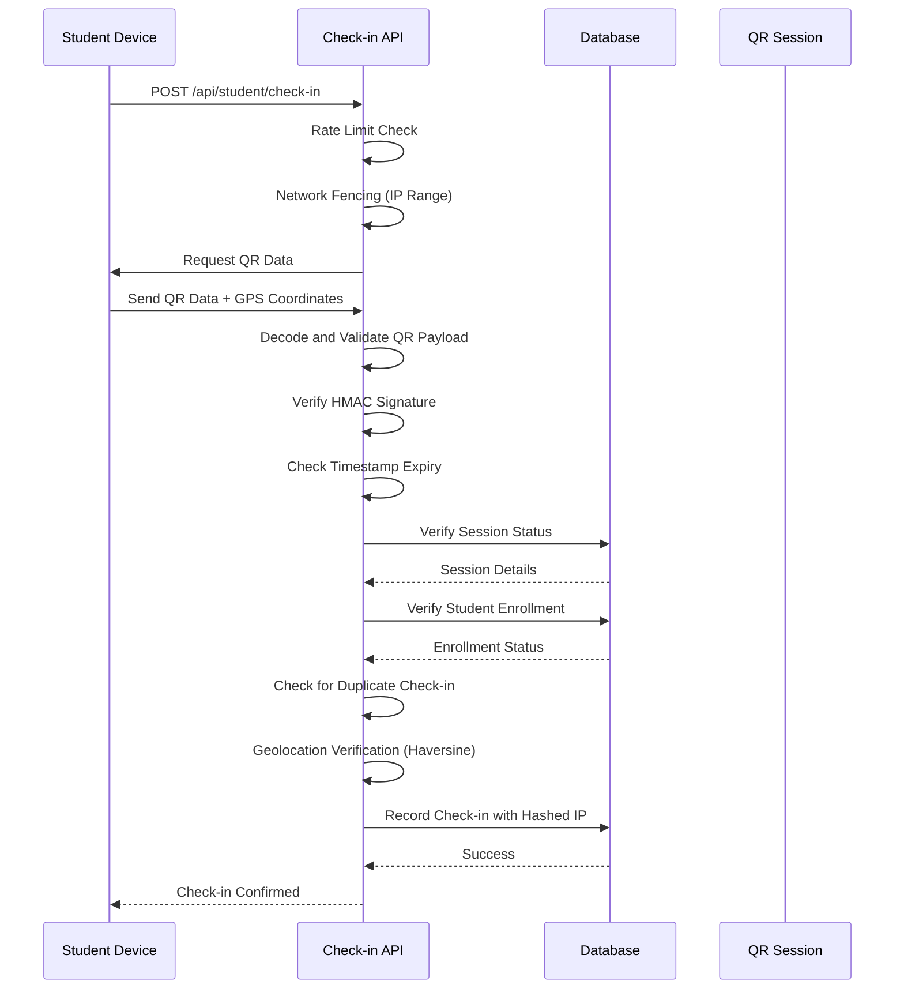
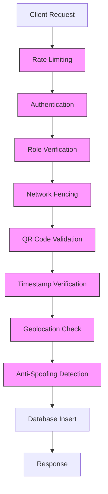
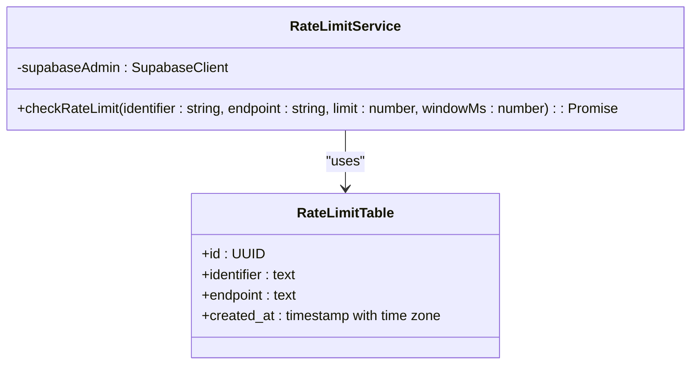
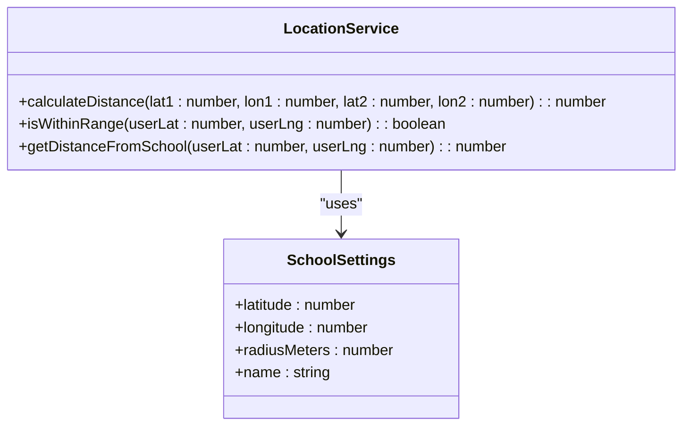
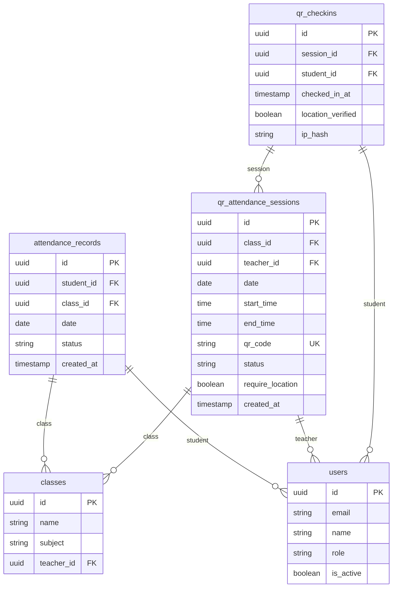
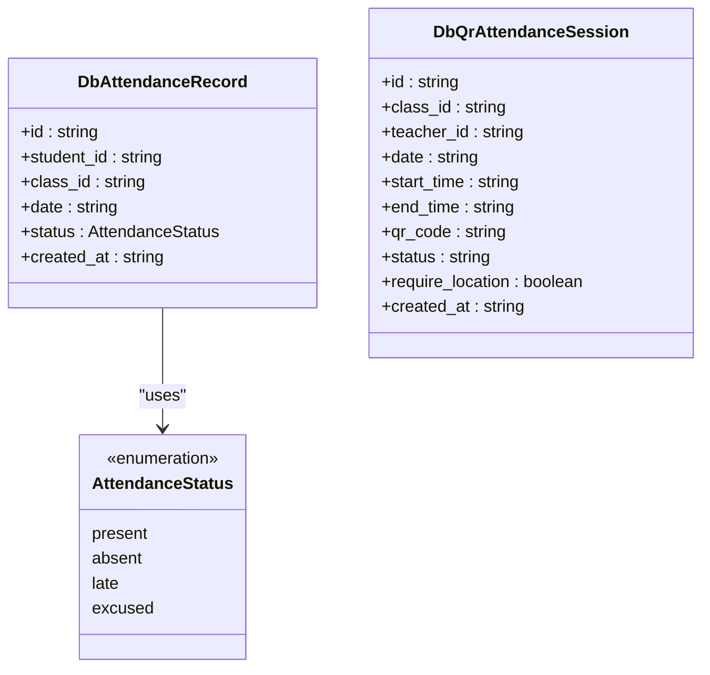
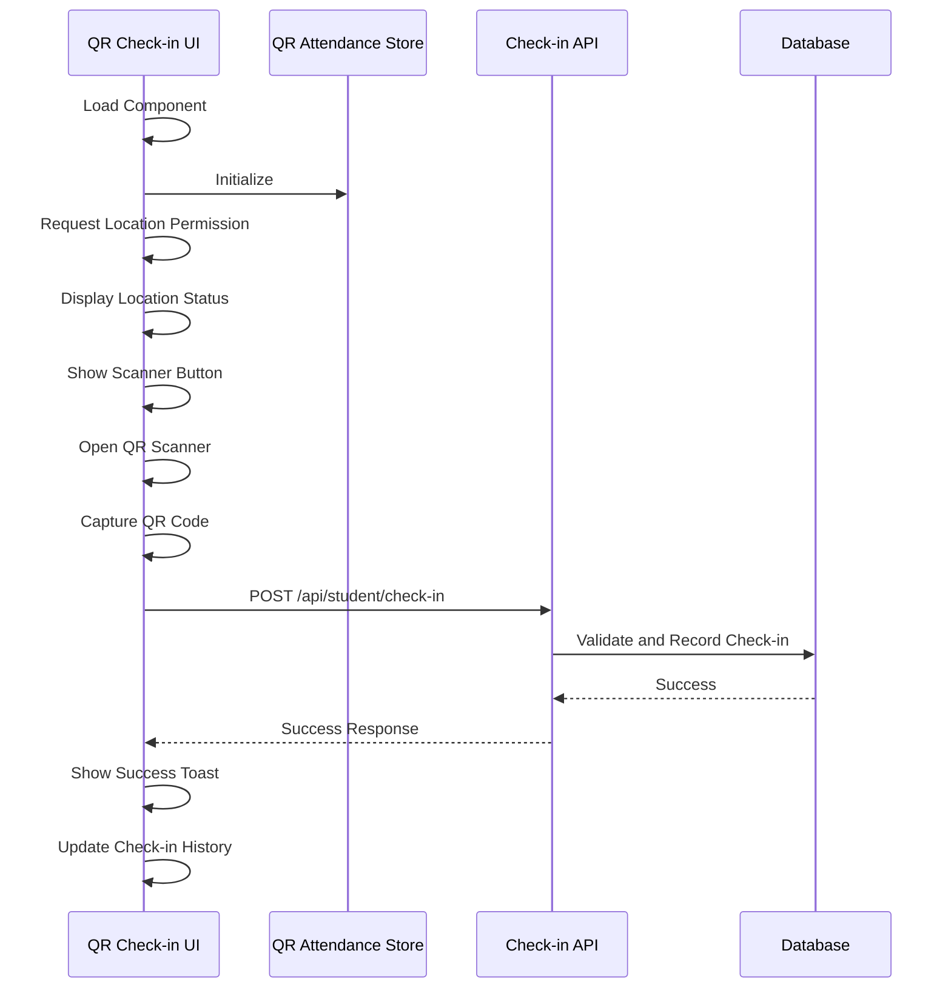
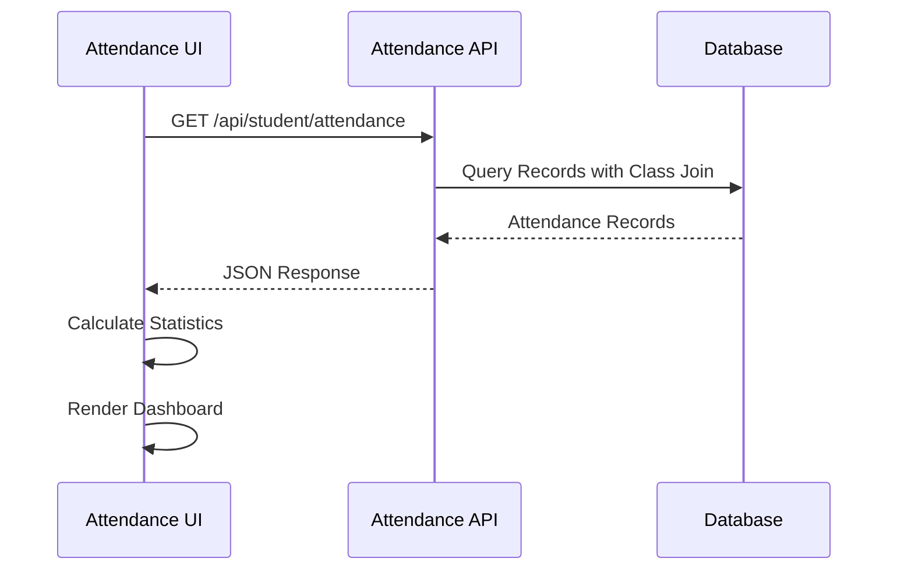
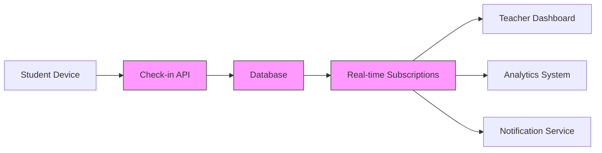

# Attendance API

<cite>
**Referenced Files in This Document**   
- [attendance/route.ts](file://app/api/student/attendance/route.ts)
- [check-in/route.ts](file://app/api/student/check-in/route.ts)
- [qr-checkin/page.tsx](file://app/student/qr-checkin/page.tsx)
- [attendance/page.tsx](file://app/student/attendance/page.tsx)
- [qr-attendance-store.ts](file://lib/qr-attendance-store.ts)
- [database.types.ts](file://lib/database.types.ts)
- [types.ts](file://lib/types.ts)
- [rate-limit.ts](file://lib/rate-limit.ts)
- [security.ts](file://lib/security.ts)
- [school-location-store.ts](file://lib/school-location-store.ts)
- [20251219043454_create_attendance_tables.sql](file://supabase/migrations/20251219043454_create_attendance_tables.sql)
</cite>

## Table of Contents
1. [Introduction](#introduction)
2. [API Endpoints](#api-endpoints)
3. [GET /api/student/attendance](#get-apistudentattendance)
4. [POST /api/student/check-in](#post-apistudentcheck-in)
5. [Security Measures](#security-measures)
6. [Data Models](#data-models)
7. [Usage Examples](#usage-examples)
8. [Error Handling](#error-handling)
9. [Integration with Real-time Tracking](#integration-with-real-time-tracking)
10. [Conclusion](#conclusion)

## Introduction
The Attendance API provides secure endpoints for managing student attendance in the School Management System. It includes two primary endpoints: one for retrieving historical attendance records and another for processing QR-based check-ins with multiple layers of security verification. The system implements role-based access control, geolocation validation, network fencing, and anti-spoofing measures to ensure the integrity of attendance data.

## API Endpoints
The Attendance API consists of two main endpoints designed to handle different aspects of attendance management:
- **GET /api/student/attendance**: Retrieves historical attendance records for the authenticated student
- **POST /api/student/check-in**: Processes QR-based attendance check-ins with comprehensive security validation

These endpoints work together to provide a complete attendance management solution that balances usability with robust security measures.

## GET /api/student/attendance
The GET /api/student/attendance endpoint retrieves historical attendance records for the authenticated student, including class context and date-based sorting.

### Functionality
This endpoint:
- Authenticates the user via Supabase auth
- Verifies the user's role is 'student'
- Securely fetches only the requesting student's attendance records
- Includes class name information through a database join
- Sorts records by date in descending order (most recent first)

### Request Requirements
- **Authentication**: Required (JWT token in Authorization header)
- **Role**: Must be 'student'
- **Method**: GET
- **Endpoint**: `/api/student/attendance`

### Response Schema
```json
{
  "records": [
    {
      "id": "string",
      "date": "string (ISO date)",
      "status": "present | absent | late | excused",
      "class": {
        "name": "string"
      }
    }
  ]
}
```

### Implementation Details
The endpoint uses Supabase RLS (Row Level Security) to ensure students can only access their own records. The query joins the attendance_records table with the classes table to include class names in the response.

**Section sources**
- [attendance/route.ts](file://app/api/student/attendance/route.ts#L4-L40)
- [attendance/page.tsx](file://app/student/attendance/page.tsx#L36-L48)
- [database.types.ts](file://lib/database.types.ts#L214-L239)

## POST /api/student/check-in
The POST /api/student/check-in endpoint processes QR-based attendance check-ins with comprehensive security validation, including HMAC signature verification, timestamp expiry, network fencing, and geolocation verification.

### QR-Based Attendance Workflow
The check-in process follows a multi-step verification workflow:



**Diagram sources**
- [check-in/route.ts](file://app/api/student/check-in/route.ts#L23-L237)
- [qr-checkin/page.tsx](file://app/student/qr-checkin/page.tsx#L130-L140)
- [qr-attendance-store.ts](file://lib/qr-attendance-store.ts#L25-L78)

### Security Validation Steps
1. **Rate Limiting**: Prevents brute force attempts
2. **Network Fencing**: Validates IP address against school network
3. **QR Code Validation**: 
   - Decodes base64-encoded JSON payload
   - Verifies HMAC signature using secret key
   - Validates timestamp (5-second window)
4. **Session Verification**: Confirms active session status
5. **Enrollment Check**: Verifies student is enrolled in the class
6. **Duplicate Prevention**: Ensures one check-in per session
7. **Geolocation Verification**: Validates GPS coordinates against school location
8. **Anti-Spoofing**: Detects perfect GPS matches (indicating spoofing)

### Request Requirements
- **Authentication**: Required (JWT token in Authorization header)
- **Role**: Must be 'student'
- **Method**: POST
- **Endpoint**: `/api/student/check-in`
- **Request Body**:
```json
{
  "qrData": "base64-encoded JSON payload",
  "latitude": "number",
  "longitude": "number"
}
```

### QR Data Structure
The QR code contains a base64-encoded JSON payload with:
- **sessionId**: Unique identifier for the attendance session
- **timestamp**: Unix timestamp in milliseconds
- **signature**: HMAC-SHA256 signature of sessionId:timestamp

### Response Schema
Success response:
```json
{
  "success": true
}
```

Error response:
```json
{
  "error": "string"
}
```

**Section sources**
- [check-in/route.ts](file://app/api/student/check-in/route.ts#L23-L237)
- [qr-checkin/page.tsx](file://app/student/qr-checkin/page.tsx#L130-L140)
- [qr-attendance-store.ts](file://lib/qr-attendance-store.ts#L25-L78)

## Security Measures
The Attendance API implements multiple layers of security to prevent fraud and ensure data integrity.

### Multi-Layered Security Architecture


**Diagram sources**
- [check-in/route.ts](file://app/api/student/check-in/route.ts#L27-L74)
- [rate-limit.ts](file://lib/rate-limit.ts#L25-L56)
- [security.ts](file://lib/security.ts#L11-L96)

### Rate Limiting
The system implements rate limiting using a Supabase RPC function:
- **Endpoint**: `check_rate_limit`
- **Parameters**: identifier, max_requests, window_ms
- **Storage**: rate_limits table with RLS disabled
- **Implementation**: Atomic operation to prevent race conditions



**Diagram sources**
- [rate-limit.ts](file://lib/rate-limit.ts#L1-L56)
- [20250222_rate_limit_table.sql](file://supabase/migrations/20250222_rate_limit_table.sql#L1-L9)
- [20250225_rate_limit_rpc.sql](file://supabase/migrations/20250225_rate_limit_rpc.sql#L1-L46)

### Network Fencing
The system enforces network access control based on IP ranges:
- **School Network**: Configured via SCHOOL_IP_RANGE environment variable
- **Strict Enforcement**: Students must connect to school Wi-Fi when configured
- **Remote Access**: Stricter limits for non-school networks (1 student per IP)

### Geolocation Verification
The system uses the Haversine formula to calculate distance between student and school:
- **Precision**: Earth's radius (6371km) for accurate distance calculation
- **Geofencing**: Configurable radius in meters
- **Anti-Spoofing**: Rejects perfect GPS matches (distance < 1 meter)
- **Privacy**: Uses hashed IP addresses for abuse detection



**Diagram sources**
- [check-in/route.ts](file://app/api/student/check-in/route.ts#L8-L21)
- [school-location-store.ts](file://lib/school-location-store.ts#L29-L42)
- [security.ts](file://lib/security.ts#L11-L14)

### Data Privacy
The system implements privacy-preserving measures:
- **Hashed IP Storage**: IP addresses are hashed before storage
- **Salted Hashing**: Uses SHA-256 with salt to prevent rainbow table attacks
- **Limited Retention**: Rate limit data has time-based expiration

**Section sources**
- [security.ts](file://lib/security.ts#L11-L14)
- [check-in/route.ts](file://app/api/student/check-in/route.ts#L55-L56)
- [check-in/route.ts](file://app/api/student/check-in/route.ts#L194-L202)

## Data Models
The Attendance API uses several data models to represent attendance records and sessions.

### Database Schema


**Diagram sources**
- [20251219043454_create_attendance_tables.sql](file://supabase/migrations/20251219043454_create_attendance_tables.sql#L1-L34)
- [database.types.ts](file://lib/database.types.ts#L214-L239)

### Type Definitions
The system defines several TypeScript interfaces for type safety:



**Diagram sources**
- [database.types.ts](file://lib/database.types.ts#L214-L239)
- [types.ts](file://lib/types.ts#L7-L8)

**Section sources**
- [database.types.ts](file://lib/database.types.ts#L214-L239)
- [types.ts](file://lib/types.ts#L7-L8)

## Usage Examples
The Attendance API is integrated into the frontend through specific components that demonstrate its usage.

### QR Check-in Component
The qr-checkin/page.tsx component implements the QR-based check-in workflow:



**Diagram sources**
- [qr-checkin/page.tsx](file://app/student/qr-checkin/page.tsx#L115-L165)
- [check-in/route.ts](file://app/api/student/check-in/route.ts#L23-L237)

### Attendance Records Component
The attendance/page.tsx component displays historical attendance records:



**Diagram sources**
- [attendance/page.tsx](file://app/student/attendance/page.tsx#L36-L48)
- [attendance/route.ts](file://app/api/student/attendance/route.ts#L4-L40)

**Section sources**
- [qr-checkin/page.tsx](file://app/student/qr-checkin/page.tsx#L115-L165)
- [attendance/page.tsx](file://app/student/attendance/page.tsx#L36-L48)

## Error Handling
The Attendance API implements comprehensive error handling for various scenarios.

### Error Scenarios
| Error Type | HTTP Status | Error Message | Cause |
|-----------|------------|--------------|------|
| Unauthorized | 401 | "Unauthorized" | Missing or invalid authentication |
| Forbidden | 403 | "Forbidden" | User role not authorized |
| Bad Request | 400 | "Invalid QR code format" | Malformed QR data |
| Bad Request | 400 | "QR code expired" | Timestamp outside 5-second window |
| Bad Request | 400 | "Invalid GPS coordinates" | Invalid latitude/longitude |
| Conflict | 400 | "Already checked in" | Duplicate check-in attempt |
| Too Many Requests | 429 | "Too many check-in attempts" | Rate limit exceeded |
| Forbidden | 403 | "Network check failed" | Not connected to school Wi-Fi |
| Forbidden | 403 | "Security Violation" | Multiple accounts on same network |
| Forbidden | 403 | "Location signal rejected" | GPS spoofing detected |
| Forbidden | 403 | "You are too far from the school" | Outside geofence radius |
| Forbidden | 403 | "You are not enrolled in this class" | Student not enrolled |
| Internal Server | 500 | "Internal Server Error" | Server-side error |

**Section sources**
- [check-in/route.ts](file://app/api/student/check-in/route.ts#L30-L31)
- [check-in/route.ts](file://app/api/student/check-in/route.ts#L46-L48)
- [check-in/route.ts](file://app/api/student/check-in/route.ts#L70-L72)
- [check-in/route.ts](file://app/api/student/check-in/route.ts#L85-L86)
- [check-in/route.ts](file://app/api/student/check-in/route.ts#L113-L114)
- [check-in/route.ts](file://app/api/student/check-in/route.ts#L151-L153)
- [check-in/route.ts](file://app/api/student/check-in/route.ts#L180-L181)
- [check-in/route.ts](file://app/api/student/check-in/route.ts#L186-L188)
- [check-in/route.ts](file://app/api/student/check-in/route.ts#L139-L141)

## Integration with Real-time Tracking
The Attendance API integrates with real-time tracking systems to provide immediate feedback and analytics.

### Real-time Data Flow


The system uses Supabase Realtime to push updates to subscribed clients, enabling:
- Immediate confirmation of check-ins
- Live attendance tracking for teachers
- Real-time analytics and reporting
- Instant notifications for administrators

**Section sources**
- [check-in/route.ts](file://app/api/student/check-in/route.ts#L196-L202)
- [qr-attendance-store.ts](file://lib/qr-attendance-store.ts#L71-L75)

## Conclusion
The Attendance API provides a secure and reliable solution for managing student attendance through QR-based check-ins and historical record retrieval. By implementing multiple layers of security including rate limiting, network fencing, geolocation verification, and anti-spoofing measures, the system ensures the integrity of attendance data while maintaining usability for students. The integration with real-time tracking systems enables immediate feedback and comprehensive analytics, making it a robust solution for modern educational institutions.