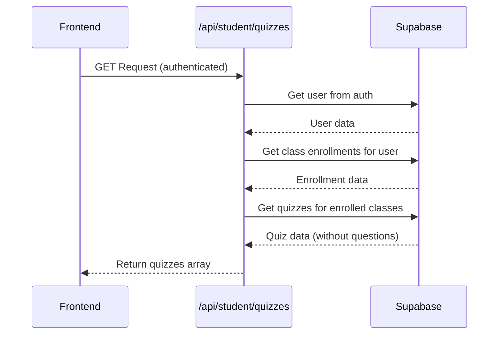
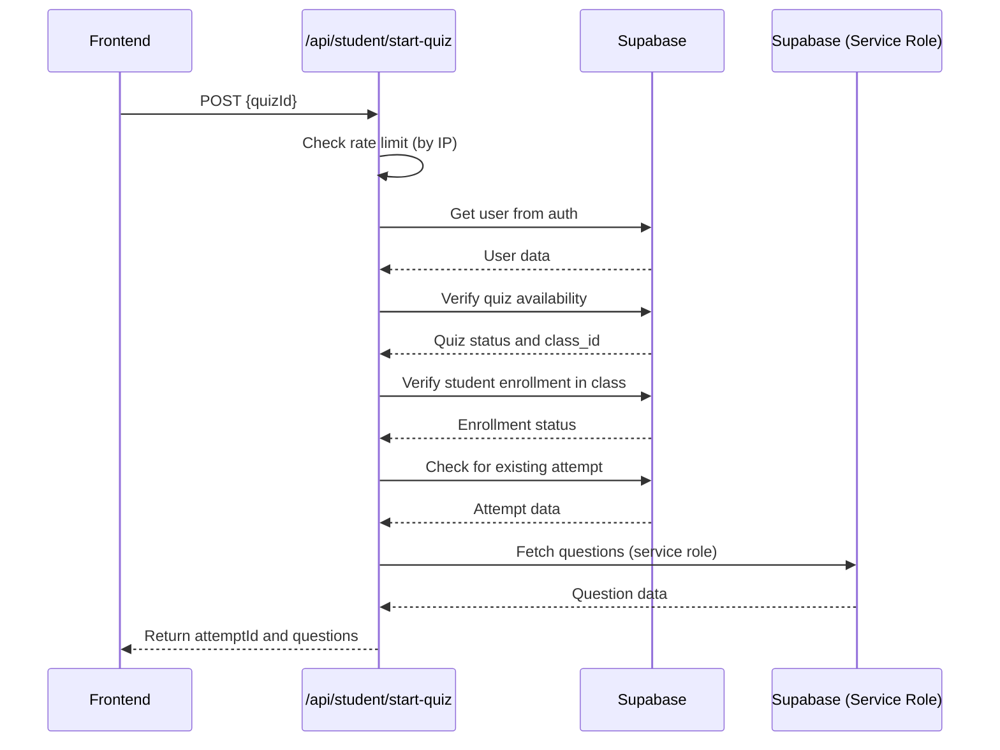
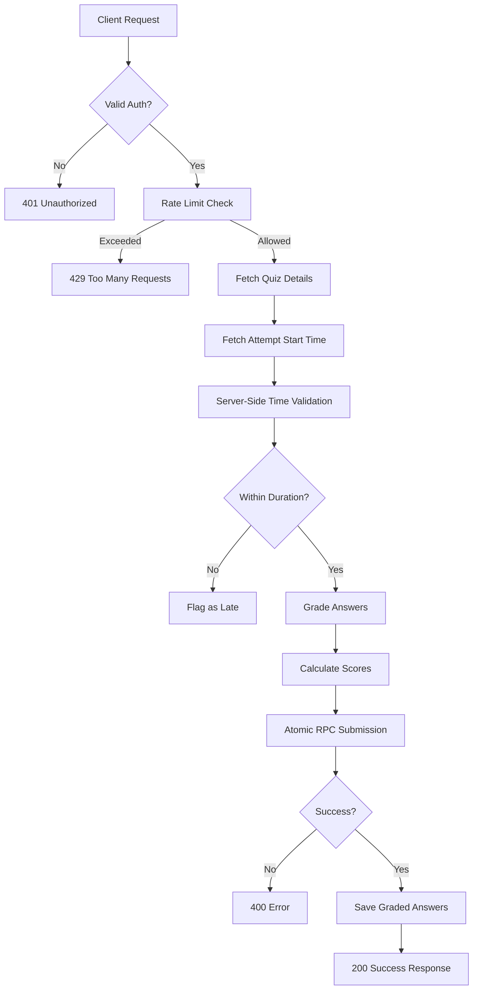
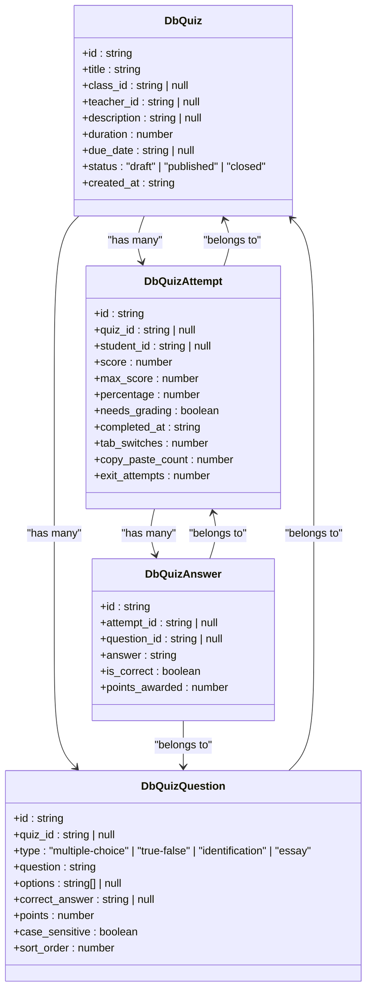
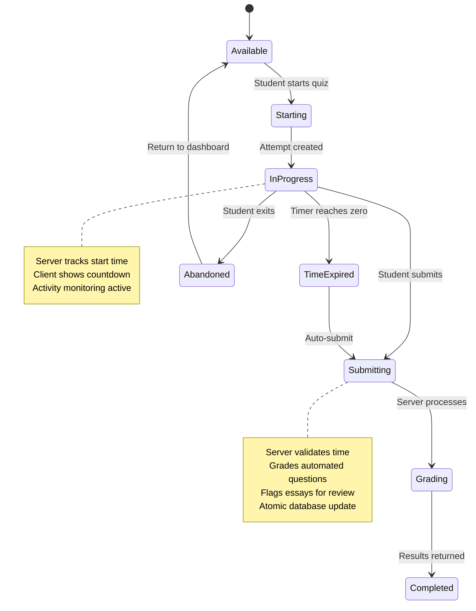
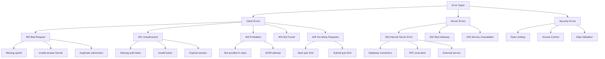
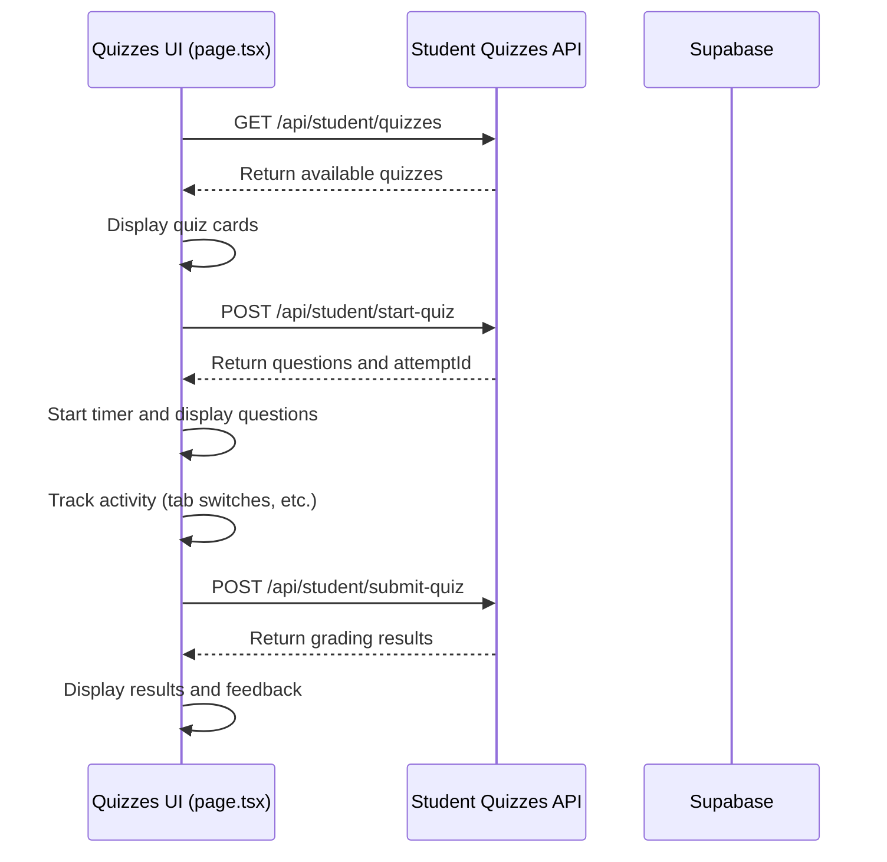
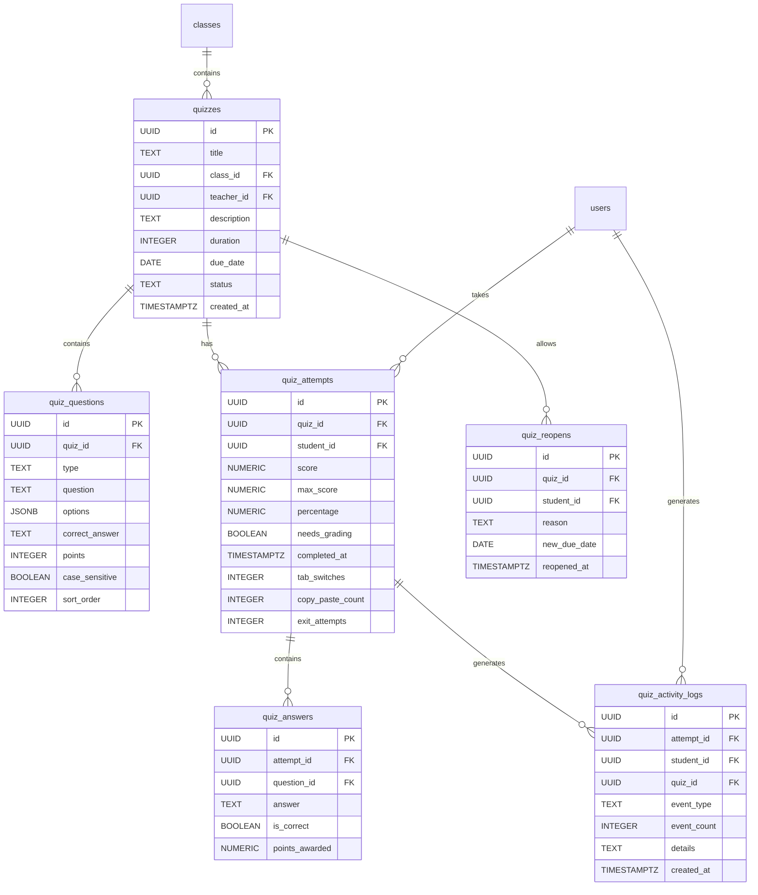
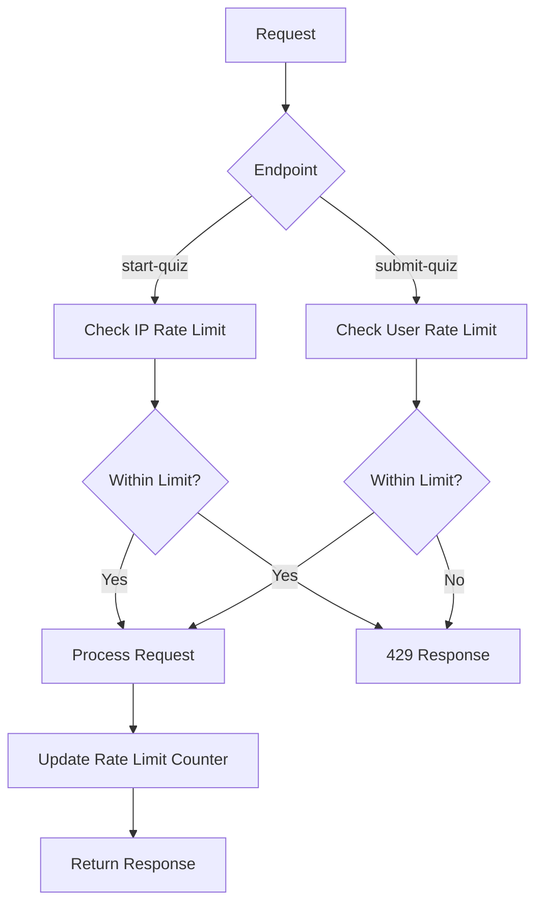

# Quizzes API

<cite>
**Referenced Files in This Document**   
- [quizzes/route.ts](file://app/api/student/quizzes/route.ts)
- [start-quiz/route.ts](file://app/api/student/start-quiz/route.ts)
- [submit-quiz/route.ts](file://app/api/student/submit-quiz/route.ts)
- [page.tsx](file://app/student/quizzes/page.tsx)
- [types.ts](file://lib/supabase/types.ts)
- [rate-limit.ts](file://lib/rate-limit.ts)
- [security.ts](file://lib/security.ts)
- [20251219043525_create_quizzes_tables.sql](file://supabase/migrations/20251219043525_create_quizzes_tables.sql)
- [20251219112310_create_quiz_activity_logs.sql](file://supabase/migrations/20251219112310_create_quiz_activity_logs.sql)
- [20260101070358_security_hardening.sql](file://supabase/migrations/20260101070358_security_hardening.sql)
- [queries.ts](file://lib/supabase/queries.ts)
</cite>

## Table of Contents
1. [Introduction](#introduction)
2. [API Endpoints](#api-endpoints)
   - [GET /api/student/quizzes](#get-apistudentquizzes)
   - [POST /api/student/start-quiz](#post-apistudentstart-quiz)
   - [POST /api/student/submit-quiz](#post-apistudentsubmit-quiz)
3. [Data Models](#data-models)
4. [Quiz Attempt Lifecycle](#quiz-attempt-lifecycle)
5. [Security Measures](#security-measures)
6. [Error Handling](#error-handling)
7. [Frontend Integration](#frontend-integration)
8. [Database Schema](#database-schema)
9. [Rate Limiting](#rate-limiting)
10. [Conclusion](#conclusion)

## Introduction

The Student Quizzes API provides a secure interface for students to access, take, and submit quizzes within the school management system. This documentation details the three core endpoints that manage the quiz lifecycle: retrieving available quizzes, starting a quiz attempt, and submitting completed quizzes. The system implements robust security measures including enrollment-based access control, rate limiting, IDOR protection, and server-side time validation to ensure academic integrity and prevent cheating.

The API is designed to work in conjunction with the frontend component at `app/student/quizzes/page.tsx`, which provides the user interface for students to interact with quizzes. All endpoints require authentication and are protected by Row Level Security (RLS) policies in Supabase, ensuring that students can only access quizzes for classes in which they are enrolled.

**Section sources**
- [quizzes/route.ts](file://app/api/student/quizzes/route.ts)
- [page.tsx](file://app/student/quizzes/page.tsx)

## API Endpoints

### GET /api/student/quizzes

This endpoint retrieves all available quizzes for the authenticated student, filtered by their class enrollments. It returns quiz metadata without questions to prevent unauthorized access to quiz content.



**Diagram sources**
- [quizzes/route.ts](file://app/api/student/quizzes/route.ts)
- [page.tsx](file://app/student/quizzes/page.tsx)

**Section sources**
- [quizzes/route.ts](file://app/api/student/quizzes/route.ts)

#### Request
- **Method**: GET
- **Authentication**: Required (JWT token in Authorization header)
- **Parameters**: None

#### Response
- **Success (200)**: Returns a JSON object with a `quizzes` array containing quiz metadata:
  - `id`: Quiz identifier
  - `title`: Quiz title
  - `description`: Quiz description
  - `duration`: Duration in minutes
  - `due_date`: Due date and time
  - `teacher_id`: Teacher who created the quiz
  - `class_id`: Associated class identifier
  - `class.name`: Class name (from relationship)

- **Error (401)**: Unauthorized - User not authenticated
- **Error (500)**: Internal Server Error - Processing failure

The endpoint implements enrollment-based access control by first retrieving the student's class enrollments and then only returning quizzes associated with those classes. This prevents students from accessing quizzes for classes they are not enrolled in.

### POST /api/student/start-quiz

This endpoint initiates a quiz attempt for the authenticated student. It includes rate limiting, IDOR protection, and secure question retrieval using Supabase service role credentials.



**Diagram sources**
- [start-quiz/route.ts](file://app/api/student/start-quiz/route.ts)
- [security.ts](file://lib/security.ts)
- [rate-limit.ts](file://lib/rate-limit.ts)

**Section sources**
- [start-quiz/route.ts](file://app/api/student/start-quiz/route.ts)

#### Request
- **Method**: POST
- **Authentication**: Required (JWT token in Authorization header)
- **Content-Type**: application/json
- **Body**:
```json
{
  "quizId": "string"
}
```

#### Response
- **Success (200)**: Returns a JSON object with:
  - `success`: true
  - `attemptId`: Unique identifier for the quiz attempt
  - `questions`: Array of question objects containing:
    - `id`: Question identifier
    - `question`: Question text
    - `type`: Question type (multiple-choice, true-false, identification, essay)
    - `options`: Array of answer options (for multiple-choice)
    - `points`: Points value

- **Error (400)**: Bad Request - Missing quizId or quiz not available
- **Error (401)**: Unauthorized - User not authenticated
- **Error (403)**: Forbidden - Student not enrolled in the class
- **Error (429)**: Too Many Requests - Rate limit exceeded
- **Error (500)**: Internal Server Error - Processing failure

The endpoint implements several security measures:
1. **Rate Limiting**: Limits requests to 5 per 10 minutes per IP address to prevent brute force attacks
2. **IDOR Protection**: Verifies that the student is enrolled in the class associated with the quiz
3. **Secure Question Retrieval**: Uses Supabase service role credentials to fetch questions, bypassing RLS policies that would otherwise prevent question access
4. **Duplicate Attempt Prevention**: Checks for existing attempts and returns the existing attempt ID if found

### POST /api/student/submit-quiz

This endpoint handles the submission of completed quizzes, including server-side time validation, automated grading, and atomic submission via RPC.



**Diagram sources**
- [submit-quiz/route.ts](file://app/api/student/submit-quiz/route.ts)
- [20260101070358_security_hardening.sql](file://supabase/migrations/20260101070358_security_hardening.sql)

**Section sources**
- [submit-quiz/route.ts](file://app/api/student/submit-quiz/route.ts)

#### Request
- **Method**: POST
- **Authentication**: Required (JWT token in Authorization header)
- **Content-Type**: application/json
- **Body**:
```json
{
  "quizId": "string",
  "answers": [
    {
      "questionId": "string",
      "answer": "string or number"
    }
  ],
  "activityLog": {
    "tabSwitches": "number",
    "copyPasteCount": "number",
    "exitAttempts": "number"
  }
}
```

#### Response
- **Success (200)**: Returns a JSON object with:
  - `success`: true
  - `score`: Total points earned
  - `maxScore`: Maximum possible points
  - `percentage`: Percentage score
  - `needsGrading`: Boolean indicating if essay questions require manual grading

- **Error (400)**: Bad Request - Invalid submission data or duplicate submission
- **Error (401)**: Unauthorized - User not authenticated
- **Error (429)**: Too Many Requests - Rate limit exceeded
- **Error (500)**: Internal Server Error - Processing failure

The endpoint implements a comprehensive grading workflow:
1. **Server-Side Time Validation**: Compares current time with the attempt start time to ensure submission is within the allowed duration
2. **Automated Grading**: Automatically scores multiple-choice, true-false, and identification questions by comparing answers to correct answers
3. **Essay Question Flagging**: Marks quizzes with essay questions for manual grading by the teacher
4. **Atomic Submission**: Uses a PostgreSQL RPC function to ensure the submission is processed atomically, preventing race conditions
5. **Activity Logging**: Records client-side activity metrics (tab switches, copy/paste attempts) for cheating detection

## Data Models

The quiz system uses several key data models defined in the Supabase schema and TypeScript types.



**Diagram sources**
- [types.ts](file://lib/supabase/types.ts)
- [20251219043525_create_quizzes_tables.sql](file://supabase/migrations/20251219043525_create_quizzes_tables.sql)

**Section sources**
- [types.ts](file://lib/supabase/types.ts)

### DbQuiz
Represents a quiz created by a teacher for a specific class. Key properties include:
- `id`: Unique identifier
- `title`: Quiz title
- `class_id`: Reference to the associated class
- `teacher_id`: Reference to the creating teacher
- `duration`: Time limit in minutes
- `status`: Current state (draft, published, closed)

### DbQuizQuestion
Represents an individual question within a quiz. Key properties include:
- `id`: Unique identifier
- `quiz_id`: Reference to the parent quiz
- `type`: Question type determining grading logic
- `question`: The question text
- `options`: Array of answer choices for multiple-choice questions
- `correct_answer`: The correct answer for automated grading
- `points`: Point value for the question

### DbQuizAttempt
Represents a student's attempt at a quiz. Key properties include:
- `id`: Unique identifier
- `quiz_id`: Reference to the attempted quiz
- `student_id`: Reference to the attempting student
- `score`: Total points earned
- `max_score`: Maximum possible points
- `percentage`: Calculated percentage score
- `needs_grading`: Flag indicating if manual grading is required
- `completed_at`: Timestamp of submission
- `tab_switches`, `copy_paste_count`, `exit_attempts`: Anti-cheating metrics

### DbQuizAnswer
Represents a student's answer to a specific question. Key properties include:
- `id`: Unique identifier
- `attempt_id`: Reference to the parent attempt
- `question_id`: Reference to the answered question
- `answer`: The student's response
- `is_correct`: Whether the answer was correct (for automated questions)
- `points_awarded`: Points granted for this answer

## Quiz Attempt Lifecycle

The quiz attempt lifecycle follows a well-defined sequence from retrieval to submission.



**Diagram sources**
- [start-quiz/route.ts](file://app/api/student/start-quiz/route.ts)
- [submit-quiz/route.ts](file://app/api/student/submit-quiz/route.ts)
- [page.tsx](file://app/student/quizzes/page.tsx)

**Section sources**
- [start-quiz/route.ts](file://app/api/student/start-quiz/route.ts)
- [submit-quiz/route.ts](file://app/api/student/submit-quiz/route.ts)

1. **Available**: The student views available quizzes on the dashboard. Only quizzes for enrolled classes are shown.

2. **Starting**: When the student clicks "Start Quiz", the frontend calls the `/api/student/start-quiz` endpoint, which:
   - Validates the student's enrollment
   - Creates or retrieves a quiz attempt record
   - Fetches the quiz questions using service role credentials
   - Returns the questions to the frontend

3. **In Progress**: The student answers questions with a countdown timer displayed. The client tracks:
   - Time remaining (synchronized with server start time)
   - Tab switches
   - Copy/paste attempts
   - Exit attempts

4. **Submitting**: The quiz can be submitted in three ways:
   - Manual submission by the student
   - Auto-submission when the timer reaches zero
   - Forced submission when navigating away

5. **Grading**: The `/api/student/submit-quiz` endpoint processes the submission:
   - Validates the submission time against the server start time
   - Automatically grades multiple-choice, true-false, and identification questions
   - Flags quizzes with essay questions for manual grading
   - Updates the attempt record atomically via RPC

6. **Completed**: The student receives immediate feedback:
   - For quizzes without essay questions: Final score and percentage
   - For quizzes with essay questions: Provisional score with note about pending manual grading

## Security Measures

The quiz system implements multiple layers of security to protect academic integrity and prevent cheating.

```mermaid
graph TD
A[Security Measures] --> B[Authentication]
A --> C[Authorization]
A --> D[Rate Limiting]
A --> E[Input Validation]
A --> F[Anti-Cheating]
A --> G[Data Protection]
B --> B1[JWT Authentication]
B --> B2[Session Management]
C --> C1[Enrollment-Based Access]
C --> C2[IDOR Protection]
C --> C3[Row Level Security]
D --> D1[IP-Based Rate Limiting]
D --> D2[User-Based Rate Limiting]
D --> D3[Atomic RPC Checks]
E --> E1[Schema Validation]
E --> E2[Sanitization]
E --> E3[Bounds Checking]
F --> F1[Server-Side Time Validation]
F --> F2[Activity Monitoring]
F --> F3[Tab Switch Detection]
F --> F4[Copy/Paste Tracking]
G --> G1[Service Role Isolation]
G --> G2[Question Hiding]
G --> G3[Secure Storage]
```



**Diagram sources**
- [security.ts](file://lib/security.ts)
- [rate-limit.ts](file://lib/rate-limit.ts)
- [start-quiz/route.ts](file://app/api/student/start-quiz/route.ts)
- [submit-quiz/route.ts](file://app/api/student/submit-quiz/route.ts)

**Section sources**
- [security.ts](file://lib/security.ts)
- [rate-limit.ts](file://lib/rate-limit.ts)

### Authentication
All endpoints require JWT authentication via Supabase Auth. The user's identity is verified at the beginning of each request using `supabase.auth.getUser()`.

### Authorization
The system implements enrollment-based access control:
- Students can only access quizzes for classes in which they are enrolled
- The `/api/student/start-quiz` endpoint verifies enrollment by checking the `class_students` table
- Row Level Security (RLS) policies enforce these rules at the database level

### Rate Limiting
Two layers of rate limiting protect against abuse:
1. **IP-Based Limiting**: The `/api/student/start-quiz` endpoint limits requests to 5 per 10 minutes per IP address to prevent brute force attacks
2. **User-Based Limiting**: The `/api/student/submit-quiz` endpoint limits submissions to 3 per minute per user to prevent spam

Rate limiting uses an atomic RPC function to prevent race conditions and ensure accurate counting.

### Input Validation
All inputs are validated:
- Required fields are checked (quizId, answers array)
- Data types are verified
- Bounds checking ensures reasonable values
- Zod schemas validate complex objects where applicable

### Anti-Cheating Measures
The system includes several features to detect and prevent cheating:
- **Server-Side Time Validation**: The submission time is validated against the server-recorded start time, preventing client-side timer manipulation
- **Activity Monitoring**: The frontend tracks tab switches, copy/paste attempts, and exit attempts, which are submitted with the quiz for review
- **Question Hiding**: Quiz questions are not returned by the initial `/api/student/quizzes` endpoint, only after successful start
- **IDOR Protection**: The system verifies that the student is enrolled in the class associated with the quiz, preventing access to unauthorized quizzes

### Data Protection
Sensitive operations use enhanced security:
- **Service Role Isolation**: Quiz questions are retrieved using Supabase service role credentials, which bypass RLS policies but are only accessible server-side
- **Secure Storage**: All quiz data is stored in Supabase with RLS policies that restrict access based on user roles and relationships
- **Atomic Operations**: Quiz submission uses a PostgreSQL RPC function with row locking to ensure atomic updates and prevent race conditions

## Error Handling

The API implements comprehensive error handling to provide meaningful feedback while maintaining security.



**Diagram sources**
- [quizzes/route.ts](file://app/api/student/quizzes/route.ts)
- [start-quiz/route.ts](file://app/api/student/start-quiz/route.ts)
- [submit-quiz/route.ts](file://app/api/student/submit-quiz/route.ts)

**Section sources**
- [quizzes/route.ts](file://app/api/student/quizzes/route.ts)
- [start-quiz/route.ts](file://app/api/student/start-quiz/route.ts)
- [submit-quiz/route.ts](file://app/api/student/submit-quiz/route.ts)

### Client Errors (4xx)
- **400 Bad Request**: Invalid request payload
  - Missing required fields (quizId)
  - Invalid data types
  - Duplicate quiz submission
  - Attempt to submit without starting

- **401 Unauthorized**: Authentication failure
  - Missing or invalid JWT token
  - Expired session
  - Revoked credentials

- **403 Forbidden**: Authorization failure
  - Student not enrolled in the class
  - Attempt to access another student's data (IDOR)
  - Insufficient privileges

- **404 Not Found**: Resource not found
  - Quiz does not exist
  - Class does not exist
  - User does not exist

- **429 Too Many Requests**: Rate limit exceeded
  - Too many start-quiz requests from the same IP
  - Too many submit-quiz requests from the same user

### Server Errors (5xx)
- **500 Internal Server Error**: Unhandled server-side exception
  - Database connection failure
  - RPC function execution error
  - External service failure
  - Uncaught exception in business logic

The system follows security best practices by providing generic error messages for 500 errors to avoid information disclosure, while including specific error details in server logs for debugging.

## Frontend Integration

The API endpoints are integrated with the frontend component at `app/student/quizzes/page.tsx`, which provides the user interface for the quiz system.



**Diagram sources**
- [page.tsx](file://app/student/quizzes/page.tsx)
- [quizzes/route.ts](file://app/api/student/quizzes/route.ts)
- [start-quiz/route.ts](file://app/api/student/start-quiz/route.ts)
- [submit-quiz/route.ts](file://app/api/student/submit-quiz/route.ts)

**Section sources**
- [page.tsx](file://app/student/quizzes/page.tsx)

### Key Integration Points

1. **Quiz Listing**: The UI fetches available quizzes on component mount and displays them as cards with status indicators (completed, pending, past due).

2. **Quiz Start**: When a student clicks "Start Quiz", the UI:
   - Calls `/api/student/start-quiz` with the quizId
   - Displays a loading state during the request
   - Initializes the answer tracking array based on question types
   - Starts the countdown timer synchronized with the server start time

3. **Question Display**: The UI renders different input components based on question type:
   - Multiple-choice: Button grid with lettered options
   - Identification: Text input field
   - Essay: Textarea with minimum height

4. **Navigation**: Students can navigate between questions with previous/next buttons, with validation to ensure answers are provided before proceeding.

5. **Submission**: The UI:
   - Validates that all questions have answers before enabling submit
   - Collects the activity log data from client-side tracking
   - Calls `/api/student/submit-quiz` with answers and activity data
   - Displays grading results with appropriate messaging for quizzes that need manual grading

6. **Time Management**: The UI displays a countdown timer that turns amber at 5 minutes remaining and red at 1 minute remaining, with auto-submission when time expires.

7. **Exit Protection**: A confirmation dialog prevents accidental exit from the quiz, warning that progress will be lost.

## Database Schema

The quiz system uses a relational database schema with several interconnected tables.



**Diagram sources**
- [20251219043525_create_quizzes_tables.sql](file://supabase/migrations/20251219043525_create_quizzes_tables.sql)
- [20251219112310_create_quiz_activity_logs.sql](file://supabase/migrations/20251219112310_create_quiz_activity_logs.sql)

**Section sources**
- [20251219043525_create_quizzes_tables.sql](file://supabase/migrations/20251219043525_create_quizzes_tables.sql)

### Table Descriptions

**quizzes**: Stores quiz metadata including title, duration, due date, and status. Linked to a class and teacher.

**quiz_questions**: Stores individual questions with their type, text, options, correct answer, and point value. Belongs to a quiz.

**quiz_attempts**: Records each student's attempt at a quiz, including scores, completion status, and anti-cheating metrics.

**quiz_answers**: Stores the student's answers to individual questions, including whether they were correct and points awarded.

**quiz_activity_logs**: Tracks student activity during the quiz (tab switches, copy/paste attempts) for cheating detection.

**quiz_reopens**: Allows teachers to grant individual students additional time or attempts on a quiz.

All tables have Row Level Security (RLS) policies enabled to enforce data access rules based on user roles and relationships.

## Rate Limiting

The system implements rate limiting to prevent abuse and protect server resources.



**Diagram sources**
- [rate-limit.ts](file://lib/rate-limit.ts)
- [start-quiz/route.ts](file://app/api/student/start-quiz/route.ts)
- [submit-quiz/route.ts](file://app/api/student/submit-quiz/route.ts)

**Section sources**
- [rate-limit.ts](file://lib/rate-limit.ts)

### Implementation Details

The rate limiting system uses:
- **Supabase Service Role**: The rate limiting function uses service role credentials to bypass RLS and ensure reliable access
- **Atomic RPC**: The `check_rate_limit` function is implemented as a PostgreSQL RPC to prevent race conditions
- **Separate Counters**: Different endpoints use different identifiers:
  - `/api/student/start-quiz`: Rate limited by IP address
  - `/api/student/submit-quiz`: Rate limited by user ID

### Configuration
- **start-quiz**: 5 requests per 10 minutes per IP
- **submit-quiz**: 3 requests per 1 minute per user

The system includes a fail-open mode for availability, where rate limiting returns true on database errors, except for security-critical endpoints.

## Conclusion

The Student Quizzes API provides a secure, reliable interface for students to take quizzes within the school management system. The three core endpoints—GET /api/student/quizzes, POST /api/student/start-quiz, and POST /api/student/submit-quiz—work together to create a comprehensive quiz experience with robust security measures.

Key features include:
- **Enrollment-based access control** ensuring students can only access quizzes for their classes
- **Rate limiting** to prevent abuse and protect server resources
- **IDOR protection** preventing access to unauthorized quizzes
- **Server-side time validation** preventing client-side timer manipulation
- **Automated grading** for multiple-choice, true-false, and identification questions
- **Essay question flagging** for manual grading by teachers
- **Atomic submission** via RPC to ensure data integrity
- **Activity logging** for cheating detection
- **Comprehensive error handling** with appropriate status codes

The API is designed to work seamlessly with the frontend component at `app/student/quizzes/page.tsx`, providing a smooth user experience while maintaining academic integrity. The system's architecture, with its separation of concerns between client and server responsibilities, ensures that security-critical operations are performed server-side where they cannot be manipulated by the client.