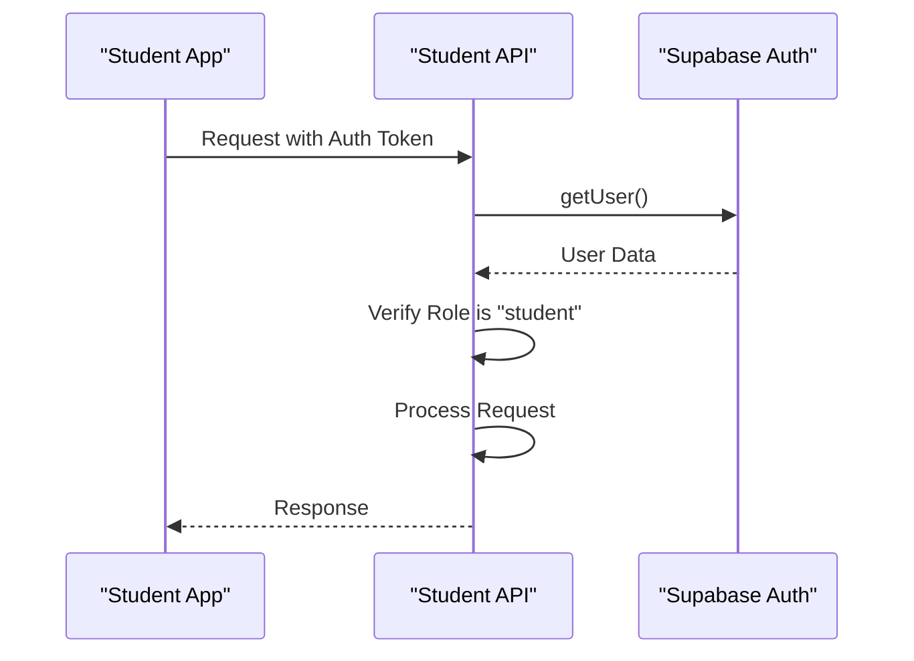
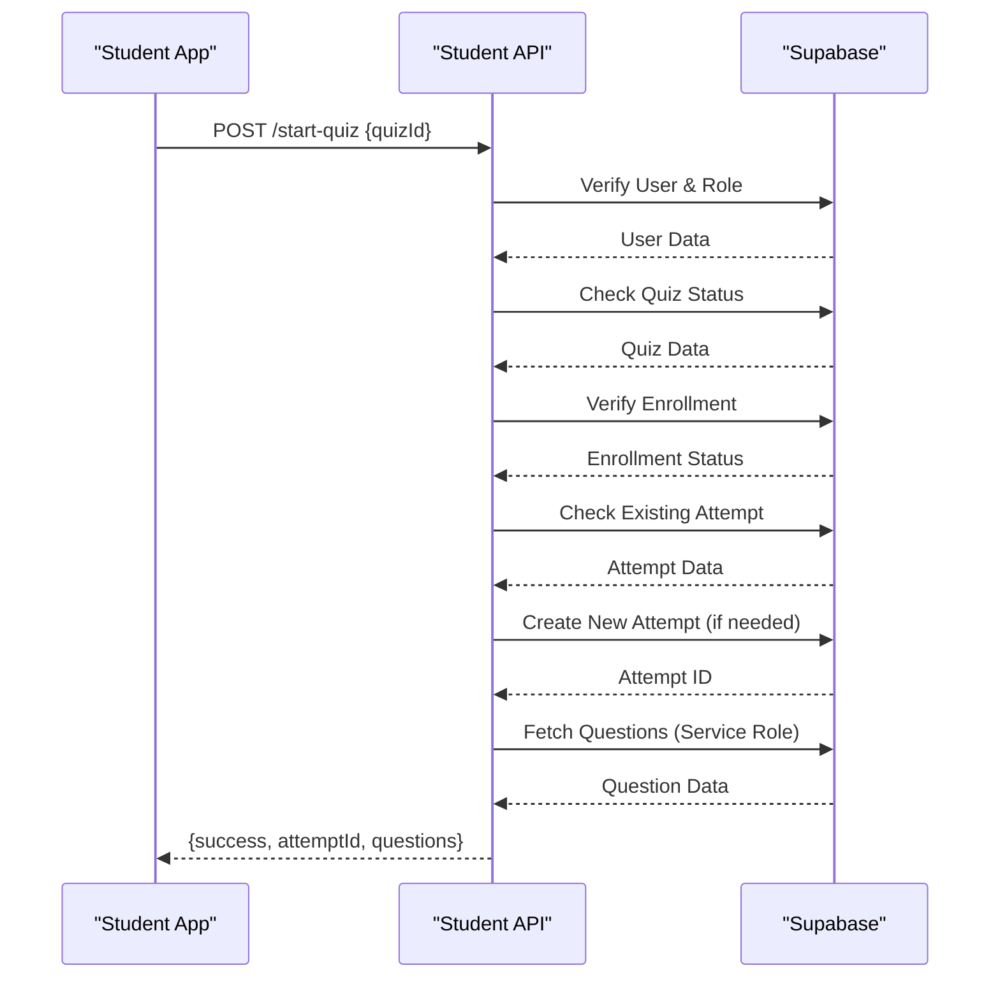
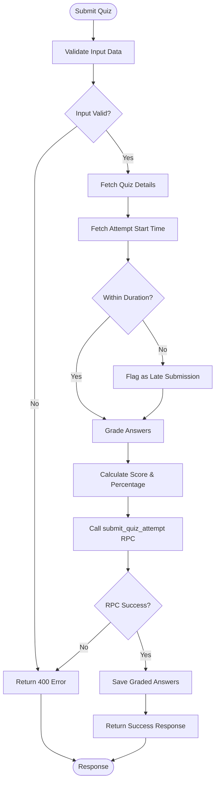
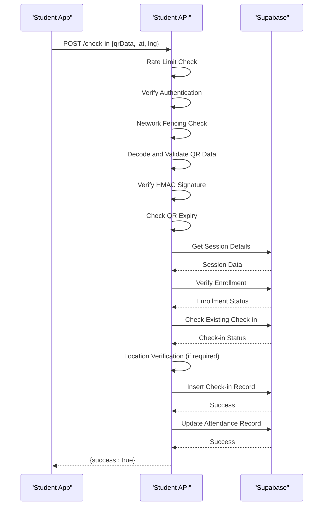
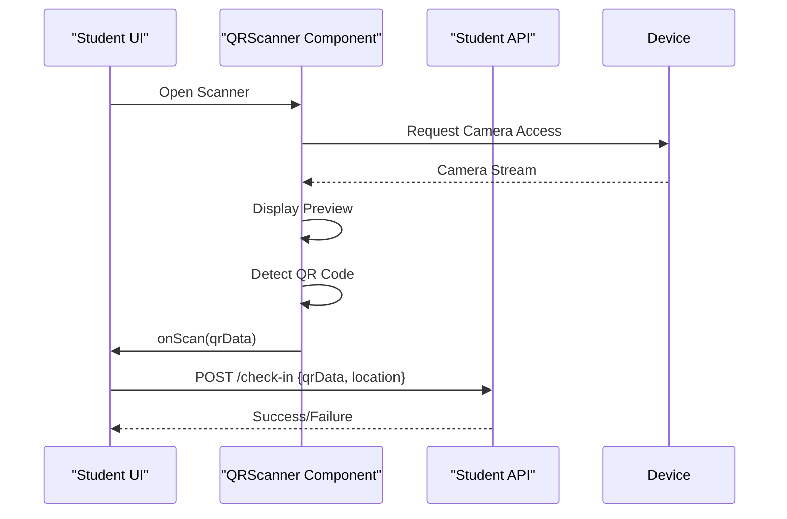

# Student API

<cite>
**Referenced Files in This Document**   
- [check-in/route.ts](file://app/api/student/check-in/route.ts)
- [start-quiz/route.ts](file://app/api/student/start-quiz/route.ts)
- [submit-quiz/route.ts](file://app/api/student/submit-quiz/route.ts)
- [announcements/route.ts](file://app/api/student/announcements/route.ts)
- [attendance/route.ts](file://app/api/student/attendance/route.ts)
- [classes/route.ts](file://app/api/student/classes/route.ts)
- [grades/route.ts](file://app/api/student/grades/route.ts)
- [schedule/route.ts](file://app/api/student/schedule/route.ts)
- [lessons/route.ts](file://app/api/student/lessons/route.ts)
- [quizzes/route.ts](file://app/api/student/quizzes/route.ts)
- [dashboard/route.ts](file://app/api/student/dashboard/route.ts)
- [types.ts](file://lib/supabase/types.ts)
- [rate-limit.ts](file://lib/rate-limit.ts)
- [qr-scanner.tsx](file://components/qr-scanner.tsx)
- [assignment-list.tsx](file://components/assignment-list.tsx)
</cite>

## Table of Contents
1. [Introduction](#introduction)
2. [Authentication and Authorization](#authentication-and-authorization)
3. [Academic Data Access Endpoints](#academic-data-access-endpoints)
   - [GET /api/student/classes](#get-apistudentclasses)
   - [GET /api/student/grades](#get-apistudentgrades)
   - [GET /api/student/schedule](#get-apistudentschedule)
   - [GET /api/student/lessons](#get-apistudentlessons)
4. [Quiz Participation Endpoints](#quiz-participation-endpoints)
   - [GET /api/student/quizzes](#get-apistudentquizzes)
   - [POST /api/student/start-quiz](#post-apistudentstart-quiz)
   - [POST /api/student/submit-quiz](#post-apistudentsubmit-quiz)
5. [Attendance Check-In Endpoint](#attendance-check-in-endpoint)
   - [POST /api/student/check-in](#post-apistudentcheck-in)
6. [Additional Student Endpoints](#additional-student-endpoints)
   - [GET /api/student/announcements](#get-apistudentannouncements)
   - [GET /api/student/attendance](#get-apistudentattendance)
   - [GET /api/student/dashboard](#get-apistudentdashboard)
7. [Data Privacy and Security](#data-privacy-and-security)
8. [Rate Limiting Policies](#rate-limiting-policies)
9. [Error Handling](#error-handling)
10. [Frontend Component Integration](#frontend-component-integration)

## Introduction

The Student API provides a comprehensive set of endpoints for students to access their academic information, participate in quizzes, and check in for attendance. This documentation details all student-facing routes, their request/response schemas, authentication requirements, and usage patterns. The API is designed with security, privacy, and performance in mind, implementing role-based access control, rate limiting, and data validation.

The API endpoints are organized under the `/api/student` path and require authentication via Supabase. All endpoints verify that the requesting user has the "student" role and enforce data access policies to ensure students can only access their own information or information they are authorized to view.

**Section sources**
- [types.ts](file://lib/supabase/types.ts#L2-L253)

## Authentication and Authorization

All Student API endpoints require authentication and role verification. The API uses Supabase authentication to verify the user's identity and ensure they have the appropriate role. Each request must include a valid authentication token, which is validated on the server side.

The authorization process follows these steps:
1. Extract the user from the authentication token using `supabase.auth.getUser()`
2. Verify the user exists and is authenticated
3. Check the user's role in the database to confirm they are a student
4. Enforce data access policies based on the user's identity

Endpoints that access sensitive data or perform actions also implement additional security measures such as rate limiting and input validation.



**Diagram sources**
- [announcements/route.ts](file://app/api/student/announcements/route.ts#L7-L11)
- [attendance/route.ts](file://app/api/student/attendance/route.ts#L7-L22)
- [classes/route.ts](file://app/api/student/classes/route.ts#L7-L11)

**Section sources**
- [announcements/route.ts](file://app/api/student/announcements/route.ts#L7-L11)
- [attendance/route.ts](file://app/api/student/attendance/route.ts#L7-L22)
- [classes/route.ts](file://app/api/student/classes/route.ts#L7-L11)

## Academic Data Access Endpoints

### GET /api/student/classes

Retrieves the list of classes a student is enrolled in, including class details and teacher information.

**HTTP Method**: GET  
**URL**: `/api/student/classes`  
**Authentication**: Required (student role)  
**Rate Limiting**: None

**Request Parameters**: None

**Response Schema**:
```json
{
  "classes": [
    {
      "id": "string",
      "name": "string",
      "subject": "string",
      "schedule": "string",
      "room": "string",
      "teacher_name": "string",
      "teacher_avatar": "string",
      "student_count": "number"
    }
  ]
}
```

The endpoint returns all classes the student is enrolled in, with enrollment counts for each class.

**Section sources**
- [classes/route.ts](file://app/api/student/classes/route.ts#L4-L66)

### GET /api/student/grades

Retrieves the student's grades across all enrolled classes.

**HTTP Method**: GET  
**URL**: `/api/student/grades`  
**Authentication**: Required (student role)  
**Rate Limiting**: None

**Request Parameters**: None

**Response Schema**:
```json
{
  "grades": [
    {
      "id": "string",
      "class_id": "string",
      "type": "exam" | "quiz" | "assignment" | "project",
      "score": "number",
      "max_score": "number",
      "percentage": "number",
      "grade": "number",
      "date": "string",
      "class": {
        "name": "string"
      }
    }
  ]
}
```

Grades are returned in descending order by date, with the most recent grades first.

**Section sources**
- [grades/route.ts](file://app/api/student/grades/route.ts#L4-L40)

### GET /api/student/schedule

Retrieves the student's class schedule.

**HTTP Method**: GET  
**URL**: `/api/student/schedule`  
**Authentication**: Required (student role)  
**Rate Limiting**: None

**Request Parameters**: None

**Response Schema**:
```json
{
  "schedule": [
    {
      "id": "string",
      "day": "string",
      "start_time": "string",
      "end_time": "string",
      "room": "string",
      "class_name": "string",
      "subject": "string",
      "teacher_name": "string"
    }
  ]
}
```

The schedule is ordered by day of the week and start time.

**Section sources**
- [schedule/route.ts](file://app/api/student/schedule/route.ts#L4-L64)

### GET /api/student/lessons

Retrieves lessons for the student's enrolled classes, including lesson materials.

**HTTP Method**: GET  
**URL**: `/api/student/lessons`  
**Authentication**: Required (student role)  
**Rate Limiting**: None

**Request Parameters**: None

**Response Schema**:
```json
{
  "lessons": [
    {
      "id": "string",
      "title": "string",
      "description": "string",
      "content": "string",
      "class_name": "string",
      "teacher_name": "string",
      "materials": [
        {
          "id": "string",
          "name": "string",
          "type": "pdf" | "video" | "link" | "document",
          "url": "string",
          "size": "string"
        }
      ]
    }
  ]
}
```

Lessons are returned in descending order by creation date.

**Section sources**
- [lessons/route.ts](file://app/api/student/lessons/route.ts#L4-L67)

## Quiz Participation Endpoints

### GET /api/student/quizzes

Retrieves a list of available quizzes for the student's enrolled classes.

**HTTP Method**: GET  
**URL**: `/api/student/quizzes`  
**Authentication**: Required (student role)  
**Rate Limiting**: None

**Request Parameters**: None

**Response Schema**:
```json
{
  "quizzes": [
    {
      "id": "string",
      "title": "string",
      "description": "string",
      "duration": "number",
      "due_date": "string",
      "teacher_id": "string",
      "class_id": "string",
      "class": {
        "name": "string"
      }
    }
  ]
}
```

Only published quizzes are returned, ordered by creation date with the most recent first.

**Section sources**
- [quizzes/route.ts](file://app/api/student/quizzes/route.ts#L4-L43)

### POST /api/student/start-quiz

Starts a quiz attempt for a student.

**HTTP Method**: POST  
**URL**: `/api/student/start-quiz`  
**Authentication**: Required (student role)  
**Rate Limiting**: 5 requests per minute per IP address

**Request Body**:
```json
{
  "quizId": "string"
}
```

**Response Schema**:
```json
{
  "success": "boolean",
  "attemptId": "string",
  "questions": [
    {
      "id": "string",
      "question": "string",
      "type": "multiple-choice" | "true-false" | "identification" | "essay",
      "options": ["string"],
      "points": "number"
    }
  ]
}
```

The endpoint performs several security checks:
1. Verifies the student is enrolled in the class associated with the quiz
2. Checks if the quiz is published and available
3. Prevents multiple attempts by checking for existing attempts

If no attempt exists, a new one is created. The questions are fetched using the Supabase service role key to bypass RLS policies and ensure secure access.



**Diagram sources**
- [start-quiz/route.ts](file://app/api/student/start-quiz/route.ts#L7-L122)

**Section sources**
- [start-quiz/route.ts](file://app/api/student/start-quiz/route.ts#L7-L122)

### POST /api/student/submit-quiz

Submits a completed quiz attempt.

**HTTP Method**: POST  
**URL**: `/api/student/submit-quiz`  
**Authentication**: Required (student role)  
**Rate Limiting**: 3 requests per minute per student ID

**Request Body**:
```json
{
  "quizId": "string",
  "answers": [
    {
      "questionId": "string",
      "answer": "string"
    }
  ],
  "activityLog": {
    "tabSwitches": "number",
    "copyPasteCount": "number",
    "exitAttempts": "number"
  }
}
```

**Response Schema**:
```json
{
  "success": "boolean",
  "score": "number",
  "maxScore": "number",
  "percentage": "number",
  "needsGrading": "boolean"
}
```

The submission process includes:
1. Server-side time validation to prevent timer bypassing
2. Answer grading based on question type and correct answers
3. Atomic submission via RPC to ensure data consistency
4. Handling of essay questions that require manual grading

Late submissions are accepted but may be flagged for teacher review. The server validates the submission time against the quiz duration and start time to detect potential timing violations.



**Diagram sources**
- [submit-quiz/route.ts](file://app/api/student/submit-quiz/route.ts#L5-L170)

**Section sources**
- [submit-quiz/route.ts](file://app/api/student/submit-quiz/route.ts#L5-L170)

## Attendance Check-In Endpoint

### POST /api/student/check-in

Performs QR-based attendance check-in for a class session.

**HTTP Method**: POST  
**URL**: `/api/student/check-in`  
**Authentication**: Required (student role)  
**Rate Limiting**: 20 requests per 10 minutes per IP address

**Request Body**:
```json
{
  "qrData": "string",
  "latitude": "number",
  "longitude": "number"
}
```

**Response Schema**:
```json
{
  "success": "boolean"
}
```

The check-in process involves multiple security layers:
1. Rate limiting to prevent abuse
2. Network fencing to ensure school Wi-Fi connectivity when configured
3. QR code validation with HMAC signature verification
4. Strict QR code expiry (5 seconds)
5. Location verification with geofencing when required
6. Prevention of multiple student check-ins from the same device

The QR data is base64-encoded JSON containing the session ID, timestamp, and HMAC signature. The server verifies the signature using a secret key and checks that the QR code is not expired. If location verification is required, the server calculates the distance between the student's coordinates and the school's location, rejecting check-ins that are too close (indicating GPS spoofing) or too far (outside the geofence).



**Diagram sources**
- [check-in/route.ts](file://app/api/student/check-in/route.ts#L23-L237)

**Section sources**
- [check-in/route.ts](file://app/api/student/check-in/route.ts#L23-L237)

## Additional Student Endpoints

### GET /api/student/announcements

Retrieves announcements targeted to the student based on their grade level.

**HTTP Method**: GET  
**URL**: `/api/student/announcements`  
**Authentication**: Required (student role)  
**Rate Limiting**: None

**Request Parameters**: None

**Response Schema**:
```json
{
  "announcements": [
    {
      "id": "string",
      "title": "string",
      "content": "string",
      "target_audience": "all" | "students" | "teachers" | "grade-10" | "grade-11" | "grade-12",
      "priority": "normal" | "important" | "urgent",
      "created_at": "string",
      "author": {
        "name": "string"
      }
    }
  ]
}
```

The endpoint filters announcements based on the student's grade, returning those targeted to all users, all students, or their specific grade level.

**Section sources**
- [announcements/route.ts](file://app/api/student/announcements/route.ts#L4-L39)

### GET /api/student/attendance

Retrieves the student's attendance records.

**HTTP Method**: GET  
**URL**: `/api/student/attendance`  
**Authentication**: Required (student role)  
**Rate Limiting**: None

**Request Parameters**: None

**Response Schema**:
```json
{
  "records": [
    {
      "id": "string",
      "date": "string",
      "status": "present" | "absent" | "late" | "excused",
      "class": {
        "name": "string"
      }
    }
  ]
}
```

Attendance records are returned in descending order by date.

**Section sources**
- [attendance/route.ts](file://app/api/student/attendance/route.ts#L4-L40)

### GET /api/student/dashboard

Retrieves dashboard data for the student, including classes, today's schedule, recent grades, and attendance rate.

**HTTP Method**: GET  
**URL**: `/api/student/dashboard`  
**Authentication**: Required (student role)  
**Rate Limiting**: None

**Request Parameters**: None

**Response Schema**:
```json
{
  "userName": "string",
  "classes": [
    {
      "id": "string",
      "name": "string",
      "subject": "string",
      "schedule": "string",
      "room": "string",
      "teacher_name": "string"
    }
  ],
  "todaySchedule": [
    {
      "id": "string",
      "start_time": "string",
      "end_time": "string",
      "room": "string",
      "class_name": "string",
      "teacher_name": "string"
    }
  ],
  "grades": [
    {
      "id": "string",
      "class_name": "string",
      "type": "exam" | "quiz" | "assignment" | "project",
      "score": "number",
      "max_score": "number",
      "grade": "number"
    }
  ],
  "attendanceRate": "number"
}
```

The dashboard aggregates data from multiple sources to provide a comprehensive overview of the student's academic status.

**Section sources**
- [dashboard/route.ts](file://app/api/student/dashboard/route.ts#L4-L117)

## Data Privacy and Security

The Student API implements multiple layers of security and privacy protection:

1. **Role-Based Access Control**: All endpoints verify the user's role is "student" before processing requests.
2. **Data Isolation**: Students can only access their own data through server-side filtering (e.g., `eq("student_id", user.id)`).
3. **Input Validation**: All inputs are validated to prevent injection attacks and ensure data integrity.
4. **Secure Communication**: All endpoints require HTTPS and authenticated requests.
5. **Privacy-Preserving Logging**: IP addresses are hashed before storage to protect user privacy.
6. **Secure QR Codes**: QR codes use HMAC signatures and short expiration times to prevent replay attacks.
7. **Location Security**: GPS coordinates are validated to detect spoofing, and exact matches are rejected.

The API also implements network fencing for attendance check-ins, requiring students to be on the school Wi-Fi network when configured. For remote check-ins, strict limits prevent multiple students from using the same device.

**Section sources**
- [check-in/route.ts](file://app/api/student/check-in/route.ts#L41-L74)
- [security.ts](file://lib/security.ts)
- [types.ts](file://lib/supabase/types.ts)

## Rate Limiting Policies

The Student API implements rate limiting to prevent abuse and ensure service availability:

| Endpoint | Limit | Window | Identifier | Fail Mode |
|---------|-------|-------|------------|----------|
| /api/student/check-in | 20 requests | 10 minutes | IP address | Open |
| /api/student/start-quiz | 5 requests | 1 minute | IP address | Open |
| /api/student/submit-quiz | 3 requests | 1 minute | Student ID | Open |

Rate limiting is implemented using the `checkRateLimit` function from `lib/rate-limit.ts`, which uses Supabase's RPC functionality to perform atomic rate limit checks. The service role key is used to bypass RLS policies and ensure reliable rate limiting.

For critical endpoints, the fail mode is set to "open" to maintain availability during database issues, though this could allow temporary abuse. The identifier used varies by endpoint: IP address for check-in and quiz start (to prevent automated scripts), and student ID for quiz submission (to prevent a single student from spamming submissions).

**Section sources**
- [rate-limit.ts](file://lib/rate-limit.ts#L1-L56)
- [check-in/route.ts](file://app/api/student/check-in/route.ts#L28-L31)
- [start-quiz/route.ts](file://app/api/student/start-quiz/route.ts#L11-L15)
- [submit-quiz/route.ts](file://app/api/student/submit-quiz/route.ts#L15-L18)

## Error Handling

The Student API returns standardized error responses with appropriate HTTP status codes:

- **400 Bad Request**: Invalid request data or parameters
- **401 Unauthorized**: Missing or invalid authentication
- **403 Forbidden**: Insufficient permissions or role mismatch
- **404 Not Found**: Resource not found
- **409 Conflict**: Duplicate or conflicting operation (e.g., already checked in)
- **429 Too Many Requests**: Rate limit exceeded
- **500 Internal Server Error**: Unexpected server error

Error messages are designed to be user-friendly while avoiding disclosure of sensitive system information. Detailed error logging is performed server-side for debugging purposes.

Common error scenarios include:
- Late quiz submissions (accepted but may be penalized)
- Duplicate attendance check-ins (rejected with 400)
- Session timeouts during quizzes (handled by client-side timeout detection)
- Network issues during submission (retry logic recommended)

**Section sources**
- [check-in/route.ts](file://app/api/student/check-in/route.ts)
- [start-quiz/route.ts](file://app/api/student/start-quiz/route.ts)
- [submit-quiz/route.ts](file://app/api/student/submit-quiz/route.ts)

## Frontend Component Integration

### QR Scanner Integration

The `qr-scanner.tsx` component provides a user interface for scanning QR codes during attendance check-in. It uses the html5-qrcode library to access the device camera and decode QR codes.

Key features:
- Environment-facing camera for scanning physical QR codes
- Error handling for camera permissions and device compatibility
- Manual code entry fallback
- Loading states and user guidance

The component integrates with the check-in API by passing the scanned QR data to the parent component via the `onScan` callback.



**Section sources**
- [qr-scanner.tsx](file://components/qr-scanner.tsx#L1-L161)

### Assignment List Integration

The `assignment-list.tsx` component displays assignments and enables submission. While not directly part of the documented API endpoints, it demonstrates the pattern for student interactions with academic content.

The component uses a store pattern (`useAssignmentStore`) to manage assignment state and submission. It provides interfaces for:
- Viewing assignment details
- Submitting files and comments
- Viewing submission status and feedback
- Displaying grades when available

This pattern could be extended to quiz submissions, though the current quiz API handles submission directly.

**Section sources**
- [assignment-list.tsx](file://components/assignment-list.tsx#L1-L271)