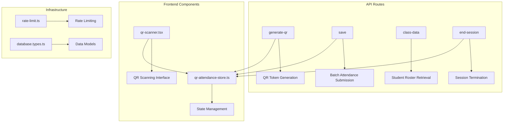
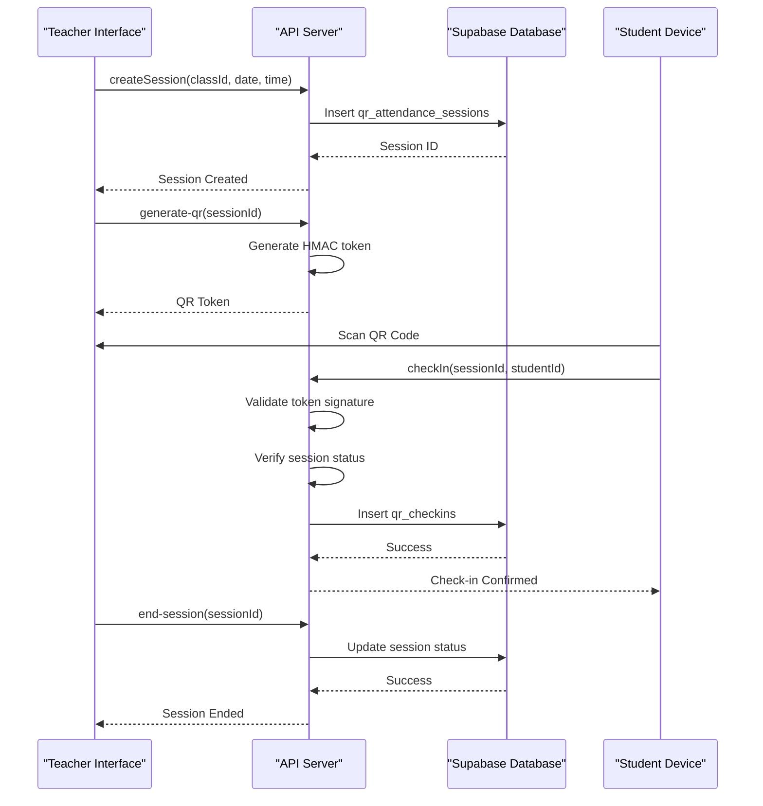
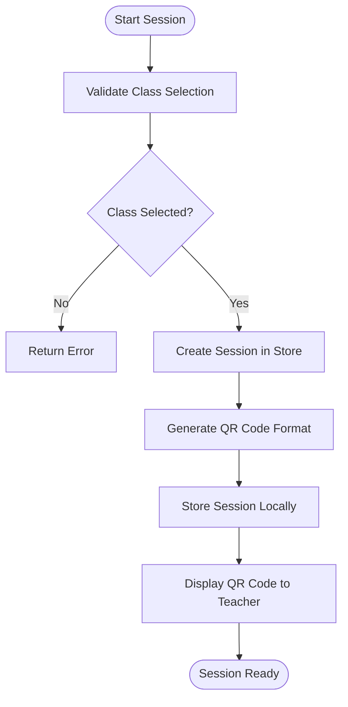
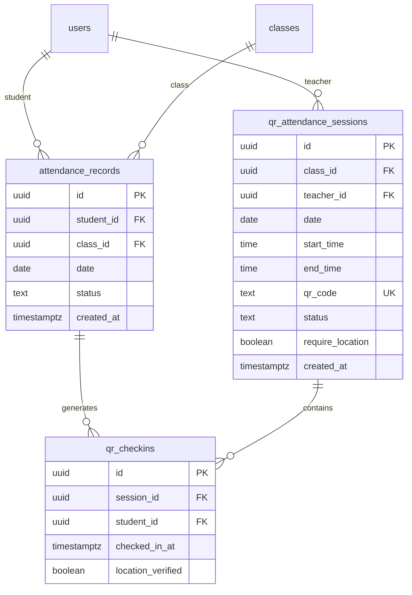
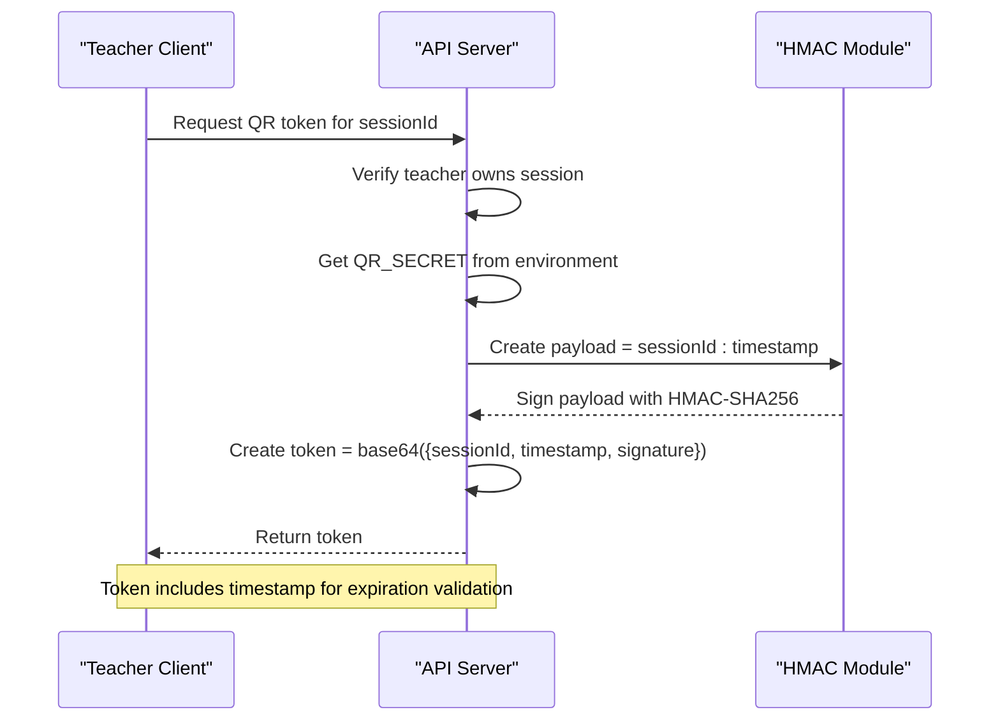
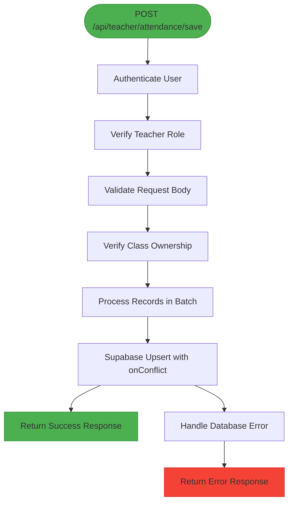
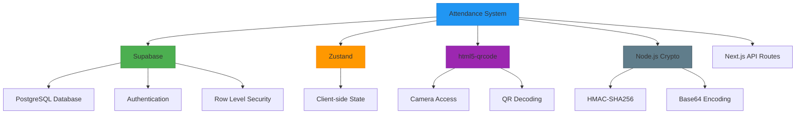

# Attendance Management

<cite>
**Referenced Files in This Document**   
- [save/route.ts](file://app/api/teacher/attendance/save/route.ts)
- [class-data/route.ts](file://app/api/teacher/attendance/class-data/route.ts)
- [generate-qr/route.ts](file://app/api/teacher/generate-qr/route.ts)
- [end-session/route.ts](file://app/api/teacher/end-session/route.ts)
- [qr-attendance-store.ts](file://lib/qr-attendance-store.ts)
- [qr-scanner.tsx](file://components/qr-scanner.tsx)
- [rate-limit.ts](file://lib/rate-limit.ts)
- [20251219043454_create_attendance_tables.sql](file://supabase/migrations/20251219043454_create_attendance_tables.sql)
- [database.types.ts](file://lib/database.types.ts)
- [types.ts](file://lib/types.ts)
</cite>

## Table of Contents
1. [Introduction](#introduction)
2. [Project Structure](#project-structure)
3. [Core Components](#core-components)
4. [Architecture Overview](#architecture-overview)
5. [Detailed Component Analysis](#detailed-component-analysis)
6. [Dependency Analysis](#dependency-analysis)
7. [Performance Considerations](#performance-considerations)
8. [Troubleshooting Guide](#troubleshooting-guide)
9. [Conclusion](#conclusion)

## Introduction
The Teacher Attendance Management API suite provides a comprehensive system for managing student attendance through QR-based workflows. This documentation covers the complete attendance lifecycle including session creation, QR token generation, batch attendance submission, and session termination. The system implements robust security measures including JWT-like token generation with HMAC signing, timestamp validation, and teacher-class ownership verification. The architecture supports real-time synchronization between teacher and student interfaces through a centralized state management system.

## Project Structure
The attendance management system is organized within the Next.js application structure with API routes under `/app/api/teacher/attendance/` and related components in the `lib/` and `components/` directories. The core functionality is distributed across several key files that handle different aspects of the attendance workflow.

**Diagram sources**
- [generate-qr/route.ts](file://app/api/teacher/generate-qr/route.ts)
- [save/route.ts](file://app/api/teacher/attendance/save/route.ts)
- [end-session/route.ts](file://app/api/teacher/end-session/route.ts)
- [qr-attendance-store.ts](file://lib/qr-attendance-store.ts)
- [qr-scanner.tsx](file://components/qr-scanner.tsx)

**Section sources**
- [app/api/teacher/](file://app/api/teacher/)
- [lib/](file://lib/)
- [components/](file://components/)

## Core Components
The attendance system consists of several core components that work together to provide a seamless attendance experience. The API endpoints handle server-side operations including authentication, authorization, and data persistence, while the frontend components manage client-side state and user interaction. The system uses Supabase for database operations with Row Level Security (RLS) policies to ensure data isolation between teachers and classes.

**Section sources**
- [save/route.ts](file://app/api/teacher/attendance/save/route.ts#L1-L58)
- [class-data/route.ts](file://app/api/teacher/attendance/class-data/route.ts#L1-L67)
- [generate-qr/route.ts](file://app/api/teacher/generate-qr/route.ts#L1-L79)
- [end-session/route.ts](file://app/api/teacher/end-session/route.ts#L1-L56)

## Architecture Overview
The attendance management system follows a client-server architecture with a React frontend and Next.js API routes. The system implements a token-based authentication flow for QR attendance sessions, where teachers generate cryptographically signed tokens that students scan to check in. The architecture includes rate limiting, ownership verification, and data validation at multiple levels to ensure system integrity and security.

**Diagram sources**
- [generate-qr/route.ts](file://app/api/teacher/generate-qr/route.ts#L40-L79)
- [save/route.ts](file://app/api/teacher/attendance/save/route.ts#L47-L53)
- [end-session/route.ts](file://app/api/teacher/end-session/route.ts#L44-L48)
- [qr-attendance-store.ts](file://lib/qr-attendance-store.ts#L35-L48)

## Detailed Component Analysis

### QR-Based Attendance Workflow
The QR-based attendance workflow consists of four main phases: session creation, QR token generation, student check-in, and session termination. Teachers initiate the process by creating an attendance session through the UI, which stores session details in client-side state. The system then generates a cryptographically secure QR token that can be scanned by students to record their attendance.

#### Session Creation and QR Generation

**Diagram sources**
- [qr-attendance-store.ts](file://lib/qr-attendance-store.ts#L35-L48)
- [page.tsx](file://app/teacher/qr-attendance/page.tsx#L245-L266)

**Section sources**
- [qr-attendance-store.ts](file://lib/qr-attendance-store.ts#L1-L100)
- [page.tsx](file://app/teacher/qr-attendance/page.tsx#L110-L440)

### Data Models and Database Schema
The system uses two primary data models for attendance management: `DbAttendanceRecord` for persistent attendance records and `DbQrAttendanceSession` for active QR-based sessions. The database schema enforces data integrity through foreign key constraints, row-level security, and unique constraints.

#### Attendance Data Models

**Diagram sources**
- [20251219043454_create_attendance_tables.sql](file://supabase/migrations/20251219043454_create_attendance_tables.sql#L1-L35)
- [database.types.ts](file://lib/database.types.ts#L214-L255)

**Section sources**
- [20251219043454_create_attendance_tables.sql](file://supabase/migrations/20251219043454_create_attendance_tables.sql#L1-L35)
- [database.types.ts](file://lib/database.types.ts#L214-L255)

### Security and Authentication Mechanisms
The system implements multiple layers of security to protect attendance data and prevent unauthorized access. The QR token generation uses HMAC signing with a secret key to ensure token integrity and authenticity. All API endpoints perform role-based access control and ownership verification to ensure teachers can only manage their own classes and sessions.

#### JWT-like Token Generation Process

**Diagram sources**
- [generate-qr/route.ts](file://app/api/teacher/generate-qr/route.ts#L65-L73)
- [types.ts](file://lib/types.ts#L7-L8)

**Section sources**
- [generate-qr/route.ts](file://app/api/teacher/generate-qr/route.ts#L40-L79)
- [types.ts](file://lib/types.ts#L7-L8)

### Batch Attendance Submission and Upsert Operations
The batch attendance submission endpoint uses Supabase's upsert functionality with conflict resolution to ensure idempotent operations. When teachers submit attendance records, the system uses the `onConflict` constraint to prevent duplicate records while allowing updates to existing records.

#### Batch Attendance Processing Flow

**Diagram sources**
- [save/route.ts](file://app/api/teacher/attendance/save/route.ts#L47-L49)
- [20251219043454_create_attendance_tables.sql](file://supabase/migrations/20251219043454_create_attendance_tables.sql#L1-L8)

**Section sources**
- [save/route.ts](file://app/api/teacher/attendance/save/route.ts#L1-L58)

## Dependency Analysis
The attendance management system has several key dependencies that enable its functionality. The system relies on Supabase for database operations and authentication, with Row Level Security policies ensuring data isolation. The frontend uses Zustand for state management and html5-qrcode for QR scanning capabilities. The system also depends on Node.js crypto module for HMAC signing operations.

**Diagram sources**
- [save/route.ts](file://app/api/teacher/attendance/save/route.ts#L1-L2)
- [qr-attendance-store.ts](file://lib/qr-attendance-store.ts#L3-L4)
- [qr-scanner.tsx](file://components/qr-scanner.tsx#L47-L48)
- [generate-qr/route.ts](file://app/api/teacher/generate-qr/route.ts#L69-L70)

**Section sources**
- [package.json](file://package.json)
- [lib/](file://lib/)

## Performance Considerations
The system implements rate limiting to prevent abuse and ensure fair usage of API resources. The rate limiting configuration allows 30 requests per minute per identifier (IP or User ID) with a fail-open policy for availability. The system also uses client-side state management to reduce server load and improve responsiveness.

**Section sources**
- [rate-limit.ts](file://lib/rate-limit.ts#L1-L56)
- [generate-qr/route.ts](file://app/api/teacher/generate-qr/route.ts)

## Troubleshooting Guide
Common issues with the attendance system typically involve authentication failures, QR code scanning problems, or session management errors. Teachers should verify their role permissions and class ownership when encountering access errors. Students experiencing check-in issues should ensure location services are enabled when required and that they are scanning valid QR codes.

**Section sources**
- [save/route.ts](file://app/api/teacher/attendance/save/route.ts#L9-L11)
- [class-data/route.ts](file://app/api/teacher/attendance/class-data/route.ts#L36-L38)
- [end-session/route.ts](file://app/api/teacher/end-session/route.ts#L38-L40)

## Conclusion
The Teacher Attendance Management API suite provides a robust and secure system for managing student attendance through QR-based workflows. The architecture combines client-side state management with server-side validation and security measures to ensure data integrity and prevent unauthorized access. The system's modular design allows for easy maintenance and extension, while the comprehensive error handling and rate limiting ensure reliability and performance under various conditions.