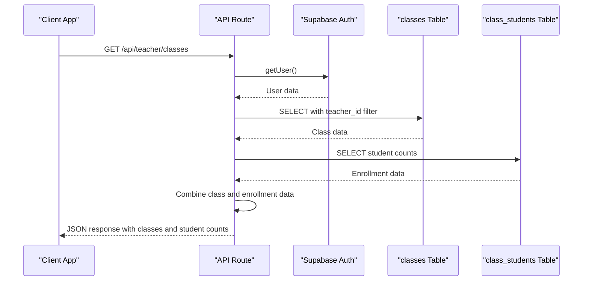
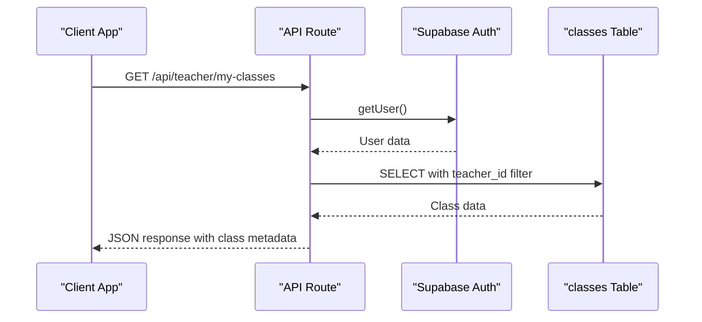
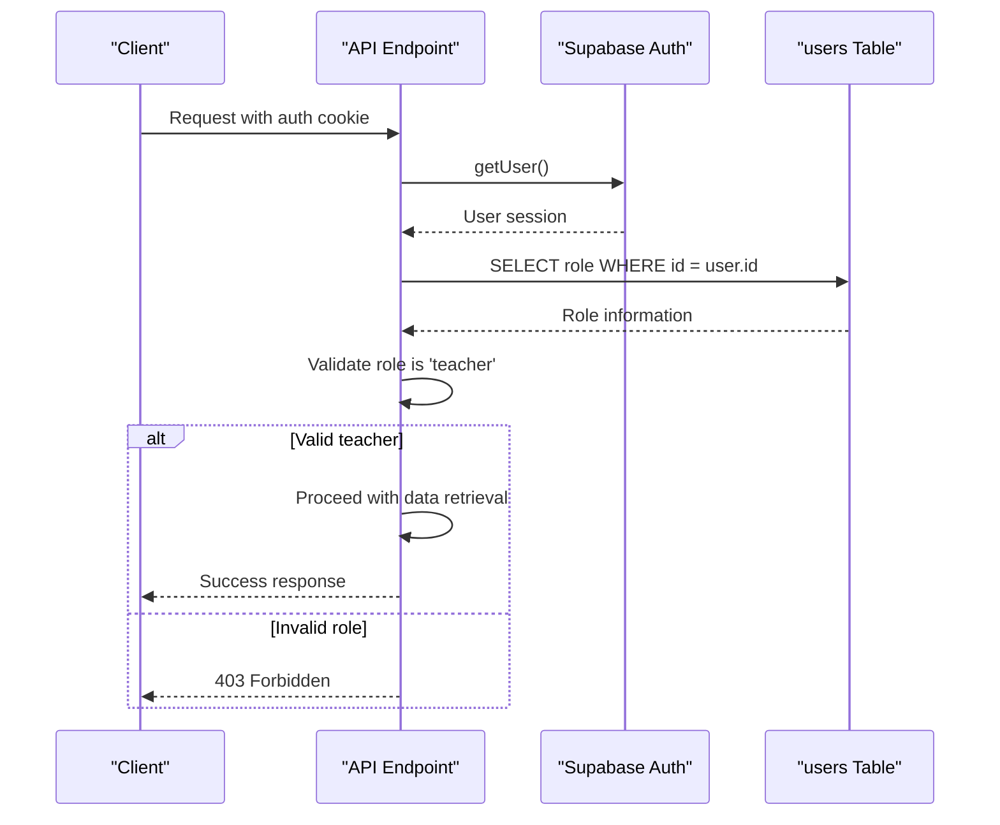
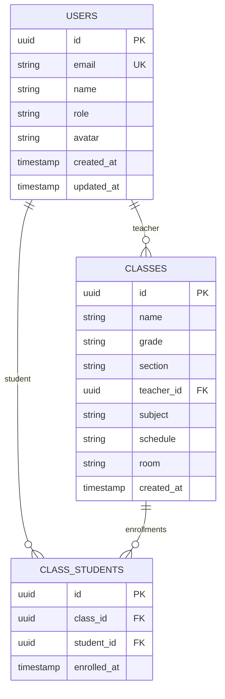
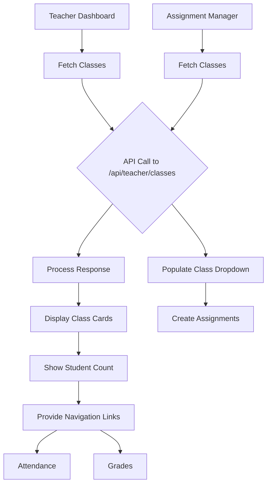
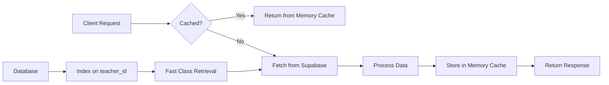
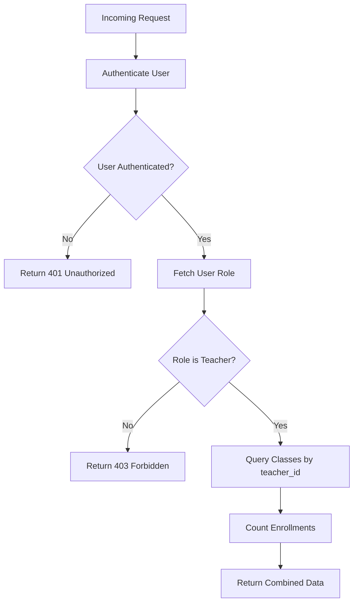

# Class Management

<cite>
**Referenced Files in This Document**   
- [classes/route.ts](file://app/api/teacher/classes/route.ts)
- [my-classes/route.ts](file://app/api/teacher/my-classes/route.ts)
- [page.tsx](file://app/teacher/classes/page.tsx)
- [teacher-assignment-manager.tsx](file://components/teacher-assignment-manager.tsx)
- [types.ts](file://lib/supabase/types.ts)
- [create_classes_table.sql](file://supabase/migrations/20251219043440_create_classes_table.sql)
- [server.ts](file://lib/supabase/server.ts)
- [cache.ts](file://lib/cache.ts)
</cite>

## Table of Contents
1. [Introduction](#introduction)
2. [Core Endpoints](#core-endpoints)
3. [Authentication and Authorization](#authentication-and-authorization)
4. [Data Model](#data-model)
5. [Request and Response Schemas](#request-and-response-schemas)
6. [Client-Side Integration](#client-side-integration)
7. [Performance and Caching](#performance-and-caching)
8. [Security Considerations](#security-considerations)
9. [Usage Examples](#usage-examples)

## Introduction
This document provides comprehensive API documentation for the Teacher Class Management endpoints in the School Management System. It details the implementation of the `GET /api/teacher/classes` endpoint that retrieves all classes owned by the authenticated teacher, including class metadata and student enrollment counts. The documentation covers the integration with the classes table (DbClass), authentication flow using Supabase auth, role validation, data filtering logic, request/response schemas, error handling, performance considerations, and security aspects including Row Level Security enforcement and ownership verification.

## Core Endpoints
The Teacher Class Management system provides two primary endpoints for retrieving class information: the comprehensive `/api/teacher/classes` endpoint and the simplified `/api/teacher/my-classes` endpoint.

### GET /api/teacher/classes
This endpoint retrieves all classes owned by the authenticated teacher with complete metadata and student enrollment counts.



**Diagram sources**
- [classes/route.ts](file://app/api/teacher/classes/route.ts#L4-L58)

**Section sources**
- [classes/route.ts](file://app/api/teacher/classes/route.ts#L4-L58)

### GET /api/teacher/my-classes
This endpoint provides a simplified version that retrieves only basic class information for the authenticated teacher.



**Diagram sources**
- [my-classes/route.ts](file://app/api/teacher/my-classes/route.ts#L4-L34)

**Section sources**
- [my-classes/route.ts](file://app/api/teacher/my-classes/route.ts#L4-L34)

## Authentication and Authorization
The system implements a robust authentication and authorization flow using Supabase authentication with role-based access control.



**Diagram sources**
- [classes/route.ts](file://app/api/teacher/classes/route.ts#L7-L21)
- [server.ts](file://lib/supabase/server.ts#L5-L30)

**Section sources**
- [classes/route.ts](file://app/api/teacher/classes/route.ts#L7-L21)
- [server.ts](file://lib/supabase/server.ts#L5-L30)

## Data Model
The class management system is built on a relational data model with proper normalization and referential integrity.



**Diagram sources**
- [create_classes_table.sql](file://supabase/migrations/20251219043440_create_classes_table.sql#L1-L22)
- [types.ts](file://lib/supabase/types.ts#L114-L124)

**Section sources**
- [create_classes_table.sql](file://supabase/migrations/20251219043440_create_classes_table.sql#L1-L22)
- [types.ts](file://lib/supabase/types.ts#L114-L124)

## Request and Response Schemas
The API endpoints follow consistent request and response patterns with well-defined schemas.

### Request Schema
The GET endpoints do not require a request body. Authentication is handled through Supabase session cookies.

### Response Schema
The response from `/api/teacher/classes` includes class metadata and student enrollment counts.

```json
{
  "classes": [
    {
      "id": "string",
      "name": "string",
      "grade": "string",
      "section": "string",
      "subject": "string",
      "schedule": "string | null",
      "room": "string | null",
      "student_count": "number"
    }
  ]
}
```

Error responses follow a standard format:

```json
{
  "error": "string"
}
```

**Section sources**
- [classes/route.ts](file://app/api/teacher/classes/route.ts#L49-L52)
- [types.ts](file://lib/supabase/types.ts#L114-L124)

## Client-Side Integration
The teacher classes endpoint is integrated into the teacher dashboard and other components that require class information.



**Diagram sources**
- [page.tsx](file://app/teacher/classes/page.tsx#L39-L44)
- [teacher-assignment-manager.tsx](file://components/teacher-assignment-manager.tsx#L79-L80)

**Section sources**
- [page.tsx](file://app/teacher/classes/page.tsx#L24-L122)
- [teacher-assignment-manager.tsx](file://components/teacher-assignment-manager.tsx#L52-L485)

## Performance and Caching
The system implements performance optimizations at multiple levels to ensure responsive class data retrieval.



The implementation uses a two-tier caching strategy:
1. In-memory caching for client-side queries with a 30-second TTL
2. Database indexing on the `teacher_id` column for efficient data retrieval

**Diagram sources**
- [cache.ts](file://lib/cache.ts#L16-L39)
- [performance_indexes.sql](file://supabase/migrations/20260108112143_performance_indexes.sql#L25)

**Section sources**
- [cache.ts](file://lib/cache.ts#L1-L128)
- [performance_indexes.sql](file://supabase/migrations/20260108112143_performance_indexes.sql#L1-L26)

## Security Considerations
The system implements multiple security layers to protect class data and ensure proper access control.

### Row Level Security
The database tables have Row Level Security (RLS) enabled with policies that restrict data access based on user roles and ownership.

```sql
-- Classes table RLS policy
CREATE POLICY "Teachers can read their classes" ON classes
FOR SELECT USING (
    teacher_id = auth.uid() OR
    EXISTS (SELECT 1 FROM users WHERE id = auth.uid() AND role = 'admin')
);
```

### Ownership Verification
The API endpoints verify that the authenticated user owns the requested classes by checking the `teacher_id` field against the user's ID from the authentication token.

### Role-Based Access Control
Access to the endpoints is restricted to users with the 'teacher' role. Admin users have additional privileges but are still subject to the same ownership verification for class data.



**Diagram sources**
- [classes/route.ts](file://app/api/teacher/classes/route.ts#L7-L21)
- [create_classes_table.sql](file://supabase/migrations/20251219043440_create_classes_table.sql#L21-L22)

**Section sources**
- [classes/route.ts](file://app/api/teacher/classes/route.ts#L7-L21)
- [create_classes_table.sql](file://supabase/migrations/20251219043440_create_classes_table.sql#L21-L22)

## Usage Examples
The teacher classes endpoints are used in various components throughout the application.

### Teacher Dashboard
The main teacher dashboard uses the `/api/teacher/classes` endpoint to display all classes with enrollment statistics.

**Section sources**
- [page.tsx](file://app/teacher/classes/page.tsx#L24-L122)

### Assignment Manager
The assignment manager component uses class data to allow teachers to create assignments for specific classes.

**Section sources**
- [teacher-assignment-manager.tsx](file://components/teacher-assignment-manager.tsx#L52-L485)

### Grade Management
The grade management system uses the same class data to organize student grades by class.

### Attendance Tracking
The attendance system uses class information to track student attendance for each class session.