# Grading System

<cite>
**Referenced Files in This Document**   
- [create/route.ts](file://app/api/teacher/grades/create/route.ts)
- [class/[id]/route.ts](file://app/api/teacher/grades/class/[id]/route.ts)
- [grading/[attemptId]/route.ts](file://app/api/teacher/grading/[attemptId]/route.ts)
- [grade-utils.ts](file://lib/grade-utils.ts)
- [rate-limit.ts](file://lib/rate-limit.ts)
- [page.tsx](file://app/teacher/grades/page.tsx)
- [teacher-assignment-manager.tsx](file://components/teacher-assignment-manager.tsx)
- [create_grades_tables.sql](file://supabase/migrations/20251219043509_create_grades_tables.sql)
- [rate_limit_rpc.sql](file://supabase/migrations/20250225_rate_limit_rpc.sql)
</cite>

## Table of Contents
1. [Introduction](#introduction)
2. [Core API Endpoints](#core-api-endpoints)
3. [Data Model](#data-model)
4. [Grade Calculation and Philippine Grading Scale](#grade-calculation-and-philippine-grading-scale)
5. [Validation and Security Chain](#validation-and-security-chain)
6. [Rate Limiting Implementation](#rate-limiting-implementation)
7. [Frontend Integration and Usage Examples](#frontend-integration-and-usage-examples)
8. [Quiz Grading Workflow Integration](#quiz-grading-workflow-integration)
9. [Error Handling and User Feedback](#error-handling-and-user-feedback)
10. [Conclusion](#conclusion)

## Introduction
The Teacher Grading API provides a secure and efficient system for managing student grades within the school management platform. This documentation details the core endpoints for creating and retrieving grades, explains the server-side grade calculation using the Philippine grading scale, and covers the comprehensive validation and security measures in place. The system ensures data integrity through transaction safety, implements rate limiting to prevent abuse, and integrates seamlessly with quiz submission and feedback workflows.

## Core API Endpoints

### Create Grade Endpoint
The `/api/teacher/grades/create` endpoint allows teachers to create individual grade records. The endpoint performs server-side calculation of percentage and Philippine grade values, ensuring consistency and preventing client-side manipulation.

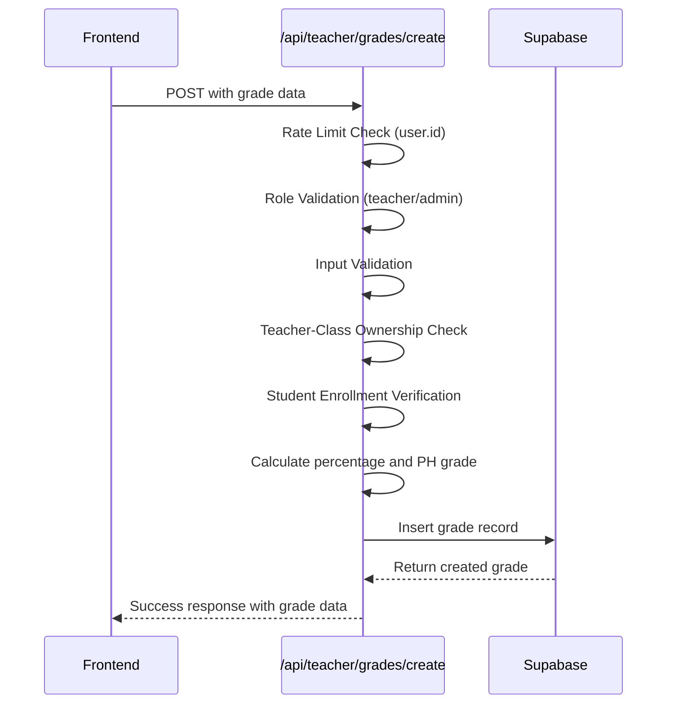

**Diagram sources**
- [create/route.ts](file://app/api/teacher/grades/create/route.ts#L6-L105)

**Section sources**
- [create/route.ts](file://app/api/teacher/grades/create/route.ts#L6-L105)

### Class Grades Retrieval Endpoint
The `/api/teacher/grades/class/[id]` endpoint retrieves all grades for a specific class, including both manually entered grades and quiz grades from completed attempts. The endpoint verifies teacher ownership of the class before returning data.

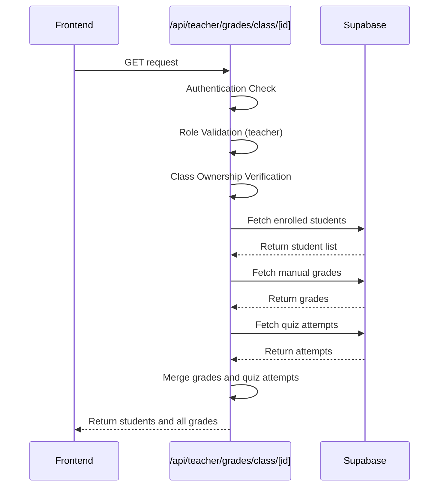

**Diagram sources**
- [class/[id]/route.ts](file://app/api/teacher/grades/class/[id]/route.ts#L5-L101)

**Section sources**
- [class/[id]/route.ts](file://app/api/teacher/grades/class/[id]/route.ts#L5-L101)

### Quiz Grading Details Endpoint
The `/api/teacher/grading/[attemptId]` endpoint provides detailed information for grading a specific quiz attempt, including the attempt data, student answers with question details, and activity logs that track academic integrity.

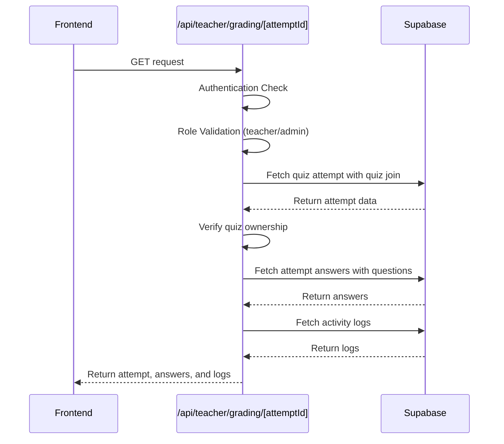

**Diagram sources**
- [grading/[attemptId]/route.ts](file://app/api/teacher/grading/[attemptId]/route.ts#L4-L86)

**Section sources**
- [grading/[attemptId]/route.ts](file://app/api/teacher/grading/[attemptId]/route.ts#L4-L86)

## Data Model
The grading system uses a relational data model with strict constraints and row-level security policies to ensure data integrity and privacy.

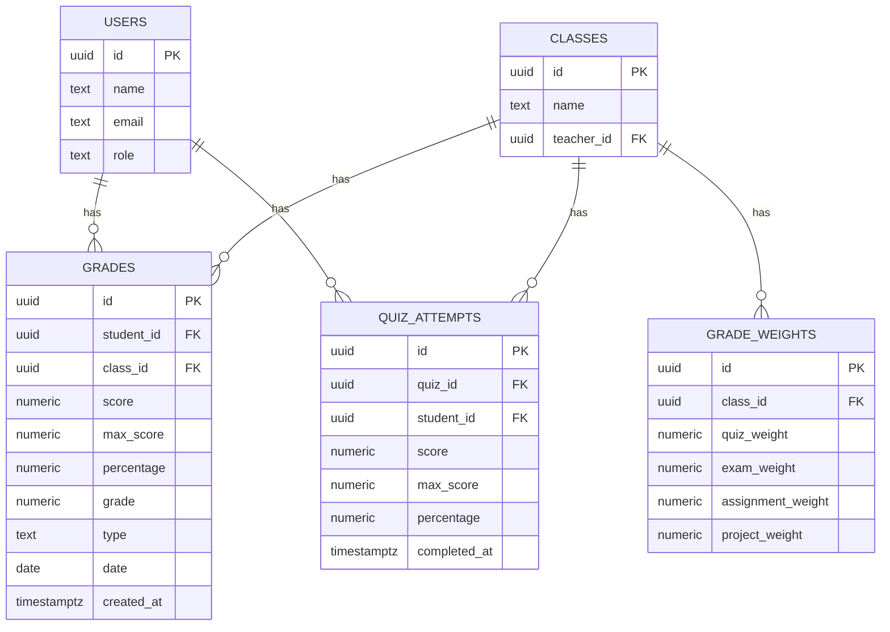

**Diagram sources**
- [create_grades_tables.sql](file://supabase/migrations/20251219043509_create_grades_tables.sql#L1-L46)

**Section sources**
- [create_grades_tables.sql](file://supabase/migrations/20251219043509_create_grades_tables.sql#L1-L46)

## Grade Calculation and Philippine Grading Scale
The system implements a server-side grade conversion utility that transforms percentage scores into the Philippine grading scale, which ranges from 60-100 with specific grade bands and remarks.

### Grade Conversion Logic
The `percentageToPhGrade` function converts a percentage (0-100) to a Philippine grade value according to a predefined scale that maps percentage ranges to specific grade values.

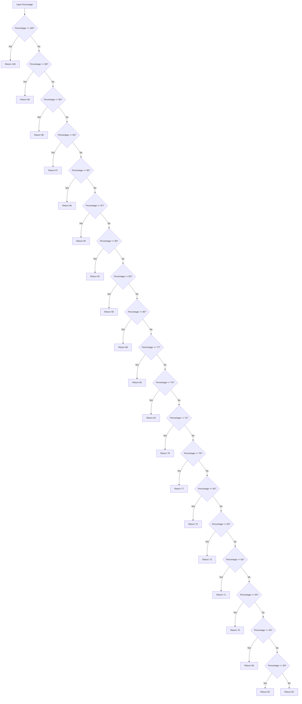

**Diagram sources**
- [grade-utils.ts](file://lib/grade-utils.ts#L17-L37)

### Philippine Grading Scale
The Philippine grading system used in the application follows the Department of Education (DepEd) standards with the following grade bands and remarks:

| Percentage Range | Grade Value | Remarks | Status |
|------------------|-----------|--------|--------|
| 96-100 | 96-100 | Excellent | excellent |
| 90-95 | 90-95 | Outstanding | outstanding |
| 85-89 | 85-89 | Very Satisfactory | very-satisfactory |
| 80-84 | 80-84 | Satisfactory | satisfactory |
| 75-79 | 75-79 | Fairly Satisfactory | fairly-satisfactory |
| Below 75 | 60-74 | Did Not Meet Expectations | failed |

The system also provides utility functions to retrieve grade information, remarks, and color variants for consistent UI presentation across the application.

**Section sources**
- [grade-utils.ts](file://lib/grade-utils.ts#L1-L163)

## Validation and Security Chain
The grading API implements a comprehensive validation and security chain to ensure data integrity, prevent unauthorized access, and maintain academic integrity.

### Multi-Layer Validation Process
The create grade endpoint implements a seven-step validation process:

1. **Rate Limiting**: Prevents abuse by limiting requests to 20 per minute per teacher ID
2. **Authentication**: Verifies the user is logged in via Supabase auth
3. **Role Authorization**: Confirms the user has teacher or admin role
4. **Input Validation**: Validates required fields and numeric values
5. **Teacher-Class Ownership**: Verifies the teacher owns the class being graded
6. **Student Enrollment**: Confirms the student is enrolled in the class
7. **Score Validation**: Ensures the score does not exceed the maximum possible score

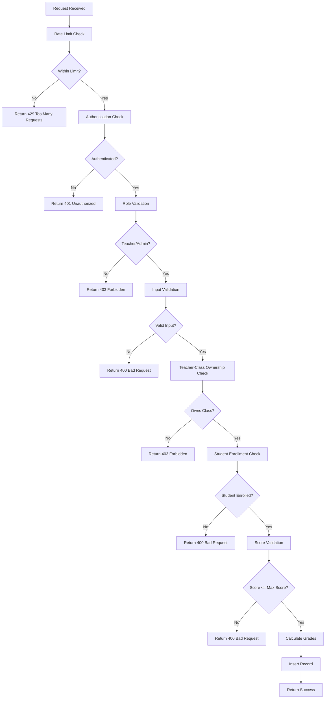

**Section sources**
- [create/route.ts](file://app/api/teacher/grades/create/route.ts#L6-L105)

## Rate Limiting Implementation
The system implements rate limiting to prevent abuse and protect against denial-of-service attacks, using a database-backed approach with atomic operations to ensure reliability.

### Rate Limiting Architecture
The rate limiting system uses a dedicated `rate_limits` table and a PostgreSQL function to ensure atomic operations and prevent race conditions.

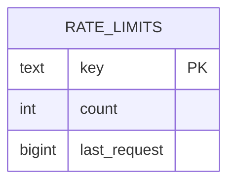

The `check_rate_limit` RPC function implements the core rate limiting logic:

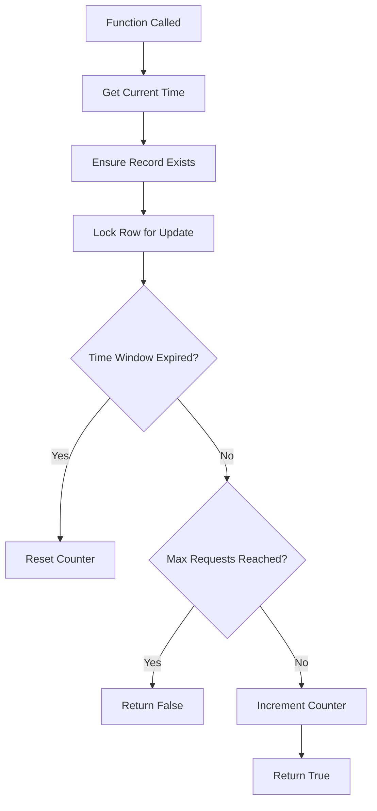

**Diagram sources**
- [rate_limit_rpc.sql](file://supabase/migrations/20250225_rate_limit_rpc.sql#L3-L46)
- [rate-limit.ts](file://lib/rate-limit.ts#L25-L56)

The implementation uses the Supabase service role key to bypass row-level security policies, ensuring the rate limiting system functions even when other database policies might interfere. The system is configured to allow 20 grade creations per minute per teacher, which balances usability with protection against automated abuse.

**Section sources**
- [rate-limit.ts](file://lib/rate-limit.ts#L1-L56)

## Frontend Integration and Usage Examples
The grading system is integrated into the teacher interface through the grades management page and assignment manager component, providing a seamless user experience.

### Grades Management Page
The `page.tsx` component in the teacher grades section demonstrates the integration of the grading API endpoints:

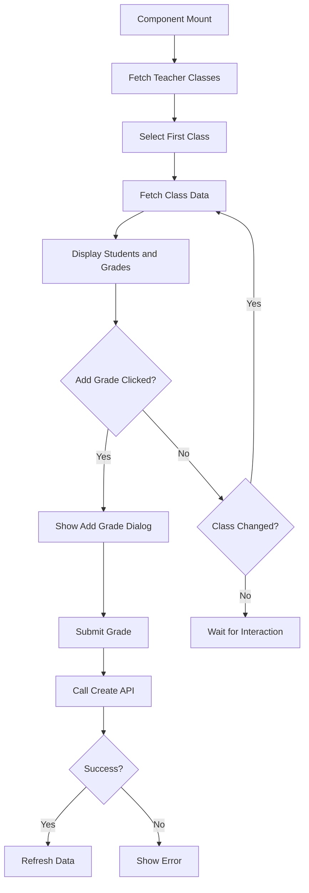

The component uses the `percentageToPhGrade` utility to provide real-time grade calculation feedback when teachers enter scores, enhancing the user experience by showing the resulting Philippine grade before submission.

**Section sources**
- [page.tsx](file://app/teacher/grades/page.tsx#L1-L539)

### Assignment Manager Integration
The `teacher-assignment-manager.tsx` component integrates with the grading system when teachers grade assignment submissions:

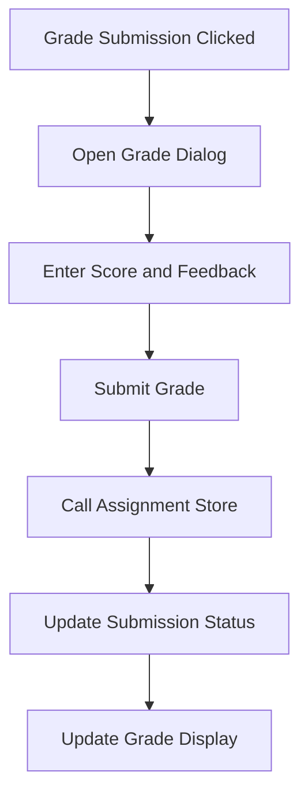

When a teacher grades an assignment submission, the system updates the submission status to "graded" and stores the score, which is then reflected in the student's grade calculations.

**Section sources**
- [teacher-assignment-manager.tsx](file://components/teacher-assignment-manager.tsx#L1-L485)

## Quiz Grading Workflow Integration
The grading system integrates with the quiz functionality through the `grading/[attemptId]` endpoint, which provides teachers with all necessary information to grade quiz attempts and maintain academic integrity.

### Quiz Grading Data Flow
When a teacher accesses the quiz grading interface, the system retrieves three key data sets:

1. **Quiz Attempt Data**: Basic information about the student's attempt
2. **Student Answers with Questions**: The student's responses with the corresponding question details
3. **Activity Logs**: A chronological record of events during the quiz attempt

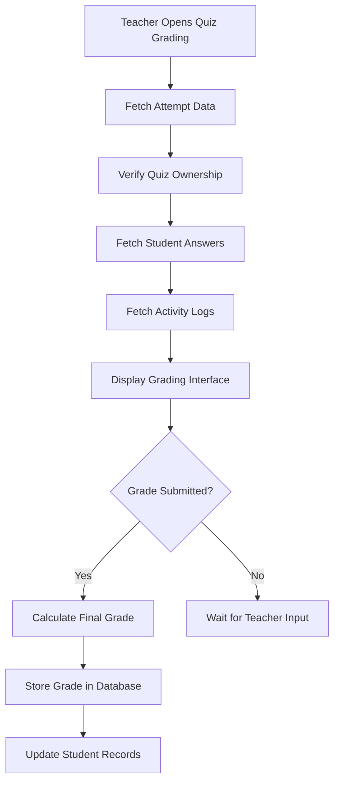

The activity logs include events such as tab switches, copy-paste attempts, and window exit attempts, which help teachers assess the academic integrity of the quiz attempt. This integration ensures that quiz grades are consistent with the overall grading system and are subject to the same validation and security measures.

**Section sources**
- [grading/[attemptId]/route.ts](file://app/api/teacher/grading/[attemptId]/route.ts#L4-L86)

## Error Handling and User Feedback
The grading system implements comprehensive error handling with meaningful user feedback to ensure a smooth user experience and aid in troubleshooting.

### Error Response Structure
All API endpoints follow a consistent error response pattern with descriptive messages:

```json
{
  "error": "Descriptive error message"
}
```

The system returns appropriate HTTP status codes for different error conditions:
- **400 Bad Request**: Invalid input or missing required fields
- **401 Unauthorized**: User not authenticated
- **403 Forbidden**: Insufficient permissions
- **404 Not Found**: Resource not found
- **429 Too Many Requests**: Rate limit exceeded
- **500 Internal Server Error**: Unexpected server error

### Client-Side Error Handling
The frontend components use the Sonner toast library to present user-friendly error messages:

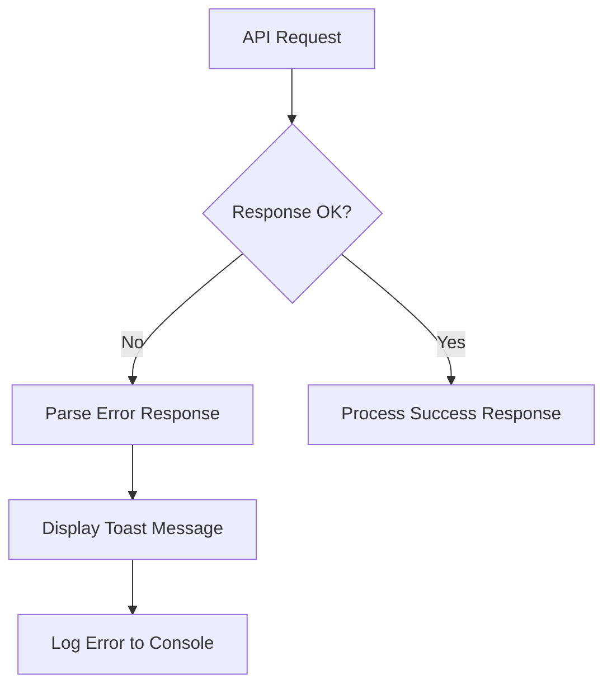

The error messages are designed to be actionable, helping teachers understand what went wrong and how to correct it. For example, "Student is not enrolled in this class" is more helpful than a generic "Invalid request" message.

**Section sources**
- [create/route.ts](file://app/api/teacher/grades/create/route.ts#L101-L104)
- [class/[id]/route.ts](file://app/api/teacher/grades/class/[id]/route.ts#L98-L100)
- [grading/[attemptId]/route.ts](file://app/api/teacher/grading/[attemptId]/route.ts#L82-L85)

## Conclusion
The Teacher Grading API provides a robust, secure, and user-friendly system for managing student grades within the school management platform. By implementing server-side grade calculation using the Philippine grading scale, comprehensive validation and security measures, and rate limiting to prevent abuse, the system ensures data integrity and academic integrity. The integration with quiz submission workflows and assignment management provides teachers with a comprehensive grading solution, while meaningful error handling and user feedback enhance the overall user experience. The system's architecture, with its clear separation of concerns and well-defined endpoints, makes it maintainable and extensible for future enhancements.