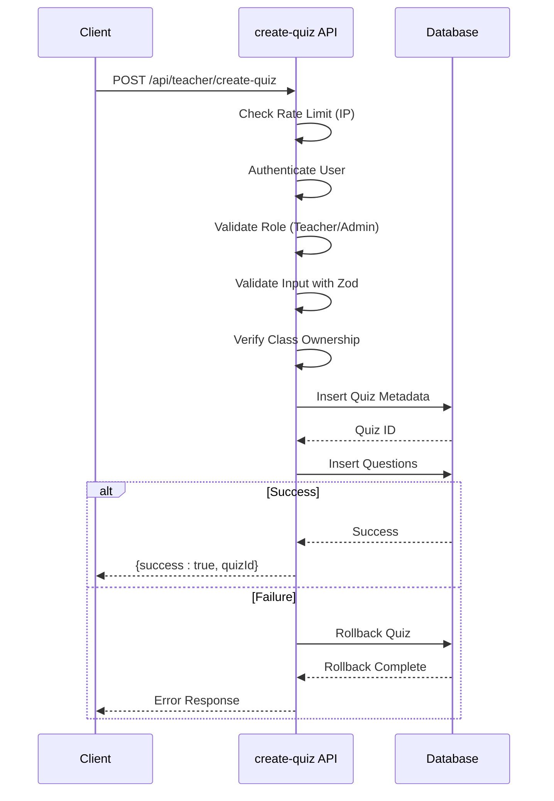
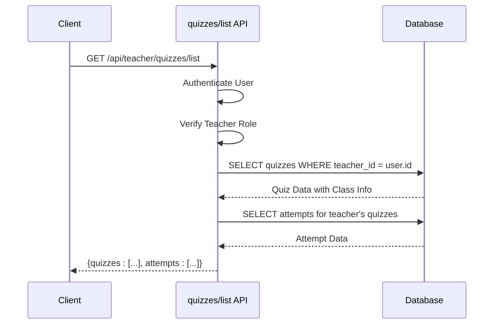
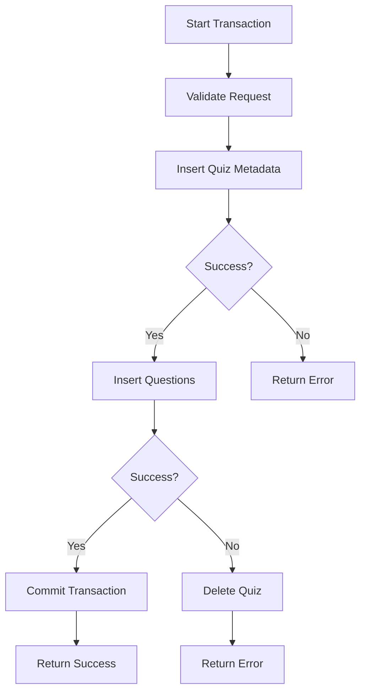
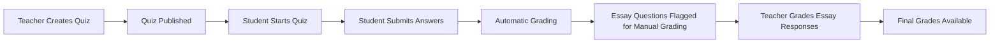

# Quiz Management

<cite>
**Referenced Files in This Document**   
- [create-quiz/route.ts](file://app/api/teacher/create-quiz/route.ts)
- [quizzes/list/route.ts](file://app/api/teacher/quizzes/list/route.ts)
- [types.ts](file://lib/supabase/types.ts)
- [20251219043525_create_quizzes_tables.sql](file://supabase/migrations/20251219043525_create_quizzes_tables.sql)
- [teacher-assignment-manager.tsx](file://components/teacher-assignment-manager.tsx)
- [validation-schemas.ts](file://lib/validation-schemas.ts)
- [rate-limit.ts](file://lib/rate-limit.ts)
- [security.ts](file://lib/security.ts)
- [start-quiz/route.ts](file://app/api/student/start-quiz/route.ts)
- [submit-quiz/route.ts](file://app/api/student/submit-quiz/route.ts)
</cite>

## Table of Contents
1. [Introduction](#introduction)
2. [Core Endpoints](#core-endpoints)
3. [Data Models](#data-models)
4. [Validation Schema](#validation-schema)
5. [Transactional Quiz Creation](#transactional-quiz-creation)
6. [Security and Access Control](#security-and-access-control)
7. [Rate Limiting Mechanism](#rate-limiting-mechanism)
8. [Quiz Lifecycle Workflow](#quiz-lifecycle-workflow)
9. [Integration with Teacher Interface](#integration-with-teacher-interface)
10. [Error Handling and Rollback](#error-handling-and-rollback)

## Introduction
The Teacher Quiz Management system provides a secure and robust API for creating, managing, and grading quizzes within an educational platform. This documentation details the core functionality of the quiz creation and retrieval endpoints, focusing on validation, transactional integrity, security measures, and integration with the teacher interface. The system enforces strict data validation, role-based access control, and rate limiting to ensure data integrity and prevent abuse.

## Core Endpoints

### create-quiz Endpoint
The `create-quiz` endpoint handles the creation of new quizzes with comprehensive validation and security checks. It performs the following operations in sequence:
1. IP-based rate limiting
2. Authentication and role verification
3. Zod schema validation of input data
4. Class ownership verification
5. Atomic insertion of quiz and associated questions



**Diagram sources**
- [create-quiz/route.ts](file://app/api/teacher/create-quiz/route.ts#L26-L124)

**Section sources**
- [create-quiz/route.ts](file://app/api/teacher/create-quiz/route.ts#L1-L124)

### quizzes/list Endpoint
The `quizzes/list` endpoint retrieves all quizzes owned by the authenticated teacher, along with their associated attempts. It implements strict filtering to ensure teachers can only access their own quizzes.



**Diagram sources**
- [quizzes/list/route.ts](file://app/api/teacher/quizzes/list/route.ts#L4-L59)

**Section sources**
- [quizzes/list/route.ts](file://app/api/teacher/quizzes/list/route.ts#L1-L59)

## Data Models

### DbQuiz Interface
The DbQuiz interface defines the structure of quiz entities in the system.

**Table: DbQuiz Fields**
| Field | Type | Constraints | Description |
|-------|------|-------------|-------------|
| id | string | UUID, Primary Key | Unique identifier for the quiz |
| title | string | Min 3 chars | Title of the quiz |
| class_id | string | UUID, Foreign Key | ID of the associated class |
| teacher_id | string | UUID, Foreign Key | ID of the creating teacher |
| description | string | Optional | Quiz description |
| duration | number | 1-180 minutes | Time limit for quiz completion |
| due_date | string | Optional, Nullable | Deadline for quiz submission |
| status | enum | draft/published/closed | Current state of the quiz |
| created_at | string | Timestamp | Creation timestamp |

**Section sources**
- [types.ts](file://lib/supabase/types.ts#L157-L167)
- [20251219043525_create_quizzes_tables.sql](file://supabase/migrations/20251219043525_create_quizzes_tables.sql#L1-L11)

### DbQuizQuestion Interface
The DbQuizQuestion interface defines the structure of quiz questions.

**Table: DbQuizQuestion Fields**
| Field | Type | Constraints | Description |
|-------|------|-------------|-------------|
| id | string | UUID, Primary Key | Unique identifier for the question |
| quiz_id | string | UUID, Foreign Key | ID of the parent quiz |
| type | enum | multiple-choice/true-false/identification/essay | Question type |
| question | string | Required | Question text |
| options | string[] | Optional, Nullable | Answer choices for multiple choice |
| correct_answer | string | Optional, Nullable | Correct answer (text or index) |
| points | number | 1-100 | Points awarded for correct answer |
| case_sensitive | boolean | Default: false | Whether answer comparison is case sensitive |
| sort_order | number | Default: 0 | Order of question in the quiz |

**Section sources**
- [types.ts](file://lib/supabase/types.ts#L169-L179)
- [20251219043525_create_quizzes_tables.sql](file://supabase/migrations/20251219043525_create_quizzes_tables.sql#L13-L23)

## Validation Schema
The system uses Zod for robust input validation, ensuring data integrity and preventing injection attacks.

### Question Validation Schema
```typescript
const questionSchema = z.object({
  type: z.enum(["multiple-choice", "true-false", "identification", "essay"]),
  question: z.string().min(1, "Question text is required"),
  options: z.array(z.string()).optional().nullable(),
  correctAnswer: z.union([z.string(), z.number()]).optional().nullable(),
  points: z.number().min(1).max(100),
  caseSensitive: z.boolean().optional(),
})
```

### Quiz Validation Schema
```typescript
const quizSchema = z.object({
  title: z.string().min(3, "Title must be at least 3 characters"),
  classId: z.string().uuid("Invalid Class ID"),
  description: z.string().optional(),
  duration: z.number().min(1).max(180),
  dueDate: z.string().optional().nullable(),
  questions: z.array(questionSchema).min(1, "At least one question is required").max(50, "Max 50 questions allowed"),
})
```

**Section sources**
- [create-quiz/route.ts](file://app/api/teacher/create-quiz/route.ts#L8-L24)

## Transactional Quiz Creation
The quiz creation process ensures atomicity through a two-step insertion with explicit rollback handling.

### Transaction Flow


The system first inserts the quiz metadata and obtains the generated quiz ID. Only upon successful insertion does it proceed to insert the associated questions. If question insertion fails, the system explicitly deletes the previously created quiz record to maintain data consistency.

**Section sources**
- [create-quiz/route.ts](file://app/api/teacher/create-quiz/route.ts#L79-L116)

## Security and Access Control
The system implements multiple layers of security to protect quiz data and prevent unauthorized access.

### Role-Based Access Control
- **Teachers**: Can create quizzes for their own classes and view their quizzes
- **Admins**: Have full access to all quiz functionality
- **Students**: Can only access quizzes through designated student endpoints

### Class Ownership Verification
When creating a quiz, the system verifies that the teacher owns the specified class:

```typescript
if (userData.role === "teacher") {
  const { data: classData } = await supabase
    .from("classes")
    .select("teacher_id")
    .eq("id", classId)
    .single()
  
  if (classData?.teacher_id !== user.id) {
    return NextResponse.json(
      { error: "You can only create quizzes for your own classes" }, 
      { status: 403 }
    )
  }
}
```

**Section sources**
- [create-quiz/route.ts](file://app/api/teacher/create-quiz/route.ts#L43-L77)

## Rate Limiting Mechanism
The system implements IP-based rate limiting to prevent abuse of the quiz creation endpoint.

### Rate Limit Configuration
- **Endpoint**: create-quiz
- **Limit**: 5 requests per minute
- **Identifier**: Client IP address
- **Mechanism**: Atomic RPC call to check_rate_limit function

```typescript
const isAllowed = await checkRateLimit(ip, "create-quiz", 5, 60 * 1000)
```

The rate limiting uses Supabase's service role key to bypass Row Level Security, ensuring reliable rate limit checks even during authentication issues.

**Section sources**
- [create-quiz/route.ts](file://app/api/teacher/create-quiz/route.ts#L28-L34)
- [rate-limit.ts](file://lib/rate-limit.ts#L25-L56)
- [security.ts](file://lib/security.ts#L73-L96)

## Quiz Lifecycle Workflow
The complete workflow from quiz creation to student submission and grading.



### Key Workflow Stages
1. **Creation**: Teacher creates quiz with questions through the create-quiz endpoint
2. **Publication**: Quiz status is set to "published" and becomes available to students
3. **Attempt**: Student starts quiz through start-quiz endpoint, receiving questions
4. **Submission**: Student submits answers through submit-quiz endpoint
5. **Grading**: System automatically grades non-essay questions; essay questions require manual grading
6. **Review**: Teacher reviews submissions and provides feedback through the interface

**Section sources**
- [create-quiz/route.ts](file://app/api/teacher/create-quiz/route.ts)
- [start-quiz/route.ts](file://app/api/student/start-quiz/route.ts)
- [submit-quiz/route.ts](file://app/api/student/submit-quiz/route.ts)

## Integration with Teacher Interface
The teacher-assignment-manager component provides the user interface for quiz management.

### Component Features
- **Class Selection**: Teachers can select which class to create quizzes for
- **Quiz Creation**: Form interface for creating new quizzes with questions
- **Submission Management**: View and grade student submissions
- **Progress Tracking**: Monitor grading progress with visual indicators

The component integrates with the backend API endpoints to provide a seamless quiz management experience.

**Section sources**
- [teacher-assignment-manager.tsx](file://components/teacher-assignment-manager.tsx#L1-L485)

## Error Handling and Rollback
The system implements comprehensive error handling to maintain data integrity.

### Error Handling Strategy
- **Validation Errors**: Return 400 with specific error messages
- **Authentication Errors**: Return 401 for unauthorized access
- **Authorization Errors**: Return 403 for forbidden operations
- **Rate Limiting**: Return 429 with appropriate message
- **Server Errors**: Return 500 with generic error message

### Rollback Procedure
When question insertion fails after successful quiz creation, the system performs an explicit rollback:

```typescript
if (questionsError) {
  // Rollback quiz if questions fail
  await supabase.from("quizzes").delete().eq("id", quizData.id)
  throw questionsError
}
```

This ensures that incomplete quizzes are not left in the database, maintaining data consistency.

**Section sources**
- [create-quiz/route.ts](file://app/api/teacher/create-quiz/route.ts#L113-L116)
- [create-quiz/route.ts](file://app/api/teacher/create-quiz/route.ts#L120-L123)