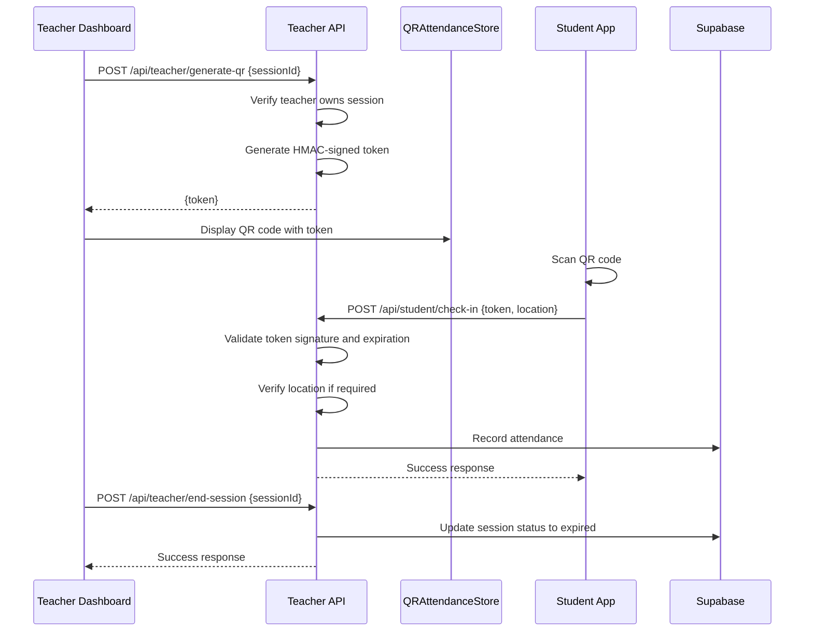

# Teacher API

<cite>
**Referenced Files in This Document**   
- [types.ts](file://lib/supabase/types.ts)
- [qr-attendance-store.ts](file://lib/qr-attendance-store.ts)
- [classes/route.ts](file://app/api/teacher/classes/route.ts)
- [my-classes/route.ts](file://app/api/teacher/my-classes/route.ts)
- [attendance/save/route.ts](file://app/api/teacher/attendance/save/route.ts)
- [attendance/class-data/route.ts](file://app/api/teacher/attendance/class-data/route.ts)
- [grades/create/route.ts](file://app/api/teacher/grades/create/route.ts)
- [grades/class/[id]/route.ts](file://app/api/teacher/grades/class/[id]/route.ts)
- [create-quiz/route.ts](file://app/api/teacher/create-quiz/route.ts)
- [quizzes/list/route.ts](file://app/api/teacher/quizzes/list/route.ts)
- [grading/[attemptId]/route.ts](file://app/api/teacher/grading/[attemptId]/route.ts)
- [generate-qr/route.ts](file://app/api/teacher/generate-qr/route.ts)
- [end-session/route.ts](file://app/api/teacher/end-session/route.ts)
</cite>

## Table of Contents
1. [Introduction](#introduction)
2. [Class Management Endpoints](#class-management-endpoints)
3. [Attendance Management](#attendance-management)
4. [Grade Submission](#grade-submission)
5. [Quiz Management](#quiz-management)
6. [Session Control](#session-control)
7. [Security and Rate Limiting](#security-and-rate-limiting)
8. [Data Models](#data-models)
9. [Integration Examples](#integration-examples)

## Introduction
The Teacher API provides a comprehensive set of endpoints for teachers to manage their classes, attendance, grades, quizzes, and student check-ins. All endpoints enforce strict role-based access control, ensuring that only authenticated teachers can access functionality relevant to their classes. The API follows RESTful principles with clear URL structures and standardized response formats.

**Section sources**
- [types.ts](file://lib/supabase/types.ts)
- [classes/route.ts](file://app/api/teacher/classes/route.ts)

## Class Management Endpoints

### GET /api/teacher/classes
Retrieves all classes owned by the authenticated teacher with student count information.

- **Method**: GET
- **Authentication**: Required (teacher role)
- **Response**: 
```json
{
  "classes": [
    {
      "id": "string",
      "name": "string",
      "grade": "string",
      "section": "string",
      "subject": "string",
      "schedule": "string",
      "room": "string",
      "student_count": "number"
    }
  ]
}
```

### GET /api/teacher/my-classes
Retrieves basic information about classes owned by the teacher.

- **Method**: GET
- **Authentication**: Required (teacher role)
- **Response**: 
```json
{
  "classes": [
    {
      "id": "string",
      "name": "string",
      "grade": "string",
      "section": "string"
    }
  ]
}
```

**Section sources**
- [classes/route.ts](file://app/api/teacher/classes/route.ts#L4-L59)
- [my-classes/route.ts](file://app/api/teacher/my-classes/route.ts#L4-L35)

## Attendance Management

### POST /api/teacher/attendance/class-data
Fetches student enrollment and attendance data for a specific class and date.

- **Method**: POST
- **Authentication**: Required (teacher role)
- **Request Body**:
```json
{
  "classId": "string",
  "date": "string"
}
```
- **Response**:
```json
{
  "students": [
    {
      "id": "string",
      "name": "string",
      "email": "string",
      "avatar": "string"
    }
  ],
  "attendance": {
    "studentId": "present|absent|late|excused"
  }
}
```

### POST /api/teacher/attendance/save
Saves attendance records for multiple students in one or more classes.

- **Method**: POST
- **Authentication**: Required (teacher role)
- **Request Body**:
```json
{
  "records": [
    {
      "student_id": "string",
      "class_id": "string",
      "date": "string",
      "status": "present|absent|late|excused"
    }
  ]
}
```
- **Security**: Validates that the teacher owns all classes referenced in the batch

**Section sources**
- [attendance/class-data/route.ts](file://app/api/teacher/attendance/class-data/route.ts#L4-L67)
- [attendance/save/route.ts](file://app/api/teacher/attendance/save/route.ts#L4-L58)

## Grade Submission

### POST /api/teacher/grades/create
Creates a new grade record for a student in a class.

- **Method**: POST
- **Authentication**: Required (teacher or admin role)
- **Rate Limit**: 20 requests per minute per user
- **Request Body**:
```json
{
  "studentId": "string",
  "classId": "string",
  "score": "number",
  "maxScore": "number",
  "type": "exam|quiz|assignment|project",
  "date": "string"
}
```
- **Validation**: 
  - Teacher must own the class
  - Student must be enrolled in the class
  - Score cannot exceed maxScore
  - Percentage and Philippine grade are calculated server-side

### GET /api/teacher/grades/class/[id]
Retrieves all students and grades for a specific class.

- **Method**: GET
- **Authentication**: Required (teacher role)
- **Parameters**: classId (in URL path)
- **Response**:
```json
{
  "students": [
    {
      "id": "string",
      "name": "string",
      "email": "string",
      "avatar": "string"
    }
  ],
  "grades": [
    {
      "id": "string",
      "student_id": "string",
      "class_id": "string",
      "score": "number",
      "max_score": "number",
      "percentage": "number",
      "grade": "number",
      "type": "exam|quiz|assignment|project",
      "date": "string"
    }
  ]
}
```
- **Note**: Includes both manually entered grades and quiz attempts

**Section sources**
- [grades/create/route.ts](file://app/api/teacher/grades/create/route.ts#L6-L105)
- [grades/class/[id]/route.ts](file://app/api/teacher/grades/class/[id]/route.ts#L5-L101)

## Quiz Management

### POST /api/teacher/create-quiz
Creates a new quiz with questions for a class.

- **Method**: POST
- **Authentication**: Required (teacher or admin role)
- **Rate Limit**: 5 requests per minute per IP
- **Request Body**:
```json
{
  "title": "string",
  "classId": "string",
  "description": "string",
  "duration": "number",
  "dueDate": "string",
  "questions": [
    {
      "type": "multiple-choice|true-false|identification|essay",
      "question": "string",
      "options": ["string"],
      "correctAnswer": "string",
      "points": "number",
      "caseSensitive": "boolean"
    }
  ]
}
```
- **Validation**: Uses Zod schema for strict input validation
- **Security**: Teacher must own the target class
- **Transaction**: Quiz creation and question insertion are atomic

### GET /api/teacher/quizzes/list
Retrieves all quizzes created by the teacher with associated attempts.

- **Method**: GET
- **Authentication**: Required (teacher role)
- **Response**:
```json
{
  "quizzes": [
    {
      "id": "string",
      "title": "string",
      "class_id": "string",
      "teacher_id": "string",
      "description": "string",
      "duration": "number",
      "due_date": "string",
      "status": "draft|published|closed",
      "created_at": "string",
      "class": {
        "id": "string",
        "name": "string",
        "grade": "string",
        "section": "string"
      },
      "questions": [
        {
          "id": "string",
          "quiz_id": "string",
          "type": "string",
          "question": "string",
          "options": ["string"],
          "correct_answer": "string",
          "points": "number",
          "case_sensitive": "boolean",
          "sort_order": "number"
        }
      ],
      "reopens": [
        {
          "id": "string",
          "quiz_id": "string",
          "student_id": "string",
          "request_date": "string",
          "status": "pending|approved|rejected",
          "reason": "string",
          "student": {
            "id": "string",
            "name": "string"
          }
        }
      ]
    }
  ],
  "attempts": [
    {
      "id": "string",
      "quiz_id": "string",
      "student_id": "string",
      "score": "number",
      "max_score": "number",
      "percentage": "number",
      "completed_at": "string",
      "tab_switches": "number",
      "copy_paste_count": "number",
      "exit_attempts": "number",
      "student": {
        "id": "string",
        "name": "string"
      }
    }
  ]
}
```

### GET /api/teacher/grading/[attemptId]
Retrieves detailed information about a specific quiz attempt for grading.

- **Method**: GET
- **Authentication**: Required (teacher or admin role)
- **Parameters**: attemptId (in URL path)
- **Response**:
```json
{
  "attempt": {
    "id": "string",
    "quiz_id": "string",
    "student_id": "string",
    "score": "number",
    "max_score": "number",
    "percentage": "number",
    "tab_switches": "number",
    "copy_paste_count": "number",
    "exit_attempts": "number"
  },
  "answers": [
    {
      "id": "string",
      "attempt_id": "string",
      "question_id": "string",
      "answer": "string",
      "is_correct": "boolean",
      "points_awarded": "number",
      "question": {
        "id": "string",
        "question": "string",
        "type": "string",
        "options": ["string"],
        "correct_answer": "string",
        "points": "number"
      }
    }
  ],
  "logs": [
    {
      "id": "string",
      "event_type": "string",
      "details": "any",
      "created_at": "string"
    }
  ]
}
```
- **Security**: Only the quiz creator (teacher) or admin can access attempt details

**Section sources**
- [create-quiz/route.ts](file://app/api/teacher/create-quiz/route.ts#L26-L124)
- [quizzes/list/route.ts](file://app/api/teacher/quizzes/list/route.ts#L4-L59)
- [grading/[attemptId]/route.ts](file://app/api/teacher/grading/[attemptId]/route.ts#L4-L86)

## Session Control

### POST /api/teacher/generate-qr
Generates a secure QR code token for attendance check-in.

- **Method**: POST
- **Authentication**: Required (teacher or admin role)
- **Rate Limit**: 30 requests per minute per IP
- **Request Body**:
```json
{
  "sessionId": "string"
}
```
- **Response**:
```json
{
  "token": "string"
}
```
- **Security**: 
  - Uses HMAC-SHA256 signature with server secret
  - Token contains sessionId, timestamp, and signature
  - Base64 encoded JSON payload
  - Teachers can only generate tokens for their own sessions

### POST /api/teacher/end-session
Ends an active QR attendance session.

- **Method**: POST
- **Authentication**: Required (teacher or admin role)
- **Request Body**:
```json
{
  "sessionId": "string"
}
```
- **Security**: Teachers can only end their own sessions

**Section sources**
- [generate-qr/route.ts](file://app/api/teacher/generate-qr/route.ts#L7-L79)
- [end-session/route.ts](file://app/api/teacher/end-session/route.ts#L4-L56)

## Security and Rate Limiting

### Authentication
All endpoints require authentication via Supabase auth. The user's role is verified by querying the users table directly.

### Role-Based Access Control
- **Teacher Role**: Can only access data for classes they own
- **Admin Role**: Has elevated privileges across the system
- **Ownership Verification**: Implemented at the database query level using teacher_id filters

### Rate Limiting
Implemented using Redis-based rate limiting with different thresholds:
- **Grade Creation**: 20 requests per minute per user ID
- **Quiz Creation**: 5 requests per minute per IP address
- **QR Generation**: 30 requests per minute per IP address

### Data Isolation
- Teachers can only access classes where they are the teacher_id
- Grade submission requires verification that the student is enrolled in the class
- Quiz attempts are only accessible to the quiz creator

**Section sources**
- [grades/create/route.ts](file://app/api/teacher/grades/create/route.ts#L15-L20)
- [create-quiz/route.ts](file://app/api/teacher/create-quiz/route.ts#L28-L34)
- [generate-qr/route.ts](file://app/api/teacher/generate-qr/route.ts#L9-L17)

## Data Models

```mermaid
erDiagram
USER {
string id PK
string email
string name
string role
string avatar
string phone
string address
timestamp created_at
timestamp updated_at
}
CLASS {
string id PK
string name
string grade
string section
string subject
string schedule
string room
string teacher_id FK
timestamp created_at
}
ATTENDANCE_RECORD {
string id PK
string student_id FK
string class_id FK
date date
string status
timestamp created_at
}
GRADE {
string id PK
string student_id FK
string class_id FK
number score
number max_score
number percentage
number grade
string type
date date
timestamp created_at
}
QUIZ {
string id PK
string title
string class_id FK
string teacher_id FK
string description
number duration
date due_date
string status
timestamp created_at
}
QUIZ_QUESTION {
string id PK
string quiz_id FK
string type
string question
jsonb options
string correct_answer
number points
boolean case_sensitive
number sort_order
}
QUIZ_ATTEMPT {
string id PK
string quiz_id FK
string student_id FK
number score
number max_score
number percentage
timestamp completed_at
number tab_switches
number copy_paste_count
number exit_attempts
}
QR_ATTENDANCE_SESSION {
string id PK
string class_id FK
string teacher_id FK
date date
time start_time
time end_time
string qr_code
string status
boolean require_location
timestamp created_at
}
USER ||--o{ CLASS : teaches
USER ||--o{ GRADE : grades
USER ||--o{ QUIZ : creates
USER ||--o{ QUIZ_ATTEMPT : attempts
CLASS ||--o{ ATTENDANCE_RECORD : has
CLASS ||--o{ GRADE : has
CLASS ||--o{ QUIZ : contains
CLASS ||--o{ QR_ATTENDANCE_SESSION : has
QUIZ ||--o{ QUIZ_QUESTION : contains
QUIZ ||--o{ QUIZ_ATTEMPT : has
QUIZ_ATTEMPT ||--o{ QUIZ_ATTEMPT_ANSWER : contains
```

**Diagram sources**
- [types.ts](file://lib/supabase/types.ts#L114-L234)

## Integration Examples

### QR Attendance Flow


**Diagram sources**
- [generate-qr/route.ts](file://app/api/teacher/generate-qr/route.ts#L7-L79)
- [end-session/route.ts](file://app/api/teacher/end-session/route.ts#L4-L56)
- [qr-attendance-store.ts](file://lib/qr-attendance-store.ts#L20-L100)

### Grading Workflow
```mermaid
flowchart TD
A[Teacher accesses quiz list] --> B{Select quiz attempt}
B --> C[GET /api/teacher/grading/[attemptId]]
C --> D[Verify ownership of quiz]
D --> E[Fetch attempt details and answers]
E --> F[Display student responses]
F --> G[Manual grading for essay questions]
G --> H[Submit final score]
H --> I[POST /api/teacher/grades/create]
I --> J[Validate student enrollment]
J --> K[Calculate percentage and grade]
K --> L[Store grade record]
L --> M[Update student dashboard]
```

**Diagram sources**
- [grading/[attemptId]/route.ts](file://app/api/teacher/grading/[attemptId]/route.ts#L4-L86)
- [grades/create/route.ts](file://app/api/teacher/grades/create/route.ts#L6-L105)

**Section sources**
- [qr-attendance-store.ts](file://lib/qr-attendance-store.ts#L5-L18)
- [grades/create/route.ts](file://app/api/teacher/grades/create/route.ts#L78-L79)
- [grade-utils.ts](file://lib/grade-utils.ts)