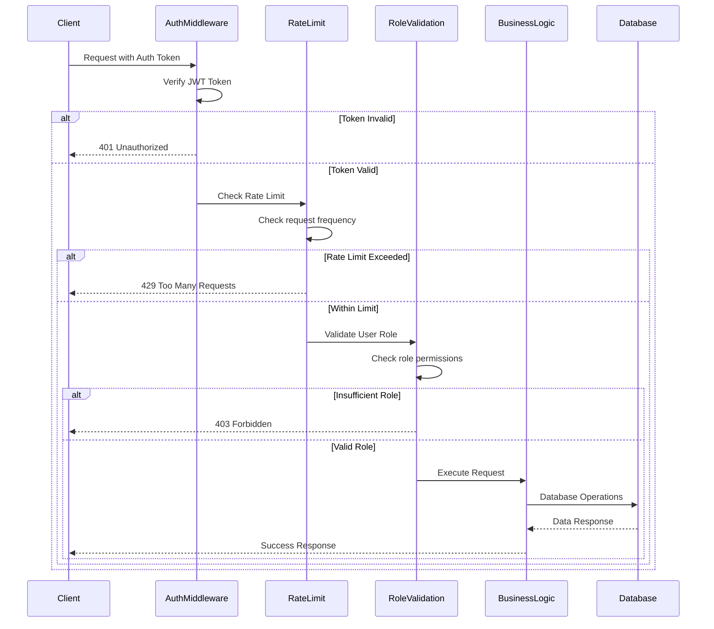
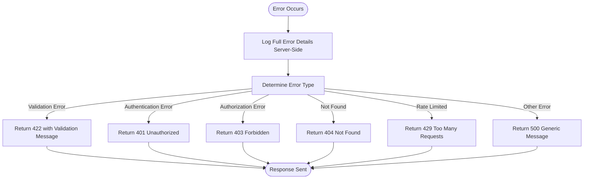
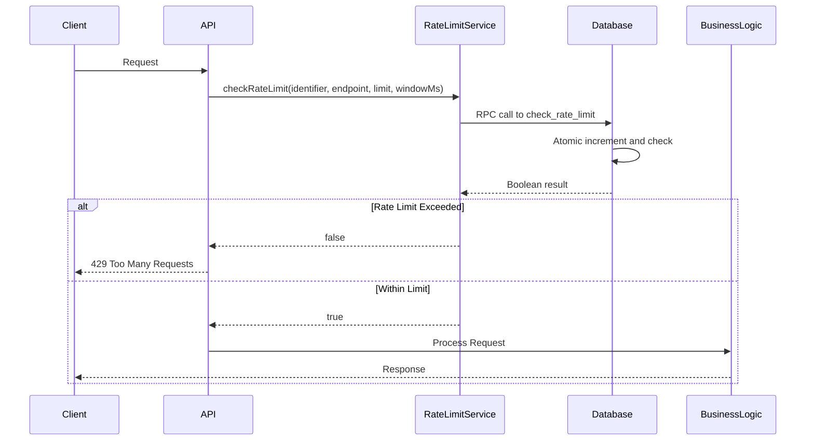

# API Endpoints

<cite>
**Referenced Files in This Document**   
- [app/api/admin/create-class/route.ts](file://app/api/admin/create-class/route.ts)
- [app/api/teacher/attendance/save/route.ts](file://app/api/teacher/attendance/save/route.ts)
- [app/api/auth/login/route.ts](file://app/api/auth/login/route.ts)
- [app/api/student/check-in/route.ts](file://app/api/student/check-in/route.ts)
- [app/api/parent/children/route.ts](file://app/api/parent/children/route.ts)
- [app/api/admin/students/create/route.ts](file://app/api/admin/students/create/route.ts)
- [app/api/teacher/grades/create/route.ts](file://app/api/teacher/grades/create/route.ts)
- [app/api/student/grades/route.ts](file://app/api/student/grades/route.ts)
- [app/api/parent/child/[id]/grades/route.ts](file://app/api/parent/child/[id]/grades/route.ts)
- [app/api/teacher/attendance/class-data/route.ts](file://app/api/teacher/attendance/class-data/route.ts)
- [lib/api-errors.ts](file://lib/api-errors.ts)
- [lib/rate-limit.ts](file://lib/rate-limit.ts)
- [lib/security.ts](file://lib/security.ts)
- [SECURITY.md](file://SECURITY.md)
</cite>

## Table of Contents
1. [Introduction](#introduction)
2. [API Security and Middleware](#api-security-and-middleware)
3. [Authentication Endpoints](#authentication-endpoints)
4. [Admin Endpoints](#admin-endpoints)
5. [Teacher Endpoints](#teacher-endpoints)
6. [Student Endpoints](#student-endpoints)
7. [Parent Endpoints](#parent-endpoints)
8. [Error Handling](#error-handling)
9. [Rate Limiting](#rate-limiting)
10. [Security Considerations](#security-considerations)

## Introduction
This document provides comprehensive documentation for all backend API endpoints in the School-Management-System. The API is organized by user role (admin, teacher, student, parent) and functional domain (user management, attendance, grades, etc.). Each endpoint is documented with its HTTP method, URL pattern, request parameters, response format, authentication requirements, and error codes. The system implements robust security measures including role-based access control, rate limiting, input validation, and audit logging.

## API Security and Middleware
The API implements a multi-layered security approach with consistent middleware patterns across all endpoints. Every request passes through authentication and authorization checks before reaching the business logic.



**Diagram sources**
- [lib/api-errors.ts](file://lib/api-errors.ts#L21-L41)
- [lib/rate-limit.ts](file://lib/rate-limit.ts#L25-L55)
- [lib/security.ts](file://lib/security.ts#L20-L67)

**Section sources**
- [lib/api-errors.ts](file://lib/api-errors.ts)
- [lib/rate-limit.ts](file://lib/rate-limit.ts)
- [lib/security.ts](file://lib/security.ts)

## Authentication Endpoints
Authentication endpoints handle user login, logout, and session management with enhanced security features.

### POST /api/auth/login
Authenticates a user and creates a new session.

**Request**
- Method: POST
- URL: `/api/auth/login`
- Headers: `Content-Type: application/json`
- Body:
```json
{
  "email": "string",
  "password": "string",
  "fingerprint": "object (optional)"
}
```

**Response**
- Success (200): 
```json
{
  "user": "object",
  "role": "string",
  "isNewDevice": "boolean"
}
```
- Unauthorized (401): `{ "error": "Invalid login credentials" }`
- Rate Limited (429): `{ "error": "Too many login attempts. Please try again later." }`

**Authentication Requirements**
- No authentication required
- Rate limiting: 5 attempts per minute per IP address
- Fail-closed during database outages to prevent brute force attacks

**Security Features**
- Generic error messages to prevent user enumeration
- Session binding with client fingerprint
- IP address tracking for security monitoring

**Section sources**
- [app/api/auth/login/route.ts](file://app/api/auth/login/route.ts)

### POST /api/auth/logout
Terminates the current user session.

**Request**
- Method: POST
- URL: `/api/auth/logout`
- Headers: `Authorization: Bearer <token>`

**Response**
- Success (200): `{ "success": true }`
- Unauthorized (401): `{ "error": "Unauthorized" }`

**Authentication Requirements**
- Valid JWT token required
- User must be authenticated

**Section sources**
- [app/api/auth/logout/route.ts](file://app/api/auth/logout/route.ts)

### GET /api/auth/me
Retrieves the current authenticated user's profile information.

**Request**
- Method: GET
- URL: `/api/auth/me`
- Headers: `Authorization: Bearer <token>`

**Response**
- Success (200): `{ "user": "object" }`
- Unauthorized (401): `{ "error": "Unauthorized" }`

**Authentication Requirements**
- Valid JWT token required
- User must be authenticated

**Section sources**
- [app/api/auth/me/route.ts](file://app/api/auth/me/route.ts)

## Admin Endpoints
Admin endpoints provide system management capabilities for school administrators.

### POST /api/admin/create-class
Creates a new class and associated schedule entries.

**Request**
- Method: POST
- URL: `/api/admin/create-class`
- Headers: `Authorization: Bearer <token>`, `Content-Type: application/json`
- Body:
```json
{
  "name": "string",
  "grade": "string",
  "section": "string",
  "subject": "string",
  "teacher_id": "string (optional)",
  "room": "string (optional)",
  "scheduleDays": "string (e.g., 'MWF')",
  "scheduleTime": "string (e.g., '9:00 AM')"
}
```

**Response**
- Success (200): `{ "success": true, "class": "object" }`
- Unauthorized (401): `{ "error": "Unauthorized" }`
- Forbidden (403): `{ "error": "Forbidden" }`
- Bad Request (400): `{ "error": "Name and Subject are required" }`
- Rate Limited (429): `{ "error": "Too many requests. Please wait." }`

**Authentication Requirements**
- Valid JWT token required
- User role must be "admin"
- Rate limiting: 10 requests per minute per IP address

**Real-world Usage**
```javascript
// Creating a new Mathematics class for Grade 10
fetch('/api/admin/create-class', {
  method: 'POST',
  headers: {
    'Authorization': 'Bearer ' + token,
    'Content-Type': 'application/json'
  },
  body: JSON.stringify({
    name: 'Mathematics 10',
    grade: '10',
    section: 'A',
    subject: 'Mathematics',
    teacher_id: 'teacher-123',
    room: 'Room 201',
    scheduleDays: 'MWF',
    scheduleTime: '9:00 AM'
  })
})
```

**Section sources**
- [app/api/admin/create-class/route.ts](file://app/api/admin/create-class/route.ts)

### POST /api/admin/students/create
Creates a new student account with comprehensive profile information.

**Request**
- Method: POST
- URL: `/api/admin/students/create`
- Headers: `Authorization: Bearer <token>`, `Content-Type: application/json`
- Body: Comprehensive student information including personal details, academic information, family information, and medical data.

**Response**
- Success (200): `{ "success": true, "id": "string" }`
- Unauthorized (401): `{ "error": "Unauthorized" }`
- Forbidden (403): `{ "error": "Forbidden" }`
- Bad Request (400): `{ "error": "Missing required fields" }`

**Authentication Requirements**
- Valid JWT token required
- User role must be "admin"
- Uses service role key for database operations

**Section sources**
- [app/api/admin/students/create/route.ts](file://app/api/admin/students/create/route.ts)

## Teacher Endpoints
Teacher endpoints provide functionality for classroom management, attendance, and grading.

### POST /api/teacher/attendance/save
Submits attendance records for one or more students in a class.

**Request**
- Method: POST
- URL: `/api/teacher/attendance/save`
- Headers: `Authorization: Bearer <token>`, `Content-Type: application/json`
- Body:
```json
{
  "records": [
    {
      "student_id": "string",
      "class_id": "string",
      "date": "string (ISO date)",
      "status": "present|absent|late|excused"
    }
  ]
}
```

**Response**
- Success (200): `{ "success": true }`
- Unauthorized (401): `{ "error": "Unauthorized" }`
- Forbidden (403): `{ "error": "Forbidden" }`
- Bad Request (400): `{ "error": "Invalid data" }`

**Authentication Requirements**
- Valid JWT token required
- User role must be "teacher"
- Teacher must own all classes referenced in the request

**Security Validation**
- Verifies ownership of all classes in the batch
- Uses upsert operation with conflict resolution on student_id, class_id, and date

**Section sources**
- [app/api/teacher/attendance/save/route.ts](file://app/api/teacher/attendance/save/route.ts)

### POST /api/teacher/attendance/class-data
Retrieves class enrollment and attendance data for a specific date.

**Request**
- Method: POST
- URL: `/api/teacher/attendance/class-data`
- Headers: `Authorization: Bearer <token>`, `Content-Type: application/json`
- Body:
```json
{
  "classId": "string",
  "date": "string (ISO date)"
}
```

**Response**
- Success (200): 
```json
{
  "students": "array",
  "attendance": "object"
}
```
- Unauthorized (401): `{ "error": "Unauthorized" }`
- Forbidden (403): `{ "error": "Forbidden: You do not own this class" }`
- Bad Request (400): `{ "error": "Missing parameters" }`

**Authentication Requirements**
- Valid JWT token required
- User role must be "teacher"
- Teacher must own the requested class

**Section sources**
- [app/api/teacher/attendance/class-data/route.ts](file://app/api/teacher/attendance/class-data/route.ts)

### POST /api/teacher/grades/create
Creates a new grade record for a student in a class.

**Request**
- Method: POST
- URL: `/api/teacher/grades/create`
- Headers: `Authorization: Bearer <token>`, `Content-Type: application/json`
- Body:
```json
{
  "studentId": "string",
  "classId": "string",
  "score": "number",
  "maxScore": "number",
  "type": "quiz|exam|assignment|project",
  "date": "string (ISO date)"
}
```

**Response**
- Success (200): `{ "success": true, "grade": "object" }`
- Unauthorized (401): `{ "error": "Unauthorized" }`
- Forbidden (403): `{ "error": "Forbidden" }`
- Bad Request (400): `{ "error": "Missing required fields" }`
- Rate Limited (429): `{ "error": "Too many requests. Please wait." }`

**Authentication Requirements**
- Valid JWT token required
- User role must be "teacher" or "admin"
- Rate limiting: 20 requests per minute per user ID

**Business Logic**
- Validates score does not exceed maximum score
- Verifies teacher owns the class (for non-admin users)
- Verifies student is enrolled in the class
- Calculates percentage and converts to Philippine grading system

**Section sources**
- [app/api/teacher/grades/create/route.ts](file://app/api/teacher/grades/create/route.ts)

## Student Endpoints
Student endpoints provide access to personal academic information and participation features.

### POST /api/student/check-in
Processes student check-in via QR code scanning for attendance purposes.

**Request**
- Method: POST
- URL: `/api/student/check-in`
- Headers: `Authorization: Bearer <token>`, `Content-Type: application/json`
- Body:
```json
{
  "qrData": "string (base64 encoded)",
  "latitude": "number (optional)",
  "longitude": "number (optional)"
}
```

**Response**
- Success (200): `{ "success": true }`
- Unauthorized (401): `{ "error": "Unauthorized" }`
- Forbidden (403): Various security-related error messages
- Bad Request (400): `{ "error": "Invalid QR code format" }`
- Rate Limited (429): `{ "error": "Too many check-in attempts. Please wait." }`

**Authentication Requirements**
- Valid JWT token required
- User role must be "student"
- Rate limiting: 20 requests per minute per IP address

**Security Features**
- QR code signature verification using HMAC
- Strict 5-second validity window for QR codes
- Network fencing (school Wi-Fi enforcement when configured)
- GPS geofencing with anti-spoofing measures
- IP address hashing for privacy-preserving audit logs

**Section sources**
- [app/api/student/check-in/route.ts](file://app/api/student/check-in/route.ts)

### GET /api/student/grades
Retrieves the authenticated student's grade records.

**Request**
- Method: GET
- URL: `/api/student/grades`
- Headers: `Authorization: Bearer <token>`

**Response**
- Success (200): `{ "grades": "array" }`
- Unauthorized (401): `{ "error": "Unauthorized" }`
- Forbidden (403): `{ "error": "Forbidden" }`

**Authentication Requirements**
- Valid JWT token required
- User role must be "student"
- Server-side enforcement ensures students can only access their own grades

**Section sources**
- [app/api/student/grades/route.ts](file://app/api/student/grades/route.ts)

## Parent Endpoints
Parent endpoints provide access to their children's academic information.

### GET /api/parent/children
Retrieves a list of children associated with the authenticated parent.

**Request**
- Method: GET
- URL: `/api/parent/children`
- Headers: `Authorization: Bearer <token>`

**Response**
- Success (200): `{ "children": "array" }`
- Unauthorized (401): `{ "error": "Unauthorized" }`
- Forbidden (403): `{ "error": "Forbidden" }`

**Authentication Requirements**
- Valid JWT token required
- User role must be "parent"

**Data Includes**
- Child's basic information (name, email, avatar)
- Academic information (grade, section)
- Relationship type (e.g., father, mother, guardian)

**Section sources**
- [app/api/parent/children/route.ts](file://app/api/parent/children/route.ts)

### GET /api/parent/child/[id]/grades
Retrieves grade records for a specific child.

**Request**
- Method: GET
- URL: `/api/parent/child/{id}/grades`
- Headers: `Authorization: Bearer <token>`

**Response**
- Success (200): `{ "grades": "array" }`
- Unauthorized (401): `{ "error": "Unauthorized" }`
- Forbidden (403): `{ "error": "Not authorized to view this student's data" }`

**Authentication Requirements**
- Valid JWT token required
- User role must be "parent"
- Parent must have a verified relationship with the requested child

**Section sources**
- [app/api/parent/child/[id]/grades/route.ts](file://app/api/parent/child/[id]/grades/route.ts)

## Error Handling
The API implements a centralized error handling system to ensure consistent responses and prevent information disclosure.



**Diagram sources**
- [lib/api-errors.ts](file://lib/api-errors.ts#L21-L41)

**Section sources**
- [lib/api-errors.ts](file://lib/api-errors.ts)

### Error Response Structure
All error responses follow a consistent format:
```json
{ "error": "string" }
```

### Common Error Codes
| Status Code | Error Type | Description |
|-----------|-----------|-------------|
| 400 | Bad Request | Invalid request parameters or body |
| 401 | Unauthorized | Missing or invalid authentication token |
| 403 | Forbidden | Insufficient permissions for the requested operation |
| 404 | Not Found | Requested resource does not exist |
| 422 | Validation Error | Request failed validation checks |
| 429 | Too Many Requests | Rate limit exceeded |
| 500 | Internal Server Error | Unexpected server error occurred |

### Centralized Error Handling
The `handleApiError` function in `lib/api-errors.ts` ensures that:
- Full error details are logged server-side for debugging
- Generic error messages are returned to clients to prevent information disclosure
- Stack traces are never exposed to clients
- All errors are properly formatted as JSON responses

## Rate Limiting
The API implements database-backed rate limiting to prevent abuse and ensure system stability.

### Implementation
Rate limiting is implemented using Supabase's RPC (Remote Procedure Call) functions to ensure atomic operations and prevent race conditions.



**Diagram sources**
- [lib/rate-limit.ts](file://lib/rate-limit.ts#L25-L55)

**Section sources**
- [lib/rate-limit.ts](file://lib/rate-limit.ts)

### Rate Limiting Strategy
| Endpoint | Limit | Window | Fail Mode |
|---------|-------|--------|-----------|
| Login | 5 attempts | 1 minute | Closed (prevents brute force) |
| Create Class | 10 requests | 1 minute | Open |
| Check-in | 20 requests | 1 minute | Open |
| Create Grade | 20 requests | 1 minute | Open |

### Configuration
Rate limiting is configurable per endpoint with the following parameters:
- **identifier**: Unique key for rate limiting (IP address or User ID)
- **endpoint**: Action being performed (e.g., 'login', 'check-in')
- **limit**: Maximum requests allowed in the window
- **windowMs**: Time window in milliseconds
- **failOpen**: Behavior during database errors (true for availability, false for security)

## Security Considerations
The API implements multiple layers of security to protect sensitive student data and prevent common web vulnerabilities.

### Input Validation and Sanitization
All user inputs are validated and sanitized to prevent injection attacks and ensure data integrity.

**Request Body Validation**
- Uses Zod schemas for comprehensive validation
- Enforces data types, length limits, and format requirements
- Prevents XSS by validating URL protocols for avatar fields

**Search Input Sanitization**
- Trims whitespace and limits length
- Removes null bytes and control characters
- Escapes SQL LIKE/ILIKE special characters (% and _)
- Filters out potentially dangerous characters

**Section sources**
- [lib/security.ts](file://lib/security.ts#L98-L114)

### CSRF Protection
The API implements CSRF protection through origin validation.

**Origin Validation Process**
1. Checks the Origin and Referer headers
2. Compares against the configured site URL
3. Falls back to Host header comparison if needed
4. Rejects requests with missing or invalid headers for state-changing methods

**Section sources**
- [lib/security.ts](file://lib/security.ts#L20-L67)

### Audit Logging
Sensitive operations are logged for security monitoring and compliance.

**Logged Information**
- Action performed
- User ID
- Timestamp
- Hashed IP address (for privacy)
- Outcome (success/failure)

**Section sources**
- [SECURITY.md](file://SECURITY.md)

### Data Protection
The system implements several data protection measures:

**IP Address Hashing**
- Uses SHA-256 with salt to hash IP addresses
- Allows abuse detection while preserving user privacy
- Prevents rainbow table attacks

**Secure Client IP Extraction**
- Prioritizes platform-provided IP (request.ip)
- Uses x-vercel-forwarded-for header when available
- Provides fallbacks for development environments

**Section sources**
- [lib/security.ts](file://lib/security.ts#L73-L96)

### Infrastructure Security
The API leverages Supabase's security features:

**Row Level Security (RLS)**
- Enforced on all database tables
- Ensures users can only access data they are authorized to view
- Server-side enforcement prevents client-side bypass

**Service Role Key Isolation**
- Used for administrative operations
- Bypasses RLS policies when necessary
- Stored securely in environment variables

**Section sources**
- [SECURITY.md](file://SECURITY.md)