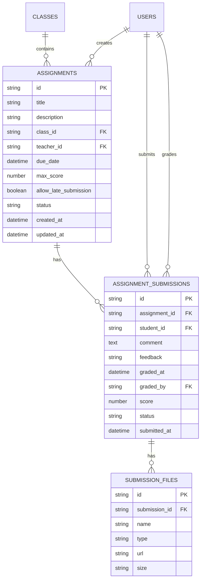
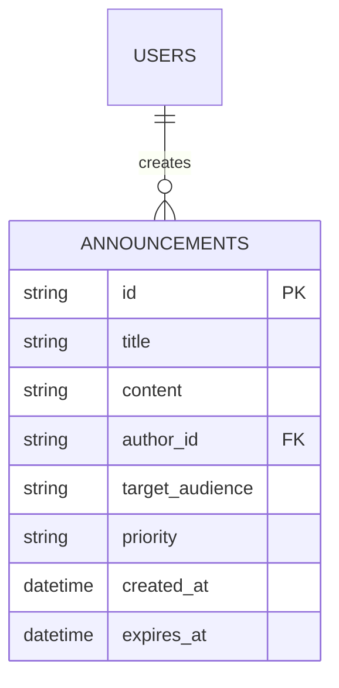
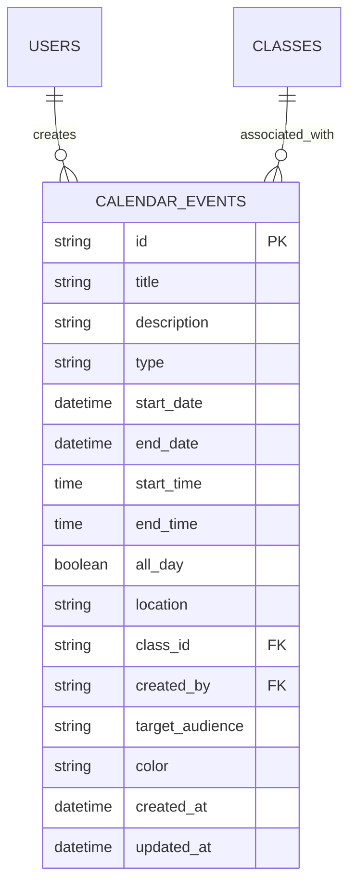

# Academic API Endpoints

<cite>
**Referenced Files in This Document**   
- [route.ts](file://app/api/assignments/route.ts)
- [submit/route.ts](file://app/api/assignments/submit/route.ts)
- [grade/route.ts](file://app/api/assignments/grade/route.ts)
- [create/route.ts](file://app/api/announcements/create/route.ts)
- [delete/route.ts](file://app/api/announcements/delete/route.ts)
- [route.ts](file://app/api/calendar/route.ts)
- [\[id\]/route.ts](file://app/api/calendar/[id]/route.ts)
- [assignment-list.tsx](file://components/assignment-list.tsx)
- [calendar-view.tsx](file://components/calendar-view.tsx)
- [database.types.ts](file://lib/database.types.ts)
- [validation-schemas.ts](file://lib/validation-schemas.ts)
- [assignment-store.ts](file://lib/assignment-store.ts)
- [calendar-store.ts](file://lib/calendar-store.ts)
- [announcement-store.ts](file://lib/announcement-store.ts)
</cite>

## Table of Contents
1. [Introduction](#introduction)
2. [Assignment Management Endpoints](#assignment-management-endpoints)
3. [Announcement Management Endpoints](#announcement-management-endpoints)
4. [Calendar Management Endpoints](#calendar-management-endpoints)
5. [Data Models](#data-models)
6. [Frontend Components](#frontend-components)
7. [Real-time Updates and Data Consistency](#real-time-updates-and-data-consistency)
8. [Security and Permission Checks](#security-and-permission-checks)
9. [Conclusion](#conclusion)

## Introduction

This document provides comprehensive documentation for the core academic functionality endpoints in the School-Management-System. The system supports three primary academic operations: assignment lifecycle management, announcement management, and calendar operations. Each endpoint is secured with proper authentication, authorization, and input validation to ensure data integrity and security.

The API endpoints follow RESTful principles and are built using Next.js App Router with Supabase as the backend database. All endpoints implement Row Level Security (RLS) policies to ensure users can only access data they are authorized to view or modify. The system also implements rate limiting, CSRF protection, and input validation using Zod schemas to prevent common security vulnerabilities.

**Section sources**
- [route.ts](file://app/api/assignments/route.ts)
- [create/route.ts](file://app/api/announcements/create/route.ts)
- [route.ts](file://app/api/calendar/route.ts)

## Assignment Management Endpoints

The assignment management system provides a complete lifecycle for assignments, from creation and submission to grading. The endpoints handle all aspects of assignment management with proper validation and security checks.

### Retrieve Assignments (GET /api/assignments)

Retrieves a list of assignments based on user role and optional class filtering.

**HTTP Method**: GET  
**URL**: `/api/assignments`  
**Authentication**: Required (JWT via Supabase Auth)  
**Query Parameters**:
- `classId` (optional): Filter assignments by class ID

**Response Format**:
```json
{
  "assignments": [
    {
      "id": "string",
      "title": "string",
      "description": "string",
      "class_id": "string",
      "teacher_id": "string",
      "due_date": "string (ISO date)",
      "max_score": "number",
      "allow_late_submission": "boolean",
      "status": "string",
      "created_at": "string (ISO date)",
      "updated_at": "string (ISO date)",
      "class": {
        "id": "string",
        "name": "string",
        "subject": "string"
      },
      "teacher": {
        "id": "string",
        "name": "string"
      }
    }
  ]
}
```

**Access Control**:
- Teachers: Can view assignments they created
- Students: Can only view published assignments
- Admins: Can view all assignments

**Section sources**
- [route.ts](file://app/api/assignments/route.ts#L17-L65)

### Create Assignment (POST /api/assignments)

Creates a new assignment with the specified details.

**HTTP Method**: POST  
**URL**: `/api/assignments`  
**Authentication**: Required  
**Authorization**: Teacher or Admin role  
**Request Body**:
```json
{
  "title": "string (required, 1-200 chars)",
  "description": "string (optional, max 5000 chars)",
  "classId": "string (required, UUID)",
  "dueDate": "string (required, ISO date)",
  "maxScore": "number (optional, 1-1000)",
  "allowLateSubmission": "boolean (optional)",
  "status": "string (optional, 'draft' or 'published')"
}
```

**Validation**: Uses Zod schema validation to ensure data integrity and prevent injection attacks.

**Response Format**:
```json
{
  "assignment": {
    // Assignment object as defined in GET response
  }
}
```

**Section sources**
- [route.ts](file://app/api/assignments/route.ts#L67-L133)

### Submit Assignment (POST /api/assignments/submit)

Allows students to submit assignments with optional files and comments.

**HTTP Method**: POST  
**URL**: `/api/assignments/submit`  
**Authentication**: Required  
**Authorization**: Student role  
**Request Body**:
```json
{
  "assignmentId": "string (required, UUID)",
  "comment": "string (optional, max 5000 chars)",
  "files": [
    {
      "name": "string (max 255 chars)",
      "type": "string (max 50 chars)",
      "url": "string (valid URL from Supabase storage)",
      "size": "string (max 20 chars)"
    }
  ]
}
```

**Business Logic**:
1. Validates that the assignment exists and is published
2. Checks that the student is enrolled in the class
3. Prevents multiple submissions
4. Determines if submission is late based on due date
5. Enforces late submission policy

**Response Format**:
```json
{
  "submission": {
    "id": "string",
    "assignment_id": "string",
    "student_id": "string",
    "comment": "string",
    "status": "string (submitted or late)",
    "submitted_at": "string (ISO date)"
  }
}
```

**Section sources**
- [submit/route.ts](file://app/api/assignments/submit/route.ts#L39-L142)

### Grade Assignment (POST /api/assignments/grade)

Allows teachers to grade student submissions with scores and feedback.

**HTTP Method**: POST  
**URL**: `/api/assignments/grade`  
**Authentication**: Required  
**Authorization**: Teacher (must own the assignment) or Admin  
**Request Body**:
```json
{
  "submissionId": "string (required, UUID)",
  "score": "number (required, within max_score range)",
  "feedback": "string (optional)"
}
```

**Validation**:
- Ensures teacher owns the assignment (unless admin)
- Validates score is within 0 to max_score range
- Prevents grading of non-existent submissions

**Response Format**:
```json
{
  "submission": {
    "id": "string",
    "score": "number",
    "feedback": "string",
    "status": "graded",
    "graded_at": "string (ISO date)",
    "graded_by": "string (user ID)"
  }
}
```

**Section sources**
- [grade/route.ts](file://app/api/assignments/grade/route.ts#L4-L74)

## Announcement Management Endpoints

The announcement system enables authorized users to create and manage announcements with targeted audiences and priority levels.

### Create Announcement (POST /api/announcements/create)

Creates a new announcement that can be targeted to specific audiences.

**HTTP Method**: POST  
**URL**: `/api/announcements/create`  
**Authentication**: Required  
**Authorization**: Teacher (for students) or Admin (for all audiences)  
**Rate Limiting**: 5 requests per minute per IP address  
**Request Body**:
```json
{
  "title": "string (required, 1-200 chars)",
  "content": "string (required, 1-10000 chars)",
  "targetAudience": "string (required, 'all', 'students', 'teachers', 'parents')",
  "priority": "string (optional, 'low', 'normal', 'high', 'urgent')"
}
```

**Business Rules**:
- Teachers can only post to "students" audience
- Admins can post to any audience
- Implements rate limiting to prevent abuse
- Uses CSRF protection to prevent cross-site request forgery

**Response Format**:
```json
{
  "success": true,
  "announcement": {
    "id": "string",
    "title": "string",
    "content": "string",
    "author_id": "string",
    "target_audience": "string",
    "priority": "string",
    "created_at": "string (ISO date)"
  }
}
```

**Section sources**
- [create/route.ts](file://app/api/announcements/create/route.ts#L7-L80)

### Delete Announcement (POST /api/announcements/delete)

Removes an announcement from the system.

**HTTP Method**: POST  
**URL**: `/api/announcements/delete`  
**Authentication**: Required  
**Authorization**: Admin role only  
**Request Body**:
```json
{
  "id": "string (required, UUID)"
}
```

**Security Features**:
- Only admins can delete announcements
- Implements CSRF protection
- Returns generic error messages to prevent information disclosure

**Response Format**:
```json
{
  "success": true
}
```

**Section sources**
- [delete/route.ts](file://app/api/announcements/delete/route.ts#L5-L53)

## Calendar Management Endpoints

The calendar system provides CRUD operations for calendar events with role-based access control and audience targeting.

### Retrieve Calendar Events (GET /api/calendar)

Fetches calendar events within an optional date range.

**HTTP Method**: GET  
**URL**: `/api/calendar`  
**Authentication**: Required  
**Query Parameters**:
- `startDate` (optional): Filter events starting from this date
- `endDate` (optional): Filter events ending by this date

**Response Format**:
```json
{
  "events": [
    {
      "id": "string",
      "title": "string",
      "description": "string",
      "type": "string",
      "start_date": "string (ISO date)",
      "end_date": "string (ISO date)",
      "start_time": "string",
      "end_time": "string",
      "all_day": "boolean",
      "location": "string",
      "class_id": "string",
      "created_by": "string",
      "target_audience": "string",
      "created_at": "string (ISO date)",
      "updated_at": "string (ISO date)",
      "class": {
        "id": "string",
        "name": "string"
      }
    }
  ]
}
```

**Visibility Rules**:
- `all`: Visible to everyone
- `personal`: Only visible to creator
- `teachers`: Only visible to teachers
- `students`: Only visible to students
- `class`: Only visible to students in the specified class
- Admins can see all events

**Section sources**
- [route.ts](file://app/api/calendar/route.ts#L4-L77)

### Create Calendar Event (POST /api/calendar)

Creates a new calendar event.

**HTTP Method**: POST  
**URL**: `/api/calendar`  
**Authentication**: Required  
**Request Body**:
```json
{
  "title": "string (required)",
  "description": "string (optional)",
  "type": "string (optional, default: 'other')",
  "startDate": "string (required, ISO date)",
  "endDate": "string (optional)",
  "startTime": "string (optional)",
  "endTime": "string (optional)",
  "allDay": "boolean (optional, default: false)",
  "location": "string (optional)",
  "classId": "string (optional)",
  "targetAudience": "string (optional, default: 'personal')"
}
```

**Response Format**:
```json
{
  "event": {
    // Calendar event object as defined in GET response
  }
}
```

**Section sources**
- [route.ts](file://app/api/calendar/route.ts#L80-L132)

### Update Calendar Event (PATCH /api/calendar/[id])

Updates an existing calendar event.

**HTTP Method**: PATCH  
**URL**: `/api/calendar/[id]`  
**Authentication**: Required  
**Authorization**: Only the creator can update their events  
**Request Body**: Partial event object with fields to update

**Security**: Implements field whitelisting to prevent mass assignment vulnerabilities. Only specific fields can be updated.

**Response Format**:
```json
{
  "event": {
    // Updated calendar event object
  }
}
```

**Section sources**
- [[id]/route.ts](file://app/api/calendar/[id]/route.ts#L4-L52)

### Delete Calendar Event (DELETE /api/calendar/[id])

Removes a calendar event.

**HTTP Method**: DELETE  
**URL**: `/api/calendar/[id]`  
**Authentication**: Required  
**Authorization**: Only the creator can delete their events  

**Response Format**:
```json
{
  "success": true
}
```

**Section sources**
- [[id]/route.ts](file://app/api/calendar/[id]/route.ts#L55-L77)

## Data Models

The system uses a relational database schema with proper relationships and constraints to maintain data integrity.

### Assignment Data Model



**Diagram sources**
- [database.types.ts](file://lib/database.types.ts#L157-L212)
- [database.types.ts](file://lib/database.types.ts#L96-L155)

### Announcement Data Model



**Diagram sources**
- [database.types.ts](file://lib/database.types.ts#L17-L56)

### Calendar Event Data Model



**Diagram sources**
- [database.types.ts](file://lib/database.types.ts#L256-L326)

## Frontend Components

The frontend components provide user interfaces for interacting with the academic functionality endpoints.

### Assignment List Component

The `assignment-list.tsx` component displays assignments for students and provides submission functionality.

**Key Features**:
- Displays assignment status (pending, submitted, graded, late, overdue)
- Shows due dates with time remaining
- Provides submission dialog with file upload
- Displays grading results with feedback
- Role-based UI (students see submit button, teachers see grading status)

**Data Flow**:
1. Fetches assignments via API
2. Uses `useAssignmentStore` for state management
3. Handles file uploads and submission
4. Updates UI based on submission status

**Section sources**
- [assignment-list.tsx](file://components/assignment-list.tsx#L1-L271)
- [assignment-store.ts](file://lib/assignment-store.ts#L1-L174)

### Calendar View Component

The `calendar-view.tsx` component provides a full-featured calendar interface.

**Key Features**:
- Month view with event indicators
- Day selection to view detailed events
- Event creation dialog with form validation
- iCal export functionality
- Role-based event creation permissions
- Color-coded event types

**Data Flow**:
1. Fetches events via API with date range
2. Uses `useCalendarStore` for state management
3. Filters events based on user role and permissions
4. Handles event creation, update, and deletion
5. Provides export functionality

**Section sources**
- [calendar-view.tsx](file://components/calendar-view.tsx#L1-L497)
- [calendar-store.ts](file://lib/calendar-store.ts#L1-L162)

## Real-time Updates and Data Consistency

The system implements real-time updates and data consistency mechanisms to ensure users have the most current information.

### Supabase Realtime Subscriptions

The system uses Supabase Realtime to push updates to clients without requiring manual refresh.

**Configuration**:
- Publications are explicitly defined for specific tables
- RLS policies are enforced for realtime subscriptions
- Only authorized users receive updates for data they can access

```sql
-- Publication configuration
CREATE PUBLICATION supabase_realtime FOR TABLE chat_messages, notifications;
ALTER PUBLICATION supabase_realtime SET (publish_via_partition_root = true);
```

**Security**: The `publish_via_partition_root = true` setting ensures that Row Level Security policies are enforced for realtime subscriptions, preventing unauthorized access to data changes.

**Section sources**
- [20250226_secure_realtime_rls.sql](file://supabase/migrations/20250226_secure_realtime_rls.sql#L1-L30)
- [20260101070345_secure_realtime_rls.sql](file://supabase/migrations/20260101070345_secure_realtime_rls.sql#L1-L3)

### Data Consistency Mechanisms

The system employs several mechanisms to ensure data consistency:

1. **Database Constraints**: Foreign key constraints and data type validation
2. **Row Level Security**: Ensures users can only access authorized data
3. **Atomic Operations**: Database transactions for related operations
4. **Validation Layers**: Client-side, API, and database-level validation
5. **Caching Strategy**: Optimized queries with proper cache invalidation

These mechanisms work together to maintain data integrity across the system.

**Section sources**
- [database.types.ts](file://lib/database.types.ts)
- [validation-schemas.ts](file://lib/validation-schemas.ts)

## Security and Permission Checks

The system implements comprehensive security measures to protect academic data.

### Authentication and Authorization

- **Authentication**: Supabase Auth with JWT tokens
- **Role-based Access Control**: Admin, teacher, and student roles with different permissions
- **CSRF Protection**: Origin validation for all state-changing requests
- **Rate Limiting**: Prevents abuse of announcement creation

### Input Validation

All endpoints use Zod schemas for input validation:

```typescript
const createAssignmentSchema = z.object({
  title: z.string().min(1, "Title is required").max(200),
  description: z.string().max(5000).optional().nullable(),
  classId: z.string().uuid("Invalid class ID"),
  dueDate: z.string().refine((val) => !isNaN(Date.parse(val)), "Invalid due date format"),
  maxScore: z.number().min(1).max(1000).optional(),
  allowLateSubmission: z.boolean().optional(),
  status: z.enum(["draft", "published"]).optional(),
})
```

**Section sources**
- [validation-schemas.ts](file://lib/validation-schemas.ts#L8-L25)
- [route.ts](file://app/api/assignments/route.ts#L6-L15)

### Moderation Workflows

The system implements moderation workflows for sensitive operations:

- **Announcement Creation**: Teachers can only post to students; admins can post to all audiences
- **Announcement Deletion**: Only admins can delete announcements
- **Calendar Event Management**: Users can only modify events they created
- **Assignment Grading**: Teachers can only grade assignments they created

These workflows ensure that academic content is properly moderated and controlled.

**Section sources**
- [create/route.ts](file://app/api/announcements/create/route.ts#L57-L59)
- [delete/route.ts](file://app/api/announcements/delete/route.ts#L26-L27)

## Conclusion

The School-Management-System provides a comprehensive set of academic functionality endpoints that support the complete lifecycle of assignments, announcements, and calendar events. The system is designed with security, data integrity, and user experience as primary considerations.

Key strengths of the implementation include:
- Comprehensive role-based access control
- Multi-layered validation and security measures
- Real-time updates with proper authorization
- Well-structured data models with proper relationships
- User-friendly frontend components
- Scalable architecture using Supabase and Next.js

The endpoints are well-documented with clear request/response formats, authentication requirements, and practical examples, making them easy to integrate and use within the application.