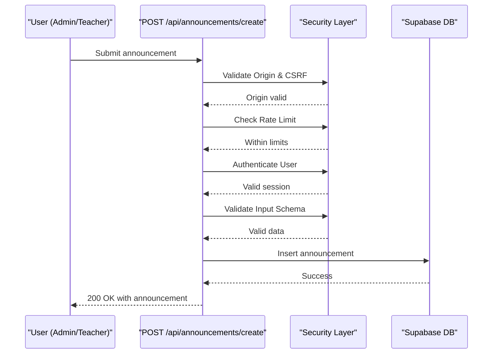
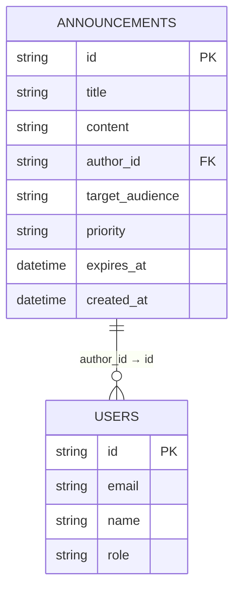
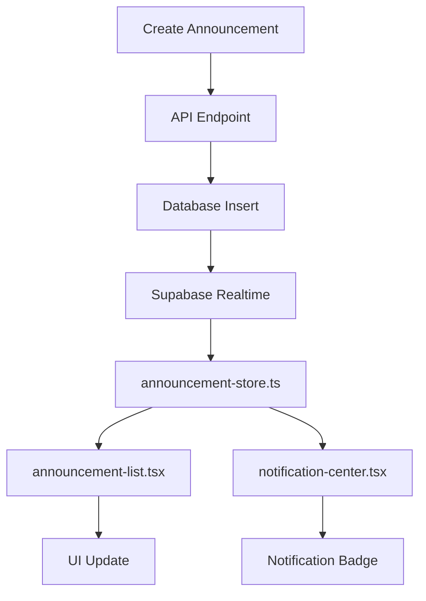
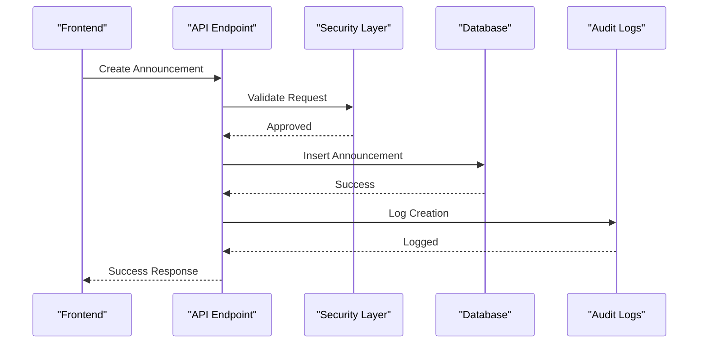

# Announcements API Endpoints

<cite>
**Referenced Files in This Document**   
- [create/route.ts](file://app/api/announcements/create/route.ts)
- [delete/route.ts](file://app/api/announcements/delete/route.ts)
- [announcement-store.ts](file://lib/announcement-store.ts)
- [security.ts](file://lib/security.ts)
- [database.types.ts](file://lib/database.types.ts)
- [validation-schemas.ts](file://lib/validation-schemas.ts)
- [supabase/types.ts](file://lib/supabase/types.ts)
- [notification-center.tsx](file://components/notification-center.tsx)
- [student/announcements/page.tsx](file://app/student/announcements/page.tsx)
- [teacher/announcements/page.tsx](file://app/teacher/announcements/page.tsx)
</cite>

## Table of Contents
1. [Introduction](#introduction)
2. [API Endpoints](#api-endpoints)
3. [Request and Response Formats](#request-and-response-formats)
4. [Authentication and Authorization](#authentication-and-authorization)
5. [Data Model and Database Schema](#data-model-and-database-schema)
6. [Frontend Integration](#frontend-integration)
7. [Audit Logging and Security](#audit-logging-and-security)
8. [Usage Examples](#usage-examples)
9. [Error Handling](#error-handling)
10. [Conclusion](#conclusion)

## Introduction
The Announcements API in the School-Management-System enables administrators and teachers to create and manage important school communications. This documentation details the endpoints for creating and deleting announcements, including request payloads, authentication requirements, data propagation to frontend components, and integration with the system's security and audit logging infrastructure. The system supports targeted announcements to specific audiences with configurable priority levels and leverages real-time updates through Supabase subscriptions.

## API Endpoints

### POST /api/announcements/create
Creates a new announcement that will be distributed to the specified target audience.

### DELETE /api/announcements/delete
Removes an existing announcement from the system. This endpoint is restricted to administrative users only.

**Section sources**
- [create/route.ts](file://app/api/announcements/create/route.ts#L7-L81)
- [delete/route.ts](file://app/api/announcements/delete/route.ts#L5-L54)

## Request and Response Formats

### Create Announcement Request
The POST request to `/api/announcements/create` requires a JSON payload with the following structure:

```json
{
  "title": "string (1-200 characters)",
  "content": "string (1-10000 characters)",
  "targetAudience": "enum: all, students, teachers, parents",
  "priority": "enum: low, normal, high, urgent (optional)"
}
```

### Create Announcement Response
Successful response (200 OK):
```json
{
  "success": true,
  "announcement": {
    "id": "string",
    "title": "string",
    "content": "string",
    "author_id": "string",
    "target_audience": "string",
    "priority": "string",
    "created_at": "string (ISO date)"
  }
}
```

### Delete Announcement Request
The DELETE request to `/api/announcements/delete` requires a JSON payload with the announcement ID:

```json
{
  "id": "string (UUID)"
}
```

### Delete Announcement Response
Successful response (200 OK):
```json
{
  "success": true
}
```

**Section sources**
- [create/route.ts](file://app/api/announcements/create/route.ts#L42-L75)
- [delete/route.ts](file://app/api/announcements/delete/route.ts#L30-L48)
- [validation-schemas.ts](file://lib/validation-schemas.ts#L28-L33)

## Authentication and Authorization

### Role-Based Access Control
The announcement system implements strict role-based access control:

- **Admin users**: Can create announcements for all audiences (all, students, teachers, parents) and delete any announcement
- **Teachers**: Can create announcements only for students and cannot delete announcements
- **Students and Parents**: Can view announcements but cannot create or delete them

### Security Measures
The API implements multiple security layers:

- **CSRF Protection**: Validates request origin headers to prevent cross-site request forgery
- **Rate Limiting**: Limits users to 5 announcement creations per minute to prevent abuse
- **Input Validation**: Uses Zod schemas to validate all incoming data and prevent injection attacks
- **IP Address Validation**: Extracts and validates client IP addresses for security monitoring



**Diagram sources**
- [create/route.ts](file://app/api/announcements/create/route.ts#L7-L81)
- [security.ts](file://lib/security.ts#L20-L67)
- [validation-schemas.ts](file://lib/validation-schemas.ts#L28-L33)

**Section sources**
- [create/route.ts](file://app/api/announcements/create/route.ts#L22-L40)
- [security.ts](file://lib/security.ts#L20-L67)
- [database.types.ts](file://lib/database.types.ts#L17-L27)

## Data Model and Database Schema

### Announcements Table Structure
The announcements are stored in the PostgreSQL database with the following schema:

```sql
CREATE TABLE announcements (
  id UUID PRIMARY KEY DEFAULT gen_random_uuid(),
  title TEXT NOT NULL,
  content TEXT NOT NULL,
  author_id UUID REFERENCES users(id) ON DELETE SET NULL,
  target_audience TEXT NOT NULL DEFAULT 'all' CHECK (target_audience IN ('all', 'students', 'teachers', 'grade-10', 'grade-11', 'grade-12')),
  priority TEXT NOT NULL DEFAULT 'normal' CHECK (priority IN ('normal', 'important', 'urgent')),
  expires_at TIMESTAMPTZ,
  created_at TIMESTAMPTZ DEFAULT NOW()
);
```

### Data Relationships
The announcements table has a foreign key relationship with the users table, linking each announcement to its author. Row Level Security (RLS) policies ensure that users can only access announcements relevant to their role and audience.



**Diagram sources**
- [database.types.ts](file://lib/database.types.ts#L17-L27)
- [supabase/migrations/20251219043609_create_communication_tables.sql#L1-L10)
- [supabase/types.ts](file://lib/supabase/types.ts#L201-L210)

**Section sources**
- [database.types.ts](file://lib/database.types.ts#L17-L27)
- [supabase/types.ts](file://lib/supabase/types.ts#L201-L210)

## Frontend Integration

### Real-Time Updates
The frontend components use Supabase real-time subscriptions to receive announcements instantly when they are created. The `announcement-store.ts` provides a Zustand store that manages the client-side state of announcements.

### Component Integration
Two key frontend components display announcements:

- **announcement-list.tsx**: Displays a chronological list of announcements with filtering by priority and audience
- **notification-center.tsx**: Shows announcement notifications in the user's notification panel with real-time updates



**Diagram sources**
- [announcement-store.ts](file://lib/announcement-store.ts#L27-L60)
- [notification-center.tsx](file://components/notification-center.tsx#L63-L190)
- [student/announcements/page.tsx](file://app/student/announcements/page.tsx#L21-L126)

**Section sources**
- [announcement-store.ts](file://lib/announcement-store.ts#L7-L60)
- [notification-center.tsx](file://components/notification-center.tsx#L24-L190)
- [student/announcements/page.tsx](file://app/student/announcements/page.tsx#L1-L126)
- [teacher/announcements/page.tsx](file://app/teacher/announcements/page.tsx#L1-L219)

## Audit Logging and Security

### Audit Trail
All announcement operations are logged in the audit-logs table for compliance and security monitoring. Each create and delete operation generates an audit record that includes:

- User ID and role
- IP address (hashed for privacy)
- Timestamp of the action
- Details of the announcement affected

### Security Implementation
The system implements defense-in-depth security measures:

- **Input Sanitization**: All content is validated against strict schemas
- **Access Control**: RLS policies in Supabase enforce data access rules
- **Rate Limiting**: Prevents abuse of the announcement system
- **CSRF Protection**: Ensures requests originate from the legitimate application



**Diagram sources**
- [create/route.ts](file://app/api/announcements/create/route.ts#L7-L81)
- [delete/route.ts](file://app/api/announcements/delete/route.ts#L5-L54)
- [security.ts](file://lib/security.ts#L6-L67)

**Section sources**
- [security.ts](file://lib/security.ts#L6-L67)
- [create/route.ts](file://app/api/announcements/create/route.ts#L7-L81)

## Usage Examples

### School-Wide Announcement
Creating a school-wide notice about an upcoming holiday:

```json
{
  "title": "School Closure for National Holiday",
  "content": "The school will be closed on June 12th in observance of Independence Day. All classes are canceled for the day.",
  "targetAudience": "all",
  "priority": "normal"
}
```

### Class-Specific Update
Creating an announcement for students about an upcoming assignment deadline:

```json
{
  "title": "Math Assignment Due Tomorrow",
  "content": "Don't forget to submit your algebra homework by 5:00 PM tomorrow. Late submissions will be accepted with a 10% penalty.",
  "targetAudience": "students",
  "priority": "important"
}
```

**Section sources**
- [create/route.ts](file://app/api/announcements/create/route.ts#L52-L59)
- [validation-schemas.ts](file://lib/validation-schemas.ts#L28-L33)

## Error Handling

### Common Error Scenarios
The API returns specific error responses for various failure conditions:

- **400 Bad Request**: Invalid input data or missing required fields
- **401 Unauthorized**: User not authenticated
- **403 Forbidden**: User lacks required permissions
- **404 Not Found**: Announcement ID not found (delete operation)
- **429 Too Many Requests**: Rate limit exceeded
- **500 Internal Server Error**: Unexpected server error

### Error Response Format
```json
{
  "error": "Descriptive error message"
}
```

The system provides user-friendly error messages while avoiding disclosure of sensitive system information.

**Section sources**
- [create/route.ts](file://app/api/announcements/create/route.ts#L18-L20)
- [delete/route.ts](file://app/api/announcements/delete/route.ts#L32-L34)
- [create/route.ts](file://app/api/announcements/create/route.ts#L77-L80)

## Conclusion
The Announcements API provides a secure and efficient way for school administrators and teachers to communicate important information to various audiences within the school community. With robust authentication, role-based access control, and real-time frontend integration, the system ensures that announcements are delivered reliably and promptly. The integration with audit logging provides accountability and compliance with school policies, while the clean API design makes it easy to use and maintain.