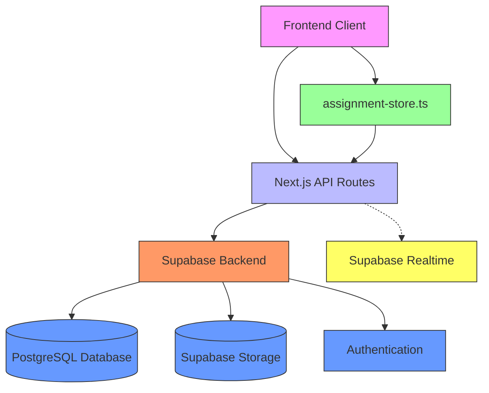
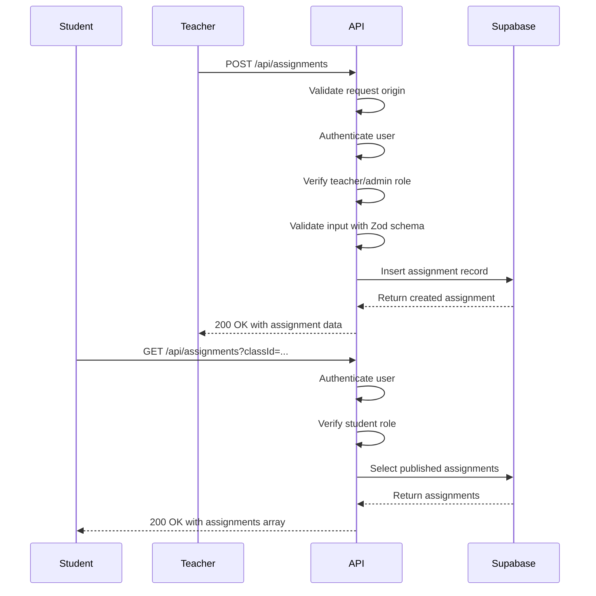
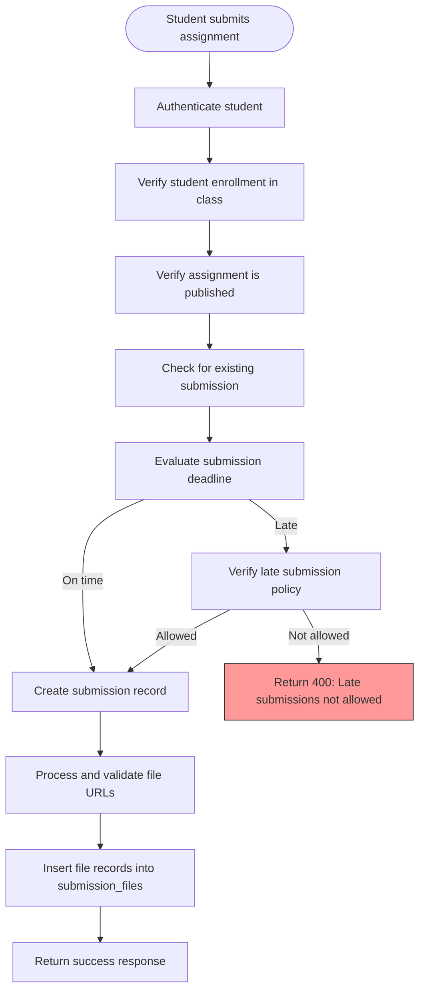
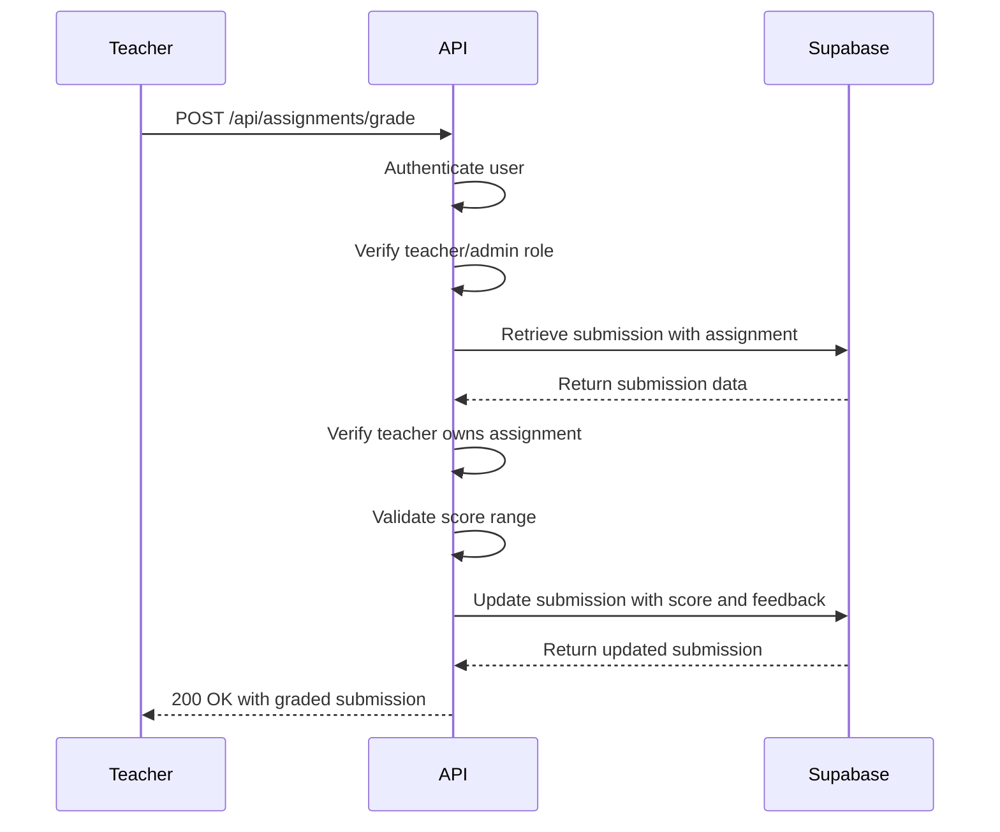
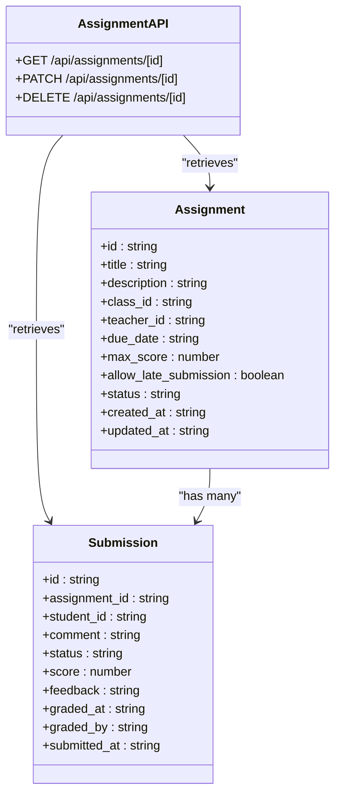
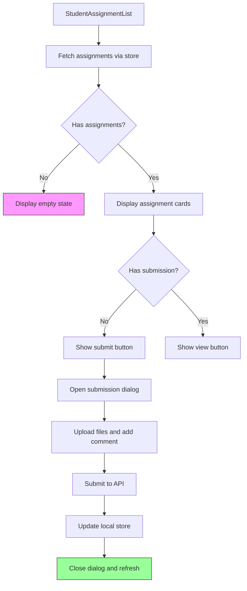
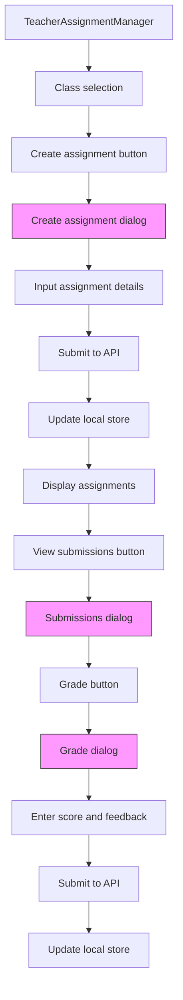
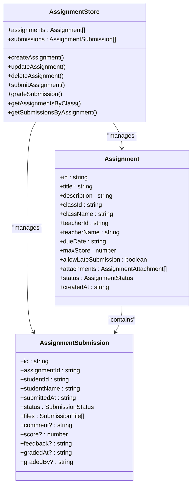
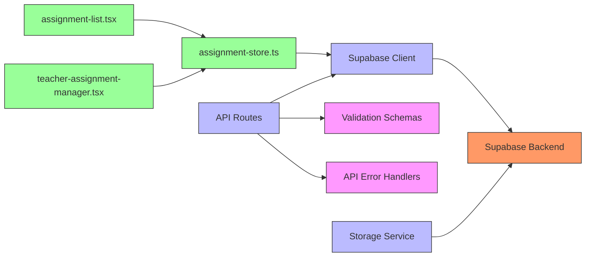
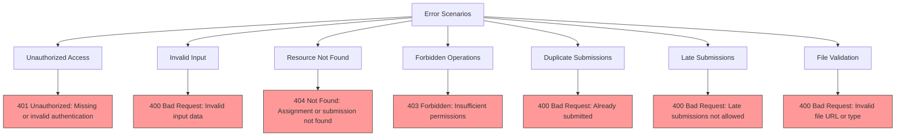

# Assignments API Endpoints

<cite>
**Referenced Files in This Document**   
- [route.ts](file://app/api/assignments/route.ts)
- [submit/route.ts](file://app/api/assignments/submit/route.ts)
- [grade/route.ts](file://app/api/assignments/grade/route.ts)
- [id]/route.ts](file://app/api/assignments/[id]/route.ts)
- [validation-schemas.ts](file://lib/validation-schemas.ts)
- [client.ts](file://lib/supabase/client.ts)
- [storage.ts](file://lib/supabase/storage.ts)
- [assignment-store.ts](file://lib/assignment-store.ts)
- [api-errors.ts](file://lib/api-errors.ts)
- [assignment-list.tsx](file://components/assignment-list.tsx)
- [teacher-assignment-manager.tsx](file://components/teacher-assignment-manager.tsx)
</cite>

## Table of Contents
1. [Introduction](#introduction)
2. [Project Structure](#project-structure)
3. [Core Components](#core-components)
4. [Architecture Overview](#architecture-overview)
5. [Detailed Component Analysis](#detailed-component-analysis)
6. [Dependency Analysis](#dependency-analysis)
7. [Performance Considerations](#performance-considerations)
8. [Troubleshooting Guide](#troubleshooting-guide)
9. [Conclusion](#conclusion)

## Introduction
This document provides comprehensive API documentation for the assignment management system in the School-Management-System. It details all endpoints related to assignment creation, retrieval, submission, and grading. The system supports role-based access control for teachers, students, and administrators, with robust validation, file handling, and real-time capabilities through Supabase integration.

## Project Structure
The assignment management system is organized within the Next.js app directory structure, with API routes under `/app/api/assignments`. The system follows a modular architecture with clear separation between frontend components, backend API routes, and shared utilities.

```mermaid
graph TB
subgraph "Frontend Components"
A[assignment-list.tsx]
B[teacher-assignment-manager.tsx]
C[assignment-store.ts]
end
subgraph "API Endpoints"
D[GET /api/assignments]
E[POST /api/assignments]
F[GET /api/assignments/[id]]
G[POST /api/assignments/submit]
H[POST /api/assignments/grade]
end
subgraph "Backend Services"
I[Supabase Client]
J[Storage Service]
K[Validation Schemas]
end
A --> C
B --> C
C --> D
C --> E
C --> F
C --> G
C --> H
D --> I
E --> I
F --> I
G --> I
H --> I
G --> J
E --> K
G --> K
```

**Diagram sources**
- [assignment-list.tsx](file://components/assignment-list.tsx)
- [teacher-assignment-manager.tsx](file://components/teacher-assignment-manager.tsx)
- [assignment-store.ts](file://lib/assignment-store.ts)
- [route.ts](file://app/api/assignments/route.ts)
- [submit/route.ts](file://app/api/assignments/submit/route.ts)
- [grade/route.ts](file://app/api/assignments/grade/route.ts)
- [client.ts](file://lib/supabase/client.ts)
- [storage.ts](file://lib/supabase/storage.ts)
- [validation-schemas.ts](file://lib/validation-schemas.ts)

**Section sources**
- [app/api/assignments](file://app/api/assignments)
- [components](file://components)
- [lib](file://lib)

## Core Components
The assignment management system consists of several core components that work together to provide a complete solution for educational assignments. These include API endpoints for CRUD operations, frontend components for user interaction, state management via Zustand store, and integration with Supabase for database and storage operations.

**Section sources**
- [route.ts](file://app/api/assignments/route.ts)
- [submit/route.ts](file://app/api/assignments/submit/route.ts)
- [grade/route.ts](file://app/api/assignments/grade/route.ts)
- [id]/route.ts](file://app/api/assignments/[id]/route.ts)
- [assignment-store.ts](file://lib/assignment-store.ts)

## Architecture Overview
The assignment management system follows a client-server architecture with Next.js API routes serving as the backend and React components forming the frontend. The system uses Supabase as the backend-as-a-service for database operations, authentication, and file storage.



**Diagram sources**
- [client.ts](file://lib/supabase/client.ts)
- [route.ts](file://app/api/assignments/route.ts)
- [assignment-store.ts](file://lib/assignment-store.ts)

## Detailed Component Analysis

### Assignment API Endpoints
The assignment API provides comprehensive endpoints for managing assignments throughout their lifecycle, from creation to grading.

#### Assignment Creation and Retrieval
The main assignment endpoint supports both creation and retrieval of assignments with role-based access control.



**Diagram sources**
- [route.ts](file://app/api/assignments/route.ts#L68-L134)

#### Assignment Submission Flow
The submission endpoint handles student submissions with validation for enrollment, deadlines, and file security.



**Diagram sources**
- [submit/route.ts](file://app/api/assignments/submit/route.ts#L39-L143)

#### Assignment Grading Process
The grading endpoint enables teachers to evaluate student submissions with proper authorization checks.



**Diagram sources**
- [grade/route.ts](file://app/api/assignments/grade/route.ts#L5-L75)

#### Individual Assignment Management
The individual assignment endpoint supports retrieval, updating, and deletion of specific assignments.



**Diagram sources**
- [id]/route.ts](file://app/api/assignments/[id]/route.ts#L5-L108)

### Frontend Components Analysis
The frontend components provide user interfaces for interacting with the assignment system, leveraging state management and API integration.

#### Student Assignment Interface
The student assignment list component displays assignments and enables submission functionality.



**Diagram sources**
- [assignment-list.tsx](file://components/assignment-list.tsx#L40-L271)

#### Teacher Assignment Management
The teacher assignment manager provides tools for creating assignments and grading submissions.



**Diagram sources**
- [teacher-assignment-manager.tsx](file://components/teacher-assignment-manager.tsx#L52-L485)

### State Management System
The assignment store provides client-side state management for assignment data, synchronizing with the backend API.



**Diagram sources**
- [assignment-store.ts](file://lib/assignment-store.ts#L9-L174)

## Dependency Analysis
The assignment management system has a well-defined dependency structure that ensures separation of concerns and maintainability.



**Diagram sources**
- [assignment-list.tsx](file://components/assignment-list.tsx)
- [teacher-assignment-manager.tsx](file://components/teacher-assignment-manager.tsx)
- [assignment-store.ts](file://lib/assignment-store.ts)
- [client.ts](file://lib/supabase/client.ts)
- [route.ts](file://app/api/assignments/route.ts)
- [validation-schemas.ts](file://lib/validation-schemas.ts)
- [api-errors.ts](file://lib/api-errors.ts)
- [storage.ts](file://lib/supabase/storage.ts)

**Section sources**
- [components](file://components)
- [lib](file://lib)
- [app/api/assignments](file://app/api/assignments)

## Performance Considerations
The assignment management system includes several performance optimizations to ensure responsiveness and scalability.

### Database Indexing
The system leverages database indexing on critical fields to optimize query performance:

- Index on `assignments.class_id` for efficient class-based filtering
- Index on `assignments.teacher_id` for teacher-specific queries
- Index on `assignments.due_date` for chronological sorting
- Index on `assignment_submissions.assignment_id` for submission retrieval
- Composite index on `class_students(class_id, student_id)` for enrollment checks

### File Upload Optimization
For large file uploads, the system implements the following optimizations:

- Client-side file validation to prevent unnecessary uploads
- Direct-to-storage uploads via Supabase to reduce server load
- File URL validation to ensure security without downloading files
- Progress tracking for user feedback during uploads
- Concurrent upload processing for multiple files

### Caching Strategy
The system employs a multi-layer caching strategy:

- Client-side state caching via Zustand store
- Supabase query caching for frequently accessed data
- Browser caching of static assets and API responses
- Real-time subscriptions to minimize polling

**Section sources**
- [supabase/migrations](file://supabase/migrations)
- [client.ts](file://lib/supabase/client.ts)
- [storage.ts](file://lib/supabase/storage.ts)
- [assignment-store.ts](file://lib/assignment-store.ts)

## Troubleshooting Guide
This section addresses common issues and edge cases in the assignment management system.

### Common Error Scenarios
The system handles various error conditions with appropriate responses:



**Diagram sources**
- [api-errors.ts](file://lib/api-errors.ts)
- [route.ts](file://app/api/assignments/route.ts)
- [submit/route.ts](file://app/api/assignments/submit/route.ts)
- [grade/route.ts](file://app/api/assignments/grade/route.ts)

### Edge Case Handling
The system properly handles various edge cases:

- **Late submissions**: Checked against assignment policy and current time
- **Resubmissions**: Prevented by checking for existing submissions
- **Permission enforcement**: Verified at both API and database levels
- **Concurrent edits**: Handled by Supabase row-level security
- **Network failures**: Addressed with client-side retry logic
- **Large file uploads**: Managed through direct Supabase storage

**Section sources**
- [submit/route.ts](file://app/api/assignments/submit/route.ts)
- [grade/route.ts](file://app/api/assignments/grade/route.ts)
- [id]/route.ts](file://app/api/assignments/[id]/route.ts)
- [security.ts](file://lib/security.ts)

## Conclusion
The assignment management system in the School-Management-System provides a comprehensive solution for educational assignments with robust API endpoints, intuitive frontend components, and secure data handling. The system leverages Supabase for database operations, authentication, and file storage, while implementing proper role-based access control and validation. Key features include assignment creation and management, student submissions with file uploads, teacher grading, and real-time updates. The architecture follows best practices with clear separation of concerns, proper error handling, and performance optimizations for scalability.