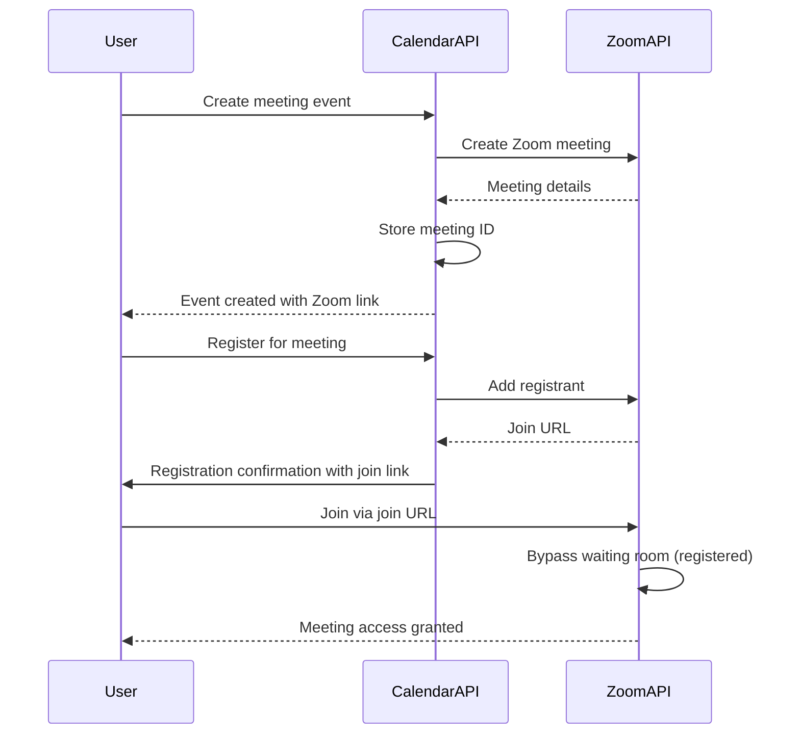
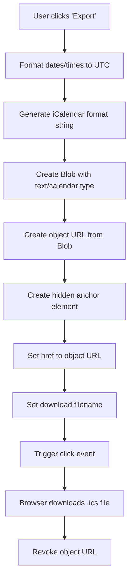
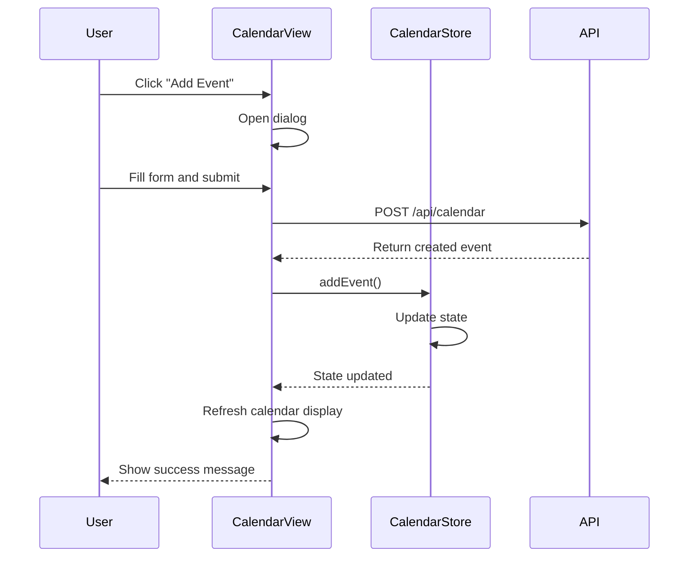
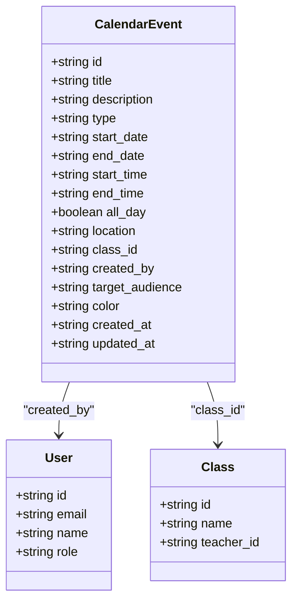

# Calendar API Endpoints

<cite>
**Referenced Files in This Document**   
- [route.ts](file://app/api/calendar/route.ts)
- [route.ts](file://app/api/calendar/[id]/route.ts)
- [calendar-view.tsx](file://components/calendar-view.tsx)
- [meeting-attendance-summary.tsx](file://components/meeting-attendance-summary.tsx)
- [calendar-store.ts](file://lib/calendar-store.ts)
- [create_calendar_events_table.sql](file://supabase/migrations/20260105082237_create_calendar_events_table.sql)
- [client.ts](file://lib/zoom/client.ts)
</cite>

## Table of Contents
1. [Introduction](#introduction)
2. [Calendar Event Endpoints](#calendar-event-endpoints)
   - [GET /api/calendar](#get-apicalendar)
   - [POST /api/calendar](#post-apicalendar)
   - [PATCH /api/calendar/[id]](#patch-apicalendarid)
   - [DELETE /api/calendar/[id]](#delete-apicalendarid)
3. [Response Schema](#response-schema)
4. [Authentication and Authorization](#authentication-and-authorization)
5. [Zoom Integration](#zoom-integration)
6. [iCal Export](#ical-export)
7. [Frontend Implementation](#frontend-implementation)
8. [Data Model](#data-model)
9. [Time Zone Handling](#time-zone-handling)
10. [Real-time Synchronization](#real-time-synchronization)

## Introduction
The Calendar API in the School-Management-System provides comprehensive functionality for managing calendar events across different user roles (admin, teacher, student). The system supports various event types including classes, quizzes, assignments, exams, holidays, meetings, and other events. The API enables users to retrieve, create, update, and delete calendar events with robust filtering capabilities and role-based access control.

The calendar system integrates with Supabase for data persistence and authentication, implementing Row Level Security (RLS) policies to enforce data visibility rules. It also integrates with Zoom for virtual meetings and supports iCal export for external calendar integration. The frontend implementation uses React components with client-side state management for optimal user experience.

**Section sources**
- [route.ts](file://app/api/calendar/route.ts)
- [calendar-view.tsx](file://components/calendar-view.tsx)

## Calendar Event Endpoints

### GET /api/calendar
Retrieves calendar events with optional filtering by date range.

**Request Parameters**
- `startDate` (query): Filter events starting from this date (YYYY-MM-DD format)
- `endDate` (query): Filter events ending on or before this date (YYYY-MM-DD format)

**Response**
Returns a JSON object containing an array of calendar events that match the criteria and are visible to the authenticated user.

```json
{
  "events": [
    {
      "id": "uuid",
      "title": "string",
      "description": "string",
      "type": "class|quiz|assignment|exam|holiday|meeting|other",
      "start_date": "string (date)",
      "end_date": "string (date)",
      "start_time": "string (time)",
      "end_time": "string (time)",
      "all_day": "boolean",
      "location": "string",
      "class_id": "uuid",
      "created_by": "uuid",
      "target_audience": "all|students|teachers|class|personal",
      "color": "string",
      "created_at": "string (datetime)",
      "updated_at": "string (datetime)"
    }
  ]
}
```

**Section sources**
- [route.ts](file://app/api/calendar/route.ts#L5-L77)

### POST /api/calendar
Creates a new calendar event.

**Request Body**
```json
{
  "title": "string (required)",
  "description": "string",
  "type": "class|quiz|assignment|exam|holiday|meeting|other",
  "startDate": "string (required, YYYY-MM-DD)",
  "endDate": "string (YYYY-MM-DD)",
  "startTime": "string (HH:MM)",
  "endTime": "string (HH:MM)",
  "allDay": "boolean",
  "location": "string",
  "classId": "uuid",
  "targetAudience": "all|students|teachers|class|personal"
}
```

**Response**
Returns the created event object on success, or an error message on failure.

```json
{
  "event": {
    "id": "uuid",
    "title": "string",
    "description": "string",
    "type": "string",
    "start_date": "string",
    "end_date": "string",
    "start_time": "string",
    "end_time": "string",
    "all_day": "boolean",
    "location": "string",
    "class_id": "uuid",
    "created_by": "uuid",
    "target_audience": "string",
    "color": "string",
    "created_at": "string",
    "updated_at": "string"
  }
}
```

**Section sources**
- [route.ts](file://app/api/calendar/route.ts#L81-L132)

### PATCH /api/calendar/[id]
Updates an existing calendar event.

**Request Parameters**
- `id` (path): The UUID of the event to update

**Request Body**
Partial event object with fields to update. Only the following fields can be updated:
- `title`
- `description`
- `type`
- `start_date`
- `end_date`
- `start_time`
- `end_time`
- `all_day`
- `location`
- `class_id`
- `target_audience`
- `color`

**Response**
Returns the updated event object on success, or an error message on failure.

```json
{
  "event": {
    "id": "uuid",
    "title": "string",
    "description": "string",
    "type": "string",
    "start_date": "string",
    "end_date": "string",
    "start_time": "string",
    "end_time": "string",
    "all_day": "boolean",
    "location": "string",
    "class_id": "uuid",
    "created_by": "uuid",
    "target_audience": "string",
    "color": "string",
    "created_at": "string",
    "updated_at": "string"
  }
}
```

**Section sources**
- [route.ts](file://app/api/calendar/[id]/route.ts#L4-L53)

### DELETE /api/calendar/[id]
Deletes a calendar event.

**Request Parameters**
- `id` (path): The UUID of the event to delete

**Response**
Returns a success message on successful deletion, or an error message on failure.

```json
{
  "success": true
}
```

**Section sources**
- [route.ts](file://app/api/calendar/[id]/route.ts#L55-L78)

## Response Schema
The calendar event response follows a consistent schema with the following properties:

| Field | Type | Description |
|-------|------|-------------|
| id | string (UUID) | Unique identifier for the event |
| title | string | Event title |
| description | string | Event description |
| type | string | Event type: class, quiz, assignment, exam, holiday, meeting, or other |
| start_date | string (date) | Start date in YYYY-MM-DD format |
| end_date | string (date) | End date in YYYY-MM-DD format (optional) |
| start_time | string (time) | Start time in HH:MM format (optional) |
| end_time | string (time) | End time in HH:MM format (optional) |
| all_day | boolean | Whether the event is an all-day event |
| location | string | Physical location or Zoom link |
| class_id | string (UUID) | Associated class ID (optional) |
| created_by | string (UUID) | User ID of the event creator |
| target_audience | string | Visibility: all, students, teachers, class, or personal |
| color | string | Color for event display |
| created_at | string (datetime) | Creation timestamp |
| updated_at | string (datetime) | Last update timestamp |

**Section sources**
- [create_calendar_events_table.sql](file://supabase/migrations/20260105082237_create_calendar_events_table.sql#L3-L18)
- [calendar-store.ts](file://lib/calendar-store.ts#L7-L24)

## Authentication and Authorization
The Calendar API uses Supabase authentication with Row Level Security (RLS) policies to enforce access control.

**Authentication**
All endpoints require authentication via Supabase JWT token, which is automatically included in requests when a user is logged in.

**Authorization Rules**
- **Viewing Events**: Users can view events based on target audience:
  - `all`: Visible to everyone
  - `personal`: Only visible to the creator
  - `students`: Only visible to students
  - `teachers`: Only visible to teachers
  - `class`: Visible to students enrolled in the class and the teacher of that class
  - Admin users can view all events regardless of audience

- **Creating Events**: Users can create events with themselves as the creator.

- **Updating Events**: Only the event creator or admin users can update events.

- **Deleting Events**: Only the event creator or admin users can delete events.

```mermaid
erDiagram
USER ||--o{ CALENDAR_EVENT : "creates"
CALENDAR_EVENT }|--|| TARGET_AUDIENCE : "has"
CALENDAR_EVENT }|--|| EVENT_TYPE : "has"
CALENDAR_EVENT }o--|| CLASS : "belongs to"
USER {
string id PK
string email
string name
string role
}
CALENDAR_EVENT {
string id PK
string title
string description
string type FK
date start_date
date end_date
time start_time
time end_time
boolean all_day
string location
string class_id FK
string created_by FK
string target_audience FK
datetime created_at
datetime updated_at
}
TARGET_AUDIENCE {
string value PK
"all"
"students"
"teachers"
"class"
"personal"
}
EVENT_TYPE {
string value PK
"class"
"quiz"
"assignment"
"exam"
"holiday"
"meeting"
"other"
}
CLASS {
string id PK
string name
string teacher_id FK
}
```

**Diagram sources**
- [create_calendar_events_table.sql](file://supabase/migrations/20260105082237_create_calendar_events_table.sql)
- [types.ts](file://lib/types.ts)

**Section sources**
- [route.ts](file://app/api/calendar/route.ts#L5-L77)
- [create_calendar_events_table.sql](file://supabase/migrations/20260105082237_create_calendar_events_table.sql#L25-L50)

## Zoom Integration
The calendar system integrates with Zoom for virtual meetings, allowing users to create Zoom meetings directly from calendar events.

**Key Features**
- Automatic creation of Zoom meetings when events of type "meeting" are created
- Registration system for participants
- Waiting room enabled by default
- Auto-approval of registrants
- Join URLs generated for registered participants

**API Endpoints**
- `POST /api/zoom/meetings`: Create a new Zoom meeting
- `GET /api/zoom/meetings/[id]`: Retrieve meeting details
- `PATCH /api/zoom/meetings/[id]`: Update meeting details
- `DELETE /api/zoom/meetings/[id]`: Delete a meeting
- `POST /api/zoom/meetings/[id]/register-student`: Register a student for a meeting

**Meeting Settings**
- Host and participant video enabled by default
- Join before host disabled
- Mute upon entry enabled
- Waiting room enabled (bypassed for registered users)
- No automatic recording



**Diagram sources**
- [client.ts](file://lib/zoom/client.ts)
- [meeting-attendance-summary.tsx](file://components/meeting-attendance-summary.tsx)

**Section sources**
- [client.ts](file://lib/zoom/client.ts#L92-L131)
- [meeting-attendance-summary.tsx](file://components/meeting-attendance-summary.tsx#L44-L48)

## iCal Export
The calendar system supports iCal export, allowing users to export events to external calendar applications.

**Export Functionality**
- Generates standard iCalendar (iCal) format (.ics files)
- Includes event title, dates, times, description, and location
- Supports both single events and date ranges
- Preserves time zone information
- Uses UTC timestamps to ensure consistency across time zones

**Implementation**
The iCal export is implemented in the frontend component `calendar-view.tsx`, which generates the iCalendar format string and creates a downloadable file.



**Diagram sources**
- [calendar-view.tsx](file://components/calendar-view.tsx#L160-L202)
- [calendar-store.ts](file://lib/calendar-store.ts#L124-L161)

**Section sources**
- [calendar-view.tsx](file://components/calendar-view.tsx#L160-L202)
- [calendar-store.ts](file://lib/calendar-store.ts#L124-L161)

## Frontend Implementation
The calendar system is implemented using React components with client-side state management.

**Main Components**
- `CalendarView`: Main calendar component that displays events in a monthly grid
- `calendar-store.ts`: Zustand store for client-side calendar state management
- `meeting-attendance-summary.tsx`: Component for displaying attendance summary for meetings

**State Management**
The calendar uses a Zustand store (`useCalendarStore`) for client-side state management, providing methods for:
- Adding, updating, and deleting events
- Querying events by date, date range, or user
- Getting upcoming events

**Event Creation Workflow**
1. User clicks "Add Event" button
2. Dialog opens with form fields for event details
3. User fills in event information and submits
4. Form data is sent to `/api/calendar` endpoint
5. On success, event is added to calendar and dialog closes
6. Calendar refreshes to show new event



**Diagram sources**
- [calendar-view.tsx](file://components/calendar-view.tsx)
- [calendar-store.ts](file://lib/calendar-store.ts)

**Section sources**
- [calendar-view.tsx](file://components/calendar-view.tsx#L46-L365)
- [calendar-store.ts](file://lib/calendar-store.ts#L43-L68)

## Data Model
The calendar system uses a relational data model with the following structure:

**calendar_events Table**
- `id`: UUID primary key
- `title`: Text, not null
- `description`: Text
- `type`: Text with constraint (class, quiz, assignment, exam, holiday, meeting, other)
- `start_date`: Date, not null
- `end_date`: Date
- `start_time`: Time
- `end_time`: Time
- `all_day`: Boolean, default false
- `location`: Text
- `class_id`: UUID, foreign key to classes table
- `created_by`: UUID, foreign key to users table
- `target_audience`: Text with constraint (all, students, teachers, class, personal)
- `color`: Text
- `created_at`: Timestamp with time zone, default now()
- `updated_at`: Timestamp with time zone, default now()

**Indexes**
- `idx_calendar_events_start_date`: On start_date for date range queries
- `idx_calendar_events_class_id`: On class_id for class-specific queries
- `idx_calendar_events_created_by`: On created_by for user-specific queries
- `idx_calendar_events_target_audience`: On target_audience for audience-based queries



**Diagram sources**
- [create_calendar_events_table.sql](file://supabase/migrations/20260105082237_create_calendar_events_table.sql)
- [types.ts](file://lib/types.ts)

**Section sources**
- [create_calendar_events_table.sql](file://supabase/migrations/20260105082237_create_calendar_events_table.sql#L2-L57)

## Time Zone Handling
The calendar system uses date-fns for date and time manipulation with consistent time zone handling.

**Implementation**
- All dates and times are stored in UTC in the database
- Client-side components convert UTC times to the user's local time zone for display
- The `formatICalDate` function in `calendar-view.tsx` handles date-time conversion for iCal export
- When creating events, client-side timestamps are converted to UTC before sending to the API
- The system uses ISO 8601 format for all date-time values

**Best Practices**
- Always specify time zone when creating events
- Use UTC for storage and transmission
- Convert to local time only for display
- Handle daylight saving time transitions appropriately
- Validate date-time inputs on both client and server

**Section sources**
- [calendar-view.tsx](file://components/calendar-view.tsx#L14-L15)
- [calendar-store.ts](file://lib/calendar-store.ts#L125-L131)

## Real-time Synchronization
The calendar system provides real-time synchronization across user dashboards through a combination of client-side state management and API polling.

**Synchronization Mechanism**
- Client-side Zustand store (`useCalendarStore`) maintains local state
- The `CalendarView` component fetches events on mount and when the date changes
- After creating, updating, or deleting events, the component refreshes the event list
- The store provides methods to update local state immediately, providing instant feedback
- Error handling with toast notifications for failed operations

**Conflict Detection**
- The system uses optimistic updates with error rollback
- If an API call fails, the local state is not updated and an error is shown
- Versioning is handled by the `updated_at` timestamp in the database
- No explicit conflict resolution is implemented, as events are typically created and modified by their owners

**Permissions for Event Modification**
- Only the event creator can modify or delete their events
- Admin users can modify or delete any event
- Events cannot be modified by other users, even if they are in the target audience
- The PATCH endpoint uses a whitelist of allowed fields to prevent mass assignment vulnerabilities

**Section sources**
- [calendar-store.ts](file://lib/calendar-store.ts)
- [calendar-view.tsx](file://components/calendar-view.tsx#L66-L86)
- [route.ts](file://app/api/calendar/[id]/route.ts#L19-L35)