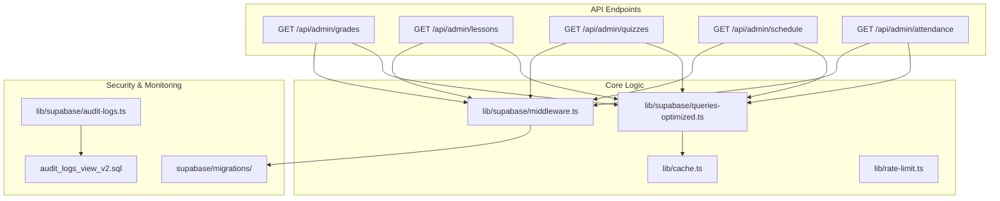
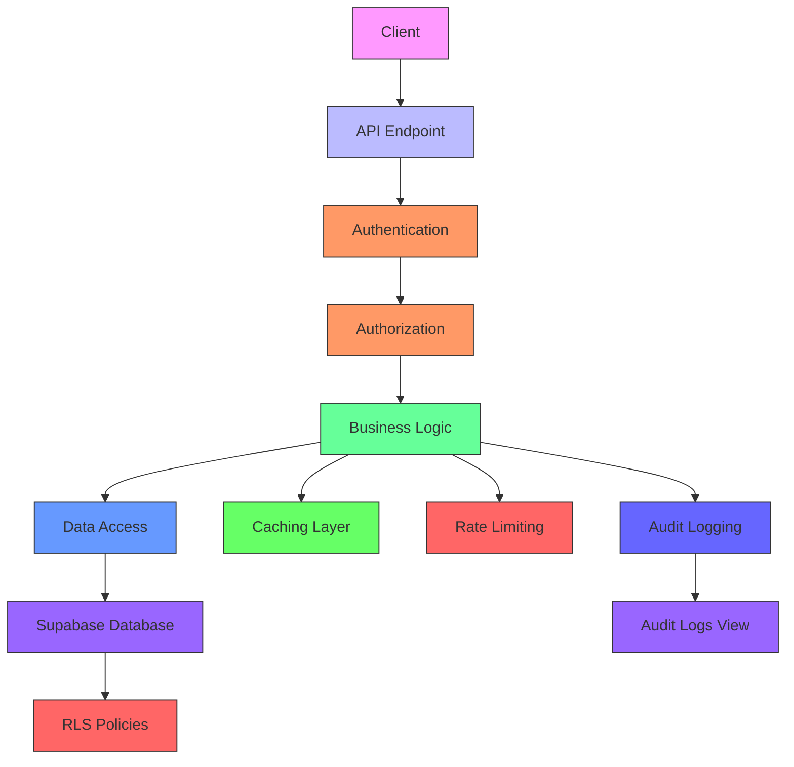
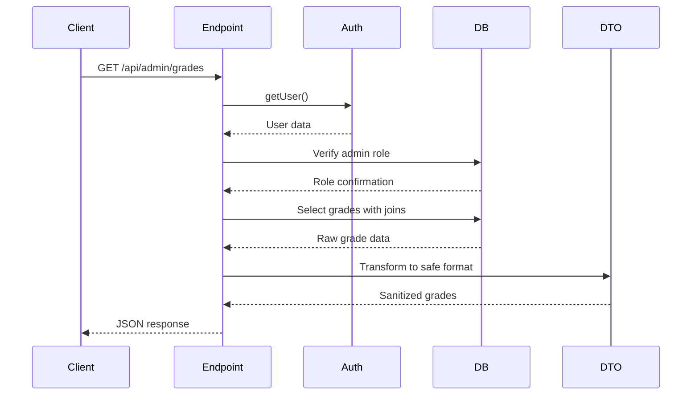
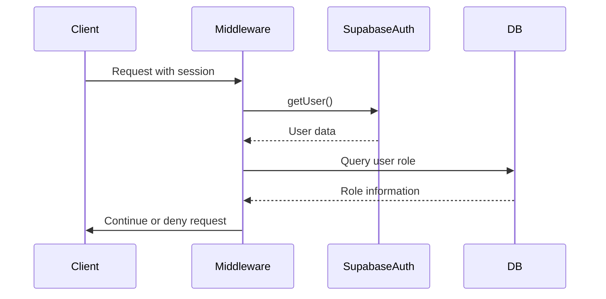
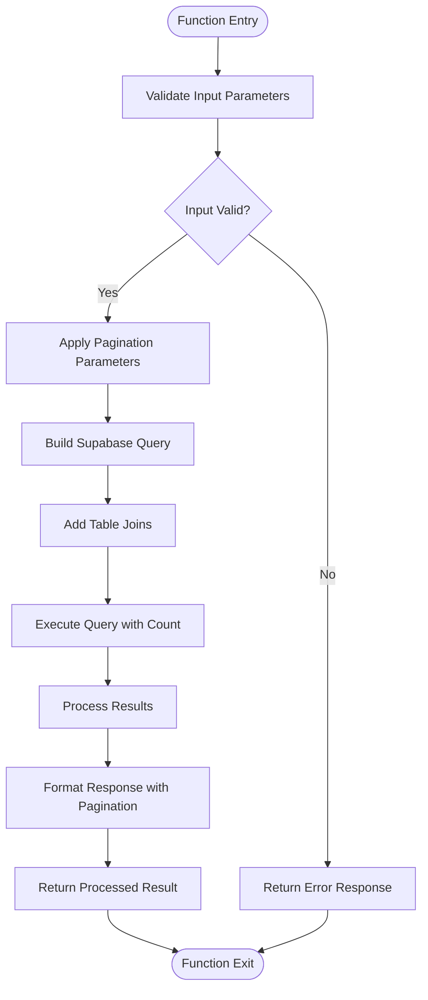
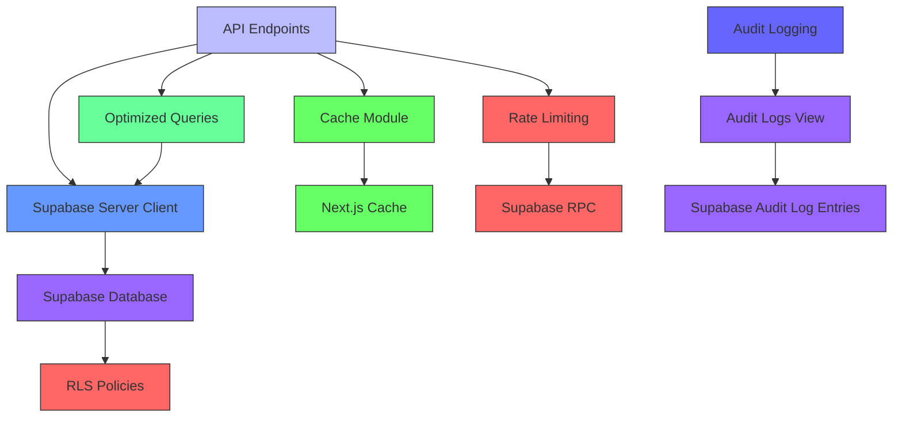

# Academic Data

<cite>
**Referenced Files in This Document**   
- [grades/route.ts](file://app/api/admin/grades/route.ts)
- [lessons/route.ts](file://app/api/admin/lessons/route.ts)
- [quizzes/route.ts](file://app/api/admin/quizzes/route.ts)
- [schedule/route.ts](file://app/api/admin/schedule/route.ts)
- [attendance/route.ts](file://app/api/admin/attendance/route.ts)
- [middleware.ts](file://lib/supabase/middleware.ts)
- [queries-optimized.ts](file://lib/supabase/queries-optimized.ts)
- [cache.ts](file://lib/cache.ts)
- [rate-limit.ts](file://lib/rate-limit.ts)
- [audit_logs_view_v2.sql](file://supabase/migrations/20260108132041_audit_logs_view_v2.sql)
- [audit-logs.ts](file://lib/supabase/audit-logs.ts)
- [types.ts](file://lib/supabase/types.ts)
</cite>

## Table of Contents
1. [Introduction](#introduction)
2. [Project Structure](#project-structure)
3. [Core Components](#core-components)
4. [Architecture Overview](#architecture-overview)
5. [Detailed Component Analysis](#detailed-component-analysis)
6. [Dependency Analysis](#dependency-analysis)
7. [Performance Considerations](#performance-considerations)
8. [Troubleshooting Guide](#troubleshooting-guide)
9. [Conclusion](#conclusion)

## Introduction
This document provides comprehensive API documentation for academic data access endpoints available to administrators in the School-Management-System. It covers the GET /api/admin/grades, /lessons, /quizzes, /schedule, and /attendance routes that allow bulk retrieval of academic records. The documentation details how these endpoints aggregate data across multiple tables using optimized views and Supabase RPCs defined in lib/supabase/queries-optimized.ts. It explains authentication via middleware in lib/supabase/middleware.ts and role-based access control ensuring only admins can access sensitive academic data. The document includes response structures with pagination support and filtering capabilities, usage examples such as generating report cards or auditing lesson plan coverage, security considerations including RLS policies in supabase/migrations/, audit logging of data access in audit_logs_view_v2.sql, and rate limiting via lib/rate-limit.ts. It also discusses performance optimizations for large-scale data queries and caching strategies using lib/cache.ts.

## Project Structure
The School-Management-System follows a Next.js App Router architecture with a clear separation of concerns. The API endpoints for academic data access are located in the app/api/admin directory, with each endpoint (grades, lessons, quizzes, schedule, attendance) having its own route.ts file. The core business logic for database interactions is encapsulated in the lib/supabase directory, which contains optimized queries, authentication utilities, and type definitions. Security policies are managed through Supabase migrations in the supabase/migrations directory, while caching and rate limiting utilities are implemented in the lib directory. The frontend components for administrators are organized in the app/admin directory, following a feature-based structure.

**Diagram sources**
- [grades/route.ts](file://app/api/admin/grades/route.ts)
- [lessons/route.ts](file://app/api/admin/lessons/route.ts)
- [quizzes/route.ts](file://app/api/admin/quizzes/route.ts)
- [schedule/route.ts](file://app/api/admin/schedule/route.ts)
- [attendance/route.ts](file://app/api/admin/attendance/route.ts)
- [queries-optimized.ts](file://lib/supabase/queries-optimized.ts)
- [middleware.ts](file://lib/supabase/middleware.ts)
- [cache.ts](file://lib/cache.ts)
- [rate-limit.ts](file://lib/rate-limit.ts)
- [audit_logs_view_v2.sql](file://supabase/migrations/20260108132041_audit_logs_view_v2.sql)
- [audit-logs.ts](file://lib/supabase/audit-logs.ts)

**Section sources**
- [app/api/admin](file://app/api/admin)
- [lib/supabase](file://lib/supabase)
- [supabase/migrations](file://supabase/migrations)

## Core Components
The core components of the academic data access system include the API endpoints for grades, lessons, quizzes, schedule, and attendance, each implemented as a GET route in the app/api/admin directory. These endpoints follow a consistent pattern of authentication, authorization, data retrieval, and response formatting. The data retrieval is optimized through the use of Supabase's select method with foreign key expansions to aggregate data from multiple tables in a single query. The response data is sanitized using a DTO pattern to ensure only necessary fields are exposed. The endpoints leverage optimized queries from lib/supabase/queries-optimized.ts for complex operations and pagination support. Authentication is handled by the Supabase auth system, with role-based access control implemented through database queries to verify admin privileges.

**Section sources**
- [grades/route.ts](file://app/api/admin/grades/route.ts)
- [lessons/route.ts](file://app/api/admin/lessons/route.ts)
- [quizzes/route.ts](file://app/api/admin/quizzes/route.ts)
- [schedule/route.ts](file://app/api/admin/schedule/route.ts)
- [attendance/route.ts](file://app/api/admin/attendance/route.ts)
- [queries-optimized.ts](file://lib/supabase/queries-optimized.ts)

## Architecture Overview
The academic data access architecture is built on a Next.js App Router with Supabase as the backend-as-a-service. The system follows a layered architecture with clear separation between API endpoints, business logic, and data access. API endpoints in app/api/admin handle HTTP requests and responses, delegating authentication and authorization to middleware and business logic to utility functions. The business logic layer in lib/supabase contains optimized queries that leverage Supabase's real-time database capabilities and foreign key relationships to aggregate data efficiently. Security is enforced through Row Level Security (RLS) policies in the database, supplemented by application-level checks. Caching is implemented at multiple levels, including in-memory caching for frequently accessed data and Next.js server-side caching for dashboard components. Rate limiting is applied to prevent abuse, with audit logging capturing all data access for compliance and security monitoring.

**Diagram sources**
- [middleware.ts](file://lib/supabase/middleware.ts)
- [queries-optimized.ts](file://lib/supabase/queries-optimized.ts)
- [cache.ts](file://lib/cache.ts)
- [rate-limit.ts](file://lib/rate-limit.ts)
- [audit-logs.ts](file://lib/supabase/audit-logs.ts)
- [audit_logs_view_v2.sql](file://supabase/migrations/20260108132041_audit_logs_view_v2.sql)

## Detailed Component Analysis

### Academic Data Endpoints Analysis
The academic data endpoints follow a consistent implementation pattern across grades, lessons, quizzes, schedule, and attendance. Each endpoint begins with authentication via Supabase's getUser method, followed by role verification to ensure only administrators can access the data. The data retrieval uses Supabase's select method with foreign key expansions to join related tables and aggregate data in a single query. For example, the grades endpoint joins the grades table with users and classes tables to include student names and class information in the response. The response data is processed through a DTO pattern to sanitize and format the data before sending it to the client. Error handling is implemented with try-catch blocks to provide meaningful error messages while preventing information leakage.

#### For API/Service Components:

**Diagram sources**
- [grades/route.ts](file://app/api/admin/grades/route.ts)
- [lessons/route.ts](file://app/api/admin/lessons/route.ts)
- [quizzes/route.ts](file://app/api/admin/quizzes/route.ts)
- [schedule/route.ts](file://app/api/admin/schedule/route.ts)
- [attendance/route.ts](file://app/api/admin/attendance/route.ts)

**Section sources**
- [grades/route.ts](file://app/api/admin/grades/route.ts)
- [lessons/route.ts](file://app/api/admin/lessons/route.ts)
- [quizzes/route.ts](file://app/api/admin/quizzes/route.ts)
- [schedule/route.ts](file://app/api/admin/schedule/route.ts)
- [attendance/route.ts](file://app/api/admin/attendance/route.ts)

### Authentication and Authorization Analysis
The authentication and authorization system is implemented through Supabase's built-in authentication and a custom middleware. The middleware in lib/supabase/middleware.ts handles session management and user authentication, using Supabase's server-side client to verify user sessions. Role-based access control is implemented at the application level by querying the users table to verify the user's role. This approach provides an additional security layer beyond Supabase's Row Level Security policies, ensuring that only users with the "admin" role can access sensitive academic data. The system uses both client-side and server-side authentication checks to provide defense in depth.

#### For API/Service Components:

**Diagram sources**
- [middleware.ts](file://lib/supabase/middleware.ts)

**Section sources**
- [middleware.ts](file://lib/supabase/middleware.ts)

### Optimized Queries Analysis
The optimized queries in lib/supabase/queries-optimized.ts provide enhanced performance for data retrieval operations. These queries implement pagination, caching, and performance improvements over the basic queries. The pagination system uses Supabase's range method with page and pageSize parameters to limit result sets and improve response times. The queries also include count retrieval with exact counts for accurate pagination information. For complex aggregations, the optimized queries use Supabase's join capabilities to retrieve related data in a single query, reducing the N+1 query problem. The file also includes specialized functions for dashboard statistics that use parallel queries to retrieve multiple data points efficiently.

#### For Complex Logic Components:

**Diagram sources**
- [queries-optimized.ts](file://lib/supabase/queries-optimized.ts)

**Section sources**
- [queries-optimized.ts](file://lib/supabase/queries-optimized.ts)

## Dependency Analysis
The academic data access system has a well-defined dependency structure with clear boundaries between components. The API endpoints depend on the Supabase server client for database access and authentication, the optimized queries module for complex data retrieval operations, and the cache module for performance optimization. The authentication system depends on Supabase's authentication service and the database for role verification. The caching system is used by both the API endpoints and the dashboard components to reduce database load and improve response times. The rate limiting system depends on Supabase's RPC functions for atomic rate limit checks. The audit logging system depends on the database view for consolidated log data and the Supabase audit log entries table.

**Diagram sources**
- [grades/route.ts](file://app/api/admin/grades/route.ts)
- [lessons/route.ts](file://app/api/admin/lessons/route.ts)
- [quizzes/route.ts](file://app/api/admin/quizzes/route.ts)
- [schedule/route.ts](file://app/api/admin/schedule/route.ts)
- [attendance/route.ts](file://app/api/admin/attendance/route.ts)
- [middleware.ts](file://lib/supabase/middleware.ts)
- [queries-optimized.ts](file://lib/supabase/queries-optimized.ts)
- [cache.ts](file://lib/cache.ts)
- [rate-limit.ts](file://lib/rate-limit.ts)
- [audit-logs.ts](file://lib/supabase/audit-logs.ts)
- [audit_logs_view_v2.sql](file://supabase/migrations/20260108132041_audit_logs_view_v2.sql)

**Section sources**
- [app/api/admin](file://app/api/admin)
- [lib/supabase](file://lib/supabase)
- [supabase/migrations](file://supabase/migrations)

## Performance Considerations
The academic data access system implements several performance optimizations to handle large-scale data queries efficiently. The primary optimization is the use of pagination in all data retrieval operations, with default page sizes of 50 records and configurable limits. The optimized queries leverage Supabase's ability to perform server-side joins and aggregations, reducing the need for multiple round trips to the database. Caching is implemented at multiple levels, including in-memory caching for frequently accessed data with a 30-second TTL and Next.js server-side caching for dashboard components with revalidation intervals. The system also uses Supabase's count functionality with exact counts to provide accurate pagination information without performance penalties. For dashboard statistics, the system uses parallel queries to retrieve multiple data points simultaneously, reducing overall response time.

**Section sources**
- [queries-optimized.ts](file://lib/supabase/queries-optimized.ts)
- [cache.ts](file://lib/cache.ts)

## Troubleshooting Guide
When troubleshooting issues with the academic data access endpoints, consider the following common scenarios:

1. **Authentication failures**: Verify that the user is properly authenticated and has a valid session. Check that the Supabase client is correctly configured with the appropriate environment variables.

2. **Authorization errors**: Ensure that the user has the "admin" role in the users table. The role verification is performed by querying the users table, so any discrepancies in the role field will prevent access.

3. **Slow query performance**: For large datasets, ensure that pagination is being used with appropriate page sizes. Check that the optimized queries are being used rather than basic queries. Verify that caching is working correctly by checking the cache TTL settings.

4. **Rate limiting issues**: If requests are being blocked, check the rate limit configuration in lib/rate-limit.ts. The system uses Supabase's RPC functions for rate limiting, so ensure that the service role key is correctly configured.

5. **Data consistency problems**: Verify that the database schema matches the expected structure, particularly the foreign key relationships used in the join queries. Check that the RLS policies are correctly configured to allow the necessary data access.

6. **Caching issues**: If stale data is being returned, check the cache invalidation logic. The system provides functions to invalidate specific cache entries or clear the entire cache when data is updated.

**Section sources**
- [middleware.ts](file://lib/supabase/middleware.ts)
- [queries-optimized.ts](file://lib/supabase/queries-optimized.ts)
- [cache.ts](file://lib/cache.ts)
- [rate-limit.ts](file://lib/rate-limit.ts)

## Conclusion
The academic data access system in the School-Management-System provides a secure and efficient way for administrators to retrieve bulk academic records. The system follows best practices for API design, with consistent patterns for authentication, authorization, and data retrieval. The use of optimized queries and caching strategies ensures good performance even with large datasets. Security is enforced through multiple layers, including Supabase's Row Level Security policies, application-level role verification, and rate limiting. The system is well-documented and maintainable, with clear separation of concerns and comprehensive error handling. Future enhancements could include more advanced filtering options, real-time data updates through Supabase's real-time capabilities, and improved audit logging with more detailed action tracking.