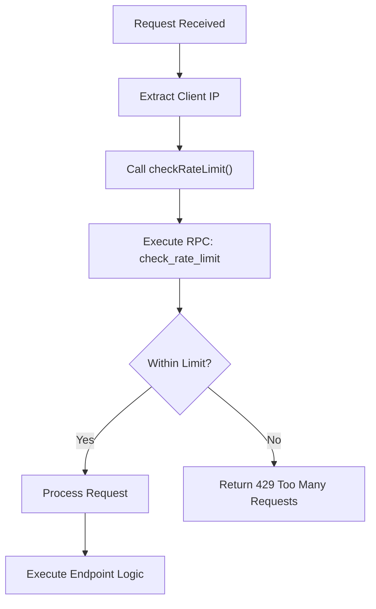
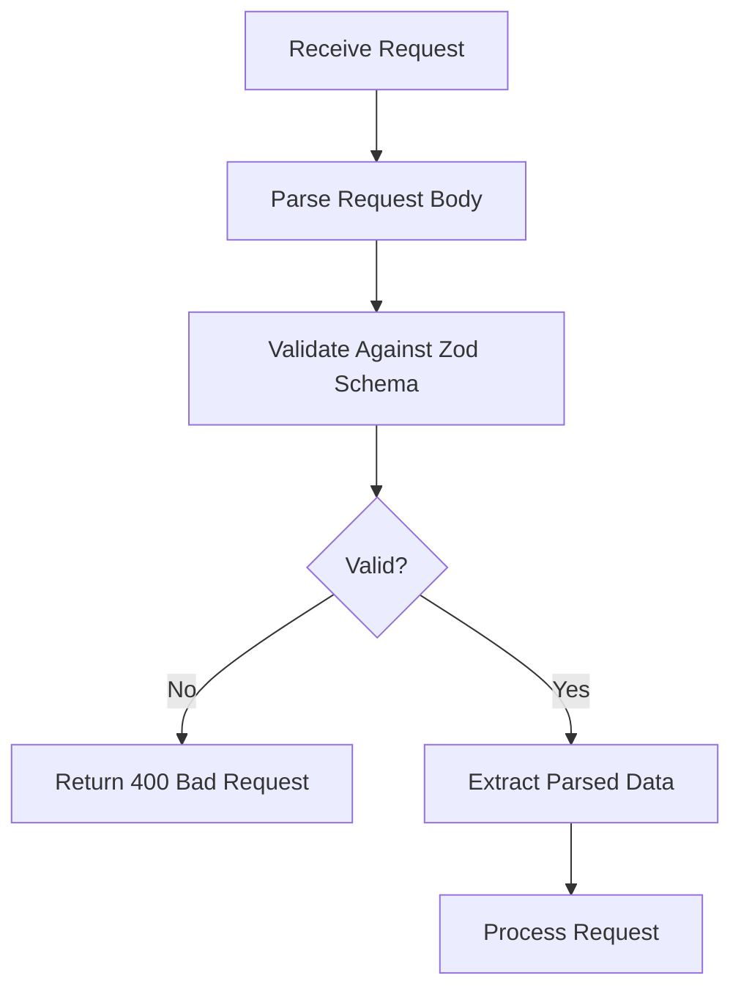

# Admin API Endpoints

<cite>
**Referenced Files in This Document**   
- [create-user/route.ts](file://app/api/admin/create-user/route.ts)
- [get-users/route.ts](file://app/api/admin/get-users/route.ts)
- [toggle-user-status/route.ts](file://app/api/admin/toggle-user-status/route.ts)
- [create-class/route.ts](file://app/api/admin/create-class/route.ts)
- [enroll-student/route.ts](file://app/api/admin/enroll-student/route.ts)
- [unenroll-student/route.ts](file://app/api/admin/unenroll-student/route.ts)
- [grades/route.ts](file://app/api/admin/grades/route.ts)
- [lessons/route.ts](file://app/api/admin/lessons/route.ts)
- [quizzes/route.ts](file://app/api/admin/quizzes/route.ts)
- [schedule/route.ts](file://app/api/admin/schedule/route.ts)
- [settings/update/route.ts](file://app/api/admin/settings/update/route.ts)
- [rate-limit.ts](file://lib/rate-limit.ts)
- [api-errors.ts](file://lib/api-errors.ts)
- [validation-schemas.ts](file://lib/validation-schemas.ts)
- [audit_logs_view_v2.sql](file://supabase/migrations/audit_logs_view_v2.sql)
</cite>

## Table of Contents
1. [Introduction](#introduction)
2. [Authentication and Authorization](#authentication-and-authorization)
3. [Rate Limiting](#rate-limiting)
4. [Error Handling](#error-handling)
5. [Input Validation](#input-validation)
6. [Security and Audit Logging](#security-and-audit-logging)
7. [User Management Endpoints](#user-management-endpoints)
8. [Class Management Endpoints](#class-management-endpoints)
9. [Academic Data Access Endpoints](#academic-data-access-endpoints)
10. [System Settings Endpoints](#system-settings-endpoints)

## Introduction
This document provides comprehensive documentation for all admin-specific API endpoints in the School-Management-System. The endpoints are organized under the `/api/admin` route and are accessible only to authenticated users with the "admin" role. These endpoints enable administrative functions such as user management, class operations, academic data access, and system configuration. Each endpoint enforces strict security measures including authentication, role validation, rate limiting, input validation, and audit logging.

## Authentication and Authorization
All admin endpoints require valid authentication and admin role verification. The middleware chain performs the following steps:

1. **Authentication**: Validates the user's session token via Supabase Auth
2. **Role Verification**: Queries the `users` table to confirm the user has the "admin" role
3. **Access Control**: Denies access if either authentication fails or the user lacks admin privileges

The authorization check is implemented consistently across all admin endpoints using server-side role verification from the `users` table.

**Section sources**
- [create-user/route.ts](file://app/api/admin/create-user/route.ts#L23-L47)
- [get-users/route.ts](file://app/api/admin/get-users/route.ts#L13-L22)
- [toggle-user-status/route.ts](file://app/api/admin/toggle-user-status/route.ts#L24-L33)

## Rate Limiting
The system implements rate limiting using `lib/rate-limit.ts` to prevent abuse of admin endpoints. The rate limiting mechanism:

- Uses the client's IP address as the identifier
- Leverages Supabase's RPC function `check_rate_limit` for atomic operations
- Bypasses Row Level Security (RLS) by using the Service Role Key
- Supports configurable limits and time windows
- Implements fail-open behavior by default, except for security-critical endpoints



**Diagram sources**
- [rate-limit.ts](file://lib/rate-limit.ts#L25-L56)
- [create-user/route.ts](file://app/api/admin/create-user/route.ts#L15-L21)

## Error Handling
Centralized error handling is implemented in `lib/api-errors.ts` to ensure consistent and secure error responses. The system:

- Never exposes raw error messages to clients
- Logs full error details server-side for debugging
- Returns generic error messages to prevent information disclosure
- Provides standardized error response formats
- Handles various error types (validation, authorization, rate limiting, etc.)

The `handleApiError` function is used to process unexpected errors, while `ApiErrors` provides predefined responses for common scenarios.

**Section sources**
- [api-errors.ts](file://lib/api-errors.ts#L21-L69)
- [toggle-user-status/route.ts](file://app/api/admin/toggle-user-status/route.ts#L60)

## Input Validation
Input validation is performed using Zod schemas defined in `lib/validation-schemas.ts`. The validation system:

- Ensures data integrity and prevents injection attacks
- Validates all incoming request payloads
- Provides detailed error messages for invalid inputs
- Uses schema parsing with safeParse for graceful error handling
- Implements server-side validation as a security boundary



**Diagram sources**
- [validation-schemas.ts](file://lib/validation-schemas.ts#L1-L126)
- [toggle-user-status/route.ts](file://app/api/admin/toggle-user-status/route.ts#L35-L43)

## Security and Audit Logging
The system implements multiple security layers:

- **Row Level Security (RLS)**: Database policies in Supabase enforce data access controls
- **Audit Logging**: Sensitive operations are logged in `audit_logs_view_v2.sql`
- **Input Sanitization**: Prevents SQL injection and XSS attacks
- **Password Security**: Enforces 12-character passwords with complexity requirements
- **Self-Modification Prevention**: Admins cannot disable their own accounts

The audit log system captures critical admin actions for compliance and security monitoring.

**Section sources**
- [supabase/migrations/audit_logs_view_v2.sql](file://supabase/migrations/audit_logs_view_v2.sql)
- [create-user/route.ts](file://app/api/admin/create-user/route.ts#L46-L48)

## User Management Endpoints

### Create User
Creates a new user account with specified role and profile information.

- **HTTP Method**: POST
- **URL**: `/api/admin/create-user`
- **Authentication**: Required (Admin role)
- **Rate Limit**: 10 requests per 10 minutes per IP

#### Request Body Schema
```json
{
  "email": "string (required, valid email)",
  "password": "string (optional, 12+ chars with complexity)",
  "name": "string (required)",
  "role": "string (required, one of: student, teacher, admin)",
  "lrn": "string (optional, for students)",
  "subject": "string (optional, for teachers)",
  "department": "string (optional, for teachers)",
  "phone": "string (optional)",
  "address": "string (optional)"
}
```

#### Response Format (Success)
```json
{
  "success": true,
  "user": {
    "id": "string",
    "email": "string",
    "name": "string",
    "role": "string",
    "created_at": "string (ISO date)"
  },
  "password": "string (only when auto-generated)"
}
```

#### Error Codes
- `400`: Invalid request (missing fields, invalid email, weak password)
- `401`: Unauthorized (no valid session)
- `403`: Forbidden (user not admin)
- `429`: Too many requests
- `500`: Internal server error

#### Usage Example
```bash
curl -X POST /api/admin/create-user \
  -H "Content-Type: application/json" \
  -d '{
    "email": "john.doe@example.com",
    "name": "John Doe",
    "role": "teacher",
    "subject": "Mathematics"
  }'
```

**Section sources**
- [create-user/route.ts](file://app/api/admin/create-user/route.ts#L8-L156)

### Get Users
Retrieves a paginated list of all users in the system.

- **HTTP Method**: GET
- **URL**: `/api/admin/get-users`
- **Authentication**: Required (Admin role)
- **Query Parameters**:
  - `page`: Page number (default: 1)
  - `limit`: Items per page (default: 50, max: 100)

#### Response Format (Success)
```json
{
  "users": [
    {
      "id": "string",
      "email": "string",
      "name": "string",
      "role": "string",
      "created_at": "string (ISO date)",
      "is_active": "boolean"
    }
  ],
  "total": "number",
  "page": "number",
  "limit": "number"
}
```

#### Error Codes
- `401`: Unauthorized (no valid session)
- `403`: Forbidden (user not admin)
- `500`: Internal server error

#### Usage Example
```bash
curl "/api/admin/get-users?page=1&limit=25"
```

**Section sources**
- [get-users/route.ts](file://app/api/admin/get-users/route.ts#L4-L59)

### Toggle User Status
Activates or deactivates a user account.

- **HTTP Method**: POST
- **URL**: `/api/admin/toggle-user-status`
- **Authentication**: Required (Admin role)

#### Request Body Schema
```json
{
  "userId": "string (required, valid UUID)",
  "status": "boolean (required, true=active, false=inactive)"
}
```

#### Response Format (Success)
```json
{
  "success": true
}
```

#### Error Codes
- `400`: Invalid parameters or attempting to modify own account
- `401`: Unauthorized (no valid session)
- `403`: Forbidden (user not admin)
- `500`: Internal server error

#### Usage Example
```bash
curl -X POST /api/admin/toggle-user-status \
  -H "Content-Type: application/json" \
  -d '{
    "userId": "a1b2c3d4-e5f6-7890-g1h2-i3j4k5l6m7n8",
    "status": false
  }'
```

**Section sources**
- [toggle-user-status/route.ts](file://app/api/admin/toggle-user-status/route.ts#L15-L62)

## Class Management Endpoints

### Create Class
Creates a new class with schedule information.

- **HTTP Method**: POST
- **URL**: `/api/admin/create-class`
- **Authentication**: Required (Admin role)
- **Rate Limit**: 10 requests per minute per IP

#### Request Body Schema
```json
{
  "name": "string (required)",
  "grade": "string",
  "section": "string",
  "subject": "string (required)",
  "teacher_id": "string (UUID)",
  "room": "string",
  "scheduleDays": "string (e.g., 'MWF', 'TTh')",
  "scheduleTime": "string (e.g., '9:00 AM')"
}
```

#### Response Format (Success)
```json
{
  "success": true,
  "class": {
    "id": "string",
    "name": "string",
    "grade": "string",
    "section": "string",
    "subject": "string",
    "teacher_id": "string",
    "room": "string",
    "schedule": "string"
  }
}
```

#### Error Codes
- `400`: Missing required fields
- `401`: Unauthorized (no valid session)
- `403`: Forbidden (user not admin)
- `429`: Too many requests
- `500`: Internal server error

#### Usage Example
```bash
curl -X POST /api/admin/create-class \
  -H "Content-Type: application/json" \
  -d '{
    "name": "Mathematics 10",
    "grade": "10",
    "section": "A",
    "subject": "Mathematics",
    "teacher_id": "a1b2c3d4-e5f6-7890-g1h2-i3j4k5l6m7n8",
    "scheduleDays": "MWF",
    "scheduleTime": "9:00 AM"
  }'
```

**Section sources**
- [create-class/route.ts](file://app/api/admin/create-class/route.ts#L28-L113)

### Enroll Student
Enrolls a student in a class.

- **HTTP Method**: POST
- **URL**: `/api/admin/enroll-student`
- **Authentication**: Required (Admin role)

#### Request Body Schema
```json
{
  "studentId": "string (required, UUID)",
  "classId": "string (required, UUID)"
}
```

#### Response Format (Success)
```json
{
  "success": true
}
```

#### Error Codes
- `400`: Missing studentId or classId
- `401`: Unauthorized (no valid session)
- `403`: Forbidden (user not admin)
- `500`: Internal server error

#### Usage Example
```bash
curl -X POST /api/admin/enroll-student \
  -H "Content-Type: application/json" \
  -d '{
    "studentId": "a1b2c3d4-e5f6-7890-g1h2-i3j4k5l6m7n8",
    "classId": "b2c3d4e5-f6g7-8901-h2i3-j4k5l6m7n8o9"
  }'
```

**Section sources**
- [enroll-student/route.ts](file://app/api/admin/enroll-student/route.ts#L4-L43)

### Unenroll Student
Removes a student from a class.

- **HTTP Method**: POST
- **URL**: `/api/admin/unenroll-student`
- **Authentication**: Required (Admin role)

#### Request Body Schema
```json
{
  "enrollmentId": "string (required, UUID of class_students record)"
}
```

#### Response Format (Success)
```json
{
  "success": true
}
```

#### Error Codes
- `400`: Missing enrollmentId
- `401`: Unauthorized (no valid session)
- `403`: Forbidden (user not admin)
- `500`: Internal server error

#### Usage Example
```bash
curl -X POST /api/admin/unenroll-student \
  -H "Content-Type: application/json" \
  -d '{
    "enrollmentId": "c3d4e5f6-g7h8-9012-i3j4-k5l6m7n8o9p0"
  }'
```

**Section sources**
- [unenroll-student/route.ts](file://app/api/admin/unenroll-student/route.ts#L4-L39)

## Academic Data Access Endpoints

### Grades
Retrieves all grades with student and class information.

- **HTTP Method**: GET
- **URL**: `/api/admin/grades`
- **Authentication**: Required (Admin role)

#### Response Format (Success)
```json
{
  "grades": [
    {
      "id": "string",
      "student_id": "string",
      "student_name": "string",
      "class_id": "string",
      "class_name": "string",
      "subject": "string",
      "score": "number",
      "max_score": "number",
      "percentage": "number",
      "grade": "string",
      "type": "string",
      "date": "string (ISO date)"
    }
  ]
}
```

#### Error Codes
- `401`: Unauthorized (no valid session)
- `403`: Forbidden (user not admin)
- `500`: Internal server error

#### Usage Example
```bash
curl /api/admin/grades
```

**Section sources**
- [grades/route.ts](file://app/api/admin/grades/route.ts#L4-L57)

### Lessons
Retrieves all lessons with associated materials and teacher information.

- **HTTP Method**: GET
- **URL**: `/api/admin/lessons`
- **Authentication**: Required (Admin role)

#### Response Format (Success)
```json
{
  "lessons": [
    {
      "id": "string",
      "title": "string",
      "description": "string",
      "class_id": "string",
      "class": {
        "name": "string"
      },
      "teacher": {
        "name": "string"
      },
      "materials": [
        {
          "id": "string",
          "name": "string",
          "type": "string",
          "url": "string"
        }
      ]
    }
  ]
}
```

#### Error Codes
- `401`: Unauthorized (no valid session)
- `403`: Forbidden (user not admin)
- `500`: Internal server error

#### Usage Example
```bash
curl /api/admin/lessons
```

**Section sources**
- [lessons/route.ts](file://app/api/admin/lessons/route.ts#L4-L39)

### Quizzes
Retrieves all quizzes with class and teacher information.

- **HTTP Method**: GET
- **URL**: `/api/admin/quizzes`
- **Authentication**: Required (Admin role)

#### Response Format (Success)
```json
{
  "quizzes": [
    {
      "id": "string",
      "title": "string",
      "description": "string",
      "duration": "number",
      "due_date": "string (ISO date)",
      "status": "string",
      "class_id": "string",
      "class": {
        "name": "string"
      },
      "teacher": {
        "name": "string"
      },
      "questions": [
        {
          "id": "string"
        }
      ]
    }
  ]
}
```

#### Error Codes
- `401`: Unauthorized (no valid session)
- `403`: Forbidden (user not admin)
- `500`: Internal server error

#### Usage Example
```bash
curl /api/admin/quizzes
```

**Section sources**
- [quizzes/route.ts](file://app/api/admin/quizzes/route.ts#L4-L39)

### Schedule
Retrieves the complete class schedule with teacher information.

- **HTTP Method**: GET
- **URL**: `/api/admin/schedule`
- **Authentication**: Required (Admin role)

#### Response Format (Success)
```json
{
  "schedules": [
    {
      "id": "string",
      "day": "string",
      "start_time": "string (HH:MM:SS)",
      "end_time": "string (HH:MM:SS)",
      "room": "string",
      "class": {
        "name": "string",
        "subject": "string",
        "teacher": {
          "name": "string"
        }
      }
    }
  ]
}
```

#### Error Codes
- `401`: Unauthorized (no valid session)
- `403`: Forbidden (user not admin)
- `500`: Internal server error

#### Usage Example
```bash
curl /api/admin/schedule
```

**Section sources**
- [schedule/route.ts](file://app/api/admin/schedule/route.ts#L4-L40)

## System Settings Endpoints

### Update Settings
Updates school-wide settings such as name, location, and geofencing radius.

- **HTTP Method**: POST
- **URL**: `/api/admin/settings/update`
- **Authentication**: Required (Admin role)

#### Request Body Schema
```json
{
  "name": "string (1-100 characters)",
  "latitude": "number (-90 to 90)",
  "longitude": "number (-180 to 180)",
  "radiusMeters": "number (10-5000)"
}
```

#### Response Format (Success)
```json
{
  "success": true
}
```

#### Error Codes
- `400`: Invalid input parameters
- `401`: Unauthorized (no valid session)
- `403`: Forbidden (user not admin)
- `500`: Internal server error

#### Usage Example
```bash
curl -X POST /api/admin/settings/update \
  -H "Content-Type: application/json" \
  -d '{
    "name": "Central High School",
    "latitude": 40.7128,
    "longitude": -74.0060,
    "radiusMeters": 500
  }'
```

**Section sources**
- [settings/update/route.ts](file://app/api/admin/settings/update/route.ts#L13-L61)